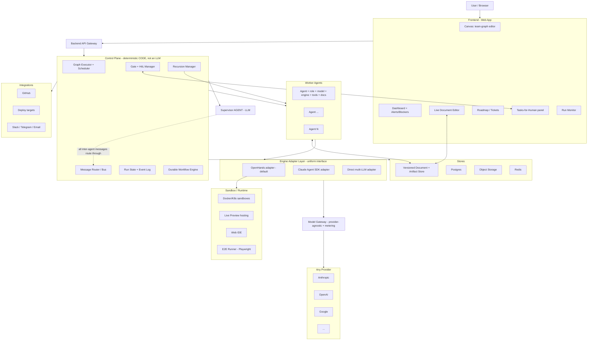
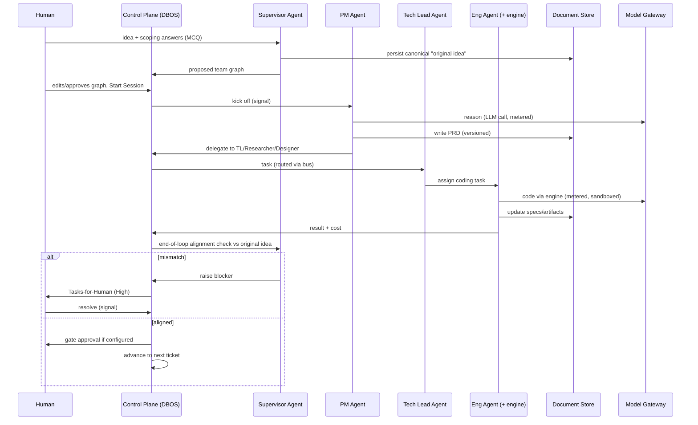
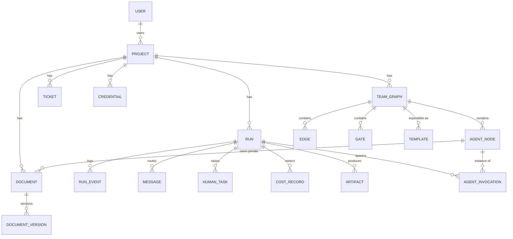

# Tvashtr — Project Plan

> **Living document.** The single source of truth for scope, architecture, decisions, and build sequence.
> Maintained by the architect/planner chat (Tvashtr-N) via direct filesystem access. Updated at the end of each step and before every handover.
>
> **Last updated:** 2026-06-24 — **Tvashtr-21: §14.3 (the A/B comparison view) SHIPPED + FF-merged (`main` @ `1353893`) — §14 (the team A/B "which config ships better" attributability instrument) COMPLETE.** READ + FE only — the `git merge --ff-only` diff-stat (the authoritative file-set gate) is 14 files, the only backend product file `routers.py`, **nothing** under `control_plane/`/`models.py`/`engines/`/`alembic/versions/` (no migration, head stays `0011`; no executor change). A new `GET /api/ab-runs/{pair_id}` returns one `side` per run sharing the `pair_id` (ordered A→B, `team_shape` **derived from the graph** not the label; per-side terminal status/ship/cost/idea + DBOS `workflow_status` + the `review_loop` side's per-round verdict labels & the persisted `outcome_detail` reasons; **tolerates a `<2`-run pair** — renders the present side, 404 only on zero rows, 400 on a bad UUID — the §15 non-atomic-launch caveat) + an additive `outcome_detail` on the graph endpoint's invocations. FE: a pure `abCompare.ts` whose `abHeadline` reads the delta from **terminal outcome + review effort + cost, never the ship sha** (two runs always ship distinct commits) — honest "no measurable delta" / "the gate caught something" / divergence branches; a polled `ABCompare` view; a **state-only** "Single run | A/B compare" toggle (no router — the single-run tree byte-identical in single mode); and the persisted reasons folded into §14.1's `ReviewerView` (under each `changes_requested` round). **171 offline + 67 vitest green, ruff clean**; architect disk-audit zero-blocking (new endpoint + tests + the do-not-touch spot-check + the FE pure logic + the App.tsx single-run-unchanged check all read on disk), the FF diff-stat git-confirming the file-set; on `feat/p1.5c-ab-comparison` (`b420da8`), operator FF-merged. One §15 deferral logged (the A/B view has no in-UI cancel for an in-flight pair — benign for v1). **Operator visual smoke is the remaining gate** (auto-approve gates + docker + NIM → the honest no-measurable-delta on the trivial idea; the reasons render on a `FORCE_REVISIONS=1` run). **With §14 done, next is the §13 "value-proven" path: P1.8 Supervisor-first onboarding + P1.7 living-document steering, ahead of P1.6 WebSocket polish.** **Prior — Tvashtr-20: §14.2 (the team A/B pair + launch) AND the verdict-reasons persistence (migration `0011`) — BOTH SHIPPED + FF-merged (`main` @ `7bf5e14`).** §14.2: a new `POST /api/ab-runs` fans ONE idea into TWO paired runs (A=`two_node` no-review / B=`review_loop` agent-Reviewer) sharing a nullable `pair_id`/`pair_label` on `Run` (migration `0010`, additive, frozen head untouched), each its own `SetWorkflowID(run_id)` workflow mirroring `create_run` — NO executor change (git FF diff-stat 5 files). The HANDOVER §4 fork was settled by **isolating the verdict-reasons persistence** (the one migration+executor seam) out of §14.2; that seam then **shipped this same session** — migration `0011` adds a nullable `agent_invocations.outcome_detail` (Text), and ONE surgical `team_run.py` call-site (the Reviewer's successful close) persists `verdict["reasons"]` into it (the other 10 `close_invocation_step` calls byte-identical; git FF diff-stat 6 files; executor flow + frozen migrations `0001`–`0010` untouched). Both audited vs pre-change baselines + the authoritative git FF diff-stat, zero-blocking. **`167` offline tests** (161→+6 across the two milestones), ruff clean, alembic head `0011`. **Only §14.3 (the comparison view — reads `pair_id` + the per-round verdict labels & reasons) now remains of §14; NEXT (Tvashtr-21): §14.3.** **Prior — Tvashtr-19: §14.1 (the per-round reviewer-verdict view) SHIPPED + FF-merged (`main` @ `3f02189`); the CLI `/goal` + `--dangerously-skip-permissions` execution model is now LIVE & guarded.** The two Tvashtr-18 capstone branches were architect-verified (refs + reflog) and FF-merged (`86a6685` → `b8a470e`); the deferred Tvashtr-18 §17 record was formalized. The operator chose the **CLI `/goal` loop + bypass**, so the bypass-safety was stood up FIRST: the **no-push guard was converted from an (inert-under-bypass) `permissions.deny` rule to a `PreToolUse(Bash)` hook** (`protect-no-push.sh`, a `shlex`-segment matcher blocking `git push`/`--force`/`reset --hard`); the implementer **hardened it beyond the brief's `-C`-only spec** (architect-ratified — `-C`-only was bypassable via `git --git-dir /x push`), proven by 28/28 hook tests + a live bypass block (`6f0f6b9`). A disk-audit then caught that the **Tvashtr-18 CLI contract was untracked** — `protect-migrations.sh` + `CLI-RULES.md` / `CLI-SETUP.md` (+ the no-push-hook prompt) committed (`82d0eab`), so the operating contract is genuinely versioned. **§14** (the A/B attributability instrument) was scoped + decomposed (§14.1 verdict view → §14.2 A/B pair+launch + migration `0010` + reasons → §14.3 comparison view), and **§14.1 shipped via the first bypass `/goal`**: a pure read/render of the already-persisted `AgentInvocation.outcome` (**NO migration, NO executor change** — verified on disk), adding an additive per-node `invocations` list (sorted ascending) to the graph endpoint + the `ReviewerView` per-round verdict history (`reviewerVerdictLabel`, token-only CSS, a non-vacuous ordering test); **161 offline tests, vitest 43**, architect disk-audit zero-blocking, FF-merged `3f02189`. **Execution-model clarification (memory #5, supersedes #2's brief-default):** a lean `/goal` per milestone (outcome + invariants + acceptance), the agent self-decomposes, the architect audits on disk; scope each `/goal` to a full bounded milestone (bigger than the old per-prompt slices, but ONE transcript-verifiable milestone). **Next (Tvashtr-20): scope + ship §14.2** (the A/B pair + launch + the verdict-reasons persistence) — open call teed up: do the reasons-persistence (a migration + an executor change — the one freeze-guarded risk seam) as its OWN milestone, or fold it into the pair/launch. **Prior — Tvashtr-18: P1.5c STEP 2 COMPLETE — the M1 CAPSTONE is PROVEN; execution PIVOTED to the Claude Code CLI `/goal` loop.** Two branches architect-verified + FF-merged to `main` (`feat/p1.5c-provider-routing` `86a6685` → `feat/p1.5c-capstone-live` `b8a470e`). The **real stdlib task-list feature** (`TASK_LIST_IDEA` in `config.py`, env-overridable `TVASHTR_TASK_IDEA`, seeded into `Run.idea` — NO migration; a pure `overdue_check(due_date, reference_date)` with the `==`→False boundary + a required `unittest` suite so the Reviewer can grade it) ran end-to-end on **`make loop-feature-docker`** (**DOCKER** sandbox, `FEATURE_RUN=1`, NO forced-revisions): PM → **real Engineer multi-file build** → **real agent-Reviewer ran `python -B -m unittest` on the build** → verdict `approved` → Control Plane **harvested + removed `REVIEW_VERDICT.json`** → **shipped on green** (run completed, tag `ship-f08d1e56…`). The agent-Reviewer genuinely judged real code on the containerized substrate — **the M1 thesis, demonstrated**; the non-vacuous-proof guard was honored (docker, not host-local). **Provider-agnostic routing (D9)** extended in `config.py`'s new pure `_direct_agent_api_key(model)`: `gemini/`→`GEMINI_API_KEY`, `groq/`→`GROQ_*`, `nvidia_nim/`→`NVIDIA_BUILD_API_KEY`, else `OPENROUTER_API_KEY` (proxy-ON branch UNTOUCHED, OpenRouter path byte-for-byte). The D9 LLM-provider blocker resolved the hard way: **free tiers could not drive OpenHands' ~38k-token loop** (Gemini 20/day + 503 throttle — the `AQ.` key DID authenticate, *quota* was the wall, not auth; Groq TPM 6–12k vs 38k + llama tool-format), so the operator supplied an **NVIDIA NIM** key and `nvidia_nim/qwen/qwen3-next-80b-a3b-instruct` (fast 3B-active MoE) built correctly first try and shipped. One enabler: env-overridable `TVASHTR_AGENT_MAX_ITERATIONS` (**default 20 PRESERVED**; the capstone target sets 40 — a real build+rework needs more than the skeleton's trivial write). **160 offline tests** (was 148; `test_task_idea.py` + routing coverage), ruff clean, no migration, `.env` set to the proven model (gitignored). **Architect disk-audited the shipped code vs the brief (zero blocking):** routing factoring + proxy-ON preserved, `TASK_LIST_IDEA` matches spec, `loop-feature-docker` is non-vacuous (docker + real build/review/harvest), safe default intact. **EXECUTION MODEL CHANGED:** this session pivoted from the *architect-writes-one-prompt* loop to an **autonomous Claude Code CLI `/goal` run** under a Rules-of-Engagement contract — new versioned artifacts: `prompts/CLI-RULES.md` (in-session operating contract; §3.11 = precedence over plugin/skill directives; §4.3a = echo evidence for the goal evaluator; **§4.6 caveat now STALE** re the AQ. key), `prompts/CLI-SETUP.md` (permissions + hooks + launch/resume), `.claude/settings.json` (curated permission allow-list + `git push` **deny** + 4 hooks), `.claude/hooks/protect-migrations.sh` (PreToolUse freeze of migrations 0001–0009, survives bypass). **Process caveat (memory #4):** operator wants `--dangerously-skip-permissions` next time — but bypass skips the permission *layer* (the `git push` deny stops working; only PreToolUse hooks survive), so the no-push guard must be CONVERTED from a deny-rule to a hook before relying on bypass. **§17 formalization DEFERRED to Tvashtr-19** (context budget). **Next: §14 team A/B attributability instrument (R3)** — the `AgentInvocation.outcome` reviewer-verdict view — then Supervisor-first onboarding (R2 / P1.8) + the living-document steering surface (P1.7). **Prior — Tvashtr-17: P1.5c STEP 2 — the agent-Reviewer (engine half) MERGED to `main` (`a678f9b`, FF from `e960cc0`).** The review-loop Reviewer is now a full **agent** node behind the unchanged `EngineAdapter` (the R1 `completion`→`agent` upgrade): it runs the build's tests, judges vs **idea + PRD**, and emits a `REVIEW_VERDICT.json` sidecar the Control Plane harvests defensively (safe-default `changes_requested`, file removed); the executor dispatches the agent branch on `config.agent_kind` and gates the loop cap-guard on the escalation edge (Engineer-only); distinct `reviewer-agent-cost` metering; workspace `.gitignore`. **Offline-proven: 148 tests, ruff clean, head `0009`, import boundary holds, zero-blocking disk-audit** — Engineer path + `build_two_node_team` + both adapters + contract byte-for-byte; no migration/Makefile/FE. **§15 registered:** the `run_event_sink` per-adapter-run `seq` collision (observability-only). **The *real* docker agent-Reviewer live acceptance is deferred to step-2 prompt-2** — the `loop-run`/`loop-crash` regression hit **OpenRouter credit exhaustion** (a 402 on the Engineer's real call; `agent-smoke` isolated it to the bare engine, not the code), and a free `gpt-oss-20b:free` cleared the 402 but was too weak for OpenHands' tool loop — so the merge stands on the offline suite (which drives the *real* executor with the Engineer stubbed). Full detail + the LLM-provider options in the 2026-06-19 (Tvashtr-17) §17 agent-Reviewer entry. **Next: P1.5c step-2 prompt-2** (the real task-list feature + canonical idea + `make loop-feature-docker` + the live acceptance), gated on the **LLM-provider decision** (free OpenRouter vs a small provider-agnostic change for a free Groq/Gemini key). **Prior — Tvashtr-17: STRATEGIC REVIEW (founder-requested YC/PG-style teardown) → the roadmap re-aimed from "machinery proven" to "value proven."** NO code change; `main` unchanged at `6efa22f`. 16 sessions have proven the *machinery* (durable spine, Docker sandbox + containment, the cyclic executor, gates/terminals-as-nodes + the Tasks-for-Human drawer, docker loop-seeding) but **not the *value*** — still no non-founder user, the differentiator (author-your-own-team) unvalidated, the buyer in a structural dead zone (now §13 **S1–S3**). Four re-aims folded into the plan (this header + §13 + §14 + the §15 Phase-1 amendment + the P1.5/deferred-register updates + §16 + the Tvashtr-17 §17 entry): **(R1)** the **P1.5c capstone now ships with the agent-backed Reviewer** (`completion`→`agent`, PROMOTED out of the deferred register — a completion-node reviewer can't run tests / read a diff / open the app, so the review loop becomes theatre); **(R2)** the **primary path becomes Supervisor-first** ("describe idea → proposed team → adjust"; blank-canvas authoring demoted to a power-user affordance) with the **living-document steering surface (P1.7) elevated** — both promoted ahead of WebSocket polish; **(R3)** a **team A/B "which config ships better" instrument** (§14) names the missing realization of the §1/§14 "legible & attributable" requirement and bridges to **M2** — it both *demonstrates* composability and *tests whether it matters*; **(R4)** **brownfield** registered as the demand-aligned target shaping post-capstone order. Freeze list re-affirmed (arbitrary-depth recursion / all-four output surfaces / template marketplace / n8n-bar polish stay deferred). Standing recommendation logged: run a cheap Wizard-of-Oz demand test (5 non-founder users) before scaling the build. **Prior — Tvashtr-16: P1.5c sub-step 1 (docker-mode loop seeding) DONE — the painkiller now reworks IN-PLACE on the default docker substrate.** Before the Engineer runs in docker mode the adapter now **seeds the host workspace INTO the fresh per-iteration container** (`_push_workspace`, the symmetric mirror of the existing `_pull_workspace`), so a cyclic loop on the default substrate carries iteration N−1's deliverable into iteration N and the Reviewer's feedback can actually be applied — the loop was real only in pinned-`local` mode before. Lives **entirely in the docker adapter's `run()`** (enumeration in `docker_runtime.py`, openhands-free → offline-testable); iteration-1's git-only host enumerates to `[]` → a no-op, so **no iteration-number plumbing** — and **no `EngineAdapter`/`team_run.py`/migration/FE change**, the local adapter + `_pull_workspace` untouched (the §5 adapter-seam discipline). **All three live targets green:** `make seeding-smoke` (the rigorous non-vacuous mechanism proof — push a sentinel flat+nested, revise the seeded file, pull, and the revision survives the round-trip), `make loop-run-docker` (the cycle **ships once on docker** — Engineer×2 with the forced revision, one loop-back, run `6788522f`, iter-2 seeded from the host), `make loop-run` (local regression, run `ddfc4a44`); **135 offline tests**, ruff clean; architect disk-audited all 5 changed files vs the brief (zero blocking) + one independent CC review. On `feat/p1.5c-docker-loop-seeding` (operator FF-merges). **Process note:** a stale-parked-runs snag (leftover PENDING runs from 5b resurrecting on every in-process boot + holding non-daemon `recv` threads) made `loop_run.py` hang at interpreter shutdown *after* a successful run — NOT seeding (auto-approve means the current run never parks); cleared by a dev-DB reset (`docker compose down -v`, throwaway run history), sharpening the §15 "abandoned-run resurrects / parked-recv lingers" pair. **Next: 5c step 2** — the real multi-file feature + canonical-idea persistence on the docker substrate (the M1 capstone, where the *real* Reviewer genuinely judges the work and the loop-level seeding proof becomes inherent). **Prior — Tvashtr-15: P1.5b COMPLETE — the FRONTEND is MERGED to `main` (`6efa22f`, FF from `a188959`); the human-gate machinery the backend runs is now VISIBLE, attributable, and operator-accepted.** Gate (checkpoint) + terminal (ship/stop) nodes render distinct from the agent cards; the **paused state lives ON the gate node** (`deriveGateState` from its `gate:{run}:{node}` task — the graph payload omits the invocation `outcome`, so a resolved gate's approve-vs-reject color comes from the task's `resolution`), which **retires the `deriveNodeStatus` paused-onto-Engineer hack** (signature drops `predecessorDone`; `paused` removed from `NodeStatus`/`StatusPill`; the Engineer now reads plain "Waiting" while the PRD gate awaits). A left-docked **Tasks-for-Human drawer** (High/blockers via `/resolve` + the card→gate-node link; Low/nudges via the new `/acknowledge`; `null` when empty) replaces P1.1b's full-width strip. One **8-handle scheme** + a `pickHandles` geometry router fixes a latent **"any conditional edge = the rework arc" bug** (5a's assumption broke once gates added `{when:approved|rejected}` edges) — only the real Reviewer→Engineer loop-back stays the dashed arc; reject/escalation branches are muted; **optimistic mark-resolved-in-place** avoids the gate flicker. Frontend-only (no `.py`/migration/Makefile), tokens-only, additive CSS. Offline: `tsc --noEmit` + `vite build` clean, `vitest` **39** (status 30 incl. full `deriveGateState`/`deriveTerminalState` + the retired-hack case, events 9); architect disk-audited all 11 changed files vs the brief (zero blocking) + one independent CC review (zero blocking). **Operator live visual sign-off (the real acceptance bar)** proved the full path — PM Done → PRD-gate **Approved** → Engineer Done → Reviewer Done → **Ship terminal lit "Shipped"** (runs `4ef3f914`/`00512ee5`); the gate parked calm-coral "Awaiting approval" with the Engineer plain "Waiting"; the card→node framing; and **both** the over-budget **blocker** (`/resolve`, run `7d2bf97f`) AND the 80% **nudge** (`/acknowledge`, run `00512ee5` — drawer Low "Approaching budget: $0.0014 of $0.0015 (≥80%)", non-blocking so the run still shipped) fired live in the drawer's High/Low. **→ P1.5b CLOSED (backend `8bf59fe` + frontend `6efa22f`, both on `main`).** **Next: P1.5c** — the real non-trivial feature + canonical-idea persistence + the deferred `AgentInvocation.outcome` reviewer-verdict view + canvas polish to the n8n bar (5b is *functionally* complete but explicitly NOT yet beautified — the operator deferred the n8n-bar polish + two taste calls [per-branch edge labels; the nudge's neutral tone] to 5c). Two small FE follow-ups logged in §15: never-reached nodes read "Failed" on a failed run (a `deriveNodeStatus` refinement, operator-flagged), and docker-mode loop seeding (5a-local→docker, 5c-opening). **Prior — Tvashtr-14: P1.5b BACKEND MERGED to `main` (`8bf59fe`) — the uniform graph walk is live and proven; next is the 5b frontend.** `run_team` is now `load_graph_step → run_graph` (no special-cased phases); gates (prd_approval/review_escalation) + terminals (ship/stop) are first-class `agent_nodes`, the PM is the start node, the cap rides the loop-back `Edge.conditions.loop_limit` (escalation via a dedicated `edge_type="escalation"` edge `next_node` excludes), budget is a between-spend-steps policy hook + an 80% `low_nudge`; migration `0009` (model nullable + config jsonb). **All six live smoke targets green** (skeleton-run/crash, loop-run/crash [mid-cycle resume], budget-demo [node-scoped topic], hitl-demo [prd_gate pause + cancel-no-resurrect]) + 133 offline tests, lint clean, startup openhands-free, `0009` round-trips; every changed file disk-audited against the brief. One harness relaxation: the forced-revision loop targets now assert the shipped file *contains* the required line (a forced round cosmetically tidies it; byte-exact stays skeleton's proof). **The design (Q1–Q4), locked before the build:** The architect decided each question directly from the §1/§2/§4 vision (no menu-to-ratify). **Q1 — a gate is a first-class NODE** (an `agent_nodes` row with `kind="gate"` the executor pauses at and emits `approved`/`rejected` from → the pure `next_node` routes), not a gated edge — because the vision has the user *place/move* gates "anywhere" (Goal 1, J2) and hold a gate-reshape "legible and attributable" (§1, a product requirement); a thing you place/move/attribute is a node, not edge metadata. **This SUPERSEDES §9's `Gate`-as-decorator.** **Q2 — one uniform walk** (`run_team` = load graph → start at the source [the PM folds in for free] → run each node by `kind` → follow `next_node` → end at a **terminal node** [ship-and-finalize, or stop]); taxonomy **agent/completion/gate/terminal**, NO special-cased PM/PRD/ship/finalize phases; the PRD gate + the review-escalation become **gate nodes**, the cap → a `loop_limit` on the loop-back edge. **The one exception: budget stays a cross-cutting POLICY, not a node** (Goal 9 "first-class cost/runaway control" fires at *any* spend step, not a placed role) — folded into the walk as a between-spend-steps hook raising a `budget_approval` **drawer blocker**. **Q3 — the Tasks-for-Human DRAWER** (J4: docked, High/blockers vs Low/nudges, actionable, canvas-linked) replaces the banner strip; the **paused state lives ON the gate node** (retiring the `deriveNodeStatus` paused-onto-Engineer hack). **Q4 — 5b = gates+drawer**, adding **only** the budget **80%/`low_nudge`** producer (the sole non-vacuous way to show the drawer's High/Low concurrency in a serial loop); per-node/per-project budgets, canvas authoring, the reviewer-verdict view, and the real feature are **5c**. Migration **`0009`** (gate/terminal kinds → `agent_nodes.model` nullable + a `config` jsonb; `loop_limit` rides existing `Edge.conditions`). Decomposed into **(1) backend uniform walk [prompt written → `prompts/P1.5b-uniform-walk-backend.md`]** then **(2) the visible gate-nodes + drawer frontend**. `main` @ `5921ac6` (unchanged — design + doc only). **Prior — Tvashtr-13: P1.5a COMPLETE — the cyclic PM → Engineer ⇄ Reviewer loop is built, visible, crash-durable mid-loop, and provably terminating.** P1.5 (the multi-node cyclic loop that proves **M1**) was designed (Q1–Q4, §17) as a 3-node **PM → Engineer ⇄ Reviewer** review-loop and decomposed into P1.5a/b/c. **P1.5a** landed in three prompts + a harness fix, all FF-merged to `main`: (1) the **generic edge-following executor** — `run_team` walks nodes/edges by outcome-label (`next_node`), the Engineer⇄Reviewer subgraph cycles, the cap `max_review_iterations=3` raises a `review_escalation` blocker, `AgentInvocation` carries per-iteration state + per-iteration `agent-cost` (migration `0008`); (2) the **cyclic canvas** — PM → Engineer ⇄ Reviewer rendered with a calm dashed 'changes requested' loop-back arc, live per-node status, 'round N' chips, `deriveNodeStatus` a thin read of backend truth (**visual sign-off**, run `25f98f1f`); (3) the **mid-loop crash proof** — `make loop-crash` `kill -9`s mid-Engineer-iteration-2 → DBOS resumes mid-cycle, keeps cycling, ships once (**live-proven**, run `57cbceb8`, keystone attempt-pid span `[OLD,OLD,NEW,NEW]`) — plus the **escalation-cap tests** (`test_review_cap.py`: D4 enforced termination, approve→ship-as-is / reject→rejected). Offline: **119 tests**, lint clean; `main` @ `5921ac6`. **Next: P1.5b** — gates as first-class graph entities + the Tasks-for-Human drawer (fold the inlined PRD/escalation gates into the uniform graph walk); then **P1.5c** (the real non-trivial feature + canonical-idea persistence + the deferred `AgentInvocation.outcome` reviewer-verdict view + cyclic-canvas polish to the n8n bar). **Prior — Tvashtr-11/12: P1.4 (the LiteLLM-proxy mid-loop spend chokepoint) ✅ a+b COMPLETE & LIVE** — a per-run LiteLLM virtual key hard-cuts a runaway agent's spend mid-loop → `over_budget` (no ship); proven by `make proxy-budget-demo`. **Prior — Tvashtr-10: P1.3b part 3 (default agent sandbox flipped `local`→`docker`) COMPLETE — P1.3b CLOSED.** "Prove it, then default it": part 2 proved two-layer containment, so the global `agent_sandbox_mode` default is now `docker` — the product's default run is containerized, and *forgetting* to set the mode lands on the SAFE path (safety-by-default, like the $5 budget cap). The fast dev/test agent targets (`skeleton-run`/`skeleton-crash`/`hitl-demo`/`budget-demo`) opt out explicitly to `TVASHTR_AGENT_SANDBOX=local` (they test orchestration, not containment); the docker path stays exercised by `skeleton-run-docker`/`skeleton-crash-docker`/`containment-*`. Consequence (intended): `main.py`'s lifespan boot-sweep now runs on any non-pinned startup (exception-safe, no-op when no agent-server containers exist). One-line config default + comment + 4 demo pins + the config-sandbox test assertions; **no product-logic change, no migration, no FE**. Offline-green (61 tests unchanged, lint clean, startup openhands-free, default resolves `docker` / pin resolves `local`) + architect disk-audit of all 6 files + `git show --stat` confirming the do-not-touch set untouched; **both live checks passed** (a default-mode run containerized — 7 events `{message:1, action:3, observation:3}` over the container WS, matching the P1.3a docker fingerprint; `make skeleton-crash` stayed local + green after one flaky-timing re-roll, see §15). Commit `9293e1c`, fast-forward merged to `main`. **Next: P1.4** (the LiteLLM proxy — the mid-loop agent-spend chokepoint). **Prior — Tvashtr-9: P1.3b part 2 (forced-escape containment over the container) PROVEN — two layers (least-privilege + Docker boundary).** The literal inverse of P0.4b: a hostile agent that *actively tries* to write outside `/workspace` is contained. Two acceptance targets pass (both green, container reaped, no orphan): `make containment-smoke` (deterministic, no-LLM) and `make containment-demo` (a real `gpt-4o-mini` driven through `OpenHandsDockerAdapter.run()`, `team_run.py` untouched). Two independent layers hold: (1) **least-privilege** — the three privileged writes (`/escape_abs.txt`, `../escape_traversal.txt`, `mkdir /Users`) are DENIED in-container; (2) **Docker boundary** — the two writable writes (`/tmp`, `/var/tmp`) LAND outside `/workspace` yet are trapped in the `--rm` no-bind-mount container, so they never reach the host and the DQ1 pull ships only the deliverable. A first live run exposed a *vacuous* proof (privileged-only vectors denied before the boundary was ever exercised) — the non-vacuous guard caught it, driving the two-layer redesign. Built via the loop (corrected process): commit `05ae48e` on `feat/p1.3b-part2-containment` (operator merges). 61 offline tests. **Next: P1.3b part 3** (flip the default `local`→`docker`). **Prior — Tvashtr-8: P1.3b part 1 (ephemeral host ports + crash-resume over the container) COMPLETE & verified.** The Docker agent-server container now binds an **ephemeral** host port (`host_port=None` → the SDK picks a fresh free port per container), superseding P1.3a's fixed `8010`: Docker Desktop holds a torn-down container's host port ~30s, which wedged fixed-port crash recovery + back-to-back runs. Reaping stays image-based (`ancestor=`, port-independent). Crash-resume over the container is **proven live** — `kill -9` mid-run orphaned the container, process-2's boot sweep reaped *that exact orphan* (id matched in the log) before DBOS recovery, a **fresh** container started on a new ephemeral port, and it shipped **exactly once** (distinct attempt pids, one ship tag/PRD-version/cost-row); the local `make skeleton-crash` regression still passes. Built via the loop (commit `6402ada` on `feat/p1.3b-crash-resume`; operator merges). 61 offline tests. **Next: P1.3b part 2** (forced-escape containment) then **part 3** (flip the default to `docker`). **Prior — Tvashtr-7: P1.3a (Docker-sandboxed execution path) COMPLETE & verified** — behind the `EngineAdapter` seam; **default sandbox stays `local`** (the flip is P1.3b). Proven end-to-end on real Docker + a real LLM: the agent runs in an OpenHands Agent Server container, **events stream over the WebSocket** (`on_event` confirmed — 7 events on the live run), usage/cost flow back, the agent authenticates to OpenRouter from inside the container, and it ships **exactly once** — clean (only the deliverable, after an architect fix excluded the server's `bash_events/`+`conversations/` scaffolding from the DQ1 pull). 60 offline tests; committed on `feat/p1.3a-docker-sandbox` (operator merges). Next: **P1.3b** (crash-resume + forced-escape containment over the container, then flip the default to `docker`). **Prior — by Tvashtr-6:** *Phase 0 closed; **Phase 1 P1.1 (HitL foundation) ✅ + P1.2 (cost caps + budget enforcement) ✅ COMPLETE & verified.** P1.2 lands a **per-run dollar cap** enforced in the **Control Plane** (the Model Gateway stays a pure dollar-metering chokepoint), a breach **pauses as a `budget_approval` blocker** reusing P1.1's gate (approve = continue → completion / reject = new terminal **`over_budget`**, no ship), a per-call `max_tokens` default, and the muted **"Stopped"** node + **"Over budget"** banner (reusing P1.1c visuals, no new CSS). The cap is **safety-by-default** ($5/run; opt out via `null`). Verified by architect file audit (17/19) + offline gates (41 backend / 37 vitest) + three live checks (`make budget-demo`, `make skeleton-crash`, `make hitl-demo`). Committed on `feat/p1.2-cost-caps` (operator merges). Per-project cap + 80% threshold alert + depth/loop/active-agent ceilings **deferred** (§15). **Working process shifted to loop-based execution** (the `tvashtr-loop` skill; two human gates — architect designs+audits, operator visual-checks). **Next: P1.3** — Docker sandbox. See §15/§17 + HANDOVER.md.*
>
> **Project root:** `/Users/adimac/Desktop/Tvashtr` — where Claude Code runs. The architect chat maintains the living docs here **directly** via the Filesystem MCP.

---

## 0. How to use this document

- This file is the **contract** between planning chats and implementation (Claude Code). Anything not written here is not yet decided.
- **Division of labor (non-negotiable).** The planning chat (Claude) is **architect/planner ONLY**: it designs, decomposes, **writes the Claude Code prompt**, reviews Claude Code's report, **verifies by reading the changed files/logs against the acceptance criteria**, and maintains this file + `HANDOVER.md`. **Claude Code does ALL implementation** — product code, **throwaway/diagnostic/acceptance scripts, AND build/`Makefile`/config changes alike**. The architect does **not** write implementation directly; when tempted to, it **writes a prompt instead**. The *only* edits the architect makes directly are the two living docs and trivial doc/comment/typo fixes. **There is NO "diagnostics / acceptance tooling are architect-direct" exception** — that earlier carve-out (the Tvashtr-8 note in §17, propagated into HANDOVER) is overturned; see the **2026-06-16 (Tvashtr-9)** §17 entry.
- **Decisions** are recorded in §17 (Decision Log) with rationale. When we change our minds, we *amend the log*, we don't silently rewrite history.
- **Status conventions** used throughout: `DECIDED` (committed), `CANDIDATE` (leading choice, pending verification), `DEFERRED` (intentionally postponed, designed-for but not built), `OPEN` (unresolved question).
- Tool/vendor *brand names* are mostly `CANDIDATE` and get locked in the **Phase 0** research step before any build prompt depends on them. The architectural *patterns* are `DECIDED`.

---

## 1. Overview & Vision

### One line
**Tvashtr is a canvas for composing and running your own teams of AI agents that take a product idea to working software.** It's a place to *build* the AI team, not just *use* one.

### What it is
Instead of running a fixed pipeline, the user **authors the team**: which roles exist (research, PM, design, engineering, testing, or anything they define), how work and reviews flow between them, where the review/human gates sit, and which model each agent runs on. A **Supervisor** instantiates and runs the team that was drawn. Any agent can spawn sub-agents to **arbitrary depth**. The work products — PRDs, designs, specs — are **real, live-editable documents**, not state hidden inside agent memory, so the user steers continuously rather than only at kickoff. The loop ships features iteratively, each one **reviewed against the original idea** before the next is added.

### The problem (the gap we fill)
Two capable worlds exist, and the useful combination sits in the gap between them:

- **Composability without autonomy.** Code frameworks (LangGraph, AutoGen, CrewAI) let developers build custom multi-agent systems — but you hand-write the orchestration, message passing, retries, and state, which gates them to engineers. Visual no-code builders (n8n, Dify, Langflow) exist, but they target **business automation** (sales/support/ops), not shipping an actual application.
- **Autonomy without composability.** Autonomous coding agents (Devin, OpenHands, Cursor agents) ship software, but the **team and process are a black box**: you give an idea, code comes out, and you can't reshape who's on the team or edit the intermediate PRD as a first-class document.

**Tvashtr's pain removed:** today you can't get *composability-of-the-team* without writing all the orchestration yourself, and you can't get *autonomy-of-output* without surrendering control of the process. Tvashtr delivers both.

### Positioning vs. neighbors
- **MetaGPT** — closest conceptual cousin (a simulated software company: PM/Architect/Engineer/QA running requirements→design→code→tests). But it's a **code framework with largely fixed roles**, not a composable no-code canvas.
- **Relevance AI / Dust / Lindy / n8n / Dify / Langflow** — visual agent/"AI workforce" builders, but pointed at **business automation**, not app-shipping.
- **Emergent** — straddles full-stack building + multi-agent autonomy, but not author-your-own-team.
- **Devin / OpenHands / Cursor agents** — own the idea→shipped-code lane, but as an **opaque, fixed** process.

**The claim is the *combination*, not an empty gap:** author-your-own-team **+** live documents **+** iterative, idea-anchored shipping.

### The thesis (and the honest framing)
Composability — *"the team is mine"* — is the **differentiator**. It is best understood as a **vitamin** (delightful for power users) layered on top of a **painkiller** (idea actually becomes working software). Both must work, but the painkiller must work *first* — there is nothing worth composing a team around if the team can't ship.

### What success looks like
- **Near-term:** Tvashtr builds something *real* that the operator would otherwise have built by hand, **and** composability **earns its keep at least once** — the team or a gate is reshaped mid-project and it **measurably mattered**. (That last clause is the whole thesis: if reshaping never helps, we've built a fixed pipeline with extra knobs. This makes *"a team/gate change must be legible and attributable"* a **product requirement**, not just a metric — see §14.)
- **A year out (either is a win):** a small base of power users **authoring and sharing** teams, with a **template ecosystem** beginning to form — *or* a **portfolio-grade artifact** demonstrating serious AI-systems-plus-product capability.

### Commercial posture
All four matter; priority order **(b) → (a) → (d) → (c)**:
- **(b)** A **power-user product** others use, eventually authoring and sharing teams. *(primary north star)*
- **(a)** A **personal tool** to build real things.
- **(d)** A **portfolio artifact** demonstrating capability.
- **(c)** **Open source** publication.

**Center of gravity:** *single-operator-usable immediately, architected so multi-user + team-sharing later is not a rewrite.*

---

## 2. Goals & Non-Goals

### Goals (the product we are building toward)
1. Author an arbitrary agent **team graph**: any roles, any work/review wiring, gates anywhere.
2. **Per-agent** choice of **model** (any provider) **and** execution **engine**.
3. **Arbitrary-depth** sub-agent recursion, owned by Tvashtr (not capped by a vendor runtime).
4. **Live, versioned, human-editable** work documents (PRDs/specs/designs) as the system's spine.
5. A **Supervisor** that scopes the idea, drafts the team, runs it, and checks each loop against the original idea.
6. **Idea → working software**, shipped feature-by-feature, with **human-in-the-loop** gates and blockers.
7. **Greenfield and brownfield** (import an existing repo and add features).
8. Multiple **output surfaces**: live preview, web IDE sandbox, PR against a repo, clone/ZIP export.
9. **Reliable, resumable, observable** runs with **first-class cost/runaway control**.

### Non-Goals for v1 (`DEFERRED` — designed-for, not built)
- **Auth, accounts, multi-tenancy** hardening.
- **Billing / subscriptions.**
- **Team-template sharing / marketplace** (the data is designed portable from day one; the *sharing infrastructure* is later).
- **Mobile / desktop / CLI** clients (web first).
- **Native cross-provider sub-agent parity as a vendor feature** — we provide recursion ourselves instead (see §7 D3).
- **OSS-publishability driving the stack** — (c) is last; we use whatever is pragmatic, proprietary APIs included.
- **Real-time Google-Docs-grade simultaneous co-editing** of the same document section in v1 (see §13 Risk 2).

---

## 3. Users & Personas

### Primary — "The product-literate solo builder"
A **technical founder, "product engineer," or AI PM** who has *opinions about process* and wants to **orchestrate an agent team without coding the orchestration**. Comfortable with the conceptual weight of roles, wiring, gates, and editing a PRD mid-run. Artifact-centric thinking (editable PRDs/designs) is native to them.

**Jobs-to-be-done:**
- "Turn my idea into shipped software without becoming the human glue between five chat windows."
- "Design the *process* — who reviews what, where I get to approve — not just the prompt."
- "Steer the work continuously by editing the actual documents, not by re-prompting."
- "Reshape the team when reality demands it, and *see* that it helped."

### Secondary — "The team / org" (`DEFERRED`)
Multiple collaborators on shared projects and shared team templates. Drives the eventual auth/multi-tenancy/marketplace work. Out of scope for v1 but the architecture must not preclude it.

---

## 4. Key User Journeys

### J1 — Idea → shipped feature (the core loop)
1. **Onboard / open dashboard** → see active projects, alerts/blockers, global settings (LLM keys, provider prefs).
2. **Create project** → a chat opens with the **Supervisor Agent**. Optionally set the Supervisor's model, connect a GitHub repo (greenfield or brownfield), supply a design system.
3. **Guided scoping** → Supervisor asks pointed questions about strategy, audience, design, architecture, data — presented as **MCQs** plus *"Decide for me"* and a free-text box (low-friction intake). The **original idea** is captured as a canonical, persisted artifact.
4. **Team drafted** → Supervisor proposes a customized **team graph** (e.g., Researcher, PM, Designer, Frontend, Backend, Tech Lead, Content). The canvas opens.
5. **Start session** → each agent generates its standardized **role/context document**; the run begins. PM writes the PRD and delegates; Tech Lead assigns coding to Frontend/Backend; Researcher analyzes; documents fill in live.
6. **Per-loop alignment** → after each loop the Supervisor checks the build against the **original idea**; mismatches raise a **blocker** and realign sub-agents.
7. **Human gates** → at user-defined stopping points (and on blockers), the run pauses for approval; "Tasks-for-Human" populates.
8. **Ship** → on passing tests (human or automated E2E), code is committed/merged; the feature is reviewed against the idea; the Supervisor advances to the next roadmap ticket per the user's automation settings.

### J2 — Compose / reshape the team (the differentiator)
The user edits the graph: add/remove nodes, rewire work/review edges, place or move gates, set each node's model + engine + tools + instructions. Changes apply **mid-session** or **deferred to end-of-loop** per preference; **pending changes render semi-transparent/disabled** until applied. The effect of a change is **instrumented and attributable** (see §14).

### J3 — Steer mid-run via live documents
While a run is in progress, the user opens a live document (PRD/spec/design), edits it, and the change propagates to the relevant agents on their next read. The document — not agent memory — is the source of truth.

### J4 — Handle a blocker (human-in-the-loop)
The **Tasks-for-Human** panel separates **High/blockers** (essential config/data the agents need — API keys, manual SQL, a decision) from **Low/nudges** (verification that doesn't halt background progress — e.g., a visual smoke check). Blockers pause the dependent branch; the run resumes on resolution.

### J5 — Ship / export
The user chooses any of: **live preview URL**, **web IDE sandbox**, **PR** against a connected repo, or **clone/ZIP** export.

---

## 5. Guiding Architectural Principle

> **Tvashtr owns the orchestration; execution engines are pluggable commodities behind a uniform adapter.**

Every flexibility axis the operator requires — any roles, any wiring, any model per agent, any engine per agent, arbitrary recursion, live docs, gates anywhere — lives in **our** layer, where we control it and never inherit a vendor's ceiling. The one thing we *wrap* rather than rebuild is the unglamorous **coding engine** (the observe→edit→run→test loop plus its sandbox), because that is a genuine multi-year problem others have already solved well — and we wrap a **model-agnostic, self-hostable, forkable** one so even that choice caps nothing.

**Analogy:** we are not buying one car. We build the **chassis, dashboard, and steering** — the part you actually drive — and fit a **swappable engine bay** that accepts any engine block we bolt in.

---

## 6. System Architecture

### 6.1 Component diagram

### 6.2 The nine layers
1. **Frontend / Canvas** — node-graph team editor; dashboard; live document editor; agile roadmap/tickets; "Tasks-for-Human" panel; run monitor. Responsive web.
2. **Control Plane (deterministic — code, not an LLM).** The orchestration brain: graph executor + scheduler, the message router that *is* the comms bus, durable run state + event log, gate/HitL manager, recursion manager — all on a **durable workflow engine** so long, human-interruptible, *cyclic* runs are resumable, observable, and crash-safe.
3. **Supervisor Agent (LLM).** Guided scoping, team-graph drafting, and the per-loop alignment check against the original idea. It is **one of the agents the Control Plane runs** — not the plumbing (see §7 D2).
4. **Worker Agents.** Each is a spec: `role + model + engine + tools + documents + instructions`. Fully user-defined.
5. **Engine Adapter Layer.** Uniform interface over execution backends. **OpenHands = default** (model-agnostic, sandbox included, MIT/forkable); **Claude Agent SDK** and a **direct multi-LLM** adapter are secondary; new engines slot in without touching anything above.
6. **Model Gateway.** Provider-agnostic routing so any node uses any model from any provider; the single chokepoint for API keys, **cost metering**, and rate limits.
7. **Sandbox / Runtime.** Where code executes (Docker/K8s), plus live-preview hosting, a web IDE, and the Playwright E2E runner.
8. **Stores.** Versioned document/artifact store (the live-editable spine), Postgres, object storage, Redis.
9. **Integrations.** GitHub (import/PR/clone), deploy targets, Slack/Telegram/Email.

### 6.3 Core run-loop data flow

### 6.4 Horizontal team vs. vertical recursion (the mental model)
- **Horizontal team (always Tvashtr's job).** The named canvas nodes delegating *across* to each other — an **org chart** with arbitrary depth (Tech Lead → Frontend → …). Provided by the Supervisor + mesh + Control Plane.
- **Vertical recursion (inside one node).** A node parallelizing its *own* work via transient children — **temp contractors** for a rush who report back and vanish. Where a backend offers native parallel subagents we use them opportunistically; the **general arbitrary-depth capability is ours** (Recursion Manager), because native runtime recursion is capped at one level.

---

## 7. Key Technical Decisions (with rationale)

| # | Decision | Status | Rationale |
|---|----------|--------|-----------|
| **D1** | **Engine-adapter pattern; OpenHands as the default engine.** Per-node engine choice, not just per-node model. | `DECIDED` | Standardizing on one vendor runtime caps models + recursion depth; building the coding loop from scratch wastes years on the one solved problem. OpenHands is the only runtime that is itself **model-agnostic, self-hostable, forkable**, and **ships its own Docker/K8s sandbox** — so it constrains nothing. Claude Agent SDK + direct-LLM adapters give breadth. |
| **D2** | **Split the Supervisor into a deterministic Control Plane (code) + a Supervisor *Agent* (LLM).** | `DECIDED` | An LLM can't be both the reasoning brain *and* a reliable, lossless message router / budget enforcer. Routing, scheduling, state, gates, recursion, and caps become **code**; the Supervisor Agent only *thinks*. The single most important robustness decision in the design. |
| **D3** | **Recursion is Tvashtr's primitive — arbitrary depth.** | `DECIDED` | The operator wants "maybe even more" than native spawning, and native runtime subagents are capped at one level. The Recursion Manager instantiates children of any depth as real (possibly ephemeral) graph nodes; native parallel subagents are used opportunistically for cheap fan-out. |
| **D4** | **The team is a *cyclic* graph (with enforced termination), not a DAG.** | `DECIDED` | Review loops (work→review→rework) are cycles. The executor supports loops with explicit termination (gate conditions + loop caps) or runs never end — a key reason a real workflow engine is required. |
| **D5** | **Documents are first-class, versioned entities — never hidden agent memory.** | `DECIDED` | Simultaneously the differentiator *and* the LLM-agnosticism mechanism: agents read/write shared + private markdown, the human edits live, and swapping a node's model preserves context via the document. |
| **D6** | **Per-agent capabilities via MCP tool servers.** | `DECIDED` | "What an agent can *do*" becomes as composable as its role/model/engine. |
| **D7** | **Python backend, React/TypeScript frontend.** | `DECIDED` (stack family) | The execution engines and agent SDKs (OpenHands, Claude Agent SDK) are **Python-native**; the AI ecosystem (LiteLLM, MCP, Playwright bindings) is Python-first. React + a node-graph library is the standard for canvas UIs. |
| **D8** | **A durable workflow engine underpins the Control Plane.** Engine: **DBOS Transact** (Python, MIT); Temporal is the named fallback if we hit a scale/tooling wall. | `DECIDED` (pattern + engine, 2026-06-10) | Long-running, partially-autonomous, human-interruptible cyclic runs must be resumable, crash-safe, and observable. DBOS chosen over Temporal: in-process library over Postgres (zero extra services in Compose); `recv`/`send`/`set_event` map 1:1 onto gates/HitL/status; checkpoint-resume recovery is far more forgiving than Temporal's strict replay determinism — important when Claude Code writes the workflow code. See §17. |
| **D9** | **A provider-agnostic Model Gateway is the single metering chokepoint.** Tool: **LiteLLM** (MIT). | `DECIDED` (pattern + tool, 2026-06-10) | Enables any-model-any-provider per node and makes cost tracking + rate limiting enforceable in one place. LiteLLM remains the self-hosted standard (100+ providers, virtual keys, per-project budgets); OpenHands itself wraps LiteLLM internally, so model identifiers align across the stack. |
| **D10** | **Walking-skeleton-first build sequence** despite a max-flexibility architecture. | `DECIDED` | Flexibility is designed in from day one, but we always keep something running end-to-end and grow outward. Architecture is not compromised for speed; the *sequence* is disciplined. |

---

## 8. Tech Stack (locked 2026-06-10 — Phase 0 research; ✅ operator signed off 2026-06-10)

> Verified against the mid-2026 state of each tool (web research, Tvashtr-2). Adapter boundaries keep any individual swap cheap.

| Layer | Choice | Status | Rationale / notes |
|-------|-----------|--------|-------------------|
| Frontend framework | React + TypeScript + Tailwind | `DECIDED` | Standard, fast, large ecosystem. |
| Canvas / node graph | React Flow (`@xyflow/react`) | `DECIDED` | MIT, actively maintained (2026), the unchallenged standard for node-graph editing; used by Stripe/Typeform; layouting (Dagre/ELK) + a shadcn-style component kit exist. |
| Document editor | TipTap (ProseMirror) | `DECIDED` | Headless (we own the UI), markdown + JSON in/out, huge extension ecosystem. Chosen specifically because its collaboration story **is Yjs** — the Risk-2 upgrade (locks → CRDT) needs no editor swap. Phase-0 skeleton uses a plain render/textarea; TipTap lands in Phase 1. |
| Real-time transport | WebSockets via FastAPI | `DECIDED` | Live run monitor, doc updates, blocker alerts. |
| Backend | Python + FastAPI | `DECIDED` | Aligns with Python-native engines/SDKs; async-friendly. |
| Durable workflow engine | **DBOS Transact** (Python lib, MIT) | `DECIDED` | In-process durable execution over Postgres — no extra cluster. `DBOS.recv()/send()/set_event()` = our gates/HitL/status primitives; durable sleep for days-long waits; programmatic cancel/resume/fork; queues. Checkpoint-resume (vs Temporal's strict replay determinism) is far more forgiving of LLM-written workflow code. Caveat: the Conductor console is proprietary for production use — acceptable; our run-monitor UI is a planned product feature and DBOS state is queryable in Postgres system tables. **Temporal = named fallback** (gold standard, but a separate cluster; Compose officially dev-only). |
| Model gateway | **LiteLLM** | `DECIDED` | MIT, 100+ providers, OpenAI-compatible, virtual keys, per-project budgets, spend tracking; the 2026 self-hosted standard. Skeleton: SDK in-process with our own CostRecord writes; **proxy container lands in Phase 1** when budget enforcement/virtual keys become MVP-critical. OpenHands uses LiteLLM internally → model identifiers align across the stack. |
| Default engine | **OpenHands via its Software Agent SDK** | `DECIDED` (default per D1) | OpenHands now ships a first-class Python SDK (`openhands.sdk`: `LLM`, `Conversation`, workspaces) + a REST agent server — MIT, model-agnostic, sandbox included. This is the engine we call programmatically. |
| Secondary engines | Claude Agent SDK; direct multi-LLM | `DECIDED` (sequence) | Claude Agent SDK verified (Python, pip-installable, bundles CLI; **Claude-only**; native subagents remain flat lead→child; alpha on PyPI but stable core; note the **June 15, 2026 metering change** — separate Agent SDK credit pool on subscription plans). Built as **adapter #2 in Phase 2** to prove the adapter pattern with a genuinely different engine. |
| Sandbox | OpenHands' built-in Docker workspaces | `DECIDED` | The SDK's Docker-sandboxed workspace / agent server is the v1 sandbox. E2B remains the named alternative (e.g. preview hosting later). |
| E2E testing | Playwright | `DECIDED` | DOM interaction, screenshots, visual/functional verification. (Phase 3.) |
| Relational store | Postgres (JSONB for graph specs) | `DECIDED` | Relational integrity + flexible JSON; **also DBOS's durability substrate** — one database serves both. |
| Cache/queue/pubsub | Redis | `DECIDED` | Ephemeral state, pub/sub for live updates. (Introduce when needed; not in the skeleton.) |
| Object storage | S3 / MinIO | `DECIDED` | Artifacts, code bundles, screenshots. (Introduce when needed; not in the skeleton.) |
| Doc concurrency (v1) | Versioned store + **document-level** advisory soft lock + agent re-read-before-write | `DECIDED` (2026-06-10; refined by Q4, 2026-06-15) | Immutable-append versions make data loss structurally impossible; the lock is advisory (correctness = re-read-before-write). Named upgrade rungs: **section-level soft locks** (operator-flagged) → **Yjs/CRDT** (§15 register). |
| Integrations | GitHub App/API; Slack/Telegram/Email (SMTP/SendGrid) | `CANDIDATE` | Import/PR/clone + notifications. Locked when Phase 1/3 reaches them. |
| Local deploy | Docker Compose (v1); K8s later | `DECIDED` | Self-host-first posture. Compose stack is small: backend (FastAPI+DBOS in-process), frontend, Postgres — LiteLLM proxy joins in Phase 1. |

---

## 9. Data Model / Schema

> Relational core in Postgres; graph specs and agent configs stored as JSONB where flexibility matters; documents versioned. This is the **initial** model — expect refinement in Phase 0/1.

### 9.1 Entity-relationship overview

### 9.2 Key entities (initial fields)
- **User** — `id, type(individual|org), settings(jsonb), created_at`. *(Auth deferred; entity exists.)*
- **Project** — `id, user_id, name, description, original_idea(text, canonical), status, design_system_ref, repo_ref, engine_defaults(jsonb), model_defaults(jsonb), budget_caps(jsonb), automation_settings(jsonb), created_at`.
- **TeamGraph** — `id, project_id, version, status(draft|active|archived), layout(jsonb), created_at`. **Serializable/exportable** as a portable spec (foundation for templates/sharing).
- **AgentNode** — `id, team_graph_id, role_name, model_config(jsonb: provider,model,params), engine_config(jsonb: adapter,opts), tool_config(jsonb: MCP servers), system_instructions, position(x,y), status, created_at`.
- **Edge** — `id, team_graph_id, source_node_id, target_node_id, edge_type(work|review|report), conditions(jsonb)`.
- **Gate** *(model revised 2026-06-18 — Tvashtr-14; **gate-as-NODE**, superseding the original `attached_to(node|edge)` decorator)* — a gate is a **first-class node**, not a separate entity decorating a node/edge: an `AgentNode` row whose `kind` is `gate` (alongside `agent`/`completion`/`terminal`), with its own `position`, an `AgentInvocation` (so the canvas renders its paused/resolved state natively), and a `config(jsonb: gate_kind(prd_approval|review_escalation|...), title, description)`. The executor **pauses at it** (the durable `wait_at_gate` `recv`) and emits `approved`/`rejected` as the node's outcome, which the pure `next_node` routes down the matching edge (`{when:"rejected"}` → a stop terminal; the unconditional/`{when:"approved"}` edge → onward). A loop cap is **not** a gate-decorator but a `loop_limit` on the loop-back `Edge.conditions`, routing to a `review_escalation` gate node when exhausted. *(Rationale: the as-built generic executor + the §1/J2 vision — the user "places/moves gates anywhere" and a gate-reshape must be "legible and attributable" — both require a gate to be a movable, attributable canvas citizen, i.e. a node; edges/invocations/the-canvas all already key on `agent_nodes.id`. P1.5b builds it; see the 2026-06-18 (Tvashtr-14) §17 entry.)*
- **Document** — `id, project_id, type(prd|design|spec|role_file|context_file|other), title, scope(shared|agent_private), owner_node_id(nullable), current_content, lock_state(jsonb), created_at, updated_at`.
- **DocumentVersion** — `id, document_id, version, content, author_type(human|agent), author_id, diff, created_at`.
- **Run** *(a.k.a. Session)* — `id, project_id, team_graph_version, workflow_id(durable engine handle), status, idea_snapshot, started_at, ended_at, cost_total`.
- **RunEvent** — `id, run_id, ts, type, source_node_id, payload(jsonb)`. *(The observability/monitor feed.)*
- **Message** — `id, run_id, from_node_id, to_node_id, content, routed_via_supervisor(bool), created_at`. *(The bus record.)*
- **HumanTask** — `id, run_id, priority(high_blocker|low_nudge), blocking(bool), title, description, status(pending|resolved), resolution, created_at`.
- **Ticket** — `id, project_id, title, description, status(backlog|in_progress|review|done), feature_order, run_id, created_at`.
- **AgentInvocation** — `id, run_id, node_id, parent_invocation_id(nullable), depth, status, cost, started_at, ended_at`. *(Tracks recursion / ephemeral children.)*
- **CostRecord** — `id, run_id, invocation_id, provider, model, tokens_in, tokens_out, cost, ts`. *(Written by the Model Gateway.)*
- **Artifact** — `id, run_id, type(code|build|preview_url|screenshot|report), location, meta(jsonb), created_at`.
- **Credential** — `id, scope(user|project), type(github|llm_provider|supabase|slack|...), encrypted_secret, config(jsonb)`.
- **Template** *(deferred)* — `id, source_team_graph_id, author_id, name, description, visibility, spec(jsonb)`.

---

## 10. External Integrations & APIs
- **LLM providers** (via Model Gateway): Anthropic, OpenAI, Google, others — any-model-any-provider per agent.
- **GitHub**: repo import (brownfield), branch/commit, PR creation, clone/export. Likely a GitHub App for scoped access.
- **Sandbox/runtime**: OpenHands' Docker/K8s sandbox; preview hosting; web IDE; Playwright for E2E.
- **Notifications**: Slack, Telegram, Email — live updates, blocker alerts, loop completions.
- **(Later) Supabase / external services** the *built apps* may need — surfaced as HitL blockers when keys/SQL are required.

---

## 11. Infrastructure, Deployment & Environments
- **Project root:** `/Users/adimac/Desktop/Tvashtr` — the codebase Claude Code builds in; the architect chat has direct **Filesystem-MCP** read/write access here.
- **v1 posture:** **self-hostable**, single-operator, low-concurrency. **Docker Compose** for the full stack (frontend, backend/API, control plane + workflow engine, Postgres, Redis, object storage, sandbox runtime).
- **Environments:** `local/dev` first; a `staging`-like single deploy as needed. Production multi-tenant infra is `DEFERRED`.
- **Scale path:** move sandboxes + workers to **Kubernetes** when concurrency demands it; the adapter + workflow-engine boundaries make this an ops change, not a rearchitecture.

---

## 12. Security, Auth & Compliance
- **Auth:** `DEFERRED` for v1 (single operator). Architecture namespaces everything by **project/user** now so multi-user is additive.
- **Secrets:** all credentials (LLM keys, GitHub tokens, service keys) **encrypted at rest**; injected at run time; never written into documents or logs.
- **Code-execution isolation:** agent-run code executes **only in sandboxes** (the engine's containerized runtime); no host access. This is the primary security surface and is treated as such.
- **Runaway/cost as a safety control:** budget caps, depth/loop limits, and a kill switch are security-relevant, not just financial (see §13 Risk 3).
- **Compliance:** none required at v1 (single operator). Revisit if/when multi-user or hosted offering arrives.

---

## 13. Risks, Mitigations, Open Questions & Assumptions

### Top risks (and committed mitigations)
**Risk 1 — Reliable execution of long-running, human-interruptible, *cyclic* agent graphs.**
*Mitigation (`DECIDED`):* durable workflow engine — deterministic, replayable orchestration with LLM/engine calls isolated as activities; **human gates block indefinitely on a signal** (no polling, no lost state); **cycles are loops with enforced termination** (gate conditions + loop caps); the engine's **event history is the observability/monitor feed**. Crash mid-run → clean resume.

**Risk 2 — Concurrent human + agent document editing.**
*Mitigation (`DECIDED` for v1):* versioned store + a **document-level** advisory soft lock + **agents re-read before write** (optimistic concurrency). Immutable-append versions guarantee no data loss; the advisory lock minimizes collisions.
*Honest caveat:* this is **not** Google-Docs-grade simultaneous *same-section* co-editing. **CRDT (Yjs/Automerge) is the named upgrade** if that case proves common.
*Ladder (partially resolved, Q4 2026-06-15):* v1 = a document-level advisory lock; **section-level soft locks** (operator-flagged important) then **CRDT (Yjs/Automerge)** are the named higher rungs — climbed at build time as real human/agent contention warrants. Tracked in the §15 register so neither is mistaken for dropped.

**Risk 3 — Cost / runaway from arbitrary recursion across premium models.**
*Mitigation (`DECIDED`):* layered caps enforced in the Control Plane with the **Model Gateway as the single dollar-metering chokepoint** — per-call token caps; per-agent turn/iteration limits; **recursion depth + max-children-per-node + a global active-agent ceiling**; **per-run and per-project budget hard-stops with threshold alerts**; and a **human kill switch** (reusing Risk 1's interrupt path). First-class, not afterthoughts.

### Other risks
- **Scope is very large.** *Mitigation:* walking-skeleton-first + strict phase sequencing (§15), even with unlimited time.
- **Fast-moving tooling.** *Mitigation:* lock brand names in Phase 0 with fresh verification; keep adapter boundaries so swaps are cheap.
- **Supervisor as a bottleneck/quality risk** (it scopes, drafts, *and* judges alignment). *Mitigation:* its judgments are persisted as documents/events (auditable, editable), and the human can override at gates.

### Strategic / demand-side risks (added 2026-06-19 — Tvashtr-17; about *whether to build*, not *can we build* — the §13 risks above are all execution risks)
> Surfaced by the Tvashtr-17 strategic review (a founder-requested YC-style teardown). No amount of engineering quality addresses these; each is **testable before more building**, and the standing demand probe (5 non-founder users + a Wizard-of-Oz mock) is the cheap test for all three. Tracked here so the build cadence doesn't bury them.
- **S1 — The only validated user is the founder; the success metric is pre-written to permit a market-less "win."** 16 sessions, zero non-founder users / design partners / waitlist; §1's success definition counts "a portfolio-grade artifact" as a win, so a year of building can "succeed" without anyone wanting it. *Test:* one real non-founder who would be upset if Tvashtr vanished — get to **one** before scaling.
- **S2 — The buyer sits in a dead zone: people who can design an agent team don't need the canvas; people who need the canvas can't design the team.** The hard part is the *systems-design judgment* (where gates go, how cycles terminate, which model per role) — the same expertise that makes LangGraph/CrewAI tractable; the canvas removes *syntax* (a small barrier for the capable) and leaves *judgment* (the real barrier) intact for the incapable — the visual-programming death valley (n8n/Node-RED). *Mitigation:* the Supervisor-first reframe (§15 Phase-1 amendment) hands a working team to the less-fluent user. *Test:* find 5 people who want agent-built software, refuse to write orchestration, **and** can correctly sketch the gates their team needs.
- **S3 — The gap is closing from both sides faster than a solo founder can ship into it.** The premise ("opaque autonomous agents" vs "developer-gated frameworks") is an early-2025 snapshot; Cursor / Devin / Replit / Claude Code / OpenHands-itself are all adding plan visibility, HITL checkpoints, budgets, multi-agent orchestration, and editable intermediate state — the control scaffolding that is Tvashtr's differentiation ships free inside the tool the user already has. *Mitigation:* lean on the moats incumbents commoditize *least* (live-editable versioned documents as the spine — P1.7; composability *attributability* — the A/B instrument, §14), not the control features (gates/caps/kill-switch) they absorb. *Trigger:* re-check the incumbent control-feature delta each phase.

### Assumptions
- Operator manages **time and scope**; the plan sequences by **dependency, not deadline**.
- **Greenfield** Tvashtr codebase, built **via Claude Code**; no inherited repos/designs/accounts.
- **Web-first**; single-operator v1; auth/billing/sharing deferred.
- True **multi-provider** is required (not Claude-only) — this is *why* the engine-adapter + model-gateway design exists.

### Open questions (resolved 2026-06-10 — Tvashtr-2; ✅ operator signed off 2026-06-10)
1. Document concurrency ladder depth (Risk 2). **`RESOLVED`** — v1 locks at versioned store + soft section locks + agent re-read-before-write; **no CRDT in v1**. Yjs remains the named upgrade, made native by the TipTap choice (see §8).
2. Document editor choice. **`RESOLVED`** — **TipTap (ProseMirror)**; skeleton uses a plain render, TipTap lands Phase 1 (see §8).
3. First walking-skeleton engine. **`RESOLVED`** — **OpenHands via its Software Agent SDK.** The original case for Claude Agent SDK ("lighter to call") evaporated: OpenHands now ships an equally light Python SDK, and it is model-agnostic with the sandbox included — so the skeleton exercises the *real* default engine from day one. Claude Agent SDK (Claude-only, alpha on PyPI) becomes adapter #2 in Phase 2.
4. Durable-engine / model-gateway brand locks. **`RESOLVED`** — **DBOS Transact** + **LiteLLM** (rationale in §8 / D8 / D9; Temporal named fallback).

---

## 14. Feature Breakdown (prioritized)

### MVP-critical (painkiller + the spine)
- Deterministic Control Plane on a durable workflow engine (state, scheduling, bus, gates, recursion mgr).
- One Engine Adapter + Model Gateway producing real code in a sandbox.
- Supervisor Agent: guided MCQ scoping → canonical original idea → drafted team graph.
- Versioned, live-editable document layer (PRD/specs/role files).
- Autonomous sprint loop with **per-loop alignment check** + blockers.
- Human gates + **Tasks-for-Human** (High/blockers).
- GitHub greenfield + commit; **one** output surface.
- Cost caps + kill switch.

### Differentiator (the vitamin — must follow closely)
- Full canvas editing: add/remove/rewire nodes, place/move gates, pending-changes semi-transparent, mid-run vs end-of-loop application.
- **Per-agent model AND engine** selection (any provider).
- **Arbitrary-depth recursion** (Recursion Manager).
- Per-agent **MCP tools**.
- **Team graph as serializable/exportable spec.**
- Run monitor (event-log-backed).
- **Composability legibility**: a team/gate change is **visible and attributable** — the product expression of the success metric (§1). **Concrete instrument (named Tvashtr-17): a team A/B "which config ships better" view** — run the same canonical idea through team-config-A and team-config-B and surface the measurable delta in what shipped. It is simultaneously the feature that *demonstrates* composability and the experiment that *tests whether reshaping the team actually changes the output* (the §1 "fixed pipeline with extra knobs" failure check). Bridges to M2.

### Depth & autonomy
- Automated **E2E testing agent** (Playwright) + smoke-test automation ("tell it and leave it").
- User-defined **stopping points** + automation settings.
- **All four** output surfaces (live preview, web IDE, PR, clone/ZIP).
- **Brownfield** (import existing repo, add features).
- Notifications (Slack/Telegram/Email).
- **Ticket-based roadmap** UI.

### Deferred (designed-for, not built in v1)
- Auth, accounts, multi-tenancy hardening.
- Team-template **sharing / marketplace**.
- Billing.
- CRDT real-time co-editing (Risk 2 upgrade).

---

## 15. Phased Roadmap / Build Sequence

> Architecture is fully flexible from day one; phases govern *what we turn on*, not how flexible the foundation is. Each phase keeps something running end-to-end.

### Phase 0 — Foundations & Walking Skeleton ✅ COMPLETE (2026-06-15)
**Goal:** prove the orchestration spine + execution end-to-end on the smallest possible slice.
**Scope:** repo scaffold; Control Plane + durable workflow engine spike; **one** engine adapter; minimal Model Gateway; a tiny 2-node graph (e.g., PM + Engineer); one versioned document; minimal canvas (render graph) + minimal doc view; ship one *trivial* feature into a repo.
**Locked in this phase (2026-06-10):** DBOS Transact; LiteLLM; React Flow; OpenHands SDK (engine + sandbox); TipTap (Phase-1 editor); concurrency ladder v1 = soft locks. (§8, §13, §17.)
**Exit criteria:** idea → 2-agent run → one PRD doc → trivial feature committed, resumable across a deliberate crash.

**Prompt decomposition (one Claude Code prompt per step — the working loop):**
- **P0.1 — Scaffold + durable spine.** ✅ **Done 2026-06-10, verified by architect.** Monorepo scaffold (FastAPI backend with DBOS in-process, Vite/React/TS/Tailwind frontend stub, Docker Compose with Postgres, Alembic baseline, Makefile, .env handling). A `hello_durable` 3-step workflow proving crash-resume: kill the process mid-workflow, restart, watch it complete from the last checkpoint. Tests included.
- **P0.2 — Model Gateway (minimal) + document layer (minimal).** ✅ **Done 2026-06-15, verified by architect (incl. live smoke).** LiteLLM SDK wrapper (`gateway.complete()`), CostRecord writes from response usage; Document + DocumentVersion tables + CRUD/version API; one durable workflow making a real metered LLM call that writes a versioned doc. **Provider-agnostic from day one** (D9): the gateway accepts any free-form `provider/model` string and routes it via LiteLLM; default = OpenRouter with an ordered fallback list; cost recorded as raw token counts (always meaningful) + computed cost (may be $0 on free tiers). Model **catalog/registry/picker is deferred to Phase 1** (needs the canvas to consume it). Per the P0.1 convention, the CostRecord and DocumentVersion writes are idempotent on a deterministic key so a mid-step crash can't double-write.
- **P0.3 — Engine adapter + OpenHands.** ✅ **Done 2026-06-15, verified by architect (incl. live agent-smoke).** The `EngineAdapter` interface (our uniform contract) + the OpenHands-SDK adapter; a single agent completes a trivial coding task in a workspace; engine events land in RunEvent. **Sandbox decision (operator, 2026-06-15): local-directory workspace first**, Docker sandbox isolated into a dedicated later step. Rationale: P0.3's deliverable is the *adapter contract + event capture*, not isolation; the sandbox is a swappable backend behind the contract, and OpenHands' Docker integration on Apple Silicon is exactly the kind of friction worth quarantining into its own step rather than letting it block the contract. **Accepted trade:** local-dir = the agent's shell commands run as the user with no isolation → the adapter MUST confine the agent to a dedicated throwaway working dir and label the mode unmistakably unsafe-for-untrusted-code. Docker isolation deferred, not dropped.
- **P0.4 — The 2-node skeleton run.** 🔜 **NEXT (Tvashtr-3).** Minimal TeamGraph/AgentNode/Edge/Run schema; PM node (direct-LLM via gateway) writes a mini-PRD doc → Engineer node (OpenHands adapter) reads it and ships a trivial feature into a local git repo; whole run is one DBOS workflow; **deliberate mid-run crash + resume** is the acceptance test (= M0's core). **Two design decisions to make first (surfaced by P0.3, must be resolved before writing the prompt):** (1) **how a minutes-long agent `run()` lives inside a `@DBOS.step`** — a crashed step re-runs from the top, so either make the agent's *output* idempotent, checkpoint around (not inside) the agent, or treat the agent call as one committed unit; pick deliberately. (2) **how to meter agent-internal LLM spend** that currently bypasses `cost_records` (LiteLLM success-callback → our metering, vs SDK usage telemetry). **Also fold in:** close the P0.2 orphan-`Document` edge (wrap document + first-version writes in one transaction); decide the cheap-PM vs capable-Engineer model split per node (principle already set in P0.3). **Status (Tvashtr-3, 2026-06-15):** both design decisions LOCKED (§17) — Decision 1 = restart + idempotent-ship (git tag `ship-{run_id}`); Decision 2 = meter agent spend via OpenHands post-run telemetry. P0.4 is executed as **two prompts**: **P0.4a** = the 2-node run (graph/run schema + one DBOS workflow + idempotent ship + telemetry metering + orphan-doc fix + `make skeleton-run`), then **P0.4b** = the crash-resume proof (`make skeleton-crash`, the M0 exit test). P0.4a prompt written → `prompts/P0.4a-two-node-run.md`. **P0.4a ✅ done & independently verified (2026-06-15)** — live `make skeleton-run` green (idea→PRD→tagged `greeting.txt` commit, both cost rows), 21 offline tests pass, boundary proven by an actual test. **P0.4b 🔜** (`prompts/P0.4b-crash-resume-proof.md`): the `kill -9`-mid-agent-run + resume proof (M0 exit), plus hardening `idempotent_ship` for the narrow commit-without-tag crash window found in review. **P0.4b ✅ done & independently verified (2026-06-15)** — `make skeleton-crash` green: killed mid agent-run, DBOS recovered the workflow in a fresh process (polled PENDING→SUCCESS), the agent step re-executed (attempt pids distinct: pre-crash 18341 → restarted 18409) yet shipped **exactly once** (one `ship-{run_id}` tag/commit, one PRD version, one agent-cost row, file matches); `idempotent_ship` hardened + unit-tested for the commit-without-tag window; 22 offline tests pass; all regressions green. **→ P0.4 COMPLETE; M0's resumable-spine core proven (Phase-0 exit criteria met).** **P0.5 (minimal UI) is the last Phase-0 step → Tvashtr-4.**
- **P0.5 — Minimal UI.** ✅ **DONE & VERIFIED (Tvashtr-4) — Phase 0 closed.** Two prompts, both shipped & independently verified (architect read every changed file + operator visual sign-off). **P0.5a ✅** — graph-read endpoint `GET /api/runs/{run_id}/graph` (read-only, no migration), Design-System wiring (token path; dark stub theme dropped), `@xyflow/react` 12.11.0 canvas rendering the 2-node team with **derived** live per-node status **polled** ~1.8s; start-run control + run banner; on-brand (cream/coral/Newsreader), motion-compliant (one-shot bounded pulse, no marching dashes), read-only (`nodesConnectable=false`). **P0.5b ✅** — node-select **side panel** (PM → PRD + version history, plain render; Engineer → run-event feed, scoped ~2s polling, concise summaries not raw dumps) + `docs/M0-walkthrough.md` mapping every exit criterion → its proof. Frontend-only + one docs file (zero backend change, no migration). 24 offline tests, lint clean. Transport = polling (**WebSocket = named Phase-1 upgrade**); per-node status derived from `Run` fields; CORS via the existing Vite `/api`→`:8000` proxy. Prompts → `prompts/P0.5a-canvas-live-status.md`, `prompts/P0.5b-doc-view-and-feed.md`.

### Phase 1 — The Painkiller (idea → shipped feature, sensible default team)
**Goal:** Tvashtr actually builds real things with a default team, on the real substrate.
**Scope:** Supervisor scoping (MCQ) + drafting; full document layer (versioned, live-editable); the autonomous sprint loop (PM→Tech Lead→FE/BE→review); **per-loop alignment check**; human gates + Tasks-for-Human (blockers); GitHub greenfield + commit/PR; **one** output surface; cost caps + kill switch.
**Exit criteria (M1):** a real, non-trivial feature shipped from an idea with at least one human gate and one resolved blocker.

**Sequencing principle (Tvashtr-5, 2026-06-15):** *loop-first* + *safety/cost/control enablers front-loaded*. The §13 top-risk mitigations (kill switch, cost caps, sandbox, agent-spend chokepoint) land **before** the loop runs real code — and each is validatable against the *existing 2-node spine* before the loop is built. The cyclic loop is then built **graph-driven** (a generic executor that runs whatever team-graph rows it is given — exactly as `run_team`/`load_team_config_step` already read the team from `agent_nodes` today) against a **hardcoded richer team-builder** + a **simply-persisted canonical idea**; it is what proves M1. Only then do the UX/steering upgrades (WebSocket, TipTap editing) and the real **Supervisor MCQ intake** land — the loop's validated topology informs what the Supervisor drafts, and the generic executor means the Supervisor replaces the *builder*, not the *executor* (Phase-2 composability stays intact). GitHub becomes the output surface last.

**Sequencing amendment (2026-06-19 — Tvashtr-17; the strategic re-aim — supersedes the bare ordering below where they conflict, does not rewrite it):** the original sequence front-loaded plumbing (WebSocket P1.6) ahead of the two features that decide whether anyone *but the founder* can or will use this. Re-aim: **(a) the primary onboarding path becomes Supervisor-first** — "describe idea → Supervisor proposes a team → user *adjusts*" (J1 already has the Supervisor *propose*); **blank-canvas team authoring is demoted to a power-user affordance**, because the dead-zone risk (§13 S2) is that authoring-from-scratch demands the very systems-design judgment the canvas can't supply. **P1.8 (Supervisor) is promoted** toward the front of the post-capstone queue. **(b) P1.7 (live-editable documents / TipTap — J3 steering) is elevated** to a near-term priority, not a late-Phase-1 nicety: versioned, human-editable intermediate documents as the steering spine is the moat incumbents commoditize *least* (they keep intermediate state as ephemeral agent memory) — single-editor first, CRDT stays deferred (§13 Risk 2). Both move **ahead of WebSocket polish (P1.6)**, which is real but deferrable UX hardening. **(c) Brownfield (Phase 3) is registered as the demand-aligned north star** — "import a real repo, add a reviewed feature through a gated team" is where the money and the incumbent-hard problem both live; not built now (prove the greenfield loop first via the P1.5c capstone), but it shapes what comes *after* the capstone. **Freeze (re-affirmed — do NOT pull forward):** arbitrary-depth recursion (Goal 3 — a vitamin on a vitamin), all-four output surfaces (Goal 8), the template marketplace (Phase 4), and the n8n-bar canvas polish — each is elaboration without making the product more *wanted*. Full rationale: the 2026-06-19 (Tvashtr-17) §17 entry.

**Prompt decomposition (one Claude Code prompt per step — sequence LOCKED 2026-06-15 with the operator; per-step design points resolved just-in-time, in step order):**
- **P1.1 — HitL foundation: gates + Tasks-for-Human + kill switch.** ✅ **COMPLETE & independently verified (2026-06-15).** First use of DBOS `recv`/`send`; a `HumanTask` entity; a run pauses indefinitely on a signal and resumes cleanly on resolution; the cancel-run/kill-switch path (DBOS programmatic cancel — also closes the "abandoned run resurrects on the next backend boot" gotcha from P0.5a). Delivers two M1 ingredients (a human gate; a resolvable blocker). Shipped as **P1.1a** (backend gate/kill-switch, headless) + **P1.1b** (Tasks-for-Human banner-card UI, `run.status`-authoritative `status.ts`, cancel-closes-tasks, vitest stood up) + **P1.1c** (muted "Stopped" node state for reject/cancel + resolve-flicker fix). *Validated against the existing spine + operator live visual sign-off.*
- **P1.2 — Cost caps + budget enforcement (in-process).** Layered caps with the Model Gateway as the dollar chokepoint: per-call/token caps, per-run + per-project hard-stops + threshold alerts, depth/loop/active-agent ceilings; the hard-stop reuses P1.1's interrupt path. (Risk 3.) **Status: ✅ COMPLETE & VERIFIED (2026-06-16).** The *live, validatable slice* — a **per-run dollar cap** enforced in the **Control Plane** (the gateway stays a pure dollar-*metering* chokepoint), a breach **pauses as a `budget_approval` blocker** reusing P1.1's gate (approve = continue / reject = new terminal `over_budget`), and a per-call `max_tokens` default — shipped on `feat/p1.2-cost-caps`. The cap is **safety-by-default** ($5/run; opt out via `null`). Per-project cap + threshold (80%) alert + depth/loop/active-agent ceilings **deferred** (register above). Verified: architect audit of 17/19 changed files; offline `make test` **41** + `npm test` **37** + lint + `0007` round-trip + a mocked-`over_budget` browser gate + an independent 2-agent review (caught + fixed one demo-script `SyntaxError`); and **three live operator checks all passed** — `make budget-demo` (breach at pre-ship → auto-approve → ship), `make skeleton-crash` (crash-resume still ships exactly once *with* the new budget steps — DBOS replay unperturbed), `make hitl-demo` (PRD gate intact). Built via the `tvashtr-loop` working loop (operator merges). DP-A–D design + as-built detail + verification in §17.
- **P1.3 — Docker sandbox** (OpenHands Agent Server, behind the existing `EngineAdapter` seam). Replaces local-unsandboxed execution **before** the loop runs real multi-file / build / test code (the demonstrated write-escape → real containment). Slotted after the kill switch + caps so containment-verification runs are already killable and cost-capped. *Validated against the existing greeting task.* **P1.3a ✅ (Tvashtr-7):** the containerized path (`DockerWorkspace`→`RemoteConversation`, DQ1 pull-at-end, orphan-reaping) behind the *unchanged* `EngineAdapter` contract, selected by `agent_sandbox_mode` (default `local`); verified live. **P1.3b part 1 ✅ (Tvashtr-8):** ephemeral host ports (superseding the fixed `8010` — Docker Desktop's ~30s host-port-hold wedged fixed-port crash recovery) + crash-resume over the container proven live (orphan reaped by the boot sweep → fresh container on a new ephemeral port → exactly-once ship). **P1.3b part 2 ✅ (Tvashtr-9):** forced-escape containment PROVEN in two layers — least-privilege (privileged writes denied in-container) + Docker boundary (writable `/tmp`/`/var/tmp` writes land outside `/workspace` yet are trapped in the `--rm` no-bind-mount container; host stays clean, only the deliverable ships); proven both deterministically (`make containment-smoke`) and with a real escape-attempting agent (`make containment-demo`), the inverse of P0.4b. **P1.3b part 3 ✅ (Tvashtr-10):** the default `agent_sandbox_mode` is flipped `local`→`docker` (safety-by-default, now that containment is proven); the fast dev/test agent targets (`skeleton-run`/`skeleton-crash`/`hitl-demo`/`budget-demo`) are pinned explicitly `local` (they test orchestration, not containment), and `main.py`'s boot-sweep is now active on non-pinned startups. Live-verified: a default-mode run containerized (7 events over the container WS); `make skeleton-crash` stayed local. **→ P1.3b COMPLETE (parts 1+2+3); the Docker sandbox is the default. Next: P1.4 (the LiteLLM proxy).**
- **P1.4 — LiteLLM proxy** as the agent-internal spend chokepoint. The agent's own LLM loop bills through the SDK's own LiteLLM (Decision 2) — in-process caps cannot interrupt it mid-step; the proxy can (a per-key budget cuts a runaway agent off mid-loop) and collapses the Decision-2 post-run approximation into exact single-endpoint metering. Lands before the agent does long real work.
- **P1.5 — Multi-node cyclic sprint loop + per-loop alignment check** (the painkiller heart; likely 2–3 prompts). A **graph-driven** cyclic work/review executor with enforced termination (loop caps + gate conditions, D4); a richer **hardcoded** team-builder (PM→Tech Lead→FE/BE) + a simply-persisted canonical idea; an alignment check vs that idea → blocker on mismatch (via P1.1); the human gate. **Proves M1.** **Status: P1.5a ✅ + P1.5b ✅ — both MERGED to `main`.** **P1.5a** (Tvashtr-13) = the cyclic edge-following executor + cyclic canvas + the mid-loop crash proof. **P1.5b** = the gates/terminals-as-graph-nodes **uniform walk** (backend `8bf59fe`, Tvashtr-14) + the visible **gate/terminal nodes**, the **paused-on-gate** visual (retiring the `deriveNodeStatus` hack), and the **Tasks-for-Human drawer** (frontend `6efa22f`, Tvashtr-15) — operator-accepted live (approve→ship full-path; the over-budget blocker [`/resolve`] + the 80% nudge [`/acknowledge`] both fired in the drawer's High/Low). **P1.5c NEXT** = the real non-trivial feature + canonical-idea persistence + the `AgentInvocation.outcome` reviewer-verdict view + canvas polish to the n8n bar. **Re-aimed 2026-06-19 (Tvashtr-17): P1.5c is the project's *value*-proof, not more machinery — so its capstone (step 2: the real multi-file feature) now ships with the agent-backed Reviewer (the `completion`→`agent` upgrade, PROMOTED out of the §15 deferred register into the capstone): a completion-node Reviewer can't run tests, read a real diff, or open the app, so on real code it rubber-stamps broken work or hallucinates problems — and the review loop, the whole M1 thesis, becomes theatre. The agent-Reviewer (executes + inspects the workspace behind the same `EngineAdapter`) is the difference between "the loop cycles" and "the loop produces correct software." Also folded into 5c: the team A/B attributability instrument (§14) as the M2 bridge.** Revised 5c sub-step order in the 2026-06-19 (Tvashtr-17) §17 entry.
- **P1.6 — WebSocket transport.** Replace ~2s polling with FastAPI WebSockets for the now-longer loop's monitor / feed + blocker alerts. (Post-first-ship UX hardening; the deferrable of the two transport/metering upgrades.)
- **P1.7 — Live-editable document layer (TipTap) + vitest.** The §9.2 document model grows as the loop's docs justify it; a save-creates-a-version path; **soft locks v1** (no CRDT); `PrdView` evolves read → TipTap editor (J3 steering). Stand up vitest so new FE logic (e.g. `summarizeEvent`, `deriveNodeStatus`, the markdown round-trip) is unit-tested. *(Doc-layer architecture — Q4 — to be recorded in §17 before this prompt.)*
- **P1.8 — Supervisor agent: MCQ scoping → canonical idea → drafted team graph.** Replace the hardcoded intake with the real MCQ funnel (+ "decide for me" + free text); the Supervisor emits team-graph rows the generic executor already runs. *(Per-node model selection / the deferred model catalog-picker — Q5 — TBD.)*
- **P1.9 — GitHub greenfield + commit/PR.** Swap the local `.tvashtr_workspaces` ship target for a real repo + PR (the one output surface), behind the idempotent-ship seam.

### Phase 2 — The Vitamin (composability — the differentiator)
**Goal:** "the team is mine," and reshaping it is **legible**.
**Scope:** full canvas editing (add/delete/rewire, gates, pending-changes, mid-run/end-of-loop); per-agent model **and** engine selection; **arbitrary-depth recursion**; per-agent **MCP tools**; team graph **serializable/exportable**; run monitor; **composability legibility instrumentation**.
**Exit criteria:** reshape a team/gate mid-project and **see** the attributable effect — the success metric, demonstrated on the operator.

### Phase 3 — Autonomy & QA Depth
**Goal:** "tell it and leave it," and ship anywhere.
**Scope:** automated **E2E agent** (Playwright) + smoke automation; stopping points + automation settings; **all four** output surfaces; **brownfield** import; notifications; ticket roadmap UI.
**Exit criteria:** a feature shipped with **no manual smoke test**, plus a feature added to an **imported** repo.

### Phase 4 — Multi-user & Sharing (`DEFERRED` until justified)
**Goal:** open it up.
**Scope:** auth, accounts, multi-tenancy hardening, **team-template sharing/marketplace**, billing.
**Trigger:** only when there is something worth opening to others (per posture **b**).

### Cross-cutting (continuous)
Observability & cost dashboards; document-concurrency hardening (locks → CRDT decision); security hardening of secrets + sandbox.

### Deferred refinements & named upgrades (tracked — NOT dropped)
> A single scannable register of engineering refinements we've consciously deferred (distinct from the phase roadmap above and the product-level "Deferred" items in §14). Each names a concrete trigger to revisit. **The operator has flagged several of these as important — do not let them silently disappear.**
- **Agent-native resume** *(from P0.4 Decision 1, §17; sharpened by P1.3 design — Tvashtr-7, 2026-06-16; operator re-flagged not-to-drop)*. On crash recovery, **reconnect to the surviving work** instead of restarting the agent from scratch, eliminating wasted-retry spend. **P1.3's design surfaced the concrete enabler:** a `kill -9` kills the Python *client*, not the Docker *container* (containers outlive the launching process), so on resume process 2 can locate the still-running agent-server container by run-id, re-attach a `RemoteConversation` to its in-flight conversation via `conversation_id`, and resume polling — no re-run, no double-spend. **P1.3 deliberately ships the simpler model instead** (Decision-1 restart + idempotent ship + orphan reaping; §17) to keep the single highest-friction step focused on landing the boundary — this is the named next rung. *Unknowns to settle when built:* whether the server-side run actually continues past client disconnect; persisting `conversation_id` + container coordinates across the crash; a fallback to plain restart when Docker Desktop itself restarted and the container is gone. *Trigger:* now active — "alongside the Docker-sandbox seam" (P1.3) — so revisit once P1.3's boundary is in **and** agent runs are long/expensive enough that paying twice on a crash hurts (e.g. P1.5's real multi-file loop). **Sharpened (Tvashtr-10, from P1.3b part 3's `skeleton-crash`):** the Decision-1 restart model has a *correctness* edge, not just a cost one — because the workspace is **not reset** on resume, a re-run can ship a **different** (e.g. **empty**) deliverable than the crashed attempt. Observed live: the `kill -9` landed right after the agent created an empty `greeting.txt`; the restarted gpt-4o-mini saw the file already present and shipped it empty — all exactly-once assertions (one tag/commit/PRD-version/cost-row) still passed, since exactly-once is about *count*, not *content* (a re-roll passed; flaky on crash timing + LLM luck). Agent-native resume (re-attach, no re-run) eliminates this; a cheaper interim is to **clean/reset the workspace on resume** before re-running.
- **Exact spend-accounting across crashes** *(from P0.4 Decision 2, §17 — operator-flagged)*. Today the cost ledger is *approximate under crashes*: the PM's deterministic-keyed direct call under-counts a mid-call crash (one row though two real provider calls happened), and agent metering records only the successful attempt's aggregate (a wasted retry's real spend is omitted). Make `cost_records` a faithful *spend* ledger capturing all real provider spend incl. wasted retries. *Trigger:* when budget caps / runaway control become enforced (Phase 1) and approximate spend is no longer acceptable.
- **In-process unified metering — gateway-owned LiteLLM success-callback** *(P0.4 Decision 2, option i)*. A gateway-owned global litellm callback (discriminating agent-vs-gateway traffic) for per-call agent cost rows and a single in-process chokepoint. *Trigger:* when per-call agent cost granularity is needed; the stepping stone before the proxy.
- **LiteLLM proxy as the physical metering chokepoint** *(already roadmapped, Phase 1; §8/D9)*. All traffic — direct + agent — flows through one metered endpoint, dissolving the agent-metering question entirely. **P1.4a landed the agent-routing half (Tvashtr-11):** the agent's LLM routes through the proxy when `litellm_proxy_enabled` is on (opt-in), so the chokepoint physically exists for agent traffic. **Metering nuance, reframed by the P1.4a live run:** the agent's `gpt-4o-mini` *does* price correctly through the proxy (litellm strips the `litellm_proxy/` prefix and prices the underlying slug) — the feared '$0 agent cost under the proxy' did NOT occur. The $0 that *does* show is the **PM's** OpenRouter-Llama, which is **pre-existing** (OpenRouter-priced slugs are absent from litellm's static price map; the PM rides the un-proxied direct gateway) and negligible. The collapse this item names — route the **PM's** direct calls through the proxy too **and** make proxy-reported spend the authoritative `CostRecord` — both dissolves the agent-metering question AND fixes the OpenRouter-pricing gap (the proxy can surface OpenRouter's actual generation cost). *Trigger:* the staged metering-collapse follow-on (after P1.4b).
- **Per-project budget cap** *(operator-flagged important, from P1.2 planning 2026-06-16)*. P1.2 enforces a **per-run** dollar cap (a `budget_cap_usd` column on `Run`, defaulted from config); per-project caps are deferred because Phase 1 keeps **Run** as the spine and **no Project entity exists yet** (Q4/§17). When a Project entity lands (slated P1.5/P1.8), add a per-project budget cap — a ceiling across all of the project's runs — enforced at the same Control-Plane chokepoint as the per-run cap. The operator explicitly flagged this as important — it is NOT dropped. *Trigger:* when the Project entity is introduced (P1.5/P1.8).
- **Cost threshold / early-warning alert (budget `low_nudge`)** *(from P1.2 planning 2026-06-16; §13 Risk-3 — operator-flagged to track)*. P1.2 ships only the **hard-stop blocker** (pause-as-blocker at the cap); a **threshold alert** (e.g. warn at 80% of cap) is deferred to **P1.5**. Why not earlier: on the 2-node spine spend is one opaque lump — the PM call is far too cheap to cross 80% and the agent step's spend is invisible until the step returns — so there is no meaningful between-steps crossing to catch; and the alert's natural form is a non-blocking `low_nudge` HumanTask whose home is the **Tasks-for-Human drawer** (also deferred to P1.5, see that entry below), which a throwaway surface built now would be replaced by. *Trigger:* P1.5 — the cyclic loop's many spend steps accumulating gradually toward a cap, alongside the Tasks-for-Human drawer.
- **Richer budget-breach resolution — grant-a-specific-increment vs the binary override** *(from P1.2 2026-06-16)*. P1.2's breach blocker is **binary**: approve = continue to completion (records `budget_overridden` so the rest of the run is not re-gated), reject = stop (`over_budget`, no ship). Right for the 2-node spine, where there is exactly one meaningful spend step after each checkpoint. A richer resolution — *grant a specific additional increment* (raise the cap by $X and re-gate at the new ceiling) rather than an all-or-nothing override — earns its keep once the cyclic loop has **many** spend steps where "continue to completion" is too coarse a grant. *Trigger:* P1.5 (many spend steps exist).
- **Section-level soft document locks** *(operator-flagged important, Q4 2026-06-15; the intermediate rung between doc-level v1 and CRDT)*. v1 is a *document-level* advisory soft lock; when one human + an agent contend on the *same document but different sections* often enough that a whole-doc advisory lock feels coarse, climb to **section-level** locks (partition the markdown by headings, give sections identity, lock per-section) before reaching for CRDT. The operator explicitly flagged this as important — it is NOT dropped. *Trigger:* observed same-document / different-section human+agent contention in Phase 1+ usage.
- **CRDT real-time co-editing — Yjs** *(Risk 2 upgrade, named by the TipTap choice; §8/§13/§14)*. locks → CRDT when same-section human/agent contention proves common.
- **Docker-sandboxed engine workspace** *(§13, §15-P0.3; write-escape DEMONSTRATED in P0.4b → CONTAINMENT PROVEN in P1.3b part 2, Tvashtr-9)*. Replace local-unsandboxed mode with the OpenHands Agent Server Docker sandbox, behind the same `EngineAdapter`. **The escape risk was concrete (P0.4b: the agent wrote `greeting.txt` outside its workspace when the PM emitted an absolute `/greeting.txt`) — and is now PROVEN CONTAINED over the container (P1.3b part 2):** an escape-attempting agent is held on two layers — least-privilege (privileged out-of-`/workspace` writes denied in-container) + the Docker boundary (writable `/tmp`/`/var/tmp` writes land but are trapped in the `--rm` no-bind-mount container; the host stays clean and only the deliverable ships). The relative-path prompt instruction remains a happy-path band-aid, NOT the boundary — the container is. Also noted (P0.4b): the OpenHands terminal CWD may differ from the workspace. **Remaining:** the global default is still `agent_sandbox_mode=local`; the one-way-door flip to `docker` is **P1.3b part 3** (this item closes when the default flips). *Trigger:* part 3 (the default flip), before the loop runs untrusted multi-file code.
- **Agent workspace lifecycle / GC** *(§13)*. `.tvashtr_workspaces/<run_id>/` accumulates with no cleanup. *Trigger:* when disk growth or run volume warrants.
- **WebSocket real-time transport** *(from the P0.5 design lock, 2026-06-15; already `DECIDED` in §8)*. P0.5 uses ~2s polling (`GET /api/runs/{id}` for run/node status + `GET /api/spike/run-events/{id}` for the feed); replace with FastAPI WebSockets for push updates. *Trigger:* Phase 1's live doc co-editing + a high-frequency run monitor + blocker alerts, where a real WS layer (connection lifecycle, reconnect, fan-out, auth-ready) is warranted. House-style upgrade like locks→CRDT and SDK-in-process→LiteLLM-proxy.
- **Cancel / abort a run — UI affordance** *(from P0.5a; backend ✅ P1.1a)*. The kill-switch **mechanism** now exists: `POST /api/runs/{id}/cancel` → `DBOS.cancel_workflow` (status `CANCELLED`, excluded from PENDING-only recovery → not resurrected) + sets `Run.status="cancelled"`. The remaining piece is the **UI affordance** to invoke it (→ **P1.1b**). The original gotcha — a killed-mid-run `run_team` is *resumed* on the next backend boot (the M0 property) so start-and-abandon resurrects — is closed by cancel for any run the operator explicitly stops.
- **Cancelled-gate blocked-`recv` thread lingers until its wait window elapses** *(from P1.1a, 2026-06-15)*. Because a sync `recv` is **not** preempted by `cancel_workflow` (the cancel acts at the next step/recv boundary; `preemptible` is async-only), a workflow blocked at a gate when cancelled keeps a thread parked in `recv` until the per-wait window (`GATE_WAIT_SECONDS=3600s`) elapses and the next boundary aborts it. **Benign for a single operator** — the run is already `cancelled`/`CANCELLED` and cannot ship, and a backend restart frees the thread immediately (the demo shows this). *Trigger:* before many concurrent gated runs exist (where parked threads add up) — fix by a shorter re-poll window with a cancellation check in the wait loop, or by moving gate waits to an async (preemptible) `recv`.
- **Tasks-for-Human: grow the banner-card into a dedicated drawer/inbox** *(operator-flagged important, from P1.1b planning 2026-06-15)*. P1.1b renders the pending blocking gate as a **run-level card attached to the run banner** — right for a single inlined gate. When **P1.5** brings first-class **graph-placed Gate entities** and **multiple concurrent blocking tasks** across the cyclic loop, evolve the card into a proper **Tasks-for-Human drawer/inbox** (the n8n-style panel: High/blockers vs Low/nudges, per-task approve/reject/resolve, filterable by node/priority — J4). The operator explicitly flagged this as important — it is NOT dropped. *Trigger:* P1.5 (real gates anywhere + >1 simultaneous task).
- **Frontend component/lifecycle tests (React Testing Library under StrictMode)** *(from P1.1b/P1.1c, 2026-06-15)*. vitest is stood up but covers **pure functions only** (`status.ts`, `summarizeEvent`). The P1.1b live check exposed a real bug a pure-function suite cannot catch: a `mountedRef` that StrictMode's dev mount→unmount→remount left stuck `false`, so every successful poll's `setState` was silently skipped (the canvas froze on the empty state while the backend returned 200s) — it passed `tsc`, vitest, and headless `make hitl-demo`, and **only the operator's live eyeball caught it**. A component test rendering `<App/>` under `<StrictMode>` with a mocked fetch would catch this class. *Trigger:* when the FE grows enough that the 3-way live-eyeball loop is too slow to be the only safety net for lifecycle/state bugs — stand up RTL alongside vitest.
- **Resolve-suppression is per-run permanent; a failed resolve POST hides its task** *(from P1.1c, 2026-06-15)*. The flicker fix adds a `resolvedIdsRef` set that filters acted-on tasks out of the Tasks strip so the immediate re-poll can't resurrect the card; it's cleared only on a new run. So if `resolveTask`'s POST itself fails, that task is hidden from the strip though it's still `pending` server-side (the operator would fall back to Cancel). Benign for a single operator. *Trigger:* if a flaky resolve path makes this reachable in practice — clear the id in the `catch` so a failed signal lets the task reappear on the next poll.
- **Per-run container targeting for concurrent agent runs** *(from P1.3a, 2026-06-16 — Tvashtr-7; the ephemeral-ports half DONE in P1.3b part 1, Tvashtr-8)*. **DONE (P1.3b part 1):** ephemeral/auto host ports — `agent_server_host_port` now defaults to `None`, so the SDK's `DockerWorkspace` finds a fresh free port per container (`find_available_tcp_port`, 30000–39999). Pulled forward early not for concurrency but because Docker Desktop holds a torn-down container's **fixed** host port ~30s, wedging fixed-port crash recovery + back-to-back runs (a *serial*-mode problem); ephemeral ports sidestep the release lag entirely. **STILL DEFERRED — per-run container targeting:** reaping is still **by image** (`docker … --filter ancestor=<server_image>`), because the installed `DockerWorkspace` (1.28.1) names its container `agent-server-<uuid>` with **no per-run name/label hook**, so reaping is all-or-nothing across runs. Correct while runs are **serial** (single-operator v1); image reaping is port-independent so it composed cleanly with ephemeral ports. When concurrent agent runs land, add a deterministic per-run name/label so reaping isolates one run — likely a small fork/patch of `DockerWorkspace` or a newer SDK exposing a name hook. *Trigger:* when >1 agent run can be in flight at once (parallel nodes in P1.5's loop, or multi-project).
- **Per-run sandbox-mode observability** *(from P1.3a review, 2026-06-16)*. Which sandbox a run used (`local` vs `docker`) lives only in config + the adapter's startup log, not on the run/graph rows — the engineer node persists `engine="openhands"` (the engine *family*) regardless of sandbox mode. Fine now (a single global setting), but when sandbox choice varies per run/node, record it for audit ("which runs were containerized?"). *Trigger:* when sandbox mode becomes per-run/per-node, or an audit needs it (additive column; speculative now).
- **Separate the Agent Server's event stores from the deliverable workspace** *(from P1.3a live verification, 2026-06-16 — Tvashtr-7)*. The OpenHands Agent Server persists its own state (`bash_events/`, `conversations/`) under the container working dir, co-located with the agent's deliverables; P1.3a's DQ1 pull excludes them via a **directory denylist** (`_SERVER_SCAFFOLDING_DIRS`). Pragmatic but brittle — a new tool or SDK version could add another store the denylist misses, and a real deliverable literally under `conversations/…` would be wrongly dropped. The principled fix: configure/relocate the server's stores OUT of the working dir (or point the agent's working dir at a clean subdir), so the pull captures only deliverables and needs no denylist. *Trigger:* when the denylist misses a new store in practice, or before multi-file features where scaffolding leakage / false-positives would bite.
- **Pin the agent-server image to a digest** *(from P1.3a live verification, 2026-06-16 — Tvashtr-7)*. `agent_server_image` is the moving tag `ghcr.io/openhands/agent-server:latest-python`, which currently banners SDK **1.28.0** while the host pins **1.28.1**. The REST/WS protocol worked across that one-patch skew, but a moving `latest` tag undermines reproducible container runs (and could drift to an incompatible server). Pin to a `@sha256:…` digest (or a version-matched tag) once the path is load-bearing. *Trigger:* before relying on reproducible builds, or if a tag drift breaks the protocol.
- **Fold `scripts/` into the lint/format gate** *(from P1.3b part 2, 2026-06-17 — Tvashtr-9)*. `make lint`/`make fmt` scope `ruff` to `backend/`, so the diagnostic/acceptance scripts under `scripts/` (`docker_smoke.py`, `skeleton_crash_*`, `containment_smoke.py`, `containment_demo.py`) sit outside the standing gate — linted ad-hoc when written, not enforced. Low-risk (not product code, not in the pytest path), but a one-line Makefile change adding `scripts/` to the `ruff` target would keep them honest as they accumulate. *Trigger:* when `scripts/` grows enough that drift bites, or opportunistically in a future Makefile touch.
- **Proxy loopback-binding hardening** *(from P1.4a review, 2026-06-17 — Tvashtr-11)*. The LiteLLM proxy publishes host port `4000` on **all interfaces** (`4000:4000`, not `127.0.0.1:4000:4000`) — required so the docker-mode agent reaches it from its ad-hoc container via `host.docker.internal:4000` (Docker Desktop's host gateway needs a non-loopback binding to forward there; proven live in P1.4a). Protection today is the master key (set a strong `LITELLM_MASTER_KEY`; never ship the `sk-tvashtr-local-dev` compose default beyond a local machine — same posture as Postgres' published `5433`). If a given Docker Desktop version proves `host.docker.internal` *can* reach a `127.0.0.1`-bound published port, tighten to a loopback binding. *Trigger:* exposing the proxy beyond a single-operator local machine, or a security pass.
- **Short-circuit the proxy budget-429's client-side retry-backoff** *(from P1.4b live demo, 2026-06-17 — Tvashtr-12)*. When the per-run virtual key's budget is crossed, the proxy returns HTTP 429 (`BudgetExceededError`); the agent's OpenHands/litellm client treats it as a transient `RateLimitError` and **retries it ~5× with exponential backoff** before the exception propagates and the run finalizes `over_budget`. **No extra spend** (the proxy rejects each retry *before* the upstream provider call — server-side budget check), but it adds a **multi-minute delay** between the breach and finalization (observed: ~2+ min of polling `running` in `make proxy-budget-demo` after the cutoff). Benign for a single operator watching one run; correctness is unaffected (the cutoff is hard and the result is right). *Trigger:* when that latency bites — P1.5's longer multi-node loops, or when a per-step wall-clock timeout is added — short-circuit the non-retryable budget 429 (it is terminal, not transient) so finalization is prompt.
- **Reviewer-as-agent upgrade — the review node `completion`→`agent`** *(from P1.5 Q2 design, 2026-06-18 — Tvashtr-13; operator-flagged to keep)* — **✅ ENGINE HALF BUILT & MERGED 2026-06-19 (Tvashtr-17, `a678f9b`):** the Reviewer is now an `agent` node behind the unchanged `EngineAdapter` — it runs the build's tests (`python -B -m unittest`) and judges vs idea+PRD, emitting `REVIEW_VERDICT.json` the Control Plane harvests defensively (safe-default `changes_requested`; the file is removed); dispatch on `config.agent_kind`, cap-guard gated on the escalation edge, distinct `reviewer-agent-cost` key, workspace `.gitignore`. Offline-proven (148 tests); the Engineer path / adapters / contract untouched. **The *real* multi-file LIVE acceptance (the agent-Reviewer genuinely testing a real build in its sandbox) is step-2 prompt-2** — deferred only because OpenRouter credits were exhausted + the free fallback model was too weak for OpenHands tool-use (see the 2026-06-19 Tvashtr-17 §17 entries). **PROMOTED 2026-06-19 (Tvashtr-17): no longer "deferred" — folded INTO the P1.5c capstone (step 2), because the capstone's whole point is the *real* Reviewer genuinely judging real code, and a completion-node reviewer can't run tests / read a diff / open the app (the review loop would be theatre). See the §15 P1.5 bullet + the 2026-06-19 (Tvashtr-17) §17 entry.** P1.5's Reviewer is a **completion** node (like the PM): it judges the deliverable the executor reads from the workspace + the PRD and emits a parseable verdict (`approved` | `changes_requested` + reasons), so each review round stays cheap/fast — no containerized agent run per loop iteration. Right while the deliverable is small enough to pass whole into one completion. When the feature grows to **multiple files / a real repo the reviewer must *explore*** (open files, grep, run tests) to judge faithfully, upgrade the Reviewer to a full **agent** node behind the same `EngineAdapter` (an `engine`-backed reviewer that observes the workspace), exactly as the Engineer is today — the outcome-label routing is unchanged; only the node `kind` flips `completion`→`agent` (and it gains an `engine`). *Trigger:* when single-completion review can no longer faithfully judge a multi-file deliverable — likely in/after P1.5c's real feature, or Phase-2's larger builds.
- **Docker-mode loop seeding — push the host workspace into the container at iterations >1** *(from P1.5 Q4 design, 2026-06-18 — Tvashtr-13; the analog of P1.3 for the cyclic loop)* — **✅ DONE & LIVE-VERIFIED (Tvashtr-16): `_push_workspace` (the symmetric mirror of `_pull_workspace`) seeds the host workspace into the fresh per-iteration container before the agent runs, so iteration >1 reworks on the prior round's files on the default docker substrate; proven by `make seeding-smoke` (the rigorous non-vacuous mechanism proof) + `make loop-run-docker` (ships once on docker) + `make loop-run` (local regression), all green; on `feat/p1.5c-docker-loop-seeding`. One caveat folded forward: `_PUSH_SCAFFOLDING_DIRS` (`docker_runtime.py`) shadows the adapter's `_SERVER_SCAFFOLDING_DIRS` — extend both together when a future SDK/tool adds a server-scaffolding store. See the 2026-06-19 (Tvashtr-16) §17 entry.** Original deferral context: P1.5a proves the cyclic executor in **local** mode (pinned `local` like `skeleton-run`/`skeleton-crash` — it tests *orchestration*, not containment), where the run-keyed workspace persists across iterations for free so the Engineer reworks in place. **Docker mode breaks this:** the agent-server container starts **empty** and is reaped per `run()` (pull-at-end), so an iteration-2 container starts blank — the Engineer can't see iteration-1's work, defeating incremental rework. The symmetric fix: before iterations >1 in docker mode, **push** the host workspace into the container (a `file_upload` loop mirroring the existing `file_download` pull) so the agent resumes on the prior round's files. Until this lands, the docker-default loop only works for a single-iteration (no-rework) feature. *Trigger:* before P1.5c ships a real **multi-file** feature through the **default-docker** path (5c's feature is exactly the case that needs >1 iteration AND runs docker-by-default) — land it as a small P1.5 sub-step (the loop's P1.3 analog) ahead of 5c.
- **Frontend lint/format + component (RTL) tests** *(from the P1.5a prompt-2 audit, 2026-06-18 — Tvashtr-13)*. The frontend has **no JS linter/formatter** (no eslint/prettier config or binary anywhere; the `eslint-disable` comments in the source are editor-only and unenforced) and **no component tests** (the only FE tests are pure-unit — `status.test.ts`/`events.test.ts`); the offline FE quality gate is strict `tsc --noEmit` + `vitest` only, while the backend has `ruff`. Stand up an ESLint + Prettier config (+ a `make` target) and React Testing Library component tests for the canvas/panel, so the FE gate matches the BE bar. *Trigger:* when the frontend grows enough that tsc-strict + unit tests stop catching regressions — a natural pairing with P1.5c's canvas polish, or a dedicated FE-infra step.
- **Never-reached nodes read "Failed" on a failed run — a `deriveNodeStatus` refinement** *(from the P1.5b frontend visual acceptance, 2026-06-19 — Tvashtr-15; operator-flagged)*. When a run fails at the PM (e.g. a transient live-LLM/key error), `deriveNodeStatus`'s terminal-fold (`if (failed) return "failed"`) paints the failure onto **every** non-terminal node — including the Engineer/Reviewer the walk never reached — so the whole canvas reads "Failed" when only the PM actually errored. A node the walk never reached should read **idle/"Waiting"** (or a muted "skipped"/"stopped"), not "Failed". The fix is small + FE-only (in `deriveNodeStatus`, an `idle` backend status on a failed/terminal run must NOT fold to `failed` — only a node that was `running`/`done` reflects the run-level failure; the gate's `deriveGateState` already owns its own concluded states). Pre-existing (P1.5a logic, untouched by 5b); surfaced now that gate/terminal nodes make the full topology visible. *Trigger:* a quick standalone fix, or fold into P1.5c's canvas polish / the `AgentInvocation.outcome` reviewer-verdict work (both touch node-state rendering).
- **`run_event_sink` `seq` collision across multiple agent runs — make `seq` per-`(run_id)` monotonic** *(from the P1.5c agent-Reviewer Task-0 audit, 2026-06-19 — Tvashtr-17)*. Each `adapter.run()` builds its own `seq = count()` starting at 0, and `make_run_event_sink` does insert-or-ignore on the `(run_id, seq)` unique key — so every per-iteration agent run after the first (already the Engineer's loop iterations, now also the Reviewer) emits `seq 0,1,2,…` that **collide with the prior run's rows and are silently dropped**. Observability-only and pre-existing — the loop's control flow + the reviewer verdict come from recorded step outputs / the `REVIEW_VERDICT.json` artifact, NOT the event stream — so it was NOT fixed in the agent-Reviewer work. *Trigger:* when the per-node live event stream matters (the P1.6 WebSocket transport, or a richer canvas event log / the reviewer-verdict view) — make `seq` per-`(run_id)` monotonic (query the max for the run + continue) or key events by `(run_id, node_id, iteration, seq)`.
- **A/B launch isn't atomic across the two runs — a partial failure can leave a single-run pair** *(from the §14.2 audit, 2026-06-23 — Tvashtr-20)*. `create_ab_runs` (in `routers.py`) creates + starts run A, then run B, in separate `session_scope()` iterations — so if building B's team or creating B's row throws after A is already launched, the `pair_id` ends up with only run A. Very low probability (team-building is deterministic + cheap) and benign for v1 (the §14.3 comparison view must tolerate a `<2`-run pair regardless, since a run can also fail at *runtime*). *Trigger:* when §14.3 is built — make the comparison view handle a `<2`-run pair gracefully (and optionally create both run rows in one transaction before starting either workflow).
- **A/B comparison view has no in-UI cancel/kill for an in-flight pair** *(from §14.3, 2026-06-24 — Tvashtr-21)*. The single-run view has `CancelRunButton` (→ `POST /api/runs/{id}/cancel`); the A/B `ABCompare` view launches **two** real runs (`POST /api/ab-runs`) but offers no in-UI cancel for either side. Benign for v1 — the operator can cancel each run from the single-run view or via the API, and the A/B launch is cheap. *Trigger:* when an A/B run becomes expensive/long enough that an in-place kill is wanted, or when arbitrary-config A/B (Phase-2 composability) lands.

---

## 16. Milestones
- **M0 — Spine proven:** ✅ **FULLY ACHIEVED 2026-06-15 — Phase 0 CLOSED.** `make skeleton-crash` proves the 2-node run (idea → PRD → committed feature) resumes across a `kill -9` mid-agent-run and ships **exactly once** (P0.4b); P0.5 then made the spine **visible** (React Flow canvas, live per-node status) and **inspectable** (PRD + versions, run-event feed). All five Phase-0 steps (P0.1–P0.5) done & verified; the walking skeleton is complete end-to-end. Closeout: `docs/M0-walkthrough.md`.
- **M1 — First real ship:** end-of-Phase-1 non-trivial feature from an idea — **delivered by the P1.5c capstone with the *agent-backed* Reviewer genuinely judging real code** (a completion-node reviewer makes the review loop theatre; re-aim 2026-06-19, Tvashtr-17). M1 proves the *machinery* end-to-end.
- **M2 — Composability earns its keep:** end-of-Phase-2 attributable mid-run team change — **operationalized by the team A/B "which config ships better" instrument** (§14), the concrete test of whether reshaping the team changes the output. M2 (not M1) is the first *value* proof.
- **Mv — Value validated (the real gate, off the phase ladder):** a non-founder user ships something real and reaches for "reshape the team" unprompted (or the cheap Wizard-of-Oz demand probe does). **The plan now separates "machinery proven" (M0; M1) from "value proven" (M2; Mv)** — the §13 S1–S3 strategic risks live or die here, not in the build. *(Added Tvashtr-17.)*
- **M3 — Hands-off + anywhere:** end-of-Phase-3 (auto-E2E + brownfield + all exports).
- **M4 — Opened up:** end-of-Phase-4 (only if/when triggered).

---

## 17. Decision Log
> Append-only. Amend by adding a new dated entry, not by editing old ones.

- **2026-06-09 (Tvashtr-1)** — **Name locked:** *Tvashtr* (the Vedic divine artificer — "maker of makers").
- **2026-06-09 (Tvashtr-1)** — **Commercial priority:** (b) power-user product → (a) personal → (d) portfolio → (c) OSS. Center of gravity: single-operator now, multi-user-ready architecture.
- **2026-06-09 (Tvashtr-1)** — **Flexibility is the product.** Operator explicitly chose maximum flexibility over time-to-build ("I don't care if it takes 2 team-years… I will manage it"). This overrides any painkiller-first *architectural* compromise; the *build sequence* remains disciplined (D10).
- **2026-06-09 (Tvashtr-1)** — **Architecture committed:** engine-adapter + OpenHands default (D1); Control-Plane/Supervisor-Agent split (D2); recursion as our primitive (D3); cyclic graph + termination (D4); documents first-class + versioned (D5); MCP per-agent tools (D6); Python/React stack family (D7); durable workflow engine (D8); model gateway (D9); walking-skeleton-first (D10).
- **2026-06-09 (Tvashtr-1)** — **Three top risks accepted with named mitigations** (§13). Risk-2 *concurrency ladder depth* explicitly **deferred** to build-time observation (not settled).
- **2026-06-09 (Tvashtr-1)** — **Approved v1 defaults:** web-first; greenfield Tvashtr built via Claude Code; single-operator/low-concurrency/self-hostable; auth/billing/multi-tenancy/marketplace deferred; sequence by dependency not deadline.
- **2026-06-09 (Tvashtr-1)** — **Project root = `/Users/adimac/Desktop/Tvashtr`** (capital-T; where Claude Code runs).
- **2026-06-09 (Tvashtr-1)** — **Planning (Steps 1–3) complete; PROJECTPLAN.md authored and signed off.** Handing to **Tvashtr-2** to begin **Phase 0**: stack-lock research (verify `CANDIDATE` tools, resolve the four `OPEN` items in §13), then the first walking-skeleton Claude Code prompt. Reason for fresh chat: keep planning context clean; Phase 0 research is its own meaty step.
- **2026-06-09 (Tvashtr-1)** — **Filesystem MCP access granted** to the project root. The architect chat now reads/writes the living docs **directly** in `/Users/adimac/Desktop/Tvashtr`; the earlier "author-in-sandbox, operator-saves" workflow is obsolete.
- **2026-06-10 (Tvashtr-2)** — **Phase 0 stack-lock research complete** (fresh web verification of the mid-2026 state of every candidate). **✅ Signed off by operator 2026-06-10 (see closing entry).** Locks:
  - **Durable engine = DBOS Transact** (Python, MIT), *replacing Temporal as the lock*; Temporal stays the named fallback. Why the switch: (1) in-process library over Postgres — zero extra services in our Compose stack (Temporal self-host is a separate cluster; Compose officially dev-only); (2) `DBOS.recv/send/set_event` + durable sleep map 1:1 onto our gates / HitL / status-feed patterns (their "agent inbox" example *is* Tasks-for-Human); (3) checkpoint-resume recovery tolerates imperfect code far better than Temporal's strict replay determinism — a real consideration when **Claude Code writes the workflow code**; (4) programmatic cancel/resume/fork covers the kill-switch path. Known caveat: Conductor console is proprietary for production use — acceptable because the run-monitor UI is already a planned product feature and DBOS state lives in queryable Postgres system tables. Escape hatch: the Control Plane wraps the engine behind our own interfaces, so a later Temporal migration is contained.
  - **Model gateway = LiteLLM** (confirmed 2026 self-hosted standard: MIT, 100+ providers, virtual keys, per-project budgets, spend tracking). Skeleton uses SDK in-process + our own CostRecord writes; the proxy container lands in Phase 1 for budget enforcement. Alignment bonus: OpenHands wraps LiteLLM internally.
  - **Canvas = React Flow (`@xyflow/react`)** — confirmed MIT, actively maintained, the standard.
  - **Default engine + sandbox = OpenHands via its Software Agent SDK** — OpenHands now ships a first-class Python SDK (`Conversation` API, tools, Docker-sandboxed workspaces, REST agent server), MIT, model-agnostic. This *strengthens* D1.
  - **Document editor = TipTap (ProseMirror)** — headless, markdown+JSON, and its collaboration path **is Yjs**, so the Risk-2 CRDT upgrade needs no editor swap. Skeleton: plain render; TipTap in Phase 1.
  - **Open Q1–Q4 resolved** (see §13): concurrency v1 = soft locks + re-read-before-write (no CRDT); editor = TipTap; **skeleton engine = OpenHands SDK** (the "Claude Agent SDK is lighter" argument evaporated — both are pip installs now, and OpenHands is model-agnostic with sandbox included; Claude Agent SDK — verified Claude-only, alpha-on-PyPI, flat native subagents — becomes adapter #2 in Phase 2); engine/gateway locks as above.
  - Noted for later: Claude **Agent SDK metering change June 15, 2026** (separate credit pool on subscription plans) — relevant when adapter #2 is built. **Claude Managed Agents** (hosted, Apr 2026 beta) observed; not adopted (self-host posture).
  - **Phase 0 decomposed into prompts P0.1–P0.5** (§15); first Claude Code prompt = P0.1 after operator confirmation.
- **2026-06-10 (Tvashtr-2)** — **Operator confirmed all Phase 0 stack locks and the P0.1–P0.5 decomposition.** Locks are final: DBOS Transact, LiteLLM, React Flow, OpenHands SDK (engine + sandbox), TipTap, concurrency v1 = soft locks; Open Q1–Q4 closed. **P0.1 prompt (scaffold + durable spine) issued to Claude Code**; a copy is saved at `prompts/P0.1-scaffold-durable-spine.md`.
- **2026-06-15 (Tvashtr-2)** — **P0.3 complete and independently verified.** Architect read `engines/base.py` (contract), `openhands_adapter.py`, `run_event_sink.py`, migration 0003, and the offline tests; confirmed only `openhands_adapter.py` imports `openhands.*` (app startup + full suite run without loading it), the **real live-callback event seam** was used (not invented), OpenHands→`EngineEvent.kind` mapping is clean, `run_events` unique `(run_id, seq)` + insert-or-ignore extends the standing idempotency convention, and P0.1/P0.2 (`crash-demo`, `smoke`) remain green; 13 tests pass, lint clean. **Live `make agent-smoke` passed:** real OpenHands agent, status `completed`, 5 events `{message:1, action:2, observation:2}`, `files_changed=['hello.txt']`, file on disk containing exactly `Hello from Tvashtr`. Pins: **openhands-sdk==1.28.1, openhands-tools==1.28.1** (no conflict with litellm 1.89.0 / dbos 2.23.0; heavy transitive set incl. tree-sitter, redis, pyobjc). **Security scare resolved:** Claude Code found real keys had been pasted into the git-tracked `.env.example`, restored placeholders, and flagged it; architect verified via `git log -p --all` that **no key ever reached any commit** and `.env` is untracked — no rotation needed (repo has no remote). **Endorsed deviation → a principle for P0.4:** the cheap `default_model` (Llama 8B) follows *agentic* instructions poorly (it created then rewrote the file); the smoke uses a stronger slug (`gpt-4o-mini`) via the contract's `AgentTask.model` field — same single `OPENROUTER_API_KEY`, different slug, not a parallel config path. **Principle: direct-completion nodes can stay cheap; agent nodes need capability.** **Open risks carried into P0.4:** (1) **long agent `run()` inside a `@DBOS.step`** — a crash mid-run re-runs the *whole* non-idempotent agent on recovery (not free); needs a deliberate design (step timeout / resumability / making the agent action idempotent). `run_events` idempotency only covers the persistence side. (2) **agent-internal LLM spend bypasses our `cost_records`** — the SDK's own LiteLLM calls aren't metered by us (~$0.001/run seen only in SDK stdout); P0.4 must decide how to capture it (LiteLLM callback → our metering, or SDK usage telemetry). (3) message-event payloads are verbose (raw repr) — graph/UI will want cleaner extraction. (4) workspaces accumulate under `.tvashtr_workspaces/` with no GC; local-unsandboxed remains a real constraint until the Docker seam is built.
- **2026-06-15 (Tvashtr-3)** — **P0.4 Decision 1 LOCKED — agent-run crash durability = Option A (restart + idempotent ship).** A minutes-long agent `run()` lives inside ONE coarse `@DBOS.step` (the adapter boundary, D1, forbids checkpointing *inside* OpenHands' loop). DBOS replays a *completed* step from its checkpoint, but a crash *inside the step body* re-runs the whole step from the top — and P0.4 is the **first place we crash strictly inside a step body** (today's `crash-demo` kills during a durable *sleep* after step 1 completed, so it proves replay-of-completed, not re-run-of-mid-body). We therefore make the *outcome* idempotent, not the agent's internals: the Engineer's "ship" is a **git commit dedup'd by a deterministic tag `ship-{workflow_id}`** (a re-run that finds the tag returns the existing sha; one that doesn't, commits + tags). File writes overwrite harmlessly; the feature ships **exactly once**. **Accepted trade:** a crash landing mid-run pays for the agent twice (bounded by `_MAX_ITERATIONS`) — for a trivial idempotent-output feature the net result is identical. P0.4's crash test exercises exactly this: crash *during* the agent run (poll `run_events` → `kill -9` on the first event), restart, assert one tagged commit ships and the file is correct.
  - **NAMED FUTURE UPGRADE — must NOT be dropped (operator flagged as important, 2026-06-15): Option B — agent-native resume.** On recovery, *resume* a persisted OpenHands `Conversation` from its saved state instead of restarting the agent from scratch, eliminating the wasted-retry spend. Deferred from P0.4 because it deepens coupling to OpenHands' internal state-persistence/resumption (the vendor-internal mechanism we quarantine behind the `EngineAdapter`) and adds verification surface the skeleton doesn't need. **Revisit trigger:** when agent runs get long/expensive enough that paying twice on a crash actually hurts, or alongside the Docker-sandbox seam (both touch how/where agent state lives). Same house-style as locks→CRDT, SDK-in-process→LiteLLM proxy, local-dir→Docker.
- **2026-06-15 (Tvashtr-3)** — **P0.4 Decision 2 LOCKED — agent-internal LLM metering = read OpenHands post-run usage telemetry.** The OpenHands agent's own LLM calls go through the SDK's *internal* LiteLLM (the adapter builds its own `LLM(...)`), bypassing `gateway.complete()`/`record_cost()` — so only the *direct* PM call is metered today. Key fact driving the choice: **there is exactly one `litellm` module in the process**, imported by both the gateway and OpenHands, so any process-global litellm hook fires for *both* traffic kinds. **Chosen (option ii):** after `conversation.run()` returns, the adapter reads the agent's own accumulated usage, surfaces it as **engine-neutral token/cost fields on `AgentRunResult`** (defaulting to 0, contract stays backward-compatible), and a control-plane `@DBOS.step` writes **one `CostRecord` per agent invocation**, idempotent on `{run_id}:agent-cost`. Rationale: boundary-clean (adapter reads its *own* vendor's telemetry and returns neutral numbers — litellm stays only in the gateway, openhands only in the adapter; no global hook straddling both); idempotency-clean (one deterministic-keyed write per step, the established pattern); right grain (the data model meters at run/invocation level). **VERIFY-don't-assume:** the exact OpenHands 1.28.1 attribute/call that exposes post-run usage (the source of the ~$0.001 stdout figure) must be confirmed against the installed package; **fallback = option (i) gateway-owned litellm success-callback** only if telemetry isn't cleanly reachable. **Deferred refinements (operator-flagged important) registered in §15:** exact spend-accounting across crashes; option (i) as the in-process unify upgrade; the LiteLLM proxy as the eventual physical chokepoint (Phase 1). **P0.4 will be executed as two prompts — P0.4a (the 2-node run, incl. this metering) then P0.4b (the crash-resume proof).**
- **2026-06-15 (Tvashtr-3)** — **P0.4a (the 2-node run) complete and independently verified.** Architect read every changed file (not just the report): `models.py` (+TeamGraph/AgentNode/Edge/Run), migration `0004`, `documents/service.py` (`create_document_with_initial_version` — atomic doc+v1, orphan hazard closed), `control_plane/{team_run.py,shipping.py,teams.py}`, `engines/{base.py,registry.py,openhands_adapter.py}`, `metering.py` (`record_agent_cost`), `routers.py`, `scripts/skeleton_run.py`, the `Makefile`, and all 5 new offline test files. **Confirmed:** the agent run is exactly ONE coarse `@DBOS.step` (no checkpointing inside OpenHands); the ship is git-tag-dedup'd (`ship-{run_id}`); the run is *driven by the team-graph rows* (`load_team_config_step` reads PM/Engineer models from `agent_nodes`, not constants — the composability seed); workflow id == run_id == `str(Run.id)` via `SetWorkflowID`; every new write idempotent on a `{run_id}:…` key; boundary intact — **proven by an actual test** (`test_registry` deletes `openhands.*` from `sys.modules`, imports the registry, asserts nothing leaked) + a startup grep ("openhands modules loaded at startup: NONE"); litellm still only in the gateway. **Decision 2 path verified-by-live-run:** the adapter reads `conversation.conversation_stats.get_combined_metrics()` → `accumulated_token_usage` + `accumulated_cost` (defensively wrapped → 0 on failure), NOT a process-global litellm callback; the live run produced real non-zero usage through it. **Live `make skeleton-run` passed:** run `completed`/SUCCESS, PM (llama-3.1-8b) wrote a PRD restating the exact path+line, Engineer (gpt-4o-mini) shipped `greeting.txt` (`git show ship-{run_id}:greeting.txt` matches), both cost rows present (`{run}:pm-llm` $0.0 / `{run}:agent-cost` $0.001286 = cost_total). **21 offline tests pass** (8 new — ship-idempotency, atomic-doc/orphan-safety, agent-cost idempotency, graph builder, registry lazy-import — each genuinely asserts its invariant); lint clean; `crash-demo`/`smoke`/`agent-smoke` regress green. **DBOS seams confirmed against installed 2.23.0:** custom workflow id via `SetWorkflowID`; **no step timeout**; sync steps run via `asyncio.to_thread` (the minutes-long agent step is off the event loop). **ONE substantive finding (→ fix in P0.4b):** `idempotent_ship` is NOT atomic across `git commit` + `git tag` — a crash in that ~µs window leaves a dangling *untagged* commit, and the resumed `ship_step` finds no tag + a clean tree and **raises "nothing to ship"** instead of recovering. Doesn't affect P0.4b's test (which crashes during the agent run, before `ship_step`) and probability is vanishing, but it's a real hole in "ships exactly once under any crash" and the unit test doesn't cover it → **P0.4b hardens `idempotent_ship` to recover a dangling ship commit (re-tag HEAD when its message is `Ship: {run_id}`) + adds a test for that window.** **Minor (non-blocking):** `runs.cost_total_usd` nullable-until-finalize (prompt said default 0); `make_local_workspace` lives in `openhands_adapter.py` so `engineer_setup_step` importing it pulls the openhands import (lazy/runtime-only — cosmetic; could move to a neutral module). **Carry into P0.4b:** the crash harness needs a REAL uvicorn process (process1 → `kill -9` → process2, both with `OPENROUTER_API_KEY`), NOT skeleton-run's in-process `TestClient`; crash-timing signal = poll `run_events` until the first event then kill (agent is mid-step, pre-checkpoint); **`run_events` seq-collision** means post-resume the persisted events are the *abandoned* attempt's for colliding seqs → assert the DURABLE OUTCOME (one ship tag, one agent-cost row, one PRD version, run completed), not event-log contents; prove re-execution via a minimal `engineer_run_attempts` pid log (migration `0005`).
- **2026-06-15 (Tvashtr-3)** — **P0.4b (the crash-resume proof) complete and independently verified — milestone M0's core ACHIEVED.** Architect read the changed files: hardened `control_plane/shipping.py`, the new `test_shipping` recovery test, `models.py` (`EngineerRunAttempt`), migration `0005`, the attempt-log insert + path-robust instruction in `team_run.py`, and `scripts/{skeleton_crash_demo.sh,check_skeleton_crash.py}`. **Confirmed:** `idempotent_ship` now recovers the commit-without-tag crash window (tag absent + nothing staged but HEAD subject is `Ship: {run_id}` → re-tag HEAD, don't raise) + a unit test covers it; the `engineer_run_attempts` insert sits at the top of `engineer_run_step`, intentionally non-idempotent (one row per execution); the checker enforces the keystone — ≥2 attempts with distinct pids (OLD→NEW) AND exactly-once outcome (one `ship-{run_id}` tag/commit, one PRD version, one agent-cost row, one pm-llm row, committed file matches). **Live `make skeleton-crash` passed:** process1 (pid 18341) started the run; killed right after the first `run_event` (agent mid-step, no ship, one attempt row pid 18341); process2 (pid 18409) came up, DBOS recovered the PENDING `run_team` (polled PENDING→PENDING→SUCCESS — *resumed*, not client-restarted), the agent step re-ran (attempts `[18341, 18409]`), and it shipped **exactly once**. **22 offline tests pass** (incl. the new recovery test); lint clean; all regressions green (`crash-demo`/`smoke`/`agent-smoke`/`skeleton-run`); `alembic 0005` round-trips. **⚠️ ELEVATED RISK — unsandboxed write-escape is now DEMONSTRATED (not theoretical):** the agent created `greeting.txt` *outside* its workspace when the PM (llama-3.1-8b) emitted an absolute `/greeting.txt`; the leaked `backend/greeting.txt` was found + removed (architect re-verified `backend/` and the repo root are clean), and a prompt-level fix now instructs the agent to strip a leading `/`/`./` and write relative. **This is a band-aid, not containment** — only the deferred Docker sandbox truly contains a misbehaving agent (priority case strengthened; §15 register updated; OpenHands terminal CWD may also differ — confirm when sandboxing). **Accepted deviation:** the path-robust instruction is one extra edit to `team_run.py` beyond the 'allowed' set, contained to the instruction string (no flow/structure change) — endorsed. **→ P0.4 COMPLETE; M0's resumable-spine core proven (Phase-0 exit criteria met). Handing to Tvashtr-4 for P0.5 (minimal UI), the last Phase-0 step.**
- **2026-06-15 (Tvashtr-4)** — **P0.5 (minimal UI) design points resolved & LOCKED with operator; P0.5 split into P0.5a + P0.5b.** Decided *after* reading the actual code, not the summaries (`frontend/` stub + `package.json`, `routers.py`, `models.py`, `control_plane/{teams.py,team_run.py}`, and the operator-provided `Design System/`). Verification collapsed three of the four "unknowns" to confirmations:
  - **(1) Graph-read endpoint** — add **`GET /api/runs/{run_id}/graph`** → `{team_graph_id, nodes:[{id, role_name, kind, model, engine, position}], edges:[{id, source_node_id, target_node_id, edge_type}]}`. **Read-only, NO migration** (queries existing `team_graphs`/`agent_nodes`/`edges`); keyed on `run_id` so the UI pulls graph + run-state from one id. `AgentNode.position` (JSONB `{x,y}`, builder seeds PM `{0,0}` / Engineer `{240,0}`) ⇒ **no layout engine needed**.
  - **(2) Per-node status = DERIVED client-side** from existing `Run` fields (no status column, no migration): PM done = `pm_document_id` set; Engineer running = `status=="running"` && `pm_document_id` set && no `ship_tag`; Engineer done = `ship_tag` set; failed = `status=="failed"`. Confirmed the `run_team` workflow writes exactly these breadcrumbs (`pm_step`→`pm_document_id`, `ship_step`→`ship_tag`, `finalize`→`status=completed`).
  - **(3) Live transport = POLLING for P0.5** (`GET /api/runs/{id}` ~1.5–2s for run/node status; `GET /api/spike/run-events/{id}` for the feed). Matches everything already built (the stub polls `/health` every 3s; `skeleton_run.py` polls); a run takes minutes so ~2s granularity is ample. **WebSocket transport → NAMED PHASE-1 UPGRADE** (already `DECIDED` §8; earns its keep with Phase-1 live doc co-editing + high-frequency monitor + blocker alerts). Registered in §15.
  - **(4) CORS/dev-proxy = already solved** — `frontend/vite.config.ts` already proxies **both** `/health` and `/api` → `:8000`. No CORS middleware, no change.
  - **(5) Design-System consumption = production/token path** — copy `Design System/tokens/*.css` + `styles.css` into the frontend and build off the token variables (the dark stub theme is dropped); **do NOT** depend on the throwaway `_ds_bundle.js`/`window.DesignSystem_dbaa69` global (DS component `.jsx` may be read as a styling *reference* only). Claude Code reads both `Design System/SKILL.md` (brand) and its built-in `frontend-design` skill (quality).
  - **Operator requirement (2026-06-15): the canvas must be n8n-level (or better)** — clean, attractive, easy to use. **Governing motion rule (architect's resolution of the DS-calm vs n8n-animation tension):** hit n8n-level *polish/usability* (smooth pan/zoom, fit-to-view, MiniMap + Controls, crisp custom nodes, clear hover/select/status affordances) but express "active/flowing" via the DS *calm* vocabulary (soft coral tint/ring on the active node, a one-step coral weight change on the active edge) — **no infinite marching-dash loops** (DS: "no infinite decorative loops; calm, no bounce"). A single gentle bounded pulse is acceptable.
  - **Split:** **P0.5a** (this step) = the read endpoint (+offline test) + DS wiring + `@xyflow/react` install + the living canvas (custom DS-styled nodes + work edge + derived live per-node status) + start-run control + ~2s polling + a minimal run banner; read-only (view/pan/zoom; authoring is Phase 2). **P0.5b** = doc view (PRD + version history) + run-event feed + the M0 exit-criteria walkthrough (closes Phase 0). **P0.5 is the first prompt whose acceptance includes *visual/UX quality* a CLI agent can't fully self-verify** → loop is: Claude Code builds + typechecks + reports structure/how DS tokens map; architect reads the FE files against the DS + the n8n bar; operator eyeballs the live dev server. P0.5a prompt written → `prompts/P0.5a-canvas-live-status.md`.
- **2026-06-15 (Tvashtr-4)** — **P0.5a (the living canvas) complete & independently verified — code + live visual.** Architect read every changed file (not the report): the additive read-only `GET /api/runs/{run_id}/graph` in `routers.py` (404s on unknown run; deterministic PM-first order by `position.x`; correct nodes/edges shape) + its offline test `tests/test_graph_endpoint.py` (asserts roles/kinds/engines/positions + the work edge + a 404; imports no `openhands.*`); and the whole frontend — `lib/{api,status}.ts`, `App.tsx` (poll lifecycle), `canvas/{TeamCanvas,AgentNodeCard,CanvasEmpty}.tsx`, `components/{StatusPill,RunBanner,BackendDot}.tsx`, `index.css` + `canvas.css` (the DS re-skin), `package.json`, `index.html`. **Confirmed:** backend change is purely additive (every prior endpoint untouched); **24 offline tests pass**, lint clean, **no migration**. **Height chain correct** (`html/body/#root` 100% + `#root` flex-column + `main` flex-1 + canvas `h-full`) — the canvas genuinely renders, the failure mode a green build hides. **Motion compliant, verified in CSS** — the 'running' pulse is `animation … 1 forwards` (one-shot, never loops); edges `animated:false` with stroke/colour state changes only — no marching dashes. **Read-only enforced** (`nodesConnectable=false`; no connect/add/delete; drag allowed but not persisted). **DS re-skin real** (background dots overridden via robust CSS; Controls/MiniMap/handles/edges token-driven; unlayered DS base beats Tailwind's layered preflight → body on paper cream `#FAF9F5`). **Endorsed deviation → KEPT:** `deriveNodeStatus` folds workflow `ERROR/CANCELLED/MAX` into `failed` — *necessary, not cosmetic*, because `run.status` only flips to `failed` on the engineer path; a PM-step failure (the likely no-key case) would otherwise leave nodes spinning forever. **Live visual sign-off by operator** (screenshot): cream-paper canvas + dotted ground, two sage 'Done' cards wired by a sage edge, coral 'Start another run', quiet 'Shipped · run · cost · ship' banner, re-skinned controls + minimap — reads on-brand + n8n-level. **Small architect fixes applied directly (faster than a round-trip):** (1) the only two ad-hoc hex values (`#4f6038`/`#8e3a2e`, the done/failed pill text) → token-derived `color-mix(var(--sage-500)/var(--red-500) 62%, var(--ink-900))`, restoring the 'no ad-hoc hex' invariant; (2) MiniMap node rects rounded (`nodeBorderRadius=3`) — the one element reading flat/sharp vs the soft-cornered warm cards. **Carried notes:** a killed-mid-run `run_team` is *resumed* by DBOS on next backend boot (expected — the M0 property) with no in-app 'cancel run' yet → registered in §15; `lucide-react` pinned 1.18.0 (the clean strict typecheck + `vite build` is the proof it resolved + exports the icons used). **→ P0.5a DONE. P0.5b (doc view + run-event feed + M0 exit-criteria walkthrough) is the last step to formally close Phase 0.**
- **2026-06-15 (Tvashtr-4)** — **P0.5b (inspect-the-work side panel + run-event feed + M0 walkthrough) complete & independently verified — PHASE 0 CLOSED.** Architect read every changed file (the report's pasted snippets were scrollback-garbled; disk was clean, confirmed by the strict build): `App.tsx` (push-layout `<main>` + `selectedRole` + reset-on-start), `canvas/TeamCanvas.tsx` (`onNodeClick`/`onPaneClick` → role up; `fitView` re-fit keyed on `run_id`+panel-open), `panel/{SidePanel,PrdView,EventFeed}.tsx`, `lib/{api.ts (+getDocument/getRunEvents+types), events.ts (summarizeEvent)}`, `panel.css`, `index.css` (+`@import`), `docs/M0-walkthrough.md`. **Confirmed:** **zero backend change** (no new endpoint, no migration — the panel consumes the existing `/api/documents/{id}` + `/api/spike/run-events/{id}`); `make test` still **24**, lint clean. **Layout correct** — `main` flex-row + canvas wrapper `min-w-0 flex-1` (height via cross-axis stretch, no overflow) + 400px panel sibling; the canvas re-fits on panel toggle so even the right-hand Engineer node stays reachable (push/split, not overlay). **Feed polling scoped + leak-free** — `setInterval(2000)` only while non-terminal, cleared on terminal/close/unmount; the feed mounts only when the Engineer is selected. **`summarizeEvent` pure + defensive** (never throws; maps the verified `_payload_of` shapes); **PRD = plain `pre-wrap` render** at `--measure-read`, no markdown lib; **no ad-hoc hex** (panel/badge colours are tokens or the same `color-mix` pattern as the pills); **motion bounded** (`tv-panel-in` one-shot 320ms + `prefers-reduced-motion` off). **Live walkthrough genuinely exercised** (operator-run + Claude-Code-run): run `124a7f03`, PRD "Mini-PRD" `v1` rendered, 9 events (1 message/4 action/4 observation), `ship-{run_id}` + sha, `$0.0022` — and the feed made the unsandboxed write-escape *legible* (agent: `greeting.txt` → `/greeting.txt` rejected → `echo > greeting.txt` shipped), an unplanned observability win. **`docs/M0-walkthrough.md`** maps every Phase-0 exit criterion → its proof (the make targets + the UI) and declares Phase 0 closed, leaving the formal §16 stamp to the architect (now applied). **Honest nits (non-blocking, carried to HANDOVER):** no frontend unit test for `summarizeEvent` (no JS test runner in the repo — verified via a live payload mirror + strict typecheck; **stand up vitest in Phase 1** as the FE grows); action rows lacking a model `thought` show repr-ish strings (`command='create' path=…`) — the backend payload-verbosity item tracked since P0.3, which a cleaner `_payload_of` extraction would fix in Phase 1; panel *close* is an immediate unmount (deliberate, to strictly stop polling — the canvas re-fit carries the motion). **→ ALL FIVE PHASE-0 STEPS (P0.1–P0.5) DONE & VERIFIED; M0 fully achieved; Phase 0 CLOSED. Handing to Tvashtr-5 for Phase 1.**

- **2026-06-15 (Tvashtr-5)** — **Phase 1 decomposed into P1.1–P1.9; sequence LOCKED with the operator (loop-first; safety/cost/control enablers front-loaded).** Read both docs + skimmed the full Phase-1 substrate (the engine-neutral `EngineAdapter` contract; the single-`litellm`/single-`openhands` boundary + the test that enforces it; the one-coarse-`@DBOS.step` agent run + git-tag idempotent ship; the row-driven `build_two_node_team` + `load_team_config_step`; the derived-status/polling frontend; the read-only inspect panel) and confirmed the commit baseline (P0.5b + the closeout docs were uncommitted → committed clean before Phase-1 work). Decomposition + sequencing principle recorded in §15. Calls:
  - **Q1 — Docker sandbox lands IN Phase 1 (P1.3), not deferred.** The write-escape is demonstrated (P0.4b) and the loop (P1.5) is the risk cliff — it runs real multi-file/build/test code as the user on the host. Slotted *after* the kill switch (P1.1) + caps (P1.2) so containment-verification runs are already killable and cost-capped. Honest cost accepted: the highest-friction Phase-1 item — the `EngineAdapter` *contract* holds, but the adapter's guts move from in-process `conversation.run()` to driving a containerized agent over the Agent Server (event capture, `files_changed`/git-ship over a mounted volume, usage telemetry, and the Decision-1 crash-resume container lifecycle all re-proven; plus the Apple-Silicon Docker friction P0.3 quarantined). Alternative (harden local, defer real Docker to Phase 3/brownfield) rejected: a demonstrated escape means local confinement is leaky and 'hardened local' still isn't a boundary — it fails the operator's architectural-integrity-over-timeline posture.
  - **Q2 — WebSocket: keep polling through the first loop ship; land WS post-loop (P1.6).** ~2s polling holds for minutes-long single-operator runs incl. blocker alerts; it first strains on the loop's fast event bursts (the feed re-fetches the whole list per tick). The deferrable of the two upgrades.
  - **Q3 — LiteLLM proxy lands *before* the loop (P1.4).** Asymmetry: in-process caps (P1.2) hard-stop *our orchestration* between steps but cannot interrupt the agent's own spend mid-step (it bills through the SDK's own LiteLLM — Decision 2, visible only post-step). The proxy is the endpoint the agent's calls flow through, so a per-key budget cuts a runaway agent off mid-loop; bonus, it retires the 'exact spend across crashes' deferred item by collapsing metering to one endpoint. The non-deferrable of the two.
  - **Self-correction (decision-log-over-silent-revision):** an earlier renumbering had drifted the Supervisor *ahead* of the loop (Supervisor-first), contradicting the loop-first call the operator approved. Corrected — the Supervisor is the **last-but-GitHub** step (P1.8); the loop (P1.5) is built **graph-driven** against a hardcoded team-builder + a simply-persisted canonical idea and is what proves M1; the generic executor + hardcoded builder keeps Phase-2 composability intact (the Supervisor later swaps the *builder*, not the *executor*). Rationale beyond the label: the loop defines the team topology the Supervisor must learn to draft.
  - **Still resolving (just-in-time, in step order):** Q4 doc-layer/TipTap architecture (→ P1.7); Q5 Supervisor per-node model selection / the deferred model catalog-picker (→ P1.8); Q6 vitest (→ P1.7, assumed yes). P1.1's own design points (the gate/signal/`HumanTask`/kill-switch shape) resolved next, before its prompt.

- **2026-06-15 (Tvashtr-5)** — **Q4 (document-layer / TipTap architecture) resolved with the operator.** Four calls, recorded ahead of P1.7 because D5 (documents = the spine) shapes how agents handle docs from P1.5 on:
  1. **Markdown is the canonical content.** The `content` column stays markdown; TipTap loads/edits/serializes markdown; agents read it directly (as the engineer reads `prd_text` today). Per D5 the document *is* the agents' context-interchange format and that context is markdown — one representation, no projection layer, no drift; Phase-1 docs are prose where markdown is fully expressive. *(A ProseMirror-JSON sidecar for rich blocks = named upgrade if Phase 2 needs it.)*
  2. **Versioning stays immutable-append.** Every write (agent or human) is a new immutable `DocumentVersion`; the append-only chain makes data loss *structurally impossible* (worst case = a logical conflict, never a clobber). Human saves create versions (`author_type=human`, fresh-UUID idempotency key — idempotency is load-bearing only for DBOS step retries, not human HTTP saves); debounce-vs-explicit-save is a P1.7 detail.
  3. **Concurrency v1 = a DOCUMENT-LEVEL advisory soft lock + agent-re-reads-HEAD-before-write** — *refining* the earlier '§8 soft *section* locks v1' down a rung. The lock is advisory/UX (warn-or-defer the agent's write while the human edits, via `lock_state` jsonb); correctness comes from immutable-append + re-read-before-write, not the lock. Right-sized for a single operator with few collisions. **Operator agreed AND explicitly flagged section-level locks must NOT be forgotten** — registered in §15 as the intermediate rung between doc-level v1 and CRDT; §8/§13 updated to match.
  4. **Schema grows just-in-time.** P1.7 adds only `lock_state` + splits `created_by` → `author_type`/`author_id`; `scope`/`owner_node_id`/`project_id`/a Project entity are deferred until the loop's multi-agent private/role docs appear (P1.5/P1.8) — additive columns, cheap later, speculative now. Phase 1 keeps **Run** as the spine (no Project yet).
  **Q5** (Supervisor per-node model selection / the deferred catalog-picker) deferred to just-in-time at P1.8 (depends on the topology the loop teaches). **Next: P1.1's own design points → the first prompt.**
- **2026-06-15 (Tvashtr-5)** — **P1.1 shape confirmed + DBOS gate/cancel primitives verified against the installed 2.23.0; P1.1a prompt written.** Operator confirmed: validation slice = a **PRD-approval gate** inlined between PM and Engineer in `run_team`; **P1.1a** (backend/mechanism, headless) then **P1.1b** (Tasks-for-Human UI, live); gates-as-graph-entities deferred to P1.5. Verified against `.venv/.../dbos/_dbos.py`: gate = `DBOS.recv(topic, timeout_seconds)` inside the workflow (a checkpointed step, crash-durable) unblocked by `DBOS.send(run_id, payload, topic)` from the resolve API — **no infinite timeout** (large finite + treat timeout as still-waiting); kill switch = `DBOS.cancel_workflow(run_id)` → status `CANCELLED`, which recovery skips (only `PENDING` is resumed) → closes the P0.5a abandoned-run-resurrects gotcha; **sync steps are not preempted** (`preemptible` is async-only) so a cancel mid-`engineer_run_step` finishes that step then stops at the next boundary. Two empirical edges handed to Claude Code to confirm + handle: `recv`'s timeout return value, and whether cancel unblocks a `recv` or only acts at the boundary. Prompt: `prompts/P1.1a-hitl-gates-and-kill-switch.md` (HumanTask + migration 0006; gate helper + inlined PRD-approval gate; resolve/cancel/list API; offline gate-only test workflow; `make hitl-demo` approve + cancel-at-gate-with-restart scenarios). **Next: operator runs P1.1a in Claude Code → paste the report back.**
- **2026-06-15 (Tvashtr-5)** — **P1.1a (HitL gates + Tasks-for-Human backend + kill switch) complete & independently verified.** Architect read every changed file (not the report): `control_plane/gates.py`, the `run_team` diff in `control_plane/team_run.py`, migration `0006_human_tasks.py`, `models.py` (HumanTask + the expanded `Run.status` docstring), the three new endpoints in `routers.py`, and `tests/test_gates.py`. **Confirmed:** **boundary intact** — `gates.py` imports only `dbos`/`sqlalchemy`/`tvashtr.{db,models}` and the offline `gate_probe_workflow` runs no LLM and no agent (startup stays `openhands`-free); **idempotency** is the established insert-or-return shape (open keyed on unique `(run_id, topic)` with an `IntegrityError` race catch; close filters `status="pending"` so a re-run is a no-op); **the `recv` re-wait loop is crash-safe** — a timed-out `recv` records pickled-`None` (a non-NULL output, distinct from "no output recorded"), so on replay each `recv` returns its recorded value and the loop re-executes identically (the subtle correctness point, and it holds); **auto-approve is a *recorded* step** (`gate_auto_resolution_step`) so a crash-resume replays the same decision regardless of the restarted process's env — which is why `make skeleton-crash` still shows distinct attempt pids `[25552, 25622]` and ships **exactly once**; **the reject path** finalizes terminal-`rejected` with no engineer/ship via the generalized `finalize_run_step(status=…)` (back-compatible default `completed`); migration `0006` adds only `human_tasks` and round-trips (autogenerate-after-upgrade empty). **The two empirical DBOS findings match what the architect verified in `_dbos.py`:** (a) `recv` returns `None` on timeout → the loop re-waits; (b) `cancel_workflow` does **not** unblock a blocked `recv` — it flips status to `CANCELLED` and the cancel takes effect at the next step/`recv` boundary (`check_operation_execution` raises), so the cancel endpoint writes `Run.status="cancelled"` itself; `CANCELLED` is excluded from PENDING-only recovery → not resurrected. **Resolution authority (verified):** the workflow's `close_gate_step` is the **single writer** of a gate's resolution; the resolve API is a pure `DBOS.send` signal (pending → 404/409 guards) — no two-writer race. **Tests genuine:** 6 new (open-creates-pending+pauses; open/close idempotent; gate-blocks-until-resolved-then-resumes via the real HTTP resolve; reject; resolve 404/409 guards; cancel-at-gate raises `DBOSAwaitedWorkflowCancelledError` + stays `CANCELLED` + leaves the task pending) → **30 offline tests pass**, lint clean; live `make hitl-demo` green on **both** scenarios (approve → ships once; cancel-at-gate → `cancelled` + not resurrected after a real `kill -9` + restart). **Two open questions resolved:** (1) a cancelled run currently leaves its gate `HumanTask` `pending` (cancel only flips `Run.status`) — **call: cancel will close the run's pending blocking tasks with a distinct `resolution="cancelled"`** (a perpetual `pending` task on a dead run is a lying table the P1.1b panel would render as actionable) → **folded into P1.1b** (small backend change + flip the cancel test's leave-pending assertion + widen the documented resolution set). (2) the cancelled-gate blocked-`recv` thread lingering up to `GATE_WAIT_SECONDS` after cancel — benign for a single operator (already cancelled, can't ship; a restart frees it) → **accepted for Phase 1 + registered in §15** (revisit at many concurrent gates). **Optional nit (deferred to P1.1b):** `cancel_workflow` is called unconditionally, so cancelling a just-completed run flips DBOS status to `CANCELLED` while `Run.status` stays `completed` — a cosmetic API inconsistency in a rare race; a one-line "skip if already terminal" guard closes it. Claude Code left the working tree uncommitted (per the build-prompt workflow) and touched no `prompts/`/`PROJECTPLAN.md`/`HANDOVER.md`. **Next: operator commits P1.1a (the code + `prompts/P1.1a-*.md` + these plan edits) as one unit; then P1.1b.**
- **2026-06-15 (Tvashtr-5)** — **P1.1b shape decided with the operator + prompt written.** Operator confirmed the **banner-card** approval surface (a run-level Tasks-for-Human card attached to the run banner with Approve/Reject + a Cancel-run control + a 'paused/awaiting approval' canvas state) over a dedicated drawer — **and explicitly flagged the drawer evolution must not be forgotten** → registered in §15 with trigger **P1.5** (real graph-placed gates + multiple concurrent tasks). Grounded the prompt in the actual frontend: `status.ts` is the single source of truth and currently knows only `completed/failed`; the **reject path returns normally so its `workflow_status` is `SUCCESS`** (a rejected run would wrongly read 'Shipped' unless `run.status` is authoritative) — so P1.1b teaches `deriveNodeStatus`/`deriveOverall`/`isRunTerminal` the full vocabulary, not just adds a card. Scope folds in the cancel-closes-its-tasks backend tweak (+ a terminal-guard) and finally **stands up vitest** (first FE test runner; targets the new status derivations + the P0.5b-flagged untested `summarizeEvent`). Visual/UX quality is part of acceptance (the n8n + DS bar; the 3-way build→architect-reads→operator-eyeballs loop). Prompt: `prompts/P1.1b-tasks-for-human-ui.md`. **Next: operator runs P1.1b in Claude Code → paste the report back.**
- **2026-06-15 (Tvashtr-5)** — **P1.1b (Tasks-for-Human UI + cancel-closes-tasks) complete & independently verified — code + live visual.** Architect read every changed file: the surgical `cancel_run` (now no-ops fully on an already-terminal run *and* closes the run's pending `HumanTask`s with `resolution="cancelled"`), the `status.ts` rewrite (`deriveOverall`/`isRunTerminal`/`deriveNodeStatus` now read **`run.status` first** so a rejected run — whose `workflow_status` is `SUCCESS` — reads "Rejected", not "Shipped"; the Engineer is `paused` on `awaiting_human`), the new `TasksForHuman` (coral calm blocker card, Approve/Reject) + `CancelRunButton` (two-step arm→confirm, auto-disarm, no `window.confirm`), the leak-guarded `App.tsx` poll (fetches run+tasks together, optimistic clear + immediate re-poll), the token-driven pill/node CSS (no ad-hoc hex; coral=attention, red reserved for failed/danger; one-shot motion + `prefers-reduced-motion` guards), and **vitest stood up** (first FE runner: 30→34 tests — `status.test.ts` pins rejected/cancelled ≠ "Shipped" with an explicit `.not.toBe`; `events.test.ts` covers the P0.5b-flagged untested `summarizeEvent`). `npm run build`/`npm test`/`make lint`/`make test`/`make hitl-demo` all green. **The live visual check did its job — it caught a bug the headless gates could not:** a `mountedRef` whose unmount cleanup set it `false` while the remount never re-armed it, so under `<React.StrictMode>` (dev mount→unmount→remount) `pull()`'s `if (!mountedRef.current) return;` skipped every successful poll's `setState` → the canvas froze on the empty state while the backend returned 200s. **Diagnosed from the backend log (all 200s → client-side discard) + reading the files; fixed directly** (mount effect now sets `mountedRef.current = true` and returns the cleanup) — a small fix, faster than a round-trip; rides along in the P1.1 commit. Architect owned the review miss. **Two operator-surfaced visual issues → fixed in P1.1c (below):** on reject the Engineer node read idle "Waiting" (misleading on a finished run) and on cancel it read red "Failed" (nothing failed); and the Tasks strip — a full-width layout band — flickered the whole canvas on resolve (optimistic-clear → immediate re-poll catching the still-`pending` task → strip flashes back → reflow). Prompt: `prompts/P1.1b-tasks-for-human-ui.md`.
- **2026-06-15 (Tvashtr-5)** — **P1.1c (muted "Stopped" node state + resolve-flicker fix) complete & independently verified → P1.1 COMPLETE.** Architect read every changed file + confirmed the new CSS is actually in the stylesheets (not just the report). **Stopped state:** `NodeStatus` gains `"stopped"`; `deriveNodeStatus` routes `run.status ∈ {rejected, cancelled}` → `stopped` for **both** roles, checked **after** that role's "done" check and **before** the `failed` fold — so a cancelled run (whose `workflow_status` is the failed-folding `CANCELLED`) reads `stopped`, while a genuine failure (`run.status==="failed"`, or workflow `ERROR`/`CANCELLED` with `run.status` lagging at `running`) still reads `failed`; `deriveOverall`/`isRunTerminal` untouched (banner "Rejected"/"Cancelled" already correct). `StatusPill` "Stopped"; `.tv-pill--stopped` (panel-400/ink-600/border-strong) + `.rf-node--stopped` (border-strong + faint panel-300/surface-card wash) — token-only, no hex, **no animation** (terminal/calm), distinct from idle/done/failed/coral. **Flicker fix:** a `resolvedIdsRef: Set<number>` filters acted-on tasks out of `pendingTasks`, so the strip clears once and the immediate re-poll can't resurrect it (`handleStart` resets the set; `handleResolve` adds the id; `handleCancel` uses a functional `setTasks` updater to read the *live* pending ids past the stale closure). vitest **34** (25 status + 9 events — +4 genuine cases: engineer stopped on reject, engineer stopped (not failed) on cancel, PM stopped/done on cancel, genuine-failure-stays-failed guard); `npm run build`/`make lint`/`make test` green. **Two minor residuals registered in §15:** the per-run suppression hides a task whose resolve POST fails (benign single-operator; clear-on-catch is the fix); and on reject the Engineer node may flash "Working…" for the sub-second `running` window before `Stopped` (in-card, no reflow — left as-is). **→ P1.1 COMPLETE (a+b+c): the HitL foundation — durable gate, Tasks-for-Human, kill switch — is built, visually signed off, and green. Handing to Tvashtr-6 for P1.2 (cost caps + budget enforcement).** Uncommitted working tree per the build-prompt workflow: P1.1a + P1.1b + P1.1c + the StrictMode fix, to commit as the P1.1 unit (with `prompts/P1.1{a,b,c}-*.md` + these plan edits).

- **2026-06-16 (Tvashtr-6 — design + verification; built via the `tvashtr-loop` loop) — P1.2 (cost caps + budget enforcement) — design LOCKED (DP-A–D), implemented, and COMPLETE & independently verified.** Design decided this session by Tvashtr-6 (DP-A–D below), implemented by the build loop to the brief `prompts/P1.2-cost-caps-budget-enforcement.md`, then architect-audited (17/19 changed files read against the brief) and verified by offline gates + three live operator checks. The DP-A–D rationale and the as-built detail:
  - **DP-A (scope & data model).** Per-run cap only (per-project deferred — no Project entity in Phase 1, §15). `runs.budget_cap_usd Numeric(12,6) NULL` + `budget_overridden Boolean NOT NULL DEFAULT false` (migration **`0007`**). `POST /api/runs` seeds the cap from the request body else `Settings.default_run_budget_usd` (**default `None` = opt-in**, so existing live targets — `skeleton-run`/`hitl-demo`, which POST no cap — are unperturbed). The live running total is a **query, not a stored field**: `metering.running_cost(run_id)` (`COALESCE(SUM(cost_records.cost_usd),0) WHERE workflow_id==run_id`) lifted out of `finalize_run_step`'s inline query and reused by both it and the cap check; `Run.cost_total_usd` stays finalize-only.
  - **DP-B (enforcement in the Control Plane; gateway stays pure).** New boundary-clean `control_plane/budget.py` (imports only `dbos`/`sqlalchemy`/`tvashtr.{db,models,metering}`): `budget_check_step` (recorded `@DBOS.step`, pure read, `over = cap is not None and not budget_overridden and spent > cap`) + idempotent `mark_budget_overridden_step`. `gateway.complete()` got NO run context / DB reads (stays a pure request→result function for the P1.4 proxy swap). Reactive/between-steps by design (a breach can overshoot by ~one step's spend — mid-step interruption is P1.4).
  - **DP-C (breach pauses as a blocker, reusing P1.1).** A workflow-body helper `enforce_budget()` (issues `wait_at_gate` → `DBOS.recv`, like the PRD gate) at two checkpoints in `run_team`: after PRD approval / before the Engineer (`budget:{run_id}:pre-engineer`) and after `persist_agent_cost_step` / before `ship_step` (`:pre-ship`) — distinct topics keep gate-open idempotent. `kind="budget_approval"`, `priority="high_blocker"`. **Reject → `finalize_run_step(status="over_budget")` and return (no ship); approve → `mark_budget_overridden_step` and continue (the rest of the run is not re-gated).** New terminal status **`over_budget`** added to the `Run.status` vocabulary.
  - **DP-D (per-call cap IN; ceilings OUT).** `Settings.default_max_tokens_per_call=4096` applied in `gateway.complete()` only when a request omits `max_tokens` (static config, like the fallback list — not run state; the PM's explicit 400 is unaffected). Depth/loop/active-agent ceilings NOT built (deferred, §15).
  - **Frontend (reuses P1.1c's Stopped visual).** `status.ts`: `over_budget` added to the terminal set; a `RUN_STOPPED` set routes it (with `rejected`/`cancelled`) to the muted `stopped` node status **before** the failed-fold; `deriveOverall` reads a legible **"Over budget"**. Node reuses `.tv-pill--stopped`/`.rf-node--stopped` — **no new CSS, no ad-hoc hex**. `api.ts` status comment updated.
  - **How each acceptance criterion was met (loop-verified, fact-based):** `make test` green — **41 offline tests** incl. new `tests/test_budget.py` (budget_check under/over/no-cap/overridden; the breach flow forcing over-budget then **approve→continues** and **reject→`over_budget` terminal** via the real resolve API/`DBOS.send`; `running_cost`; override-step idempotency; `budget.py` imports no `openhands.*`) + a gateway `default_max_tokens_per_call` test. `make lint` clean. `cd frontend && npm run build` (strict `tsc` + `vite`) green + `npm test` **37 vitest** (over_budget → `stopped` not failed/idle; over_budget terminal; banner "Over budget" with `.not.toBe("Shipped")`). The import-boundary test green. `alembic 0007` round-trips (upgrade → autogenerate-after-upgrade **empty** → downgrade → re-upgrade). An independent **2-agent review pass → zero blocking** after fixing one demo-script bug (a backslash-in-f-string `SyntaxError` in `budget_demo.sh`'s task parser — would have made the demo never pass). **Browser functional gate** (deterministic, zero spend, no agent — a mocked `over_budget` payload): banner pill `tv-pill--failed` reads "Over budget", Engineer node `rf-node--stopped`/`tv-pill--stopped` reads "Stopped", PM "Done".
  - **Live operator Human-checks — ALL PASSED (2026-06-16).** `make budget-demo` (run `4823cfed…`: PM cleared pre-engineer, the agent's spend breached the $0.0001 cap at **pre-ship** → auto-approved → shipped once, tag `ship-4823cfed…`); `make skeleton-crash` (run `2ff4775c…`: killed mid-agent-run, DBOS recovered in a fresh process, the agent step re-ran [pids 38986 → 39066], shipped **exactly once** — the new `budget_check_step`/`enforce_budget` steps did **not** perturb DBOS replay; the central regression risk is retired); `make hitl-demo` (approve→ship + cancel-at-gate→no-resurrect both green). (`scripts/budget_demo.sh` + `make budget-demo` are new; the agent is still unsandboxed until P1.3, so these are operator-run, not loop-run.)
  - **Deferred → §15:** richer budget-breach resolution (binary override vs grant-a-specific-increment) — *Trigger:* P1.5.
  - **Default posture (architect call, 2026-06-16): `default_run_budget_usd` = `Decimal("5.00")` — safety-by-default, superseding the loop's opt-in `None`.** Every run is bounded unless explicitly uncapped; $5 sits far above a normal run (~$0.002 on the spine) so it never bites real work but caps a genuine runaway — closer to §13 Risk-3's "first-class, not afterthoughts" than opt-in, and it leaves every live check untouched (each sets its own tiny cap or costs pennies). One line, reversible. The loop had *logged* the `None` choice as a two-way-door config value; the audit reclassified it as posture-setting — see the process entry below.
  - **Status: COMPLETE & verified. Committed on `feat/p1.2-cost-caps` (the loop commits; the operator merges after finalization).** Optional later follow-up the loop noted (outside the brief's scope): expose `budget_cap_usd`/`budget_overridden` in `GET /api/runs` — not needed by the status-driven UI.

- **2026-06-16 (Tvashtr-6) — Working process shifted from one-prompt-at-a-time to loop-based execution; the first pilot (P1.2) validated it.** The build process moved from issuing a single Claude Code prompt per step (operator copies the output back) to a **dynamic-run loop** invoked via a project skill, `.claude/skills/tvashtr-loop/SKILL.md` (`/tvashtr-loop <brief-path>`): the architect authors a tightly-scoped brief, the loop branches → implements → runs the offline gates (`make test`/`lint`, `npm run build`/`test`) → a Playwright functional gate → an independent review pass → commits on a branch (never merges), and writes a state file (`.tvashtr/loop-state.md`) to resume across Max-plan rate-limit pauses. **Two human gates are kept** (the "independent grader" the loop can't be for itself): the architect **designs the brief up front** and **audits the diffs** against it; the operator **visual-checks** the UI and runs the live targets. **Autonomy rule:** two-way-door (reversible / local) decisions → the loop decides + logs them in a decision ledger; one-way-door (architectural / irreversible / plan-deviating) → halt + escalate (the default for big briefs). Browser tool = **Playwright MCP** (deterministic accessibility-tree, purpose-built for autonomous loops; Claude-in-Chrome stays the interactive-debugging companion). **Pilot result (P1.2):** the loop delivered correct, faithful work — the report matched disk, the decision ledger surfaced the one call worth attention, it manufactured no escalations on a locked design, and it caught + fixed its own review bug. **One skill refinement the pilot surfaced:** the loop *logged* `default_run_budget_usd=None` as a reversible config value, but a value that sets cost / safety / security **posture** is closer to a one-way door — the skill's escalation rule will be sharpened so posture-setting defaults are escalated, not just logged. (The audit caught it and routed it to the operator, so the two-gate model worked as designed.)

- **2026-06-16 (Tvashtr-7 — P1.3a; built via the `tvashtr-loop` loop) — Docker-sandboxed execution path: implemented, OFFLINE-green, and LIVE-VERIFIED (the design rationale + verification + one architect fix are in the entry that follows).** Built to the locked brief `prompts/P1.3a-containerized-execution-path.md` (DQ1–DQ4). Committed on `feat/p1.3a-docker-sandbox` (un-merged; the loop commits, the operator merges). As-built:
  - **Scope (all behind the *unchanged* `EngineAdapter` contract; no migration; the proven local path untouched):** a second adapter `OpenHandsDockerAdapter` (`name="openhands-docker"`) driving `openhands.workspace.DockerWorkspace` → a `RemoteConversation`, reusing the local adapter's `make_run_event_sink` event seam + `_read_usage` (Decision-2 accessor) + **DQ1 pull-at-end** to the host workspace; orphan-reaping via the `docker` CLI (`engines/docker_runtime.py`); the `Settings.agent_sandbox_mode` flag (**default `local`**, env `TVASHTR_AGENT_SANDBOX`) selected in `engineer_run_step`; the **DQ3 reframed** engineer instruction (relative-path = happy-path ship correctness, security justification dropped — the container is the boundary); `make skeleton-run-docker` (built, **not run**).
  - **Task 0 (verify-don't-assume) — three brief assumptions CORRECTED against installed 1.28.1:** (1) **`detect_platform()` does not exist** in the installed packages → wrote a stdlib `_detect_platform()` (`platform.machine()`: arm64→`linux/arm64`; confirmed arm64 host). (2) **`DockerWorkspace` exposes no per-run name/label hook** — it hardcodes `--name agent-server-<uuid>` — so deterministic per-run reaping is impossible; per DQ2's **pre-blessed fallback**, reaping targets the **image** (`--filter ancestor=<server_image>`), all-or-nothing across runs (correct for serial single-operator). **Not escalated** (the brief authorized the image fallback). (3) **The `docker` Python lib is now installed** (transitive of `openhands-workspace`) — but reaping deliberately uses the **CLI** (the reaping module imports subprocess + `tvashtr.*` only); verified the `docker` lib is **not** loaded at startup. Confirmed-as-stated: `Conversation(workspace=<RemoteWorkspace>)`→`RemoteConversation` with `callbacks=` forwarded; `RemoteWorkspace.{execute_command,file_download,git_changes}`; `conversation_stats.get_combined_metrics()`.
  - **Two-way-door calls (logged):** DQ1 pull = **enumerate-all non-hidden files under the container `working_dir` via `execute_command("find …")` + `file_download` each** (container starts empty; chosen over `git_changes`, which needs a container git repo). DQ4 structure = **second adapter** (leaves the proven local `run()` byte-for-byte untouched; isolates the `openhands.workspace` import). Reaping targeting = **image-based** (forced by the SDK; see Task 0). Boot-sweep wired via a FastAPI **`lifespan`** (not the deprecated `on_event`), running before DBOS launch/recovery; **reap-before-start** lives inside the docker adapter. Fixed `host_port=8010`. Engine selection stays the hardcoded "openhands" family + the global sandbox mode (engineer node `engine` field unchanged).
  - **How each OFFLINE acceptance criterion was met (fact-based):** `make test` **59** (incl. mocked-`docker` reaping `test_docker_runtime.py`; mocked-workspace orchestration `test_docker_adapter.py` — reap-before-start ordering, pull-at-end, usage read, identical `AgentRunResult` shape, find-failure→`failed`, container-error→`failed`; settings default + env-override `test_config_sandbox.py`). `make lint` clean; `make fmt` clean. **Import-boundary extended + green** — `test_registry.py` asserts importing the registry, `docker_runtime`, and `team_run` pulls **no** `openhands.*`; a direct `import tvashtr.main` startup grep shows openhands modules loaded = **NONE** (and the `docker` lib not loaded). **No migration.** An **independent 2-agent review** → after fixes, no blocking findings: it caught (and I fixed) an unguarded reap that could crash the step on a wedged daemon (reaping is now fully exception-safe + tested) and a `_pull_workspace` that ignored `find`'s exit code (now surfaces as `status="failed"`); two no-action-by-design notes (a test legitimately imports openhands for the mocked-workspace suite — the *purity* file stays openhands-free; engineer node `engine="openhands"` = engine family, not sandbox).
  - **LIVE-VERIFIED by the operator (2026-06-16) — all green.** A cheap no-LLM container smoke (`scripts/docker_smoke.py`) first confirmed bring-up on arm64, `--rm` teardown leaving **no orphan** (`docker ps -a` empty), the real `CommandResult`/`FileOperationResult` shapes the adapter assumes (`.exit_code`/`.stdout`/`.success`), and the `find`+`file_download` pull seam. Then `make skeleton-run-docker` (run `d4a52360…`): **SUCCESS/completed**; **`on_event` fires over the container WebSocket** — 7 run-events `{message:1, action:3, observation:3}` (the #1 risk retired; the stale "not yet streamed" docstring is wrong); **non-zero usage** ($0.001769 / 16,693 tokens over the remote conversation); the agent **authenticated to OpenRouter from inside the container**; pull-at-end landed `greeting.txt` on the host; it **shipped exactly once** (`ship-d4a52360…`, file matches); both cost rows present. (P1.3b still owns crash-resume + forced-escape containment over the container.)
  - **Deferred → §15:** dynamic/ephemeral host ports + per-run container targeting for concurrent runs; per-run sandbox-mode observability.

- **2026-06-16 (Tvashtr-7) — P1.3 design (DQ1–DQ4) locked + P1.3a verified & signed off; one architect fix (scaffolding exclusion) applied directly.** The design rationale behind the as-built entry above, plus the live-verification process and the corrections it surfaced:
  - **DQ1 — ship bridge = PULL-AT-END, no bind-mount.** The agent works in the container; after the run, enumerate its files (`find`) and `file_download` them to the host workspace, then the *unchanged* host-side `idempotent_ship` (the `ship-{run_id}` git-tag dedup) commits them. Rationale: avoids the macOS Docker-Desktop bind-mount UID/perf footgun and gives the strictest boundary (nothing on the host is writable by the agent mid-run). Chosen over `git_changes` (which needs the container dir to be a git repo).
  - **DQ2 — crash-resume = Decision-1 restart + idempotent ship + ORPHAN REAPING.** A `kill -9` kills the Python client, not the container, leaving an orphan that holds the host port; so a boot-time sweep (FastAPI `lifespan`, before DBOS recovery) + reap-before-start (inside the adapter) force-remove stale agent-server containers via the `docker` CLI. **Targeting is by image** (`--filter ancestor=<server_image>`), not per-run, because the installed `DockerWorkspace` hardcodes `--name agent-server-<uuid>` with no per-run hook — all-or-nothing, correct for serial single-operator runs (per-run isolation + ephemeral ports = §15). Agent-native resume (reconnect to the surviving container) stays the deferred §15 upgrade.
  - **DQ3 — containment band-aid REFRAMED, not removed.** The relative-path engineer instruction stays (happy-path: keep the deliverable where the pull can ship it), but its *security* justification is dropped — in docker mode the **container** is the boundary, not the prompt. The forced-escape containment proof is P1.3b.
  - **DQ4 — selectable mode; DEFAULT STAYS `local` in P1.3a.** A `Settings.agent_sandbox_mode` flag (`local`|`docker`, env `TVASHTR_AGENT_SANDBOX`) selected in `engineer_run_step`; structured as a *second adapter* (`OpenHandsDockerAdapter`) so the proven local `run()` is byte-for-byte untouched and the `openhands.workspace` import is isolated. "Prove it, then default it" — the flip to `docker` is the end of P1.3b.
  - **Verification process (smoke-first, then the real run).** The architect audited every changed file on disk against the brief (boundary intact; deviations all disk-forced + brief-anticipated; tests genuine), then de-risked the container plumbing with a cheap **no-LLM smoke** BEFORE spending tokens — which confirmed bring-up/teardown/result-shapes and **surfaced the one real wart**: the Agent Server persists its own `bash_events/` (and, the real run showed, `conversations/`) under the container working dir, so the naive "pull all non-hidden files" shipped that scaffolding into the user's commit.
  - **Architect fix applied directly (faster than a loop round-trip; the local snapshot-diff already excludes this, so it's a docker-only asymmetry):** `_pull_workspace` now drops any file under a server-scaffolding dir (`_SERVER_SCAFFOLDING_DIRS = {bash_events, conversations}`) + a unit test (`test_pull_workspace_excludes_server_scaffolding`); and `scripts/skeleton_run.py` now also fetches the run-event feed and prints its count, so a docker run **proves** the `on_event`-over-WS seam (not just the post-run usage read). Re-run confirmed a **clean ship** (workspace = `greeting.txt` only). `make test` 59→**60**.
  - **Deferred → §15:** (1) relocate the Agent Server's event stores out of the deliverable workspace (the principled fix; the dir denylist is pragmatic and may need extending if a new tool/SDK version adds a store); (2) pin the agent-server image to a digest — `latest-python` currently banners SDK `1.28.0` while we pin `1.28.1` (the REST/WS protocol worked across the skew, but the moving tag hurts reproducibility).
  - **Status: P1.3a COMPLETE & verified; default sandbox still `local`. → P1.3b next** (crash-resume + forced-escape containment over the container, then flip the default). Before P1.3b: cancel the leftover PENDING run `013cbaba` (parked at its PRD gate, recovered on every DBOS launch — the documented abandoned-run behavior) so the crash test starts from a clean recovery state. Commit on the branch = the loop's `e18a24d` + these architect fixes; the operator merges.

- **2026-06-16 (Tvashtr-8) — P1.3b part 1 (ephemeral host ports + crash-resume over the container) COMPLETE & verified; the fixed-port P1.3a decision superseded.** Picked up P1.3b; this records the housekeeping, the finding that reshaped the step, the decision, the verification, and an honest process note.
  - **Housekeeping first.** Cancelled the leftover PENDING run `013cbaba-…` (parked at its PRD gate, recovered on every DBOS launch) via `POST /api/runs/{id}/cancel` → `CANCELLED` + `runs.status=cancelled`, so the crash test started from a clean recovery baseline.
  - **The finding that reshaped the step (de-risk-first paid off).** A cheap no-LLM reap-lifecycle smoke (extending `docker_smoke.py`) surfaced that **Docker Desktop holds a torn-down container's host port ~30s** — `docker stop`/`docker rm -f` return long before the host-side forwarder releases the port. Waiting *on* the fixed port (an initial `wait_for_port_free` attempt) does nothing — it's genuinely held the whole time. This made P1.3a's **fixed `8010`** fragile not just for the (deferred) concurrency case but for **serial** crash recovery (the boot sweep reaps the orphan on `8010`, then the resumed step can't rebind the still-held port → `RuntimeError: Port 8010 is not available`) **and** back-to-back runs.
  - **DECISION — ephemeral host ports, superseding P1.3a's fixed `8010`.** `config.agent_server_host_port: int = 8010` → `int | None = None` (default ephemeral; `DockerWorkspace(host_port=None)` picks a fresh free port via `find_available_tcp_port`, 30000–39999; kept as an optional override knob to pin a port). The adapter passes it through and logs the *actual* bound port post-construction. **Reaping stays by image** (`ancestor=`, port-independent), so orphans are still found/removed exactly as before — a fresh container just gets a new port and never waits on the old one's slow release. This **pulls forward only the ephemeral-ports half** of the §15 item, for a newly-demonstrated **serial** reason (port-release lag), not the concurrency that item anticipated; **per-run container targeting stays deferred** (image reaping is right for serial single-operator). *Rejected:* a longer fixed-port wait — a guaranteed ≥30s stall on every recovery + back-to-back run, fighting the platform, with no proof the hold is bounded.
  - **Crash-resume over the container is now a real proof, cleanly separated.** Key subtlety the harness encodes: under ephemeral ports the resumed run gets a *different* port than the orphan, so **the run completes even if reaping silently failed** (no port collision to block it). So the exactly-once outcome proves **crash-resume + idempotent ship**, but **NOT** reaping — reaping is proven by **explicit orphan assertions** (`make skeleton-crash-docker`: orphan *running* at crash via `docker ps -q --filter ancestor=`; **no** container remains after recovery via `docker ps -aq` + a 30s retry for async `--rm`; + a report-only boot-sweep-log grep). This is *cleaner* than the fixed-port world, which conflated port-unblocking with reaping.
  - **Verified — all live, operator-run (the loop is not authorized for Docker/LLM targets):** (1) the reworked smoke — `reap-lifecycle OK`: the `ancestor=` filter **matched a real running container** for the **first time** (P1.3a's smoke reaped nothing, running before bring-up), reap force-removed it, and a fresh container came up on a different port with no wait/collision. (2) `make skeleton-crash-docker` — full pass; the orphan at crash (`670b7dfa0c57`) was the **exact** id the boot-sweep log reaped, *before* DBOS recovery (the lifespan-before-recovery ordering confirmed end-to-end); fresh container on a new ephemeral port; **exactly-once ship**, distinct attempt pids `[49658, 49731]`, one ship tag/PRD-version/agent-cost-row. (3) `make skeleton-crash` (local) regression — still passes byte-for-byte (the docker harness is a **separate** `skeleton_crash_demo_docker.sh`; the local proof + `check_skeleton_crash.py` untouched).
  - **Built via the loop** to the brief `prompts/P1.3b-crash-resume-ephemeral-ports.md` (commit `6402ada` on `feat/p1.3b-crash-resume`; operator merges after this finalization). Offline: `make test` **61** (was 60; +1 = the int-override config test), lint clean, the import-boundary test green, `docker_runtime.py` still stdlib + `tvashtr.config` only. Architect audit of every changed file confirmed: minimal ephemeral wiring, contract + local path untouched, the orphan assertions correct, tests genuine. Two minor nits noted (a stale "free the host port" parenthetical in the adapter's reap-before-start comment — cosmetic, folds into part 2; the smoke's `ws1._container_id=None` suppression — confirmed fine live, the same private-attr write the SDK's own `cleanup()` does).
  - **PROCESS NOTE (decision-log-over-silent-revision; operator-flagged).** The architect drifted into **hand-editing product code** in this chat — the smoke surfaced the port bug, the architect patched it inline (a `wait_for_port_free` helper in `docker_runtime.py` + the adapter + a test), the patch failed against the ~30s hold, and the architect was about to make a *second, larger* inline change (ephemeral). The operator correctly asked why this wasn't a Claude Code prompt. The inline edits were **reverted** (`git restore`) and the work routed through the loop. **Lesson, for future Tvashtr-N:** **product code goes through the loop** (offline gates + independent review + branch discipline); only throwaway **diagnostics** (`docker_smoke.py`) are architect-direct **[SUPERSEDED 2026-06-16 (Tvashtr-9): this carve-out is VOID — ALL implementation, incl. diagnostics/acceptance scripts and `Makefile`/config, goes through Claude Code; see that §17 entry below]**. Diagnosis + design (the ephemeral call) are the architect's; implementation is the loop's. The smoke extension that surfaced the bug *was* in-bounds (a diagnostic); the inline product patch was not.
  - **→ P1.3b part 1 COMPLETE & verified. Operator merges `feat/p1.3b-crash-resume`. Next: P1.3b part 2 (forced-escape containment — the inverse of P0.4b) then part 3 (flip `agent_sandbox_mode` default `local`→`docker`, with the fast dev demos kept explicitly `local`).**

- **2026-06-16 (Tvashtr-9) — Division of labor corrected: the "diagnostics are architect-direct" carve-out is OVERTURNED (operator decision).** Designing P1.3b part 2 (forced-escape containment), the architect — following the Tvashtr-8 process note above and the HANDOVER's "the architect MAY write the harness directly" line — wrote the two containment scripts (`scripts/containment_smoke.py` + `scripts/containment_demo.py`, ~420 lines combined), the two `Makefile` targets, and a one-line adapter comment **directly**, instead of writing a Claude Code prompt for them. The operator flagged this as a **recurrence of the Tvashtr-8 mistake** and ruled the carve-out out of bounds. **Corrected, unconditional rule (now also in §0, `HANDOVER.md`, and Claude's persistent memory):** the architect designs, **writes Claude Code prompts**, reviews reports, **verifies by reading the disk**, and maintains the two living docs — and **routes ALL implementation through Claude Code: product code, diagnostic/acceptance scripts, AND build/`Makefile`/config changes, without exception.** The only direct edits: the two living docs and trivial doc/comment/typo fixes. All earlier carve-out clauses (the Tvashtr-8 note above; HANDOVER §4/§6/§9/§11) are superseded. *(The part-2 scripts already written + offline-verified are kept-as-is or redone-via-prompt at the operator's call; this entry fixes the process either way.)*

- **2026-06-17 (Tvashtr-9) — P1.3b part 2 (forced-escape containment over the container) COMPLETE & verified — the inverse of P0.4b.** Where P0.4b *demonstrated* a write-escape in `local` mode (the agent's `/greeting.txt` leaked to the host as `backend/greeting.txt`), part 2 proves the Docker sandbox **contains** the same class of misbehavior. Built via the loop (the corrected process — **all implementation through Claude Code**, no architect-direct scripts): brief → `1c8220e` (the two scripts + two `Makefile` targets + the adapter comment fix) → rev1 brief `5f732a1` → `05ae48e` (the two-layer rewrite), on `feat/p1.3b-part2-containment`; `team_run.py` left **untouched** (the hostile instruction is confined to the demo script — grep-confirmed), the adapter change comment-only. **Two acceptance targets, both PROVEN live (green, container reaped, no orphan):** (A) `make containment-smoke` — deterministic, no-LLM; (B) `make containment-demo` — a real `gpt-4o-mini` driven directly through `OpenHandsDockerAdapter.run()`. **The proof is two-layer, after a real correction:** the first live `containment-smoke` was **vacuous** — its three probe vectors were all *privileged* (`/escape_abs.txt`, `../escape_traversal.txt`, `mkdir /Users`) and the agent-server's non-root user has them **denied before the Docker boundary is ever exercised**, so nothing landed outside `/workspace` to test the boundary; the script's non-vacuous guard correctly caught it (exit 1). Fix (rev1, Option A): keep the three privileged vectors (they evidence **least-privilege** when DENIED) **and add two writable vectors** (`/tmp`, `/var/tmp` — world-writable `1777`, outside `/workspace`) that **LAND** and are shown trapped, with every assertion made **outcome-aware** (classified by the actual in-container `test -f` result, never by the `privileged`/`writable` label). New Layer-A PASS logic = `boundary_exercised ∧ keep_ok ∧ selectivity ∧ host_clean ∧ pull_target_clean`, where `boundary_exercised = (≥1 write actually landed outside /workspace)` — so a denied write is no longer a failure, and a landed-but-leaked write fails via `host_clean`/`selectivity`. **Verified live results:** *Layer A* — least-privilege DENIED `[absolute, traversal, host-path]`; boundary LANDED+contained `[tmp, var-tmp]`; pull = `['keep.txt']`; `host_clean=True`; no orphan → CONTAINMENT PROVEN (least-privilege + boundary). *Layer B* — the real agent **attempted all five** escapes (all 5 tokens in the event stream — non-vacuous), the three privileged denied, `/tmp`+`/var/tmp` landed in-container (exit 0), **yet `files_changed=['deliverable.txt']` only, `host_clean=True`, the critical host path not leaked, no orphan** → CONTAINMENT PROVEN (real agent). **Architect audit (verify-don't-assume):** read both rewritten scripts and traced the PASS logic (confirmed DENIED≠fail, LANDED-and-leaked=fail, `boundary_exercised`=≥1 landed); confirmed `team_run.py` carries zero hostile text and the adapter delta is comment-only; the scripts are **not** in the pytest path (`make test` still 61). **One build-hygiene nit surfaced by the loop (→ §15):** `make lint`/`fmt` scope `ruff` to `backend/`, leaving `scripts/` outside the standing gate. **→ P1.3b part 2 COMPLETE; the Docker boundary is proven against both a deterministic and a realistic adversary. Next: P1.3b part 3 — flip `agent_sandbox_mode` default `local`→`docker` (architect-decided one-way door; fast dev demos kept explicitly `local`).**

- **2026-06-17 (Tvashtr-9) — Working method reverted to the prompt-based cycle (operator decision); the `/tvashtr-loop` skill is no longer the default.** After several steps run via the `tvashtr-loop` skill (P1.2 → P1.3b), the operator found it *felt* slower and less productive — and, crucially, it had sidelined his per-step **visual smoke-test**, which was his felt signal of progress. Root cause separated into two parts: (a) the recent work (cost caps, Docker sandbox, crash-resume, containment) is **invisible plumbing** with no UI to smoke-test — unproductive-feeling under *any* process; (b) the loop's green offline gates became the de-facto sign-off, demoting the human visual check to an optional afterthought. **Decision — the default cycle is the original prompt-based one:** Claude writes one self-contained Claude Code prompt in chat (Objective / Context / Constraints / Tasks / Acceptance / Report-back, with test+lint runs required in the report-back) → operator runs it in Claude Code → pastes the report → Claude audits the disk against the report → operator smoke-tests (esp. visual) → operator merges. Branch-per-step + operator-merges retained; the offline gates (tests/lint green before the architect blesses a step) now live in the prompt's report-back spec rather than in a wrapper skill. **Kept available, not discarded (operator emphasized — "always productive"):** (1) the `tvashtr-loop` skill stays on the shelf for a *purely mechanical* step where its automation earns its place; (2) the **Playwright MCP** remains sanctioned for Claude Code to run automated UI/E2E checks inside a prompt, **complementing** (never replacing) the operator's manual visual smoke-test. The division-of-labor rule (§0 — all implementation via a Claude Code prompt; the architect designs/audits/maintains-docs only) is unaffected. **Sequencing note:** the invisible stretch is nearly over — P1.3b part 3 (one-line config flip) + P1.4 (the spend proxy), then **P1.5 (the multi-node cyclic loop) is the first genuinely visible feature again**, where the visual smoke-test returns to the center.

- **2026-06-17 (Tvashtr-10) — P1.3b part 3 (default agent sandbox flipped `local`→`docker`) COMPLETE & verified → P1.3b CLOSED.** "Prove it, then default it": part 2 proved two-layer containment, so the global `agent_sandbox_mode` default flips `local`→`docker` — the product's default run is now containerized, and *forgetting* to set the mode lands on the SAFE (contained) path (safety-by-default, the same posture as `default_run_budget_usd=$5` superseding opt-in). **One-way-door posture flip, architect-decided** (per the standing framing); the operator approved flip-now over defer-to-P1.5. **Design (two questions, resolved with the operator):** (1) *flip now vs defer to P1.5* → **flip now** — the flip meaningfully changes the **product's own start-run path** (`POST /api/runs` rides the default), not just a no-op, and decouples the posture flip from P1.5's feature work so P1.5 lands on an already-exercised default-docker substrate; (2) *how to keep the fast demos fast* → pin them explicitly `local`. The pin set is **four**, not the three first named — disk audit caught that the **local crash proof `skeleton-crash` also rides the default** (and would silently become a slow docker run, collapsing the deliberate local/docker separation), so `skeleton-run`/`skeleton-crash`/`hitl-demo`/`budget-demo` are all pinned `TVASHTR_AGENT_SANDBOX=local`; `agent-smoke` and `containment-*` are immune (they construct their adapter directly, bypassing the mode). **As-built (one Claude Code prompt, `prompts/P1.3b-part3-default-flip.md`; commit `9293e1c`, fast-forward merged):** `config.py` default `local`→`docker` + rewritten comment; `Makefile` `skeleton-run` recipe + the three `.sh` demos pinned `local`; `tests/test_config_sandbox.py` asserts the docker default and pivots the env-override tests to pin `local` (non-vacuous against the new default). **Mechanism:** sandbox mode is **process-global** (`engineer_run_step` reads `get_settings().agent_sandbox_mode`; env `TVASHTR_AGENT_SANDBOX`), **not** a per-run API param — so "pin" = export the env at the target's launch point. **Consequence (intended, not a bug):** `main.py`'s lifespan boot-sweep is gated on docker mode, so the flip turns it on for every non-pinned startup (`make backend`, `make test`) — exception-safe, no-op when no agent-server containers exist; `main.py` needed no edit (the gating was written for exactly this). **No product-logic change** (`team_run.py`/`engineer_run_step`, `registry.py`, both adapters, `docker_runtime.py`, `main.py`/lifespan all untouched — confirmed by `git show --stat`), no migration, no FE. **Verification (verify-don't-assume):** architect disk-audit of all 6 changed files against the brief (all match; the one loop deviation — a clarifying comment on the field-name test — accurate + in-scope); offline gates green (`make test` **61** unchanged, lint clean, `import tvashtr.main` startup openhands-free, `Settings().agent_sandbox_mode`→`docker` / `TVASHTR_AGENT_SANDBOX=local`→`local`); `git show --stat 9293e1c` independently confirmed exactly the 6 files + the brief, nothing else under `backend/tvashtr/`. **Both live checks passed (operator-run):** (a) a **default-mode** run (no `TVASHTR_AGENT_SANDBOX`) containerized end-to-end — `completed`, file shipped, **7 events `{message:1, action:3, observation:3}`** over the container WebSocket (matching P1.3a's recorded docker fingerprint: ~16.7k tokens / ~$0.0018), the first time the default-resolution path went docker live; (b) `make skeleton-crash` stayed **local** (no agent-server container) and passed exactly-once. **Finding registered → §15 (sharpens agent-native-resume):** the first `skeleton-crash` roll FAILED on a content check — the committed `greeting.txt` was **empty**; the `kill -9` landed right after the agent created the empty file, and on resume the restart re-ran the agent but **the workspace was not reset**, so the restarted gpt-4o-mini saw the file already present and shipped it empty. Exactly-once still held (count, not content); a re-roll passed. The accepted Decision-1 trade, now **sharpened**: a restart can yield a *different* (empty/wrong) output, not just pay twice — agent-native resume fixes it; cleaning the workspace on resume is a cheaper interim. **→ P1.3b COMPLETE (parts 1+2+3); the Docker sandbox is the default. Next: P1.4 (the LiteLLM proxy — the agent-internal mid-loop spend chokepoint).**

- **2026-06-17 (Tvashtr-11) — P1.4 design locked (Q1–Q5), decomposed into 4a/4b + staged metering-collapse; P1.4a prompt written.** Audit (disk, verify-don't-assume): the agent's LLM is built `LLM(model, api_key=OPENROUTER_API_KEY, …)` with **NO base_url** in BOTH adapters (OpenRouter reached via the `openrouter/*` slug); in docker mode the agent-server *inside the container* makes the calls (LLM config serialized to it), and that container runs on Docker's **default bridge, not the compose network** (reaped by image) — so the proxy is reachable from the container only via `host.docker.internal:<published-port>`, never `localhost`. PM/direct calls meter via `gateway.complete()`→`record_cost` (`{run}:pm-llm`); agent calls bypass the gateway and meter post-run from OpenHands telemetry (`_read_usage`, `{run}:agent-cost`); `running_cost` sums them. **Decisions:** **Q1** proxy = a docker-compose sibling to Postgres, **opt-in with graceful fallback** (off → today's direct path, so the 61 offline tests + no-key demos are unchanged), up via `docker compose up`; `make backend` stays a bare uvicorn (killable-PID crash demo intact). **Q2** the agent points at the proxy by setting `base_url` + a `litellm_proxy/<slug>` model on the one `LLM(...)` per adapter (master key in 4a, per-run virtual key in 4b). **Q3** a mode-aware base_url resolver (`127.0.0.1` local / `host.docker.internal` docker) + a de-risk smoke that curls the proxy **from inside the container** before any token spend (the P1.3a smoke-first pattern; the #1 risk). **Q4 (4b)** the per-run virtual key's `max_budget` is the **mid-loop hard cutoff** (proxy errors mid-call); the adapter classifies the budget error → the run finalizes **`over_budget`** (reusing P1.2's terminal), complementary to P1.2's between-steps gate (proxy = mid-step cutoff, gate = between-steps checkpoint); richer 'grant-an-increment' resolution stays §15. **Q5** P1.4 (a+b) delivers the **enforcement** chokepoint; **full metering-collapse** (route the PM's direct calls through the proxy too + make proxy spend the authoritative `CostRecord`, closing 'exact spend across crashes') is **staged as a follow-on**, still tracked in §15. **Decomposition:** **P1.4a** = proxy stand-up + route the agent through it + the reachability de-risk (metering + fallback unchanged); **P1.4b** = per-run virtual key + mid-loop cutoff + the `over_budget` surfacing + a live `make proxy-budget-demo`. Prompt: `prompts/P1.4a-litellm-proxy-stand-up.md`. **Process note:** the Filesystem MCP write tools dropped out mid-session in Tvashtr-11 and were reloaded on a follow-up turn; this entry + the 4a prompt are written to disk directly. **Next: operator runs P1.4a in Claude Code → paste the report back.**

- **2026-06-17 (Tvashtr-11) — P1.4a (LiteLLM proxy stand-up + route the agent's LLM through it) COMPLETE, offline-green & LIVE-validated.** As-built (one Claude Code prompt `prompts/P1.4a-litellm-proxy-stand-up.md`; commit `d686eaf` on `feat/p1.4a-litellm-proxy`, un-merged): an **opt-in** `litellm_proxy_enabled` (default OFF → the agent's LLM is built byte-for-byte as before, direct OpenRouter); an `agent_llm_routing` helper in `config.py` (openhands-free, shared by both adapters, so the import boundary + `import tvashtr.main` purity are untouched) that — when ON — points the agent's one `LLM(...)` at the proxy with model `litellm_proxy/<slug>`, the master key, and a **mode-aware** `base_url` (each adapter hardcodes its OWN mode: local→`127.0.0.1`, docker→`host.docker.internal`); the proxy as a docker-compose sibling (`ghcr.io/berriai/litellm-database:main-stable@sha256:0e8dfd…23b938`, digest-pinned, the `-database` variant auto-migrates on boot) + an idempotent `litellm-db-init` sidecar (creates the separate `litellm` logical DB on the shared Postgres; `createdb`-then-assert, race-safe) + a wildcard-passthrough `litellm/config.yaml`; `make db-up` brings both up (postgres hard-gates, the proxy warns-not-fails so offline `make test` is never wedged); `scripts/proxy_smoke.py`/`make proxy-smoke` (operator-run). The gateway/PM path, `metering.py`, `models.py`, `team_run`, reaping, and the `AgentRunResult` shape are **untouched** — the ONLY change in each adapter is the `LLM(...)` line. **Verification (verify-don't-assume — architect disk-audit of all 11 changed files against the brief, all match):** offline **73 tests** (61 + 12: 8 config + 4 adapter-wiring asserting the OFF path is byte-for-byte and each adapter pins its own mode's host), lint clean, import-boundary (`test_registry`) green, `import tvashtr.main` openhands-free; 3-agent independent review → 4 findings all addressed (master-key contract made explicit in `.env.example` + skip-not-fallback in the smoke's step 3; python3-then-python container probe; createdb race-safe; the all-interfaces `4000:4000` binding documented + deferred to §15). **Deviation (sound):** `make db-up` warns-not-fails on the proxy (vs the brief's hard-gate) so a slow/absent proxy never wedges offline `make test`; `make backend` stays a bare uvicorn (killable PID intact). **Live (operator-run, all passed):** (a) `make proxy-smoke` on Docker Desktop 4.68.0 / darwin-arm64 — **the #1 risk RETIRED:** the ad-hoc agent-server container (default bridge, ephemeral host port 36765) reached the host-published proxy at `host.docker.internal:4000` → `STATUS 200`, clean teardown + no-orphan; step 3 honestly SKIPPED (no master key in `.env` at smoke time). (b) A proxy-enabled docker run (`LITELLM_PROXY_ENABLED=1`, `LITELLM_MASTER_KEY=sk-tvashtr-local-dev` matching the compose default) **shipped `greeting.txt` exactly once** (`completed`, commit `20139d7`, content matches the spec line), **11 events `{message:1, action:5, observation:5}`** streamed over the container WebSocket (the proxy in the LLM path does NOT disrupt the agent-server event stream; count up from P1.3a's 7 — benign gpt-4o-mini step variance), the agent doing real work (27,988 tokens) — which is ITSELF the proof the calls flowed through the proxy (proxy ON has NO fallback; a 401 / unreachable proxy → agent failure → run failure). **Metering finding (corrected a Tvashtr-11 prediction):** the feared '$0 AGENT cost under the proxy' did NOT materialize — the agent's `gpt-4o-mini` priced correctly through the proxy (`$0.002673`, recorded against the underlying `openrouter/openai/gpt-4o-mini`; litellm strips the `litellm_proxy/` prefix for the cost lookup). The $0 that IS visible is the **PM's** `openrouter/meta-llama/llama-3.1-8b-instruct` (`tokens=211 cost=$0.0`) — **pre-existing, NOT a 4a regression** (the PM rides the untouched direct gateway; its cost row shows the bare un-proxied slug; OpenRouter-priced models are absent from litellm's static price map, so they have always metered $0). The earlier 'agent un-gated under the proxy until 4b' worry is therefore **RETRACTED**: the agent — the dominant cost — meters correctly, so P1.2's between-steps gate is unaffected by the proxy; only the PM's negligible Llama cost reads $0 (folded into the §15 metering-collapse item, reframed). **→ P1.4a COMPLETE; the agent-internal spend chokepoint is live & reachable. Next: P1.4b (per-run virtual key + the mid-loop budget cutoff + `over_budget` surfacing + a live `make proxy-budget-demo`).**

- **2026-06-17 (Tvashtr-12) — P1.4b design locked (per-run virtual key + the mid-loop spend cutoff); the single Claude Code prompt written → `prompts/P1.4b-virtual-key-budget-cutoff.md`.** Audit (disk, verify-don't-assume): confirmed the 4a as-built — `agent_llm_routing` (config.py) returns the **master key** as the agent's api_key when the proxy is ON; both adapters build one `LLM(**agent_llm_routing(...), …)` and run inside `try/except → status="failed"`; `POST /api/runs` (`create_run`) seeds `Run.budget_cap_usd` then `start_workflow(run_team)` under `SetWorkflowID(run_id)`; `run_team`'s `finalize_run_step` already accepts `status="over_budget"` (P1.2); `running_cost`/`record_agent_cost` reusable; `Run` already carries `budget_cap_usd`+`budget_overridden`. Git: `main` = the P1.4a FF merge (`eddc79d`) + the Tvashtr-11→12 handover doc commit (HEAD `eab7df9`); linear, clean. **Operator directive (this session, standing): the architect makes the vision-grounded call directly and does NOT present option-menus to ratify** — the calls below are chosen against §1/§2/§13/§17, not put to a vote.
  - **Q1 — mint = a durable Control-Plane `@DBOS.step` inside `run_team`** (NOT the HTTP endpoint; NO `Run` column; **no migration**): the key rides the checkpointed step output into the engineer step + teardown. Chosen over the endpoint+column option (which I'd initially leaned on, for *not perturbing the crash-resume proof* + single-operator convenience — both **subordinated** by §17's flexibility-over-timeline + §1's "multi-user-ready, not a rewrite": a run-level endpoint key is a 2-node shape, whereas minting *where agent work is spawned* extends cleanly to P1.5's loop + Phase-2 recursion's per-invocation keys, keeps the secret off the app's API surface per the §15 secrets-hardening item, and keeps the whole key lifecycle durable like every other Control-Plane side-effect, Goal 9).
  - **Q2 — key budget = the *remaining* budget** (`cap − running_cost(run_id)` at mint, after the PM has run) + two **uncapped-key** guards (already-`budget_overridden` → no `max_budget`; `cap is None` → no `max_budget`): one per-run cap (the §13-Risk-3/§2-Goal-9 first-class limit) enforced from two angles (proxy = mid-step cutoff, P1.2 gate = between-steps), no double-count. Rejected: the full-cap key (lets the agent spend the entire cap *on top of* the PM → the double-limit the handover warned of) and a speculative agent-slice (deferred to §15 — the per-node-budget case that appears at P1.5). Q2 reinforces Q1: an endpoint (pre-PM) mint could only ever set the full cap.
  - **Q3 — breach → `over_budget`:** extend `AgentRunResult.status` to `Literal["completed","failed","over_budget"]` (one status field stays the source of truth, §14 legibility; mirrors `Run.status`); a shared `_is_budget_error(exc)` predicate classifies the proxy's mid-call error by `type(exc).__name__`+`str(exc)` **without importing litellm** (holds the gateway's litellm monopoly + the import-boundary test); `run_team` routes `over_budget` → `finalize_run_step("over_budget")` (no ship), complementary to P1.2's between-steps gate (KEPT, defense-in-depth; the two never both fire — the proxy cutoff returns before the pre-ship gate). Partial agent spend recorded **best-effort** via the idempotent `persist_agent_cost_step`; the **proxy's server-side budget (the `litellm` DB) is the authoritative cutoff** regardless of our ledger; exact reconciliation stays the staged §15 metering-collapse (**4b = enforcement only**).
  - **Q4 — key mechanism = a Task-0 verify-don't-assume, not a choice** (likely `/key/generate` + `/key/delete`, master-key bearer auth — confirmed against the pinned proxy image in the prompt, **including capturing the budget-exceeded error type/status/body LIVE**, the 4a open item the classifier pins to). Mint admin calls go host→`127.0.0.1:4000` with the master key (NOT mode-aware); only the agent's *use* of the minted key is mode-aware (already wired in 4a).
  - **Q5 — teardown = both:** a **TTL** (`duration`) on the key as the crash-robust floor (no teardown step can be skipped by a crash; orphan keys self-clean) **+** a best-effort `delete_vkey_step` right after the agent runs (immediate credential invalidation — §15 secrets-hardening + the safety-by-default posture of the $5 cap / docker default; because TTL backstops it, a skipped/failed delete breaks nothing, so it adds no correctness dependency).
  - **Demo `make proxy-budget-demo`:** proxy ON + **docker** mode + a tiny run cap → `remaining` is small → the agent's loop is cut off **mid-call** by the proxy → terminal **`over_budget`**, asserting **no `budget_approval` task was ever created** (the distinguishing proof vs P1.2's `budget-demo` blocker — the mid-loop proxy cutoff, not the between-steps gate). Operator-run; skips cleanly without key/Docker/proxy.
  - **No migration; the only contract edits are `AgentTask.llm_api_key` + the new `over_budget` status value.** **Next: operator runs `prompts/P1.4b-virtual-key-budget-cutoff.md` in Claude Code → paste the report back.**

- **2026-06-17 (Tvashtr-12) — P1.4b (per-run virtual key + the mid-loop spend cutoff) COMPLETE, offline-green & LIVE-VALIDATED — incl. a docker-mode classification bug the live demo caught & fixed.** Built via **two** Claude Code prompts on `feat/p1.4b-virtual-key-budget-cutoff` (un-merged, FF-able): the feature `8f9e750` (`prompts/P1.4b-virtual-key-budget-cutoff.md`) + the fix `64a3f0d` (`prompts/P1.4b-fix-docker-classification.md`). As-built:
  - **Mint = a durable Control-Plane `@DBOS.step` (`mint_vkey_step`) inside `run_team`** (Q1; NO endpoint, NO `Run` column, **no migration**): `max_budget` = **remaining** = `cap − running_cost(run_id)` at mint (after the PM, so its spend is already counted), floored at `1e-6` so a run that just passed the pre-engineer gate still mints a *usable* key; two **uncapped-key** guards (`budget_overridden` OR `cap is None` → no `max_budget`). TTL `30m` (crash-robust floor) + best-effort `delete_vkey_step` after the agent (Q5); idempotent via DBOS step-output replay, the narrow mint-without-record crash window self-cleans via the TTL. A new boundary-clean `control_plane/litellm_admin.py` — **stdlib `urllib` only** (no `litellm`, no `openhands`; mirrors the gateway's litellm monopoly) — does `/key/generate`+`/key/delete` with master-key bearer auth, host→`127.0.0.1` (NOT mode-aware; only the agent's *use* of the key is). `agent_llm_routing` gained `api_key_override` — the per-run vkey becomes the agent's api_key when the proxy is ON, the master key stays the admin/mint credential (falls back to it if no key was minted). `mint_vkey_step` **fails CLOSED** on a keyless 200 (refuses to run unbudgeted).
  - **Breach → `over_budget` (Q3):** `AgentRunResult.status` extended to `Literal["completed","failed","over_budget"]` + `AgentTask.llm_api_key` added (the only contract edits; no migration, head `0007`). A shared `_is_budget_error(exc)` classifies the proxy's budget error **by message substring, NOT 429 alone** (a genuine rate-limit stays `failed` — tested) and **without importing litellm**. `run_team` routes `over_budget` (checked **before** the generic `!= "completed"` branch, so a cutoff can't fall into `mark_run_failed`) → best-effort partial-cost (idempotent, gated on non-zero usage) → `finalize_run_step("over_budget")` (no ship). **P1.2's between-steps gate KEPT** (defense-in-depth; the two never both fire — the proxy cutoff returns before the pre-ship gate). The proxy's server-side budget is the authoritative cutoff regardless; exact reconciliation stays the staged §15 metering-collapse (**4b = enforcement only**).
  - **THE LIVE DEMO CAUGHT A REAL BUG (the verify-don't-assume lesson, sharpened).** The first `make proxy-budget-demo` finalized **`failed`, not `over_budget`** — yet `budget_tasks=0` throughout proved the wiring right (the pre-engineer gate passed, the between-steps gate never fired, the agent ran through the proxy). The proxy log confirmed enforcement *worked* (`POST /chat/completions → 429 BudgetExceededError, Current cost 0.00133455 > Max budget 0.001`). **The sole defect was classification, and only in DOCKER mode:** inside the container the error chain is budget-typed (`openai.RateLimitError 429 "Budget has been exceeded!" → litellm.RateLimitError → LLMRateLimitError → ConversationRunError`), but the host adapter caught a **genericized** `"Conversation run failed for id=…: Remote conversation ended with error"` — the budget message **stripped** crossing the container→host boundary. Root cause (read in the installed SDK): `RemoteConversation._handle_conversation_status` on ERROR calls `_get_last_error_detail()`, which scans the events for a `ConversationErrorEvent` and returns the **generic fallback when none is present yet** — a **race**: the `execution_status→ERROR` update beat the `ConversationErrorEvent` (carrying the budget detail in `.detail`) into the list. The detail *did* reach the host (the event streamed) — but the adapter **dropped it** (`_kind_of` doesn't map `ConversationErrorEvent`). **Fix (`64a3f0d`, classifier-local — mint/enforcement/routing untouched):** the docker adapter now **captures the `ConversationErrorEvent.detail`** (before the `_kind_of` drop) and classifies `over_budget` if the budget signature appears in **either** the exception (now walked across its `__cause__`/`__context__` chain) **or** a captured error-event — plus a **self-diagnosing log** of the full classified surface so any future miss needs no container-log spelunk. Local mode was always correct (its exception string carries the message) and is left **byte-for-byte unchanged**. **LESSON (operator-flagged class of error): Task-0 verify-don't-assume captured the budget error on the convenient HOST-direct path (message intact), not the REAL docker/container path (message genericized across the remote→host hop) — capture errors on the path the feature actually runs.**
  - **Q3 amendment (supersedes the locked-design wording above):** the classifier matches the budget **message** (not `type+str` alone, since the client wraps the proxy 429 as `RateLimitError`) and, **in docker mode, additionally on the `ConversationErrorEvent.detail`** (the only host-side carrier there).
  - **How verified (offline):** `make test` **96** (feature) → **102** (after the fix; +6 — `_text_has_budget_signature` true/false, `_is_budget_error` cause-chain true/false, and the **docker regression guard**: a `ConversationErrorEvent` carrying the budget message + a *generic* raised exception → `over_budget`, proven non-vacuous — a revert flips it to `failed`). Lint clean; import boundary (`test_registry`) green; the admin client imports neither litellm nor openhands. Architect disk-audit of every changed file (both prompts) against the briefs → faithful, zero discrepancies; the local path confirmed unchanged.
  - **LIVE `make proxy-budget-demo` PASSED (operator-run, 2026-06-17):** proxy ON + docker + cap `$0.001` → run `ee455f5d…` → terminal **`over_budget`**, **no ship tag**, **`budget_tasks=0`** throughout (the distinguishing proof vs P1.2's `budget-demo` blocker — the *mid-loop proxy cutoff*, not the between-steps gate), after the expected multi-minute retry-backoff. **Metering finding (corrected a prediction):** the partial agent cost **WAS recorded** — `cost_total_usd = $0.001338` ≈ the proxy's `$0.00133455` — the feared docker-teardown '~$0' did **not** materialize (OpenHands' cached remote-conversation stats preserved the figure), so no '~$0 partial cost' item is registered; the broader metering-collapse (proxy spend authoritative) stays the staged §15 item. **Retry-backoff latency registered → §15.**
  - **→ P1.4b COMPLETE; P1.4 COMPLETE (the agent-internal mid-loop spend chokepoint is live & enforcing). Operator merges `feat/p1.4b-virtual-key-budget-cutoff` (`8f9e750` + `64a3f0d`). Next: P1.5 (the multi-node cyclic loop — the first genuinely visible feature again) or the staged §15 metering-collapse.**

- **2026-06-18 (Tvashtr-13) — P1.5 design opened & locked (Q1–Q4); decomposed into 5a/5b/5c; the 5a-backend (executor) prompt written.** Audit (disk, verify-don't-assume): `run_team` is a hardcoded *sequence* (not a graph walk) — `load_team_config_step` reads the PM/Engineer *models* from `agent_nodes` by role-name, but the order is fixed code with two inlined `wait_at_gate` topics + two `enforce_budget` checkpoints; `build_two_node_team` seeds PM(`completion`, no engine)+Engineer(`agent`, openhands)+one `work` edge; the schema has `TeamGraph`/`AgentNode`/`Edge(edge_type)` but **no `Gate` table**, **no per-node run-state**, and `Edge` has no `conditions`; the §9.2 `AgentInvocation` entity is named but never built; the frontend `deriveNodeStatus` is hardcoded to `"pm"`/`"engineer"` and archaeologizes `run.pm_document_id`/`run.ship_tag`. Git: `main` = the P1.4b FF merge (`8f9e750`+`64a3f0d`) + the Tvashtr-12 doc closeout (`8363fe8`), linear/clean, P1.4 CLOSED. (Operator directive, standing: the architect makes the vision-grounded call directly and does NOT present option-menus to ratify — these calls are chosen against §1/§2/§13/§17, surfaced one question at a time but decided.) The calls:
  - **Q1 — scope & decomposition. Minimal cyclic team that proves M1 = a 3-node review loop, PM → Engineer ⇄ Reviewer.** PM writes the PRD (the human gate, as today); Engineer builds; the **Reviewer judges the work against the original idea** → either *requests changes* (loop back to Engineer) or *approves* (→ ship). The cycle is Engineer⇄Reviewer. Chosen over the §15-illustrative PM→Tech-Lead→FE/BE because that is *horizontal delegation* — wider but still **acyclic**; the thing P0 lacked and M1 needs is the **cycle** (work→review→rework, D4). A tight 3-node loop proves the cyclic primitive with the least surface; delegation breadth layers on after. This team carries both M1 ingredients natively (the PRD human gate + a resolved blocker = the review-escalation path). **Decomposition (visible-first — the smoke-test is back):** **P1.5a** generic graph executor + the cyclic team running visibly on the canvas (the executor leap; meatiest — delivered as **(1) the executor backend [this prompt]**, **(2) the canvas frontend [the visible payoff]**, **(3) the mid-loop crash proof**); **P1.5b** gates as first-class graph entities + the Tasks-for-Human drawer (+ the escalation blocker); **P1.5c** the real non-trivial feature + canonical-idea persistence + cyclic-canvas polish to the n8n bar.
  - **Q2 — cyclic topology, termination, and the non-vacuous proof. Executor model = generic edge-following, NOT a baked-in review loop:** a node runs, emits an **outcome label**, the executor follows the one outgoing edge whose condition matches (or the unconditional edge); no match → the (sub)walk ends. That IS the generic-executor/hardcoded-builder split (P1.8's Supervisor draws a *different* graph; the *same* executor runs it). Needs `Edge.conditions` (jsonb → `0008`). **Topology rows:** PM→Engineer `work` (unconditional); Engineer→Reviewer `review` (unconditional); Reviewer→Engineer `{when: "changes_requested"}` (the cycle); Reviewer `"approved"` matches no loop-back edge → exit → ship. The **Reviewer is a `completion` node** (like the PM), fed the PRD + the deliverable the executor reads from the workspace, emitting a parseable verdict (`approved`|`changes_requested`+reasons) — keeps each round cheap/fast (no containerized agent run per iteration); the agent-reviewer upgrade is registered (§15). The existing side-effecting steps (PRD gate, budget checks, mint/delete-vkey, ship, finalize) are **preserved**; outcome-routing sits on top. **Scope honesty:** 5a realizes generic edge-following for the **cyclic build/review subgraph** (Engineer⇄Reviewer — where the cycle is); the PM phase + PRD gate + budget checkpoints + ship stay as fixed pre/post phases (the proven P1.1/P1.2/P1.4b scaffolding, mostly unchanged) and fold into a single uniform walk in **5b** when gates become graph entities. **Termination (D4 = cycle WITH enforced termination) — two mechanisms:** (1) happy — Reviewer approves → no loop-back edge → ship; (2) safety cap — a `max_review_iterations` ceiling (Settings default, e.g. 3) on exhaustion does NOT loop again but raises a **high-priority blocker** ("couldn't satisfy the spec in N rounds — ship as-is / stop"); approve → ship (`completed`), reject → `rejected` (reuses the existing terminal + finalize path; the blocker `kind="review_escalation"`, free Text, no new terminal/migration). This is BOTH the enforced-termination guarantee AND M1's required resolved blocker. (The cap becomes a graph-placed loop-condition Gate in 5b, §9.2 `Gate.config.loop_limit`; a Settings default carries 5a; gates stay inlined in 5a.) **Non-vacuous proof (the P1.3b-part2 lesson — a vacuous proof is a real failure mode):** a real Reviewer LLM on the trivial `greeting.txt` always approves round 1 → the cycle never runs. So 5a forces the loop via a `TVASHTR_FORCE_REVISIONS=N` harness env (read inside a recorded step, mirroring `TVASHTR_AUTO_APPROVE_GATES` — so a crash-resume replays the same verdicts): the Reviewer returns `changes_requested` for N rounds then `approved`, and the proof asserts the loop genuinely ran (Engineer ×2, Reviewer ×2, exactly one loop-back, ship once) on the existing deterministic target. The **real** Reviewer (no env) judges against the idea — its genuine behavior is proven in 5c on the real feature.
  - **Q3 — per-node run-state (the canvas-status source; the other half of `0008`). Instantiate the §9.2 `AgentInvocation` entity** as the per-node live-state record: `run_id, node_id, iteration, status (running|done|failed|stopped), outcome (the emitted label, nullable until done), started_at, ended_at`; `iteration` = the 1-based count of *this node's* executions in the run (PM always 1; Engineer/Reviewer increment per loop round). Idempotent on `(run_id, node_id, iteration)` (insert-on-enter, update-on-exit → a crash-resume *updates*, not appends). Coexists with `EngineerRunAttempt`, which stays deliberately *non*-idempotent (it exists to prove re-execution via distinct pids — different job). Defer `parent_invocation_id`/`depth` (recursion, Phase 2/D3) and per-node `cost` (the §15 per-node-budget item) — additive later. **Flip the status source server-side:** today the frontend archaeologizes `run.pm_document_id`/`run.ship_tag` (a P0 hack for the absence of per-node state); now the executor owns a real record, so the graph endpoint (or a sibling `…/nodes` the canvas polls) exposes each node's status from its latest invocation and `deriveNodeStatus` collapses to a thin read — killing the hardcoded-2-roles problem at the root (backend = single source of per-node truth). **Two keying consequences the loop forces (land in 5a, not separate decisions):** the agent-cost idempotency key goes per-iteration (`{run}:agent-cost:{iter}` — the Engineer now runs N times; today's once-per-run key would collide + under-count); gate/budget topics that can recur inside the loop get iteration-scoped (the topic discipline already namespaces by checkpoint — extend to iteration). **Scope guard:** review verdicts ride as the invocation's `outcome`+reasons (and run_events), NOT a versioned `Document` per round — "review-as-a-living-document" defers to the doc-layer step (P1.7/TipTap); the PRD stays the one Document.
  - **Q4 — the workspace across the loop. Within a run the workspace persists across iterations — set up ONCE before the loop; the Engineer reworks in place** (incremental rework is the loop's whole value — resetting per iteration would rebuild from scratch + ignore the Reviewer's feedback). In **local** mode this is free — the existing run-keyed create-once `engineer_setup_step`, called once before the loop; DBOS step-replay means it isn't re-created on resume; the iteration-N instruction carries the Reviewer's feedback + "your prior work is in the workspace — revise it." **Docker asymmetry surfaced now:** the agent-server container starts **empty** and is reaped per `run()` (pull-at-end), so an iteration-2 container starts blank — breaking incremental rework in docker; the symmetric fix is to **push** the host workspace into the container before iterations >1 (a `file_upload` loop mirroring the existing `file_download` pull) → registered §15 as the loop's P1.3 analog, to land before 5c's real multi-file default-docker feature. **So 5a proves the cyclic executor in *local* mode** (pinned `local` like skeleton-run/skeleton-crash — it tests orchestration, not containment). **Crash-resume = the same Decision-1 model, scoped per-iteration by DBOS checkpointing:** each Engineer iteration is its own coarse `@DBOS.step`, so a completed iteration replays from checkpoint (not re-run) on resume; only the in-flight iteration re-runs, on stable prior-iteration files; exactly-once ship holds. The content-nondeterminism gotcha (a re-run iteration may differ — the Tvashtr-10 empty-file finding) stays the accepted Decision-1 trade (§15; cheaper-interim "reset to last-good iteration on resume" stays the registered option); 5a does NOT fix it. **Because `run_team` becomes the generic executor, the existing `make skeleton-crash` (2-node) now exercises that executor — so keeping it green IS the crash proof of the new executor on the linear path;** the dedicated **mid-loop** crash proof (crash during iteration 2 → resume → loop completes → ships once, correct resume-iteration; mechanism + exactly-once, count not content) is the **3rd 5a prompt** (the skeleton-crash analog for the loop), non-negotiable but separable (it does not block the canvas frontend).
  - **Migration `0008` (the schema 5a adds):** `Edge.conditions` (jsonb, nullable = unconditional) + the `agent_invocations` table. No change to `TeamGraph`; gates-as-entities + the per-node-budget column come later (5b / §15). **Builder selection:** `POST /api/runs` gains a `team_shape` param (default `two_node` — so `skeleton-run`/`skeleton-crash` POSTing none are unchanged); the new `make loop-run` + (next prompt) the UI "Start the run" button request `review_loop`. **5a-backend prompt 1 written → `prompts/P1.5a-graph-executor-backend.md`** (the generic cyclic executor + `0008` + the cyclic builder + outcome-routing + per-iteration metering + the forced-revisions harness + `make loop-run` + the loop-ran offline assertions; skeleton-run/crash kept byte-for-byte green; NO frontend, NO crash proof in this one). **Next: operator runs `prompts/P1.5a-graph-executor-backend.md` in Claude Code → paste the report back.**

- **2026-06-18 (Tvashtr-13) — P1.5a BACKEND (the generic cyclic executor) BUILT + disk-audited + LIVE-PROVEN; merged FF to `main` (`19a5727`).** Claude Code built it on `feat/p1.5a-graph-executor`; the architect disk-audited every changed file against the brief (not the report): `team_run.py` (the executor — `run_team` restructured to PM-phase → PRD gate → pre-engineer budget → `engineer_setup` once → `run_review_loop` → outcome routing → pre-ship budget → ship; `load_graph_step` derives the PM + subgraph-entry generically from the single `work` edge; the pure `next_node` routes conditional-match→unconditional→None; `run_review_loop` walks the build/review subgraph by `node["kind"]`; the cap raises a `review_escalation` blocker; `reviewer_decide_step` is a recorded completion with the forced-harness + real-metered paths; `engineer_run_step` keeps iteration-1 byte-for-byte and only appends the Reviewer feedback on rework; the agent-cost key is per-iteration `{run_id}:agent-cost:{n}`), `invocations.py` (boundary-clean; open=insert-or-return, close=no-op-safe update), migration `0008` (`edges.conditions` jsonb + `agent_invocations`, chains off `0007_run_budget_caps`, empty-autogenerate round-trip = ORM↔DB agree), `teams.py` (`build_two_node_team` untouched; `build_review_loop_team` seeds the 3-node topology with the loop-back edge carrying `{"when":"changes_requested"}`), `config.py` (`max_review_iterations=3`), `routers.py` (`team_shape` defaults `two_node`; the graph endpoint additively gains per-node `status`/`iteration` + per-edge `conditions`), and the genuine offline `test_review_loop` (drives the *real* `run_team`, stubs only `pm_step` + the two openhands steps via monkeypatch → no openhands import, `test_registry` green). Zero disk↔report discrepancies. The executor was traced by hand and is correct (2-node degenerates: the Engineer has no out-edge → ship; 3-node forced: Engineer iter1 → Reviewer iter1 `changes_requested` → Engineer iter2 → Reviewer iter2 `approved` → ship; the cap fires *before* the (max+1)th build). Offline: **116 tests** (was 102; +14 — `next_node` ×5, `invocations` ×3, review-loop workflow ×1, teams +1, graph-endpoint +2, registry +2), lint clean.
  - **E1 ratified (architect's own brief error, not a deviation):** the brief marked `scripts/skeleton_run.py` byte-for-byte do-not-touch while *also* mandating the per-iteration agent-cost key AND requiring `skeleton-run` to pass — internally contradictory. Claude Code resolved it with a one-line behavior-preserving prefix-match (`startswith(f"{run_id}:agent-cost:")`, the twin of the sanctioned `check_skeleton_crash.py` `.like(...)` edit), still asserting the single agent-cost row. Verified on disk: minimal, correct. The brief should have said "only the agent-cost key-match may change, mirroring `check_skeleton_crash.py`."
  - **LIVE (operator-run, 2026-06-18; proxy OFF, local sandbox):** **`make loop-run`** (run `076f01ea…`) → the cyclic-loop proof PASSED — Engineer invocations `[1,2]`, Reviewer `[1,2]` outcomes `[changes_requested, approved]` (one loop-back), 2 `EngineerRunAttempt` rows, **2 per-iteration agent-cost rows**, one `ship-…` tag, `completed`, committed `greeting.txt` matches (the forced harness made the cycle genuinely run, not vacuously approve). **`make skeleton-run`** (run `d99a0e2b…`) → `completed`, cost rows `pm-llm` + **`agent-cost:1`** (the new per-iteration key on the 2-node path), file matches — the 2-node team now flows through the new executor (`next_node` → None after the Engineer → ship) with no behavior change. **`make skeleton-crash`** (run `24c20ccf…`) → crash-resume PASSED — process 1 killed mid-agent-run, process 2 recovered, `engineer_run_attempts` pids `[22819, 22887]` (distinct = the agent step re-executed across the crash) yet exactly-once ship / PRD-version / **agent-cost** / pm-llm — **so the new generic executor crash-resumes correctly on the linear path** (the dedicated *mid-loop* crash proof is P1.5a prompt 3; the 2-node target carries the linear-path proof meanwhile). The per-iteration key + the prefix-match checkers compose (skeleton-crash's "exactly one agent-cost row" now matches `…:agent-cost:%` and found 1).
  - **The one gap (registered, not blocking):** the cap-exhaustion path (`> max_review_iterations` → `review_escalation` blocker → ship-as-is / reject) has **no automated test** — correct by inspection (the architect read it), but unproven by a test, below our usual bar. → **fold a cap test into P1.5a prompt 3** (the mid-loop crash proof, the next loop-mechanics prompt). The happy loop + termination-by-approval are proven.
  - **→ P1.5a BACKEND COMPLETE (1 of 3). Next: P1.5a prompt 2 — the canvas frontend (the visible payoff): render the cyclic 3-node graph + live per-node status from the new `status`/`iteration` fields; `deriveNodeStatus` collapses to a thin read of backend truth; the "Start run" button requests `review_loop`. Then prompt 3 — the mid-loop crash proof (+ the cap test).**

- **2026-06-18 (Tvashtr-13) — P1.5a CANVAS FRONTEND (2 of 3) BUILT + disk-audited + VISUALLY SIGNED OFF; merged FF to `main` (`0547370`).** Claude Code built it on `feat/p1.5a-canvas-frontend`; the architect disk-audited all 10 changed files against the brief (not the report): `status.ts` (`deriveNodeStatus` collapsed from run-level archaeology to a **thin read of backend truth** — `done`/`failed`/`stopped` pass through [`done` sticky], a terminal run/workflow folds a stale `running`/`idle` to stopped-before-failed, `idle` reads `paused` only at a gate with a done predecessor); `status.test.ts` (rewritten, every fold covered); `TeamCanvas.tsx` (`predecessorDone` from edges + raw backend statuses; build keyed on topology `run_id` so the per-poll graph refetch never resets dragged positions; in-place status/iteration refresh; generic per-edge forward styling; the conditional edge → the rework arc); `ReworkEdge.tsx` (the loop-back: a **calm static downward dashed Bottom→Bottom bezier** off new bottom handles, arrowhead + "changes requested" label, no animation); `AgentNodeCard.tsx` (reviewer title/blurb/`ClipboardCheck`; the "round N" chip at ≥2; four ided handles — forward on left/right, the loop on an unobtrusive bottom pair); `api.ts` (`GraphNode` +`status`/+`iteration`, `GraphEdge` +`conditions`, `startRun` → `{"team_shape":"review_loop"}`); `App.tsx` (graph re-fetched on the 1800ms poll, mountedRef-guarded, for live status); `SidePanel.tsx` (role-correct dispatch + a minimal reviewer view, run-level `pmEmptyHint`); `canvas.css` (`.rf-edge--rework` + `--rework-stroke` = accent×neutral, the round chip, invisible loop handles — all **additive**, existing classes untouched); `CanvasEmpty.tsx` (copy names the loop). Frontend-only — no `.py`, no migration, no new dep. Four deviations, all ratified (sound): `AgentNodeData` `interface`→`type` (React Flow v12's `Node<T extends Record<string,unknown>>` constraint); explicit handle ids (required once a node has multiple same-type handles); a derived `iteration` scalar into `SidePanel` (keeps it graph-free); `WORKFLOW_FAILED` exported (additive). Offline: tsc+vite clean, **vitest 32** (status 23, events 9); one independent review, zero blocking; a Playwright functional gate proved the 3-node render + the dashed arc (arrowhead colour resolved through the marker var) + the live gate-pause.
  - **VISUAL SIGN-OFF (operator, 2026-06-18; forced loop `TVASHTR_FORCE_REVISIONS=1`, local sandbox, gate left manual):** the full cyclic payoff proven on the canvas, run `25f98f1f` — the 3-node PM → Engineer ⇄ Reviewer graph rendered; the PM went done and the **PRD gate paused the Engineer** (the `predecessorDone` overlay firing live; the Reviewer correctly idle); approving advanced it; the loop fired (Engineer round 2 → Reviewer round 2, both showing the **"round 2"** chip); the **loop-back "changes requested" arc** read cleanly as a calm dashed back-edge bowing below the row; and it **shipped once** (`$0.0069`, `ship 54bd9cf09`), banner "Shipped". Operator signed off ("all feels well") with **minor cosmetic nits noted and deferred to P1.5c** (the canvas-polish-to-n8n-bar sub-step already in Q1 scope) — details TBD, not blocking.
  - **§15 registered:** the frontend has **no linter/formatter** (the `eslint-disable` comments are editor-only/unenforced) and no component (RTL) tests — the FE gate is strict `tsc` + `vitest`-unit only; stand up ESLint+Prettier (+ a `make` target) + RTL canvas/panel tests to match the BE bar (pairs with P1.5c polish or a dedicated FE-infra step).
  - **→ P1.5a CANVAS COMPLETE (2 of 3). Next: P1.5a prompt 3 — the mid-loop crash proof (crash during iteration 2 → resume → loop completes → ships once, correct resume-iteration; mechanism + exactly-once, count not content) + the **review-escalation cap test** (the registered prompt-1 gap: `FORCE_REVISIONS` > `max_review_iterations` → escalation blocker → approve=ship-as-is / reject=rejected) + the **tiny backend add** (`AgentInvocation.outcome` in the graph endpoint) that lights up the reviewer panel's per-round verdicts — completing P1.5a.**

- **2026-06-18 (Tvashtr-13) — P1.5a PROMPT 3 of 3 (the mid-loop crash proof + the review-escalation cap) BUILT + disk-audited + LIVE-PROVEN; merged FF to `main` (`5c601ca`). → P1.5a COMPLETE.** Purely additive — no product/executor/frontend/migration change (the executor already crash-resumes; this *exercises* it on the cyclic path; diff = new scripts + `test_review_cap.py` + the `Makefile` `loop-crash` target). Two proofs:
  - **The mid-loop crash proof** — `make loop-crash` (`scripts/loop_crash_demo.sh` + `scripts/check_loop_crash.py`), the cyclic analog of `skeleton-crash`: runs the 3-node `review_loop` with `TVASHTR_FORCE_REVISIONS=2` (Engineer ×3, approving round 3 *below* the cap, so no escalation), `kill -9`s the backend **mid-Engineer-iteration-2** (detected by `engineer_run_attempts` reaching 2 — one real loop-back already recorded), restarts, and asserts DBOS resumes *mid-cycle*, **keeps cycling**, and ships **exactly once**. The checker can't false-pass: its keystone needs `EngineerRunAttempt` count **> the no-crash 3** spanning `pids[0]==OLD_PID → pids[-1]==NEW_PID` *and* the exactly-once-per-iteration final state (the restart-from-top, didn't-resume, and double-ship modes are each caught). The harness **kills then asserts the frozen (dead-process) state**, so the crash-state read is race-free and fail-closed (a loop that outran detection and shipped aborts, never a vacuous pass). *(The first live run exposed a harness timing race — the trivial task makes iterations ~1s, and a best-effort run_event wait let the loop advance past iteration 2 before the `==2` crash-state check; fixed by the kill-then-assert-frozen restructure + relaxing to `>=2`, since catching iteration 2 or 3 is equally valid. Harness-only — `5c601ca`; the checker + executor were correct throughout.)*
  - **LIVE-PROVEN (operator, 2026-06-18; local sandbox, real spend; run `57cbceb8`):** killed mid-iteration-2 (process `31980`), DBOS recovered in process `32285`, the loop **resumed and continued to ship once** — every checker `[ok]`: SUCCESS + completed; one ship tag/commit + `greeting.txt` matches; Engineer invocations `[1,2,3]` done; Reviewer `[changes_requested, changes_requested, approved]`; 3 agent-cost + 1 pm-llm; and the **keystone** `engineer_run_attempts pids = [31980, 31980, 32285, 32285]` — iteration 1 ran once @OLD (replayed, not re-run), iteration 2 ran twice (@OLD pre-crash + @NEW re-run), iteration 3 ran @NEW (the loop *continued* post-resume) — 4 attempts spanning OLD→NEW yet exactly-once-per-iteration durable state. **The cyclic executor crash-resumes mid-loop.**
  - **The review-escalation cap** — `backend/tests/test_review_cap.py` (3 offline tests; the agent stubbed via monkeypatch → no `openhands`, `test_registry` green) closes the registered prompt-1 gap and proves D4 **enforced termination**: `TVASHTR_FORCE_REVISIONS=5` (> `max_review_iterations=3`) → the Engineer runs **exactly 3** times (`engineer_calls == [1,2,3]`; the 4th iteration trips `n > max_iters` before a 4th build) and raises the `review_escalation` high-priority blocker — **approve → ship-as-is** (`completed`; the resolved blocker M1 needs) / **reject → rejected** (no ship, driven over the HTTP resolve endpoint since auto-approve is all-or-nothing). Offline: **119 tests** (116 + 3), lint clean; one independent review, zero blocking.
  - **→ P1.5a COMPLETE** — the cyclic primitive is built (the generic edge-following executor), visible (the cyclic canvas, visual sign-off), crash-durable mid-loop (live-proven above), and provably terminating (the cap). **Next milestone: P1.5b** — gates as first-class graph entities + the Tasks-for-Human drawer (folding the now-inlined PRD/escalation gates into the uniform graph walk); then **P1.5c** — the real non-trivial feature + canonical-idea persistence + the deferred `AgentInvocation.outcome` reviewer-verdict view + cyclic-canvas polish to the n8n bar + the deferred minor canvas nits.

- **2026-06-18 (Tvashtr-14) — P1.5b design opened & LOCKED (Q1–Q4); decomposed into 5b-backend + 5b-frontend; the 5b-backend prompt written.** Audit (disk, verify-don't-assume): `run_team` is "fixed pre/post phases wrapping one generic sub-walk" — PM phase → **PRD gate (inlined `wait_at_gate`)** → **pre-engineer budget gate (inlined `enforce_budget`)** → `engineer_setup` once → `run_review_loop` (the generic walk; contains the **review-escalation gate** at the `max_review_iterations` cap) → **pre-ship budget gate** → ship → finalize; `next_node` is pure node→edge→node routing, `load_graph_step` derives PM + entry generically from the single `work` edge. The decisive schema fact: `edges.{source,target}_node_id`, `agent_invocations.node_id`, and the canvas all key on **`agent_nodes.id`** (`agent_nodes.model` is NOT NULL, `engine` nullable); `HumanTask` already carries `priority(high_blocker|low_nudge)` + `blocking` + a nullable `topic` (drawer-ready), and `/tasks` + the frontend already read priority. Git: `main` @ `5921ac6`, clean/linear; P1.5a CLOSED. **Operator directive (standing, re-stated this session): the architect makes the vision-grounded call DIRECTLY from §1/§2/§4, one question at a time, deciding — NOT a menu to ratify.** The calls, each grounded in the operator's own vision words:
  - **Q1 — gate representation = a first-class NODE, not a gated edge.** The vision has the user **place/move** gates (J2: "place or move gates"; Goal 1: "gates anywhere"), authors "where the review/human gates sit" (§1), and makes a **gate**-reshape "legible and attributable" a **product requirement** (§1 success). A thing you place, move, drag semi-transparent while pending, and hold individually attributable for an effect is a **node**; an edge attribute can't be placed/moved/attributed on its own. (The as-built schema independently agrees — a gate-node reuses edges/invocations/the-canvas/`next_node`, all keyed on `agent_nodes.id`; a gated-edge fights all of them — `next_node` is pure routing with no pause, and an edge has no position/invocation to render the pause on.) **A gate node** = an `agent_nodes` row with `kind="gate"` that the executor pauses at (the existing `wait_at_gate` `recv`) and emits `approved`/`rejected` from → the existing `next_node` follows the matching edge (`{when:"rejected"}` → a stop terminal; the unconditional edge → onward). **This SUPERSEDES §9's `Gate`-as-decorator (`attached_to(node|edge)`)** (§9 revised).
  - **Q2 — one uniform walk; taxonomy `agent`/`completion`/`gate`/`terminal`.** `run_team` becomes: load the graph, start at the source node, run each node by `kind`, follow `next_node`, repeat until a **terminal** — NO special-cased PM/PRD/budget/ship/finalize phases. The **PM folds in for free** (already a node; the walk just starts at the graph's source — derived as the unique node with no incoming edge). The **PRD gate + the review-escalation** become **gate nodes**; the cap (`max_review_iterations`) moves onto the loop-back edge's `conditions` as a `loop_limit` (the §9 `loop_condition` shape, Settings as the fallback) → when exhausted, the walk routes to the escalation gate node (via a dedicated `edge_type="escalation"` out of the agent) instead of looping. **Ship + finalize become a `terminal` node** — the walk always ends by reaching one (a *ship* terminal: commit + finalize `completed`, on `approved`; a *stop* terminal: finalize `rejected`, no ship) — removing `run_team`'s post-phase AND making the canvas legible (the user sees where the flow ends — the §1 "legible/attributable" requirement). **The one deliberate exception (against the literal Tvashtr-13 handover wording that listed budget among the phases to "fold in"): budget does NOT become a node — it stays a cross-cutting POLICY.** Goal 9 frames cost as "**first-class cost/runaway control**" — a *runtime policy* fired at ANY spend step (the loop has many; P1.4b's proxy can cut mid-call), not a team role the user draws; a "budget check" node at two fixed positions would be both clutter the user never authored AND wrong. So budget folds into the walk *as a between-spend-steps hook the walk applies* (replacing the two hand-placed `enforce_budget` calls, so the structure is still "just walk the graph") and on a breach raises a `budget_approval` **drawer blocker** (`HumanTask`), surfacing in the drawer (J4) but never on the canvas. **Rule: the canvas shows authored topology + placed gates; budget is policy that feeds the drawer.**
  - **Q3 — the Tasks-for-Human DRAWER + the paused-gate-node visual.** J4 is the spec: a docked **inbox** with **High/blockers** (pause the dependent branch) above and **Low/nudges** (don't halt background progress) below — replacing P1.1b's full-width banner strip. It's an **actionable inbox** (pending tasks only; resolved drop off — history lives in the inspect panel/feed), surfaces **all** of a run's pending tasks at once (`/tasks` already returns them), and is **canvas-linked** (each blocker card ↔ a paused gate node; resolving advances that node via the unchanged `DBOS.send`→`recv` path). The **paused state now lives ON the gate node** (a distinct checkpoint node type): idle (not reached) → awaiting approval (DS calm coral tint/ring, no animation, when parked + `run.status==awaiting_human`) → resolved (approved reads sage; rejected reads muted "stopped") — which **retires the `deriveNodeStatus` hack** that infers "paused" onto the Engineer (the gate node's own invocation now carries the pause; the Engineer reads plain idle until approval). One source of truth for "where is the run paused" = the gate node. **5b's canvas stays a VIEW** — the hardcoded builder *places* the gate/terminal nodes and the canvas *renders* them; the user *placing/moving* gates (J2) is Phase-2 full canvas authoring, not 5b. Per-branch pause (J4) realizes trivially as the whole-run pause in 5b's single serial branch, keeping the parallel-branch future a non-rewrite.
  - **Q4 — the 5b/5c scope boundary.** **IN 5b:** the uniform walk + gate/terminal kinds + `0009`; both builders place explicit terminals (the 2-node team → PM → Engineer → ship-terminal, so the walk always ends at a terminal — no implicit fall-off-the-end ship); PRD + escalation gate nodes; budget-as-between-spend-steps-hook; **the budget 80% `low_nudge` producer** — the ONE addition, locked because J4 *defines* Low/nudges and (the project's recurring non-vacuous-proof lesson) in 5b's serial loop only one *blocker* is ever pending at a time, so a concurrently-lingering nudge is the only way to demonstrate the drawer's headline High/Low + concurrency feature non-vacuously (cheap: one threshold check in the budget hook we're already building; retires a §15 item); the gate/terminal-node canvas render + the drawer. **DEFERRED (5c / §15):** per-node budgets (per-run is already Goal-9-sufficient) + per-project budgets (no Project entity); canvas *authoring* (J2 = Phase-2); parallel branches / true per-branch pause; the reviewer per-round verdict view (the `AgentInvocation.outcome`-in-graph add); canvas polish to the n8n bar + the minor nits; the real non-trivial feature + canonical-idea persistence; **docker-mode loop seeding** (push the host workspace into the container at iterations >1 — 5c's opening plumbing; 5b is testable in local mode like 5a).
  - **Migration `0009` (small):** `agent_nodes.model` → nullable (gate/terminal carry no model) + a `config` jsonb on `agent_nodes` (gate metadata: `gate_kind`/`title`/`description`; terminal `terminal_kind`); `loop_limit` rides the existing `Edge.conditions` jsonb (no edge migration); `kind` stays free Text (the vocabulary just grows, like `Run.status`). **Builder/endpoint:** both `build_*` builders place gate + terminal nodes + their edges; the graph endpoint returns each node's `config` (the canvas's gate/terminal render in prompt 2); an **acknowledge** path resolves a topic-less `low_nudge` (the `resolve` endpoint requires a gate `topic`). **Completion dispatch (structural, not role-name-hardcoded):** the **start** completion node authors the PRD (`pm_step`); any non-start completion node reviews (`reviewer_decide_step`) — a richer `completion_kind` discriminator is the P1.8 Supervisor generalization. **Skeleton/loop regression IS the durability proof** — `make skeleton-run`/`skeleton-crash` + `loop-run`/`loop-crash` staying green proves the rewritten walk stays crash-durable (the per-step DBOS checkpointing shape is unchanged; no new crash proof needed).
  - **Decomposition (visible-first, mirroring 5a):** **(1) 5b backend** — the uniform walk (gate/terminal kinds, no special-cased phases), `0009`, both builders placing gates+terminals, budget-as-hook + the `low_nudge` producer, the graph endpoint `config` + the acknowledge path, offline tests (incl. the skeleton/loop regression adapted) [**prompt written → `prompts/P1.5b-uniform-walk-backend.md`**]; then **(2) 5b frontend** — gate + terminal node render, the paused-gate-node visual, deleting the `deriveNodeStatus` hack, and the Tasks-for-Human drawer (operator eyeball = acceptance again). **Next: operator runs `prompts/P1.5b-uniform-walk-backend.md` in Claude Code → paste the report back.**

- **2026-06-19 (Tvashtr-14) — P1.5b backend MERGED to `main` (`8bf59fe`, fast-forward from `cddff74`).** Claude Code built the design above on `feat/p1.5b-uniform-walk` (`2c53dd3`); the architect disk-audited EVERY changed file against the brief (not the report): `run_team` collapses to `load_graph_step → run_graph`; the four node-kind handlers (completion/agent/gate/terminal), `next_node`'s escalation-exclusion + `when`-subset match, the cap-guard via `escalation_target` (no invocation for the capped iteration), the budget hook, and the terminals are all faithful; the PM/Engineer/Reviewer/ship/finalize steps are byte-identical to 5a; both builders place the exact gate+terminal topology (the PM is the unique no-incoming-edge root); `0009` (model nullable + config jsonb) round-trips; the graph endpoint exposes `config`; the acknowledge endpoint (404/409-on-gate/409-if-resolved/mark `acknowledged` with no `DBOS.send`) is correct. **All six live smoke targets green** (operator-run): `skeleton-run`/`skeleton-crash` (2-node ships once / resumes across `kill -9`, distinct attempt pids), `loop-run`/`loop-crash` (the Engineer⇄Reviewer cycle runs — Engineer×2, one loop-back — and resumes MID-CYCLE: `engineer_run_attempts` pids span OLD→NEW `[9083,9083,9332,9332]` with exactly-once-per-iteration durable state — Engineer `[1,2,3]` done, Reviewer `[cr,cr,approved]`, 3 cost rows, one ship), `budget-demo` (the breach is caught by the per-node hook — the new node-scoped topic `budget:{run}:{node}:{iter}` — auto-approved, ships), `hitl-demo` (pauses at the **prd_gate node**; approve→ship + cancel-at-gate→`cancelled`/not-resurrected after a `kill -9`). Plus 133 offline tests, lint clean, startup openhands-free. **One harness relaxation** (`8bf59fe`, same branch): `loop_run.py` + `check_loop_crash.py` now assert the shipped file *contains* `REQUIRED_LINE` rather than equalling it — the forced-revision round drives a second Engineer pass on placeholder feedback and `gpt-4o-mini` deterministically tidies the deliverable (a trailing period); byte-exact content stays `skeleton-run`/`skeleton-crash`'s proof (no forced revision). Harness-only; the relaxed check still fails an empty/wrong/missing deliverable. **Known pre-existing (noted for an eventual lint-scope cleanup):** `scripts/loop_run.py` carries 3 ruff errors invisible to `make lint` (which scopes to `backend/`; the scripts live in `scripts/`) — not introduced here. **Next: the P1.5b frontend prompt** (gate/terminal node render, the paused-gate-node visual retiring the `deriveNodeStatus` hack, the Tasks-for-Human drawer; the graph endpoint now exposes node `config`, and the acknowledge endpoint + the `budget_threshold` low_nudge are ready).

- **2026-06-19 (Tvashtr-15) — P1.5b FRONTEND MERGED to `main` (`6efa22f`, fast-forward from `a188959`) → P1.5b COMPLETE (backend `8bf59fe` + frontend `6efa22f`, both on `main`).** The architect authored prompt-2 of the locked Q1–Q4 design (`prompts/P1.5b-gates-and-drawer-frontend.md`) after reading every FE surface + verifying the live backend contracts; Claude Code built it on `feat/p1.5b-gates-and-drawer-frontend`; the architect then **disk-audited all 11 changed files against the brief** (not the report) — every requirement faithful, zero blocking. As-built: **(types/status)** `GraphNode` gains `config` (`GateConfig`/`TerminalConfig`); `acknowledgeTask` added; `deriveNodeStatus` drops `predecessorDone` + the `awaiting_human→paused` branch and `paused` is removed from `NodeStatus`/`StatusPill` — **the hack is retired**; new `deriveGateState` (a gate's display state from its **`gate:{run_id}:{node_id}` task** — verified against `team_run.py` that a resolved gate node's `status` is `"done"` for BOTH approve and reject and the graph payload exposes no `outcome`, so the approve-vs-reject color MUST come from the task's `resolution`; cancel-race guard: a pending task on an already-terminal run → stopped) + `deriveTerminalState` (ship→shipped / stop→stopped on the terminal's own `done`). **(canvas)** one **8-handle scheme** (L/R visible, T/B hidden) on every node + a `pickHandles` geometry router — replaces the **latent "any conditional edge = the rework arc" bug** (5a treated every `conditions != null` edge as the dashed loop-back; gates added `{when:approved|rejected}` edges that would all have wrongly rendered dashed); now ONLY `when==="changes_requested"` uses `ReworkEdge`, reject/escalation branches are muted dashed, forward/approved keep the flow/done styling; `hasDonePredecessor` deleted; `onNodeClick` guarded to agent/completion (gate/terminal don't open the role panel); a `FocusNode` helper frames the gate node a blocker card links to. **(drawer)** new `TasksDrawer` left-docked (380px, the left-edge parallel of the right inspect panel), High/blockers (Approve/Reject → `/resolve` + the `gate:`-topic card→node link) above Low/nudges (Dismiss → `/acknowledge`), `return null` when empty; `TasksForHuman` deleted. **(App)** `pendingBlockers`/`pendingNudges`; **optimistic mark-resolved-in-place** (NOT filter-remove) so the gate flips straight to its resolved color with no remove→idle blink; `handleAcknowledge` added; cancel marks all pending (blockers + the nudge) resolved in place. **(CSS)** additive + tokens-only (`.rf-gate*`/`.rf-terminal*`/`.rf-edge--reject|--escalation`/`.tv-drawer*`); existing `.rf-node--*`/`.rf-edge--*` untouched; the awaiting gate is calm coral with **NO pulse**; `.rf-node__hidden-handle` hides the T/B anchors. Frontend-only — `git diff --stat` confirmed no `.py`/migration/Makefile. Offline: `tsc --noEmit` + `vite build` clean, `vitest` **39** (status 30 incl. the full `deriveGateState`/`deriveTerminalState` coverage + the retired-hack `idle+awaiting_human→idle` case, events 9); plus one independent CC review (zero blocking). **Operator live visual acceptance (the real bar) across several runs:** the `review_loop` graph renders the PRD + escalation **gate** nodes + ship/stop **terminals** distinct from the agent cards (only the Reviewer→Engineer arc dashed); a run **parked** at the PRD gate (gate calm-coral "Awaiting approval", Engineer plain "Waiting" — the retired hack), the drawer showed the blocker, and clicking the card **framed the gate node**; **approve→ship** proven full-path (PM Done → PRD-gate Approved → Engineer Done → Reviewer Done → **Ship terminal lit "Shipped"** + banner, runs `4ef3f914`/`00512ee5`); the **over-budget blocker** fired in the drawer's High (`/resolve`, run `7d2bf97f`) AND the **80% nudge** fired in Low (`/acknowledge`, run `00512ee5` — "Approaching budget: $0.0014 of $0.0015 (≥80%)", non-blocking so the run still shipped). **Process notes:** the operator's runs intermittently failed at the PM (a transient live-LLM/key error, not a Tvashtr bug) — surfacing that never-reached nodes wrongly read "Failed" (logged → §15), and confirming a PM reading "Done" after a cancel-at-gate is *correct* (the gate only appears once the PM step closes `done`; done is sticky — the card reflects step-completion, not PRD quality/run success). The budget **nudge band is narrow** (80–100% of the cap; the PM is far cheaper than the Engineer) — landed by binary-searching `DEFAULT_RUN_BUDGET_USD` against the drawer's High-vs-Low signal. **Known/accepted:** the operator explicitly **deferred the n8n-bar visual polish + two taste calls** (per-branch edge labels; the nudge's neutral-bar tone vs info-blue/warning-amber) **to 5c** — 5b is *functionally* complete, not yet beautified. **→ Next: P1.5c** — the real non-trivial feature + canonical-idea persistence + the deferred `AgentInvocation.outcome` reviewer-verdict view + canvas polish to the n8n bar (and the two §15 FE follow-ups: never-reached node status; docker-mode loop seeding).

- **2026-06-19 (Tvashtr-16) — P1.5c OPENED; the 5c scope/sequence set, the first sub-step (docker-mode loop seeding) designed + its prompt written.** `main` unchanged at `6efa22f` (design + doc only; the prompt is unrun). **Operator delegated the call** — "I am very patient; choose what's best for the project; take architectural decisions on the Tvashtr-1 vision" — so the architect decided directly from §1/§2/§4/§5 (no menu-to-ratify). **5c scope/sequence (the architect's read):** what 5c must prove is narrow — M1's human gate (PRD) + a resolved blocker are already mechanically in hand (over-budget fired+resolved in 5b; review-escalation is cap-tested), so 5c is on the hook only for **the painkiller itself: a real multi-file feature shipped through the loop with the *real* Reviewer genuinely judging it against the idea** (every loop run to date was trivial `greeting.txt` + the `FORCE_REVISIONS` harness faking the cycle). Order: **(1) docker-mode loop seeding [this sub-step] → (2) the real feature + canonical-idea persistence [the M1 capstone] → (3) the reviewer per-round verdict view (`AgentInvocation.outcome` → the graph endpoint + canvas/inspect — NOT mere polish: it makes the capstone *legible*, a §1 product requirement, so it rides tight behind (2)) → (4) canvas polish to the n8n bar + the two 5b taste calls → (5) the never-reached-node-status FE fix [folds into (4)]**. **Why seeding first (vision-grounded):** §5 makes the engine a commodity behind the adapter and P1.3b made the **docker sandbox the default substrate**; §4/J1 + §2 Goal 6 define the painkiller as shipping feature-by-feature with **rework-in-place** (Q4). Today the loop carries the workspace across iterations only in pinned-`local` mode; on the default substrate iteration-2's container is empty, so the Reviewer's feedback can't be applied — the painkiller works only on a test path, not the real one. Seeding makes the loop *real* and is the literal gate to running 5c's capstone on the substrate M1 cares about; the project's smoke-first / one-variable-at-a-time discipline makes it the clean opening move (contained, exactly precedented by P1.3, provable by a cheap deterministic smoke without touching (2)'s unknowns). **The design (Q4-aligned; verified on disk against `team_run.py`/`openhands_docker_adapter.py`/`docker_runtime.py`/`base.py`/`shipping.py`):** the fix lives **entirely in the docker adapter's `run()`** — a stateless host→container **push** (`_push_workspace`) mirroring the existing `_pull_workspace`, inserted after the container is ready and before the agent runs. It reads `task.workspace_dir` (the run-keyed host dir — the stable cross-iteration source of truth the pull writes each iteration) and `file_upload`s the host's non-hidden deliverable files into `{working_dir}/{rel}`. Enumeration (`enumerate_push_files`) goes in **`docker_runtime.py`** (openhands-free → **offline-testable**), the `os.walk` mirror of the pull's container-side `find … -not -path '*/.*'` + the top-level scaffolding exclusion. The elegant property: iteration-1's host is freshly git-init'd (only `.git`) → enumerates to `[]` → a no-op, so **no iteration-number plumbing is needed** (the host's contents drive it). **No `EngineAdapter` contract change, no `team_run.py` change, no migration, no FE; the local adapter + `_pull_workspace` are untouched** (the §5 adapter-seam discipline). Composes with crash-resume for free (the push is inside the same coarse `engineer_run_step` that already re-runs as a unit, reading the stable host dir). **Proof (smoke-first + non-vacuous, the P1.3 pattern):** a deterministic no-LLM `scripts/seeding_smoke.py` / `make seeding-smoke` — push a sentinel (flat + nested) into a fresh container, read it back in-container, then revise the seeded file and pull it, asserting the **revision-of-seeded-content survives** the round-trip (impossible unless the seed landed) — carries the rigorous mechanism proof; `make loop-run-docker` (FORCE_REVISIONS, docker, reusing `loop_run.py`) is the integration/no-regression check. **Honest scope:** on `greeting.txt` the loop target can't *isolate* seeding (iter-2 re-creates the file regardless) — the loop-level non-vacuous confirmation arrives inherently with 5c's later real multi-file feature, so `greeting.txt` is NOT over-engineered to force it here. **Verify-don't-assume baked into the prompt:** confirm `DockerWorkspace.file_upload`'s real signature / arg-order / return shape against the installed SDK (do NOT assume it mirrors `file_download`'s order); the smoke confirms it at runtime. **Prompt written → `prompts/P1.5c-docker-loop-seeding.md`** (the two helpers, the `run()` call, the smoke, the two Makefile targets, the offline `enumerate_push_files` tests, a `loop_run.py` sandbox-agnostic check; do-NOT-touch = `team_run.py`/`base.py`/the local adapter/`_pull_workspace`/migrations/FE). **Process note:** the Filesystem MCP hung mid-write (two 4-min timeouts) and recovered after an operator restart — the prompt write then succeeded (the known intermittent MCP timeout; retry/restart recovers). **Next: operator runs `prompts/P1.5c-docker-loop-seeding.md` in Claude Code → paste the report back.**

- **2026-06-19 (Tvashtr-16) — P1.5c sub-step 1 (docker-mode loop seeding) BUILT + disk-audited + ALL THREE LIVE TARGETS GREEN; on `feat/p1.5c-docker-loop-seeding` (operator FF-merges).** Claude Code built the locked design to `prompts/P1.5c-docker-loop-seeding.md`; the architect **disk-audited all 5 changed files against the brief** (not the report): `enumerate_push_files` (`docker_runtime.py`, openhands-free) has the exact pull-mirroring exclusion — top-level-only scaffolding drop (`if dirpath == root`), any-depth hidden pruning, sorted; `_push_workspace` (adapter) is a faithful mirror of `_pull_workspace` — `file_upload(host_src, container_dest)`, nested `mkdir -p` first, `.success`/`.error`, empty→no-op; the `run()` call sits after the container-ready log, before `Conversation`, and stays quiet on the iteration-1 no-op; the two offline tests are genuine; the smoke is non-vacuous. **Do-not-touch verified on disk:** `base.py` (the `EngineAdapter` contract) is byte-identical, `team_run.py`'s imports/docstring are byte-identical (no stray seeding hook), and `_pull_workspace` + `_SERVER_SCAFFOLDING_DIRS` are untouched — **no contract change, no `team_run.py` change, no migration, no FE; the local adapter is untouched**. **Verify-don't-assume confirmed** (Claude Code read the installed SDK; reconfirmed live by the smoke's probe step): `DockerWorkspace.file_upload(source_path, destination_path) -> FileOperationResult` — same `(host, container)` positional order as `file_download` but mirrored roles, returning the same `.success`/`.error` type, so `_push_workspace` uses them unchanged. **Offline:** **135 tests** (133 + 2 `enumerate_push_files`: skips hidden+scaffolding / empty-on-git-only), ruff clean, `import tvashtr.main` openhands-free, `test_registry` green; plus one independent CC review (zero blocking). **Live (operator-run, all green):** `make seeding-smoke` — the **rigorous non-vacuous mechanism proof** (push a sentinel flat+nested into a fresh container, read it back in-container, **revise the seeded file**, pull, and the revision-of-seeded-content survives the host→container→revise→host round-trip — impossible unless the seed landed), `OK = True`, no orphan; `make loop-run-docker` — the cyclic loop **ships once on the docker substrate** (Engineer×2 with the forced revision, Reviewer `[changes_requested, approved]`, one loop-back, one `ship-{run}` tag, `completed`, run `6788522f`) and iteration 2 genuinely seeded from the host; `make loop-run` — local regression green (run `ddfc4a44`), the local path untouched. **Honest scope (held, not over-engineered):** on the trivial `greeting.txt` deliverable `loop-run-docker` cannot by itself *isolate* seeding (iter-2 would re-create the file regardless) — the `seeding-smoke` carries the rigorous mechanism proof, and the loop-LEVEL non-vacuous seeding proof arrives inherently with 5c's later real multi-file feature (where iter-2 must build on iter-1's files). **Process note — a stale-parked-runs snag surfaced during live verification (the §15 pair bitten in practice):** leftover **PENDING** runs from earlier (5b) sessions — parked at gates, never cancelled — resurrect on every in-process backend boot (DBOS recovery) and hold non-daemon `recv` threads, so `loop_run.py` finished its run + printed `ALL LOOP-RAN ASSERTIONS PASSED` but then **hung at interpreter shutdown** on `t.join()` of those threads. NOT a seeding issue (a gate-wait lives before/between Engineer iterations, and `TVASHTR_AUTO_APPROVE_GATES=1` means the *current* run never parks — the parked threads were all old non-auto-approve runs). Cleared by a dev-DB reset (`docker compose down -v` → `make db-up` → `make migrate`; the run history is throwaway `greeting.txt` tests), after which **both** loop targets ran clean AND exited (`DBOS successfully shut down`). This sharpens the §15 "abandoned run resurrects on boot" + "parked `recv` thread lingers" items — a `clear-parked-runs` utility and/or an async (daemon/preemptible) gate `recv` would prevent the exit-hang. **One §15 refinement folded:** `_PUSH_SCAFFOLDING_DIRS` (`docker_runtime.py`) now deliberately shadows the adapter's `_SERVER_SCAFFOLDING_DIRS` — both must be extended together when a future SDK/tool adds a server-scaffolding store. **→ P1.5c sub-step 1 (docker loop seeding) DONE; the painkiller's incremental rework now works on the default docker substrate. Next 5c step: the real multi-file feature + canonical-idea persistence on the docker-default path (where the loop-level seeding proof becomes inherent).**

- **2026-06-19 (Tvashtr-17) — STRATEGIC REVIEW (founder-requested YC/PG-style teardown) → the roadmap re-aimed from "machinery proven" to "value proven"; FOUR re-aims folded into the plan. NO code change; `main` unchanged at `6efa22f`.** The operator asked, explicitly out of the build loop, for a brutal evaluation of Tvashtr *as a business*, then for product/pivot recommendations and their incorporation into the plan. The teardown's core finding: 16 sessions have proven the **machinery** to a high bar (durable spine, Docker sandbox + containment, the cyclic edge-following executor, gates/terminals-as-nodes + the Tasks-for-Human drawer, docker loop-seeding) but have proven **nothing about the value** — still no non-founder user, the differentiator (author-your-own-team) unvalidated, the success metric (§1) pre-written so "a portfolio artifact" counts as a win, and the buyer in a structural dead zone. Recorded as §13 **S1–S3** (strategic/demand-side risks, distinct from the execution risks above them). The four product re-aims the operator approved for incorporation:
  - **R1 — the P1.5c capstone ships with the agent-backed Reviewer (`completion`→`agent`), PROMOTED out of the §15 deferred register into the capstone.** The capstone (5c step 2) is the project's first *value* proof — a real multi-file feature shipped through the loop with the **real** Reviewer judging against the persisted canonical idea. But a `completion`-node Reviewer only receives the deliverable + PRD as text: it can't run the tests, read a real diff, or open the app — so on real code it either rubber-stamps broken work (false approve) or invents problems (false changes-requested), and the review loop — the entire M1 thesis — becomes theatre. The agent-Reviewer (executes + explores the workspace behind the same `EngineAdapter`, exactly as the Engineer does; only the node `kind` flips and it gains an `engine`; outcome-label routing unchanged) is the difference between "the loop cycles" and "the loop produces correct software." The single highest-leverage *correctness* move on the board, so it rides *inside* the capstone, not after it. (§15 P1.5 bullet + the deferred-register entry updated.)
  - **R2 — the pivot: Supervisor-first becomes the primary onboarding path; blank-canvas authoring is demoted to a power-user affordance; the living-document steering surface is elevated.** The dead-zone (§13 S2): authoring an agent team from a blank canvas demands the *systems-design judgment* (where gates belong, how cycles terminate, which model per role) that is the same expertise making LangGraph/CrewAI tractable — so the canvas removes *syntax* (small barrier, capable user) and leaves *judgment* (the real barrier, incapable user) intact: the visual-programming death valley. The reframe uses the vision's own escape — J1 already has the Supervisor *propose* the team; promote that to the spine ("describe idea → proposed team → adjust"), so the less-fluent user gets a working team handed to them and the capable user tweaks. **P1.8 (Supervisor) is promoted** toward the front of the post-capstone queue, **and P1.7 (live-editable versioned documents, J3)** is elevated to a near-term priority — versioned, human-editable intermediate documents as the steering spine is the moat incumbents commoditize *least* (they keep intermediate state as ephemeral agent memory). Both move **ahead of WebSocket polish (P1.6)**. Single-editor doc-editing first; CRDT stays the §13-Risk-2 named upgrade. (§15 Phase-1 sequencing amendment.) **This does NOT rewrite §1–§4** — the north-star vision (compose-your-own-team) stands; the *sequencing/center-of-gravity* shifts so the product is reachable for a non-founder on day one, which is §1's "single-operator-usable immediately, multi-user-ready not a rewrite" posture extended to "non-founder-usable immediately."
  - **R3 — the team A/B "which config ships better" instrument is named (§14) as the M2 bridge.** §1/§14 already make "a team/gate change must be **legible and attributable**" a *product requirement*, and §1's failure check is explicit ("if reshaping never helps, we've built a fixed pipeline with extra knobs") — but the plan had no *instrument* for it. The instrument: run the same canonical idea through team-config-A and team-config-B and surface the measurable delta in what shipped. Its elegance: it is **simultaneously the feature that demonstrates the composability thesis and the experiment that tests whether the thesis is even true** — the one place where the product work and the validation work are the same work. If reshaping visibly changes the output, it is the demo *and* the wedge; if it doesn't, that is the cheapest possible disproof of the differentiator. Folded into 5c after the capstone; the concrete content of milestone **M2**.
  - **R4 — brownfield ("import a real repo, add a reviewed feature through a gated team") registered as the demand-aligned target shaping post-capstone sequencing.** The real money and the incumbent-*hard* problem both live in adding features to existing repos, not greenfield toys; Goal 7 / §14 / Phase 3 already list brownfield, but everything built to date is greenfield. Not pulled forward now (prove the greenfield loop first via the capstone), but it is the north star the post-capstone order bends toward.
  - **The freeze list, re-affirmed (do NOT pull forward):** arbitrary-depth sub-agent recursion (Goal 3 — a vitamin layered on the vitamin), all-four output surfaces (Goal 8 — premature), the template marketplace (Phase 4 — year-out, irrelevant now), and the n8n-bar canvas polish (cosmetic — stays deferred until something is worth looking at). Each is engineering that makes the product *more elaborate* without making it more *wanted* — the precise trap a strong builder falls into.
  - **The meta re-aim + the standing recommendation (logged, not yet a built step):** the plan now explicitly separates **machinery proven** (M0; M1) from **value proven** (M2; the new **Mv**). The teardown's cheapest next probe — recorded for the operator's call, not auto-scheduled — is a Wizard-of-Oz demand test: put a non-functional mock (operator as the backend) in front of **5 non-founder users** with a real idea to ship and watch one thing — do they reach for "reshape the team" *unprompted*, and does reshaping change their outcome. The bar that flips the strategic verdict from "pivot" to "fund": one stranger upset that a fake version went away. The build sequence above is now oriented toward producing exactly the artifact (the capstone + the A/B instrument) that makes that test meaningful.
  - **Revised P1.5c sub-step order (supersedes the 2026-06-16 Tvashtr-16 ordering):** **(1)** docker-mode loop seeding ✅ DONE (Tvashtr-16); **(2)** the real multi-file feature + canonical-idea persistence **with the agent-backed Reviewer** [R1 — the M1 capstone / *machinery* value-proof]; **(3)** the team A/B attributability instrument [R3 — the M2 bridge / first *value* proof] + the `AgentInvocation.outcome` reviewer-verdict view (makes the capstone legible — a §1 requirement, rides tight behind (2)); **(4)** canvas polish to the n8n bar + the two 5b taste calls + the never-reached-node-status FE fix. **Post-capstone re-aim (R2):** P1.8 Supervisor-first + P1.7 living-docs elevated ahead of P1.6 WebSocket. **No prompt written from this session — it is a planning/strategy session; `main` is untouched. Next: operator picks up P1.5c step 2 (the real feature + agent-Reviewer) — OR runs the demand probe first.**
- **2026-06-19 (Tvashtr-17) — P1.5c STEP 2, prompt 1/2 (the agent-Reviewer + the `REVIEW_VERDICT.json` verdict contract) BUILT, disk-audited, offline-green, and MERGED to `main` (`a678f9b`, FF from `e960cc0`).** The engine half of R1 (the §15 `completion`→`agent` Reviewer upgrade). **What landed:** `build_review_loop_team`'s Reviewer flips `completion`→`agent` (`engine="openhands"`, `config={agent_kind:reviewer}`; the Engineer gains a self-documenting `config={agent_kind:engineer}`); `run_graph`'s agent branch now **dispatches on `config.agent_kind`** and the **loop cap-guard is gated on having an escalation edge** (`escalation_target(...) is not None`) so only the Engineer participates in the cap — behavior-preserving for the Engineer in both teams, and the Reviewer (no escalation edge) never escalates. The agent-Reviewer runs in the sandbox behind the **unchanged `EngineAdapter`** (it is just another `AgentTask` — no adapter change), seeded with the Engineer's build for free by step-1's `_push_workspace` (the Reviewer reuses the same `workspace` string), runs `python -B -m unittest`, judges vs **idea + PRD**, and writes `REVIEW_VERDICT.json`. **The verdict contract (D5-aligned):** the agent emits the JSON sidecar → it rides home on the existing pull → one recorded step (`reviewer_agent_run_step` → `_harvest_verdict`) reads-parses-**removes** it, **failing toward `changes_requested`** on every degenerate case (missing / malformed / non-object / unrecognized — incl. the subtle property that a bare JSON string `"approved"` must NOT approve; a text-fallback approves only on "contains approved, not changes"); the escalation cap is the stop, so it can't spin. The Reviewer is metered on a **distinct `{run_id}:reviewer-agent-cost:{n}` key** (gated on real usage → the forced/offline path writes no row, so the Engineer's `…:agent-cost:%` counts stay clean) and capped by the same per-run vkey; `engineer_setup_step` writes a workspace `.gitignore` (`__pycache__/`, `*.pyc`, `REVIEW_VERDICT.json`) so byproducts never reach the `git add -A` ship. The **forced-revisions harness short-circuits FIRST** inside `reviewer_agent_run_step` (before any adapter resolution, 0 usage) → `loop-run`/`loop-crash`/`skeleton-*` + the offline workflow tests stay LLM-free and `team_run` stays openhands-free at import. **Architect disk-audit (read `team_run.py`/`teams.py`/the new tests, not the report) — ZERO blocking:** the dispatch + cap-guard gating verified behavior-preserving; the Engineer path byte-for-byte under the `else`; the harvest's safe-defaults + file-removal correct; the new tests genuine + non-vacuous (10 pure harvest/gitignore/instruction cases incl. the bare-string safety property + file removal; 3 real-mode workflow tests proving the distinct cost key + over_budget/failed classify, stubbed at the step level so no openhands). **Offline: 148 tests** (135+13), ruff clean, head `0009`, `import tvashtr.main` openhands-free, `test_registry` green; one independent CC review (zero blocking, 2 nits fixed). **Do-not-touch verified:** `base.py` (contract), both openhands adapters, `docker_runtime.py`, `registry.py`, `run_event_sink.py`, `build_two_node_team`, migrations, Makefile, FE — all untouched. **Live-acceptance deferral (honest scope):** the merge stands on the **offline suite** — `test_review_loop` drives the *real* `run_team` over this exact team with the Engineer stubbed + the Reviewer forced, proving the executor / dispatch / cap / cycle / ship without an LLM. The *real* docker agent-Reviewer path (seed build in → run unittest → pull verdict) is **unproven until step-2 prompt-2's live run, by design** (can't exercise docker+LLM offline). The `loop-run` regression hit **OpenRouter credit exhaustion** — a 402 on the Engineer's real call (`agent-smoke` isolated it to the bare OpenHands engine, NOT the code; the PM survives because it caps ~400 max_tokens while the agent requests up to 16384). A free OpenRouter model (`openai/gpt-oss-20b:free`) cleared the 402 but was **too weak to drive OpenHands' tool loop** even for `greeting.txt` (ran 140s then `failed`) — a free-model quality issue, orthogonal to the merge. Decision: **merge prompt 1 on offline strength** (the live Engineer agent is the one surface this change doesn't touch), sort a capable **free** LLM for prompt 2. **Two process notes for the next session:** (a) the OpenHands agent LLM requests up to 16384 max_tokens, unbounded by Tvashtr (the gateway's `default_max_tokens_per_call=4096` only governs the PM/gateway path) — a candidate efficiency/credit hardening, but it touches the adapters (a §15 candidate if pursued); (b) `agent_llm_routing` (proxy off) hardcodes `OPENROUTER_API_KEY` as the agent's api_key — so switching the agent to a non-OpenRouter free provider (Groq/Gemini) cleanly needs a small **provider-agnostic routing change** (the D9 direction), the natural opener for prompt 2. **Next: P1.5c step-2 prompt-2** — the real multi-file task-list feature (a pinned env-overridable `TASK_LIST_IDEA` → `Run.idea`, no migration) + the idea→Reviewer wiring (already in place) + a `make loop-feature-docker` target + the live docker acceptance (the first *real* agent-Reviewer); **gated on the operator's LLM-provider decision**. The merged prompt is `prompts/P1.5c-agent-reviewer.md`; prompt 2 not yet written.
- **2026-06-23 (Tvashtr-18) — P1.5c STEP 2 prompt-2 (the real multi-file feature + the *live* agent-Reviewer) COMPLETE → the M1 capstone is PROVEN end-to-end on the docker substrate; AND execution pivoted to the Claude Code CLI `/goal` loop.** *(Logged by Tvashtr-19 — the §17 entry was deferred from Tvashtr-18 to conserve context; the HANDOVER carried the as-built summary, this is the formal record. Both branches were FF-merged to `main` at the top of Tvashtr-19: `feat/p1.5c-provider-routing` (`86a6685`, +3 files) → `feat/p1.5c-capstone-live` (`b8a470e`, +8 files); the architect confirmed the FF landed by reading the refs + reflog — `main` is now `b8a470e`, linear, no merge commit.)* Two things landed: the capstone code (R1's machinery value-proof) and a change to how we execute.
  - **The capstone — M1 machinery PROVEN (the first *real* agent-Reviewer genuinely judging real code).** `make loop-feature-docker` on `nvidia_nim/qwen/qwen3-next-80b-a3b-instruct` (docker sandbox) ran the full painkiller loop on a real stdlib task-list-CLI spec: PM → **real Engineer** multi-file build → **real agent-Reviewer** that ran the build's own `python -B -m unittest` suite *inside the container* → tests passed → verdict **`approved`** → the Control Plane **harvested + removed** `REVIEW_VERDICT.json` → **SHIPPED on green**. Recorded outcome: `run.status=completed`, `engineer_iters=[1]`, `reviewer_rounds=[(1,'approved')]`, one engineer + one reviewer cost row, ship tag `ship-f08d1e56-…`, ship commit `7a8263a…`, `ALL FEATURE-LOOP CAPSTONE ASSERTIONS PASSED`. This is the difference between "the loop cycles" (proven since P1.5a) and "the loop produces correct software the Reviewer actually validated" — the agent-Reviewer ran a test suite it discovered in the workspace, not a completion-node rubber-stamp. **As-built:** a `TASK_LIST_IDEA` constant in `config.py` (stdlib-only add/list/complete/delete + priority sort + status filter + a **pure** `overdue_check(due_date, reference_date) -> bool` with the `==`→False boundary + a required `unittest` suite the Reviewer can discover), env-overridable via `TVASHTR_TASK_IDEA`, seeded into `Run.idea` via `routers.resolve_run_idea` (the canonical-idea seat — **no migration**); the `make loop-feature-docker` target (`TVASHTR_AGENT_SANDBOX=docker TVASHTR_AUTO_APPROVE_GATES=1 TVASHTR_FEATURE_RUN=1 TVASHTR_AGENT_MAX_ITERATIONS=40 … loop_run.py`); `loop_run.py` gained a `TVASHTR_FEATURE_RUN` real-Engineer + real-agent-Reviewer mode (the forced-revisions mode is byte-for-byte unchanged). **Non-vacuous** — docker (not host-local), real build, no forced-revision stub.
  - **Provider-agnostic agent routing extended to 3 providers (the D9 direction).** A new pure `_direct_agent_api_key(model)` in `config.py` resolves the agent's api_key per provider on the proxy-OFF path: `gemini/`→`GEMINI_API_KEY`, `groq/`→`GROQ_CLOUD_API_KEY|GROQ_API_KEY`, `nvidia_nim/`→`NVIDIA_BUILD_API_KEY|NVIDIA_NIM_API_KEY`, else `OPENROUTER_API_KEY`. Scope grew from the planned one (Gemini) to three — but each is a clean ~2-line branch in one pure function (exactly the D9 thesis: provider-agnostic from day one), so it is upside, not risk. **The proxy-ON branch is untouched and the OpenRouter path is byte-for-byte** (verified).
  - **NVIDIA NIM is the proven shipping model — because the free tiers couldn't drive OpenHands' ~38k-token loop.** Explored in order: **Gemini free** (20/day cap + 503 throttle — auth was *fine*, `agent-smoke` passed on `gemini/gemini-2.5-flash`; the blocker was quota/throttle, NOT auth); **Groq free** (TPM 6k–12k vs the loop's ~38k-token requests + llama tool-format friction); **NVIDIA NIM free** — clean OpenAI `tool_calls`, large context, generous limits → it ships the loop. `qwen3-next-80b-a3b` (3B active) is fast *and* strong; plain `llama-3.3-70b` thrashed on rework, `qwen3.5-122b` was too slow. Routing is wired + unit-tested for all three, so any is a one-line `.env` swap. `NVIDIA_BUILD_API_KEY` lives in `.env` (gitignored).
  - **The agent iteration cap is env-overridable, safe-default preserved.** `TVASHTR_AGENT_MAX_ITERATIONS` (default **20**, unchanged); 20 tripped `MaxIterationsReached` on a real multi-file build + rework, so `loop-feature-docker` sets 40 — the heavy target opts up, skeleton/smoke targets keep the default. Consistent with the safety-by-default posture ($5 budget, docker sandbox default).
  - **Offline suite: 160 tests** (was 148; +`test_task_idea.py` + routing coverage), ruff clean, head `0009`, no migration.
  - **The execution pivot — from architect-writes-one-prompt to the Claude Code CLI `/goal` loop, governed by a Rules-of-Engagement contract.** Rationale: a `/goal` run with auto mode is sound for a **bounded, verifiable** milestone, but "indefinitely until every milestone is complete" is NOT a sound `/goal` condition — the evaluator is a small transcript-only model and Stop hooks carry an 8-block circuit breaker. So: **one goal per milestone**, with the agent **echoing evidence into the transcript** so the evaluator can actually confirm completion. **Enforcement via config, not prose** — permission allow/deny rules + PreToolUse hooks do what prose instructions cannot guarantee (no-push, migration-freeze, resume re-orientation, post-compaction re-injection). New versioned artifacts: `prompts/CLI-RULES.md` (the in-session operating contract — identity/stack/invariants/self-heal-vs-hard-stop/STATE.md-schema/milestones/resume; **§3.11** = precedence over plugin/skill directives, added to neutralize the superpowers session-start hook; **§4.3a** = echo evidence for the evaluator); `prompts/CLI-SETUP.md` (one-time machine setup + verification checklist); `.claude/settings.json` (a curated **allow-list** [make/uv/npm/docker/git-non-push] + a **`git push` deny** + **4 hooks**: SessionStart/resume re-injects STATE.md, SessionStart/compact re-injects invariants [the context-degradation mitigation], StopFailure/rate_limit breadcrumbs to STATE.md, PreToolUse/Edit|Write = the migration freeze); `.claude/hooks/protect-migrations.sh` (blocks edits to migrations `0001`–`0009` by filename; python3-based, no jq/chmod, invoked via `bash` — **survives bypass mode**, since hooks fire even under `--dangerously-skip-permissions`); and `STATE.md` (the CLI agent's running execution log). **Doc fix:** corrected wrong paths in CLI-RULES (there is no `graph_runner.py`; the executor is `control_plane/team_run.py`; adapters live in `engines/`, not `adapters/`).
  - **Carry-forward (gotchas + the Tvashtr-19 opener):** (a) **NIM free-tier dependency** — the capstone is proven + recorded, but *re-running* `loop-feature-docker` depends on the NIM free tier staying usable. (b) **Two stale comments** (cosmetic, non-blocking): the `loop-feature-docker` Makefile `##` help still says "Gemini" (the proven model is NIM via `.env`); CLI-RULES **§4.6's Gemini-key caveat is factually wrong** (the key *authenticated* fine — the blocker was quota/throttle) — fix each when next in that file. (c) **Bypass-permissions is now the operator's chosen CLI mode (Tvashtr-19 decision).** Bypass skips the permission *layer*, so the `git push` **deny stops working** (only PreToolUse hooks survive — the migration-freeze still holds). **→ The Tvashtr-19 first build action is to convert the no-push guard from a deny-rule into a PreToolUse Bash hook** (the `protect-migrations.sh` pattern) so "agent never pushes to main" survives bypass; ideally run bypass inside a container/devcontainer (the host is a MacBook Air). (d) the `claude-mem` plugin was disabled for the run (its per-Read/per-Stop summarization burned tokens + fed *remembered* file context, colliding with the disk-first discipline); `superpowers` stays enabled (CLI-RULES §3.11 + the compact hook counter its session-start nudge).
- **2026-06-23 (Tvashtr-19) — §14 / P1.5c item-3 (the team A/B attributability instrument + the `AgentInvocation.outcome` reviewer-verdict view) design OPENED & DECOMPOSED; the bypass-prerequisite no-push-hook prompt written.** Audit (disk, verify-don't-assume): **`AgentInvocation.outcome` (a `Text|None` column, migration `0008`) ALREADY holds the per-round verdict** — `team_run.py`'s `run_graph` closes the Reviewer invocation with `outcome=verdict["outcome"]` (`approved`/`changes_requested`) each round (l.801), the Engineer with `"built"` (l.832), the PM with `"prd_written"`, gates with their resolution, terminals with `"shipped"`/`"stopped"`; `close_invocation_step` writes it idempotently keyed on `(run_id, node_id, iteration)`. The graph endpoint (`GET /api/runs/{id}/graph`) collapses each node to its **latest** invocation (status + iteration only) — it exposes neither `outcome` nor the per-round history. A run is `(idea, team_graph_id)`; `create_run` picks the config via `team_shape` (`two_node` default | `review_loop`). Git: `main` @ `b8a470e` (the two Tvashtr-18 FF-merges landed at the top of this session), clean/linear. (Operator directive, standing: the architect makes the vision-grounded call directly, one question at a time — these calls are chosen against §1/§2/§14/§16.) The decomposition + the calls:
  - **§14.1 — the per-round reviewer-verdict view (legibility; backend read + FE render):** surface `AgentInvocation.outcome` per round so the canvas/inspect shows the Reviewer's verdict history (round 1 `changes_requested` → round 2 `approved`) + the Engineer's per-round `built`. Backend = a per-`(node, iteration)` invocation timeline (extend the graph payload with an `invocations` list, or a sibling `GET /api/runs/{id}/invocations`); FE = render the verdict on the Reviewer node + its inspect panel (P1.5a's "round N" chip now carries the verdict). **No migration, no executor change** (the data is already written). FIRST because it is contained, smoke-provable against the just-shipped capstone run, zero-migration, makes the capstone *legible* (a §1 requirement), and produces the read surface §14.3 reuses.
  - **§14.2 — the A/B pair + launch (backend):** a `POST /api/ab-runs` (one idea + two configs → two runs sharing a pairing key). **Call: a nullable `pair_id` (uuid) + `pair_label` ("A"/"B") on `Run`, migration `0010` — NOT a new `run_pairs` table** (the smallest durable + queryable pairing; two runs with the same `pair_id` are the A/B; composes with all existing run machinery; a full pair entity is over-build for a 2-config v1, deferred until >2 configs / pair metadata). `0010` is a **new** migration → the freeze + the `protect-migrations.sh` hook (which guard `0001`–`0009`) do not block it. **v1 configs: A = `two_node` (no review), B = `review_loop` (the agent-Reviewer)** — the two we already have; the delta they test IS the §1 question (does adding the review gate change the output, or is it theatre?). Arbitrary-config A/B is Phase-2 composability, not now.
  - **§14.3 — the comparison view (the delta surface; backend read + FE):** given a `pair_id`, surface the measurable delta — terminal status, what shipped (`ship_commit_sha`), review rounds + verdicts (the **verdict reasons** are the "what B caught" story, already captured), cost, iterations; headline = "B shipped a different/better result" OR the honest negative "no measurable delta" (the §1 "fixed pipeline with extra knobs" failure check). A deliverable file-content diff is a stretch (folds in if cheap, NOT a v1 gate). **Honesty (held, not over-engineered):** the idea is NOT rigged to force a divergence — the capstone task-list idea suits it (the `overdue_check` `==`→False boundary is a subtle-bug magnet unreviewed-A may ship broken + B's Reviewer catches via the unittest), but the instrument reports whatever actually happens.
  - **Item (4)** (canvas polish to the n8n bar + the two 5b taste calls + the never-reached-node-status FE fix) stays AFTER §14, unchanged.
  - **Execution: the Claude Code CLI `/goal` loop + bypass-permissions (operator decision, this session).** The bypass prerequisite is FIRST: convert the `git push` deny-rule → a `PreToolUse(Bash)` hook so "the agent never pushes" survives bypass (the deny-rules are inert under `--dangerously-skip-permissions`; only `PreToolUse` hooks fire). Prompt written → `prompts/CLI-no-push-hook.md` (adds `.claude/hooks/protect-no-push.sh` mirroring `protect-migrations.sh` + a second `PreToolUse(Bash)` settings entry that blocks `git push`/`git push --force`/`git reset --hard` via a shlex-segment matcher; the existing deny-rules kept as the non-bypass layer; run it with the permission layer **ON** as the bootstrap, THEN bypass for §14). **Next: operator runs `prompts/CLI-no-push-hook.md` → paste the report → then §14.1's `/goal`.**
- **2026-06-23 (Tvashtr-19) — SESSION CLOSEOUT: the CLI `/goal` + bypass execution model is LIVE & guarded; §14.1 (the per-round reviewer-verdict view) SHIPPED + merged. `main` @ `3f02189`.** This session formalized the Tvashtr-18 record (the entry above), stood up + hardened the bypass-safety, versioned the CLI contract, and shipped the first §14 slice via the new loop. As-built:
  - **The two Tvashtr-18 FF-merges landed** (architect-verified from the refs + reflog — the HANDOVER's "now FF-merged" was anticipatory, the merges hadn't run): `feat/p1.5c-provider-routing` (`86a6685`) → `feat/p1.5c-capstone-live` (`b8a470e`), clean/linear. The Tvashtr-18 §17 entry (above) was authored this session (it was deferred from Tvashtr-18 for context budget).
  - **Execution decided (operator): the Claude Code CLI `/goal` loop + `--dangerously-skip-permissions` (bypass).** Mid-session the operator pushed on *why briefs and not `/goal`s* — correct: CLI-SETUP §7 calls for one `/goal` per milestone, and the architect had drifted back to detailed `/tvashtr-loop` briefs. Clarified (→ **memory #5**, supersedes the prompt-based-loop default in #2): the architect gives a **lean `/goal`** (outcome + invariants/do-not-touch + the acceptance/evidence checklist) and **audits the result on disk** (the disk-audit is now the main control point); the agent self-decomposes the steps. **Scope each `/goal` LARGER than the old per-prompt slices — a full bounded milestone (e.g. §14.1 = backend + FE together), but ONE milestone verifiable in a single transcript** (not unbounded / not 'all of §14'). A brief inside the `/goal` is optional.
  - **Bypass-safety: the no-push guard CONVERTED from a deny-rule → a `PreToolUse(Bash)` hook** (`.claude/hooks/protect-no-push.sh`), since bypass makes `permissions.deny` inert (only `PreToolUse` hooks fire). A python `shlex`-segment matcher blocks `git push` / `git push --force` / `git reset --hard` (incl. chained, `-C`, and other global-option variants) and allows `git stash push` + a commit message mentioning "git push"; the deny-rules are kept as the non-bypass layer. **The implementer HARDENED the matcher beyond the brief's `-C`-only spec** (enumerating git's separate-token value-globals `-c/--git-dir/--work-tree/--namespace/…`) — **architect-RATIFIED**: the `-C`-only spec WAS bypassable (`git --git-dir /x push` slipped through), so the hardening is a correctness fix, not scope creep. 28/28 hook tests + the **bypass live-confirm** (the hook blocks `git push --dry-run` under `--dangerously-skip-permissions`). Commit `6f0f6b9`.
  - **CLI contract VERSIONED (a gap caught on disk):** the Tvashtr-18 CLI infra was **untracked** (the "versioned artifacts" claim was not yet true). Committed `.claude/hooks/protect-migrations.sh` + `prompts/CLI-RULES.md` + `prompts/CLI-SETUP.md` + `prompts/CLI-no-push-hook.md` (`82d0eab`) — now the operating contract + both hooks are genuinely in VCS (settings.json's hook references resolve in-repo). (`.claude/settings.local.json` is the operator's personal local grants — left tracked-but-personal; gitignore it later if desired.)
  - **§14 scoped + decomposed** (§14.1 verdict view → §14.2 A/B pair+launch + migration `0010` + reasons → §14.3 comparison view) — the design + the calls are in the prior (design) §17 entry. **§14.1 SHIPPED via the first bypass `/goal`** — a pure read/render of the already-persisted `AgentInvocation.outcome` (**no migration, no executor change**, both verified on disk: versions dir = `0001`–`0009` only; all 8 changed files read). As-built: the graph endpoint gains an additive per-node `invocations` list (grouped + **sorted ascending by iteration**); `panel/SidePanel.tsx` `ReviewerView` renders the per-round verdict history via the pure tested `reviewerVerdictLabel` (`lib/status.ts`); token-only DS CSS (no ad-hoc hex, no animation); a **non-vacuous** ordering test (seeds rounds out-of-order, asserts `[1,2]` + the empty-history case). **161 offline tests, vitest 43, ruff clean.** Architect disk-audit zero-blocking. Deviation: the `iteration` scalar `SidePanel` prop was replaced by `invocations` (the scalar went dead → `noUnusedLocals`); `iteration` stays on `GraphNode` for the canvas. **Verdict REASONS deferred to §14.2** (`close_invocation_step` writes only the label; reasons need a new column). FF-merged → `main` `3f02189`. (Visual gate: single-round "Round 1 — Approved"; the multi-round case via `TVASHTR_FORCE_REVISIONS=1` — the data path is proven by the ordering test.)
  - **§15 register:** no new register-worthy deferrals — the node-level verdict cue on the Reviewer *card* → **item-4 canvas polish** (an existing bucket; a taste call, kept out of §14.1). Two stale Tvashtr-18 comments still pending: the `loop-feature-docker` Makefile `##` help says "Gemini" though the proven model is NIM via `.env`; CLI-RULES **§4.6**'s Gemini-key caveat is factually wrong (the key authenticated, *quota* was the wall) — fix each when next in that file.
  - **Project hygiene:** the Claude.ai project **description + instructions** were rewritten to the matured-thesis + CLI-`/goal` model and handed to the operator to paste (they govern the chat workflow; not repo files).
  - **NEXT (Tvashtr-20): scope + ship §14.2** — the A/B pair + launch (`POST /api/ab-runs`, nullable `pair_id`/`pair_label` on `Run`, migration `0010`) + the verdict-reasons persistence. **Open scoping decision teed up:** do the reasons-persistence (migration + a `close_invocation_step`/`team_run.py` executor change) as its OWN milestone, or fold it into the A/B pair+launch — the migration + executor change is the one risk seam the freeze hook exists to guard, so it deserves a deliberate call.
- **2026-06-23 (Tvashtr-20) — §14.2 (the team A/B pair + launch) SHIPPED + FF-merged to `main` (`58a03de`); the HANDOVER §4 open fork was settled by ISOLATING the verdict-reasons persistence.** The session opened on the fork — do the verdict-reasons persistence (a migration + a `close_invocation_step`/`team_run.py` executor change) as its OWN `/goal`, or fold it into the A/B pair+launch. **Settled: isolate it.** Rationale (the deliberate call): reasons-persistence is the *only* piece touching a migration AND the executor's invocation-closing path — exactly the seam `protect-migrations.sh` guards — so it earns a focused, separately-audited milestone where the migration + the `close_invocation_step`/call-site diff IS the whole story (folding it in would mix that high-blast-radius executor diff with the low-risk endpoint diff in one transcript). It is cleanly separable: the reasons are a **§14.3** (comparison view) input, NOT a §14.2 dependency — the launch endpoint ships + is provable without them — and the A/B pair+launch is itself a full bounded milestone (endpoint + migration + dual-launch, smoke-provable in one pass), so two bounded milestones is the right granularity, not one over-stuffed one (the operator's "scope larger" directive is satisfied by each being a *full* milestone, not by mashing them). Sequence set: **§14.2 (pairing+launch, migration `0010`, NO executor change) → verdict-reasons persistence (migration `0011`, the isolated executor seam) → §14.3 (the comparison view that consumes both)**. As-built (shipped via a bypass `/goal`, audited zero-blocking; the git FF diff-stat = exactly 5 files): a new migration **`0010_run_ab_pair`** adds nullable `pair_id` (Uuid, indexed `ix_runs_pair_id`) + `pair_label` (Text) to `runs` — additive, no backfill, `down_revision=0009` (the frozen head untouched), round-trips clean; `models.py` mirrors the two nullable columns on `Run`; `routers.py` adds `ABRunRequest` (idea + optional cap; the two configs are fixed in v1, arbitrary-config A/B is Phase-2) + **`POST /api/ab-runs`** (resolve the idea ONCE and share it; one fresh `pair_id`; A=`two_node`/B=`review_loop` via an `_AB_CONFIGS`/`_TEAM_BUILDERS` factoring; the SAME cap on both; each side its OWN `SetWorkflowID(run_id)` + `DBOS.start_workflow(run_team, idea)` exactly mirroring `create_run`, which stays byte-identical) + an additive `_run_to_dict` surfacing the pairing; `test_ab_pair.py` (3 offline tests, launch stubbed) proves the pairing contract + the two configs differentiated by ROLE (`reviewer` absent in A / present in B) + the `SetWorkflowID` keying *genuinely exercised* (the stub captures `id_assigned_for_next_workflow`, so dropping the wrapper goes RED — the adversarial-review fix of an initially-vacuous workflow_id assertion) + default-idea parity + the real `GET` surfacing. **164 offline tests** (161→+3), ruff clean, alembic head `0010`. **The `git merge --ff-only` output is the authoritative proof of the NO-executor-change invariant:** the FF touched exactly 5 files (`STATE.md`, `0010_run_ab_pair.py`, `test_ab_pair.py`, `models.py`, `routers.py`) — so `team_run.py` / `teams.py` / `invocations.py` / the engine adapters / migrations `0001`–`0009` are git-confirmed untouched, and (corroborating) the working-tree executor + builders carry zero pairing references + no `outcome_detail` column exists, so the verdict reasons remain in-memory only (the deferred state). Branch `feat/p1.5c-ab-pair` (`48e50d3` feat → `58a03de` docs), operator FF-merged. Process note: the agent hit the §4.5 stale-PENDING hang mid-run and remediated surgically (cancelled 2 PENDING `run_team` workflows, not `down -v`). One minor logged to §15 (the launch isn't atomic across the two runs → a partial failure can leave a single-run pair; §14.3 must handle `<2`-run pairs anyway). **NEXT (Tvashtr-21): the verdict-reasons persistence** (migration `0011` + the isolated `close_invocation_step`/`team_run.py` seam — the freeze-guarded change, audited on its own), **then §14.3** (the comparison view).
- **2026-06-23 (Tvashtr-20) — verdict-reasons persistence SHIPPED + FF-merged to `main` (`7bf5e14`): the §14.3-prep migration+executor seam, done in-session.** (The prior entry's "NEXT (Tvashtr-21)" pointer — the operator chose to push on, making this a second Tvashtr-20 milestone; only §14.3 now remains for Tvashtr-21.) The Reviewer's per-round verdict REASONS are now persisted (previously only the LABEL `outcome` was stored; `verdict["reasons"]` was written nowhere queryable). As-built (the freeze-guarded seam, kept surgical; audited against pre-change baselines + the authoritative git FF diff-stat = 6 files + the migration): migration **`0011`** adds a nullable `agent_invocations.outcome_detail` (plain Text — the reasons are a bounded string, NOT JSONB; generic name; `down_revision=0010`, additive, working downgrade); `models.py` mirrors it on `AgentInvocation`; `close_invocation_step` (`control_plane/invocations.py`) gains a trailing OPTIONAL `outcome_detail: str | None = None` param added to its `.values()` (the default-None is load-bearing — every call-site that omits it writes NULL, unchanged), `open_invocation_step` untouched; and **EXACTLY ONE `team_run.py` call-site changed** — the Reviewer's successful-verdict close (l.801) now passes `outcome_detail=verdict["reasons"]` (the authoritative `diff` showed a single `801c801,808` hunk; the +7 line-shift across the later call-sites was ruff reformatting the call one-arg-per-line, NOT a hidden second edit — the other 10 `close_invocation_step` calls byte-identical). **NO read surface** (the endpoint/FE consuming `outcome_detail` is §14.3): the git FF diff-stat touched only the migration + `models.py`/`invocations.py`/`team_run.py` + two test files; routers/graph-endpoint/FE/engines untouched. Tests +3 — two direct unit (persist-when-supplied / NULL-by-default) + one **real-executor** integration (`test_review_loop_persists_verdict_reasons_into_outcome_detail`: drives `run_team` on the forced-revision path; round-1 `changes_requested` carries the reasons, `approved` leaves it NULL, every other node's close NULL through the real executor); the implementer's adversarial review proved non-vacuity by mutation (revert team_run.py+invocations.py → both feature tests FAIL → restore). **167 offline tests** (164→+3), ruff clean, alembic head `0011`. Branch `feat/p1.5c-verdict-reasons` (single commit `7bf5e14`), operator FF-merged; architect disk-audit + git FF diff-stat zero-blocking; no new §15 deferrals. **NEXT (Tvashtr-21): §14.3** — the comparison view (reads `pair_id` + the per-round verdict labels & these reasons; the §14.2 single-run-pair caveat logged in §15 applies).
- **2026-06-24 (Tvashtr-21) — §14.3 (the A/B comparison view) SHIPPED + FF-merged to `main` (`1353893`, FF from `3d97a91`) → §14 (the team A/B "which config ships better" attributability instrument) COMPLETE.** The payoff of the whole §14 instrument: given a `pair_id` from `POST /api/ab-runs`, the operator reads the **measurable A-vs-B delta** side-by-side, and the persisted Reviewer verdict **reasons** (`agent_invocations.outcome_detail`, the Tvashtr-20 seam) now render in the single-run Reviewer panel. Shipped via a bypass `/goal` pointed at `prompts/p1.5c-ab-comparison.md`; architect disk-audited every changed surface (not the agent's report), and the **`git merge --ff-only` diff-stat is the authoritative file-set gate** — 14 files, the only backend product file `routers.py`, and **nothing** under `control_plane/`, `models.py`, `engines/`, or `alembic/versions/`, so the **READ + FE only / no migration (head stays `0011`) / no executor change** invariant is git-confirmed, not just claimed.
  - **Backend (`routers.py` only):** a new `GET /api/ab-runs/{pair_id}` returns `{pair_id, sides:[…]}` — one `side` per run sharing the `pair_id`, **ordered A→B** by `pair_label`; each side carries its `_run_to_dict` summary (`status`, `ship_tag`, `ship_commit_sha`, `cost_total_usd`, `idea`, `run_id`) + the DBOS `workflow_status` (read **after** the ORM session closes via a temp `workflow_id` pop, mirroring `get_run`/`cancel_run`) + `team_shape` **derived from the run's own graph** (reviewer node present? → `review_loop`, else `two_node` — never read off the label, so the shape can't disagree with the graph the run drove) + `review_rounds` = the reviewer node's `AgentInvocation`s ascending (`{iteration, outcome, outcome_detail}`; `[]` for the A/`two_node` side, which has no reviewer node). **Tolerates a `<2`-run pair** (the §15 non-atomic-launch caveat — a side can also fail at runtime): returns whatever rows share the `pair_id`, **404 only on zero rows**, **400 on a malformed UUID**. Plus an **additive** `outcome_detail` on the graph endpoint's per-node `invocations` (every existing key unchanged). `create_run`/`create_ab_runs`/`_run_to_dict` byte-identical.
  - **FE:** a **pure** `lib/abCompare.ts` (+ `abCompare.test.ts`) — `isSideTerminal`/`isSideShipped` reuse the SAME terminal sets `status.ts` exports (so the A/B poll-stop matches the single-run one), `abSideStatus` is a parallel side-shaped reuse of `deriveOverall`'s label/tone vocabulary (single-run path byte-identical), and `abHeadline` computes the §1 "fixed pipeline with extra knobs" verdict from **terminal outcome + review effort + cost — NOT the ship sha** (two separate runs always ship distinct commits): `<2` sides → incomplete; not-all-terminal → pending; both shipped + the `review_loop` side took >1 round → "the gate sent it back N times — caught something the no-review config shipped as-is" (`delta`); both shipped + ≤1 round → "no measurable delta"; one shipped → divergence (using the *derived* loser status word — an honesty fix so a workflow-terminal side never reads "running" inside a terminal verdict); neither shipped → divergence. A polled `components/ABCompare.tsx` (launch → `startABRuns` → poll `getABComparison` until all sides terminal, mounted-guarded; headline + two side cards, the review side showing the verdict rounds + reasons). A **state-only** "Single run | A/B compare" segmented toggle in `App.tsx` (**no router** — the single-run tree renders byte-identical inside `mode==='single'`, the existing run state/poll stay alive underneath → lossless switch). The persisted reasons folded into §14.1's `ReviewerView` (`outcome_detail` under each `changes_requested` round; NULL on `approved` → no line; the verdict row restructured to a `.tv-verdict__line` column so approved rounds render identically). Token-only CSS (`abcompare.css` + `.tv-seg` in `index.css` + `.tv-verdict__reasons` in `panel.css`).
  - **Tests / gates:** `test_ab_compare.py` (4 cases, rows seeded directly — no workflow/LLM, mirroring `test_ab_pair.py`) asserts the A→B order, the derived `team_shape`, the reasons fold-through on `changes_requested` + NULL on `approved`, the exact `{iteration,outcome,outcome_detail}` shape, the **`<2`-run-pair tolerance**, the unknown-pair 404, the bad-UUID 400 — all non-vacuous; `test_graph_endpoint.py` extended for the `outcome_detail` add. **171 offline tests** (167→+4), ruff clean, alembic head `0011`; FE `tsc`+`vite` clean, **vitest 67** (43→+24). One independent CC review (0 blocking / 0 major; 5 nits fixed). Branch `feat/p1.5c-ab-comparison` (`b420da8` feat + amended STATE/docs `1353893`), operator FF-merged.
  - **Two deviations, both architect-endorsed:** CSS wired via `index.css @import` not `main.tsx` (the project's stylesheet convention — `main.tsx` untouched, cleaner); `abHeadline`'s one-shipped copy uses the *derived* status word not the raw `run.status` (the honesty fix above, test-green). **One §15 deferral logged** (A/B view has no in-UI cancel for an in-flight pair). **Operator visual smoke is the remaining gate** (off the offline path): backend `TVASHTR_AUTO_APPROVE_GATES=1` + docker + NIM → "A/B compare" → "Run A/B comparison" → both sides terminal → the side-by-side + headline (on the trivial default idea the honest "no measurable delta" is CORRECT, not a failure); a `TVASHTR_FORCE_REVISIONS=1` single run to see the reasons under the Reviewer panel's `changes_requested` round.
  - **→ §14 COMPLETE** — the team A/B attributability instrument (§14.1 verdict view + §14.2 pair/launch + verdict-reasons persistence + §14.3 comparison view) is shipped end-to-end. **NEXT (Tvashtr-22): the §13 "value-proven" path** — P1.8 Supervisor-first onboarding (R2: "describe idea → proposed team → adjust", demoting blank-canvas authoring) and P1.7 live-editable versioned documents (J3 steering), elevated ahead of P1.6 WebSocket polish; the standing Wizard-of-Oz demand probe (≥1 non-founder user, Mv) remains the real value gate.

---

## 18. Glossary
- **Agent / Node** — a user-defined team member: `role + model + engine + tools + documents + instructions`, rendered as a node on the canvas.
- **Supervisor Agent** — the LLM that scopes the idea, drafts the team, and checks each loop against the original idea. *Not* the plumbing.
- **Control Plane** — the deterministic (code) orchestration layer: executor, scheduler, bus, state/event log, gates, recursion manager, on a durable workflow engine.
- **Engine / Engine Adapter** — the wrapped coding runtime (coding loop + sandbox) behind a uniform interface; OpenHands is the default.
- **Model Gateway** — provider-agnostic model routing + the single cost-metering chokepoint.
- **Gate** — a point in the graph where the run pauses for human approval, an alignment check, or a loop condition.
- **Team Graph** — the authored, serializable, *cyclic* graph of nodes + edges + gates that defines a team.
- **Document** — a first-class, versioned, human-and-agent-editable work product (PRD, spec, design, role/context file).
- **HitL / Tasks-for-Human** — human-in-the-loop work items, split into High/blockers and Low/nudges.
- **Walking skeleton** — the smallest end-to-end slice that exercises every architectural layer at least trivially.
- **Horizontal team vs. vertical recursion** — named nodes delegating across (Tvashtr) vs. a node parallelizing its own work via transient children (opportunistically native; arbitrary depth is ours).
