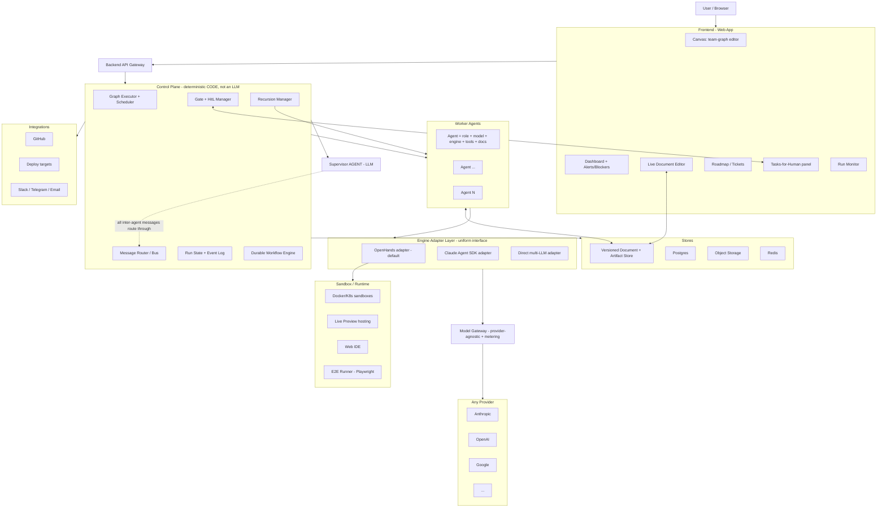
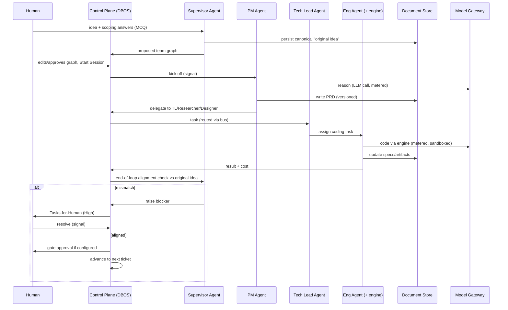
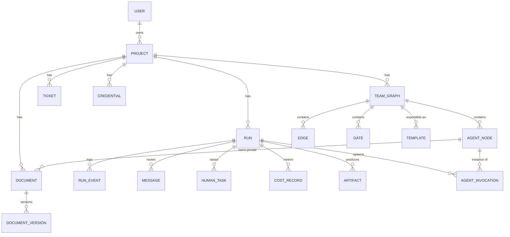

# Tvashtr — Project Plan

> **Living document.** The single source of truth for scope, architecture, decisions, and build sequence.
> Maintained by the architect/planner chat (Tvashtr-N) via direct filesystem access. Updated at the end of each step and before every handover.
>
> **Last updated:** 2026-07-18 — **Tvashtr-70.** `main` @ `5bc2c25` · alembic head **`0030`** · floors **776 backend / 379 vitest** · no remote. **M-h2a SHIPPED, DISK-AUDITED, and FF-merged:** a hosted run's agent now executes inside a **throwaway per-run Fly Firecracker microVM** (`tv-run-<run_id>`) on the run owner's own private network (`u<owner_id>-net`), behind a **one-way Flycast door** + a **fresh-per-run `X-Session-API-Key`**, torn down atomically — proven by a REAL PR (`lazyxgenius/trade_mcp` **pull/3**) whose agent work ran on Fly, with the **Docker path left BYTE-IDENTICAL** as the control harness (**cryptographically proven** via git blob SHAs). Both fences are real off the address: the machine's `private_ip` (`fdaa:9e:cfa6:…`) does NOT carry the operator's default network id `75:f644`, and an unkeyed request got 401. The `test_auth.py` cookie flake is fixed reproduce-first (now deterministic). **Cost lever now QUANTIFIED:** image 1.37 GB compressed → 83.7s cold-host boot / 99.3s to serving; peak guest memory 570 MB vs a 2048 MB default. **NO migration** (head stays `0030`). **NEXT: M-h2b** — D3 suspend-on-gate (Fly *suspend*, NOT *stop*) + the orphan reaper (list `tv-run-*`, NEVER touch `cryptoground-data`) + the durable-handle-across-backend-restart proof + its migration `0031`; needs a short design pass, then the `/goal` on a full budget. **THREE STANDING OPERATOR DIRECTIVES (permanent):** decide from what's best for the user + product (no option menus); cost efficiency for BOTH the user AND the operator is first-class; don't shy from too much work. **§17 is the authoritative, append-only as-built log — read §17, not this banner.** _Prior:_ **Tvashtr-69.** `main` STILL @ `16cb41d` · alembic head **`0030`** · floors **737 backend / 379 vitest** · no branches, no remote. **NOTHING BUILT THIS SESSION** — M-h2 (per-run Fly isolation) was **DESIGNED (4 decisions ratified)** and the Fly **account/org/token/tunnel setup is COMPLETE and PROVEN from inside the 6PN**; **no `/goal` was written** (handed to Tvashtr-70 deliberately, so the big milestone's `/goal` gets a full budget). **THREE NEW PERMANENT OPERATOR DIRECTIVES:** (1) take all decisions from what's best for the user + the product, no option menus; (2) **cost efficiency for BOTH the user AND the operator is a first-class design input**; (3) don't shy from too much work. **The finding that forces M-h2's scope:** `DockerWorkspace` sets `api_key=None` — the agent server runs with **NO password**, safe today ONLY because Docker binds it to loopback; on Fly it must be network-reachable, so naive M-h2 is a **downgrade** (a stronger wall, a weaker door — any tenant could read any other tenant's repo). So M-h2 carries **two fences** (a private network per user + the agent server's own `X-Session-API-Key` on) — M-h2 is the agent reaching **IN**, M-h3 is the agent reaching **OUT**; clean seam. **Ratified:** one microVM **per RUN** (not per node) with **one working dir per node** (`/workspace/<node_id>` — keeps Fly byte-identical to the Docker proof-harness); a **throwaway app per run** (`tv-run-<id>`) reached by a **one-way Flycast door**, torn down by deleting the app; a run parked on a **human gate SUSPENDS** its machine (Fly *suspend*, NOT *stop* — stop resets state) so it resumes mid-thought and isn't billed while it waits. **The `RemoteConversation` attach-by-id finding DISSOLVES the old "single backend process" blocker** — the sandbox handle becomes two strings (`tv-run-<id>.flycast` + a conversation id) that survive a backend restart, which is what makes "the team works while you sleep" real. **The cost lever is the IMAGE** (we bake in a VSCode/VNC we never open — the `/goal` must MEASURE + report image size + cold-boot). **Setup facts that become `/goal` acceptance evidence:** default network id `75:f644` (a run machine's `private_ip` MUST NOT contain it); the org's one pre-existing app is `cryptoground-data` (the `tv-run-*` reaper filter is safe). **Token pasted-into-chat + revoked + re-minted straight into `.env`** (security event, resolved). **🔴 Ride into the M-h2 `/goal`:** the ~6% `test_auth.py` cookie flake. **§17 is the authoritative, append-only as-built log — read §17, not this banner.** _Prior:_ **Tvashtr-68.** `main` @ `16cb41d` · alembic head **`0030`** · floors **737 backend / 379 vitest**. **Shipped: M-h1b — the HOSTED chain is REAL:** a user picks their repo from a dropdown, the backend clones it server-side as a **durable step** (it MUST land before `load_graph_step`, which snapshots `repo_path` into the graph dict — clone after it and the run silently executes as *greenfield*), the team runs, and a **real Pull Request opens**. Live-proven: `lazyxgenius/trade_mcp` **pull/1 + pull/2** — the first gate in the project to make an externally-consequential write. The **exfiltration door is FENCED** (hosted mode 422s BOTH `repo_path` and `/api/repo/inspect`): M-h1b's own push would otherwise have turned the free-text path box into a **working server-filesystem exfiltration tool** (sign up → `repo_path=/` → point at your own repo → the ship commit couriers `.env` out) — which is *why* the repo dropdown was forced into the same milestone. M-h1a's **3 sign-in riders are fixed**. **The audit found + fixed 2 real defects the report's own invariant claim missed:** the installation token leaked on the git **TIMEOUT** path (`TimeoutExpired.__str__` renders the full tokenised argv → a DB row + a log), and `make test` was **RED under the operator's own `.env`** (the Makefile exports `TVASHTR_HOSTED_MODE=true` into it; two tests relied on ambient false). **OPERATOR DECISION (Tvashtr-68): the target is a PUBLIC LAUNCH** ⇒ **M-h3 is now MANDATORY, not deferrable** — sequence: **M-h2 (per-run Fly Machine isolation — NEXT) → M-h3 (abuse/quota/cost) → M-h4 (deploy)**; Mv stays deferred behind the chain. **NOTHING IS DEPLOYED** — it still runs on the operator's MacBook at `localhost`; no server, no domain, no TLS. **🔴 Ride into the next `/goal`:** the **~6% `test_auth.py` cookie flake** (measured 5.99% over 20 000 runs — `make test` is NOT deterministic; an agent burns turns diagnosing a phantom red). **§17 is the authoritative, append-only as-built log — read §17, not this banner.** _Prior:_ **Tvashtr-67.** `main` @ `1f75995` · head `0029` · floors 710/372. **Shipped:** **M-wholerepo** (the rung-2 WHOLE-REPO leg PASSED live on DeepSeek — `run.subpath = None`, all 264 files, `max_abs_diff = 0.0`, C1's condenser folded twice) and **M-h1a** (GitHub App = identity + repo source in HOSTED mode; live gate mints an app JWT → installation token → lists `lazyxgenius/trade_mcp`). **OPERATOR DECISION (Tvashtr-67): the project is now building a HOSTED PRODUCT** — Mv is deferred behind it; see §17. **M-h1a is live-proven end-to-end** (real GitHub sign-in lands "Good to see you, Lazyxgenius") — with **3 known defects registered 🔴 in §15** (install-URL front door, URL paste-tolerance, callback redirect target). **Next:** M-h1b (clone → run → push branch → open PR), with the 3 defects as riders. **§17 is the authoritative, append-only as-built log — read §17, not this banner.**
>
> 

<strong>Archived banner chain (Tvashtr-35 → Tvashtr-64) — collapsed by Tvashtr-66; nothing deleted. Expand only for the raw chain.</strong>

>
> _Why collapsed:_ this line had grown by accretion (~3k chars/chat) to **81,013 characters** — 17% of the whole file — and had begun blocking its own maintenance: Tvashtr-65 could not bump it at all, because any edit echoes the entire line back. Every segment below is **duplicated verbatim in §17** (verified entry-by-entry — e.g. the oldest segment here is byte-identical to §17's Tvashtr-35 entry), §17 is authoritative + append-only, and every prior revision lives in git. So this chain is a redundant second copy of the log — and a stale-duplicate that would inevitably drift from §17 is precisely the hazard class that hid the M-reaper bug (§17, Tvashtr-65). Retained inert below rather than deleted.
>
> **Tvashtr-64 — the EDITABLE ENDPOINT (Ship↔Stop post-drop) SHIPPED, DISK-AUDITED, and MERGED → `main` @ `a108e86`; alembic head STILL `0027` (NO migration); floors 648 backend / 365 vitest — and it was shipped by GROK BUILD, not Claude Code.** The terminal was the LAST non-editable node kind on the canvas (its drawer showed a DISABLED Ship/Stop indicator + an apology telling you to delete the endpoint and drop the other — which silently destroys every wired edge). Now a dropped endpoint flips in place: `config["terminal_kind"]` is the single source of truth AND `role_name` is SYNCED to it on every flip, so a flipped endpoint is byte-identical to a freshly-dropped one — the trap being that the trajectory ledger joins on `role_name`, so copying the adjacent gate branch would have left a stop endpoint named "ship" forever (a silent lie in the legibility surface). Edges survive; the next run honours the flip (`rejected`/stopped, no ship). Closes the §15 item **"Gate/terminal post-drop config editing"** outright — the gate half was M-rails C8 — leaving **no non-editable node kind on the canvas**. **This milestone was a TOOLING BENCHMARK: the operator trialled xAI's Grok Build (`grok --always-approve` + its own `/goal`) in place of Claude Code.** Verdict: it cleared the bar on all seven scorecard items — self-decomposition, tests that bite, ran every gate itself, invariant discipline, **the trap (caught)**, branch hygiene, honest reporting — i.e. **process compliance held at Claude Code's standard on this slice.** Honest caveat: one small, well-precedented, deterministic slice WITH a sibling to pattern-match; it says nothing yet about a hard multi-file design milestone, a live-LLM debugging loop, or a real `NEEDS_HUMAN` call. **DURABLE GUARDRAIL FINDING:** `grok inspect` proved Grok reads `~/.claude/CLAUDE.md` + the whole Claude-Code plugin/skill/MCP ecosystem but **NOT `.claude/settings.json`** — so BOTH PreToolUse guards (migration-freeze + no-push) are **INERT** under any non-Claude-Code agent, and `CLI-RULES.md` §3.11 still falsely calls them "hard walls". What actually made the trial safe: **`.git/config` has NO remote, so `git push` is structurally impossible** — re-verify that before trusting any unguarded agent again. The audit was the DEEP git-object walk: the `backend/alembic` and `backend/tvashtr/control_plane` subtree hashes came back IDENTICAL (proving every migration + `team_run.py` + `graph_validity.py` byte-intact in two hashes), and the root-tree diff showed ZERO added entries (proving `design/`, the deep-dives and `prompts/*` were not swept). The strategic question is UNCHANGED and still standing: the rung-2 brownfield thesis has not been re-run on a real repo since Tvashtr-38, and Mv — a non-founder shipping real value on their own repo — remains the real gate. _Prior:_ **Tvashtr-63 — the per-node "Remember what I learn" toggle SHIPPED, DISK-AUDITED, and MERGED → `main` @ `9f6de25`; alembic head STILL `0027` (NO migration); floors 645 backend / 363 vitest.** A small warm-up between milestones that makes the just-shipped deliberate agent-remember (S4) actually reachable by an end-user: the GLOBAL env flag `settings.memory_remember_enabled` (`TVASHTR_MEMORY_REMEMBER_ENABLED`, default OFF + all-or-nothing) is RETIRED and agent-remember becomes a PER-NODE decision — a top-level `memory_remember_enabled` bool in the node's EXISTING `AgentNode.config` JSONB (additive, NO migration), default False, resolved by a new pure None-safe `resolve_remember_enabled(node_config)` beside `resolve_context_budget`, threaded into `agent_run_step` and ANDed with `edits_allowed` (only an edits-on node writes the `TVASHTR_REMEMBER.jsonl` sidecar). **UX:** an edits-on agent node's config drawer shows a "Remember what I learn" toggle (Remember / Don't remember, seeded OFF) rendered ONLY when Edits is allowed — flipping Edits→Not-allowed unmounts it; default-False keeps every existing team byte-identical. **As-built** (`9f6de25`, 12 files, +430/−28, FF off `083923b`): `config.py` field deleted; the pure resolver; `team_run`'s gate now `remember_enabled and edits_allowed` (the global read is gone); `routers` merges the key into a FRESH config dict under `model_fields_set` (omit ⇒ config byte-unchanged); FE `api.ts` + `TeamNodePanel` toggle; the live `make memory-review-gate` REWIRED to seed the Engineer node's config via the real node-update endpoint (dropped the env) + PASSED a real deepseek run. **DISK-AUDITED** (not the report): single-commit FF-able (parent `083923b`, unpushed; the FF stat confirmed the 12 paths, docs NOT swept); the resolver pure + no settings fallback; `compile_context` body byte-identical (value threaded, compiler untouched); the routers fresh-dict merge; the FE gate `{editsAllowed && …}` unmounts on flip; the proof-of-design test FAILS on pre-change `main` (asserts the Settings field is gone) + PATCH tests re-read the persisted `AgentNode.config` row; grep-clean (retired flag/env nowhere). Two deviations both benign (the proof-of-design uses the field-gone form; two `TeamNodePanel` Save-body assertions gained the now-always-sent flag). **CLOSES the §15 `memory_remember_enabled` default-OFF-flip + per-node-toggle pair** (the PRIMARY agent-remember live-channel item stays deferred). **Strategic note (surfaced, not acted on):** the rung-2 brownfield thesis has NOT been re-run on a real repo since Tvashtr-38 despite all the enabling tooling (context management, DeepSeek go-forward, the whole memory system) now on `main` — the honest next move per §13-S4 is probing the Mv/thesis DIRECTLY, but the operator chose the warm-up + then a fresh feature. Full as-built in §17 (2026-07-14, Tvashtr-63). Mv (a non-founder shipping real value on their own repo) remains the real gate. _Prior:_ **Tvashtr-61/62 — M-memory COMPLETE: S5a (the account Memory shelf + `/api/memory/review-mode`) + S5b (the run-inspector Memory tab + the authoring-drawer Memory section) SHIPPED, DISK-AUDITED via a full git-object walk (not the reports), and MERGED → `main` @ `ed81bde`; alembic head STILL `0027` (both slices FE-only, zero migration); floors 636 backend / 357 vitest.** M-memory is now DONE end-to-end: distill (S2) → inject (S3) → confirm/reject + review mode (S4) → SEE what was used/learned + manage/prune (S5). Full as-built in §17 (2026-07-13, Tvashtr-61/62). _Prior:_ **Tvashtr-60 — M-memory S4 (write-control: promote/reject + a per-owner review-before-persist mode + a deliberate agent-remember capture) DESIGNED (4 market-researched, UX-paired questions) + SHIPPED, DISK-AUDITED, and MERGED → `main` @ `b914d9c`; alembic head `0027`; floors 634 backend / 296 vitest.** S4 un-dead-ends the `pending_review` quarantine S2 wrote (there was no human path to act on it); all three capabilities REUSE S2's code-authoritative Consolidate. Design: **S4 backend-only, FE→S5, SOLO** (one feature's two halves — S5 calls S4's endpoints so it can't be a parallel batch; the pending queue is the payoff); **reject = a TOMBSTONE** (`status='rejected'`, works on pending OR active) that SUPPRESSES re-proposal (Consolidate DROPS a same-sign candidate matching it — the Nexumo/Hindsight "don't re-suggest the dismissed thing" pattern); **promote = via Consolidate** (same-sign dup→confirm+retire-as-merged, opposite-sign→supersede the contradicted active fact, else activate — never a blind flip); **review mode = a per-owner boolean `memory_review_mode`** (default OFF, the ONE migration `0027`) — ON routes every otherwise-active write (distilled + agent-remember) to `pending_review`, DEFERS the supersede to promote, and SUPPRESSES the corroboration auto-promote (auto-persist is the field default, a review gate the opt-in — Copilot/ai-memory/Augment); **agent-remember = a DELIBERATE capture** → the SAME Consolidate → `active`/repo-tier/optional-`polarity`, BYPASSING the failed-run triage+quarantine (deliberate=trusted, the Letta/Factory shape), pending under review mode, capped 5/run. **As-built** (`b914d9c`, 18 files, +1951/−29, FF off `3a54fd3`): new mig `0027` (`users.memory_review_mode`), `memory_review.py` (promote/reject/ingest), `memory_distill.py` grew the SHARED Consolidate (tombstone-drop + review routing + `remember_facts`), the promote/reject endpoints, a gated DEFAULT-OFF capture protocol, the run-end fallback-file ingest + sidecar exclusion, 37 mutation-real tests, `make memory-review-gate`; a 7-agent adversarial review caught + fixed a tombstone MASKING bug (filter same-sign BEFORE the nearest-match; the regression fails on the old code). **Two deviations (both sound):** CHANNEL = the FALLBACK workspace file (a top-level non-hidden `TVASHTR_REMEMBER.jsonl` read host-side at run-end, excluded from the ship commit + reviewed diff at BOTH layers) since the PRIMARY live internal MCP tool was infeasible (no MCP-hosting infra); and the whole agent-remember capability is gated behind a new `memory_remember_enabled` flag, default OFF (built+tested+gate-proven but INERT until the operator flips it — turning it on changes every agent's prompt). **DISK-AUDITED via the git object walk + pre-image diffs:** `3a54fd3` = the S3 code `f555c07` + the Tvashtr-59 docs commit (the report's "off f555c07" a benign stale citation; genuinely FF-able); `memory_retrieval.py` (the S3 read path) UNCHANGED (active-only — a rejected/pending row is never injected); `engines/` byte-size-identical + `node_tools.py` unchanged (no engines touch, PRIMARY not half-built); the pollution safeguard verified at both layers; the masking regression genuinely fails on the pre-fix code; 634 / 296 / lint / `0027` round-trip / gate PASS. **Merge:** plain FF `3a54fd3..b914d9c`, branch deleted. **M-memory is 5 of ~6 done** (S1+S1b+S2+S3+S4); **S5 (the 3 FE surfaces — drawer + a run-inspector taught/remembered tab + an account shelf) remains** — the design pass opens with grounding the current FE. Two NEW §15 (Memory) deferrals: the PRIMARY agent-remember live channel; the `memory_remember_enabled` flip (folds into S5). Mv (a non-founder shipping real value on their own repo) remains the real gate. _Prior:_ **Tvashtr-59 — M-memory S1b (polarity) + S2 (anti-backfire distillation) + S3 (injection) ALL SHIPPED, DISK-AUDITED, and MERGED → `main` @ `f555c07`; alembic head `0026`; floors 597 backend / 296 vitest.** S1 (substrate) was audited + merged (`cba8b7a`); then a design pass added the 6-value RFC-2119 **polarity** taxonomy (`require`/`prefer`/`allow`/`context`/`avoid`/`forbid` — Claude included `allow` as the clean way to record explicit exceptions to a negative rule) + a 5-layer **anti-backfire** design (the operator's key concern: a genuine failure must NOT mark everything don't-do). **S1b** shipped `polarity` (mig `0026`, a `ck_node_memories_polarity` CHECK on the 6, backfill-safe metadata-only add, reversible; validated BEFORE any embed; a polarity-only PATCH never re-embeds; `cba8b7a`→`60bdcb7`, SOLO since S2+S3 both import the column; 15 mutation-real tests incl. a call-count spy proving ZERO embed calls on a polarity PATCH). Then **S2 ‖ S3 as a parallel batch** (each its own worktree + own `tvashtr_sN` DB on the shared pgvector container — needed a `template1`/`postgres` REFRESH COLLATION VERSION fix before `createdb`; ports 8001/5174·8002/5175; ZERO migration across the batch): **S2** (`eaf542c`) = run-END distillation (the WRITE) — a best-effort `distill_run_memory_step` in `run_graph`'s ship arm reads the run's own `run_explain` trail via a cheap `openai/gpt-4o-mini` distiller (new setting `memory_distiller_model`) + writes LABELED facts gated by all 5 anti-backfire layers (triage defaults an unexplained/environmental failure to environmental → ZERO negatives; evidence-required; failed-run negatives → `pending_review` quarantined from injection until a 2nd run corroborates or the user confirms; ≤5/run; self-correction), consolidation CODE-authoritative by embedding cosine, metered on-run; + `GET /api/runs/{id}/memories`. **S3** (`ab28c03`) = run-time injection (the READ) — `compile_context(memory=…)` folds hot(pinned)+cold(pgvector top-K) tier-scoped active-only facts into a node's instruction grouped into CAPS force-sections, recorded in the existing `context_manifest.memory` (S5 reads it); best-effort + inert-when-empty. **DISK-AUDITED via the git object walk** (both FF-able off `60bdcb7`; the ONLY shared code file across the batch was `team_run.py` — S2 ship arm / S3 node-exec arm, the union AUTO-MERGED; all byte-invariants held; both new modules read line-by-line + correct incl. 2 adversarial-review defect fixes; zero migration); both live gates PASSED. **Merge:** FF S2, cherry-pick S3 (only the Makefile `.PHONY` conflicted → union resolved directly in main via `Filesystem:edit_file`), merged-`main` re-verified GREEN (597 = 549+23+25 / 296 / lint). **M-memory is 4 of ~6 slices done** (S1+S1b+S2+S3 = the substrate + polarity + the full read/write loop); **S4** (the human confirm/promote surface for the quarantined pending negatives + the agent-remember tool + review mode) + **S5** (the 3 FE surfaces) remain. Full as-built in §17 (2026-07-12, Tvashtr-59). Mv (a non-founder shipping real value on their own repo) remains the real gate. _Prior:_ **Tvashtr-58 — M-memory (agentic cross-run memory) FULLY DESIGNED (6 decisions, each market-researched + UX-paired) + a NOTHING-DEFERRED 5-slice build plan recorded; S1 IN FLIGHT (operator running it solo); `main` still @ `d3e364c`, head `0024`, floors 510/296 — nothing built/merged yet.** A stale-text CORRECTION first: §16/§15 still listed M-unify U3 as remaining — U3 SHIPPED Tvashtr-54 (`226c4b5`) + U2 SHIPPED Tvashtr-56 → **M-unify (U1+U2+U3) is COMPLETE** (both lines fixed; confirmed by reading `AgentNodeCard.tsx`+its test). Then a full DESIGN PASS for M-memory (the THIRD legibility layer — the node's own AGENT-facing cross-run recall; shared-spec + per-node-work-brief are the human-facing two), grounded BOTH on disk (`context_compiler.compile_context` is the injection seam; `run_explain.py` the distillation substrate; `gateway.py` had NO embedding path → S1 adds an `embed()` sibling mirroring `complete()`) AND against the market — DEEP research on Factory (User+Org Memory + a shared Knowledge droid, NOT per-agent), Cursor (Memories per-PROJECT; self-learning distills rules-vs-skills under human review), Devin (account-global Knowledge, auto-suggested, relevance-recalled), Mem0 (Extract→Consolidate ADD/UPDATE/DELETE/NOOP; an `agent_id` scope 'most don't need'), Zep/Graphiti (bi-temporal valid/invalid + supersede-not-delete + EVENT-driven step-function invalidation + provenance), and the arxiv Codified-Context hot/cold split. Research MOVED 3 of 6 decisions: **D1 scope** flipped from per-node-primary to **THREE TIERS** — shared per-repo `(owner,repo)` [proven default, every node reads] + optional per-node `(owner,repo,node)` [the Tvashtr differentiator] + account/user `(owner)` [cross-repo prefs, Factory's User Memory]; ONE table, nullable repo_key + nullable node_id encode the tier. **D3 read** promoted pgvector from 'later' to NOW (hot pinned + cold top-K retrieval, bounded via the compiler). **D4 forget** adopted bi-temporal supersede-not-delete + EVENT-driven invalidation (DROPPED gradual time-decay) + a confirmation-count trust signal. D2 (auto-distill at run-end via Extract→ADD/UPDATE/DELETE/NOOP, never silent, + BUILD the agent-'remember' tool + a review-before-persist mode), D5 (a new owner-scoped `node_memories` table — flat facts + bi-temporal + tier + a pgvector `vector(1536)` col + an HNSW cosine index; NO graph DB), D6 (drawer Memory section + run-inspector Memory tab + an account Memory shelf) confirmed. **Operator directive: NOTHING DEFERRED this sprint — build the COMPLETE system incl. pgvector NOW; add slices as needed** → a **5-slice plan (ONE migration total, `0025`, in S1): S1 substrate+storage+CRUD (+the `embed()` gateway path, default `openai/text-embedding-3-small`=1536-dim, uses the `.env` OpenAI key via `api_key=None` like `generate_doc`; compose Postgres image → `pgvector/pgvector:pg16`) → S2 write/distillation → S3 read/injection → S4 agent-remember tool + review mode → S5 the FE surfaces.** Correctly OUT of scope (NOT deferred M-memory work): auto-distilling PROCEDURES into SKILLS (a distinct skills-subsystem sibling, own next sprint), multi-user repo_key robustness (architecture-gated — single-operator), durable node-memory-across-re-add (a resolved design choice — node memory lives with the node), a graph DB (rejected). **CADENCE: S1 runs SOLO first (every later slice imports its table/`embed()`/endpoints — can't branch off a `main` without them), THEN S2 ‖ S3 as a parallel batch (both zero-migration off S1-main), THEN S4 + S5 overlap.** The S1 brief is `prompts/M-memory-S1-substrate.md`; the S1 launch package (the three blocks) was handed to the operator, running it SOLO now — **Tvashtr-59's FIRST job: receive the S1 FINAL REPORT, audit it on disk (read mig `0025`, diff the compiler/executor 'untouched' claims, confirm `complete()` byte-unchanged + tests mutation-real + the freeze bump last), then give the FF-merge commands; THEN produce the S2 ‖ S3 parallel package grounded in what S1 actually shipped.** Full design in §17 (2026-07-12, Tvashtr-58). _Prior:_ **Tvashtr-57 — the Scope-picker ‖ Ask-the-node (Mode A) parallel batch SHIPPED, DISK-AUDITED, and MERGED → `main` @ `d3e364c`; alembic head `0024` (BOTH features zero-migration); floors 510 backend / 296 vitest.** Two DIFFERENT Mv-path features ran in parallel worktrees (each zero-migration; both live proofs docker-free → no container-reaper collision), chosen from the vision as the two biggest batch-able Mv enablers. **Scope-picker SHIPPED (`189568f`):** `POST /api/repo/inspect` now returns `subpaths:[{path,file_count}]` (a new PURE `worktree.py::repo_subpaths` — top-level tracked dirs, sorted, bounded 100, skips git-C-quoted non-ASCII); the launch panel's new **Scope** dropdown threads `subpath` into a brownfield run (default = whole repo; `create_run` already validated it, Slice 1) — so a user can point a big real repo at ONE package (the rung-2 context-overflow wall). **Ask-the-node / Mode A SHIPPED (`cf7352c`→cherry-picked `d3e364c`):** a stateless owner-scoped `POST /api/runs/{id}/nodes/{id}/ask` + a run-inspector **"Ask" tab** — a node explains its own run, grounded in a new openhands/litellm-free `run_explain.py` trail assembler, on its OWN model + the run-owner's BYOK key, metered OFF the run's ledger (`workflow_id=None` → the run's displayed cost stays truthful); the M2 work-brief substrate now has an interactive read path (the §1 legibility differentiator, made conversational). **DISK-AUDITED, not the reports:** scope's `repo_inspect`/`subpath_is_tracked_dir` byte-identical + the inspect merge git-gated + `api.ts` additive (greenfield body preserved) + tests assert EXACT `subpaths` outputs + the round-trip/non-ASCII/git-only edges; ask's `run_explain.py` litellm/openhands-free by its actual import list + the reproduce-first CAPTURES the system message and asserts the node's REAL outcome/detail/event text (fails against a stubbed-empty assembler) + the cost test proves `running_cost(run_id)` unchanged; `team_run.py`+`engines/` untouched (the cherry-pick's 12-file list); zero migration on both. **Merge:** both branches forked from `505ff17` → FF scope, then Ask CHERRY-PICKED (routers.py/api.ts auto-merged on disjoint regions; ONE Makefile `.PHONY` keep-both) → `d3e364c`. Merged-`main` re-verified GREEN (510 / 296 / lint / build). **NEXT (Tvashtr-58): the next parallel batch (two DIFFERENT features; file overlap OK, resolve at merge; ≤1 migration; own worktree+DB+port each) OR the M-memory design pass (still needs one before a brief).** Mv (a non-founder shipping real value on their own repo) remains the real gate. Full as-built in §17 (2026-07-11, Tvashtr-57). _Prior:_ **Tvashtr-56 — the M-unify U2 design pass RATIFIED (4 decisions, each UX-paired) + the U2 ‖ M-changes parallel batch SHIPPED, DISK-AUDITED, and MERGED → `main` @ `6e1d8f4`; alembic head `0024` (BOTH features zero-migration); floors 497 backend / 285 vitest.** U2 (sandbox reuse) got its design pass grounded in the vision + market practice (Claude Code / Cursor keep ONE warm, remembering agent session per working dir): a process-level sandbox cache keyed per (run_id, node_id) OUTSIDE the DBOS durable model (a live handle can't cross the `@DBOS.step` boundary; on crash the cache evaporates → a resumed round is a fresh build from the durable workspace); a seam-respecting additive `AgentTask.session_key` (never a live handle) + an engine-neutral `close_run_sandboxes(run_id)` teardown step; conversation-carry (keep the OpenHands Conversation alive + continue it); the reaper spares live cached containers (boot sweep still reaps everything). Two DIFFERENT features ran in parallel worktrees. **U2 SHIPPED (`0c8f277`):** `engines/sandbox_cache.py` (stdlib-only, opaque handle) + the additive field + the `agent_run_step` node_id thread + a `run_team` try/finally teardown + the reaper `keep_ids`; the docker container stays warm across a node's review-loop rounds (no re-spin on round 2+) and the same Conversation continues; a 6-lens adversarial pass caught + fixed a HIGH (the DBOS-cancel teardown must `except BaseException`, not `Exception`, else a warm container leaks on cancel); live `make sandbox-reuse-check` on deepseek+docker proved round-2 reuse (0 re-spin, carried 19825 prior tokens, shipped once, 0 leaked containers). **M-changes SHIPPED (`833dceb`→cherry-picked `6e1d8f4`):** a read-only owner-scoped `GET /api/runs/{run_id}/diff` backed by a new stdlib-only `control_plane/run_diff.py` (subprocess git; brownfield `base_ref...ship_branch` three-dot merge-base; greenfield produced-files-as-added; never raises → []/200; non-UTF-8 safe) + a `RunDiff.tsx` Changes tab in the run view — the user can now SEE the reviewed change (the trust surface for Mv). **DISK-AUDITED, not the reports:** read `base.py`/`sandbox_cache.py`/`docker_runtime.py`/`run_diff.py` line-by-line (the EngineAdapter seam is intact — the Control Plane never holds a live handle; both new modules stdlib-only + openhands/DBOS-free; the reaper `keep_ids` + boot-sweep-reaps-all crash backstop); the reproduce tests are mutation-real (U2's round-2 cache HIT went RED as `[None,None,None]` pre-wiring; the `BaseException`-fallback test fails if reverted to `Exception`; M-changes' owner-isolation asserts a foreign user → 404); zero migration on both (head `0024`). **Merge mechanics:** both branches forked from `9663a45` → FF U2, then M-changes CHERRY-PICKED onto it (one Makefile `.PHONY` conflict resolved keep-both). Merged-`main` re-verified GREEN (497 / 285 / lint). Repo swept to `main`-only. **NEW §15 hygiene (Tvashtr-56):** the `skeleton-crash-docker` demo is STALE (predates M-accounts auth → its curl 401s; wrong compose-project/DB — U2 crash-safety is architectural + code-verified regardless); the greenfield `/diff` surfaces the workspace's own `.gitignore` as "added" (filter later); LOCAL-mode is unsandboxed (docker is the containment answer). **NEXT (Tvashtr-57): the next parallel batch (two DIFFERENT features; file overlap OK, resolve at merge; ≤1 migration; own worktree+DB+port each); M-memory still needs its own design pass.** Mv (a non-founder shipping real value on their own repo) remains the real gate. Full as-built in §17 (2026-07-11, Tvashtr-56). _Prior:_ **Tvashtr-55 — the launched parallel batch (M-rails C9 guardrail checks ‖ tech-debt hygiene) COLLECTED, DISK-AUDITED, and MERGED → `main` @ `1b6c0c1`; alembic head `0024` (BOTH slices zero-migration); floors 486 backend / 282 vitest.** Picked up Tvashtr-54's two in-flight worktree sessions — but the branch refs (not the handover, which assumed both were mid-wait) showed **hygiene had already run** (`968c845`) while **C9 was still waiting for its `/goal`** (branch at base). **Hygiene (`968c845`, plain FF):** deleted the now-dead `resolve_thinker_max_tokens` + `thinker_max_output_tokens` (orphaned when U1 retired the thinker path), de-dangled every reference, kept all five live siblings, `git rm --cached STATE.md` + `.gitignore`'d it — closing the §15 STATE.md-on-main item; one dead test removed → backend floor now 470. **C9 (`0bfcd0e` → cherry-picked `1b6c0c1`):** two NEW deterministic guardrail gate kinds end-to-end in the openhands-free `guardrails.py` (stdlib+dbos, mirroring C8's `secret_leak_scan`) — `diff_touches_forbidden_paths` (sorted git changed-files; rejects the first `fnmatch` glob hit naming file+glob) + `output_schema_check` (a stdlib JSON-Schema-subset validator; rejects missing/non-JSON/off-schema naming file+first-failing-key-path); `guardrail_gate_step` gained a `config` param, and `run_graph`'s gate arm passes `cfg` — **team_run.py's ONLY change is that one line** (the human `wait_at_gate` path byte-identical); the FE gate-type picker gained the two options + config fields (kept as segmented buttons to preserve the C8 e2e selectors); routers.py stores the request field `output_schema` under config key `schema` (avoids shadowing `BaseModel.schema`). **DISK-AUDITED, not the reports:** grep-confirmed the dead symbols gone + siblings kept (the suite passing at 470 proves nothing dangles); read `guardrails.py` line-by-line — both new fns deterministic + **REDACTING** (reject reasons name files/globs/key-paths, NEVER secret values or file contents; tests plant a sentinel value + assert its absence); confirmed the one-line gate-arm change + the byte-identical human path; the 7 reject tests go RED against always-approve stubs (mutation-real). **Merge mechanics (a handover correction):** both branches forked from the same base `61e1f12`, so only the FIRST fast-forwards — hygiene FF'd; **C9 was CHERRY-PICKED** onto it (the handover's "FF each, order-independent" was imprecise), resolving one modify/delete `STATE.md` conflict toward untracked. Merged-`main` re-verified GREEN (486 / 282 / lint). **Repo hygiene:** swept 24 stale/merged branches + two orphaned Tvashtr-53 filler worktrees (a11y / toolsform) → repo is now `main`-only + worktree-list clean. **M-rails now has all three content checks (secret_leak_scan + diff_touches_forbidden_paths + output_schema_check) + the credential invariant — the milestone's content-check surface is COMPLETE (further kinds on-trigger).** **NEXT (Tvashtr-56): the M-unify U2 design pass** (ratify the DBOS-step/process-cache reuse mechanism + the additive-`AgentTask` seam + conversation-carry + the container-reaper, each UX-paired, THEN brief) + the next parallel batch. Mv (a non-founder shipping real value on their own repo) remains the real gate. Full as-built in §17 (2026-07-10, Tvashtr-55). _Prior:_ **Tvashtr-54 — TWO PARALLEL Claude Code sessions (M-unify U3 ‖ M-rails C8) SHIPPED + merged → `main` @ `61e1f12`; alembic head `0024` (NO migration — BOTH slices zero-migration); floors 471 backend / 280 vitest.** The parallel pair was RE-PICKED mid-session: I recommended U2 ‖ C8, but tracing the U2 seam on disk found U2 is NOT a clean autonomous `/goal` — its sandbox is created inside a `@DBOS.step`, so a live handle can't cross the step boundary (reuse needs a process-level adapter cache OUTSIDE the durable model), the inviolable `EngineAdapter` seam constrains HOW, and conversation-carry + the container-reaper are real semantic calls — so U2 was SWAPPED OUT for a proper design-pass-then-brief (still NEXT) and the pair became **U3 (the M-unify FE surface) ‖ C8 (the first guardrail gate)**. **U3 SHIPPED (`226c4b5`):** the drawer's Thinker/Worker Capability control is now an **Edits allowed / Not allowed** toggle over the already-merged `edits_allowed` (U1); inline **Tools on EVERY agent node** (ToolsSection un-gated from `capability`); a pre-launch **amber action-verb lint** on edits-off nodes (LaunchPanel); the **Reviewer template flipped edits-off** (teams.py +6 additive; a reproduce-first test failed-then-passed). **C8 SHIPPED (`61e1f12`, rebased onto U3):** a `secret_leak_scan` **guardrail gate** — a new openhands-free `control_plane/guardrails.py` (a deterministic sorted-walk redacting scanner + a recorded `@DBOS.step guardrail_gate_step`) dispatched from `run_graph`'s gate arm ONLY (the human `wait_at_gate` path moved to `else`, BYTE-IDENTICAL; crash-resume replays the recorded verdict), riding the EXISTING `agent_nodes.config` JSONB (a new `gate_kind`, NO migration); the gate node is now **EDITABLE** (routers.py lifts the gate 409, terminal stays 409; a NEW `updateGateNode` in api.ts, `updateTeamNode` untouched; the drawer gate branch gains a Gate-type picker — closes the §15 gate-not-editable deferral); + the **per-owner credential invariant** locked by tests. Ran in two worktrees (own DBs `tvashtr_u2`/`tvashtr_c8`; ports 8002/5175 · 8001/5174); both independently patched the hardcoded vite proxy with DIFFERENT env-vars → reconciled at merge to the single `TVASHTR_API_PROXY_TARGET`. Merge: FF U3, then C8 REBASED onto U3-main + re-verified green (shared files TeamNodePanel/api.ts/vite/Makefile/TeamNodePanel.test kept-both), then FF. DISK-AUDITED byte-for-byte vs `733a707` pre-images: U3's executor/routers/engines diff EMPTY; C8's `team_run.py` diff = ONLY the guardrails import + the gate-arm branch (agent arm / `agent_run_step` untouched); `guardrails.py` LLM-import-free + deterministic + redacting; routers gate-editable/terminal-409/agent-422 exact; models untouched → zero migration. Hygiene: C8 committed `STATE.md` into `main` (the §15 gitignore-STATE.md item is now worth doing). **NEXT (Tvashtr-55): the U2 design pass (ratify decisions → brief) + the next parallel batch.** Mv (a non-founder shipping real value on their own repo) remains the real gate. Full as-built in §17 (2026-07-10, Tvashtr-54). _Prior:_ **Tvashtr-53 — M-unify U1 (executor unification) + M-robust (provider-response robustness — the FIRST sanctioned touch of the frozen `engines/` adapter) + two FE fillers ALL SHIPPED + merged → `main` @ `69e1f3a`; alembic head `0024` (freeze bumped 0023→0024, LAST); floors 454 backend / 275 vitest; DeepSeek (`deepseek/deepseek-chat`) is now the go-forward agent model (NIM was HARD-DOWN all session — a documented degradation that connects but never returns).** M-unify was DESIGNED (4 decisions, each paired with its UX: **D1 loop-always** — every node runs the FULL agent loop, sandbox reuse becomes U2; **the pull manifest is the SOLE edits-not-allowed enforcer** — the Slice-4 emitting-node verdict-only pull survives INDEPENDENTLY of the toggle, tool detachment is steering only; **a compiler-appended capability NOTE, not persona-swap** — edits-on byte-identical; **a file-based REPORT.md deliverable** + **D2 the ENTRY node owns the spec** — its REPORT.md → the next spec version) then sliced U1 (executor core) → U2 (sandbox reuse, a DEFERRED HARD requirement) → U3 (FE: Capability→Edits toggle, tools-on-every-node, an amber action-verb lint, the drop-and-edit Reviewer-template flip). **U1 SHIPPED (`0feae15`):** the thinker(`kind=completion`)/worker(`kind=agent`) split collapses to ONE agent path gated by a single boolean `agent_nodes.edits_allowed` (mig `0024`, nullable→backfill `(kind='agent')`→NOT NULL, reversible); the compiler appends a capability note ONLY when edits-off (golden-tested byte-identical when edits-on); the Slice-4 emitting-node verdict-only pull rule survives; `git diff main -- engines/` was EMPTY for U1. **M-robust SHIPPED (`b4229b5`) — the FIRST sanctioned touch of the frozen `engines/` adapter:** my telemetry root-cause diagnosis was WRONG (reproduce-first caught it); the real crash was `_payload_of` leaving a reasoning model's `Sequence[TextContent]` thought as a raw object the `run_events` JSON write can't serialize — and BOTH the local + docker adapters SHARE `_payload_of`, so a surgical +12-line thought-stringify there (join the parts' `.text`, keep `[:1000]`+try/except; the ONLY `engines/` change) makes ANY provider (DeepSeek, qwen3, …) run clean in BOTH sandbox modes (docker CONFIRMED LIVE — `skeleton-run-docker` on DeepSeek shipped green with events serialized in-container). A host-side LiteLLM-wrapper phase-1 (local-only) was soft-reset + REPLACED by this mode-agnostic fix (operator ratified retiring the SELF-IMPOSED `engines/` freeze for it — the MIGRATION freeze is separate + intact, head stays `0024`). U1's LIVE acceptance (parked the whole NIM/DeepSeek saga) was CLEARED by M-robust's DeepSeek run: skeleton shipped, the loop ran, the ENTRY node wrote REPORT.md → steering confirmed. **Latency baselines captured (U2's before-numbers, entry-node spin-up→REPORT.md):** DeepSeek local 12.2s / DeepSeek docker 20.2s / gpt-4o-mini local 8.1s. **Two FE fillers merged:** Filler-A (`8c17982`) a shared modal focus-trap hook (`useModalDialog.ts` — trap+Escape+restore+inert; wired into NewTeamDialog/Dashboard-delete/DrawerShell modal-mode-only; docked byte-unchanged); Filler-B (`69e1f3a`) a guided Local/Remote Tools-shelf add form over the raw-JSON SSOT (§15 item CLOSED). DISK-AUDITED throughout: git plumbing (each branch one clean commit, the phase-1 wrapper soft-reset verified via reflog, FF/cherry-pick, unpushed); the `_payload_of` diff surgical (only that function; other branches + try/except byte-identical); the reworked regression test mutation-real (3/6 fail pre-fix, driving the real SDK→`_payload_of`→`json.dumps` path, and PRESERVING the model's narration as the thought); the merge train FF'd U1+M-robust then cherry-picked A (kept `main`'s STATE.md) + B (code-only); merged-`main` re-verified GREEN (454 / 275 / build clean). **NEXT (Tvashtr-54): M-unify U2** (sandbox reuse — the deferred hard requirement) then U3; then M-rails (C8) on trigger; M-memory (agentic memory/RAG, committed Sidechat-7 2026-07-09) when scheduled. Mv (a non-founder shipping real value on their own repo) remains the real gate. Full as-built in §17 (2026-07-09, Tvashtr-53). _Prior:_ **Tvashtr-52 — M-tools is COMPLETE: C7.C (the reusable account LIBRARY) SHIPPED + FF-merged → `main` @ `2c13d56`; alembic head `0023` (freeze bumped 0022→0023, LAST); floors 442 backend / 252 vitest.** A user can now define a tool (one MCP server) or a skill (one skill source) ONCE at the account level and REFERENCE it from any node — the reference lives INSIDE the node's existing `tool_config`/`skills` (tools: an id list at `tool_config.tvashtr.library`; skills: a `{type:"library",id}` source element), NO new node column, so the two run-time resolvers expand it WITHOUT a signature change (which is what keeps C7.C out of `team_run.py`). New `tool_library` + `skill_library` owner-scoped tables (mig `0023`, mirroring `mcp_secrets`); a new openhands-free `control_plane/node_library.py` (owner-scoped CRUD + a LIVE resolver-facing fetch + `owner_for_run`); `build_mcp_config` extended (library refs expand into a base servers dict, the node's inline `mcpServers` overlay it INLINE-WINS on a name clash, then the EXISTING allow-list/`${NAME}` logic runs unchanged; a dangling ref SKIPPED + warned); `_resolve_skills` extended (a `library` branch expands one level, nested library refs REJECTED, the FINAL list de-duped by name FIRST-in-list-wins; a dangling ref skipped + warned); 8 owner-scoped `/api/tool-library` + `/api/skill-library` CRUD endpoints (content RETURNED — a library item is editable, not a secret — 422 on empty/bad input, 404 on a foreign id, skill source rejects a nested `library` type). FE: the `library` `SkillSource` variant + 8 clients in `api.ts`, an "Add from library" picker in BOTH drawer sections (Library-badged rows + a muted "overridden" tag when a ref's name collides with an inline item — inline wins; SkillsSection shows no tag for repo refs whose resolved name is unknowable at author time), two new account shelves `ToolsShelf`/`SkillsShelf` mounted beside Secrets. The reference is LIVE (id only; content fetched fresh each run → edit-once-propagates); the design was VERIFIED against Claude Code + Cursor first (their user-scope MCP servers + user rules are the same model — define-once-and-reference, local-overrides-shared on a clash, live-not-a-snapshot). DISK-AUDITED (not rubber-stamped): git FF-able off `ecef1f7` (single commit, no amend/force/push); `git diff main -- team_run.py` EMPTY (grep-confirmed zero library refs; the frozen `build_mcp_config`/`build_skills`/`inject_skills_into_prompt` call sites intact); all three modules openhands-free at import (AST-test-enforced for `node_library`); migs `0001-0022` untouched, `0023` additive+reversible+chained, freeze bumped to `0023`; the 19 mutation-real backend tests read line-by-line (owner-isolation asserts `resolve_owner_tool(other,tid) is None`; precedence asserts the surviving value; the crown-jewel drives the REAL `run_team` workflow asserting the live ref reaches `task.mcp_config` verbatim while the node row still holds only the ref); the ONE deviation (Tool shelf = a one-server JSON textarea, brief-sanctioned) judged sound. Independent gates: 442 / lint clean / 252 / `0023` round-trip / a background adversarial-review workflow found 0 real findings. **Two live-target proofs stay NEEDS_HUMAN on external infra (§15, unchanged): the agent actually INVOKING an MCP tool + actually USING a skill end-to-end (the container `uvx mcp-server-fetch` first-run init / the NIM polling wall) — C7.C's end-to-end proof is the deterministic wire-through-executor test instead.** NEXT (Tvashtr-53): the two live-target re-runs on a healthy NIM/warmed-uvx window, OR M-rails (C8 — guardrail gate-nodes) OR M-unify (collapse the thinker/worker boundary → an edits-allowed toggle; forward-compat already banked in C7.B's capability-agnostic skills) — operator-sequenced. Mv (a non-founder shipping real value) remains the real gate. Full as-built in §17 (2026-07-07, Tvashtr-52). _Prior:_ **Tvashtr-51 — M-tools C7 COMPLETE: per-node MCP tools + skills are REAL end-to-end. Two PARALLEL sessions off the C7.0 scaffold (`ce14b96`) — C7.A Tools ‖ C7.B Skills — merged A-FF (`86b4eac`) then B-cherry-pick (`c75dde4`) + a merge-cleanup → `main` @ `23e6745`; alembic head `0022` (freeze bumped 0021→0022, LAST); floors 423 backend / 235 vitest.** C7.A (owns mig `0022`): real `build_mcp_config` resolving `${NAME}` refs from a NEW Fernet-encrypted per-account `mcp_secrets` table (server-side, PLAINTEXT into the sandbox like the LLM key — 3 leak guarantees test-asserted incl. a crown-jewel test running the real `run_team` workflow), a per-server on/off allow-list (Tvashtr metadata beside `mcpServers`, stripped from the Agent config), a run-scoped resolution-warning recorder (`run_warnings` table + `/graph` `resolution_warnings` + an inspector banner), the S2 clear path (BOTH `tool_config`+`skills` via `model_fields_set`; closes the C7.0 gap), `/api/secrets` + a Secrets shelf, the real `ToolsSection`. C7.B (NO migration): ONE capability-agnostic skills resolver (inline 3-modes / repo@ref+filter / adopt-repo-rules incl. the `.cursor/rules/*.mdc` glue), the thinker bridge (amendment 1 — the SAME resolved skills rendered into a thinker's prompt; a thin bridge dropped at M-unify), skill warnings emitted through C7.A's recorder via a lazy import-guarded shim, the real `SkillsSection`; `node_skills.py` stays openhands-free at import (every openhands import function-local, AST-test-enforced). DISK-AUDITED (not rubber-stamped): `team_run.py` BYTE-IDENTICAL to `ce14b96` on BOTH branches (the disjointness lynchpin); the recorder signature pinned VERBATIM in both briefs (the M-ledger contract-pin) so B's shim resolves; `api.ts` auto-merged coherently (A's S2 + secrets + S1-wire + B's `SkillSource` all intact); the ONE Makefile conflict (two e2e targets) resolved keep-both; the repurposed merge-cleanup test mutation-real; combined suite INDEPENDENTLY confirmed green (423 / lint clean / 235); the FF diff = 3 non-product files (ZERO product-code drift). **Two live-target proofs are NEEDS_HUMAN on external infra (§15): the agent actually INVOKING an MCP tool (A's `tools-e2e` wedged on the container `uvx mcp-server-fetch` first-run MCP-init) and actually USING a skill end-to-end (B's `skills-e2e` hung on the NIM/SDK polling wall) — both SEAMS proven live (A: secret resolves into the sandbox config; B: `resolved = 1 skill` reaches the AgentTask); only the final agent-execution line awaits a healthy infra window.** Corrections banked: the handover's `expose_secrets`-must-be-explicitly-set premise was STALE (the SDK's `RemoteConversation` create path already serializes the agent with `context={"expose_secrets":True}` at `remote_conversation.py`~L769 — verify-first, don't blindly override); A's `86b4eac` shipped TWO UNLINTED deliverables (`tools_e2e.py` E501 + `tools-c7a.spec.ts` prettier) because it ran green at `6f3267e` BEFORE adding the live-gate files (CC-hygiene: full-lint ALL added files pre-READY); and a goal-writing lesson (never pin an exact file-count evidence clause alongside a full-lint gate — a full lint can surface unrelated pre-existing debt and make the goal self-contradictory, which cost a 34-min thrash). NEXT (Tvashtr-52): **C7.C** — the reusable account LIBRARY (`tool_library`/`skill_library` tables [its own migration] + node reference fields resolved+merged at run alongside inline + the Tools/Skills account shelves + Add-from-library pickers in both drawer sections); then the two live-target re-runs on healthy infra; then M-rails (C8) / M-unify, operator-sequenced. Mv (a non-founder shipping real value) remains the real gate. Full as-built in §17 (2026-07-06, Tvashtr-51). _Prior:_ **Tvashtr-50 — M-tools DESIGNED (5 vision-grounded decisions, each paired with its UX) + the C7.0 SCAFFOLD shipped: the INERT per-node tools+skills seam is live on `main` @ `c1cfee3`; alembic head `0021` (freeze bumped 0020→0021, LAST); floors 392 backend / 220 vitest.** Operator chose M-tools with two directives — MAXIMUM tool + skills parity with Cursor/Claude Code (nothing they can wire/import that Tvashtr can't) — run as TWO PARALLEL sessions by SEPARATE PROCESS (Tools ‖ Skills, not the FE/BE seam). Parity research: OpenHands already implements the same OPEN standards (fastmcp's `{"mcpServers":{}}` schema for tools; the Agent-Skills open standard + every import path — inline / GitHub-repo clone / project-adopt reading `.cursorrules`/`CLAUDE.md`/`AGENTS.md` — for skills), so C7 is mostly storage+wiring+UI. Decisions: (1) store the raw `{"mcpServers":{}}` verbatim (paste-parity = literal parity; all transports inherited); (2) MCP secrets as `${NAME}` refs — value in a Fernet-encrypted per-account `mcp_secrets` table, brokered server-side, never in the row or the model prompt (the C8 credential invariant pulled forward, test-asserted); (3) `skills` stores SOURCES (inline SKILL.md / GitHub-repo pointer / adopt-this-repo's-own-rules), resolved at run (living reference, not a frozen copy); (4) a reusable account LIBRARY — a Skills shelf + a Tools shelf beside Providers/Secrets (define once, reference anywhere); (5) two collapsible drawer sections between Model+Save (one Save), Tools worker-only (a thinker is one direct call), Skills both. Because both columns are NEW and a Tools‖Skills split shares many files, a SEQUENTIAL SCAFFOLD (C7.0) laid the whole shared skeleton INERT — named seam helpers (`build_mcp_config`/`build_skills`/`inject_skills_into_prompt`) + two SEPARATE stub components — so the two follow-ons fill ONLY their own file. C7.0 shipped (`c1cfee3`, FF, 19 files): mig `0021` (both nullable JSONB cols), `AgentTask` +2 additive fields, BOTH adapters build `Agent(mcp_config=task.mcp_config or {}, agent_context=AgentContext(skills=…) if task.skills else None)` (critical inertness detail: `None`, NOT an empty context which injects a datetime), the executor threading (conditional → inert-path signatures byte-identical), the clone+router round-trip, the FE types + two stub sections + 10 tests. DISK-AUDITED (not rubber-stamped): git FF-able off `cef32b5`; inertness verified by reading both adapters + base.py; the WIRE test drives the real `run_team` worker path asserting a node's tool_config reaches the AgentTask VERBATIM (documented mutation guard); freeze re-read (blocks 0001-0021 — the agent's own 'not bumped' self-finding was a stale read). NEXT: the parallel batch C7.A (Tools; `mcp_secrets` mig 0022 + secret-brokering + tools allow-list + real ToolsSection) ‖ C7.B (Skills; NO migration; real build_skills incl. GitHub-repo import + `.cursor/rules/*.mdc` glue + thinker inject + real SkillsSection), then C7.C (the reusable library). Full as-built in §17 (2026-07-06, Tvashtr-50). _Prior:_ **Tvashtr-49 — M-ledger (deep-dive C5 + C6) SHIPPED, run as TWO PARALLEL Claude Code sessions split along the backend/frontend SEAM (naturally ZERO shared files — Python vs TS — so both halves advanced the SAME milestone at once) → `main` @ `44bd87a`; alembic head `0020` (freeze bumped 0019→0020, LAST); floors 382 backend / 211 vitest.** The one managed risk of the split — a wire-contract drift between two halves built WITHOUT seeing each other — was pinned by writing ONE contract verbatim into both briefs, then DISK-VERIFIED byte-for-byte on both sides. **Session A = C5 backend** (`554abb0`, FF; the migration-adder + executor-toucher): a durable `invocation_id` stamped on BOTH `run_events` + `cost_records` (mig `0020`) — the `run_events.seq` cross-invocation collision is FIXED by keying the sink's idempotency probe on `(run_id, invocation_id, seq)` NOT `(run_id, seq)` (each engine `run()` restarts seq at 0, so a later round's seq=0 was silently dropped), and each cost row attaches to the exact node-execution it incurred; `/graph` invocations gain `context_manifest`+`cost`, `/spike/run-events` events gain `invocation_id`+`node_id`+`iteration` (LEFT-join, legacy-null-safe), + a NEW owner-scoped capture-only `GET /api/runs/{id}/trajectory` (one row per invocation, ordered by started_at, joining node+cost+manifest). REPRODUCE-FIRST: a forced 2-round `run_team` regression asserting ≥2 distinct invocation_ids for the looped node went RED on the old `(run_id,seq)` key (isolating the exact WHERE-clause as the fix); 9 mutation-real tests. **Session B = C6 frontend** (`ce433fe`→cherry-pick `44bd87a`; own worktree + vite port 5174, NO DB — FE-only): the run-inspector now shows, per node/round, the round's token/$ cost + (worker rounds) a context-manifest table (parts×tokens + budget + a 'Spec offloaded to SPEC.md' flag), and the worker event feed is FIXED to scope to the selected node (`node_id`), group steps by round (`invocation_id` ascending), and re-key rows `${invocation_id}:${seq}` (seq is no longer unique once the backend KEEPS later rounds — the C5 fix would otherwise break the old `key={seq}` feed); `LastRun` gains OPTIONAL cost+manifest (authoring caller passes NEITHER → byte-identical; `TeamNodePanel` untouched). BOTH DISK-AUDITED: A's `routers.py`/`models.py`/`team_run.py`/`metering.py` byte-diffed vs pre-image (contract emit EXACT; executor threading surgical — ZERO routing change → `graph_validity.py` untouched, no new outcome label/edge; `_cost_to_dict`/`/api/costs` byte-unchanged); the sink's `.limit(1).first()` NULL-safe probe verified; mig `0020` additive/reversible; B's `api.ts` types byte-MIRROR A's emit, EventFeed scope/group/re-key correct + `EventFeed.test.tsx` mutation-real (the OTHER node's event EXCLUDED + Round-1-before-Round-2). A FF-merged first, B cherry-picked onto the result (disjoint → clean), branches + worktree cleaned up. Full as-built in §17 (2026-07-05, Tvashtr-49). **DELETED the stale `.claude/skills/tvashtr-loop/` skill** (redundant with CLI-RULES.md, which already carries the loop discipline + explicitly OUTRANKS skills; it hard-coded drifting facts — 'next migration 0008', 'canvas read-only' — + auto-triggered without its `$1` brief arg). **NEXT (Tvashtr-50): M-tools (C7)** — per-node MCP tools (`AgentNode.tool_config` → `Agent(mcp_config=…)`) + a new `AgentNode.skills` JSONB (mig `0021`), surfaced as two config-drawer sections; OR M-rails (C8) / the brownfield stronger-worker re-run / the Mv demand probe — operator-sequenced. The DEFERRED M-ctx0/M-ctx1 LIVE validation (NVIDIA key) is unchanged; Mv (a non-founder shipping real value) remains the real gate. _Prior:_ **Tvashtr-48 — the FIRST context-management batch SHIPPED: M-ctx1 + M-ctx0 both integrated on `main` @ `4b2a221`; alembic head `0019` (the FIRST migration since the freeze → freeze bumped 0018→0019); floors 373 backend / 198 vitest.** The operator chose the deep-dive **context chain** as the next track (entire), run as TWO PARALLEL Claude Code sessions (architect gave the file-overlap map FIRST — ZERO shared files, verified by `--name-only` diffs). The one hard constraint shaped the batch: only ONE session may add a migration (two = two Alembic heads git won't flag), so **M-ctx1** (the migration-adder) paired with **M-ctx0** (config-only). **Session A = M-ctx1** (`be52906`, FF): extracted the executor's worker context-string assembly into a PURE `control_plane/context_compiler.compile_context` (typed parts + `len//4` token measure), added a per-node INPUT budget that fails PRE-CALL naming the fattest part (reusing the EXISTING terminal-failure shape — NO new edge/outcome label; + a nullable `agent_invocations.context_manifest` JSONB, mig `0019`), raised BOTH thinker `max_tokens=400` → a `thinker_max_output_tokens` setting + per-node `config.model_config` override, and a large-spec `SPEC.md` doc-handle (spec >~1500 tok → offload + static-first reorder; ≤ threshold → inline in the ORIGINAL order, **BYTE-IDENTICAL**, pinned by a golden test). **Session B = M-ctx0** (in its OWN git worktree + its OWN `tvashtr_ctx0` Postgres via a `DATABASE_URL` export — the "own resource" trick that lets two BACKEND sessions run `make test` in parallel without contention; cherry-picked LAST `e26e159`+`4b2a221`, diverged → new shas): wired the OpenHands `LLMSummarizingCondenser(keep_first=2, max_size=80, distinct usage_id)` into BOTH worker adapters (byte-identically; `config.py` UNTOUCHED), + a `scripts/model_bench.py` + `make model-bench` racing llama-70b/Nemotron-super/Nemotron-nano/Kimi through the gateway (NO litellm leak — lazy `tvashtr.gateway` import), the REVIEWER seat scored on correctly REJECTING a wrong build (the D4 measure). BOTH DISK-AUDITED: `--name-only` diffs proved ZERO file overlap (17 vs 8 files, no shared file); the compiler's small-path join byte-cross-checked vs the `team_run.py` pre-image; the budget-breach + byte-equivalence-golden tests read + mutation-real (the breach test proves the adapter is NEVER reached); the condenser wiring proven by a real-object-inspection parametrized test; combined `make test` on merged `main` = **373 passed** (340 base + 21 A + 12 B), floor 336 held; branches + worktree cleaned up. Full as-built in §17 (2026-07-04, Tvashtr-48). **DEFERRED (§15, non-blocking): the LIVE validation — condensation events in `run_events` on a long run + the full multi-model bench table — needs an NVIDIA key, run `make model-bench` + a long brownfield run from `main` when quota allows** (the worktree had no `.env`, so Session B validated OFFLINE only). **NEXT (Tvashtr-49): M-ledger** — C5 the `RunEvent.seq` invocation-scoped collision fix (additive `invocation_id` + unique index) + the one-row-per-node-execution trajectory ledger view + a capture-only `GET /api/runs/{id}/trajectory`; C6 lights up the F1c run-inspector's context-manifest slot (mig `0020`, freeze-bumped LAST); then M-tools (C7), then M-rails (C8, on trigger). The brownfield thesis re-run stays available (M-ctx0's condenser now makes the un-scoped variant attemptable); Mv (a non-founder shipping real value) remains the real value gate. _Prior:_ **Tvashtr-47 — F3 (the guided AUTH WIZARD) SHIPPED + FF-merged → M-frontend is COMPLETE; plus two FE-papercuts cleanups cherry-picked — `main` @ `c486a7f`; alembic head `0018` (NO migration all session); floors 336 backend / 198 vitest.** Run as TWO PARALLEL Claude Code sessions (architect handed the file-overlap map FIRST; zero shared files; papercuts fully DATA-LESS). **Session A = F3** (`a136ca7`, FF): replaced the standalone `LoginScreen` with a single two-panel guided **`AuthWizard`** (visual+copy from `AuthWizard.dc.html`), **account-FIRST** by operator amendment — sign-up = create account → your role → what you're building → "You're in"/"Enter Tvashtr" → `onAuthed`; sign-in = account → success → `onAuthed`. The account step reuses the EXISTING `api.ts` `login`/`register` (reskin the door, not the lock); `onAuthed` fires only at the finish (identity HELD in state), so the wizard is a self-contained logged-out view. Two throwaway onboarding questions on the sign-up path ONLY — role (Engineer/Founder/Solo builder) + building (A fresh idea / Against my repo; **NO repo-path field, NO "we'll inspect" over-promise**) — held in component state for the brand-panel recap chips and **DISCARDED on entry** (nothing persisted, nothing threaded into the Dashboard; §15 records the deferred "what they do"). `LoginScreen` DELETED; `AuthMode` moved to `AuthWizard` and re-pointed in `AuthGate`+`LandingPage`; `.tv-authwiz__*` added to `index.css` (**+416/−0 add-only**); vitest 193→198 (−5 LoginScreen +10 AuthWizard, all mutation-real incl. the deferred-`onAuthed` timing + the both-steps Continue-gating). **Session B = FE-papercuts** (two §15 cleanups; cherry-picked LAST — diverged off the same base → new shas `8e1d3de`+`c486a7f`, disjoint files → clean): stubbed `MiniMap`→null in `test/setup.ts` (`importOriginal` partial-mock; MiniMap NaN/act test-noise 13→0) + a `mountedRef` guard on `NewTeamDialog.create()` mirroring `Dashboard` (+2 tests, 193→195 on its branch). BOTH DISK-AUDITED in `main`: the evaporate-wall proven by reading `AuthWizard.enter()` (passes only the user) + `AuthGate.handleAuthed` (unchanged); `api.ts`/tokens/`Dashboard.tsx` byte-intact (token files byte-diffed vs pre-image; `index.css` a single add-only hunk); FF + cherry-pick plumbing confirmed, both UNPUSHED; tests read + mutation-real. **M-frontend is COMPLETE (tokens → canvas → dashboard → auth → landing).** Full as-built in §17 (2026-07-04, Tvashtr-47). **NEXT (Tvashtr-48): the frontend WALL is LIFTED — the operator picks the next track: M-ctx0 (condenser + model bench, designed to PAIR with the DEFERRED brownfield thesis re-run) / M-ctx1 / M-ledger / M-tools, or the `brownfield-rung2` re-run itself (all NEW migrations 0019–0021, freeze-bumped last). Mv (a non-founder shipping real value) remains the real gate. Standing open (both §15, non-blocking): app-wide modal a11y (focus-trap + Escape) + the residual non-MiniMap canvas test-warnings.** _Prior:_ **Tvashtr-46 — the FULL F2 DASHBOARD MILESTONE SHIPPED (F2b + F2-delete + F2c) + F4 landing hardening — `main` @ `468d799`; alembic head `0018` (NO migration all session); floors 336 backend / 191 vitest.** Run as TWO PARALLEL Claude Code sessions (operator-accepted file-overlap tradeoff, architect gave the overlap map first): **Session A** = the serialized F2 line — **F2b** (`3949e26`, FF) enriched `GET /api/teams` with per-team `last_run`+`spend_usd` via the existing `cloned_from_node_id` clone→origin join (batched `_run_rollup_by_origin`, DISTINCT-collapsed fan-out, no N+1; backend 331→336) → **F2-delete** (`825adea`, FF) rewired `DELETE /api/teams/{id}` to FIRST cancel any in-flight run (shared `cancel_run_core` extracted from `cancel_run`) THEN hard-delete the team + ALL its runs across the 5 run-scoped tables → `Run` → clone graph → team, FK-safe (336→340) → **F2c** (`9c14a46`, FF) the unified-teams-table dashboard reskin to `Dashboard.dc.html` + the New-team template picker (`NewTeamDialog`) + a delete confirm (stops-run warning) + reskinned providers + the `.rf-node__meta` `flex-wrap` rider + `TeamsRail` removed (`api.ts` additive-only; vitest 193→191) — each a clean FF onto the prior tip; **Session B** = **F4** landing hardening (responsive/a11y/reduced-motion, 3 `.tv-lp` files) in its OWN git worktree off `main`, cherry-picked LAST (`468d799`, diverged → NOT FF, disjoint files → clean). All four DISK-AUDITED (byte-diff of `teams.py` vs pre-image proving additive-only, a `models.py` run_id census proving no orphan table, mutation-real + genuine reproduce-first tests, the `runStatusPill`-in-`status.ts` deviation judged SOUND, scope stats). Full as-built in §17 (2026-07-04). **NEXT (Tvashtr-47): F3 (the auth wizard — role/use-case collected-not-persisted) then any F4-polish — M-frontend is nearly complete; the brownfield thesis re-run + M-ctx0…M-rails stay DEFERRED behind the frontend wall; Mv (a non-founder shipping real value) remains the real gate.** **PARALLEL-SESSION LESSON: a FE-only, DATA-LESS, disjoint-file slice (the landing) is the ideal parallel candidate — own worktree + own vite port (5174), no backend/DB, so zero shared runtime state; the ONLY conflict surface was `STATE.md` (and F4 didn't even commit it → truly clean).** _Prior:_ **Tvashtr-45 — F2a SHIPPED + FF-merged (`main` @ `fa4370f`; head `0018`, NO migration; backend floor 328 → 331).** The New-team template catalog is now a four-template ladder (`two_node`, `review_loop`, `plan_review` NEW, `full_squad` NEW); `thinker_chain` dropped from the picker (its BUILDER kept byte-intact for the executor keystone); both new builders mirror `build_review_loop_team` (an Architect thinker + a `ship_approval` gate; NO executor change). A prior run correctly HALTED at NEEDS_HUMAN (the brief's guard-grep caught a `thinker_chain`-KEY caller in `test_capability_edit.py` the architect had missed); the architect verified `plan_review` is a safe drop-in, authorized the re-point, and the re-run completed clean. Disk-audited (byte-diff vs pre-image + the merge stat = exactly 5 files). **F2 is now FULLY DESIGNED + BRIEFED this session — a UNIFIED teams table** (operator's model: "a run is a team that ran"): the New-team **template picker** (Blank + the 4 templates → canvas); **ONE teams table** where each team shows its **latest-run status + lifetime total spend** (needs a small NO-migration read-only `GET /api/teams` enrichment via the existing `cloned_from_node_id` clone→origin join); a stat strip (Teams · Active runs · Total spend, all real); and **DELETE that STOPS any in-flight run then removes the team + its runs** (cancel via the `cancel_run` core, then an ordered multi-table cascade — SUPERSEDES the old runs-untouched delete). The 3 remaining slices are QUEUED strictly-sequential (all touch the teams path): `prompts/F2b-teams-status-spend.md` (backend enrich) → `prompts/F2-delete-teardown.md` (backend cancel+cascade) → `prompts/F2c-dashboard.md` (the FE dashboard, folding the status-pill `flex-wrap: wrap` rider on `.rf-node__meta`). **NEXT (Tvashtr-46): hand the F2b launch package (reconstruct init + `/goal` inline from the brief), audit on disk, FF-merge; then F2-delete, then F2c; then F3 + F4-polish.** _Prior:_ **Tvashtr-44 — M-frontend canvas overhaul + landing SHIPPED to `main` @ `49735de`** (F1c + Canvas Fidelity 1–2 **FF-merged** `e7e0c89`→`3f18054`; **F4 landing cherry-picked** `147a59f`→`49735de`, NOT FF because `main` diverged mid-run, files disjoint → clean; alembic head `0018`, NO migration; merged-`main` proof: tsc-strict + **193 vitest** + lint all green; F4 disk-audited — `landing.css` `.tv-lp`-scoped/no-hex/no-global-selectors + own scroll-timeline, `LandingPage` data-less + `onGetStarted(mode: AuthMode)` type-safe; the WORKER status-pill overflow = §15 **F2 rider**; **NEXT: F2 dashboard**). _Prior:_ **Sidechat-4 (deep-dive integration).** **Integrated `DEEPDIVE-context-and-long-running-agents.md`** (Sidechat-4's disk-audited synthesis of the RLM "context management" + NVIDIA "long-running agent stack" surveys) into the plan as a **PROPOSAL — nothing built.** **§16** gains five FUTURE, not-started milestones in the deep-dive's sequence: **M-ctx0** (condenser-ON + the Nemotron-3/stronger-reviewer model bench; *designed to pair with the DEFERRED brownfield thesis re-run*) → **M-ctx1** (context compiler + token budget + manifest + docs-as-handles) → **M-ledger** (trajectory ledger + the `RunEvent.seq` fix + the F1c run-inspector slot) → **M-tools** (D6 activation: per-node MCP tools + a skills field) → **M-rails** (guardrail GATE-nodes, on trigger). **§15** registers the nine KEEPs **C1–C9** (each WITH its revisit trigger) + records the thirteen **X1–X13** rejects/defers WITH reasons so none get silently re-proposed (OpenShell · NemoClaw/AI-Q-as-stack · NeMo-Agent-Toolkit-as-orchestrator · NeMo-Guardrails-as-dependency · full-RLM-REPL · recursion≥2 · model-authored graph rewriting · parallel write fan-out · data-flywheel-now · vector-DB-now · PD-disagg-class serving · Nemotron self-hosting · judge-scoring-now) — and PRUNES the RESOLVED `deriveNodeStatus` register item. **§14** notes the context-management + per-node tools/skills features under their buckets. **§17** appends the 2026-07-03 integration entry (append-only). **STANDING QUEUE UNCHANGED — M-frontend is the ACTIVE track (F1c NEXT); the brownfield thesis re-run stays DEFERRED, NOT queued; M-ctx0 is designed to pair with it whenever the operator un-defers it.** The §6.4 human-authored-graph vs model-authored-inside-a-node line is PRESERVED (X6/X7 constitutionalize it). All schema deltas are NEW migrations `0019–0021`, post-M-frontend-wall, freeze-bumped last. DOCS-ONLY: PROJECTPLAN.md is the ONLY changed file; the deep-dive + the two source reports remain in the tree, untracked. _Prior:_ **Tvashtr-42 (2026-07-02).** **M-frontend F1b SHIPPED + FF-merged (`main` @ `937d27d`; alembic head `0018`; floors 328 backend / 172 vitest) — the canvas cluster's slice 2: the board chrome (surface + dotted background + a bottom-left zoom/fit control + a bottom-right minimap), the edges/handles (forward/branch/reject/escalation + the rework loop-back arc + the coral "work-flowing" animation on active edges + the drag-to-connect ghost + connect dots), and the n8n inline authoring affordances over the EXISTING node/edge CRUD — a NODE-ANCHORED hover `+` on thinker/worker nodes (a kind-picker → a new node downstream + a `role:"forward"` edge + auto-select), a hover trash on nodes and on edges (edge trash at the path midpoint, nudged above its label), and the relocated top-left "Add to canvas" palette (both groups incl. Ship+Stop kept — terminal-kind editing is F1c). New FE-only `WorkEdge`/`NodePicker`/`authoringContext`/`paletteItems`; `App.handleAddDownstream` = createTeamNode(position) → createTeamEdge(forward) → select. DISK-AUDITED: git FF `b3e6873`→`937d27d` (+1, unpushed); `api.ts` BYTE-IDENTICAL vs pre-image; head `0018`; the F1a `.rf-node*` recipes intact (`canvas.css` 32 removed = all chrome/palette, 296 added); both new tests mutation-real incl. the forward-EDGE proof; `TeamCanvas.test.tsx` unchanged + green (the `.rf-edge--*` class contract held via a custom `work` edge type). The ratified `+` = node-anchored, NOT n8n edge-splice (our edges carry roles/conditions). NEXT: F1c (the config drawer + the operator's drawer↔modal toggle + the model picker + the run-view); the whole revamp finishes at F4.** _Prior:_ **Tvashtr-41.** **M-frontend F0 + F1a SHIPPED + FF-merged (`main` @ `6f08253`; alembic head `0018`; floors 328 backend / 167 vitest).** Reviewed the `design/` export: its `_ds/tokens/*` are **BYTE-IDENTICAL** to the live `frontend/src/design-system/tokens/*` (the Claude Design tool was seeded with the real tokens), so the ONLY genuinely-new material is `tvashtr-extend.css` — the premium refinement layer. **Ordering LOCKED canvas-first;** **F1 split into F1a (node cards ✅) → F1b (canvas chrome + edges/handles + the n8n `+`/hover-delete authoring affordances, incl. the operator's edge `+`/delete tweak) → F1c (config drawer + the operator's drawer↔modal toggle + the model picker + the run-view).** **F0** (`b43a0d0`) added `design-system/tokens/extend.css` (surface ramp, premium shadows, coral glows, washes, `--rail-w`/`--drawer-w`, the keyframe library incl. `tv-modal-in`, warm scrollbars, reduced-motion) — imported after `base.css`, wired `--color-board/-sunk/-overlay` into the `@theme` bridge — plus the shared `.tv-*` primitives (btn/card/pill/seg/input) lifted to the premium recipes; **"EXTEND NEVER REPLACES"** — the 5 base token files BYTE-UNTOUCHED, `api.ts` untouched, FE-only. **F1a** (`e861b4c`) reskinned the canvas node cards (`AgentNodeCard.tsx` + the `canvas.css` NODE rules only) to the premium n8n look: the card anatomy (glyph/title/caption/round badge · a capability+engine+StatusPill row · a clickable-but-INERT model footer row — the picker is F1c), the entry-node treatment (coral left-bar + "Start · entry" eyebrow + a `Zap` spark glyph, driven by a **FE-computed** `isEntry` = no forward edge targets it; loop-backs carry `conditions.loop_limit` and don't disqualify), and the status overlays (`tv-breathe` running glow · sage-check/red-× corner badges) — PLUS the `deriveNodeStatus` **never-reached fix** (an idle/unreached node stays `idle` on a terminal run; the failed/stopped override is gated to `backendStatus==='running'`) with a **reproduce-first** regression (vitest floor 165→167). Chrome/edges/handles/drawer LEFT for F1b/F1c; `api.ts` + the F0 files BYTE-UNTOUCHED; the §15 `deriveNodeStatus` deferred item is **RESOLVED**. **Both slices DISK-AUDITED** (git plumbing, byte-diffs vs pre-images, mutation-real tests); the F1a harness sign-off + the `Zap` glyph + the reduced-motion static glow were judged acceptable deviations. **NEXT: F1b.** **NOTE — a parallel `Tvashtr Sidechat-1` chat added two §15 deferrals (per-node fallback model; typed-output/multimodal) during this session; the working-tree `PROJECTPLAN.md` carries them + these Tvashtr-41 edits, all uncommitted → next docs closeout.** _Prior:_ **Tvashtr-40.** **Repo-hygiene cleanup committed (`main` @ `29f8f03`): pruned 23 MERGED prompt briefs from `prompts/` (only `CLI-RULES.md` + `CLI-SETUP.md`, the operating contracts, kept) + removed the stale top-level `Design System/` kit (78 files — the original external design-system reference handed to Claude Code at project start; superseded by `frontend/src/design-system/` and now by the new `design/` export; live FE tokens byte-untouched) + committed the finished CLI-RULES §4.7 edit. NO product-code / migration change — alembic head `0018`, floors 328 backend / 165 vitest UNCHANGED (docs/hygiene commit only). `HANDOVER.md` + `PROJECTPLAN.md` deliberately LEFT uncommitted (carry Tvashtr-38/39 + now Tvashtr-40 edits → next docs closeout).** **NEXT MILESTONE DECIDED — a PREMIUM FRONTEND OVERHAUL (M-frontend):** the operator DECLINED the re-run-independent next-step menu (Converse-Mode-A / quick-wins / WebSocket / scoped-mount Slice 2) and chose a complete FE reskin — **KEEP the warm cream-paper + coral (`#d97757`) identity + the Newsreader/Inter/IBM-Plex-Mono type system (NO dark pivot — operator said "keep warm")**, pushed to a premium developer-grade feel, with the **CANVAS EXPERIENCE emulating n8n's advanced AI-agent canvas** (dual-axis feel; a **model "satellite chip" bound to the single `node.model` STRING — a VISUAL representation, NOT a real graph node**, since Memory/Tools don't exist in the backend; inline `+` / hover-delete authoring affordances over the existing node/edge CRUD; a high-density right config drawer). A Claude Design brief was written (GROUNDED in the real FE code — `api.ts`/`topology.ts`/`status.ts`/the DS tokens/`App.tsx`/`AgentNodeCard.tsx`/`TeamCanvas.tsx`) + used; the design is exported to **`design/` (a ZIP, NOT yet reviewed — Tvashtr-41's first job)**. **STRATEGY: RESKIN onto the live/tested app** — a Claude Design export is a showroom MOCKUP (fake data, its own structure, no real API calls / tests / React-Flow wiring), so it is the TARGET LOOK, NOT a rebuild; reskin the existing files panel-by-panel, the **backend contract is the WALL** (no new endpoints, `node.model` stays a string, satellites stay visual-only), tests kept green. **Decomposed F0 (tokens + shared `.tv-*` primitives — FIRST, non-negotiable) → F1 (canvas cluster: node anatomy + satellites + status set + the n8n authoring affordances + the premium drawer; ~2–3 slices) → F2 (dashboard) → F3 (auth wizard; role/use-case collected-NOT-persisted) → F4 (landing, from scratch, + a scroll-reactive element)** — F0-first then **canvas-first** (recommended; the reasonable flip is shell-first). FE-only, no migration; CC self-signs-off via Playwright screenshots vs `design/`. The **brownfield thesis verdict stays UNCONFIRMED + DEFERRED** (untouched this session). _Prior:_ **Tvashtr-39.** **Milestone B SHIPPED + FF-merged @ `ee7dc21` — a config-only BYOK agent-loop RATE-LIMIT RETRY-ENVELOPE fix: two env-overridable `Settings` (`agent_num_retries`=8 / `agent_retry_max_wait_s`=120) carried as `num_retries`+`retry_max_wait` on the proxy-OFF/BYOK branch of `agent_llm_routing` ONLY (the proxy-ON branch byte-untouched; the keys are real OpenHands `LLM` fields that serialize into the in-container agent-server, so docker inherits them through the one chokepoint both adapters share; `engines/`+`team_run.py` byte-untouched; no migration, head `0018`; floors 328 backend / 165 vitest). The loop now RIDES OUT sustained 429s instead of crashing.** **The live stronger-worker thesis run DEMONSTRABLY MOVED THE WALL but the verdict is one non-throttled re-run away:** with the envelope, `kimi-k2.6` rode out 8× NIM 429s, made 93 `core/indicators.py` edits over ~14.5 min, and earned a Reviewer `approved` of a CORRECT, REGISTERED DEMA — then one final sustained 429 window outlasted even 8×120s and crashed the conversation at the ship step, so the INDEPENDENT numeric DEMA gate never RAN (outcome c — a clean THROTTLE-FINDING, NOT a capability finding; `.env` reverted to the 70b; 0 branches leaked into the real `trade_mcp`). The stronger-worker thesis is STRENGTHENED (a correct, reviewer-approved DEMA was in hand) yet still UNCONFIRMED-through-the-gate; re-run `brownfield-rung2` (scope=core, `kimi-k2.6`) after a NIM quota reset to land PASS-vs-gate-ran-FINDING (the envelope is env-dialable — bump `TVASHTR_AGENT_NUM_RETRIES`/`TVASHTR_AGENT_RETRY_MAX_WAIT` with no code change; a repeated fail points to a paid tier, NOT a capability ceiling). _Prior:_ **Tvashtr-38.** **M-brownfield rung 2 ran on the REAL `trade_mcp` → FINDING: the 264-file monorepo defeats the proven 70b/OpenHands path (attempt-1 context-overflow 132790>131072 tok exploring the repo; attempt-2 remote-conversation hang); the rung-2 HARNESS (`scripts/trade_mcp_rung2_check.py` + `make brownfield-rung2`, an INDEPENDENT numeric DEMA gate the driver runs, NOT the reviewer) is correct + FF-merged @ `726d640` — the gap is the large-repo machinery, not the harness.** That drove **M-brownfield scoped-mount Slice 1 SHIPPED + FF-merged @ `0f854a3` (mig `0018` — the FIRST since the freeze → freeze bumped 0017→0018; floors now 324 backend / 165 vitest)**: an OPTIONAL `runs.subpath` scoping the agent's CONTEXT MAP + a worker-only FOCUS directive to one package (NOT the git mount) — `build_repo_grounding(subpath=)` roots the structure outline (`git ls-files <subpath>`, flat-package-aware) + framing at the sub-path while the top-level manifest stays repo-ROOT; `agent_run_step` appends the worker-only FOCUS (reviewer EXCLUDED; edits bounded to `<subpath>` but root tests/deps allowed); `create_run` validates+persists `subpath` (422 on a non-tracked-dir); greenfield + whole-repo byte-intact; `add_worktree` untouched. **The scoped rung-2 re-run PROVED scoping ELIMINATES the overflow (0 overflow, agent bounded to `core/`, a branch shipped end-to-end) but exposed the 70b's CAPABILITY wall — it shipped a WRONG, unregistered DEMA across n=2 (the numeric gate fired + correctly caught it).** **A Kimi K2 stronger-worker experiment (free NIM `kimi-k2.6` — the named `kimi-k2-instruct-0905`/base 404/410'd, a bounded self-heal; both agent nodes verified; NO product-code change; `.env` set→reverted) then FLIPPED the diagnosis: Kimi was writing a CORRECT, REGISTERED, convention-matching `dema` (`2*ema1-ema2`) — but the NIM free-tier 429 throttle CRASHED the agentic loop BEFORE ship (n=2), so the numeric gate never ran. The stronger-worker thesis looks SUPPORTED on partial evidence; the blocker is now the rate-limit throttle (a per-minute/TPM wall that hits ANY low-tier key, free or paid) PLUS a real BYOK robustness gap — the agent loop CRASHES on sustained 429s instead of pacing/backing-off.** **NEXT (operator-ratified): a focused rate-limit-robustness fix — pace + back off the agent LLM loop to survive throttled providers — with its acceptance scoped to ALSO land the thesis verdict by COMPLETING a throttled-free-tier `make brownfield-rung2` (scope=core) run.** Also added **CLI-RULES §4.7** — a mandatory 8-section FINAL REPORT at the END of EVERY `/goal` (pass or fail), plus the rule that a recorded FINDING/NEEDS_HUMAN WITH that report is a VALID terminal (which stops the `/goal` Stop-hook's 9×-"goal not yet met" loop that buried the last two reports). Current: `main` @ `0f854a3`, alembic head `0018`, floors 324 backend / 165 vitest; desktop-app Code tab is UNUSABLE (spawns CC with an OS-level EPERM crash) → run CC in the TERMINAL. _Prior:_ **Tvashtr-37.** **M-accounts (A→B→C) COMPLETE — Tvashtr is fully ACCOUNT-BASED, `.env`-FREE for provider keys, with per-node BYOK model choice + recommend-not-enforce hints (FF-merged to `main` @ `75deea4`; alembic head `0017`; floors 316 backend / 165 vitest).** **Slice A** (mig `0016`) = minimal email/password auth + login enforcement on every `/api/*` route + the operator seed + the FE login gate. **Slice B** (mig `0017`) = `runs.owner_id` + `team_graphs.owner_id` + the Fernet-encrypted `provider_credentials` table; **per-owner key resolution from the encrypted DB replaces `.env` on BOTH the completion (gateway) and agent (adapter) paths** (`_direct_agent_api_key` DELETED; proxy-ON path byte-unchanged); **every run is OWNED by construction** (UI = the user; live scripts + offline fixtures = the seeded operator; the executor hard-errors on a NULL owner — never an `.env` fallback); a keyless owner is **refused at launch (422)**; the seed imports the operator's `.env` keys ONCE into their encrypted credentials + backfills existing rows, so the operator can **DELETE the provider keys from `.env`**; and the FE is now **landing → login → dashboard** (teams · runs · providers w/ add+remove) **→ canvas**. **Slice C (Tvashtr-37, NO migration) SHIPPED:** the per-node **MODEL PICKER** in the canvas — a provider-gated picker (a Provider select from the account's configured providers + an inline "Add a provider" reusing the dashboard's `POST /api/providers`; a Model field with presets scoped to the chosen provider), ALL UI over the SAME single `node.model` string; a dismissible **same-model recommendation hint** (fires when a reviewer runs the IDENTICAL model as the worker it reviews — registry-free, never enforced); and an **account-aware create default** (a new node defaults to a model whose provider the account already holds). The whole slice is **`.env`-INDEPENDENT** (its e2e self-seeds dummy creds + launches no run). **M-accounts is COMPLETE.** **Next: a strategic-direction call** — resume M-brownfield rung 2 (NIM-gated) vs. another backlog bet; the `.env`-deletion §9 verification remains the operator's pending manual check (now safe to run). _Prior:_ **Tvashtr-35.** Option A Milestone 2 (the authoring-panel per-node "Last run" brief + the `cloned_from_node_id` linkage) SHIPPED + FF-merged to `main` @ `5f65904` (alembic head `0014`). **STRATEGIC PIVOT DECIDED (this session — no code yet):** the next strategic bet is **local execution → brownfield** — Tvashtr runs locally and ships a *reviewed* feature into the user's **real existing repo** (not just greenfield throwaway apps) — built as the **cheapest version on the current stack** (run the stack locally + mount the user's folder as the agent workspace), **NOT** a native-desktop re-platform and **NOT** local-LLMs-as-a-pillar. Operator stance is **build-first:** no demand validation is sought until a real *feature-shipping* Tvashtr exists (a half-working brownfield probe would fail on the hard case and yield a false "no"). Full rationale + the competitive research are in the **2026-06-26 §17 entry** and **§13 S3/S4**. **M-brownfield Slice 1 (the backend "work on a real local folder" run mode) SHIPPED + FF-merged to `main` @ `6530ddb` (alembic head `0015`)** — isolated `git worktree` mount + branch-only ship (`tvashtr/<run_id>`) + git-aware host↔container sync + invisible repo-grounding, all gated on `runs.repo_path` so greenfield is byte-intact (260 backend tests). **M-brownfield Slice 2 (the launch-panel UI) SHIPPED + FF-merged to `main` @ `8f22592`** (144 vitest, +18) — clicking "Run this team" opens a launch panel with an idea box + a "work on a local repo" toggle (typed path + base-branch dropdown via `POST /api/repo/inspect`) + a dismissible large-repo worker-model hint; the run banner reports the brownfield branch; greenfield byte-intact. **M-brownfield Slice 3 (the brownfield review-loop = the EXIT-BAR proof) SHIPPED + FF-merged to `main` @ `758e9b5` (262 backend / 144 vitest)** — the §15 worker-gating split (the D6 grounding is now orientation-for-all + a worker-only `WORKER_PROTOCOL`, so a Reviewer gates rather than implements) + a live `make brownfield-loop-check` proving a composed PM→Engineer⇄Reviewer team ships a *correct, reviewer-approved* change into a real-shaped repo with the user's tree untouched. **The M-brownfield exit bar is CLEARED for rung 1.** **M-brownfield Slice 4 (harden the review gate) SHIPPED + FF-merged to `main` @ `4dcb5b4` (267 backend / 144 vitest)** — the rework-drop was the *Reviewer clobbering the worker's edit* (an emitting node's container pull was unconditional); fixed by making a reviewer node **workspace-read-only** (additive `AgentTask.pull_paths`), so a Reviewer gates without being able to mutate the shipped diff — the rework-drop reliability finding is **RESOLVED** (Item B's repro confirmed the Engineer revises-in-place reliably once the Reviewer can't clobber, so no model fix was needed). Item C **CONFIRMED the D4 lever**: the 70b Reviewer rubber-stamps a wrong-but-tests-pass build even with a spec-check nudge — a stronger reviewer model is needed for harder rungs, not a prompt tweak. **M-brownfield Slice 5 (worker dep-install nudge) SHIPPED + FF-merged (`main` @ `8a6faee`, 268 backend / 144 vitest)** — offline-only (the two live gates were SKIPPED: NIM in a 13h+ degraded window + the directive is *dormant* in the deps-free gate fixtures, so they give no behavioral signal; validation rides on rung 2). **D4 (reviewer model) RESOLVED:** the model on any node is the USER's choice (BYOK across providers, or pay-extra for Tvashtr-hosted OSS) — the `.env` keys are a TEST stand-in only; on free daily credits rung 2 runs the proven 70b on BOTH nodes (the only free credential that survives the loop), so it tests the MACHINERY not the gate, and the confirmed stronger-reviewer lever moves to the paid/hosted layer. **RUNG 2 is PARKED on NIM** (degraded free-tier window). **ACTIVE PIVOT (Tvashtr-35): the production model layer**, re-sequenced to **M-accounts (auth + ownership) → then the BYOK shelf** — NIM-independent. **Decision 1 (single-tenant) was OVERRIDDEN by the operator:** per-user keys are incoherent without accounts, and a `.env`-fallback would LEAK the operator's keys/spend to any keyless account — so v1 gets **minimal email/password auth + per-user credentials + `runs`/`teams` ownership, NO `.env` fallback.** The operator's `.env` keys are seeded as *their* account's credentials (so they run immediately); a fresh account has zero providers. Full shape in the §17 Tvashtr-35 entry; **HANDOVER → Tvashtr-36** to slice the auth/ownership foundation.
>
> 

>
> **Project root:** `/Users/adimac/Desktop/Tvashtr` — where Claude Code runs. The architect chat maintains the living docs here **directly** via the Filesystem MCP.

---

## 0. How to use this document

- This file is the **contract** between planning chats and implementation (Claude Code). Anything not written here is not yet decided.
- **Division of labor (non-negotiable).** The planning chat (Claude) is **architect/planner ONLY**: it designs, decomposes, **writes the Claude Code prompt**, reviews Claude Code's report, **verifies by reading the changed files/logs against the acceptance criteria**, and maintains this file + `HANDOVER.md`. **Claude Code does ALL implementation** — product code, **throwaway/diagnostic/acceptance scripts, AND build/`Makefile`/config changes alike**. The architect does **not** write implementation directly; when tempted to, it **writes a prompt instead**. The *only* edits the architect makes directly are the two living docs and trivial doc/comment/typo fixes. **There is NO "diagnostics / acceptance tooling are architect-direct" exception** — that earlier carve-out (the Tvashtr-8 note in §17, propagated into HANDOVER) is overturned; see the **2026-06-16 (Tvashtr-9)** §17 entry.
- **Decisions** are recorded in §17 (Decision Log) with rationale. When we change our minds, we *amend the log*, we don't silently rewrite history.
- **Status conventions** used throughout: `DECIDED` (committed), `CANDIDATE` (leading choice, pending verification), `DEFERRED` (intentionally postponed, designed-for but not built), `OPEN` (unresolved question).
- Tool/vendor *brand names* are mostly `CANDIDATE` and get locked in the **Phase 0** research step before any build prompt depends on them. The architectural *patterns* are `DECIDED`.

---

## 1. Overview & Vision

### One line
**Tvashtr is a canvas for composing and running your own teams of AI agents that take a product idea — or a feature request against an existing codebase — to working, reviewed software.** It's a place to *build* the AI team, not just *use* one.

### What it is
Instead of running a fixed pipeline, the user **authors the team**: which roles exist (research, PM, design, engineering, testing, or anything they define), how work and reviews flow between them, where the review/human gates sit, and which model each node runs on. Every node is a **blank, prompt-driven agent** whose entire identity is its editable `prompt` (the Tvashtr-25 pivot — there is **no** privileged "Supervisor" runtime node; the deterministic Control Plane runs the authored graph, routing on the topology the user drew). The work products — PRDs, designs, specs — are **real, live-editable documents**, not state hidden inside agent memory, so the user steers continuously rather than only at kickoff. The loop ships features iteratively, each one **reviewed against the original idea** before the next is added.

### The strategic direction (2026-06-26 — Tvashtr-31)
The active near-term bet is **local execution → brownfield**: Tvashtr runs locally and operates on the user's **real existing repository** — the agent edits real files, the Reviewer gates the real diff, the ship step commits to a real branch — rather than only generating greenfield throwaway apps. This is the demand-aligned north star (§14, §15). It is pursued as the **cheapest version on the current stack** (run the existing web stack locally + mount the user's chosen folder as the agent workspace), **not** a native-desktop re-platform (rejected — §17) and **not** local-LLMs-as-a-pillar (supported via LiteLLM, but commoditized and hardware-gated — §17). **The operator's stance is build-first:** no demand validation is sought until a real *feature-shipping* Tvashtr exists, because a half-working brownfield probe would fail on the hard case (existing-repo agentic coding) and yield a false negative. The bar that replaces the probe: a composed, human-steered team produces a **correct, reviewed, shippable** change to a real repo — *that* is simultaneously the differentiator and the thing finally worth validating.

### The problem (the gap we fill)
Two capable worlds exist; the useful combination sits in the gap between them:
- **Composability without autonomy.** Code frameworks (LangGraph, CrewAI, AutoGen) let developers build custom multi-agent systems — but you hand-write the orchestration, message passing, retries, and state, which gates them to engineers. Visual no-code builders (n8n, Dify, Langflow) target **business automation**, not shipping an actual application.
- **Autonomy without composability.** Autonomous coding agents (Devin, OpenHands, Cursor/Claude Code) ship software, but the **team and process are largely automatic/opaque**: you give a task, code comes out, and you don't author who's on the team or steer the intermediate documents as first-class.

**Tvashtr's claim is the *combination*:** author-your-own-team **+** live-steerable documents **+** legibility of what the team did, applied to **real code**.

### Positioning vs. neighbors (honest — researched 2026-06-26, → §17)
The competitive reality is hard. The local agentic-coding arena is the most crowded, best-funded, fastest-churning space in software, and **most of Tvashtr's would-be differentiators are already commoditized**: orchestrator/subagent modes (Kilo, Roo, Goose, Cline), hybrid local/frontier routing (Continue, Roo profiles), spec-driven + audit trail (Kiro), human-in-the-loop approval and checkpoints — all ship in incumbents. The desktop + multi-agent + local form shipped from funded teams in June 2026 (Cognition's **Devin Desktop**, Google's **Antigravity**), and **Tvashtr's own engine, OpenHands, is itself a complete competing platform**. The field has also converged on **bounded, automatic** orchestration (orchestrator + ephemeral subagents returning summaries) and explicitly *away* from user-authored peer teams, which multiplies the design-time failure surface (§13 S2/S3). **The one corner nobody fully occupies** is Tvashtr's actual intersection: coding-vertical × **user-composable** visual team × **live-steerable documents** × **per-node legibility** of what the team did — addressing exactly the "how a framework models time, memory, and failure" gap incumbents are weakest on. That wedge is **unvalidated and counter-trend**, which is precisely why proving it on real code matters before any further bet.

### The thesis (and the honest framing)
Composability — *"the team is mine"* — is the **differentiator** (a vitamin for power users), layered on a **painkiller** (an idea/feature actually becomes working software). The painkiller must work *first*; there is nothing worth composing a team around if the team can't ship — and on a *real existing repo* "can it ship" is the hard, unproven bar (multi-agent systems fail 41–87% of the time; existing-repo work is the hardest case — §13).

### What success looks like
- **Near-term (the new bar):** a **real, feature-shipping Tvashtr** — a composed, human-steered team produces a correct, reviewed, shippable change into a *real existing repo*, run locally, with per-node legibility and live document steering. Either it clears that bar (→ differentiated *and* worth validating) or it can't at solo scale (→ the single most important thing to learn about this project). Both outcomes are real progress, learned by building rather than guessing.
- **A year out (either is a win):** a small base of power users **authoring and sharing** teams with a **template ecosystem** forming — *or* a **portfolio-grade artifact** demonstrating serious AI-systems-plus-product capability. *(Caution from §13 S1: a "portfolio win" must not become an excuse to never test the market once a feature-shipping build exists.)*

### Commercial posture
All four matter; priority order **(b) → (a) → (d) → (c)**: **(b)** a **power-user product** others use, eventually authoring/sharing teams *(primary north star)*; **(a)** a **personal tool** to build real things; **(d)** a **portfolio artifact**; **(c)** **open source**. **Center of gravity:** single-operator-usable immediately, architected so multi-user + sharing later is not a rewrite.

---

## 2. Goals & Non-Goals

### Goals (the product we are building toward)
1. Author an arbitrary agent **team graph**: any roles, any work/review wiring, gates anywhere.
2. **Per-agent** choice of **model** (any provider) **and** execution **engine**.
3. **Arbitrary-depth** sub-agent recursion, owned by Tvashtr (not capped by a vendor runtime).
4. **Live, versioned, human-editable** work documents (PRDs/specs/designs) as the system's spine.
5. Blank, **prompt-driven** team nodes (identity/behavior follows an editable `prompt`, not a hardcoded role); an **optional** generator that *drafts a starting team* by seeding editable node templates — the team is **run by the deterministic Control Plane**, and per-loop review/alignment is itself a prompt-driven node, not a privileged Supervisor. *(Tvashtr-25 pivot — see §17; supersedes the original “a Supervisor that scopes, drafts, runs, and checks” framing across §4/§6.)*
6. **Idea → working software**, shipped feature-by-feature, with **human-in-the-loop** gates and blockers.
7. **Greenfield and brownfield** (import an existing repo and add features).
8. Multiple **output surfaces**: live preview, web IDE sandbox, PR against a repo, clone/ZIP export.
9. **Reliable, resumable, observable** runs with **first-class cost/runaway control**.

### Non-Goals for v1 (`DEFERRED` — designed-for, not built)
- **Auth, accounts, multi-tenancy** hardening.
- **Billing / subscriptions.**
- **Team-template sharing / marketplace** (the data is designed portable from day one; the *sharing infrastructure* is later).
- **Mobile / desktop / CLI** clients (web first).
- **Native cross-provider sub-agent parity as a vendor feature** — we provide recursion ourselves instead (see §7 D3).
- **OSS-publishability driving the stack** — (c) is last; we use whatever is pragmatic, proprietary APIs included.
- **Real-time Google-Docs-grade simultaneous co-editing** of the same document section in v1 (see §13 Risk 2).

---

## 3. Users & Personas

### Primary — "The product-literate solo builder"
A **technical founder, "product engineer," or AI PM** who has *opinions about process* and wants to **orchestrate an agent team without coding the orchestration**. Comfortable with the conceptual weight of roles, wiring, gates, and editing a PRD mid-run. Artifact-centric thinking (editable PRDs/designs) is native to them.

**Jobs-to-be-done:**
- "Turn my idea into shipped software without becoming the human glue between five chat windows."
- "Design the *process* — who reviews what, where I get to approve — not just the prompt."
- "Steer the work continuously by editing the actual documents, not by re-prompting."
- "Reshape the team when reality demands it, and *see* that it helped."

### Secondary — "The team / org" (`DEFERRED`)
Multiple collaborators on shared projects and shared team templates. Drives the eventual auth/multi-tenancy/marketplace work. Out of scope for v1 but the architecture must not preclude it.

---

## 4. Key User Journeys

### J1 — Idea → shipped feature (the core loop)
> *(Tvashtr-25 pivot note — read this journey through the prompt-driven lens: the “Supervisor” below is an **optional generator** that drafts a starting team by seeding **editable prompt-driven node templates** (blank-canvas authoring is equally first-class); the hardcoded role names (PM / Tech Lead / Frontend …) are **template examples**, not fixed-function nodes — every node's behavior follows its `prompt`; the team is **run by the deterministic Control Plane executor**, and the per-loop alignment/review is an ordinary prompt-driven node, not a privileged Supervisor. See §17.)*
1. **Onboard / open dashboard** → see active projects, alerts/blockers, global settings (LLM keys, provider prefs).
2. **Create project** → a chat opens with the **Supervisor Agent**. Optionally set the Supervisor's model, connect a GitHub repo (greenfield or brownfield), supply a design system.
3. **Guided scoping** → Supervisor asks pointed questions about strategy, audience, design, architecture, data — presented as **MCQs** plus *"Decide for me"* and a free-text box (low-friction intake). The **original idea** is captured as a canonical, persisted artifact.
4. **Team drafted** → Supervisor proposes a customized **team graph** (e.g., Researcher, PM, Designer, Frontend, Backend, Tech Lead, Content). The canvas opens.
5. **Start session** → each agent generates its standardized **role/context document**; the run begins. PM writes the PRD and delegates; Tech Lead assigns coding to Frontend/Backend; Researcher analyzes; documents fill in live.
6. **Per-loop alignment** → after each loop the Supervisor checks the build against the **original idea**; mismatches raise a **blocker** and realign sub-agents.
7. **Human gates** → at user-defined stopping points (and on blockers), the run pauses for approval; "Tasks-for-Human" populates.
8. **Ship** → on passing tests (human or automated E2E), code is committed/merged; the feature is reviewed against the idea; the Supervisor advances to the next roadmap ticket per the user's automation settings.

### J2 — Compose / reshape the team (the differentiator)
The user edits the graph: add/remove nodes, rewire work/review edges, place or move gates, set each node's model + engine + tools + instructions. Changes apply **mid-session** or **deferred to end-of-loop** per preference; **pending changes render semi-transparent/disabled** until applied. The effect of a change is **instrumented and attributable** (see §14).

### J3 — Steer mid-run via live documents
While a run is in progress, the user opens a live document (PRD/spec/design), edits it, and the change propagates to the relevant agents on their next read. The document — not agent memory — is the source of truth.

### J4 — Handle a blocker (human-in-the-loop)
The **Tasks-for-Human** panel separates **High/blockers** (essential config/data the agents need — API keys, manual SQL, a decision) from **Low/nudges** (verification that doesn't halt background progress — e.g., a visual smoke check). Blockers pause the dependent branch; the run resumes on resolution.

### J5 — Ship / export
The user chooses any of: **live preview URL**, **web IDE sandbox**, **PR** against a connected repo, or **clone/ZIP** export.

---

## 5. Guiding Architectural Principle

> **Tvashtr owns the orchestration; execution engines are pluggable commodities behind a uniform adapter.**

Every flexibility axis the operator requires — any roles, any wiring, any model per agent, any engine per agent, arbitrary recursion, live docs, gates anywhere — lives in **our** layer, where we control it and never inherit a vendor's ceiling. The one thing we *wrap* rather than rebuild is the unglamorous **coding engine** (the observe→edit→run→test loop plus its sandbox), because that is a genuine multi-year problem others have already solved well — and we wrap a **model-agnostic, self-hostable, forkable** one so even that choice caps nothing.

**Analogy:** we are not buying one car. We build the **chassis, dashboard, and steering** — the part you actually drive — and fit a **swappable engine bay** that accepts any engine block we bolt in.

---

## 6. System Architecture

> **⚠️ Tvashtr-25 pivot supersession (2026-06-24 — see the §17 Tvashtr-25 entry).** This section was written under the original **fixed-function-role + privileged-Supervisor** model; the architecture has since pivoted to a **fully prompt-driven node model**: every agent node is a *blank* AI agent whose entire identity/behavior follows its editable `prompt` (the executor no longer branches on `role_name`/`config.agent_kind`), routing is the **authored graph topology** (a generic outcome-label any node emits, matched by `Edge.conditions`), the pre-built PM/Engineer/Reviewer builders are an **editable TEMPLATE library** (not runtime dispatch), and the **“Supervisor” is demoted to an OPTIONAL generator** that *drafts a starting team* (seeding those templates) — never a standing runtime node, and never the thing that “runs” the team or “checks each loop” (the deterministic Control Plane runs the team; review/alignment is itself a prompt-driven node). **Read the 6.1 component diagram and the 6.3 run-loop sequence below as illustrative of the *historical* fixed-role model** — the privileged `Supervisor AGENT` box, the “all inter-agent messages route through Supervisor” arc, and the hardcoded `PM/Tech Lead/Eng` lanes are superseded by the prompt-driven model above. The Control-Plane-is-code spine (D2's robustness core), gates + terminals as control primitives, documents-as-spine (D5), the engine-adapter seam (D1), and recursion (D3) are **unchanged**.

### 6.1 Component diagram

### 6.2 The nine layers
1. **Frontend / Canvas** — node-graph team editor; dashboard; live document editor; agile roadmap/tickets; "Tasks-for-Human" panel; run monitor. Responsive web.
2. **Control Plane (deterministic — code, not an LLM).** The orchestration brain: graph executor + scheduler, the message router that *is* the comms bus, durable run state + event log, gate/HitL manager, recursion manager — all on a **durable workflow engine** so long, human-interruptible, *cyclic* runs are resumable, observable, and crash-safe.
3. **Optional Supervisor / generator (LLM)** *(Tvashtr-25 pivot — demoted).* An **optional** team-drafting generator: it scopes an idea and *proposes a starting team graph* by seeding **editable prompt-driven node templates**. It is **not** a standing runtime layer, does **not** “run” the team (the deterministic Control Plane executor does), and does **not** perform a privileged per-loop alignment check (review/alignment is an ordinary prompt-driven node a user can place). Blank-canvas authoring + the template library are the primary path; the generator is a convenience that assembles templates (see §7 D2 + the §17 Tvashtr-25 entry).
4. **Agent nodes (prompt-driven).** Each is a **blank** AI agent whose identity/behavior follows an editable **`prompt`** — the pivot's core. A node = `prompt (identity/behavior) + capability (“thinker”=`completion` / “worker”=`agent`, the existing `kind`) + model` (+ engine, MCP tools, documents). There are **no hardcoded roles**; `role_name` survives only as a display/legacy label. Fully user-defined; the pre-built PM/Engineer/Reviewer nodes are now drop-and-edit **templates**, not runtime dispatch.
5. **Engine Adapter Layer.** Uniform interface over execution backends. **OpenHands = default** (model-agnostic, sandbox included, MIT/forkable); **Claude Agent SDK** and a **direct multi-LLM** adapter are secondary; new engines slot in without touching anything above.
6. **Model Gateway.** Provider-agnostic routing so any node uses any model from any provider; the single chokepoint for API keys, **cost metering**, and rate limits.
7. **Sandbox / Runtime.** Where code executes (Docker/K8s), plus live-preview hosting, a web IDE, and the Playwright E2E runner.
8. **Stores.** Versioned document/artifact store (the live-editable spine), Postgres, object storage, Redis.
9. **Integrations.** GitHub (import/PR/clone), deploy targets, Slack/Telegram/Email.

### 6.3 Core run-loop data flow

### 6.4 Horizontal team vs. vertical recursion (the mental model)
- **Horizontal team (always Tvashtr's job).** The canvas nodes delegating *across* to each other — an **org chart** with arbitrary depth (e.g. a coordinator node → worker nodes). Authored by the user on the canvas (optionally seeded from templates or the optional generator) and **run by the Control Plane**. *(Tvashtr-25 — the “Supervisor provides the team” framing is superseded: the team is authored/templated, the Control Plane runs it.)*
- **Vertical recursion (inside one node).** A node parallelizing its *own* work via transient children — **temp contractors** for a rush who report back and vanish. Where a backend offers native parallel subagents we use them opportunistically; the **general arbitrary-depth capability is ours** (Recursion Manager), because native runtime recursion is capped at one level.

---

## 7. Key Technical Decisions (with rationale)

| # | Decision | Status | Rationale |
|---|----------|--------|-----------|
| **D1** | **Engine-adapter pattern; OpenHands as the default engine.** Per-node engine choice, not just per-node model. | `DECIDED` | Standardizing on one vendor runtime caps models + recursion depth; building the coding loop from scratch wastes years on the one solved problem. OpenHands is the only runtime that is itself **model-agnostic, self-hostable, forkable**, and **ships its own Docker/K8s sandbox** — so it constrains nothing. Claude Agent SDK + direct-LLM adapters give breadth. |
| **D2** | **Deterministic Control Plane (code), distinct from any LLM agent.** *(Originally “split the Supervisor into a Control Plane + a Supervisor Agent”; the Control-Plane half stands, the Supervisor-Agent half was demoted by the Tvashtr-25 pivot.)* | `DECIDED` (Control Plane); Supervisor-Agent **demoted** Tvashtr-25 | An LLM can't be both the reasoning brain *and* a reliable, lossless message router / budget enforcer — so routing, scheduling, state, gates, recursion, and caps are **code** (the robustness core, **unchanged**). The pivot's refinement: there is **no privileged “Supervisor Agent” runtime node** — every agent is a blank prompt-driven node the Control Plane runs, and the old Supervisor survives only as an *optional generator* that drafts prompt-driven templates. See the §17 Tvashtr-25 entry. |
| **D3** | **Recursion is Tvashtr's primitive — arbitrary depth.** | `DECIDED` | The operator wants "maybe even more" than native spawning, and native runtime subagents are capped at one level. The Recursion Manager instantiates children of any depth as real (possibly ephemeral) graph nodes; native parallel subagents are used opportunistically for cheap fan-out. |
| **D4** | **The team is a *cyclic* graph (with enforced termination), not a DAG.** | `DECIDED` | Review loops (work→review→rework) are cycles. The executor supports loops with explicit termination (gate conditions + loop caps) or runs never end — a key reason a real workflow engine is required. |
| **D5** | **Documents are first-class, versioned entities — never hidden agent memory.** | `DECIDED` | Simultaneously the differentiator *and* the LLM-agnosticism mechanism: agents read/write shared + private markdown, the human edits live, and swapping a node's model preserves context via the document. |
| **D6** | **Per-agent capabilities via MCP tool servers.** | `DECIDED` | "What an agent can *do*" becomes as composable as its role/model/engine. |
| **D7** | **Python backend, React/TypeScript frontend.** | `DECIDED` (stack family) | The execution engines and agent SDKs (OpenHands, Claude Agent SDK) are **Python-native**; the AI ecosystem (LiteLLM, MCP, Playwright bindings) is Python-first. React + a node-graph library is the standard for canvas UIs. |
| **D8** | **A durable workflow engine underpins the Control Plane.** Engine: **DBOS Transact** (Python, MIT); Temporal is the named fallback if we hit a scale/tooling wall. | `DECIDED` (pattern + engine, 2026-06-10) | Long-running, partially-autonomous, human-interruptible cyclic runs must be resumable, crash-safe, and observable. DBOS chosen over Temporal: in-process library over Postgres (zero extra services in Compose); `recv`/`send`/`set_event` map 1:1 onto gates/HitL/status; checkpoint-resume recovery is far more forgiving than Temporal's strict replay determinism — important when Claude Code writes the workflow code. See §17. |
| **D9** | **A provider-agnostic Model Gateway is the single metering chokepoint.** Tool: **LiteLLM** (MIT). | `DECIDED` (pattern + tool, 2026-06-10) | Enables any-model-any-provider per node and makes cost tracking + rate limiting enforceable in one place. LiteLLM remains the self-hosted standard (100+ providers, virtual keys, per-project budgets); OpenHands itself wraps LiteLLM internally, so model identifiers align across the stack. |
| **D10** | **Walking-skeleton-first build sequence** despite a max-flexibility architecture. | `DECIDED` | Flexibility is designed in from day one, but we always keep something running end-to-end and grow outward. Architecture is not compromised for speed; the *sequence* is disciplined. |

---

## 8. Tech Stack (locked 2026-06-10 — Phase 0 research; ✅ operator signed off 2026-06-10)

> Verified against the mid-2026 state of each tool (web research, Tvashtr-2). Adapter boundaries keep any individual swap cheap.

| Layer | Choice | Status | Rationale / notes |
|-------|-----------|--------|-------------------|
| Frontend framework | React + TypeScript + Tailwind | `DECIDED` | Standard, fast, large ecosystem. |
| Canvas / node graph | React Flow (`@xyflow/react`) | `DECIDED` | MIT, actively maintained (2026), the unchallenged standard for node-graph editing; used by Stripe/Typeform; layouting (Dagre/ELK) + a shadcn-style component kit exist. |
| Document editor | TipTap (ProseMirror) | `DECIDED` | Headless (we own the UI), markdown + JSON in/out, huge extension ecosystem. Chosen specifically because its collaboration story **is Yjs** — the Risk-2 upgrade (locks → CRDT) needs no editor swap. Phase-0 skeleton uses a plain render/textarea; TipTap lands in Phase 1. |
| Real-time transport | WebSockets via FastAPI | `DECIDED` | Live run monitor, doc updates, blocker alerts. |
| Backend | Python + FastAPI | `DECIDED` | Aligns with Python-native engines/SDKs; async-friendly. |
| Durable workflow engine | **DBOS Transact** (Python lib, MIT) | `DECIDED` | In-process durable execution over Postgres — no extra cluster. `DBOS.recv()/send()/set_event()` = our gates/HitL/status primitives; durable sleep for days-long waits; programmatic cancel/resume/fork; queues. Checkpoint-resume (vs Temporal's strict replay determinism) is far more forgiving of LLM-written workflow code. Caveat: the Conductor console is proprietary for production use — acceptable; our run-monitor UI is a planned product feature and DBOS state is queryable in Postgres system tables. **Temporal = named fallback** (gold standard, but a separate cluster; Compose officially dev-only). |
| Model gateway | **LiteLLM** | `DECIDED` | MIT, 100+ providers, OpenAI-compatible, virtual keys, per-project budgets, spend tracking; the 2026 self-hosted standard. Skeleton: SDK in-process with our own CostRecord writes; **proxy container lands in Phase 1** when budget enforcement/virtual keys become MVP-critical. OpenHands uses LiteLLM internally → model identifiers align across the stack. |
| Default engine | **OpenHands via its Software Agent SDK** | `DECIDED` (default per D1) | OpenHands now ships a first-class Python SDK (`openhands.sdk`: `LLM`, `Conversation`, workspaces) + a REST agent server — MIT, model-agnostic, sandbox included. This is the engine we call programmatically. |
| Secondary engines | Claude Agent SDK; direct multi-LLM | `DECIDED` (sequence) | Claude Agent SDK verified (Python, pip-installable, bundles CLI; **Claude-only**; native subagents remain flat lead→child; alpha on PyPI but stable core; note the **June 15, 2026 metering change** — separate Agent SDK credit pool on subscription plans). Built as **adapter #2 in Phase 2** to prove the adapter pattern with a genuinely different engine. |
| Sandbox | OpenHands' built-in Docker workspaces | `DECIDED` | The SDK's Docker-sandboxed workspace / agent server is the v1 sandbox. E2B remains the named alternative (e.g. preview hosting later). |
| E2E testing | Playwright | `DECIDED` | DOM interaction, screenshots, visual/functional verification. (Phase 3.) |
| Relational store | Postgres (JSONB for graph specs) | `DECIDED` | Relational integrity + flexible JSON; **also DBOS's durability substrate** — one database serves both. |
| Cache/queue/pubsub | Redis | `DECIDED` | Ephemeral state, pub/sub for live updates. (Introduce when needed; not in the skeleton.) |
| Object storage | S3 / MinIO | `DECIDED` | Artifacts, code bundles, screenshots. (Introduce when needed; not in the skeleton.) |
| Doc concurrency (v1) | Versioned store + **document-level** advisory soft lock + agent re-read-before-write | `DECIDED` (2026-06-10; refined by Q4, 2026-06-15) | Immutable-append versions make data loss structurally impossible; the lock is advisory (correctness = re-read-before-write). Named upgrade rungs: **section-level soft locks** (operator-flagged) → **Yjs/CRDT** (§15 register). |
| Integrations | GitHub App/API; Slack/Telegram/Email (SMTP/SendGrid) | `CANDIDATE` | Import/PR/clone + notifications. Locked when Phase 1/3 reaches them. |
| Local deploy | Docker Compose (v1); K8s later | `DECIDED` | Self-host-first posture. Compose stack is small: backend (FastAPI+DBOS in-process), frontend, Postgres — LiteLLM proxy joins in Phase 1. |

---

## 9. Data Model / Schema

> Relational core in Postgres; graph specs and agent configs stored as JSONB where flexibility matters; documents versioned. This is the **initial** model — expect refinement in Phase 0/1.

### 9.1 Entity-relationship overview

### 9.2 Key entities (initial fields)
- **User** — `id, type(individual|org), settings(jsonb), created_at`. *(Auth deferred; entity exists.)*
- **Project** — `id, user_id, name, description, original_idea(text, canonical), status, design_system_ref, repo_ref, engine_defaults(jsonb), model_defaults(jsonb), budget_caps(jsonb), automation_settings(jsonb), created_at`.
- **TeamGraph** — `id, project_id, version, status(draft|active|archived), layout(jsonb), created_at`. **Serializable/exportable** as a portable spec (foundation for templates/sharing).
- **AgentNode** — `id, team_graph_id, kind(agent|completion|gate|terminal), prompt(text — the node's identity/behavior; THE pivot's core, P1.8a migration 0012), model_config(jsonb), engine_config(jsonb: adapter,opts), tool_config(jsonb: MCP servers), config(jsonb: gate/terminal params), position(x,y), status, created_at`. *(Tvashtr-25 pivot: identity/behavior follows `prompt`, not a hardcoded role; `kind` carries the capability tier [thinker=`completion` / worker=`agent`]; the legacy `role_name`/`system_instructions` survive only as a display label / are subsumed by `prompt`; the executor no longer branches on `role_name`/`config.agent_kind`.)*
- **Edge** — `id, team_graph_id, source_node_id, target_node_id, edge_type(work|review|report), conditions(jsonb)`.
- **Gate** *(model revised 2026-06-18 — Tvashtr-14; **gate-as-NODE**, superseding the original `attached_to(node|edge)` decorator)* — a gate is a **first-class node**, not a separate entity decorating a node/edge: an `AgentNode` row whose `kind` is `gate` (alongside `agent`/`completion`/`terminal`), with its own `position`, an `AgentInvocation` (so the canvas renders its paused/resolved state natively), and a `config(jsonb: gate_kind(prd_approval|review_escalation|...), title, description)`. The executor **pauses at it** (the durable `wait_at_gate` `recv`) and emits `approved`/`rejected` as the node's outcome, which the pure `next_node` routes down the matching edge (`{when:"rejected"}` → a stop terminal; the unconditional/`{when:"approved"}` edge → onward). A loop cap is **not** a gate-decorator but a `loop_limit` on the loop-back `Edge.conditions`, routing to a `review_escalation` gate node when exhausted. *(Rationale: the as-built generic executor + the §1/J2 vision — the user "places/moves gates anywhere" and a gate-reshape must be "legible and attributable" — both require a gate to be a movable, attributable canvas citizen, i.e. a node; edges/invocations/the-canvas all already key on `agent_nodes.id`. P1.5b builds it; see the 2026-06-18 (Tvashtr-14) §17 entry.)*
- **Document** — `id, project_id, type(prd|design|spec|role_file|context_file|other), title, scope(shared|agent_private), owner_node_id(nullable), current_content, lock_state(jsonb), created_at, updated_at`. **[Two-layer model, Tvashtr-28 (P1.8c):** in the prompt-driven team a `scope=shared` spec is the single work product a thinker chain refines (today `Run.pm_document_id`, generalized in P1.8c so ANY thinker appends a version, not only the start PM); a per-node "work-brief" (backward, "last run") generalizes `AgentInvocation.outcome_detail` to every node. Per-node document routing (a node owns/consumes a SPECIFIC document, not only the shared spec) is M2+. See the §17 Tvashtr-28 entry + §15.]**
- **DocumentVersion** — `id, document_id, version, content, author_type(human|agent), author_id, diff, created_at`.
- **Run** *(a.k.a. Session)* — `id, project_id, team_graph_version, workflow_id(durable engine handle), status, idea_snapshot, started_at, ended_at, cost_total`.
- **RunEvent** — `id, run_id, ts, type, source_node_id, payload(jsonb)`. *(The observability/monitor feed.)*
- **Message** — `id, run_id, from_node_id, to_node_id, content, routed_via_supervisor(bool), created_at`. *(The bus record. Tvashtr-25: `routed_via_supervisor` is legacy — there is no privileged Supervisor router; the Control Plane bus routes.)*
- **HumanTask** — `id, run_id, priority(high_blocker|low_nudge), blocking(bool), title, description, status(pending|resolved), resolution, created_at`.
- **Ticket** — `id, project_id, title, description, status(backlog|in_progress|review|done), feature_order, run_id, created_at`.
- **AgentInvocation** — `id, run_id, node_id, parent_invocation_id(nullable), depth, status, cost, started_at, ended_at`. *(Tracks recursion / ephemeral children.)*
- **CostRecord** — `id, run_id, invocation_id, provider, model, tokens_in, tokens_out, cost, ts`. *(Written by the Model Gateway.)*
- **Artifact** — `id, run_id, type(code|build|preview_url|screenshot|report), location, meta(jsonb), created_at`.
- **Credential** — `id, scope(user|project), type(github|llm_provider|supabase|slack|...), encrypted_secret, config(jsonb)`.
- **Template** *(deferred)* — `id, source_team_graph_id, author_id, name, description, visibility, spec(jsonb)`.

---

## 10. External Integrations & APIs
- **LLM providers** (via Model Gateway): Anthropic, OpenAI, Google, others — any-model-any-provider per agent.
- **GitHub**: repo import (brownfield), branch/commit, PR creation, clone/export. Likely a GitHub App for scoped access.
- **Sandbox/runtime**: OpenHands' Docker/K8s sandbox; preview hosting; web IDE; Playwright for E2E.
- **Notifications**: Slack, Telegram, Email — live updates, blocker alerts, loop completions.
- **(Later) Supabase / external services** the *built apps* may need — surfaced as HitL blockers when keys/SQL are required.

---

## 11. Infrastructure, Deployment & Environments
- **Project root:** `/Users/adimac/Desktop/Tvashtr` — the codebase Claude Code builds in; the architect chat has direct **Filesystem-MCP** read/write access here.
- **v1 posture:** **self-hostable**, single-operator, low-concurrency. **Docker Compose** for the full stack (frontend, backend/API, control plane + workflow engine, Postgres, Redis, object storage, sandbox runtime).
- **Environments:** `local/dev` first; a `staging`-like single deploy as needed. Production multi-tenant infra is `DEFERRED`.
- **Scale path:** move sandboxes + workers to **Kubernetes** when concurrency demands it; the adapter + workflow-engine boundaries make this an ops change, not a rearchitecture.

---

## 12. Security, Auth & Compliance
- **Auth:** `DEFERRED` for v1 (single operator). Architecture namespaces everything by **project/user** now so multi-user is additive.
- **Secrets:** all credentials (LLM keys, GitHub tokens, service keys) **encrypted at rest**; injected at run time; never written into documents or logs.
- **Code-execution isolation:** agent-run code executes **only in sandboxes** (the engine's containerized runtime); no host access. This is the primary security surface and is treated as such.
- **Runaway/cost as a safety control:** budget caps, depth/loop limits, and a kill switch are security-relevant, not just financial (see §13 Risk 3).
- **Compliance:** none required at v1 (single operator). Revisit if/when multi-user or hosted offering arrives.

---

## 13. Risks, Mitigations, Open Questions & Assumptions

### Top risks (and committed mitigations)
**Risk 1 — Reliable execution of long-running, human-interruptible, *cyclic* agent graphs.**
*Mitigation (`DECIDED`):* durable workflow engine — deterministic, replayable orchestration with LLM/engine calls isolated as activities; **human gates block indefinitely on a signal** (no polling, no lost state); **cycles are loops with enforced termination** (gate conditions + loop caps); the engine's **event history is the observability/monitor feed**. Crash mid-run → clean resume.

**Risk 2 — Concurrent human + agent document editing.**
*Mitigation (`DECIDED` for v1):* versioned store + a **document-level** advisory soft lock + **agents re-read before write** (optimistic concurrency). Immutable-append versions guarantee no data loss; the advisory lock minimizes collisions.
*Honest caveat:* this is **not** Google-Docs-grade simultaneous *same-section* co-editing. **CRDT (Yjs/Automerge) is the named upgrade** if that case proves common.
*Ladder (partially resolved, Q4 2026-06-15):* v1 = a document-level advisory lock; **section-level soft locks** (operator-flagged important) then **CRDT (Yjs/Automerge)** are the named higher rungs — climbed at build time as real human/agent contention warrants. Tracked in the §15 register so neither is mistaken for dropped.

**Risk 3 — Cost / runaway from arbitrary recursion across premium models.**
*Mitigation (`DECIDED`):* layered caps enforced in the Control Plane with the **Model Gateway as the single dollar-metering chokepoint** — per-call token caps; per-agent turn/iteration limits; **recursion depth + max-children-per-node + a global active-agent ceiling**; **per-run and per-project budget hard-stops with threshold alerts**; and a **human kill switch** (reusing Risk 1's interrupt path). First-class, not afterthoughts.

### Other risks
- **Scope is very large.** *Mitigation:* walking-skeleton-first + strict phase sequencing (§15), even with unlimited time.
- **Fast-moving tooling.** *Mitigation:* lock brand names in Phase 0 with fresh verification; keep adapter boundaries so swaps are cheap.
- **Supervisor as a bottleneck/quality risk** (it scopes, drafts, *and* judges alignment). *Mitigation:* its judgments are persisted as documents/events (auditable, editable), and the human can override at gates. *(Tvashtr-25 — largely RETIRED by the pivot: the Supervisor no longer judges alignment at runtime; it is an optional team-drafting generator only, so this single-point-of-quality risk no longer applies to the runtime. Per-loop review is a user-placed prompt-driven node, auditable like any other.)*

### Strategic / demand-side risks (Tvashtr-17, updated 2026-06-26 — Tvashtr-31; about *whether to build*, not *can we build* — the §13 risks above are execution risks)
> Surfaced by the Tvashtr-17 strategic teardown and sharpened by the Tvashtr-31 competitive research (→ §17, 2026-06-26). No engineering quality addresses these. Tracked so the build cadence doesn't bury them.
- **S1 — The only validated user is the founder; the success metric permits a market-less "win."** Many sessions, zero non-founder users; §1 counts a "portfolio-grade artifact" as a win, so building can "succeed" without anyone wanting it. *Stance (Tvashtr-31):* validation is **deliberately deferred** until a real *feature-shipping* Tvashtr exists (a half-working probe yields a false negative on the hard case) — but once it exists, the market test is non-negotiable; S1 must not become a permanent excuse.
- **S2 — The buyer may sit in a dead zone:** people who can design an agent team don't need the canvas; people who need it can't design the team — the canvas removes *syntax* (a small barrier for the capable) and leaves *judgment* (the real barrier) intact (the n8n/Node-RED visual-programming death valley). **Reinforced by the 2026-06-26 research:** multi-agent systems fail 41–87% of tasks (Cemri et al., NeurIPS 2025), 44% of failures are *specification* failures introduced at design time, and the field's consensus is that most teams lack the discipline to compose them correctly — i.e. the freedom Tvashtr sells is partly the freedom to build the fragile thing. *Mitigation:* drop-and-edit prompt-driven node **templates** (known-good Planner-Worker-Judge shapes) + an **optional generator**; lean on legibility (what the team did) as the value, not unlimited composability.
- **S3 — The gap is closing from both sides faster than a solo founder can ship into it. CONFIRMED and widened (2026-06-26).** The control scaffolding that was Tvashtr's differentiation now ships free inside incumbents: orchestrator/subagent modes (Kilo, Roo, Goose, Cline), hybrid local/frontier routing, spec-driven + audit (Kiro), HITL + checkpoints — and **Devin Desktop** (Cognition, Jun 2) + **Antigravity** (Google) shipped the exact desktop-multi-agent-local product, while **OpenHands (Tvashtr's own engine) is a complete competing platform**. AI-coding economics are brutal (~17% gross margins; the industry moved to usage-based metering Jun 2026). *Mitigation:* compete only on the un-commoditized corner — user-composable + live-steerable documents + per-node legibility on **real code** (§1) — and prove it cheaply before betting; do **not** re-enter the arena as "a better local coding agent." *Trigger:* re-check the incumbent delta every phase.
- **S4 — Build-first risks substituting visible technical progress for the scary market question (added Tvashtr-31).** Re-platforming/feature-building *feels* like progress while dodging "does anyone want this." *Mitigation (the discipline that makes build-first rational):* keep the build **bounded** — the next milestone is the *smallest* feature-shipping version on the *current stack* (local-run + repo-mount), measured in weeks, not a native-app re-platform. "Build before validating" is recoverable only while the bet stays small.

### Assumptions
- Operator manages **time and scope**; the plan sequences by **dependency, not deadline**.
- **Greenfield** Tvashtr codebase, built **via Claude Code**; no inherited repos/designs/accounts.
- **Web-first**; single-operator v1; auth/billing/sharing deferred.
- True **multi-provider** is required (not Claude-only) — this is *why* the engine-adapter + model-gateway design exists.

### Open questions (resolved 2026-06-10 — Tvashtr-2; ✅ operator signed off 2026-06-10)
1. Document concurrency ladder depth (Risk 2). **`RESOLVED`** — v1 locks at versioned store + soft section locks + agent re-read-before-write; **no CRDT in v1**. Yjs remains the named upgrade, made native by the TipTap choice (see §8).
2. Document editor choice. **`RESOLVED`** — **TipTap (ProseMirror)**; skeleton uses a plain render, TipTap lands Phase 1 (see §8).
3. First walking-skeleton engine. **`RESOLVED`** — **OpenHands via its Software Agent SDK.** The original case for Claude Agent SDK ("lighter to call") evaporated: OpenHands now ships an equally light Python SDK, and it is model-agnostic with the sandbox included — so the skeleton exercises the *real* default engine from day one. Claude Agent SDK (Claude-only, alpha on PyPI) becomes adapter #2 in Phase 2.
4. Durable-engine / model-gateway brand locks. **`RESOLVED`** — **DBOS Transact** + **LiteLLM** (rationale in §8 / D8 / D9; Temporal named fallback).

---

## 14. Feature Breakdown (prioritized)

### MVP-critical (painkiller + the spine) — ✅ largely SHIPPED through Phase 1
- Deterministic Control Plane on a durable workflow engine (state, scheduling, bus, gates, recursion). ✅
- One Engine Adapter + Model Gateway producing real code in a Docker sandbox. ✅
- Blank **prompt-driven nodes + an editable template library** (the Tvashtr-25 intake; the old fixed "Supervisor" is only an optional generator). ✅
- Versioned, live-editable document layer (PRD/specs); live mid-run steering (P1.7). ✅
- Cyclic work/review loop with a per-loop alignment check + blockers; **agent-backed Reviewer judging real code** (P1.5c). ✅
- Human gates + **Tasks-for-Human**; cost caps + kill switch. ✅
- GitHub greenfield + commit; one output surface. *(P1.9 — local-workspace ship today; real-repo PR pending.)*

### Differentiator (the vitamin) — composability + legibility
- Full canvas editing: add/remove/rewire nodes, place gates, graph-validity gating (P1.8d). ✅
- Per-node **prompt + capability (thinker/worker) + model** selection. ✅
- **Composability legibility** — a team/gate change is **visible and attributable** (the product expression of the §1 success metric): the team **A/B "which config ships better"** instrument (§14.1–14.3, Tvashtr-19–21) ✅, plus the **per-node "what I did last run" work-brief** in the run view (M1, Tvashtr-30) ✅ and the authoring panel via `cloned_from_node_id` (M2, Tvashtr-31) ✅.
- **Per-node context legibility (next)** — extend the run view from *what a node did* (the work-brief ✅) to *what it knew + what it cost*: the context **manifest** + a **token/cost ledger** surfaced in the F1c run-inspector *(deep-dive C6/C2/C5 → §16 M-ledger; §15)*.
- Team graph serializable/exportable; **per-node MCP tools + a skills field** (D6 activation — deep-dive C7); arbitrary-depth recursion. *(DEFERRED — §15; per-node tools/skills = §16 **M-tools**.)*

### The active near-term bet (promoted 2026-06-26 — Tvashtr-31)
- **Brownfield — local execution on the user's real repo** *(was under "Depth & autonomy"; now THE next milestone)*: run the stack locally + mount a real folder as the agent workspace, so the composed team ships a *reviewed* feature into an existing codebase. This is the demand-aligned north star and the "real feature-shipping Tvashtr" bar (§1, §15). The hard part is **correctness on existing code** (not the mounting) — the 41–87% multi-agent failure zone, on the hardest case.

### Depth & autonomy (later)
- Automated E2E testing agent (Playwright) + smoke automation; user-defined stopping points; all four output surfaces; notifications; ticket-roadmap UI.
- **Context management & long-running-agent robustness** *(deep-dive 2026-07-03; §15/§16)* — in-worker rolling **condenser** (C1), a deterministic **context compiler + token budget + manifest** (C2/C3), **documents-as-handles + cache-friendly prompt layout** (C4), the **trajectory ledger** (C5), and the **model bench** incl. Nemotron-3 + the stronger-reviewer lever (C9): the "stay smart + stay alive over long jobs" layer, sequenced after M-frontend (M-ctx0 pairs with the DEFERRED brownfield thesis re-run).

### Deferred (designed-for, not built in v1)
- Auth/accounts/multi-tenancy; team-template sharing/marketplace; billing; CRDT real-time co-editing (Risk 2 upgrade); **native-desktop packaging** *(rejected as a near-term bet — §17; the proven local form factors are CLI / editor-extension / local-web, not a heavy bundled-server app)*.

---

## 15. Phased Roadmap / Build Sequence

> Architecture is fully flexible from day one; phases govern *what we turn on*, not how flexible the foundation is. Each phase keeps something running end-to-end. *(Per-slice as-built detail lives in git history + §17; this section is the compressed roadmap.)*

### Phase 0 — Foundations & Walking Skeleton ✅ COMPLETE (2026-06-15)
**Goal:** prove the orchestration spine + execution end-to-end on the smallest slice. **Exit (met):** idea → 2-agent run → one PRD doc → trivial feature committed, resumable across a deliberate `kill -9`.
**Shipped (P0.1–P0.5):** monorepo + durable spine (DBOS crash-resume); minimal Model Gateway (LiteLLM, provider-agnostic) + versioned Document layer; the `EngineAdapter` contract + OpenHands adapter; the 2-node run (PM→Engineer) with idempotent ship (`ship-{run_id}` tag) + the crash-resume proof (`make skeleton-crash`); the React Flow canvas with live per-node status + the inspect-the-work side panel. **Stack LOCKED 2026-06-10:** DBOS Transact · LiteLLM · React Flow · OpenHands SDK (engine + sandbox) · TipTap (Phase-1 editor) · concurrency = soft locks (no CRDT in v1).

### Phase 1 — The Painkiller (idea → shipped feature) ✅ COMPLETE (P1.1–P1.8d shipped; P1.9 real-repo PR pending)
**Goal:** Tvashtr actually builds real things with an authored team, on the real substrate. **Exit (M1, met):** a non-trivial feature shipped from an idea with a human gate, a resolved blocker, and an agent-backed Reviewer judging real code.
**Durable sequencing principle (Tvashtr-5):** *loop-first* + safety/cost/control enablers front-loaded — kill switch, caps, sandbox, and the agent-spend chokepoint land **before** the loop runs real code, each validatable against the existing spine. The cyclic loop is **graph-driven** (a generic executor runs whatever team-graph rows it's given).
**Strategic re-aim (Tvashtr-17):** live-editable documents (P1.7) + composability *attributability* (the A/B instrument) elevated as the moats incumbents commoditize least; **brownfield registered as the demand-aligned north star**; recursion / all-four-output-surfaces / template-marketplace / canvas-polish frozen (elaboration that doesn't make the product more *wanted*).
**Shipped:** P1.1 HitL gates + Tasks-for-Human + kill switch · P1.2 per-run dollar cap (breach-as-blocker, $5 safety-default) · P1.3 Docker sandbox (forced-escape containment proven; default flipped local→docker) · P1.4 LiteLLM proxy + per-run virtual-key mid-loop spend cutoff · P1.5 cyclic work/review executor + gates/terminals as graph nodes + Tasks-for-Human drawer + the **P1.5c capstone** (real multi-file feature + the LIVE agent-Reviewer = M1) · §14.1–14.3 the team **A/B instrument** + verdict-reasons persistence · P1.7 live-editable PRD steering (backend re-source + TipTap editor) · FE-infra sweep (ESLint + Prettier + RTL + `scripts`→ruff).
**The Tvashtr-25 PIVOT (P1.8, load-bearing):** fixed-function role nodes RETIRED for a **prompt-driven node model** — node = `prompt` (its whole identity) + `capability` (thinker=`completion`/worker=`agent`, maps onto `kind`) + `model`; the executor runs `node.prompt` **generically** and routes on the **user-authored topology** via generic outcome labels matched by `Edge.conditions {when}`; gates/terminals stay deterministic; `teams.py` builders become an editable **template library**; the Supervisor survives only as an **optional generator**. **Shipped:** P1.8a backend core (migration `0012` `prompt`) · P1.8b editable prompt-driven team + clone-on-launch + team library (migration `0013` `is_library`) · P1.8c generic thinker node + capability authoring + `thinker_chain` template · P1.8d canvas topology editing (node/edge CRUD + graph-validity gating — the J2 "author your own wiring" marquee) · the per-node work-brief **M1** (run view, no migration) + **M2** (authoring view, `cloned_from_node_id`, migration `0014`). *(Remaining: P1.9 — swap the local-workspace ship for a real-repo PR.)*

### Phase 1.5 — Brownfield / local execution (PROMOTED 2026-06-26 — Tvashtr-31; the active bet)
**Goal:** a **real, feature-shipping Tvashtr** — the composed team ships a *reviewed* feature into the user's **real existing repo**, run locally. **Exit (M-brownfield):** a non-trivial feature request against a real existing codebase produces a correct, reviewed, shippable change, with per-node legibility + live document steering intact.
**Scope (cheapest version on the current stack — NOT a native app):** run the existing stack locally in one command; a **"work on a real local folder" run mode** that mounts the user's chosen repo as the agent workspace (instead of an ephemeral clone) — Engineer edits real files, Reviewer gates the real diff, ship commits to a real branch; optionally surface a per-node "Ollama (local)" model option (LiteLLM already does the work — zero milestone scope). **The hard part is correctness on existing code**, not the mounting (the 41–87% multi-agent-failure zone on the hardest case) — model choice, context handling, and the review gate actually catching breakage are the real work. **Rejected:** native-desktop re-platform; local-LLMs-as-a-pillar (§17, §13 S3).

**Status (Tvashtr-32):** **Slice 1 (backend run mode) SHIPPED + merged** — `runs.repo_path`-discriminated brownfield: `git worktree` mount (D1), branch-only local ship + mig `0015` (D2), git-aware sync (D3), invisible repo-grounding (D6); proven by `make brownfield-check` (a real docker+NIM run lands a correct change on `tvashtr/<run_id>` in a fixture repo, the repo's tests pass, the working tree is untouched). **Slice 2 (launch-panel UI) SHIPPED + merged** (D5 + the D4 hint) — "Run this team" opens a panel (idea box + "work on a local repo" toggle → typed path + branch dropdown via `inspectRepo` + the dismissible large-repo worker-model hint naming the team's `agent`-kind nodes); greenfield byte-intact. **Slice 3 (the brownfield review-loop run) SHIPPED + merged** — the §15 worker-gating split (the D6 grounding split into orientation-for-all + a worker-only protocol, so a Reviewer gates rather than implements) + a live `make brownfield-loop-check`: a real docker+NIM `review_loop` ships a *correct, reviewer-approved* `bulk_discount` change into a rung-1 real-shaped `shop` package, the repo's tests GREEN on the branch, the user's tree untouched. **The M-brownfield exit bar is CLEARED for rung 1.** **Next:** the harder-rung real-repo ladder (rung 2 = a real OSS repo, operator-run) + the registered review-loop reliability fix (rework rounds can drop a landed edit). The six design decisions D1–D6 are the 2026-06-27 (Tvashtr-32) §17 entry; the Slice-3 as-built is the 2026-06-27 (Tvashtr-33) §17 entry.

### Phase 2 — The Vitamin (composability) — largely realized via the Tvashtr-25 pivot
**Goal:** "the team is mine," and reshaping it is **legible.** Full canvas editing, per-node model/capability, composability-legibility instrumentation — mostly shipped (P1.8b–d, the A/B instrument, the work-brief). **Remaining vitamins (deferred):** per-agent engine selection beyond OpenHands, per-agent MCP tools, arbitrary-depth recursion, the serializable export surface.

### Phase 3 — Autonomy & QA depth (later)
Automated E2E agent (Playwright) + smoke automation; user-defined stopping points; all four output surfaces; notifications; ticket roadmap UI. **Exit:** a feature shipped with no manual smoke test.

### Phase 4 — Multi-user & Sharing (`DEFERRED` until justified)
Auth, accounts, multi-tenancy hardening, team-template sharing/marketplace, billing. **Trigger:** only when there is something worth opening to others (posture **b**).

### Cross-cutting (continuous)
Observability & cost dashboards; document-concurrency hardening (locks → CRDT decision); security hardening of secrets + sandbox.

### Deferred refinements & named upgrades (tracked — NOT dropped)
> A scannable register of consciously-deferred engineering refinements, each with a concrete revisit trigger. **The operator has flagged several as important — do not let them silently disappear.** *(Completed items removed — they live in git + §17. The list below is OPEN items only.)*

**Hosted launch — Fly isolation (M-h2 / M-h3 / M-h4)** *(design-stage deferrals registered Tvashtr-69; **[Tvashtr-70] M-h2a SHIPPED (`5bc2c25`)** — the per-run microVM + both fences + a real PR through Fly; do not let the rest silently vanish)*
- **Pre-warmed machine pool (`skip_launch`) — DEFERRED (Tvashtr-69).** Fly's documented boot-latency fix. REJECTED for M-h2 because it forces machines to exist before we know whose run they serve (breaks the per-user network fence) and is a standing hourly bill with zero users. *Trigger:* if the measured cold-boot time (the M-h2 `/goal` reports it) makes "Starting sandbox…" unacceptable AND there are enough concurrent users that a small warm pool would actually be hit — tune then, on evidence, not before. **[Tvashtr-70] the cold-boot is now MEASURED: 83.7s cold host / 10.7s warm; peak guest memory 570 MB — so this trigger is now evidence-armed, not hypothetical.**
- **The orphan REAPER for Fly apps — DEFERRED to M-h2b (Tvashtr-70).** M-h2a guarantees only that a run doesn't leak the app IT created (teardown in a `finally` + the run-end `close_run_sandboxes` hook); a backend crash mid-run before teardown can still orphan a `tv-run-*` app. M-h2b adds the reaper: list `tv-run-*`, delete any with no live run row — **NEVER** touch `cryptoground-data` (a written invariant; the org's one pre-existing app does not match `tv-run-*`). *Trigger:* M-h2b (mandatory before public launch).
- **Slim agent image + guest downsize — DEFERRED to M-h2b/M-h3 (Tvashtr-70).** The M-h2a live gate MEASURED the cost lever: the image is **1.37 GB compressed** (linux/amd64, 23 layers) → **83.7s cold-host boot** (vs 10.7s warm) / 99.3s to serving, and **peak guest memory 570 MB** against a 2048 MB default. Both are env knobs (`fly_agent_image` / the guest-size fields). *Trigger:* an M-h2b/M-h3 tuning slice — build a slim image (drop the baked-in VSCode/VNC we never open) and drop the guest toward ~1024 MB (~1.8× headroom); a product call, on the measured evidence.
- **Durable handle across a BACKEND restart — DEFERRED to M-h2b (Tvashtr-70).** M-h2a holds the per-run key + per-node conversation ids in an in-process cache (correct for a same-process run). M-h2b makes the run survive the backend dying: the `.flycast` host is already derived from run_id, so persist the per-run key + conversation ids OR re-derive the key deterministically (e.g. HMAC(server-secret, run_id) — fresh-per-run AND re-derivable without storage). This is what makes "the team works while you sleep" survive the *backend*, not just the browser. *Trigger:* M-h2b.
- **Tvashtr's runs in their OWN Fly org — DEFERRED to M-h4 (Tvashtr-69).** M-h2 uses the operator's `personal` org (the real reason: Flycast's cross-network door is documented to work *within one org*; crossing orgs is ambiguous, and M-h2's core mechanism must not ride the ambiguous reading). The blast-radius question (a create/delete-apps token, and stranger's runs, living beside the operator's other Fly property e.g. `cryptoground-data`) is real but only bites once something is DEPLOYED. *Trigger:* M-h4, when the token leaves the laptop for a public server — decide then whether to isolate Tvashtr's spend + blast radius in a dedicated org.
- **Fly region for USERS' machines — DEFERRED to M-h4 (Tvashtr-69).** M-h2's dev tunnel uses `bom` (Mumbai, nearest the operator). Where a real user's run machine should be placed (their latency, data residency) is a deploy-time question. *Trigger:* M-h4.
- **The WireGuard dev tunnel is DEV-TIME ONLY (Tvashtr-69).** It exists so the laptop backend can reach a run machine during the live gate; it VANISHES at M-h4 when the backend runs inside Fly natively. The adapter code is identical either way — do not bake the tunnel into product code.

**Memory (M-memory COMPLETE)**
- **Agent-remember live channel (the PRIMARY tool) — DEFERRED** — M-memory S4 (Tvashtr-60) shipped the FALLBACK capture channel: the edits-on worker appends a top-level `TVASHTR_REMEMBER.jsonl`, read host-side at run-end, excluded from the ship commit + the reviewed diff (`shipping.py` pathspec + `run_diff.py`). The PRIMARY design — a live internal "remember" MCP tool executed host-side (zero repo trace, the Letta-canonical shape) — was infeasible (no MCP-hosting infra on the control plane + no per-run auth seam; the in-process gate binds no port). *Trigger:* if a zero-repo-trace live capture is wanted, or the sidecar proves unreliable — stand up an internal MCP endpoint reachable from the sandbox at `host.docker.internal`, injected via `node_tools.build_mcp_config` keyed on `run_id`.
- **Per-node agent-remember toggle + the `memory_remember_enabled` default-OFF flip — ✅ CLOSED (Tvashtr-63)** — the global `memory_remember_enabled` env flag (all-or-nothing, unreachable by a real end-user) was RETIRED and replaced by a PER-NODE `AgentNode.config["memory_remember_enabled"]` bool (default False, in the EXISTING config JSONB — NO migration), resolved by a pure None-safe `resolve_remember_enabled(node_config)` beside `resolve_context_budget` and ANDed with `edits_allowed` (only an edits-on node writes the sidecar); the config drawer shows a "Remember what I learn" toggle (Remember / Don't remember, seeded OFF) rendered ONLY when Edits is allowed — flipping Edits→Not-allowed unmounts it. Shipped + disk-audited + merged (`main` @ `9f6de25`; §17 2026-07-14). Default-False keeps every existing team byte-identical. *(The PRIMARY agent-remember live-channel item above stays DEFERRED — this closed only the per-node-toggle + global-flip pair.)*
- **`.env` `x-api-key=` line breaks `source`-based e2e harnesses** *(found Tvashtr-61/62)* — line 13 of `.env` (`x-api-key=…`) isn't a shell-valid identifier, so `source`-based e2e scripts (`memory_shelf_e2e.sh`, `accounts_e2e.sh`) skip it defensively rather than fail. *Trigger:* rename the line, or give every `source`-based script the same defensive loader. **[Tvashtr-64] The trigger is now MET — `endpoint_edit_e2e.sh` independently hit this and carries the same workaround, making it THREE scripts (`memory_shelf_e2e.sh`, `accounts_e2e.sh`, `endpoint_edit_e2e.sh`) each re-implementing a defensive loader for one bad `.env` line.** Every new `source`-based e2e will keep paying this tax until the line is renamed. Renaming it is a one-line fix touching only `.env` + `.env.example` + whatever reads that key.
- **Stale `auth.spec.ts` labels** *(found Tvashtr-61/62, pre-existing — NOT caused by M-memory S5)* — its selectors ("Try the canvas"/"Sign in") predate the M-frontend overhaul's `AuthWizard` flow. *Trigger:* the next legitimate touch of the auth e2e spec.

**Metering / cost**
- **Agent-native resume (Option B)** — on crash, re-attach a `RemoteConversation` to the still-running container by `conversation_id` instead of restarting the agent (eliminates double-spend *and* the "workspace not reset → a re-run can ship a different/empty deliverable" correctness edge). *Trigger:* long/expensive loops (brownfield/P1.5+).
- **Exact spend-accounting across crashes** — make `cost_records` a faithful spend ledger incl. wasted retries (today approximate). *Trigger:* when approximate spend is no longer acceptable.
- **LiteLLM metering-collapse** — route the PM's direct calls through the proxy too + make proxy-reported spend the authoritative `CostRecord` (also fixes the OpenRouter `$0`-pricing gap). *Trigger:* the staged metering-collapse follow-on.
- **Per-project budget cap** *(operator-flagged)* — a ceiling across all of a project's runs, same chokepoint as the per-run cap. *Trigger:* when a Project entity lands.
- **Richer budget-breach resolution** — grant a specific additional increment vs the binary override. *Trigger:* many spend steps where "continue to completion" is too coarse.
- **Short-circuit the proxy budget-429 retry-backoff** — the terminal budget 429 is retried ~5× with backoff (no extra spend, multi-minute finalization delay). *Trigger:* when the latency bites (longer loops / a per-step timeout).

**Documents / locks / memory**
- **Section-level soft document locks** *(operator-flagged)* — the rung between doc-level v1 and CRDT. *Trigger:* same-document/different-section human+agent contention.
- **CRDT real-time co-editing (Yjs)** — Risk-2 upgrade. *Trigger:* same-*section* contention proves common.
- **Agentic memory — Postgres-now → `pgvector`-next → a framework only if the four hard problems bite** (fact extraction, dedup/merge, forgetting/invalidation, query routing) *(operator-requested research, Tvashtr-22)*. Episodic memory already lives in Postgres (DBOS state + `RunEvent` + `AgentInvocation` + versioned `Document`); keep it as source-of-truth; add typed/schema'd rows + timestamps/validity windows + observability-from-day-one. **Distinct from the presentation layers** (the shared spec + the per-node work-brief are human-facing; memory is the node's own cross-run agent-facing recall — three orthogonal layers sharing the recorded-history substrate). *Trigger:* cross-session/long-horizon recall — **almost certainly the brownfield phase** (an agent recalling a repo's conventions across sessions).
- ~~**Per-node document routing** — let a node produce/consume a *specific* named document, not just the single shared spec.~~ **✅ SHIPPED Tvashtr-66 (M-docs, `3c3a488`)** — `config["writes_to"]`/`config["reads_from"]`, migration `0028`, run-view document picker. See the §17 Tvashtr-66 entry.

**Sandbox / Docker / observability**
- **Agent workspace lifecycle / GC** — `.tvashtr_workspaces/<run_id>/` accumulates with no cleanup. *Trigger:* disk growth / run volume.
- **WebSocket real-time transport** — replace ~2s polling with FastAPI WebSockets (push). *Trigger:* high-frequency monitor + live doc co-editing + blocker alerts.
- ~~**Per-run container targeting**~~ — **RESOLVED (Tvashtr-65, M-reaper `de2f515` + M-reaper-S2 `998bd9f`).** Its trigger (`>1 agent run in flight`) fired while planning a parallel batch, and the item understated the bug: reaping wasn't merely coarse, **`make test` force-removed every LIVE agent container** (the `docker` sandbox default + the lifespan sweep + conftest's `with TestClient(app)`, which runs the lifespan). Closed by a host-global live-container registry (`~/.tvashtr/live_containers.json`): spare iff the entry exists AND its owning pid is alive; the P1.3a crash backstop is intact. Live gate `make reaper-check`. Four residuals below.
- **`started_at`-qualified liveness (the pid-reuse residual)** — a crashed run leaves a dead-pid entry; if the OS recycles that pid onto an unrelated live process before the next boot, the sweep would **spare an orphan**. Backstopped (the next run's image-scoped reap-before-start still removes it — deferred, not skipped) and bounded (ephemeral host ports ⇒ no wedged port). *Named fix:* spare iff pid alive **AND** its process create-time ≤ `started_at` (`started_at` is already recorded, currently unread). *Cost:* process create-time needs **`psutil` or a `ps` subprocess — a NEW dependency**, deliberately avoided so far → **fence it explicitly in any `/goal` that isn't scoped to it.** *Trigger:* an observed spared-orphan, or containerizing the backend.
- **Multi-user / divergent `$HOME` registry scope** — `~/.tvashtr` is **per-user**, but the agent-container set is **host-wide across unix users**. Two users on one host — or a run and its sweep with different `$HOME` (a systemd service vs an interactive shell) — reopens the same reap-a-live-container shape. **Accepted** for the single-operator v1 (it *is* the decided design, not a defect); `TVASHTR_LIVE_CONTAINER_REGISTRY` is today's escape hatch. *Trigger:* a second unix user, a daemonized backend, or any divergent-`$HOME` deployment. *Fix:* a truly host-wide default (e.g. `/var/run`) or an env-pinned shared path.
- **Registry fail-open on corruption** — `spared_container_ids()` returns an empty set on any read error ⇒ spares nothing ⇒ **reaps everything**, re-opening the very bug M-reaper closed. **Deliberate and documented**: the alternative (spare everything) would break the crash backstop, and atomic `temp + os.replace` writes make corruption near-impossible short of a hand-edit or disk failure. *Trigger:* an observed corrupt-registry warning in the wild.
- **Import-time `Path.home()` raise** — `_REGISTRY_PATH = _default_registry_path()` runs at import; `Path.home()` can raise `RuntimeError` only if `$HOME` is unset **and** the UID has no `/etc/passwd` entry — a new import-raise path the old `Path(__file__)` didn't have, which would violate the never-block-boot property. Unreachable in the current local-macOS-process deployment. *Trigger:* containerizing the backend (rootless, no `$HOME`). *Fix:* a 3-line try/except → `tempfile` fallback.
- **Per-run sandbox-mode observability** — record which sandbox (`local`/`docker`) a run used. *Trigger:* when sandbox choice varies per run/node.
- **Separate the Agent Server's event stores from the deliverable workspace** — today a directory denylist excludes `bash_events/`+`conversations/`; brittle. *Trigger:* the denylist misses a new store, or before complex multi-file pulls.
- **Pin the agent-server image to a digest** — `…:latest-python` is a moving tag. *Trigger:* before relying on reproducible container runs.
- **Proxy loopback-binding hardening** — the proxy binds `4000` on all interfaces (needed for `host.docker.internal`); protected by the master key. *Trigger:* exposing the proxy beyond a local machine.
- **`run_event_sink` `seq` collision across runs** — each `run()` restarts `seq` at 0; per-iteration rows collide and are silently dropped (observability-only). *Trigger:* when the live event stream matters (WebSocket / richer event log). **→ now scoped into deep-dive C5 (invocation-scoped idempotency, mig `0020`) / §16 M-ledger — the long loops that drop events are exactly the trajectories the ledger needs.**
- **Cancelled-gate blocked-`recv` thread lingers** until its wait window elapses (sync `recv` isn't preempted by cancel; benign for one operator). *Trigger:* many concurrent gated runs.

**Canvas / authoring / cleanup**
- **Semantic graph coherence** — P1.8d ships *structural* validity (root-is-a-thinker, termination, reachability), but does NOT police *semantic* coherence (capability/prompt mismatch; a flipped node whose prompt no longer matches its capability). *Trigger:* when bad-but-runnable authored graphs hurt.
- **"Converse with a node" — Mode A (explain) SHIPPED (Tvashtr-57); Mode B (command→self-edit) deferred** — Mode A (ASK a node to explain what it did over its recorded trail) SHIPPED as the run-inspector **"Ask" tab** + a stateless owner-scoped `POST /api/runs/{id}/nodes/{id}/ask` (the node answers on its OWN model + the run-owner's BYOK key, grounded in `run_explain.py`'s bounded trail assembler, metered OFF the run's ledger with `workflow_id=None`). **Mode B remains:** COMMAND a change where the node rewrites its OWN prompt for the next run (propose-then-approve, riding M3's read-latest-prompt). *Trigger (Mode B):* after M3 mid-run prompt re-read.
- **Thinker-as-router** — today only workers (verdict harvest) and gates branch; a thinker routes forward-only. Letting a thinker emit a routing label needs a new executor harvest path for completion output. *Trigger:* a team that branches on a thinker's judgment.
- ~~**Gate/terminal post-drop config editing**~~ — **CLOSED. Both halves shipped.** The GATE half shipped as **M-rails C8** (a gate's `gate_kind`/title/description are PATCHable); the TERMINAL half shipped as **M-endpoint-editable (Tvashtr-64, `a108e86`)** — a dropped Ship/Stop endpoint flips post-drop in the drawer (`config["terminal_kind"]` is the source of truth, `role_name` SYNCED so the trajectory ledger can't name a stop endpoint "ship"), edges survive, and the next run honours the flip. The canvas has **no non-editable node kind left**.
- **Stale `_CONTROL_KINDS` comment in `test_team_library.py`** *(found Tvashtr-64)* — line ~33 still reads "control primitives the node-update endpoint **rejects**", but neither is rejected any more: gates are editable (M-rails C8) and terminals are editable (M-endpoint-editable). The constant itself is still used correctly; only the comment lies. *Trigger:* the next legitimate touch of that file. Cosmetic — no behavior.
- **Per-node model is free-text, not a validated registry** — a typo'd slug fails at run time, not edit time (curated `MODEL_PRESETS` quick-pick exists). *Trigger:* when typo-fails-at-runtime hurts / a model-discovery UX is wanted.
- **TeamNodePanel kind-guard** — the panel relies on the canvas's `onNodeClick` filter (the PATCH 409 is the real guard). *Trigger:* a second entry point to the node panel (a node list / search).
- **Rename-a-team** — named at creation; no in-UI rename. *Trigger:* relabel without recreating.
- **No `<App/>` team-library lifecycle test** — covered at the seam (rail handlers + backend + e2e) but no full RTL create→edit→delete→select cycle. *Trigger:* a FE refactor that risks a lifecycle regression.
- **A/B robustness** — `create_ab_runs` isn't atomic (a partial failure can leave a single-run pair), and the A/B `ABCompare` view has no in-UI cancel + its aesthetic eyeball was skipped for velocity. *Trigger:* before an external demo of the A/B view, or when A/B runs get expensive.
- **Cosmetic renames** (the byte-intact discipline kept these) — `config.agent_kind` (now unread) drop; `REVIEW_VERDICT.json`→`OUTCOME.json`; `pm_step`→generic `thinker`/`spec_step` + `pm_document_id`→`spec_document_id` + its stale docstring; the stale `clone_team_graph` `PERSISTENT_TEAM_NAME` comment. *Trigger:* the next legitimate touch of each file.
- **User-authored custom presets** — saving your OWN node as a reusable preset (Phase-4 / marketplace territory).
- **Worker work-brief enrichment** — surface the agent's own natural-language final message instead of the deterministic files-changed line. *Trigger:* when the files-changed line proves too thin.
- **Local-adapter `files_changed` is empty (dev-only)** — the **docker** adapter (the product default) DOES populate `files_changed` (via `_pull_workspace`), confirmed Tvashtr-31; only the LOCAL sandbox's before/after snapshot returns empty, so the live worker brief is hollow on `local`-pinned dev smokes only. Low priority. *Trigger:* if the local dev smokes need a non-empty brief — fix `openhands_adapter.py`'s snapshot scoping (or use the enrichment above).
- **Per-node fallback model (auto-failover)** *(Tvashtr Sidechat-1 — from a CrewAI-capabilities deck review)* — a node has exactly ONE model today; on a hard provider failure the run crashes rather than trying an alternative. The deck's "adaptability" trait ("switch to a fallback API if the primary fails") + CrewAI's `function_calling_llm`/`max_retry_limit` both name this. Milestone B's reactive retry envelope + the review→rework loop give partial resilience but NOT model-level failover (the envelope rides out 429s on the SAME model — this is swapping to a DIFFERENT model). Add an OPTIONAL per-node fallback model the executor swaps to when the primary provider hard-fails. **UX:** an optional "Fallback model" field under the model picker in the node config drawer — empty by default, so users who don't set it see no change. *Trigger:* when a single-model node crashing on provider failure hurts a real run, or fold in alongside the model-registry work (both touch the model picker).
- **Per-node typed output schema + explicit multimodal toggle** *(Tvashtr Sidechat-1 — from a CrewAI-capabilities deck review)* — CrewAI exposes a Pydantic output schema per task and a `multimodal` flag per agent; the deck lists structured output + multimodality as core agent capabilities. Tvashtr covers both only implicitly today: inter-node handoff rides the generic outcome-label + the shared documents (no per-node typed schema), and multimodality rides purely on whichever model the user picks (no explicit affordance). Make each a first-class OPTIONAL node field — (a) an expected-output shape the node's completion must match; (b) a multimodal toggle marking the node image/audio-capable (still bounded by the chosen model). Both additive, default off. **UX:** two optional fields in the node config drawer — an "Expected output" box and a "Multimodal" toggle; neither shows in the flow unless set. *Trigger:* when label+document handoff proves too loose for a node that needs a strict typed contract, or when a user wants an explicitly multimodal node.

**Brownfield / real-repo run mode (M-brownfield)**
- **Reviewer should verify spec-met, not only tests-green** *(Tvashtr-33 finding; MEASURED + CONFIRMED Tvashtr-34)* — the proven 70b agent-Reviewer approves on tests-green without checking the change satisfies the idea/PRD (it rubber-stamps). **Slice 4 (Item C) added a literal-safe spec-check step to `REVIEWER_PROMPT` and measured it against a deliberately-wrong-but-tests-pass build (`scripts/reviewer_spec_gate_check.py`) — the 70b still returned `approved`.** A prompt nudge does NOT make a weak model gate on spec-met → the **D4 "stronger reviewer model" lever is CONFIRMED** for harder rungs (do NOT prompt-tune a weak model to chase a pass — the env gotcha). The brownfield exit-bar driver's *independent* behavioral check remains the real correctness gate at rung 1. *Trigger:* the **paid/hosted production model layer** — rung 2 on free credits runs the proven 70b on BOTH nodes (the only free credential that survives the loop), so the stronger-reviewer-gates-spec-met lever moves to BYOK/hosted (Tvashtr-35 D4 resolution).
- **Rework rounds can drop a landed edit** *(Tvashtr-33 finding — RESOLVED Tvashtr-34, Slice 4 Item A)* — **root cause (disk-traced): NOT the engineer's carry-forward** (which is faithful — the worktree is cut once and never reset, the dirty edit persists + is pushed into each rework container, and the instruction names it) **but the Reviewer CLOBBERING it.** The Slice-3 split gated the reviewer's *prompt* but not its *workspace effects*: an emitting (reviewer) node's docker pull was unconditional, so a reviewer touching the deliverable had its change pulled home, overwriting the worker's edit; the next rework inherited the clobbered state. **Fixed** by making an emitting node **workspace-read-only** (additive `AgentTask.pull_paths=("REVIEW_VERDICT.json",)` ⇒ verdict-only pull; a worker stays unscoped/byte-identical). Item B's forced-rework live repro confirmed the Engineer revises-in-place reliably once the Reviewer can't clobber — **no model fix needed.** Locked by a reproduce-first regression (`test_brownfield_review_loop_reviewer_cannot_clobber_worker_edit_offline`).
- **Rung 2+ — harder / real OSS repos (the graduated ladder, operator-run)** — the rung-1 exit-bar proof uses a purpose-built hermetic `shop` package; the real correctness-on-existing-code thesis (the 41–87% zone) needs progressively harder, less-controlled repos. The Reviewer-gating-the-real-diff machinery is proven on the worktree mount (Slice 3); what's unproven is whether it holds on a messy real repo. *Trigger:* now (the next step after rung 1) — operator-run + manual, because a real external repo breaks hermeticity/cleanup and is where D4's model-choice reality bites (the proven 70b is unlikely to hold).
- **Selective (git-diff) workspace pull** — the brownfield pull copies all non-`.git` container files each iteration (correct via host-side `git add -A`, but O(working-set)); the standard `git_changes`/diff-only pull (seed a container-side git baseline) is faster and the OpenHands-native mechanism. *Trigger:* when a real (large) repo run gets slow — relevant the moment rung 2 tests beyond a tractable fixture.
- **`repo_path` allow-list** — `POST /api/repo/inspect` + `create_run` accept any local path (fine for a single-operator local tool; the backend is the user's own process). *Trigger:* multi-user / any non-local deployment (Phase 4).
- **Nicer ship-branch name than `tvashtr/<run_id>`** — the branch carries the raw run uuid; a slug from the idea would read better in the user's `git branch`. *Trigger:* when the uuid branch name proves awkward in real use.
- **Slice 5 dep-install nudge — LIVE gates UNRUN, validation deferred to rung 2** *(Tvashtr-35 deviation)* — the `WORKER_PROTOCOL` conditional dep-install directive merged OFFLINE-only (`8a6faee`): NIM was in a 13h+ degraded window AND the directive is DORMANT in the deps-free gate fixtures (shop/calculator), so `brownfield-check`/`brownfield-loop-check` give no behavioral signal on it. Offline-green + reproduce-first proven; 3 live attempts confirmed plumbing-correct + change-dormant. *Trigger:* rung 2 against `trade_mcp` exercises the directive for real (its actual validation).
- **Rung 2 FINDING — the 264-file `trade_mcp` monorepo defeats the proven 70b/OpenHands path** *(Tvashtr-38)* — three walls in sequence: context-overflow (the agent's repo exploration blew the 131072-token window) → RESOLVED by scoped-mount Slice 1; the 70b's capability ceiling (scoped, it ships a wrong/unregistered DEMA n=2) → the D4 stronger-model lever; the NIM free-tier 429 throttle (a capable model crashes before ship) → the rate-limit item below. The rung-2 harness (`make brownfield-rung2`, an independent numeric DEMA gate) is correct + merged @ `726d640`; what fails is the large-repo machinery upstream of it. *Trigger:* resolved incrementally — scoping merged; the model + throttle walls are the live items below.
- **Proactive in-container rate pacing (the REACTIVE back-off shipped in milestone B; pacing did NOT)** *(Tvashtr-39)* — milestone B (`ee7dc21`) widened the REACTIVE retry envelope (`num_retries`/`retry_max_wait` on the BYOK path) so the loop SURVIVES 429s; it deliberately did NOT add PROACTIVE pacing (a token-bucket / min-interval limiter to stay UNDER the per-minute/TPM ceiling and cut wasted retries). Deferred NOT from effort: the product-default DOCKER path makes its litellm calls INSIDE the agent-server container, and the OpenHands `LLM` exposes NO rpm/tpm/concurrency field to serialize across — a host-side limiter can't reach those calls, and patching the in-container agent-server is out-of-scope/unproven (the §5 "broad/unproven change → STOP" line). Pacing also doesn't change the pass/fail of the crash (the reactive envelope does). *Trigger:* an in-container pacing lever appears (an SDK rpm/tpm field, or a litellm Router), OR wasted-retry spend/time on throttled tiers proves significant.
- **Throttle-visibility UX — surface "your key is being throttled, the run is slowing" on the canvas** *(Tvashtr-39)* — milestone B makes a throttled run keep going (a longer pause in the live event feed) but gives the user NO explanation of the pause; an affordance (a node/run badge when 429-backoff is active) would close that. Additive UI; doesn't gate the thesis. *Trigger:* when the silent slow-down proves confusing in real BYOK use, or alongside the canvas package-picker (Scoped-mount Slice 2).
- **Scoped-mount Slice 2 — the launch-panel package-picker + escalating warning — SHIPPED (Tvashtr-57).** `POST /api/repo/inspect` now returns `subpaths:[{path,file_count}]` (a new pure `worktree.py::repo_subpaths`: top-level tracked dirs, sorted, bounded 100, skips C-quoted non-ASCII names); the launch panel's **Scope** dropdown (default = whole repo) threads `subpath` into a brownfield run (`create_run` already validated+stored it, Slice 1); the large-repo hint escalates. Zero migration; greenfield/whole-repo byte-unchanged.
- **Non-ASCII package names in the Scope picker** *(Tvashtr-57)* — `repo_subpaths` SKIPS git-C-quoted non-ASCII/special-char top dirs (they can't round-trip `subpath_is_tracked_dir`, which has the same quoting behavior), so such a package falls back to whole-repo rather than being offered un-pickable. To make them pickable, run BOTH helpers under `-c core.quotePath=false` (or `-z`) together. *Trigger:* if a real target repo has a non-ASCII package the user needs to scope to.
- **Surface the ask's off-ledger cost** *(Tvashtr-57)* — a Mode A "Ask" turn is a real metered gateway call recorded with `workflow_id=None` (deliberately NOT on the run's ledger, so it never inflates the run's displayed cost) — hence invisible in the UI. If conversing cost ever matters, surface it (e.g. an account-level meta-spend line). *Trigger:* if off-ledger ask spend becomes non-trivial.
- **`test_auth.py::test_session_cookie_signs_reads_and_expires` is ~6% flaky** *(Tvashtr-57 — both parallel sessions independently hit + diagnosed it)* — the test tampers the cookie's LAST base64 char, whose low bits are padding `itsdangerous` discards on decode, so when the random-uid signature's last char lands in that set the "tampered" cookie still verifies → a false pass→fail ~6%/run. Pre-existing, unrelated to Tvashtr-57 (empty `git diff` vs `test_auth.py`/`auth.py`). Fix: make the tamper deterministic (flip a MIDDLE char, or the whole last byte). *Trigger:* when the flake bites a real run.
- **Stronger-worker thesis → PARTIALLY SUPPORTED (strengthened Tvashtr-39; verdict still pending)** *(Tvashtr-38; updated Tvashtr-39)* — Kimi K2 (`kimi-k2.6`) demonstrably writes a correct, registered, convention-matching DEMA where the 70b cannot. Milestone B's live run STRENGTHENED this — with the retry envelope, Kimi rode out 8× 429s, made 93 edits, and earned a Reviewer `approved` of a correct registered DEMA — but a final throttle window crashed it pre-ship, so the INDEPENDENT numeric gate STILL never ran (the verdict PASS-vs-gate-ran-FINDING is unconfirmed). The blocker remains the throttle, not capability. *Trigger:* a NON-THROTTLED `brownfield-rung2` (scope=core) re-run with `kimi-k2.6` — quota reset first; the envelope already carried the loop to a reviewer-approved correct DEMA, so a single clean window should ship the branch + fire the gate.

**Production model layer (BYOK)**
- **Multi-tenancy / per-user keys → PROMOTED (Tvashtr-35) to the active M-accounts milestone** (§16) — the operator OVERRODE the single-tenant v1 (a `.env`-fallback would leak the operator's keys/spend across accounts; per-user keys need accounts). Minimal auth + `users`/`runs`/`teams` ownership are now IN SCOPE. *(No longer deferred — breadcrumb only.)*
- **Tvashtr-hosted OSS model serving + metering + billing** *(Tvashtr-35 — deferred)* — the model picker can SHOW hosted models tagged "billed extra," but actually serving/metering/charging is its own milestone, landing with the subscription surface. v1 covers BYOK only. *Trigger:* the paid/subscription phase.
- **Rank-aware "heavier-reviewer" recommendation (needs a model-capability signal)** *(Tvashtr-37 — deferred from M-accounts Slice C)* — Slice C's per-node recommendation hint fires only on the CERTAIN, registry-free case (a gating worker/reviewer running the IDENTICAL model as the worker it reviews). Catching a *different-but-weaker* reviewer (e.g. reviewer `8b` vs worker `70b`) needs a model-capability ranking — i.e. the model registry we deliberately avoid (the "model is free-text, not a registry" posture); a *wrong* ranking would be worse than silence. *Trigger:* the paid/hosted model layer (a curated capability signal per offered model), or another validated model-tier source.
- **Mirror the reviewer "heavier model" nudge into the LAUNCH panel** *(Tvashtr-37 — deferred from M-accounts Slice C)* — the launch panel already carries the sibling `LARGE_REPO_FILE_THRESHOLD` "consider a stronger worker model" advisory; surfacing the same-model reviewer nudge there too (a consistency follow-on) was deferred to keep Slice C bounded (Slice C places the nudge per-node in the authoring panel only). *Trigger:* the next legitimate touch of the launch panel, or if authoring-time-only placement proves too easy to miss.

**Context management & long-running-agent practices** *(deep-dive 2026-07-03 — Sidechat-4; the RLM + NVIDIA surveys, disk-audited; adopted as the §16 M-ctx0→M-rails milestones; rationale in the §17 2026-07-03 entry)*
> KEEPs **C1–C9** — **STATUS (Tvashtr-49): C1 / C2 / C3 / C4 / C9 SHIPPED (M-ctx0 + M-ctx1, Tvashtr-48) and C5 / C6 SHIPPED (M-ledger, Tvashtr-49, mig `0020`, `main` @ `44bd87a`, floors 382 backend / 211 vitest — see §17). C7 (M-tools) SHIPPED COMPLETE (Tvashtr-50→52, migs `0021`-`0023`, `main` @ `2c13d56`); C8 (M-rails) SHIPPED — its three content checks are live (Tvashtr-54 `secret_leak_scan` + Tvashtr-55 `diff_touches_forbidden_paths` + `output_schema_check`), so the whole C1–C9 register is now SHIPPED (further guardrail kinds on-trigger). ⚠ DEFERRED, non-blocking: the LIVE validation of C1 + C9 — condensation events in `run_events` on a long/brownfield run + the full `make model-bench` multi-model table — needs an NVIDIA key, run from `main` when quota allows (the M-ctx0 worktree had no `.env`, so it validated OFFLINE only).** The below are listed WITH their revisit triggers; rejects **X1–X13** are recorded so none get silently re-proposed. All schema deltas are NEW migrations `0019+`, created only after the M-frontend wall lifts, freeze-bumped last.

*KEEP — C1–C9, each a future `/goal`, with its trigger:*
- **C1 — In-worker condenser ON** — construct the worker `Agent(condenser=LLMSummarizingCondenser(…, keep_first=2))` (the SDK ships it, unused); rolling token-triggered compaction of the worker's own transcript, `keep_first` pins the compiled instruction, durable artifacts (spec doc / worktree / verdict) sit OUTSIDE the window so the compaction trap is fenced. Config-only — no schema, no endpoint. The dynamic fix for rung-2 wall #1 (context-overflow). *Trigger:* **pairs with the brownfield thesis re-run the moment the operator un-defers it** (the condenser makes the un-scoped variant attemptable); until then it just sits here. **[M-ctx0]**
- **C2 — Node context compiler + token budget + manifest** — extract the executor string-concat into a pure, recorded `compile_context` of typed parts; token-measure each; enforce a per-node input budget that fails a breach **PRE-CALL** naming the fat part (a new `failed_over_context` outcome, not a mid-agent crash); persist a `agent_invocations.context_manifest` JSONB (mig `0019`). *Trigger:* the post-M-frontend context milestone. **[M-ctx1]**
- **C3 — Raise the thinker `max_tokens=400` ceiling** — the walking-skeleton-era constant silently truncates the "COMPLETE updated spec" as specs grow; replace with a settings default (~2–4k) + a per-node override in `model_config` (no migration for the override). *Trigger:* rides M-ctx1 with C2. **[M-ctx1]**
- **C4 — Documents-as-handles + cache-friendly prompt layout** — the compiler writes the latest spec to `<workspace>/SPEC.md` (gitignored) + a one-line pointer (inline fallback below ~1.5k tok keeps tiny greenfield byte-equivalent); reorder the instruction static-first so provider prefix-caches (Anthropic ~90% discount; NIM/Dynamo KV-aware routing) hit across loop iterations. *Trigger:* same milestone as C2 (it lives in the compiler). **[M-ctx1]**
- **✅ SHIPPED (Tvashtr-49) · C5 — Trajectory legibility** — fix the `RunEvent.seq` cross-invocation collision (additive `invocation_id` + unique index, mig `0020`); assemble the one-row-per-node-execution **ledger view** (`AgentInvocation ⨝ context_manifest ⨝ CostRecord ⨝ outcome label`); a capture-only `GET /api/runs/{id}/trajectory`. Capture only — NO training, NO judge-LLM, NO GPUs. *Trigger:* post-M-frontend wall. **[M-ledger]**
- **✅ SHIPPED (Tvashtr-49) · C6 — Run inspector: surface what we already record** — per selected node: the work-brief ✅ + tokens in/out + cost (`CostRecord`) + outcome label + verdict reasons + the invocation-filtered event feed + (after C2) the context-manifest table. *Trigger:* **NOW, as a scoping note into M-frontend F1c's run-view** — build the shell; the manifest row lights up after `0019`. NOT a separate milestone. **[F1c / M-ledger]**
- **C7 — D6 activation: per-node MCP tools + a skills field** — the deferred `AgentNode.tool_config` becomes real MCP-server specs passed as `Agent(mcp_config=…)` (secrets brokered server-side at request time, **never** in the node row or the prompt; the SDK serializer redacts them) + a new `AgentNode.skills` JSONB (mig `0021`) passed as `agent_context=AgentContext(skills=[…])`, SKILL.md-shaped with trigger-based progressive disclosure + auto-attached `InvokeSkillTool`. Surfaces as two config-drawer sections (Tools / Skills). *Trigger:* post-thesis, post-M-frontend; its own milestone. **[M-tools]**
- **C8 — Guardrail gate-nodes + the credential invariant** — content-level checks (`output_schema_check` / `secret_leak_scan` / `diff_touches_forbidden_paths`) built as deterministic or single-completion **GATE nodes** the user places, emitting approved/rejected — NOT a rails dependency (X4); + codify the per-owner request-time key resolution (keys never in prompts/rows) as a tested invariant, extended to C7's tool credentials. Sandbox posture (deep-dive K8): keep the OpenHands Docker sandbox, borrow only request-time key injection; revisit E2B/Modal only on a hosted-execution demand signal. *Trigger:* first multi-user exposure or first externally-consequential repo write. **[M-rails]**
- **C9 — Model bench: Nemotron-3 Super/Nano + the stronger-reviewer lever** — a scripted bench (model-string change only) through the existing LiteLLM→NIM path: worker candidates {llama-3.3-70b baseline, nemotron-3-super, kimi-k2.6} × the existing gates (`brownfield-loop-check`, the rung-2 numeric gate, latency/$/429s); score the **reviewer** seat separately (D4 confirmed a 70b rubber-stamps spec-violations); keep-threshold = equal-or-better task success at ≤ cost/latency; write into the C5 ledger shape. Vendor speed/cost claims are hypotheses the bench tests. *Trigger:* **same moment as C1** — quota-fresh, alongside/right after the un-deferred thesis run. **[M-ctx0]**

*KILL / DEFER — X1–X13, recorded with the reason so they are not re-proposed:*
- **X1 — OpenShell as our runtime** — KILL-for-now/watch. Alpha, "single-player," K3s-inside-Docker on a MacBook Air host, and its kernel-level guarantees (Landlock/Seccomp) are Linux-only → on macOS it degrades to the container isolation we already have from OpenHands. *Revisit:* a stable multi-tenant release **and** a hosted-execution product need.
- **X2 — NemoClaw / AI-Q blueprints as a stack** — KILL as infra; **mine as templates.** They are reference stacks for people without an orchestrator; we ARE the orchestrator (§5). Salvage: AI-Q's orchestrator/researcher topology as a `teams.py` library template, not a dependency.
- **X3 — NeMo Agent Toolkit as orchestration** — KILL. Adopting external agent-orchestration inside a product whose premise is owning orchestration is self-erasure; its good bits (token/latency profiling, eval, OTel) are met natively by C5/C6 on one Postgres. *Revisit:* only GPU-aware profiling we can't get from our own ledger.
- **X4 — NeMo Guardrails as a dependency** — KILL as a dependency; **keep the taxonomy.** A Colang rails runtime is latency + a DSL + a second control plane that competes with our user-visible gates; C8 implements the same input/output/execution checks as gate nodes. Keep its rail taxonomy as the checklist of gate-kinds to offer.
- **X5 — Full RLM (REPL + context-as-variable + model-written context programs)** — DEFER HARD (explicitly flagged). Early-stage research (preprint, small n), unbounded cost/latency tails, a code-execution security surface, and — decisive — our 70b-class instruct roots are the exact tier the reproduction study shows failing as REPL programmers (format collapse); our static topology + documents already deliver the core benefit. *Trigger:* (a) a proven need trajectory data shows + (b) a stronger root-model default.
- **X6 — Recursion depth ≥ 2 / uncapped sub-spawning** — KILL PERMANENTLY as default. The reproduction study's depth-2 collapse (format breakdown, 3.6s→300–545s latency) + our D4 cyclic-termination principle. If vertical recursion ships (§6.4): depth cap = 1, budget-sliced, recorded.
- **X7 — Model-authored graph rewriting / dynamic graph-level sub-agent spawning** — KILL PERMANENTLY. It deletes the differentiator — if the system rewrites the topology, the team is no longer the user's. §6.4's "model-driven decomposition only INSIDE a node" is the constitution.
- **X8 — Parallel multi-agent fan-out for coding/writing** — KILL as default; allow read-only research fan-out later. Parallel writers on one worktree = conflicting implicit decisions + merge hell, atop our serial-container constraint; our single-threaded-with-review loop is the correct write shape. *Later (template):* read-only research/spec-gathering fan-out, once parallel invocations are even possible.
- **X9 — Data flywheel / NeMo Customizer / RL fine-tuning now** — DEFER (numeric trigger). Needs ≥2×A100/H100-class GPUs + K8s + thousands of labeled trajectories on one narrow task; we have zero GPUs + (pre-Mv) near-zero traffic. The prerequisite (C5's labeled ledger) is kept so this stays a live option. *Trigger:* thousands of successful labeled trajectories on one bottleneck node + a measured cost/quality problem + rented-GPU budget.
- **X10 — Vector-DB / semantic memory now** — DEFER; already correctly registered above (agentic memory: Postgres-now → `pgvector`-next → a framework only if the four hard problems bite). Nothing in either report overturns it. *Trigger:* brownfield cross-session recall.
- **X11 — PD disaggregation / Dynamo ops / NVFP4 serving / Protopia SGT / A2A protocol** — KILL (out of scope). Serving-fleet + enterprise-privacy concerns for GPU-cluster or regulated multi-tenant operators; we consume endpoints. The one free residue kept: static-first prompts (C4) so providers' prefix caches work for us.
- **X12 — Nemotron self-hosting** — KILL. 8×H100-class hardware for Ultra; even Nano assumes NVIDIA GPUs. Hosted NIM/OpenRouter endpoints (C9) capture the model-quality upside at zero infra.
- **X13 — LLM-as-judge trajectory-efficiency scoring now** — DEFER. An extra metered call per run to produce a score nobody consumes yet; becomes cheap and useful the day the C5 ledger + A/B analytics exist and a human is comparing configs. *Trigger:* register with that reader — don't build ahead of it.

*Frontend polish — deferred into the next slice, NOT dropped:*
- **F2-rider — node status-pill overflow (canvas)** — on WORKER node cards the tag row `.rf-node__meta` (a fixed-216px, `flex-wrap`-unset flex row) holds capability + engine (`OpenHands`) + the status pill (`margin-left:auto`); the three exceed the card, so the pill's label ("Waiting"/"Working…") is clipped by the card's right edge. Thinker cards lack the engine chip → they fit, so ONLY workers overflow. **Fix = add `flex-wrap: wrap` to `.rf-node__meta`** so the pill drops to its own right-aligned line — every tag on every node fully visible. Verify via a Playwright screenshot across a thinker + both workers × the status set (Waiting/Working…/Done/Failed/Stopped). *Folded into the F2 `/goal` as a RIDER (operator: "add it to the next goal, no dedicated session").*
- **Test-hygiene — React-Flow minimap NaN/`act()` warnings (canvas vitest)** — the canvas test files emit `Received NaN for cx/cy/r/x/y` + "update to MiniMap not wrapped in `act(...)`" on stderr (jsdom has no layout for the minimap); ALL tests still pass — cosmetic noise only. Optional cleanup: stub/guard the minimap in the test harness. NOT blocking. **RESOLVED (Tvashtr-47, FE-papercuts):** `frontend/src/test/setup.ts` now stubs ONLY `MiniMap`→null via an `importOriginal` partial-mock (every other `@xyflow/react` export stays real); the MiniMap-scoped NaN/act warnings went 13→0 with all tests green.

*F2 dashboard — deferred (Tvashtr-46, from the slice reviews):*
- **Durable run→library-team link (`runs.origin_library_team_id` / `source_team_graph_id` FK)** — both the teams-summary (F2b) AND the delete-teardown (F2-delete) reconstruct the run→library-team link via the NON-FK `cloned_from_node_id` clone→origin join. A durable FK column is the robust fix and ALSO closes an F2-delete edge case: if a user deletes EVERY origin authored node a run was cloned from (team still valid) then deletes the team, that run isn't enumerated → it survives as a zombie (low likelihood — partial edits leave ≥1 origin node). *Trigger:* the next migration window (needs a migration — frozen at 0018).
- **Orphaned PM documents on run teardown** — F2-delete removes a run's rows across all 5 run-scoped tables + its clone graph, but a deleted run's PRD `document`/`document_versions` (linked by `runs.pm_document_id`, keyed on `id` not `run_id`, no `ondelete`) are left dangling — a minor storage leak, no zombie/FK error. *Trigger:* when defining work-product retention on team/run deletion (a product call — documents are first-class, so this may be intentional).
- **Modal a11y — app-wide** — the `.tv-scrim` pop-ups (F2c's `NewTeamDialog` + delete confirm, and the pre-existing config drawer / `LaunchPanel`) declare `aria-modal` but don't move/trap focus or close on Escape. *Trigger:* a focused a11y pass across the modal envelope — do it app-wide for consistency, not per-dialog.
- **`NewTeamDialog` unmounted-setState** — the `createTeam` failure path can `setState` after an unmount (benign under React 18; a latent divergence from `Dashboard`'s `mountedRef` guard). *Trigger:* next touch of that component. **RESOLVED (Tvashtr-47, FE-papercuts):** added a `mountedRef` (mirroring `Dashboard`) guarding `create()`'s post-await catch set-states behind `if (mountedRef.current)`; +2 mutation-real tests (happy path + the mounted error path).
- **Per-run history drill-down from a team row** — the unified single-table dashboard shows only each team's LATEST run; a click-into-a-team per-run history is a future affordance (the run→team link + costs already exist via the F2b join). *Trigger:* when users want run history, not just latest.

*F3 auth wizard — deferred (Tvashtr-47):*
- **What the onboarding answers DO (role + what-you're-building)** — F3 collects the two sign-up answers into the wizard's session state (for the recap chips) then DISCARDS them on "Enter Tvashtr": no greeting, no template pre-pick, no thread into the Dashboard, no persistence (honoring the no-migration wall). The operator explicitly deferred deciding their use ("just evaporate them for now — we'll think what to do about them later"). Candidate uses when revisited: a session-only personalized dashboard greeting keyed to role; pre-selecting the New-team picker's default card from the building answer (fresh idea→Blank, against-my-repo→review_loop); pre-filling the launch panel's brownfield repo target. A DURABLE version (persist to reuse across sessions) would need a `users` column → a migration (frozen at 0018). *Trigger:* operator schedules it (likely alongside the next migration window or a personalization pass).
- **Auth-step BYOK fineprint claim** — the `AuthWizard` account step shows "Your keys go straight to your providers, and we only ever keep the last four digits" (copy inherited from `AuthWizard.dc.html`), on a screen where no keys are entered. Confirm it matches actual BYOK key-storage behaviour (the Fernet-encrypted `provider_credentials` table) before it's a user-visible trust claim; soften or move it if not literally true. *Trigger:* next auth/providers copy pass. NOT blocking.
- **Test-hygiene — residual non-MiniMap canvas warnings (FE-papercuts follow-up)** — after the MiniMap stub, ~5 `Received NaN` remain from the canvas `Background` Dots pattern (`<circle cx/cy/r>` + a positioned `<rect>`) and ~3 `not wrapped in act(...)` from `TeamNodePanel`, both under jsdom; all tests pass — cosmetic only. Each is addressable in test-harness/test files without touching product components. *Trigger:* a later data-less test-hygiene pass wanting a fully silent canvas suite. NOT blocking.

*M-tools — deferred (Tvashtr-50, from the C7 design):*
- **✅ SHIPPED (Tvashtr-52) · The reusable account LIBRARY (C7.C)** — decision 4 (a Skills shelf + a Tools shelf beside Providers/Secrets; define-once-reference-anywhere; edit-once-propagates; a node still has one-off inline). **DONE** (`main` @ `2c13d56`, mig `0023`, floors 442/252): every design call implemented as ratified — the reference lives INSIDE the node's existing `tool_config`/`skills` (no new column) so the resolvers expand it with FROZEN signatures (`team_run.py` empty diff); tools merge INLINE-WINS on a name clash, skills de-dup FIRST-in-list-wins, LIVE-not-snapshot, a dangling ref SKIPS+warns; owner-scoped `tool_library`/`skill_library` tables + CRUD + `ToolsShelf`/`SkillsShelf` + Add-from-library pickers in both drawer sections. Verified against Claude Code + Cursor first (same define-once / local-overrides-shared / live-not-snapshot model). Full as-built: §17 Tvashtr-52.
- **Interactive MCP OAuth (browser `/mcp`-style dance)** — Claude Code lets a user complete an interactive browser-OAuth flow for a remote MCP server + stores the token in the OS keychain. Tvashtr's agent is autonomous + server-side (a docker sandbox, non-interactive), so v1 authenticates remote servers with a token/header (encrypted in `mcp_secrets`, brokered at run time) — the same servers are reachable, minus the interactive convenience. The fastmcp client DOES support OAuth, so this is a UX + per-account token-store layer, not an engine gap. *Trigger:* if/when a user-facing interactive connect flow is wanted.
- **`.cursor/rules/*.mdc` modern-format read (project-adopt)** — the SDK's `load_project_skills` natively reads legacy `.cursorrules` + `CLAUDE.md`/`AGENTS.md`/`GEMINI.md`, but NOT Cursor's CURRENT `.cursor/rules/*.mdc` per-file directory (Always/Auto-Attached/Agent-Requested/Manual modes). An `.mdc` is markdown-with-frontmatter → a small adapter. *Folded INTO C7.B* (the Skills session) as the repo-adopt glue — recorded here so it isn't lost if C7.B is descoped.
- **Clear a set `tool_config`/`skills` back to NULL via the drawer** — C7.0's additive PATCH (+ the FE `updateTeamNode`) sends the fields only when non-null (to keep a tools-less node's PATCH byte-identical), so a value once set can't be cleared to NULL through the drawer. *Carried forward as a HARD requirement for C7.A/C7.B's real editors* — their remove/clear controls must define + implement explicit clear semantics (an empty config PATCHes `{}`/`[]` or an explicit null).
- **Pre-existing prettier debt (`EventFeed.test.tsx` / `SidePanel.test.tsx`)** — both have been prettier-dirty on `main` since `44bd87a` (a prior milestone), so the FULL `make lint` shows 2 formatting failures unrelated to any current work; they're byte-identical to main (NOT swept by C7.0). *Trigger:* a one-line `make fmt` cleanup commit (can ride the next FE session or a standalone chore).

*M-tools C7 — CLOSED items + new deferrals (Tvashtr-51):*
- **CLOSED by C7.A/C7.B** — clear-to-NULL (C7.A S2: `model_fields_set` on the node PATCH + `updateTeamNode` sends both fields); the `.cursor/rules/*.mdc` read (C7.B's glue, proven load-bearing by a test); the EventFeed/SidePanel prettier debt (A's `6f3267e`).
- **Live-target end-to-end proofs — NEEDS_HUMAN on external infra** *(Tvashtr-51)* — `make tools-e2e` Part B (the agent actually INVOKING an MCP tool through the docker sandbox — wedged on the container's `uvx mcp-server-fetch` first-run MCP-stdio init) + `make skills-e2e` end-to-end (the agent actually USING an inline skill — hung on the NIM/SDK polling wall, CLI-RULES §4.6). BOTH seams are proven live (A: the secret resolves into the sandbox config; B: `resolved = 1 skill` reaches the AgentTask); only the final agent-execution step is blocked, NOT the Tvashtr code. *Trigger:* re-run both on a healthy NIM + a warmed-uvx / pre-bundled `mcp-server-fetch` image (or raise the agent-server MCP-connect timeout).
- **C7.B's Playwright screenshots uncaptured** *(Tvashtr-51)* — B's Vite `/api` proxy hardcodes `:8000`, which the PARALLEL C7.A backend held, and `vite.config.ts` was outside B's ownership; B substituted vitest integration proof (SkillsSection renders on worker + thinker). *Trigger:* trivial post-merge capture (one backend on 8000, the branch on 5174) — fold into the next FE sign-off.
- **Per-node/round resolution-warning precision** *(Tvashtr-51)* — warnings are RUN-scoped (the three seam helpers receive `run_id` only, which is what kept A + B out of `team_run.py`); a per-node/per-round badge would need threading `invocation_id` through those frozen signatures (forcing BOTH sessions to edit `team_run.py`). Run-scoped is vision-adequate — the same server/skill fails identically regardless of node/round (secrets/repos are account-level). *Trigger:* if per-round attribution is genuinely wanted.
- **Per-TOOL-within-server allow-list** *(Tvashtr-51)* — C7.A's allow-list is per-SERVER on/off (matches decision-1's per-server-rows UX). Cursor/Claude Code also let you toggle individual tools within a server. *Trigger:* a parity gap surfaces.
- **Distinct resolution-warning styling** *(Tvashtr-50/51)* — the run-inspector banner is a plain amber list; richer per-warning styling/affordances is a follow-on.
- **CC-hygiene + goal-writing LESSON (process, not code)** *(Tvashtr-51)* — A's `86b4eac` committed two UNLINTED deliverables (`tools_e2e.py` E501 + `tools-c7a.spec.ts` prettier) because it ran its green suite BEFORE adding the live-gate files → a `/goal` that adds files after its main green pass must re-run the FULL `make lint` on ALL added files pre-READY. And: never pin an exact file-count evidence clause alongside a "lint FULLY clean" gate — a full lint can surface unrelated pre-existing debt, making the goal self-contradictory (it cost a 34-min evaluator thrash this session).

*M-tools C7.C — deferred (Tvashtr-52):*
- **"Used by N nodes" blast-radius count on a shelf item** — a convenience showing how many nodes reference a library Tool/Skill before you edit/delete it. Deferred (delete is already SAFE via skip+warn; an accurate count means scanning every team the account owns). *Trigger:* when the blind edit/delete proves confusing, or alongside a shelf-management pass.
- **Per-run snapshot of library content (freeze a run against mid-run library edits)** — the ratified posture is LIVE-at-resolve (the clone carries the ref id, not a snapshot), so editing a library item mid-run reaches a run's not-yet-executed nodes. Harmless for a single operator; a per-run snapshot would need a snapshot column. *Trigger:* if mid-run library edits ever cause a surprising run.
- **Tool shelf guided Local/Remote add form** — C7.C's Tool shelf edits a server via a one-server JSON textarea (full-fidelity, carries `env`/`${NAME}`); a guided Local/Remote form (like ToolsSection's add-server) is a nicety. *Trigger:* when the raw-JSON shelf editor proves awkward.
- **"Paste a whole `mcp.json` → N library rows" convenience** — one server per library row this milestone; a bulk-import that splits a pasted `mcp.json` into N rows is additive. *Trigger:* when users want to seed the library from an existing `mcp.json` in one paste.

*M-memory — design deferrals + the active slice plan (Tvashtr-58):*
- **The 5-slice build plan is the active work** (design in §17 2026-07-12): **S1** substrate+storage+CRUD + the `embed()` gateway path + pgvector (mig `0025`, **IN FLIGHT solo**) → **S2** write/distillation (Extract→Consolidate ADD/UPDATE/DELETE/NOOP) → **S3** read/injection (pgvector top-K + hot pinned, via the compiler) → **S4** the agent-`remember` tool + review-before-persist mode → **S5** the FE surfaces (drawer section + run-inspector tab + account shelf). **ONE migration total** (S1's `0025`). Cadence: **S1 solo → S2 ‖ S3 parallel batch → S4 + S5 overlap.** Embedding = `openai/text-embedding-3-small` (1536-dim, `.env` OpenAI key via `api_key=None`, like `generate_doc`); pgvector via the `pgvector/pgvector:pg16` compose image.
- **Auto-distilling PROCEDURES into SKILLS** — the 'procedures' half of durable learnings (memory=facts, skills=procedures, per Cursor's rules-vs-skills split). A distinct skills-subsystem sibling that REUSES the run-end distillation hook but writes the skills tables — its OWN next sprint, **NOT deferred M-memory work**. *Trigger:* after M-memory ships, if the operator wants runs to also teach procedures.
- **Multi-user `repo_key` robustness** — today `repo_key` = the run's `repo_path` string (single-operator; `repo_path` IS the repo identity). A real multi-user deployment needs a stable per-repo key independent of a local path. *Architecture-gated* — no multi-user deployment exists (like the other M4 items).
- **Durable node-tier memory across a node delete+re-add** — a RESOLVED DESIGN CHOICE, not a gap: per-node memory lives with the node's lifetime (delete the node → its private notes go; the shared repo tier persists + carries the bulk of the value). Revisit only if users routinely delete-and-re-add nodes and expect the private notes to survive.
- **A graph DB for memory** — REJECTED (flat facts + bi-temporal metadata is right for coding conventions; Zep/Graphiti-class graphs are overkill). Revisit only if entity-relationship reasoning over memory becomes a real need.

*M-unify / M-robust — deferrals + CLOSED items (Tvashtr-53):*
- **✅ M-unify U2 — sandbox reuse — SHIPPED (Tvashtr-56, `0c8f277`).** A process-level sandbox cache keyed per (run_id, node_id) OUTSIDE the DBOS durable model (`engines/sandbox_cache.py`, stdlib-only, opaque handle) + an additive `AgentTask.session_key` + an engine-neutral `close_run_sandboxes(run_id)` teardown step + conversation-carry (keep the OpenHands Conversation alive + continue it) + the reaper `keep_ids` exemption. Live-proven on deepseek+docker: round-2 REUSE (0 re-spin, carried 19825 prior tokens, shipped once, 0 leaked containers) — beat the docker 20.2s baseline on round 2. Detail: the §17 2026-07-11 entry.
- **✅ SHIPPED (Tvashtr-54, `226c4b5`) · M-unify U3 — the FE surface** — the drawer's Capability toggle → an **Edits allowed / Not allowed** toggle; Tools on EVERY node (ToolsSection un-gated); a pre-launch AMBER action-verb lint on edits-off nodes (LaunchPanel); the Reviewer template flipped edits-off; the node card re-labelled "Edits on/off". **M-unify (U1+U2+U3) COMPLETE.**
- **CLOSED (Tvashtr-53):** the guided Local/Remote Tools-shelf add form — Filler-B SHIPPED it (supersedes the C7.C-deferred item); app-wide modal a11y focus-trap+Escape — Filler-A SHIPPED the shared hook (NewTeamDialog / Dashboard-delete / DrawerShell-modal-mode). **Docker-mode reasoning support is DONE** — M-robust's `_payload_of` fix covers docker (confirmed live); no image-baking follow-on needed (the host-side `_payload_of` runs for both modes).
- **Micro-refinements surfaced by U1/M-robust (Tvashtr-53):** `REVIEW_VERDICT.json`→`OUTCOME.json` rename (cosmetic); `resolve_thinker_max_tokens` + `settings.thinker_max_output_tokens` were DEAD CODE (C3 superseded by loop-always) — **✅ REMOVED (Tvashtr-55 hygiene, `968c845`)**: both symbols + all references + one dead test deleted, the five live siblings kept; an edits-ON emitting node that SHIPS needs a consent-UX (today edits-off + the pull manifest gate it); per-node document routing + upstream-report-as-a-compiler-handle + a propose-mode remain future; Filler-B's guided form drops exotic keys (`cwd`/`timeout`) when a guided field is touched (raw-JSON Advanced preserves them); Filler-A's hook doesn't set `tabIndex=-1` on a zero-focusable container (harmless).
- **Hygiene surfaced by U2/M-changes (Tvashtr-56):** the `skeleton-crash-docker` demo is STALE (predates M-accounts auth → its `curl` 401s; wrong compose-project/port/DB) — modernize it (add a login + cookie, un-hardcode compose-project/port/DB) so the docker crash-resume gate runs again (U2 crash-safety is architectural + code-verified regardless); the greenfield `GET /diff` surfaces the run workspace's own `.gitignore` as "added" — filter workspace scaffolding (`.gitignore` + the init commit's files) from the greenfield diff; LOCAL sandbox mode is unsandboxed (a greenfield agent can write its deliverable OUTSIDE the workspace — docker is the containment answer; if the LOCAL e2e must never touch the repo, run the backend from a temp cwd or gitignore-guard it).
- **✅ CLOSED (Tvashtr-55) · STATE.md lands on `main` as scratch** — the hygiene batch (`968c845`) ran `git rm --cached STATE.md` + added it to `.gitignore`; STATE.md is now local agent scratch that never rides onto `main`.
- **M-rails C9 cosmetic — the 4-option gate-type picker uses inline `flexWrap`** *(Tvashtr-55)* — the gate drawer's segmented picker (Human approval | Secret leak scan | Forbidden paths | Output schema) wraps via an inline style, not a proper `.tv-seg` segmented-4 treatment; kept as segmented buttons (not a `<select>`) to preserve the existing `getByRole("button")` selectors + the C8 `secret_gate_e2e.sh`. Additive polish. *Trigger:* a drawer styling pass.
- **The `/goal` Stop-hook can't encode a NEEDS_HUMAN terminal** — a legitimate NEEDS_HUMAN still trips the hook's "goal not yet met" loop; CLI-RULES §4.7 mitigates via the final-report rule but a hook-level terminal signal would be cleaner. *Trigger:* a CLI-RULES/hook refinement pass.
- **LiteLLM `timeout=` doesn't bound a HUNG call** — a connected-but-never-answering endpoint (the NIM failure mode all session) isn't cut by litellm's `timeout`; a `SIGALRM` wall-clock guard would bound it. *Trigger:* if a hung provider recurs.

*Future architecture — the node model (Tvashtr-50, operator's forward plan — DO NOT lose this):*
- **Remove the thinker/worker boundary; a node's ONLY capability distinction becomes an "Edits allowed / Not allowed" toggle** — collapse the hard thinker (`kind=completion`, a single direct LLM call, no tool loop) / worker (`kind=agent`, the full OpenHands sandbox loop) split so EVERY node is a full agent, differing ONLY by whether the file-WRITE (edit) tool is attached. A "thinker" becomes "an agent with edits switched OFF" — it keeps the reasoning loop, read-only + MCP tools, and on-demand skill invocation; it just can't write files. **Forward-compat already banked (Tvashtr-50):** M-tools C7.B builds skill resolution/authoring/storage CAPABILITY-AGNOSTIC with the thinker's prompt-injection delivery as a THIN BRIDGE that is simply DROPPED when the boundary collapses (authored skills keep working unchanged via the identical `AgentContext` path); any NEW per-node capability (tools, etc.) should preserve this. *Trigger:* operator schedules it — a dedicated milestone (see §16 "M-unify"); touches the executor thinker path (`pm_step`/`thinker_refine_step`), the `kind`/capability model + the drawer's Capability toggle, and the spec-writing behavior.

*Registered Tvashtr-66 (from the M-rung2 ‖ M-docs batch):*
- **✅ RESOLVED (Tvashtr-67, M-wholerepo) — the whole-repo rung-2 leg RAN AND PASSED; C1's condenser fired live.** ~~The whole-repo rung-2 leg CANNOT RUN ⇒ C1's condenser is STILL UNVALIDATED LIVE~~ — the diagnosis was **half right**: the harness was the only broken part. The **backend was always correct** (absent/`None` ⇒ whole-repo, `routers.py`), and the **FE already omitted the key** (`LaunchPanel.tsx`: `if (scope) opts.subpath = scope`) — so the *product's* default path was never broken, only **unexercised**. The registered alternative fix ("the backend treats absent/empty subpath as whole-repo") was **REJECTED**: absent already means whole-repo, and teaching the backend that `""` means it too would loosen a *correct* 422 to paper over a test-script bug. The harness now mirrors the FE exactly. Outcome: `run.subpath = None` over all 264 files, `max_abs_diff = 0.0`, condenser folded twice. **The n=1-scoped-only caveat is RETIRED** — replaced by the narrower one-repo/one-task caveat in the banner. **Caveat on the C1 half: the evidence was ephemeral — see the Tvashtr-67 `run_events` item below.**
- **⚠️ PARTIALLY RESOLVED (Tvashtr-67) — the teardown-race fix is now in TWO drivers, not all.** `docs_chain_check.py` **and** `trade_mcp_rung2_check.py` now poll to a TERMINAL DBOS *workflow* status before exiting `TestClient`. **Still open:** `memory_injection_check.py` and the thinker/loop chains still exit on `run.status` and can leave a **PENDING `run_team` that wedges the next boot's recovery**. **Precise shape of the bug (found Tvashtr-67) — it is NOT "the driver doesn't poll the workflow":** the rung-2 driver *already* checked `_TERMINAL_WF`, but as `if wf in _TERMINAL_WF **or** run_status in _TERMINAL_RUN`, and the `run_status` arm won the race on a fast run. **Look for the `or`, not for a missing check.** *Trigger:* any live gate wedging a following run — or the next parallel batch.
- **✅ RESOLVED (Tvashtr-67, M-wholerepo) — the rung-2 skip-guard now honors the CONFIGURED provider.** ~~Rung-2 driver's skip-guard is a pre-DeepSeek artifact~~ — `trade_mcp_rung2_check.py` now mirrors `docs_chain_check.py`'s `_PROVIDER_ENV_KEYS` (resolve model → provider → its key) and echoes the resolved slug. The stale `brownfield-rung2` Makefile help text ("Agent = nvidia_nim/…70b", "Needs NVIDIA_BUILD_API_KEY") was corrected in the same commit. **Still open elsewhere:** other gates' help text / skip guards were NOT swept for pre-DeepSeek artifacts.
- **`reads_from` renders under ONE lumped context part, not one part per document** — so C2's pre-call budget failure can name the fat *part* but not the fat **document**, and the C6 run-inspector manifest is less legible per-document than intended. (The architect's ratified design said one part per document; the brief carrying that detail never reached the worktree — see below.) *Trigger:* a token-budget failure on a multi-document node, or a C6 legibility pass.
- **An EMITTING node cannot author a document** — its pull is verdict-only (`REVIEW_VERDICT.json`), which is the **load-bearing Slice-4 anti-clobber invariant**; `writes_to` on one records a `RunWarning` and writes nothing. Widening its `pull_paths` would let a Reviewer clobber the worker's edit again. *Trigger:* a user genuinely needs a Reviewer to write review notes — which needs a *different* mechanism than widening the pull.
- **🔴 `prompts/*.md` is UNTRACKED ⇒ a `git worktree` NEVER sees the brief** — and the architect **cannot write into the worktree** (`/Users/adimac/Desktop/Tvashtr-docs` is not in the Filesystem MCP's allowed directories), so the `/goal` must carry itself under the **4000-char cap**. M-docs was built brief-blind because of this. Fix: **commit the brief BEFORE `git worktree add`**, or add the worktree path to the allowed dirs. *Trigger:* **the next parallel batch — do this first.**
- **`x-api-key=` in `.env`** — unchanged, still registered above; note `make`'s `include .env` + `export` tolerates it today.

*Registered Tvashtr-67 (from M-wholerepo):*
- **🔴 `run_events` CANNOT SEE the condenser ⇒ C1 has NO durable, auditable artifact** — `_kind_of` (`openhands_adapter.py`) maps ONLY `ActionEvent`→action / `ObservationBaseEvent`→observation / `AgentErrorEvent`→error / `MessageEvent`→message and returns `None` for everything else; the adapter then **drops** the event (`if kind is None: return`). The SDK's **Condensation event is not one of those four**, so **zero condensation rows in `run_events` is structurally guaranteed, NOT evidence of absence**. Consequence: C1's only proof that it fired was **ephemeral container logs** ("Auto Conversation Condensation Triggered" ×2, "Forgetting 46/44 events") — gone the moment the container was reaped, and **not re-examinable by the architect's disk audit**. The 10 ILIKE hits in `run_events` were **pytest "test summary" false positives**. Fix: extend `_kind_of` to persist a `condensation` kind (a **backend** change — deliberately out of M-wholerepo's harness-only scope). **Not cosmetic:** C1's proof mechanism evaporates with the container, so every future C1 claim is unverifiable after the fact. *Trigger:* **before any further claim about C1/context behavior**, or the next context-window milestone.
- **✅ RESOLVED (Tvashtr-68 · M-h1b `3f25dc7`) — moved to `backend/tests/` (loaded by file path, the `test_model_bench.py` pattern); floor 710→714, now 737.** ~~The M-wholerepo regression is an ORPHAN — `make test` never runs it~~ — `scripts/test_rung2_whole_repo.py` is mutation-real (RED→GREEN) but lives under `scripts/`, so the floor stayed **694, not 698**, and nothing exercises it automatically; it will rot. **Root cause was an over-constrained `/goal`** (architect's error, Tvashtr-67): the invariant demanded `git diff --stat main -- backend/ frontend/` be EMPTY, and `backend/tests/` is *inside* `backend/`, so the agent was caught between two constraints and **correctly chose the hard invariant** — which is what kept the untunability proof airtight. **The project's own pattern is the opposite:** `backend/tests/test_model_bench.py` tests a `scripts/` harness by loading it **by file path from `backend/tests/`** — same technique, *runnable* location. Fix: move the test to `backend/tests/`, floor 694→698. Zero risk now — the untunability proof is banked in `55e1002`'s history. **Lesson for future `/goals`: scope a zero-diff invariant to the PRODUCT tree (`backend/tvashtr/`), not to `backend/`.** *Trigger:* the next `/goal` that legitimately touches `backend/tests/` — ride it along.

*Registered Tvashtr-67 (from M-h1a's LIVE browser sign-off — all 3 are the ARCHITECT's brief errors, none the agent's; all 3 are CODE ⇒ they ride M-h1b's `/goal`, never an architect-direct edit):*
- **✅ RESOLVED (Tvashtr-68 · M-h1b `a86188e`) — OAuth-authorize is now the primary; slug-install demoted to `build_manage_url()` (surfaced as `github_manage_url`, powering the "Add repositories on GitHub →" escape hatch).** ~~`build_install_url()` PICKS THE WRONG FRONT DOOR — returning users can NEVER sign in.~~ `control_plane/github_app.py::build_install_url()` prefers `github.com/apps/<slug>/installations/new` when a slug is set, and only falls back to `github.com/login/oauth/authorize?client_id=...`. **The install URL only works for a FIRST-TIME user.** Once installed, GitHub says "already installed" and redirects to its own **settings/configure** page — **no `code` is issued, the callback never fires, the user is never signed in.** Proven live: the operator clicked "Continue with GitHub" and landed on `github.com/settings/installations/147133756`. For a hosted product that is **every user, every day after the first**. **The agent's FALLBACK was the correct PRIMARY** — `/login/oauth/authorize` handles BOTH cases (authorizes an existing install; prompts to install when absent). Fix: **make OAuth-authorize the primary**; demote slug-install to a secondary "add repositories" link. *Trigger:* M-h1b — mandatory, this blocks all repeat sign-in.
- **✅ RESOLVED (Tvashtr-68 · M-h1b `a86188e`) — redirects to the configurable `TVASHTR_FRONTEND_ORIGIN` (default `localhost:5173`); M-h4 points it at the real domain.** ~~The callback's post-auth REDIRECT TARGET is wrong — users land on a 404.~~ After a successful exchange the callback bounces the browser to the BACKEND's own root (`localhost:8000` → `{"detail":"Not Found"}`) instead of the FRONTEND origin. Proven live. **The session itself is FINE** — cookies scope by DOMAIN not PORT, so the cookie set on `:8000` is sent to `:5173`; manually opening `localhost:5173` showed **"Good to see you, Lazyxgenius"**. So this is a **broken first impression, not a broken chain** — but it is the LAST thing a new user sees before deciding the product is broken. Fix: redirect to a configurable FE origin (env-driven — `localhost:5173` local, the real domain hosted). *Trigger:* M-h1b.
- **✅ RESOLVED (Tvashtr-68 · M-h1b `a86188e`) — `_normalize_app_slug` strips a pasted `https://github.com/apps/<slug>` (any scheme) + trailing slashes before interpolating.** ~~`build_install_url()` must TOLERATE a pasted full URL.~~ `GITHUB_APP_SLUG` is interpolated raw: `f"{base}/apps/{slug}/installations/new"`. The App settings page presents the public link **with a copy button**, so the natural action yields `https://github.com/apps/tvashtr-dev` — producing `https://github.com/apps/https://github.com/apps/tvashtr-dev/installations/new` and a GitHub 404. **The architect fell into this exact trap while writing the setup steps.** Fix: strip a leading `https://github.com/apps/` (and any trailing `/`) before interpolating; ideally reject-with-a-clear-error rather than silently building nonsense. *Trigger:* M-h1b — anyone deploying this will hit it.

**Hosted / launch register (Tvashtr-68 — M-h1b shipped; target is now a PUBLIC LAUNCH ⇒ M-h2 → M-h3 → M-h4, M-h3 no longer deferrable)**
- **🔴 `test_auth.py::test_session_cookie_signs_reads_and_expires` is a ~6% FLAKE — `make test` is NOT deterministic.** Measured by the architect over **20 000 runs: 5.99% failure**, and the **only** last-char that slips through is **`'A'`**. `make_session_cookie_value` uses itsdangerous (20-byte HMAC → base64 **without** padding); Python's encoder always writes the final char's **2 slack bits as zero**, so that char is uniformly one of only **16** values ⇒ `'A'` lands there **1-in-16**. The test's ternary `("A" if value[-1] != "A" else "B")` then flips `'A'`→`'B'`, which decodes to the **identical** signature bytes — the "tamper" is a **no-op**, the cookie still validates, and `assert read_session_cookie(tampered) is None` fails. **PRE-EXISTING since M-accounts** (untouched by M-h1b) — it bit the M-h1b agent once, which is the cost: **an agent burns turns diagnosing a phantom red**, and a session runs `make test` several times. Fix: **mutate a signature DATA byte, not the final padding char** (or assert on a deliberately-corrupted payload). *Trigger:* **the next `/goal` — ride it along; it is ~2 lines and it is polluting every acceptance run.**
- **🔴 Hosted mode's VISIBLE SURFACE has never been rendered for a human eye.** M-h1b's Playwright §7 screenshots were **not captured** (deferred at the architect's own 60-turn cap). The *behaviour* is covered by 4 mutation-real vitest tests (hosted dropdown + private marker + no path box · empty list → the "Add repositories" link · self-hosted still shows the path box · the banner's "Opened PR →") — but **vitest is jsdom: it proves the logic, never the pixels**. Nothing has drawn the repo dropdown, the read-only base-branch field, or the PR link. *Trigger:* **before M-h4 deploys anything public** — either a Playwright pass with screenshots, or the operator's numbered click-by-click glance.
- **🔴 `set_session_cookie` hardcodes `secure=False`** — its own comment says production over https **MUST** set `secure=True` (and supply a real `TVASHTR_SESSION_SECRET`). `SameSite=lax` already blocks cross-site sends, so this is not exploitable locally, but a public deployment over TLS must not ship a session cookie that a downgrade can carry in clear. *Trigger:* **M-h4 — mandatory, blocks public launch.**
- **Clone GC / disk reclaim.** M-h1b writes a **per-run** clone to `.tvashtr_clones/<run_id>` (gitignored) and never removes it — the same unbounded-growth shape as the registered `.tvashtr_workspaces/` item, but a whole repo per run. Deliberate for now (isolation over speed; a shared per-`(owner,repo)` checkout is faster but has a real corruption mode). *Trigger:* **M-h3 (cost/quota) — public launch makes this a disk-exhaustion vector, not housekeeping.**
- **The installation token rides git's argv during the clone/push** (`https://x-access-token:<token>@…`), so it is visible to `ps` for any other process on the host for the duration of the command. Accepted while the backend is single-tenant on one machine; `.git/config` is scrubbed to the tokenless remote immediately after clone, and the timeout leak is fixed (§17, Tvashtr-68). *Trigger:* **M-h2 — per-run microVM isolation is the real answer.**
- **No hosted Scope picker / base-branch picker / large-repo hint.** All three were fed by `POST /api/repo/inspect`, now fenced (422) in hosted mode. Deliberate: the **whole-repo leg is PROVEN** (Tvashtr-67 — `subpath = None`, 264 files, `max_abs_diff = 0.0`), so whole-repo is the validated default and scoping is an optimisation; `base_ref` comes free from `default_branch`. *Trigger:* a hosted user hits a context wall on a large repo, **or** a repo whose default branch is not the one they want.
- **NAMING — raised and explicitly DEFERRED by the operator (Tvashtr-68).** Page 1 for "Tvashtr" is the Vedic artisan god (Wikipedia/Dharmawiki/Dharmapedia/Quora), and **two companies already use the name**: **Tvashtr Biotech Pvt Ltd** (India, incorporated 2023-08-14, DPIIT startup recognition) and **Tvashtr Global Care** (already on `tvashtrglobalcare.com`). A new domain outranks none of it quickly, and the collision is with two Indian entities. Recorded so it cannot silently vanish; the operator said do not worry about it. *Trigger:* **before M-h4 buys a domain** — cheap now, expensive after launch.

---

## 16. Milestones
- **M0 — Spine proven:** ✅ **ACHIEVED 2026-06-15 (Phase 0 CLOSED).** `make skeleton-crash` proves the 2-node run (idea → PRD → committed feature) resumes across a `kill -9` mid-agent-run and ships **exactly once** (P0.4b); P0.5 made the spine **visible** (React Flow canvas, live per-node status) and **inspectable** (PRD + versions, run-event feed). Closeout: `docs/M0-walkthrough.md`.
- **M1 — First real ship:** ✅ **ACHIEVED (P1.5c capstone, Tvashtr-18)** — a non-trivial multi-file feature from an idea, with the **agent-backed Reviewer genuinely judging real code** (a completion-node reviewer makes the loop theatre). M1 proves the *machinery* end-to-end (greenfield).
- **M2 — Composability earns its keep:** ✅ **machinery in place** — the team **A/B "which config ships better"** instrument (§14.1–14.3) + the per-node work-brief (run + authoring views). M2 *demonstrates* composability legibility; whether reshaping the team *measurably* changes the output is the value question, tested by the A/B view.
- **M-brownfield — A real feature-shipping Tvashtr (the active bet, Tvashtr-31):** a composed, human-steered team ships a **correct, reviewed** feature into the user's **real existing repo**, run locally (the cheapest version on the current stack — local-run + repo-mount). This is now the near-term gate that *precedes* demand validation (the operator's build-first stance). Clearing it = differentiated *and* worth validating; not clearing it at solo scale = the most important thing to learn (§1, §13 S4). **Progress (Tvashtr-33):** Slices 1 (backend run mode) + 2 (launch-panel UI) + 3 (the brownfield review-loop) SHIPPED + merged — the worktree mount, branch ship, git-aware sync, repo-grounding, the run-launch UI, AND the exit-bar proof are all in. **The exit bar is CLEARED for rung 1:** `make brownfield-loop-check` proved a composed PM→Engineer⇄Reviewer team ships a correct, reviewer-approved change into a real-shaped repo (the user's tree untouched). **Slice 4 (Tvashtr-34) hardened the review gate:** the rework-drop reliability finding is **RESOLVED** (the Reviewer was clobbering the worker's edit; an emitting node is now workspace-read-only) and the **D4 stronger-reviewer-model lever is CONFIRMED** (the 70b rubber-stamps a wrong-but-tests-pass build even with a spec-check nudge). **Remaining:** **Slice 5 (Tvashtr-35) shipped** the worker dep-install nudge (offline-only; live-gate validation deferred to rung 2). **Rung 2 is PARKED on NIM** (a 13h+ degraded free-tier window) — resume when NIM recovers; it runs the proven 70b on both nodes (a MACHINERY test on a real repo, not the gate). The active build pivoted to **M-models** (NIM-independent) meanwhile. **Rung 2 RAN (Tvashtr-38):** the 264-file `trade_mcp` defeats the proven 70b/OpenHands path → **scoped-mount Slice 1 (mig `0018`) merged** (proves scoping kills the context-overflow) + the **Kimi K2 experiment FLIPPED the diagnosis** (a capable model writes a correct, registered DEMA but the free-tier 429 throttle crashes the loop before ship, n=2) → the stronger-worker thesis is **PARTIALLY SUPPORTED**; the ratified next step is a **rate-limit-robustness fix** scoped to land the verdict (§15). **Milestone B (Tvashtr-39) SHIPPED that fix** (`main` @ `ee7dc21`; the config-only BYOK retry-envelope; floors 328/165) — it demonstrably carried the stronger-worker loop to a Reviewer-approved CORRECT DEMA (8× 429s ridden, 93 edits) before a final throttle window crashed it pre-ship, so the numeric gate STILL hasn't run; **the thesis verdict is one NON-THROTTLED `brownfield-rung2` (scope=core) re-run away.**
- **M-accounts → BYOK — Accounts + per-user model choice:** ✅ **COMPLETE (Slices A→B→C; Tvashtr-36 A+B · Tvashtr-37 C).** The user picks the model for each node — bring-your-own-key across a wide provider range, Tvashtr only *recommending* (e.g. a heavier reviewer than the worker), never enforcing — with **keys scoped per account** (your keys never touch another account's run). The operator OVERRODE the single-tenant v1 (a `.env`-fallback would leak the operator's keys/spend to any keyless account; per-user keys need accounts), re-sequencing into a slice cascade. **[Tvashtr-36→37: Slices A + B + C SHIPPED + FF-merged — M-accounts COMPLETE (`main` @ `75deea4`; alembic head `0017`; 316 backend / 165 vitest). A = auth + login enforcement + the operator seed + the FE login gate (mig `0016`); B (mig `0017`) = `runs`/`teams` `owner_id` + the Fernet-encrypted `provider_credentials` table + per-owner DB key resolution replacing `.env` on BOTH paths (`_direct_agent_api_key` deleted; keyless owner → 422; `.env` now deletable) + the FE landing → dashboard → canvas; C (NO migration) = the per-node MODEL PICKER in the canvas — a provider-gated picker (Provider select from the account's providers + an inline add reusing the dashboard's `POST /api/providers`; a provider-scoped Model field) + a registry-free same-model recommendation hint + an account-aware create default, all UI/thin-default over the single `node.model` string, `.env`-independent (§17 Tvashtr-37 entry).]** **(1) M-accounts** — minimal email/password auth (register/login/logout/current-user; NOT OAuth/SSO/verify/reset) + a `users` table + `provider_credentials.owner_id` + `runs.owner_id` (+ `teams.owner_id`, with template/library teams globally read-only) + a seed that imports the operator's `.env` keys as *their* account's credentials (so they run immediately); a fresh account = zero providers, **NO `.env` fallback**; Playwright self-tests log in as the seeded account. **(2)** the Providers shelf + the per-node picker reading the account's configured providers + the recommendation hints. NIM-INDEPENDENT (rung 2 is NIM-blocked) and the real model story. Hosted-OSS serving/billing is a later milestone (§15).
- **M-frontend — Premium frontend overhaul (the developer-grade UX, decided Tvashtr-40):** a complete RESKIN of the existing warm cream-paper FE to a premium, developer-grade experience, with the **canvas EXPERIENCE emulating n8n's advanced AI-agent canvas** (dual-axis feel; a model "satellite chip" bound to the single `node.model` string — VISUAL, not a real graph node; inline `+`/hover-delete authoring affordances over the existing node/edge CRUD; a high-density right config drawer) — elevating the composability + legibility surface (authoring + run-view) where the §1 differentiator lives. The operator chose this OVER the re-run-independent next-step menu (a conscious MVP→premium move; re-prioritizes the Tvashtr-17 "canvas-polish frozen" stance). **KEEP-WARM** identity (cream-paper + coral `#d97757` + Newsreader/Inter/IBM-Plex-Mono, NO dark pivot); the reskin EXTENDS the existing design-token system, never replaces it. NIM-independent, FE-only, NO migration. **Strategy: RESKIN onto the live/tested app** (the Claude Design export in `design/` is the target LOOK, NOT a rebuild; the backend contract is the WALL — no new endpoints, `node.model` stays a string, satellites visual-only). **Decomposed F0 (tokens + shared `.tv-*` primitives — FIRST) → F1 (the canvas cluster: node anatomy + satellites + the full status set + the n8n authoring affordances + the premium drawer; ~2–3 slices) → F2 (dashboard) → F3 (auth wizard; role/use-case collected-NOT-persisted) → F4 (landing, from scratch + a scroll-reactive element)** — F0-first then canvas-first (the reasonable flip = shell-first). Each slice keeps vitest/backend floors green, RE-POINTS (never guts) the tests the reskin's DOM legitimately changes, and CC self-signs-off via Playwright screenshots vs `design/`. **[Tvashtr-41] F0 + F1a SHIPPED + FF-merged (`main` @ `6f08253`; head `0018`; floors 328 / 167).** The `design/` export was reviewed (its base tokens are byte-identical to the live tokens; the new material is `tvashtr-extend.css`); ordering LOCKED **canvas-first**; **F1 split into F1a (node cards ✅) → F1b (canvas chrome + edges/handles + the `+`/hover-delete authoring affordances) → F1c (config drawer + drawer↔modal toggle + model picker + run-view).** F0 = the extend-token layer + the shared `.tv-*` primitive lift; F1a = the node-card reskin + the entry-node treatment + the `deriveNodeStatus` never-reached fix (§15 item RESOLVED). **[Tvashtr-42] F1b SHIPPED + FF-merged (`main` @ `937d27d`; head `0018`; floors 328 / 172)** — the board chrome + edges/handles + the node-anchored inline `+` (add-downstream + a forward edge + auto-select) + hover-trash on nodes/edges + the relocated top-left palette, all over the existing CRUD; `api.ts` byte-untouched, the F1a node recipes intact, both new tests mutation-real. **[Tvashtr-43→47] F1c + Canvas Fidelity 1–2 + the FULL F2 dashboard (F2a·F2b·F2-delete·F2c) + F3 (the guided auth wizard) + F4 (landing — shipped + hardened) ALL SHIPPED + merged → M-frontend is COMPLETE (`main` @ `c486a7f`; head `0018`; floors 336 backend / 198 vitest).** The premium reskin now spans **tokens → canvas → dashboard → auth → landing** end-to-end. F3 (Tvashtr-47) replaced the standalone `LoginScreen` with a two-panel `AuthWizard` (account-FIRST; sign-up detours through two throwaway role/building questions — collected for recap chips, DISCARDED on entry, nothing persisted/threaded; §15 holds the deferred "what they do"); reuses `api.ts` `login`/`register`, `index.css` +416/−0 add-only, vitest 193→198. **With the M-frontend WALL LIFTED, the deferred M-ctx0…M-rails roadmap and the brownfield thesis re-run are now UN-gated (still operator-sequenced); Mv — a non-founder shipping real value — remains the real gate. Any further landing polish is optional §15 refinement, not a gating slice.** *(Folded in deferred FE refinements where they overlapped — the `deriveNodeStatus` "never-reached reads Failed" fix into F1's status set [RESOLVED in F1a]; gate/terminal post-drop config editing into F1c's drawer — §15.)*
- **Context-management & long-running-agent milestones (deep-dive 2026-07-03 — Sidechat-4; M-ctx0 + M-ctx1 SHIPPED Tvashtr-48, M-ledger SHIPPED Tvashtr-49, M-tools SHIPPED Tvashtr-50→52, only M-rails remains):** five bounded `/goal`s adopted from `DEEPDIVE-context-and-long-running-agents.md` (the disk-audited RLM + NVIDIA synthesis; keeps C1–C9 / rejects X1–X13 in §15; rationale in the §17 2026-07-03 entry). **Sequencing (standing queue UNCHANGED):** M-frontend stays the ACTIVE track (F1c next); the **brownfield thesis re-run stays DEFERRED — NOT queued**; **M-ctx0 is designed to PAIR with that re-run** whenever the operator un-defers it (it attacks the two known rung-2 walls); then **M-ctx1 → M-ledger → M-tools**, each post-M-frontend; **M-rails** is on-trigger. All schema deltas are NEW migrations `0019–0021`, freeze-bumped last. **STATUS (Tvashtr-48): the FIRST batch — M-ctx0 + M-ctx1 — SHIPPED as TWO PARALLEL sessions (`main` @ `4b2a221`; alembic head `0019`; floors 373 backend / 198 vitest); their LIVE validation is DEFERRED (§15, needs an NVIDIA key from `main`). M-ledger is NEXT (Tvashtr-49, mig `0020`); then M-tools (mig `0021`), then M-rails (on trigger).**
  - **M-ctx0 — Condenser + model bench** ✅ **SHIPPED (Tvashtr-48; `e26e159`+`4b2a221`, cherry-picked; no migration)** *(config-only; pairs with the thesis re-run)*: **C1** turn the OpenHands `LLMSummarizingCondenser` ON in the worker adapters (in-node rolling compaction; `keep_first` pins the compiled instruction; the durable spec/worktree/verdict artifacts sit OUTSIDE the window, fencing the compaction trap) — the dynamic fix for rung-2 wall #1 (context-overflow); + **C9** a scripted bench (llama-3.3-70b baseline vs Nemotron-3 Super/Nano vs kimi-k2.6; worker + the D4 stronger-reviewer seat; through the existing LiteLLM→NIM path) — rung-2 wall #2 (the 70b capability/reviewer ceiling). *Acceptance:* a whole-repo (no-`subpath`) `brownfield-rung2` completes exploration with zero window errors + visible condensation events in `run_events`; the 3-model bench table echoed to chat. — **⚠️ ACCEPTANCE AUDIT (Tvashtr-67): M-ctx0 was ticked SHIPPED at Tvashtr-48 WITHOUT this bar ever being met** (it was proven offline only; the whole-repo leg could not even run until Tvashtr-67). Status now, clause by clause: **(1) whole-repo run, zero window errors — ✅ MET** (Tvashtr-67, M-wholerepo: `run.subpath = None`, all 264 files, `max_abs_diff = 0.0`). **(2) visible condensation events in `run_events` — ❌ NOT MET, and STRUCTURALLY IMPOSSIBLE as written**: `_kind_of` drops every event that isn't action/observation/error/message, so the SDK's Condensation event is never persisted. The condenser demonstrably FIRED (container logs: "Forgetting 46 events"/"44 events", ×2), but only in **ephemeral** logs — see the 🔴 `run_events` item in §15. **(3) the 3-model bench table — ❓ STILL OPEN** (C9; needs NIM quota). **Lesson: an acceptance bar that names an artifact nobody checked can be ticked without ever being met.**
  - **M-ctx1 — Context compiler + manifest + doc-handles** ✅ **SHIPPED (Tvashtr-48; `be52906`, FF; mig `0019`)**: **C2** extract the executor string-concat into a pure recorded `compile_context` (typed parts + a per-node token budget that fails a breach PRE-CALL naming the fat part; `agent_invocations.context_manifest` JSONB) + **C3** raise the thinker `max_tokens=400` ceiling (settings default + per-node override) + **C4** write the spec to `<workspace>/SPEC.md` as a handle with static-first prompt ordering. *Invariant:* routing byte-equivalent (same labels, same edges); the greenfield-small path byte-diff-provably unchanged.
  - **✅ [Tvashtr-49] SHIPPED · M-ledger — Trajectory legibility** *(mig `0020`; `main` @ `44bd87a`)*: **C5** fix the `RunEvent.seq` cross-invocation collision (additive `invocation_id` + unique index) + assemble the one-row-per-node-execution ledger view (invocation ⨝ manifest ⨝ cost ⨝ outcome label) + a capture-only `GET /api/runs/{id}/trajectory`; the F1c run-inspector's context-manifest slot (**C6**) lights up. Capture-only — no training, no judge-LLM, no GPUs.
  - **✅ SHIPPED (Tvashtr-50→52) · M-tools — D6 activation: per-node MCP tools + skills** *(C7.0 scaffold mig `0021` + C7.A mig `0022` + C7.C mig `0023`; `main` @ `2c13d56`; floors 442/252)*: **C7** the deferred `AgentNode.tool_config` becomes real MCP-server specs → `Agent(mcp_config=…)` (secrets brokered server-side at request time, never in the node row or the prompt) + a new `AgentNode.skills` JSONB → `agent_context=AgentContext(skills=…)` (SKILL.md-shaped, trigger-based progressive disclosure). Surfaces as two config-drawer sections (Tools / Skills) — the real content behind F1c's D6 placeholder. *Invariant:* secrets never in prompts/rows (asserted by test).
  - **✅ SHIPPED (Tvashtr-54 C8 + Tvashtr-55 C9) · M-rails — First guardrail gate-nodes** *(rides the existing `agent_nodes.config` JSONB — NO migration; `main` @ `1b6c0c1`)*: all three content checks are live as deterministic GATE nodes emitting approved/rejected in the openhands-free `control_plane/guardrails.py`, dispatched from `run_graph`'s gate arm (the human `wait_at_gate` path byte-identical) — **`secret_leak_scan`** (C8) + **`diff_touches_forbidden_paths`** + **`output_schema_check`** (C9) — NOT NeMo Guardrails as a dependency (X4) — + the per-owner request-time credential invariant codified by a test (C8). Redaction invariant held (reject reasons name files/globs/keys, never values); the gate node is editable via a drawer gate-type picker. **The M-rails content-check surface is COMPLETE; further guardrail kinds are on-trigger.**
- **M-unify — Collapse the thinker/worker boundary (operator's forward plan, Tvashtr-50):** remove the hard thinker (`completion`) / worker (`agent`) split so EVERY node is a full agent, differing ONLY by an **Edits allowed / Not allowed** toggle (whether the file-WRITE tool is attached). A "thinker" becomes "an agent with edits OFF" — keeps the reasoning loop, read-only + MCP tools, on-demand skill invocation; just can't write files. Touches the executor thinker path (`pm_step`/`thinker_refine_step` → the agent loop), the `kind`/capability model + the drawer's Capability toggle → an edits toggle, and spec-writing behavior. **Forward-compat banked:** M-tools C7.B built skills CAPABILITY-AGNOSTIC (a thin thinker prompt-injection bridge dropped when the boundary collapses), so authored skills keep working via the identical `AgentContext` path. **[Tvashtr-53] U1 (executor core) SHIPPED + merged (`0feae15`, mig `0024`):** the split collapsed to ONE agent path + a single `agent_nodes.edits_allowed` boolean; loop-always (D1); the compiler appends a capability note only when edits-off (edits-on byte-identical); the Slice-4 emitting-node verdict-only pull rule survives (the pull manifest is the sole edits-off enforcer). **✅ U2 SHIPPED (Tvashtr-56, `0c8f277`) + U3 SHIPPED (Tvashtr-54, `226c4b5`) → M-unify (U1+U2+U3) is COMPLETE.** U2 = the process-level sandbox cache keyed per (run_id,node_id) + conversation-carry + the reaper `keep_ids` exemption; U3 = the drawer Capability→Edits toggle + Tools-on-every-node + the LaunchPanel amber action-verb lint + the Reviewer-template edits-off flip + the node-card "Edits on/off" re-label. Detail: the §17 2026-07-10 (Tvashtr-54) & 2026-07-11 (Tvashtr-56) entries.
- **M-robust — Provider-response robustness (Tvashtr-53) ✅ SHIPPED (`b4229b5`):** Tvashtr's agent execution now ingests ANY provider's response shape — reasoning-content models (DeepSeek, qwen3, …) that return a non-null `content` on a tool-call turn no longer crash the run. Root cause: the frozen `_payload_of` left the ActionEvent's `Sequence[TextContent]` thought as a raw object the `run_events` JSON write couldn't serialize; the surgical +12-line fix stringifies it (join the parts' `.text`) — the FIRST sanctioned touch of the frozen `engines/` adapter (the self-imposed `engines/` freeze is RETIRED; the migration freeze stays). BOTH the local + docker adapters share `_payload_of`, so the fix is mode-agnostic (docker CONFIRMED LIVE). DeepSeek is now the go-forward agent model.
- **Mv — Value validated (the real gate, off the phase ladder):** a non-founder user ships something real on their own repo and reaches for "reshape the team" unprompted. **Deliberately gated behind M-brownfield** (no validation until a feature-shipping build exists — §13 S1/S4). The §13 S1–S3 strategic risks live or die here, not in the build.
- **M3 — Hands-off + anywhere:** auto-E2E + all export surfaces (later).
- **M4 — Opened up:** multi-user + sharing (only if/when triggered).

---

## 17. Decision Log

> Append-only record of durable decisions + rationale (we *amend* the log, never silently rewrite history). **Compressed 2026-06-26 (Tvashtr-31):** the granular per-slice as-built narratives (P0.x / P1.x, Tvashtr-1→30) were consolidated into the one-liners below — full detail lives in git history (commit messages + the prior PROJECTPLAN revisions) and in §15. The most recent strategic decision is at the bottom, in full.

### Durable decisions (chronological, compressed)
- **2026-06-09 (T1) — Foundations locked.** Name = *Tvashtr* (Vedic divine artificer, "maker of makers"). Commercial priority **(b)→(a)→(d)→(c)** (power-user product first). *Flexibility is the product* (operator chose maximum flexibility). Architecture committed: **engine-adapter + OpenHands default** + a deterministic **Control Plane** on a **durable workflow engine**. Three top execution risks accepted with named mitigations (§13). v1 defaults: web-first, greenfield Tvashtr built via Claude Code, single-operator. Project root `/Users/adimac/Desktop/Tvashtr` (capital-T). PROJECTPLAN authored + signed off; Filesystem MCP access granted to the architect chat.
- **2026-06-10 (T2) — Stack LOCKED (Phase-0 research, operator signed off).** **DBOS Transact** (durable engine; Temporal = named fallback) · **LiteLLM** (model gateway, provider-agnostic from day one) · **React Flow** (canvas) · **OpenHands SDK** (engine + sandbox) · **TipTap/ProseMirror** (Phase-1 doc editor) · concurrency ladder v1 = versioned store + **soft section locks** + agent re-read-before-write (**no CRDT in v1**; Yjs = named upgrade). Open questions (doc concurrency, editor, first engine, durable/gateway brands) all RESOLVED.
- **2026-06-15 (T3-4) — Walking skeleton + M0.** P0.4 decisions: agent-run crash durability = **restart + idempotent ship** (git tag `ship-{run_id}`); agent-internal LLM metering = OpenHands **post-run telemetry**. P0.1–P0.4 shipped; **M0 crash-resume PROVEN** (`make skeleton-crash`: killed mid-agent-run, DBOS recovered in a fresh process, shipped exactly once). P0.5 minimal UI shipped (React Flow canvas + live per-node status polled ~1.8s; side panel = PRD+versions + run-event feed). **Phase 0 CLOSED.** WebSocket = named Phase-1 transport upgrade.
- **2026-06-15→17 (T5-10) — Phase-1 painkiller, safety-first.** Phase 1 decomposed P1.1–P1.9, **loop-first** sequence locked; the §13 risk mitigations (kill switch, caps, sandbox, agent-spend chokepoint) front-loaded before the loop runs real code. Shipped: **P1.1** HitL gates + Tasks-for-Human + kill switch (DBOS `recv`/`send` + programmatic cancel) · **P1.2** per-run dollar cap (breach pauses as a `budget_approval` blocker; $5 safety-default, opt-out via `null`) · **P1.3** Docker sandbox behind the unchanged `EngineAdapter` (ephemeral host ports; **forced-escape containment PROVEN** on two layers — least-privilege + the `--rm` no-bind-mount boundary; default flipped `local`→`docker`).
- **2026-06-17→19 (T11-16) — Proxy + the cyclic loop.** **P1.4** LiteLLM proxy as the agent-internal spend chokepoint + **per-run virtual key** with a hard mid-loop spend cutoff (429 budget cutoff, server-side, no extra spend). **P1.5a/b** the **generic cyclic edge-following executor** (runs whatever team-graph rows it's given; enforced termination via loop caps + gate conditions) + cyclic canvas + the mid-loop crash proof + **gates/terminals as first-class graph nodes** (uniform walk) + the **Tasks-for-Human drawer** (High/blockers vs Low/nudges; the over-budget blocker + the 80% nudge both fired live).
- **2026-06-19 (T17) — STRATEGIC REVIEW (founder-requested YC/PG teardown).** Added the §13 **S1–S3 strategic/demand-side risks** (founder-only validation; the composability dead-zone; incumbents closing the gap). Roadmap re-aimed: **live-editable documents (P1.7)** + **composability attributability** (the A/B instrument) elevated as the moats incumbents commoditize least; **brownfield registered as the demand-aligned north star**; recursion / all-four-output-surfaces / template-marketplace / canvas-polish FROZEN. The **agent-backed Reviewer** (`completion`→`agent`) PROMOTED into the P1.5c capstone (a completion-node reviewer can't run tests / read a diff → the review loop would be theatre).
- **2026-06-23→24 (T18-24) — Capstone (M1) + the differentiator instrument + steering + FE-infra.** **P1.5c capstone = M1**: the real multi-file feature + the **LIVE agent-Reviewer** genuinely testing a real build in its sandbox. **§14.1–14.3** the team **A/B "which config ships better"** instrument (run the same idea through config-A vs config-B, surface the measurable delta) + verdict-reasons persistence + the comparison view. **P1.7a/b** live-editable PRD steering (recorded live re-source replacing the PM's snapshot + a TipTap markdown editor + the live J3 E2E). **FE-infra sweep**: ESLint (type-checked) + Prettier + a protective RTL suite + `make test-frontend`/`build-frontend` + `scripts`→ruff. **CLI `/goal` + bypass execution model went live & guarded** (the no-push **PreToolUse** hook + the migration-freeze **PreToolUse** hook both survive `--dangerously-skip-permissions`; deny-rules do NOT). Proven agent model: **`nvidia_nim/meta/llama-3.3-70b-instruct`** (~1.4s/call); `DEFAULT_MODEL` (completion) = `openai/gpt-4o-mini` (a reasoning model there silently returns empty content).
- **2026-06-24 (T25) — THE ARCHITECTURAL PIVOT (operator-directed, the load-bearing one).** Fixed-function role nodes **RETIRED** for a fully **prompt-driven node model**: every node = a `prompt` (its entire identity/behavior) + a `capability` (thinker=`completion` / worker=`agent`, mapping onto the existing `kind` — no new column) + a `model`. The executor runs `node.prompt` **generically** and **stops branching on `role_name`/`config.agent_kind`**; routing = the **user-authored graph topology** via **generic outcome labels** any node emits, matched by `Edge.conditions {when}` (the reviewer loop-back becomes a no-`when` catch-all). Gates + terminals stay **deterministic** control primitives. `teams.py`'s PM/Engineer/Reviewer builders become an editable **template library** (drop-and-edit). The Supervisor survives **only** as an optional generator that seeds prompt-driven node templates — never a privileged runtime node. **P1.8a** backend core shipped (migration `0012` `agent_nodes.prompt` + the de-roled executor).
- **2026-06-24→26 (T26-29) — The prompt-driven rebuild shipped.** **P1.8b** editable prompt-driven team + clone-on-launch + the **team library** (multiple persistent teams + a drop-and-edit template library; migration `0013` `is_library`) · **P1.8c** the generic **thinker** node (composable anywhere) + capability (thinker↔worker) authoring + the `thinker_chain` template · **P1.8d** canvas **topology editing** (node/edge CRUD + a pure importable `validate_graph` gating only un-runnable graphs — single thinker root, enforced termination, orphan warnings; the J2 "author your own wiring" marquee).
- **2026-06-26 (T30) — Option A Milestone 1.** The per-node **"what I did last run" work-brief** generalized across node types (deterministic, no-LLM) + surfaced in the **RUN-view** side panel (selects by node-id, switches on `kind`; no migration — `outcome_detail` shipped in `0011`). The Reviewer's verdict view stays byte-identical.
- **2026-06-26 (T31) — Option A Milestone 2.** The authoring-panel per-node work-brief, enabled by a new back-reference `agent_nodes.cloned_from_node_id` (nullable, **no FK** — authored nodes are deletable so a dangling value matches nothing; indexed, plus an index on the previously-unindexed `agent_invocations.node_id`). Read = **per-node latest invocation across all the team's runs** (`DISTINCT ON (cloned_from_node_id) … ORDER BY started_at DESC` — survives a later run that skipped a node), folded into the authoring `GET /api/teams/{id}/graph` only. Shared `LastRun.tsx` extracted (run-view byte-identical). Migration `0014`. **This is the converse-with-a-node Mode-A substrate.** Shipped + FF-merged to `main` @ `5f65904`.

### 2026-06-26 (Tvashtr-31) — STRATEGIC PIVOT: local execution → brownfield, build-first

**Decision.** The next strategic bet is **local execution → brownfield**: Tvashtr runs locally and ships a *reviewed* feature into the user's **real existing repository** (the agent edits real files, the Reviewer gates the real diff, ship commits to a real branch), pursued as the **cheapest version on the current stack** — run the existing web stack locally + mount the user's chosen folder as the agent workspace. **Rejected:** (a) a **native-desktop re-platform** — the server-shaped stack (FastAPI + DBOS + Postgres + Docker + LiteLLM) fights it, the proven local form factors are CLI / editor-extension / local-web (not a heavy bundled-server app), and the niche was just taken; (b) **local-LLMs-as-a-pillar** — commoditized and hardware-gated (the good local coding models need ~40–48 GB; an Air can't run them), kept only as a near-free LiteLLM-backed option with **zero milestone scope**. **The operator's overriding stance is build-first:** *no demand validation is sought until a real feature-shipping Tvashtr exists.* The next milestone = a **"work on a real local folder" run mode** (M-brownfield, §15 Phase 1.5, §16).

**Why build-first here (the architect conceded its own prior "validate-first" push).** This product's hard case is agentic coding on an *existing* repo, and the research below shows multi-agent systems fail 41–87% of tasks even before that difficulty. A half-working brownfield probe would most likely **fail to ship the feature**, and a user would reject it because it *broke*, not because the concept is unwanted — a **false negative** that could bury a good concept. A clean willingness-to-pay signal is only obtainable once it works. The discipline that keeps build-first rational (not avoidant): keep the bet **bounded** — the smallest feature-shipping version on the *current* stack, in weeks, not a re-platform (§13 S4). The genuinely brave work is putting a rough local-repo build in front of one real user and risking a "no" — *not* spending months re-platforming around an unanswered question.

**The competitive research (≈20 searches, mid-2026 sources) — what it found.**
- **The "compose your own team" thesis is counter-trend.** The 2025 single-vs-multi-agent debate (Cognition's "Don't Build Multi-Agents" vs Anthropic's multi-agent research post) has, by 2026, *resolved* toward **bounded, automatic, hierarchical orchestration** (an orchestrator spawning ephemeral subagents that return summary strings — no peer-to-peer, no shared mutable state), explicitly *away* from user-authored peer teams. Even Cognition conceded (Mar 2026 "Devin can now Manage Devins"). The reliability data: multi-agent fails **41–87% of tasks** (Cemri et al., NeurIPS 2025, n=1,642), costs ~**15× tokens**, **44%** of failures are *specification* failures introduced **at design time**; the consensus is most teams lack the discipline to compose correctly. → Tvashtr selling "author any team" is partly selling the freedom to build the fragile thing (§13 S2).
- **The arena is a bloodbath, and most differentiators are commoditized.** The composable-builder space is crowded (n8n ~150k★, Dify ~114k★, Flowise [Workday], CrewAI [60% Fortune 500], LangGraph, Sim Studio) but mostly horizontal/non-coding. The *local coding* arena is worse: OpenCode ~177k★, **OpenHands ~75k★ (Tvashtr's own engine — a free competing platform with LiteLLM/Ollama)**, Cline ~58k★, Goose ~32k★. Orchestrator/subagent modes (Kilo, Roo, Goose, Cline), hybrid local/frontier routing (Continue, Roo profiles, Nous Portal), spec-driven + audit (Kiro), HITL + checkpoints — **all already ship**. **Devin Desktop** (Cognition, Jun 2 2026) + **Antigravity** (Google) shipped the exact desktop-multi-agent-local product. Economics are brutal: **~17% gross margins** vs ~70% SaaS (the token bill eats unit economics), forcing the whole industry to usage-based metering (Jun 2026).
- **The one un-occupied corner** = Tvashtr's actual intersection: **coding-vertical × user-composable visual team × live-steerable documents × per-node legibility, on real code** — addressing the "how a framework models time, memory, and failure" gap incumbents are weakest on. It is **unvalidated and counter-trend**, which makes proving it on real code (M-brownfield) the precondition for any further bet, and makes re-entering the arena as "a better local coding agent" a losing move.

**Verdict on the three pivot claims.** Local-repo access = **necessary** for brownfield (right instinct) but table-stakes, not a differentiator. Local LLMs = more viable than a quarter ago but commoditized + hardware-gated → not a reason to pick Tvashtr. Native packaging = the worst of the three (expensive, anti-pattern for the stack, niche taken). The honest near-term north star is the un-commoditized corner, proven cheaply on a real repo first.

---

### 2026-06-27 (Tvashtr-32) — M-brownfield design (D1–D6) + Slice 1 (backend run mode) shipped

**The six design decisions (all from the vision; each paired with its UX consequence),** grounded by reading the live workspace path on disk first (`create_run` → `run_team` → `load_graph_step` → `run_graph`; the lazy `engineer_setup_step` → `make_local_workspace`; host-side `idempotent_ship`; the copy-based docker adapter):
- **D1 — Mount = isolated `git worktree`, never in-place.** `git worktree add -b tvashtr/<run_id> <ws> <base_ref>` (shared object store → the branch lands in the user's real repo; their working tree is never touched). In-place rejected as the path-of-least-resistance that breaks "*reviewed* before it lands." *UX:* the user points at a repo folder + base branch at launch; the run never disturbs their tree; the result is a branch they review/merge.
- **D2 — Ship = branch-only, fully local (no push/PR — that's P1.9).** Commit onto the worktree's HEAD (= the branch). New durable state: three nullable `Run` cols (mig `0015`) — `repo_path` (the greenfield/brownfield discriminator), `base_ref`, `ship_branch`. *UX:* the run banner reports "Shipped to `tvashtr/<run>` off `<base>` — N files"; the user owns the merge.
- **D3 — Git-aware host↔container sync (brownfield).** Push tracked + untracked-not-ignored files (tracked dotfiles reach the container); pull all non-`.git` files (edited dotfiles come back); host-side `git add -A` honors the repo `.gitignore` (the diff is the source of truth). Bind-mount rejected (the no-bind-mount containment boundary is load-bearing). *UX:* the produced diff respects the repo's real config/conventions, not a config-starved subset.
- **D4 — Correctness = recommend, don't enforce (don't automate away judgment).** Model/template/grounding/ladder are recommendations, never forced. Driven by research (~20 sources): the 41–87% multi-agent-failure zone is a *design/process* problem ("better models won't fix it"; ~44% are specification failures), while frontier models hit ~80% on SWE-bench Verified — the gap *is* the disciplined verified pipeline Tvashtr is. *UX:* contextual hints (e.g. the large-repo "use a stronger worker model" nudge), not blockers.
- **D5 — Launch surface = one unified panel; brownfield is a run-target choice, not a separate mode** (the team graph is identical greenfield/brownfield — `repo_path` lives on the Run, not the team). Adds an idea box (the UI had none — runs used the env default), a "work on a local repo" toggle → typed repo path + branch dropdown, a `POST /api/repo/inspect` endpoint, and the worker-node model hint. (Slice 2.) *UX:* click Run → optionally flip "work on a local repo" → paste path → pick branch → (if big) the model nudge → Run.
- **D6 — Repo-grounding = invisible appended context, not an authored node** (same uniform-append as idea+PRD; a grounding node would fragment the one-team model + force boilerplate). Block = conventions file (priority-picked, truncated) + depth-capped structure summary + a transparency line. Heavy AST/vector indexing stays the §15 pgvector upgrade. *UX:* nothing new on the canvas; the payoff is result quality + a "grounded on `<repo>`; conventions: …" trust line.

**Slice 1 (backend run mode) — as-built, SHIPPED + FF-merged (`main` @ `6530ddb`, mig head `0015`, 260 backend tests).** Mig `0015` (3 nullable `runs` cols); a new openhands-free `control_plane/worktree.py` (`repo_inspect`, idempotent/resume-safe `add_worktree`, `build_repo_grounding`); `team_run.py` brownfield threading (all greenfield call sites byte-intact, gated on `repo_path`/`grounding`); an additive defaulted `AgentTask.workspace_mode` (mirrors `llm_api_key`); `enumerate_push_files_git` + mode-branched docker push/pull (greenfield byte-identical); `POST /api/repo/inspect` + `create_run` `repo_path`/`base_ref` (422-validated); `make brownfield-check` (a real docker+NIM run landing a correct change on a fixture repo, the repo's pytest green, the working tree untouched — a six-way conjunction gate, no weakened assertions); the migration-freeze regex bumped to `0001`–`0015`. **Disk-audited** (architect): git FF-able + unpushed; greenfield byte-intactness diffed against `main`; tests mutation-real; the deviation below scrutinized.

**The one substantive deviation (logged, judged legitimate).** The live gate exposed the brief's thesis — *correctness on existing code is the hard part, not the mount*: the NIM agent kept half-failing (used `create` on an existing file; edited only the test; left a missing import). The fix was to **generalize the D6 grounding** into a repo-agnostic worker-protocol (edit-in-place; land code in the real module; keep files runnable; run-tests-and-fix) — **without weakening any assertion** — after which the gate passed on a clean roll (the same NIM flakiness `loop-run-docker` shows). This expands D6 from orientation-only to orientation + worker-protocol; the architect judged it a sound, vision-aligned generalization (it *is* the correctness lever), with one **carry-forward** (registered §15): that block is appended to all agent nodes incl. reviewers, so it must be gated to worker nodes before the first brownfield review_loop run.

**Slice 2 (launch-panel UI) — as-built, SHIPPED + FF-merged (`main` @ `8f22592`, 144 vitest, +18; zero backend changes).** D5 + the D4 hint, frontend-only: `runTeam(id, opts?)` (idea/repo_path/base_ref added only when set — a no-opts call posts `{team_graph_id}` byte-for-byte, greenfield untouched) + `inspectRepo` + a discriminated `RepoInspect` + `RunRow` brownfield fields + `LARGE_REPO_FILE_THRESHOLD=300`; a new `LaunchPanel.tsx` (a quiet `tv-card` popover off "Run this team": idea textarea + "work on a local repo" toggle → typed path + inspect-on-blur → base-branch `<select>` defaulted to `current_branch` + a dismissible advisory that fires above the file threshold and names the team's `agent`-kind nodes by `role_name`); `RunBanner` shows the brownfield `branch` vs the greenfield ship tag; the App keystone + 6 launch-clicking e2e specs updated for the open-the-panel change. Gates: backend `make test` UNCHANGED (260), `make test-frontend` 144 green, build/lint green, `make launch-panel-e2e` green (panel opens · real inspect round-trip → branch dropdown · greenfield posts `{team_graph_id}`; screenshots captured). **Disk-audited** (architect): git FF-able + unpushed; the greenfield `runTeam` invariant + the hint logic verified; the visible surface confirmed by operator eyeball (the screenshots are outside the architect's readable dirs). **Next: Slice 3** — the brownfield review_loop run + the graduated real-repo ladder (the M-brownfield exit-bar proof), starting with the registered §15 worker-gating carry-forward.

---

### 2026-06-27 (Tvashtr-33) — M-brownfield Slice 3: the worker-gating split + the brownfield review-loop EXIT-BAR proof — SHIPPED + FF-merged (`main` @ `758e9b5`, 262 backend / 144 vitest)

**Outcome: the M-brownfield exit bar is CLEARED for rung 1** — a composed PM→Engineer⇄Reviewer team shipped a **correct, reviewer-approved** change into a real-shaped repo, on an isolated branch, with the user's working tree untouched. Two design decisions (each one-at-a-time, paired with its UX consequence, from the vision), then one bounded `/goal`.

**DQ1 — the §15 worker-gating split (the correctness prerequisite; resolves the Tvashtr-32 D6 carry-forward).** The seam already existed: `agent_run_step` is handed `emits_outcome` (from `node_emits_outcome` — a reviewer-style node has a `{when}` out-edge → True; a worker has only catch-all/escalation → False). The D6 grounding string was split: `build_repo_grounding` now returns **orientation only** (the `--- REPO GROUNDING (<repo>; conventions: …) ---` header + a *neutralized* "working in an existing repository named `<repo>`; its files are ALREADY PRESENT" line — no edit verb — + manifests + structure outline + conventions), appended to **every** brownfield agent node; a new module-level repo-agnostic **`WORKER_PROTOCOL`** constant (edit-in-place / `view`→`str_replace` / don't `create` an existing file / land code in the real MODULE / keep files runnable / run-tests-and-fix / smallest change) is appended in `agent_run_step` **only when `grounding is not None AND not emits_outcome`** — so a reviewer gets orientation only and **gates rather than implements**, a worker gets both (same directives as before, reassembled → `brownfield-check` unchanged), a thinker gets neither. Greenfield is byte-for-byte (grounding falsy → neither append fires). *UX:* invisible (D6 — nothing new on the canvas); the payoff is the authored review topology behaving as drawn on a brownfield run — the Reviewer's work-brief reads as a verdict + reasons, not a files-changed summary; the loop cycles honestly (build → judge → request-changes loops back / approve ships).

**DQ2 — the brownfield review-loop live proof + rung-1 repo.** A new live `make brownfield-loop-check` (the union of Slice-1's `brownfield-check` repo-mount contract ⊕ the greenfield `loop-feature-docker` reviewer-gating capstone) drives a real docker+NIM `review_loop` against a **rung-1, purpose-built, real-*shaped* package** (`shop/`: two interdependent modules `pricing`→`discounts`, `pyproject.toml`, `AGENTS.md`, existing `unittest.TestCase` tests covering the edited module) the driver builds in a temp dir (hermetic + cleanup-safe — load-bearing for the hands-off loop). The scoped feature edits an EXISTING module (`bulk_discount` → `shop/discounts.py`). An external OSS repo is **rung 2** — operator-run, manual — because that breaks hermeticity and is where model-choice + the selective-pull deferral bite. **The one deliberate touch of the proven template (forced by D5 — one team graph both modes):** `REVIEWER_PROMPT`'s test step generalized to prefer `python -m pytest -q`, falling back to the literal `python -B -m unittest` (kept verbatim — the fallback + `test_teams.py` both depend on it); behavior-preserving for greenfield (pytest discovers unittest tests). Leaving it unittest-only would ship a template that **silently false-approves on the common (pytest) real-repo case** — clearing the bar on a contrived fixture, not the product. *UX:* the user runs their authored team against their real repo via the Slice-2 panel and watches the real review loop play out on real code — the Reviewer runs the repo's own tests and gates the real diff; ship → a `tvashtr/<run>` branch they merge; their tree never touched.

**As-built.** `worktree.py` (orientation-only `build_repo_grounding` + `WORKER_PROTOCOL`); `team_run.py` (imports `WORKER_PROTOCOL` — plain string, stays openhands-free at import — and the one gated append nested under `if grounding`); `teams.py` (the `REVIEWER_PROMPT` test-command generalization, literal retained; ENGINEER/PM/builders untouched); `scripts/brownfield_loop_check.py` + the `make brownfield-loop-check` target; offline proofs in `test_worktree.py` (the split boundary asserted **both ways** — action directives NOT in orientation, present in `WORKER_PROTOCOL`) and `test_brownfield_executor.py` (a real `run_team`-over-`review_loop` test: the worker's instruction has `str_replace`, the reviewer's does NOT, the reviewer approves via harvest, the edit lands on the branch, HEAD untouched). **No migration** (head stays `0015`, freeze regex unchanged). Gates (Claude Code ran all to green): `make test` **262** (260 + the 2 offline tests; the `python -B -m unittest` literal + `test_reviewer_agent` intact), `make lint` clean, `make brownfield-check` still PASS (two_node unchanged), **`make brownfield-loop-check` PASS** (run `ce662ff8`: reviewer outcomes `['approved']` not escalation · `bulk_discount` present + behaves correctly · repo tests GREEN on branch (exit 0) · HEAD unchanged on base · Run row repo/base/ship set), `loop-feature-docker` = the §B5 fallback (env SDK-flaky 2× "Remote conversation got stuck"; the prompt change proven behavior-preserving by the offline suite + the literal + a LIVE agent-Reviewer harvesting a verdict with the new prompt).

**The live driver's PASS is an un-weakened 9-way conjunction** — `completed AND branch_exists AND has_feature AND behavior_ok AND pytest_green AND head_unchanged AND on_base_branch AND row_ok AND reviewer_approved`. Critically, **`behavior_ok` is the real correctness backstop** (it independently imports `bulk_discount` from the branch-tip checkout and asserts it *computes* correctly), so correctness does NOT ride on the 70b reviewer's judgment or on the existing tests covering the new function; `reviewer_approved` = the reviewer's FINAL outcome is `approved` (distinguishing a reviewed ship from an escalation auto-approve).

**Disk-audited (architect).** Diffed every changed file against session-start pre-images: the split gating is correctly nested (`if grounding:` → orientation; `if not emits_outcome:` → protocol), so greenfield is byte-intact; both test layers are **mutation-real** (each fails on the pre-fix code — the `"str_replace" not in reviewer_instruction`/`not in grounding` assertions were True before the split); the live driver's conjunction has **no weakened assertion**; `REVIEWER_PROMPT` is the only greenfield-touching change and retains the literal; git is FF-able + unpushed (`main` `fc14d1c` == the branch base). Merged the **code commit `758e9b5`** only (the branch tip + parent were STATE.md-scratch commits, one a since-reversed `NEEDS_HUMAN` — kept off `main`).

**The judgment call (override of a self-written `NEEDS_HUMAN`, scrutinized + concurred).** Claude Code initially wrote `NEEDS_HUMAN` after 3 attempts (mis-reading the failures as a 70b model wall); the Stop hook pushed back; it investigated the logs and found the worker DOES land the edit, but **(a) the 70b reviewer rubber-stamps tests-green** (approves without verifying the spec is met) and **(b) the review-loop's rework rounds can DROP a landed edit** (a changes_requested → rework iteration sometimes regenerates and loses the worker's correct change). It retried per the brief's clean-roll guidance and passed on attempt 5 (the reviewer approved on round 1 → no rework → the edit survived) — **without weakening any assertion and without an unproven model.** The architect read the actual driver + the diffs and concurred: this is the "code-proven, contained, retry-on-clean-roll" path, not the "unproven change → STOP" path, and the driver's independent `behavior_ok` is the un-weakened correctness gate regardless of the reviewer's quality. **Caveat carried forward: the exit-bar proof is therefore *probabilistic*** (it passes on rolls where the loop converges without a feature-dropping rework).

**Two findings registered (§15 Brownfield group).** (1) **The 70b reviewer should verify spec-met, not only tests-green** → the D4 "recommend a stronger reviewer model" lever. (2) **Rework rounds can drop a landed edit** → this is likely at least partly **machinery** (the revision-context / worktree carry-forward across iterations), NOT purely model quality — investigate before assuming a stronger model fixes it; it is the proximate cause of the proof's fragility and the most correctness-relevant open item.

**Next (Tvashtr-34): the harder-rung ladder + the reliability fix.** Rung 2 = a real (small) OSS repo, operator-run — where D4's model-choice reality genuinely bites (the proven 70b is unlikely to hold). And/or take finding (2) first, since rework-drops-edit bears directly on the correctness thesis the whole bet rests on.

---

### 2026-06-27 (Tvashtr-34) — M-brownfield Slice 4: harden the review gate — reviewer workspace-read-only + D4 confirmed — SHIPPED + FF-merged (`main` @ `4dcb5b4`, 267 backend / 144 vitest)

**The diagnosis corrected the Tvashtr-33 hypothesis (disk-traced before any fix).** The registered rework-drop was hypothesized to be the *engineer's* carry-forward across iterations. A disk trace (`run_graph` → `agent_run_step` → `engineer_setup_step`/`add_worktree` → the docker push/pull) showed the **engineer carry-forward is FAITHFUL**: the worktree is cut once and never reset, the prior round's dirty edit persists in the host worktree, the brownfield push (`git ls-files -c -o` + working-tree content) seeds it into every rework container, and the rework instruction names it. **The real hole: the Slice-3 worker-gating split shipped only half** — it gated the reviewer's *prompt* (orientation, no `WORKER_PROTOCOL`) but not its *workspace effects*. The docker `_pull_workspace` was unconditional + role-neutral, copying all non-`.git` container files home regardless of node role — so a reviewer touching the deliverable had its change pulled back, **clobbering the worker's correct edit**; the next rework inherited the clobbered state. "Reviewer gates, never implements" held in the prompt but not at the workspace.

**Item A (the fix) — a reviewer node is workspace-READ-ONLY.** Additive, defaulted `AgentTask.pull_paths: tuple[str, ...] | None = None` (the same seam-clean pattern as `workspace_mode`/`llm_api_key`): `agent_run_step` passes `("REVIEW_VERDICT.json",)` for an emitting node (verdict-only pull — the reviewer's other edits never reach the host) and `None` for a worker (full pull, byte-identical). The docker adapter's `None`-branch is the old enumerate-and-pull *verbatim*; the local adapter mirrors via content-snapshot+restore. **The seam stays role-neutral** — the adapter learns a sync directive (which files to pull), never "reviewer." `team_run.py` stays openhands-free at import.

**Item B (repro-gated) — SKIPPED.** A forced-one-rework live repro (`TVASHTR_FORCE_REVISIONS=1`, real docker+NIM engineer) *after* Item A: the engineer's rework **PRESERVED** the edit (engineer rounds = 2, `['changes_requested','approved']`, post-rework feature present + behaves + tests green). Revise-in-place is reliable once the reviewer can't clobber — **no prior-diff injection added** (don't fix a non-bug).

**Item C — the D4 lever is CONFIRMED (not prompt-chased).** A literal-safe spec-check step was added to `REVIEWER_PROMPT` and measured against a deliberately-wrong-but-tests-pass build (`scripts/reviewer_spec_gate_check.py`): the 70b still returned `approved`. The nudge does not make a weak model gate on spec-met — **rung 2 needs a stronger reviewer model**, not a prompt tweak (the env gotcha). The §15 finding is updated from hypothesis to confirmed.

**Reproduce-first + disk audit (architect).** Item A is a bug-fix: the new executor regression (`test_brownfield_review_loop_reviewer_cannot_clobber_worker_edit_offline` — the fake reviewer drops `subtract` only when `pull_paths is None`, faithfully reproducing the clobber) + two docker unit tests (scoped-pull-only + None-is-byte-identical) FAIL pre-fix (`TypeError ... pull_paths`; `RuntimeError: nothing to ship`) → GREEN post-fix. The architect audited on disk: FF-clean (branch parent = current `main` → tip `4dcb5b4`), greenfield byte-intact (the `None`-branch is the old code verbatim + the None-unchanged test), all four `REVIEWER_PROMPT` literals preserved + `build_two_node_team`/ENGINEER/PM/ARCHITECT prompts untouched, **no migration** (head `0015`). Gates: `make test` 267 (+5), `make lint` clean, `make brownfield-check` PASS, `make brownfield-loop-check` PASS (the rung-1 9-way conjunction, reviewer-approved). Live gates needed retries (the pre-existing NIM `brownfield-agent-grounding` flakiness — proven *not* a regression: pristine `main` with the changes stashed failed identically).

**Findings status (§15 Brownfield).** Rework-drop → **RESOLVED** (Item A; root cause was reviewer-clobber, not engineer regeneration). Reviewer-spec-gating → **D4 CONFIRMED** (Item C; provision a stronger reviewer model for rung 2).

**Next (Tvashtr-35): rung 2.** The brownfield loop on a real (small) OSS repo, operator-run — where the correctness-on-existing-code thesis is genuinely stress-tested and the confirmed D4 reviewer-model decision comes due.

---

### 2026-06-28 (Tvashtr-35) — Slice 5 (brownfield worker dep-install) SHIPPED offline-only + D4 resolved (free-tier) + PIVOT to the production model layer (BYOK v1, single-tenant)

**D4 (reviewer model) — RESOLVED for the test stack.** The model on any node is the USER's choice (BYOK across a wide provider range, or pay-extra for Tvashtr-hosted OSS); the `.env` keys are only a TEST stand-in, not the product's model story. On free daily credits the rung-2 reviewer runs the SAME proven `nvidia_nim/meta/llama-3.3-70b-instruct` as the worker — the only free credential that survives the OpenHands loop (Gemini's 20/day+503, Groq's TPM wall both fail UNDER the loop; OpenRouter exhausted). So rung 2 on free credits tests the MACHINERY (the loop on a real, messy repo with real deps), NOT the gate (a heavier reviewer that stops rubber-stamping). The CONFIRMED stronger-reviewer-gates-spec-met lever (Tvashtr-34) is deferred to the paid/hosted production model layer. Per-node model resolution already honors `node.model` end-to-end (`run_graph` → `AgentTask`); `reviewer_model()` is already a seam separate from `engineer_model()`, so a heavier reviewer is later a config/authoring change, not a rewrite.

**Slice 5 — worker installs declared deps before concluding tests fail — SHIPPED + FF-merged (`main` @ `8a6faee`, 268 backend / 144 vitest).** Rung-2 prep: a real repo (`trade_mcp`: pandas/numpy/mcp) would `ModuleNotFoundError` on the worker's first `pytest` and the worker would wrongly conclude "tests fail" — because `WORKER_PROTOCOL` told it to run the repo's tests + fix regressions but never to INSTALL the project's declared deps. Fix = a CONDITIONAL dep-install directive appended to `WORKER_PROTOCOL` only (worker-only via the existing `grounding is not None AND not emits_outcome` gate ⇒ a reviewer gets orientation only; greenfield byte-intact): fires only on a `ModuleNotFoundError`, installs (`pip install -e .` / `.[dev]` / `-r requirements.txt`), re-runs; a dep-free repo is a no-op. Chosen as a prompt nudge (the agent sets up its own environment — the OpenHands grain) over platform auto-install (which would hard-code pip/Python into a repo-agnostic mode). Reproduce-first proven (the presence assertion was RED pre-edit); the orientation-vs-protocol both-ways split + the executor split test cover it. **DEVIATION (operator-directed): the two LIVE gates (`brownfield-check`, `brownfield-loop-check`) were SKIPPED** — NIM was in a 13h+ degraded window AND the change is DORMANT in the deps-free gate fixtures (shop/calculator have no third-party deps ⇒ the directive never fires) so the gates give no behavioral signal on it; 3 live attempts confirmed plumbing-correct + change-dormant (infra flake, not regression). Committed offline-green (`make test` 268 + lint clean + reproduce-first); the directive's REAL validation rides on rung 2 against `trade_mcp` (a stronger test than the dormant gates). See §15 Brownfield + Production-model-layer. *Session-recovery aside:* the slice's prior autonomous session ran ~8h against degraded NIM and was killed twice mid-run; all work persisted on disk (working-tree edits survive a terminal kill), recovered via a bounded finish — lesson: **bound live-gate retries by wall-clock, not only attempt count.**

**PIVOT (operator, this session) — the production model layer is the next milestone (M-models).** In production the USER supplies their own keys across a WIDE provider range, OR pays extra for Tvashtr-HOSTED OSS models; Tvashtr only RECOMMENDS (e.g. "a heavier reviewer than your worker"), never enforces — the `.env` keys are test-only. Chosen as the next build because it is NIM-INDEPENDENT (rung 2 is blocked on NIM's degraded window) and high-value. **Decision 1 — tenancy boundary (RATIFIED):** v1 BYOK is SINGLE-TENANT (the instance owner enters provider keys via the UI → stored encrypted in the DB instead of `.env`; NO login/user model). Grounded in the codebase: there is NO user/account/tenant/auth/credential table — 12 tables, all teams/runs/docs; keys come from a single server `.env` via `_direct_agent_api_key`. Multi-tenancy is a CROSS-CUTTING platform concern (every table → per-owner + login/isolation), NOT a credentials feature — building it as a side-effect of "let users enter keys" would explode scope. So v1 ships the model-CHOICE surface single-tenant + forward-compatible (the `provider_credentials` schema shaped for a clean later `owner_id`); multi-tenancy + hosted-model serving/billing are their own later milestones (§15). v1 is the FULL BYOK surface, single-tenant — not a lesser one. **Decision 2 (credential storage):** a `provider_credentials` table, encrypted-at-rest (Fernet/AES-GCM via a `TVASHTR_SECRET_KEY`), plaintext decrypted only at run time, resolution swapped in `_direct_agent_api_key` (DB-first). **CORRECTION (operator, same session) — Decisions 1 & 2 SUPERSEDED → MULTI-USER:** the proposed `.env`-fallback would LEAK the operator's keys/spend to ANY keyless multi-user account, and per-user keys are incoherent without accounts. So single-tenant is OVERRIDDEN: v1 adds **minimal email/password auth** (register/login/logout/current-user; NOT OAuth/SSO/verify/reset) + a `users` table + **`provider_credentials.owner_id` + `runs.owner_id`** (resolution = run's owner → that user's provider key, **NO `.env` fallback**) + **`teams.owner_id`** (template/library teams stay globally read-only; user-authored teams owned; runs/docs hang off `runs.owner_id`). A **seed** creates the operator's account and imports the `.env` keys as THEIR credentials (run immediately); a **fresh account = zero providers** (the empty 'add your first provider' state). **Playwright self-tests log in as the seeded account.** The milestone re-sequences into **M-accounts (auth + ownership) → then the BYOK shelf + picker**. Open sub-question carried (operator leans YES): `teams.owner_id` in v1 with shared read-only templates. **HANDOVER → Tvashtr-36** to slice the auth/ownership foundation first.

---

### 2026-06-28 (Tvashtr-36) — M-accounts Slice A: minimal email/password login gating the whole app — SHIPPED + FF-merged (`main` @ `748abaf`, 285 backend / 151 vitest)

**The first slicing decision (one design question, paired with its UX consequence, operator-ratified).** The M-accounts foundation was cut **A → B**, with the seed deliberately split: **Slice A = the "app requires login" vertical** (the `users` table + minimal auth + login enforcement on the whole product surface + the FE login gate + the bare operator-account seed), chosen OVER a backend-only auth slice **because every `/goal` must leave `main` shippable with a sign-off-able visible surface** — a backend-only auth slice is inert + half-stated (a login screen with unenforced endpoints is theatre), so the vertical is the *smallest coherent* slice even though it is *more* upfront work (the calibration: coherence, not effort). **Slice B = ownership + per-owner keys** (`runs.owner_id` + `teams.owner_id` + the encrypted `provider_credentials` table + the `_direct_agent_api_key` swap to a per-owner DB lookup with NO `.env` fallback; B also EXTENDS the seed to import the `.env` keys as the operator's credentials). **Slice C = the BYOK shelf + per-node picker.** **Sub-decisions (decided, not menu'd):** cookie-session (signed `tv_session`) over JWT — same-origin requests carry the cookie, so the ~25 inline `api.ts` fetches need NO `Authorization`-header churn, only a 401 seam; `bcrypt` for hashing; the seed splits (bare account in A — the `.env`→credentials import can't precede the `provider_credentials` table, which is B). **Two operator nods:** `teams.owner_id` in v1 = YES (templates/library globally read-only); existing `runs`/`teams` rows backfill to the operator on `0017` (not NULL). *UX consequence:* after A, opening the app shows a login/register screen → log in (seeded operator) → the exact current canvas, unchanged, + a top-bar logout; after B a fresh account lands empty (zero teams/runs) and a run fails cleanly with no `.env` fallback; after C the empty account gets the Providers shelf + per-node picker.

**As-built (Slice A).** Mig `0016_users` (a brand-new `users` table — `id`/`email` unique-normalized/`password_hash`/`created_at`; additive, no frozen migration touched). New openhands-free `auth.py`: bcrypt `hash_password`/`verify_password` (corrupt-hash→False, never 500); an `itsdangerous` `URLSafeTimedSerializer` signing the `tv_session` cookie (HttpOnly+SameSite=lax+14-day; a `max_age=-1` expiry seam for unit tests); a `get_current_user` dependency (401 on absent/tampered/expired/unknown-user); the `/api/auth` router (register [422 light-validate / 409 dup], login [401, no user-enumeration], logout [204, clears cookie], me). Enforcement wired in `main.py`: one router-level `dependencies=[Depends(get_current_user)]` on the product router gates EVERY `routers.py` endpoint + the dep added to the two inline spike endpoints; `/api/auth/*` + `/health` stay open. Idempotent `seed.py` + `make seed` (env `TVASHTR_SEED_EMAIL`/`PASSWORD`, dev defaults; a Slice-B key-import extension-point comment). `config.py` gained ONLY `session_secret` (dev default + prod-override comment). FE: `AuthGate` (getMe gate + the 401 seam → drop to login on expiry) + `LoginScreen` (login/register toggle, button onClick not `<form>`, 401/409/422 inline, `.tv-*` DS); `main.tsx` renders `<AuthGate/>`; `App.tsx` gained ONLY optional `{user,onLogout}` props (`= {}` default) + a top-bar logout control; `api.ts` gained the auth fns + `ApiError` + `setUnauthorizedHandler` + a 401 line in the GET helper. New deps: `bcrypt`+`itsdangerous` only (pinned). Live `make auth-e2e` (no-agent, mirrors `launch_panel_e2e.sh`, seeds before Playwright) + `auth.spec.ts` (4 checks, targeted selectors, a screenshot each). Freeze hook bumped `1[0-5]`→`1[0-6]` (last step).

**The one deviation (concurred).** Rather than add a parallel authenticated fixture and edit ~40 endpoint-test files, Claude Code **upgraded the existing session-scoped `client` fixture in place** to register a unique account (so every endpoint test that already takes `client` is authenticated for free, zero edits) and added `unauth_client` (a bare `TestClient(app)` — NOT a `with` block, so it never re-launches DBOS via the lifespan). Same single-point intent the brief specified, far smaller blast radius, no masked regressions (authenticating those tests IS the post-enforcement reality). Recorded in STATE.md §Deviations; the architect concurred.

**Disk audit (architect — the control point).** Git: branch created from `0b0b230`, ONE commit `748abaf` (no scratch commits), parent == `main` → clean FF, unpushed. **Byte-diffed against pre-images:** `config.py`'s `_direct_agent_api_key`+`agent_llm_routing` byte-identical (only `session_secret` added — the "no resolution change in A" promise); `routers.py` byte-identical (enforcement is one line in `main.py`); `App.tsx` diff = exactly the optional props + the logout control; `api.ts` diff = exactly the auth block + the one 401 line; `Makefile` diff = exactly `seed`+`auth-e2e`. **mtime:** `team_run.py`/`teams.py` Jun-27 (untouched). `models.py` = only `User` appended (12 tables byte-intact). Migrations `0001`–`0015` byte-intact + `0016` chains off `0015`. **Tests mutation-real** (17 new): a correctly-SIGNED cookie for a non-existent user still 401s (proves DB load, not signature-trust); `401 without / 200 with` enforcement; `/health` open + spike gated; cookie set/cleared/tampered/expired. `make auth-e2e` PASS (the "living canvas" marker is canvas-only → CHECK 1/3 absent + 2/4 present makes the spec genuinely discriminating). **Next: Slice B** (ownership columns + `provider_credentials` + per-owner key resolution).

---

### 2026-06-28 (Tvashtr-36) — M-accounts Slice B: ownership + per-owner key resolution + the dashboard — Tvashtr is now ACCOUNT-BASED + `.env`-FREE — SHIPPED + FF-merged (`main` @ `28c2ce3`, alembic head `0017`, 309 backend / 159 vitest)

**The corrected shape (three operator corrections drove it).** The slice grew from the original backend-only "Slice B" to the full account-based end-state after the operator corrected three things: **(1) NO owner-less runs anywhere** — a run is created only by an owner, by construction (no "owner NULL → handle it" path; `create_run` requires a logged-in user; the live scripts + offline fixtures run as the seeded operator); **(2) `.env` provider keys must be DELETABLE after this run** — the seed reads them exactly ONCE to import, and NOTHING reads `.env` provider keys at run time afterward (so the harness can't be exempted — it must be owned too); **(3) logged-out = a LANDING PAGE, not the canvas** — landing → login/register → dashboard (teams/runs/providers) → open a team → the canvas. The per-node MODEL PICKER inside the canvas was explicitly DEFERRED (to Slice C) to keep this slice bounded.

**The resolution design (the crux, from the code).** Diagnosis found the two paths resolve keys DIFFERENTLY: completion nodes (PM/thinker/reviewer) call the gateway's `complete()`, which passed NO api_key → litellm's own env lookup; agent nodes resolve via `_direct_agent_api_key` (`.env`). So per-owner resolution had to cover BOTH, and the one place that knows the run owner is the **executor** (it loads the owner-bearing `Run` row at every node step). Design: a new openhands-free `control_plane/credentials.py` — `resolve_owner_api_key(owner_id, model)` (provider = the model's leading slug segment, lower-cased — the unifying key, *more correct* than the old agent catch-all that lumped `openai/…` into `OPENROUTER_API_KEY`) + Fernet `encrypt_secret`/`decrypt_secret` under a new `TVASHTR_SECRET_KEY` — raising `NoCredentialError` (NO `.env` fallback). The executor resolves per-node and threads the key into BOTH `CompletionRequest.api_key` (gateway → litellm) and `AgentTask.llm_api_key` (agent adapter). `agent_llm_routing` proxy-OFF now uses that override (raises if absent — defense-in-depth); **`_direct_agent_api_key` is DELETED**; the **proxy-ON path is byte-unchanged** (it holds upstream keys in its own config — BYOK+proxy reconciliation is deferred). *UX consequence:* the operator (seeded, keys imported) runs exactly as before (owner=them → their DB keys, which ARE the imported `.env` keys); a fresh account sees a starter team but a launch 422s "no key for <provider>" until they add one; account A can't see B's teams/runs/providers.

**As-built.** Mig `0017` (additive, no data — the operator user only exists post-seed): `runs.owner_id` + `team_graphs.owner_id` (nullable FK→users, indexed) + the `provider_credentials` table (`owner_id` FK NOT NULL, `provider`, `secret_encrypted` [Fernet], `key_last4`, timestamps, unique `(owner_id, provider)`). `config.py` gained `secret_key` (`TVASHTR_SECRET_KEY`, a stable dev-default Fernet key + prod-override). `credentials.py` (resolver + crypto). `gateway/types.py` `CompletionRequest.api_key` + `gateway.py` `complete()` forwards it to litellm. `team_run.py` resolves + threads per node + asserts owner present (openhands-free at import). `models.py` (the two `owner_id` cols + `ProviderCredential`). The **seed** (extended) — `import_env_provider_keys` (OPENROUTER→openrouter, OPENAI→openai, GEMINI→gemini, GROQ_CLOUD|GROQ→groq, NVIDIA_BUILD|NVIDIA_NIM→nvidia_nim — only SET ones, upsert) + `backfill_owner` (owner-NULL runs + `is_library` teams → the operator; ephemeral graphs stay NULL); both idempotent. **Endpoints:** `GET/POST/DELETE /api/providers` (the secret is NEVER returned — list/add expose only `provider`+`key_last4`; add upserts; delete 204) + `GET /api/runs` (owner-scoped runs list); `create_run` sets `owner_id` + a **pre-flight 422** (every team-node provider must be covered by the owner's credentials); `get_run`/graph/tasks/costs + the A-B reads owner-checked (404 cross-account); `get_teams` owner-scoped (`list_library_teams`/`seed_library_if_empty` per-owner — a fresh account still lands ≥1 starter team, the §13 S2 posture, now per-account). **Harness conversion:** the conftest `client` fixture captures its user id (`auth_user_id()`) + seeds 5 DUMMY encrypted creds, so every offline owned run satisfies the pre-flight + resolver with the LLM mocked; the live scripts own their runs as the operator. **FE:** `LandingPage` + `Dashboard` (teams · runs · providers w/ add+remove) + `AuthGate` re-routed (logged-out → landing → login; logged-in → dashboard → open a team → `App` w/ `teamId` + `onBackToDashboard`) + `api.ts` (`listProviders`/`addProvider`/`removeProvider`/`listRuns`). New dep: `cryptography` only. Freeze hook bumped `1[0-6]`→`1[0-7]` (last step).

**Reproduce-first (all RED on pre-Slice-B code, GREEN after).** **§5a** (`test_resolve_owner_key`): ownerA→A-key, ownerB→B-key, AND an `OPENROUTER_API_KEY` env var is set and the DB key still wins (env IGNORED) + `NoCredentialError` when absent — the no-`.env`-fallback proof. **§5b** (`test_providers_api`): a keyless owned run is refused at `create_run` (422 + `missing_providers`), allowed once keys added. **§5c** (`test_owned_run_executor`): the REAL `run_team` runs with `complete`/`resolve_adapter` faked to capture the key, asserting both the PM's `CompletionRequest.api_key` AND the Engineer's `AgentTask.llm_api_key` == the owner's stored key — end-to-end threading on both paths.

**Disk audit (architect — the control point).** Git: branch created from `f78e3dd` (current `main` HEAD = the Slice-A docs closeout on `748abaf`, NOT `748abaf` itself — correct), a linear 14-commit chain (a few pre-finalize amends, no merge, no push) → clean FF to `28c2ce3`. Verified ON DISK: mig `0017` additive + clean `0016`→`0017` chain + no data; `0001`–`0016` present + the freeze regex now `0001`–`0017`; `agent_llm_routing` proxy-OFF returns the override + raises (no `.env`), proxy-ON byte-unchanged, `_direct_agent_api_key` gone; the gateway forwards `api_key`; `resolve_owner_api_key` raises with no fallback + is openhands-free; `team_run.py` imports it + stays openhands-free at import; `models.py` = the two cols + `ProviderCredential`, other 12 models untouched; conftest seeds REAL dummy creds + owns its runs (satisfies the pre-flight/resolver, doesn't bypass them); the provider endpoints never return the secret; `AuthGate` routes landing→login→dashboard→canvas; `cryptography` is the only new dep. The three reproduce-first tests are **mutation-real**. **Two deferrals registered:** (a) DB-level `NOT NULL` on `runs.owner_id` (app-enforced + executor hard-error for now); (b) BYOK with the proxy ON (the proxy holds its own upstream keys; off by default). **Next: Slice C** — the per-node MODEL PICKER inside the canvas + recommendation hints; the `.env`-deletion is the operator's manual §9 verification (a numbered script was handed over).

---

### 2026-06-28 (Tvashtr-37) — M-accounts Slice C: the per-node MODEL PICKER in the canvas + recommendation hints — SHIPPED + FF-merged (`main` @ `75deea4`, 316 backend / 165 vitest). **M-accounts (A→B→C) COMPLETE.**

**The design (three questions, one at a time, each paired with its UX, operator-ratified).** Slice C = "the user picks each node's model from THEIR configured providers; Tvashtr recommends, never enforces" — the BYOK + prompt-driven-pivot payoff. **D1 — the picker is provider-gated; the model stays free-text.** The node panel's lone free-text Model field becomes a two-part picker: a **Provider** select from the account's *configured* providers (`GET /api/providers`) + an inline **"Add a provider…"** affordance reusing the dashboard's `addProvider` (`POST /api/providers` — the SAME encrypted table, so a key added on the canvas appears in the dashboard and vice-versa), and a **Model** field with `MODEL_PRESETS` quick-picks **filtered to the chosen provider**. Chosen over (i) a bare free-text field that merely warns (keeps the footgun, ignores the gate) and (ii) a full provider→model catalog (the model *registry* we deliberately avoid — models churn weekly; a stale/wrong catalog is worse than free-text). It is **UI over the SAME single `node.model` string** (provider derived from the slug; changing it rewrites the leading segment) — **no schema change, no migration**. Side effect: the picker can't emit a bare slug or an unheld provider, killing the "typo'd slug 422s at runtime" footgun *at edit time*. **D2 — the recommendation hint is registry-free SAME-MODEL detection, not slug ranking.** To say "heavier" would need a model-capability ranking (the registry we avoid; a *wrong* ranking is worse than silence). The highest-signal, zero-maintenance, literal-D4 case — a reviewer no stronger than the worker it checks — is when the gating worker and the worker it reviews run the **identical** model; that we detect with certainty. So a dismissible per-node hint fires when a **gating worker** (a verdict-emitting reviewer, via `emitContract`) shares the IDENTICAL *live* model with a connected worker (the one it reviews / loops rework back to); it never blocks Save and is absent on thinkers / non-gating workers / gate-terminal / once the models differ. The rank-aware version (catching different-but-weaker) is **§15-deferred**. **D3 — a node always carries a model; the launch pre-flight stays the single runnability gate.** No "unset/blank" model state (it would *silently pass* the pre-flight, which skips empty models — a worse footgun); the model stays mandatory (Save still requires it). The enhancement: a newly-dropped node defaults to a model whose provider the **account already holds** (a static `PROVIDER_DEFAULT_MODEL` map + a fixed preference order), falling back to the legacy hardcoded default only when the account holds none — so a fresh BYOK account doesn't get nodes defaulting to a provider it lacks. *UX consequence:* in the node panel the Model field is now a **Provider** dropdown (the account's keys + the node's own provider + "+ Add a provider…") above a provider-scoped **Model** field; adding a key inline shows up in the dashboard; a Reviewer sharing the Engineer's model shows a dismissible "reviews are stronger when the reviewer runs a more capable model than the worker it checks" nudge; a new node lands on a held-provider model so it's immediately runnable.

**As-built (the load-bearing specifics).** **Backend (the ONLY backend change):** `teams.py` gained `PROVIDER_DEFAULT_MODEL` (a static `provider→full-slug` map; each value's leading segment == its key) + `_PROVIDER_DEFAULT_ORDER` (`openrouter→nvidia_nim→openai→gemini→groq`) + the pure `account_default_model(held_providers)` (no DB/env/registry). `routers.py` `create_team_node` queries the owner's `ProviderCredential` providers (owner-scoped DB, **not `.env`**) and threads them into `_build_node`, which resolves `body.model or account_default_model(held) or <legacy default>` (explicit > account-held > legacy; the legacy = `default_model` for a thinker, `engineer_model()`/`reviewer_model()` for a worker). **No new endpoint.** **FE:** `api.ts` gained `providerOf(model)` (≡ backend `provider_for_model` — leading slug, lower/trim, parity-tested) + `presetsForProvider`. `TeamNodePanel.tsx` got the two-part picker (panel-local `listProviders` fetch on mount + refetch-on-inline-add; `providerOptions` = configured providers ∪ the node's own current provider; a provider change rewrites `node.model`'s leading segment to that provider's first quick-pick) + the hint (`App.tsx` now passes `teamGraph.nodes` down; `connectedWorkerIds` from in/out edges of a gating worker; `sameModelSibling` compares those workers' models to the **live** edited model; dismissible). **Save is unchanged** (dirty-aware; still requires a non-empty model); `node.model` stays one string. Live `make model-picker-e2e` (no-agent, no-LLM, **`.env`-FREE**) + `model-picker.spec.ts` (4 checks): it registers a FRESH account and **self-seeds its own dummy encrypted creds** via the authenticated `/api/providers`, then drives picker → inline-add (appears in panel + dashboard) → the same-model Reviewer hint present + absent on the PM thinker, **launching no run**. The migration freeze hook is **UNBUMPED** (`0001`–`0017`; no migration). New deps: **none**.

**Discriminating tests (mutation-real, NOT vacuous — the slice has no pre-existing bug to reproduce, so the gate is exact assertions).** Backend `test_node_create_default.py` (the +7): `account_default_model` returns the **exact** slug per provider-set (`{nvidia_nim}`→the nvidia slug, `{groq}`→the groq slug), `None` for empty/unknown, and `{nvidia_nim, openrouter}`→openrouter (the pinned preference order); the map values canonicalize to their keys; the endpoint applies it (an nvidia-only account→the nvidia slug with `TVASHTR_AGENT_MODEL` unpinned so it's *distinct* from the legacy default; zero providers→`engineer_model()`/`default_model`; an explicit model preserved). FE `TeamNodePanel.test.tsx` (the +6): the hint **discriminating pair in ONE test** (present when the reviewer shares the engineer's model, **absent** when they differ — an always-on or always-off hint fails) + absent on a thinker + dismiss hides it + Save never blocked by it; the picker lists the account's providers, scopes the quick-picks, composes `node.model` on Save, and the inline-add reuses `addProvider` then refetches + selects.

**Disk audit (architect — the control point).** Git: branch created from `15e64c2` (= the current `main` HEAD = the Slice-B docs closeout, NOT `28c2ce3` itself — correct, FF-safe, contains all of `28c2ce3`), a linear **5-commit** chain (no amends, no merge, no push) → clean FF to `75deea4`. Verified ON DISK: **NO migration** (highest is `0017`, no `0018`); `AgentNode.model` still one nullable `Text` column (no schema change); the freeze hook regex unbumped at `0001`–`0017`; `account_default_model` pure + correct + its map slugs canonicalize to their keys; `create_team_node` reads owner-scoped `ProviderCredential` rows (DB, not `.env`); the FE picker composes one `node.model` string + Save still requires it; the hint is FE-only, gating-worker-only, against the **live** model, dismissible; `providerOf` ≡ `provider_for_model`; the e2e registers a fresh account + self-seeds its own dummy creds + launches no run (**`.env`-INDEPENDENT** — passes with `.env` keys present OR deleted, the operator's explicit concern); `build_two_node_team` intact. The PROJECTPLAN docs commit (`75deea4`) was **byte-diffed against the `15e64c2` baseline = EXACTLY the two §15 deferral bullets** (a benign concurred deviation — Claude Code swept up the architect's uncommitted §15 edits; content byte-identical + belongs with the slice). `team_run.py`/`base.py` 0-diff accepted on the agent's claim + scope-consistency (no executor path touched this slice), not personally byte-diffed (no preimage captured). Gate evidence echoed: `make test` **316 passed**, `make lint` clean, `make test-frontend` **165** + `make build-frontend` built, `make model-picker-e2e` PASSED (4 checks; `.env`-free, no run). **Two deferrals registered in §15:** rank-aware "heavier" recommendation (needs a model-capability signal); mirror the reviewer nudge into the launch panel. **M-accounts (A→B→C) is COMPLETE — Tvashtr is account-based, `.env`-free for provider keys, with per-node BYOK model choice + recommend-not-enforce hints.** **Next is a strategic-direction call** (operator's): resume M-brownfield rung 2 if NIM has recovered (the real correctness-on-existing-code thesis + the confirmed D4 stronger-reviewer lever) vs. another backlog bet; the `.env`-deletion §9 verification is the operator's pending manual check (now safe to run — Slice C is `.env`-independent).

---

### 2026-06-29 (Tvashtr-38) — M-brownfield rung 2 on the REAL `trade_mcp` → scoped-mount Slice 1 (SHIPPED) + the Kimi K2 stronger-worker experiment (FINDING) — the wall moved context-overflow → 70b capability → free-tier throttle

**Outcome.** Rung 2 (the real `trade_mcp`, add a DEMA to `core/indicators.py`) showed **the proven `nvidia_nim/meta/llama-3.3-70b-instruct`/OpenHands path does not survive a 264-file full-stack monorepo** — and the diagnosis walked three distinct walls: (1) **context overflow** (the agent's repo exploration blew the 131072-token window: 132790>131072) → fixed by scoping; (2) the **70b's capability ceiling** (scoped, it ships a WRONG, unregistered DEMA) → surfaced by the scoped re-run; (3) the **NIM free-tier 429 throttle** (a *capable* model crashes the loop before ship) → surfaced by the Kimi experiment. Three things landed: the rung-2 harness (merged), scoped-mount Slice 1 (merged), the Kimi finding (no code).

**The rung-2 harness — FF-merged @ `726d640`.** `scripts/trade_mcp_rung2_check.py` + `make brownfield-rung2`: an INDEPENDENT numeric DEMA gate the DRIVER computes itself (`compute("dema") == 2*EMA - EMA(EMA)`, NOT the reviewer's approval — same "the driver is the real correctness backstop" discipline as rung-1's `behavior_ok`). The harness is correct; the FINDING is that the machinery upstream of it (large-repo context handling) fails. *UX:* the operator's rung-2 proof target; nothing user-facing.

**Scoped-mount Slice 1 — FF-merged @ `0f854a3` (mig `0018` — the FIRST since the freeze; freeze regex bumped `0001`–`0017`→`0001`–`0018`; floors 324 backend / 165 vitest).** A vision-aligned response to wall (1): an OPTIONAL `runs.subpath` (nullable Text, additive) that scopes the agent's CONTEXT MAP + a worker-only FOCUS directive to ONE package — **not** the git mount (`add_worktree` is byte-untouched; the whole repo is still mounted so root tests/deps work). `build_repo_grounding(workspace, repo_basename, subpath=None)` roots the structure outline via `git ls-files <subpath>` (`_structure_outline(files, base="")` is byte-identical at `base=""` but at `base="core"` counts depth RELATIVE to `core/` and re-adds the prefix, so a flat 9-file `core/` shows its files instead of collapsing to one `core/` line — the rung-2 trap fix); the top-level MANIFEST stays repo-ROOT; `subpath=None` is byte-for-byte the old grounding. `agent_run_step` appends a new `worker_focus_directive(subpath)` (edits bounded to `<subpath>`, root tests/deps explicitly permitted — load-bearing since `trade_mcp`'s tests/deps live at the repo root) ONLY when `grounding AND not emits_outcome AND subpath` — so ORIENTATION → worker+reviewer, WORKER_PROTOCOL+FOCUS → worker only (reviewer EXCLUDED). `subpath_is_tracked_dir` validates it (422 on a non-tracked-dir); subpath is read off the recorded graph dict (resume-stable). Tests mutation-real (324 = 316 + 8): the scoped-outline test asserts the package's files shown + sibling top-dirs ABSENT; a byte-for-byte test asserts `build_repo_grounding(subpath=None) == build_repo_grounding()`; FOCUS-escape-hatch + dir/file/missing-discrimination tests. **Disk-audited** (architect): linear FF chain `726d640`→…→`0f854a3`; `add_worktree` byte-untouched (the git-mount invariant); greenfield + whole-repo byte-intact; the model lever confirmed (`engineer_model()`/`reviewer_model()` both read `TVASHTR_AGENT_MODEL`). **The scoped rung-2 re-run PROVED scoping ELIMINATES the overflow** (0 overflow both runs, agent bounded to `core/`, a branch shipped end-to-end) **but exposed wall (2): the 70b shipped a WRONG, unregistered DEMA across n=2** (run1 a nested-duplicate def; run2 a body-less def → IndentationError) — the numeric gate fired + caught it; the reviewer gave changes_requested×3 (NOT a rubber-stamp), so 3 feedback rounds still failed → a robust capability signal. *UX:* with Slice 2's picker (deferred), a user points a brownfield team at a big repo and picks a package so the agent stays scoped instead of drowning.

**The merge judgment (override of the brief's "FINDING → don't FF-merge", from the vision).** That clause assumed scoping FAILED; here scoping SUCCEEDED (its actual goal), and the wrong-DEMA is a SEPARATE capability axis already in the deferred register — so the slice merged on the merits (overflow killed, greenfield byte-intact, tests mutation-real), and the capability wall became the next experiment.

**The Kimi K2 stronger-worker experiment — FINDING, n=2, NO code change.** To probe wall (2), `TVASHTR_AGENT_MODEL` was set (via `.env`, backed-up + reverted) to a free NIM Kimi K2 (the non-reasoning instruct variant). The named slugs were dead (`kimi-k2-instruct-0905`→404, base→410 EOL, `devstral-small-2505`→404); CC self-healed to **`kimi-k2.6`** (probe: `content='pong'`, `reasoning_len=0` → usable) — a bounded fix to the architect's exact named model. Model-verified on the run graph: ENGINEER + REVIEWER both `nvidia_nim/moonshotai/kimi-k2.6` (PM stayed `openai/gpt-4o-mini`, subpath=`core` — NO silent 70b fallback). **The FLIP:** run1 (`f0808435`) crashed `failed` after 70 file-edits on NIM 429s and shipped nothing — BUT its in-container code, recovered from the log, was **CORRECT and REGISTERED** (`"dema": IndicatorSpec(...)`, `def dema(df, length=20)`, `2*ema1 - ema2`); run2 (`3623dfac`) crashed earlier on 10× 429. So **the stronger worker was building the RIGHT thing** — the loop crashed on the **free-tier 429 throttle BEFORE ship**, so the numeric gate never ran. The stronger-worker thesis is SUPPORTED on partial evidence; the blocker is the throttle (per-minute/TPM, hitting ANY low-tier key, free or paid) PLUS a real BYOK robustness gap: **the agent loop CRASHES on sustained 429s instead of pacing/backing-off.** CC again refused to fabricate a PASS; the `/goal` Stop-hook looped 9× before the cap override (mitigated going forward by §4.7). **Disk-audited** (architect): `main` unchanged @ `0f854a3` (no commit); `.env` `TVASHTR_AGENT_MODEL` reverted to `nvidia_nim/meta/llama-3.3-70b-instruct` (verified; secrets not echoed); `trade_mcp/.git/refs/heads` = only `main` (0 leaked branches — the harness clones to a tempdir; both runs shipped nothing).

**Process — CLI-RULES §4.7 added (operator-requested).** A mandatory 8-section FINAL REPORT at the end of EVERY `/goal` (OUTCOME / WHAT I DID / EVIDENCE / INVARIANTS / DEVIATIONS / INCOMPLETE-BLOCKED / RECOMMENDATION / STATE), pass or fail, written ONCE; a recorded FINDING/NEEDS_HUMAN WITH that report is a VALID terminal (stops the 9× Stop-hook loop that buried the last two reports). Also recorded: the **desktop-app Code tab is UNUSABLE** (it spawns CC with an OS-level EPERM crash — NOT hooks) → run CC in the **TERMINAL**.

**Next (operator-ratified): a focused rate-limit-robustness fix (milestone B)** — pace + back off the agent LLM loop to survive throttled providers (a real BYOK feature, the universal cure since the throttle hits any low-tier key), with its acceptance scoped to ALSO land the thesis verdict by COMPLETING a throttled-free-tier `make brownfield-rung2` (scope=core) run. The standing value gate (a non-founder paying user — the Wizard-of-Oz demand probe) is untouched by any of this.

---

### 2026-06-29 (Tvashtr-39) — Milestone B: BYOK agent-loop rate-limit RETRY-ENVELOPE (SHIPPED + FF-merged) + the brownfield thesis verdict is one non-throttled re-run away

**Outcome.** Shipped a config-only BYOK throttle-survival fix — the agent LLM loop now **rides out sustained provider 429s instead of crashing** — and ran it live as the stronger-worker thesis attempt. The fix **demonstrably moved the wall** (Tvashtr-38's Kimi crashed at 2–5 edits / ~10× 429; here it rode out 8× 429s, made 93 `core/indicators.py` edits over ~14.5 min, and earned a Reviewer `approved` of a CORRECT, REGISTERED DEMA), but one final sustained 429 window outlasted even the widened envelope and crashed the conversation at the very last step (ship), so the INDEPENDENT numeric DEMA gate never RAN — a clean THROTTLE-FINDING (outcome c), NOT a capability finding. The thesis VERDICT (PASS vs gate-ran-FINDING) is one non-throttled re-run away.

**The fix — FF-merged @ `ee7dc21` (config.py ONLY; no migration; head `0018`; floors 328 backend / 165 vitest).** Two env-overridable `Settings` fields — `agent_num_retries` (default 8, `TVASHTR_AGENT_NUM_RETRIES`) + `agent_retry_max_wait_s` (default 120, `TVASHTR_AGENT_RETRY_MAX_WAIT`), matching the `agent_sandbox_mode` AliasChoices pattern — carried as `num_retries`+`retry_max_wait` on the **proxy-OFF (BYOK) branch of `agent_llm_routing` ONLY**. The OpenHands `LLM` already retries `RateLimitError` (exponential; defaults `num_retries=5` × `retry_max_wait=64s` ≈ a ~3-min wait-out, then it RAISES + crashes); 8×120s ≈ a ~10-min worst-case wait-out per call, sized against the rung-2 harness's 2400s poll budget (a mild throttle clears inside the window; a hard one drags to a clean timeout, not a crash). `num_retries`/`retry_max_wait` are real `LLM` pydantic fields → they splat through the constructor AND SERIALIZE into the in-container agent-server, so the docker product-default path inherits the envelope through the SAME chokepoint both adapters share (`engines/` + `team_run.py` byte-untouched). The proxy-ON branch deliberately OMITS the keys (its only 429 is the budget cutoff; lengthening it would worsen the registered proxy budget-latency deferral). Env-dialable → the envelope re-tunes with NO code change. **Disk-audited (architect):** linear FF chain `0f854a3`→`3ad4d9d`→`ee7dc21`; config.py diff = exactly 2 hunks (the 2 fields + the 4 BYOK-dict keys), proxy-ON byte-identical; the new keys appear NOWHERE in `engines/`/`team_run.py` and both `LLM(...)` lines are unchanged (0-byte engines/executor diff corroborated); 5 mutation-real tests (full-dict-equality BYOK shape both modes; proxy-ON omission + unchanged shape; env-override dial 3/45; a real `LLM(**routing)` with `num_retries==8`/`retry_max_wait==120`); 328 = 324 + 4 net-new; head `0018`; `.env` reverted to the 70b; `trade_mcp/.git/refs/heads` = only `main`. *UX:* a BYOK user on a low-tier key (the common case) sees a throttled run KEEP MAKING PROGRESS (a longer pause in the live event feed, then resume) instead of a node flipping to Failed mid-loop with no branch — "slow but ships" replaces "fast but dies"; the operator can dial back-off aggressiveness to a key's tier via env without a redeploy.

**The live thesis run (stronger worker; `.env` set + reverted; NO code change).** `TVASHTR_AGENT_MODEL` set to `nvidia_nim/moonshotai/kimi-k2.6` (the live id; no self-heal — probe `content='pong'`, `reasoning_len=0`), the rung-2 recipe run scoped to `core` with the model verified on the run graph (ENGINEER + REVIEWER = kimi, PM = `gpt-4o-mini`, `run.subpath='core'` — NO silent 70b fallback), then `.env` reverted to `nvidia_nim/meta/llama-3.3-70b-instruct`. Result (run `63aef0d7`): `status=failed`, no branch shipped, the numeric gate did not run; terminal `litellm.RateLimitError … Nvidia_nimException - 429` after 8× 429 across ~14.5 min (0 poll-timeouts). In-container (log-mined, observation only — the gate never ran): a correct registered `"dema": IndicatorSpec(…)` / `2*ema1-ema2` and a Reviewer `"verdict":"approved"`. DEVIATION: ran the rung-2 DRIVER directly rather than `make brownfield-rung2`, because the target HARDCODES `TVASHTR_AGENT_MODEL=…70b…` inline — the bare target would silently run the 70b and invalidate the thesis run; same driver/flags/repo/subpath, only the model swapped, graph-verified (the Tvashtr-38-blessed approach).

**Merge judgment (per the ratified Q2 design)** — B merges on the offline hard gate (green + committed) PLUS a recorded live outcome, because the back-off code is correct + additive regardless of today's quota. Outcome (c) is a complete, valid terminal; the verdict is deferred to a non-throttled re-run; the fix is independently valuable (the universal BYOK cure). **Re-run guidance:** quota reset FIRST (today's one window outlasting ~10 min of back-off hints at a longer hourly/daily wall, where a bigger per-call envelope buys little); optionally bump the env knobs; a repeated fail points to a paid tier, NOT a capability ceiling. **Process:** the `/goal` Stop-hook still looped 9× to the cap despite §4.7 (CC correctly HELD with one-liners rather than re-emitting) — §4.7 stops the report DUPLICATION but the evaluator still doesn't ACCEPT a non-PASS terminal; wording each `/goal`'s COMPLETION criterion to make a recorded FINDING an explicit goal-met state (done for B) is the partial mitigation; a deeper evaluator fix remains open.

---

### 2026-06-30 (Tvashtr-40) — Repo-hygiene cleanup committed + the FRONTEND OVERHAUL milestone (M-frontend) decided + the reskin-onto-live-skeleton strategy

**Outcome.** No product code shipped this session. Two things happened: (1) a repo-hygiene cleanup committed to `main` (`29f8f03`); (2) the next milestone was DECIDED — a complete **premium FRONTEND OVERHAUL** (reskin the warm cream-paper aesthetic to a developer-grade feel, with the canvas EXPERIENCE emulating n8n's advanced AI-agent canvas). Its Claude Design brief was written + used; the design was exported to `design/` (a ZIP, **NOT yet reviewed**); the implementation strategy + the F0→F4 decomposition were set. Tvashtr-41 picks up by reviewing the ZIP and scoping F0.

**The cleanup (committed `29f8f03` on `main`).** Pruned 23 stale prompt briefs from `prompts/` (all for MERGED milestones whose as-built lives here in §17 + git — only `CLI-RULES.md` + `CLI-SETUP.md`, the operating contracts, kept); removed the stale top-level `Design System/` kit (78 files — the original external design-system reference handed to Claude Code at project START to build the FE; superseded by the live `frontend/src/design-system/` and now by the new `design/` export; the operator confirmed it's unused; the live `frontend/src/design-system/` tokens are byte-untouched); committed the finished CLI-RULES §4.7 edit. 19 of the 23 briefs were tracked (deleted in the commit); 4 were untracked (never committed — just `rm`'d). **NO product-code / migration change** — alembic head `0018`, floors 328 backend / 165 vitest unchanged; the commit is docs/hygiene only. `HANDOVER.md` + `PROJECTPLAN.md` were deliberately LEFT uncommitted (they carry the Tvashtr-38/39 edits + now the Tvashtr-40 edits → committed together at the next docs closeout; the operator has the commands).

**The next-milestone choice.** Tvashtr-40 first presented a curated, grouped MENU of re-run-independent next milestones (Converse-with-a-node Mode A as the lead; FE quick-win cleanups; WebSocket transport; the borderline scoped-mount Slice 2; etc.). **The operator DECLINED all of them** and chose a **frontend polish/overhaul** instead — the conscious move from "MVP" to a premium, developer-grade product. (This re-prioritizes the Tvashtr-17 "canvas-polish frozen" stance: the operator has decided the premium UX of the authoring + run-view surface IS now worth the investment, because that surface is where the §1 composability + legibility differentiator lives, and the target audience — power users, engineers, founders — judges the product on it.)

**The Claude Design brief.** Tvashtr-40 wrote a detailed Claude Design prompt to overhaul the FE, **GROUNDED in the real code** (read `lib/api.ts`, `lib/topology.ts`, `lib/status.ts`, the `design-system/` token/CSS system + `index.css`, `App.tsx`, `canvas/AgentNodeCard.tsx`, `canvas/TeamCanvas.tsx`, `package.json` first) so the design stays inside the backend contract. The operator pasted it to Claude Design, iterated to satisfaction, and exported the result to `design/` (a ZIP). **Key DESIGN DECISIONS locked:**
- **Identity = KEEP WARM (operator decision).** Keep Tvashtr's warm cream-paper, low-contrast, single-coral (`#d97757`) identity + the Newsreader(serif)/Inter(sans)/IBM-Plex-Mono(mono) type system, and push it to PREMIUM (borrow the craft/density/layout discipline of Linear/Vercel/Cursor, NOT their dark palette). The operator explicitly REJECTED a dark pivot ("keep warm"). The reskin **EXTENDS** the existing design-token system (CSS vars + the Tailwind v4 `@theme inline` bridge) — it does NOT replace it.
- **Model as a VISUAL satellite chip, NOT a real node.** n8n shows model/memory/tools as real graph sub-nodes; Tvashtr's `node.model` is a single STRING and Memory/Tools DON'T EXIST in the backend (deferred). So the n8n look (diamond bottom-handles + a satellite chip on a connector ending in "+") is a PRESENTATION of the node's own `model` string (+ capability) — NOT a real graph node, NOT a new edge type. Clicking the chip opens the drawer's model picker. Tools/Memory may appear ONLY as dimmed, clearly-inactive "Soon" slots (or be omitted).
- **Auth wizard role/use-case = session-local, NOT persisted.** Backend auth is email/password only (`{id,email}`); there are no role/use-case fields. The multi-step sign-up may COLLECT role/use-case for a premium onboarding feel, but those answers personalize the session only — the only real calls are `POST /api/auth/register` + `/api/auth/login`.
- The canvas keeps the **REAL node taxonomy** (start/root thinker = a distinct "D"/launch shape; thinker/worker = rounded cards; gate = shield checkpoint; terminal = ship/stop endpoint — NO separate n8n "trigger" concept), the **FULL real status set** (agent/thinker/worker: idle/running/done/failed/stopped · gate: idle/awaiting/approved/stopped · terminal: idle/shipped/stopped · authoring flags: invalid/orphan · a "round N" badge once a node loops), and the **existing React Flow scaffolding** (the single `agentNode` custom node dispatching by `kind`, the `rework` dashed-arc custom edge, the 8-handle geometry routing, Background/Controls/MiniMap) — RESTYLE, don't rip out.

**The implementation STRATEGY (the load-bearing call for Tvashtr-41).** A Claude Design export is a **showroom MOCKUP** (fake data, its own component structure, no real API calls, none of our 165 vitest / React-Flow wiring). So we do NOT rebuild the FE from it — we treat it as the **target LOOK** and **RESKIN the existing, running, tested app onto it, panel by panel**, keeping the app drivable + tests green after each. The **backend contract is the WALL** (no new endpoints — only the ones in `lib/api.ts`; `node.model` stays a single string; satellites stay visual-only; no new migration). Each reskin `/goal` PORTS the design's look + interactions onto the EXISTING files, extracting the design's tokens/CSS as reference — never swapping in the mockup's data layer or architecture. (Analogy used with the operator: a new paint job + interior on a car that's currently driving — keep the engine/transmission/wiring, re-skin the body panel by panel, test-drive after each.)

**The DECOMPOSITION (F0→F4 — each a bounded, FE-only, no-migration milestone; vitest/backend floors kept green; CC self-signs-off via Playwright screenshots vs the `design/` reference):**
- **F0 — Tokens + shared primitives FIRST (non-negotiable).** Reconcile the design's refined warm palette/type/spacing/shadows/radii into the existing token system (`frontend/src/design-system/` + the `index.css` `@theme inline` bridge) + the shared `.tv-*` primitives (buttons, cards, pills, inputs, segmented controls, the drawer shell). Low-risk CSS diff; every screen already consumes these tokens, so most of the polish lands app-wide for free. The spine everything else builds on.
- **F1 — The canvas cluster (centerpiece + riskiest; ~2–3 `/goals`, split TBD by Tvashtr-41 after reading the design):** the n8n node anatomy + the model satellite chips + the full status set + shapes-by-taxonomy; the n8n "+"/hover-delete authoring affordances over the existing node/edge CRUD (`createTeamNode`/`createTeamEdge`/`deleteTeamNode`/`deleteTeamEdge`/`saveTeamPositions` + `EdgeRoleEditor`/`NodePalette`); the premium right drawer over `TeamNodePanel` + `SidePanel` (reusing the Slice-C provider/model picker, the prompt editor, the capability toggle, the run-view inspector/verdict/event/PRD views).
- **F2 — Dashboard (command center):** tabular runs + status pills (real run statuses), a teams list/grid, the BYOK providers shelf — over the real `Dashboard` data (`listRuns`/`getTeams`/`listProviders`).
- **F3 — Auth wizard:** the premium multi-step sign-up (role/use-case collected-not-saved) over `AuthGate` + `LoginScreen`.
- **F4 — Landing page (from scratch):** the warm premium landing + a scroll-reactive element (e.g. "the team assembles as you scroll") over `LandingPage`.
- **Ordering: F0 FIRST (non-negotiable), then CANVAS-FIRST** (recommended — front-load the differentiator + the risk); the one reasonable flip is shell-first (F4→F3→F2 then canvas) for a fast coherent first impression. The operator has NOT locked the order beyond "F0 first"; **Tvashtr-41 confirms canvas-first vs shell-first with the operator** before scoping F1.

**Guardrails baked into every reskin `/goal`:** the contract wall (audit `lib/api.ts` untouched-or-additive); vitest/backend floors don't regress, and where the reskin legitimately changes the DOM, tests are RE-POINTED not gutted (read the test diffs — they must still assert real behavior); `main` stays shippable after every FF-merge (NO long-lived divergent redesign branch — slice by slice); Playwright self-sign-off with screenshots vs the `design/` reference (the canvas a11y snapshot HANGS on a large React Flow canvas — use targeted `browser_evaluate` + screenshots, NOT a whole-tree snapshot).

**Immediate next step (Tvashtr-41).** REVIEW the design ZIP in `design/` (extract + read its tokens/CSS/structure), digest it into a precise token mapping, then scope F0 and hand the operator the full CC launch package. **The design has NOT been reviewed yet.**

### 2026-07-02 (Tvashtr-41) — M-frontend F0 + F1a SHIPPED (design reviewed; canvas-first locked; F1 split)
- **Design review.** Extracted the `design/` ZIP (a Claude Design export). KEY finding: its `_ds/tokens/{colors,fonts,typography,spacing,base}.css` are **BYTE-IDENTICAL** to the live `frontend/src/design-system/tokens/*` (verified by diff) — the tool was seeded with the real tokens, so the reskin is NOT a palette reconciliation. The ONLY genuinely-new material is `tvashtr-extend.css` — a premium refinement layer that ADDS tokens (surface ramp `--surface-board/-sunk/-overlay`, premium shadows, coral glows, washes, `--rail-w`/`--drawer-w`) + a keyframe library (incl. `tv-modal-in`) + warm scrollbars + a reduced-motion guard, never editing a base token. The `.dc.html` mockups style everything with inline token-recipes (no CSS classes). Confirms **"extend never replaces."**
- **Ordering LOCKED: canvas-first** (F0 → F1 → F2 → F3 → F4). Decided from §1 (the differentiator IS the authoring/run canvas) + risk (F1 is the hardest slice — front-load it). Operator ratified.
- **F1 split into three `/goal`s:** **F1a** (the node cards) → **F1b** (canvas chrome + edges/handles + the n8n `+`/hover-delete authoring affordances, incl. the operator's edge `+`/delete placement tweak) → **F1c** (the premium right config drawer + the operator's drawer↔modal toggle + the model picker the inert model footer opens + the run-view: inspector/verdict/EventFeed/PRD). Briefs at `prompts/F0-tokens-primitives.md` + `prompts/F1a-node-cards.md`.
- **F0 SHIPPED (`b43a0d0`, merged via `f0aabfd`).** Added `frontend/src/design-system/tokens/extend.css` (the full port of `tvashtr-extend.css`), imported in `index.css` immediately after `base.css` and before `canvas.css`, RECONCILED (the body baseline + `::selection`, which `base.css` owns, are NOT re-declared). Wired `--color-board/-sunk/-overlay` into the `@theme inline` bridge. Lifted the shared `.tv-*` primitives (`.tv-btn` radius-md + soft shadow, `.tv-card` radius-xl, `.tv-pill` nowrap + saturated dots, `.tv-launch__input` the larger putty input, `.tv-dash__bar` frosted glass, `.tv-launch`/`.tv-auth__card`/`.tv-landing__hero` on the new premium shadows); `.tv-seg` verified already-matching, left untouched. FE-only, NO migration, `api.ts` BYTE-UNTOUCHED, the 5 base token files BYTE-UNTOUCHED, vitest floor held 165. Disk-audited (byte-diffs + git plumbing).
- **F1a SHIPPED (`e861b4c`, merged via `6f08253`).** Reskinned the canvas node cards to the premium n8n look — `frontend/src/canvas/AgentNodeCard.tsx` (restructured `AgentCard` to the design anatomy: glyph + a titles block [entry eyebrow · role · caption] + a `round N` badge · a capability[Thinker=blue/Worker=coral]+engine+`StatusPill` meta row · a clickable-but-INERT `<button>` model footer with a `Cpu` glyph; the entry node renders `rf-node--entry` + a coral `__bar` + a "Start · entry" `__eyebrow` + swaps its glyph to `Zap`; `done`/`failed` corner badges via `Check`/`X`) + the `canvas.css` NODE rules only (13px radius, `--border-width-2`, status-tinted fills, `--shadow-node`→`-hover`, a `tv-breathe` running `::after` glow, the sage-check/red-× badges, the new `__meta`/`__eyebrow`/`__bar`/`__cap`/`__model` recipes; dead `--paused` removed; chrome/edge/handle rules UNTOUCHED). Added `isEntry?: boolean` to `AgentNodeData`, computed in `TeamCanvas.tsx` by `entryNodeIds(graph)` (a node is entry iff no edge with `conditions.loop_limit == null` targets it — pure FE, NO backend field) and threaded into node data at both effects. **Fixed the `deriveNodeStatus` never-reached bug** (`lib/status.ts`): the failed/stopped run-override now applies ONLY when `backendStatus === "running"`, so an `idle`/unreached node stays `idle` on a terminal run (was wrongly folding to `failed`/`stopped`) — with reproduce-first regressions in `status.test.ts` (idle + failed/rejected/cancelled/over_budget/workflow-error → `idle`, guarded by the running-fold tests), vitest floor **165 → 167**. FE-only, NO migration, `api.ts` + the F0 files BYTE-UNTOUCHED. **This RESOLVES the §15 `deriveNodeStatus` "never-reached reads Failed" deferred item.** Chrome/edges/handles + the config drawer LEFT for F1b/F1c.
- **Deviations (audited, judged).** F1a self-signed-off via a Vite-served component HARNESS (mounting the real `TeamCanvas`+`canvas.css` with deterministic data, deleted after — NOT a live-driven backend run). ACCEPTED: the harness renders the real components/CSS so the look is genuinely verified, and the status fix is proven by the mutation-real unit regression (stronger than a screenshot); the one un-browser-verified path (`isEntry` over a real graph) was covered by reading `entryNodeIds` (correct). The **Zap** entry glyph = design fidelity (the design's own `glyphFor` returns `#i-zap` for the start node). The reduced-motion **static glow** = an a11y refinement. Minor open: `entryNodeIds` has no unit test of its own (nice-to-have; fold into a later cleanup).
- **Audit method (reaffirmed).** Both merges verified BEFORE handing merge commands: git state reconstructed from `.git` plumbing (FF-ability + not-pushed), "untouched" invariants proven by byte-diff against pre-images copied earlier in-session, the reproduce-first regression confirmed to genuinely fail on the pre-fix code by reading the test bodies, the changed-file set bracketed by mtimes.

### 2026-07-02 (Tvashtr-42) — M-frontend F1b SHIPPED (canvas chrome + edges/handles + the n8n inline authoring affordances) — FF-merged (`main` @ `937d27d`; head 0018; floors 328 / 172)

- **F1b SHIPPED (`937d27d`, branched off `b3e6873`, FF-merged).** The canvas cluster's slice 2 — everything AROUND the F1a cards — reskinned to the premium n8n look + the inline authoring affordances wired over the EXISTING node/edge CRUD; FRONTEND-ONLY, `api.ts` BYTE-UNTOUCHED, no migration (head `0018`). 13 files, all `frontend/src/`. **Chrome** (`canvas.css` `.react-flow__*` rules — F1a had left these pristine): the board surface (`--surface-board`), the dotted background, the bottom-left rounded zoom/fit controls, the bottom-right minimap card. **Edges** (`.rf-edge*` + a NEW custom `work` edge type in `WorkEdge.tsx`): forward/branch/reject/escalation + the `ReworkEdge` loop-back arc, the coral "work-flowing" animation on active edges (the `tv-flow` keyframe on the single `.react-flow__edge-path`), the coral dashed drag-to-connect ghost (`connectionLineStyle`). Every `.rf-edge--*` class name + the "changes requested" label KEPT (the `work` type keeps the edge-group className, so `TeamCanvas.test.tsx` stays green unchanged). **Handles** restyled to the connect dots. **The inline `+`** (RATIFIED node-anchored, NOT n8n edge-splice — our edges carry roles/conditions that don't cleanly split): a hover `+` on **thinker/worker** nodes only (a terminal is an ending; a gate's approved/rejected routing stays on drag-to-connect, and a plain forward edge from a thinker/worker is always valid) → a `NodePicker.tsx` kind-picker → a new node created to the RIGHT of the source (same y) + a `role:"forward"` edge source→new + (thinker/worker) the new node auto-selected (opening the EXISTING side panel — the premium drawer is F1c). **Hover-trash** on nodes (all kinds) + on edges (at the path midpoint, nudged up ~30px when the edge has a label — the operator's edge-delete placement tweak); both call the existing `onDeleteNodes`/`onDeleteEdges`. **The palette** (`NodePalette.tsx`) relocated to a top-left "Add to canvas" `+` popover, restyled, BOTH groups kept (Add: Thinker/Worker/Gate/**Ship**/**Stop** — Ship+Stop NOT collapsed to one "Terminal", since terminal-kind editing is F1c's drawer — + Presets: PM/Architect/Engineer/Reviewer); its menu is shared with the inline picker via a new `paletteItems.ts` (one source of truth). New files: `WorkEdge.tsx`, `NodePicker.tsx`, `authoringContext.ts` (threads the affordance callbacks + editable/hover state into the single `agentNode` component), `paletteItems.ts`. **`App.tsx`** gained `handleAddDownstream(fromId, body)` (the ONLY App change beyond the one-line wiring; `handleAddNode` byte-untouched): position `{x: src.x+300, y: src.y}` → `createTeamNode(…, {…body, position})` → `createTeamEdge(…, {source_node_id, target_node_id: created.id, role: "forward"})` → `loadTeam` → select iff `agent`/`completion`. `EdgeRoleEditor.tsx` retitled to the premium card look (behaviour unchanged). Node affordances are CSS-hover-revealed inside the card (editable-only); the edge trash uses a `hoveredEdgeId` state because the `EdgeLabelRenderer` button portals OUT of the edge group (plain `:hover` can't reach it).
- **DISK-AUDITED (architect — the control point).** Git: branch created from `b3e6873` (= current `main`, the Tvashtr-41 docs closeout), one commit `937d27d`, parent = `main`, never pushed → clean FF. (`main` had advanced `6f08253`→`b3e6873` via Tvashtr-41's OWN docs commit — a benign linear step, not a divergence.) Verified ON DISK: `api.ts` **BYTE-IDENTICAL** (`diff` vs a pre-image copied earlier in-session = EMPTY); alembic head `0018`, nothing under `backend/`, no new migration; the changed set = exactly 13 `frontend/src/` paths; the F1a `.rf-node*` recipes **intact** (`canvas.css` diff = 32 removed lines, ALL chrome/palette [F1b's own turf], 296 added — ZERO node-card recipe lines touched); `TeamCanvas.test.tsx` + `TeamCanvas.authoring.test.tsx` byte-size-identical to session start (unchanged) + green. Both new tests **mutation-real**: `App.addDownstream.test.tsx` drives the REAL `<App/>`, clicks `+`, picks Worker, asserts (exact `.toEqual`) POST `/nodes {node_kind:"worker", position:{x:600,y:0}}` THEN POST `/edges {source_node_id, target_node_id:<new id>, role:"forward"}` (the FORWARD-EDGE proof, not just the node) THEN the panel opens; `TeamCanvas.affordances.test.tsx` asserts the exact ids to `onAddDownstream`/`onDeleteNodes`/`onDeleteEdges` + that NO affordances render in the run view. Floors: backend 328 (FE-only, no regression), vitest **167 → 172** (+5). CC's live Playwright sign-off (seeded operator, 7-node team) confirmed the board bg = `--surface-board`, the dashed rework arc + "changes requested" label, `tv-flow` on the one edge path, the `+`→Worker→forward-edge→panel flow (nodes 7→8, edges 9→10), a live edge-trash delete (edges 10→9), and the palette popover with both groups — screenshots in `scratchpad/f1b-screenshots/`.
- **Deviations (audited, judged).** (a) `handleAddDownstream` positions the new node at `src.x + 300` (a constant) rather than measuring the rendered node width + a gap — functionally correct (the live run showed no overlap: source@300 → new@600). (b) For the STILL screenshot of the hover affordances, CC briefly injected a temporary `<style>` to force-reveal them (removed immediately) — their real reveal is CSS `:hover`. (c) The edge-trash hover was driven in the test by dispatching `mouseover` on the transparent hit-path (React synthesises `onMouseEnter`) — the intended interaction. None change scope. Session artifacts (ZERO repo effect): the dev servers were left running; the live sign-off added 1 worker node + deleted 1 reject edge from the seeded "My team" on the dev DB (operator-recoverable). The optional edge draw-in was SKIPPED (React Flow re-renders edges every poll, so a naive draw-in would flicker).
- **F1c is NEXT.** The config-panel design — the node **config drawer** + the operator's **dock-to-side ⇄ open-as-pop-up toggle** (`panelMode: drawer/modal`, `tv-modal-in`, `--shadow-drawer`), the model picker the F1a INERT footer opens, and the run-view inspector/verdict/EventFeed/PRD — is confirmed present in `design/Canvas.dc.html` and is exactly F1c's scope (the ZIP was re-verified byte-identical this session). The node/edge CRUD, the shared `paletteItems` menu, and `authoringContext` are in place for F1c to build the drawer on. **The whole M-frontend revamp is NOT done until F4** (F1c → F2 dashboard → F3 auth wizard → F4 landing remain).

### 2026-07-03 (Sidechat-4) — Deep-dive integration: context-management + long-running-agent practices adopted as FUTURE milestones (PROPOSAL; nothing built)

- **What happened.** Integrated `DEEPDIVE-context-and-long-running-agents.md` — Sidechat-4's **disk-audited** synthesis of two surveys (`Making Small Models Go the Distance` = RLM / recursive context management; `NVIDIA's Long-Running Agent Stack`) — into the plan. It is a **PROPOSAL**: nothing here is built, and every accepted item is ratified **one decision at a time** in the main Tvashtr-N sequence per the standing method. Docs-only edit (PROJECTPLAN.md); the deep-dive + the two source reports stay in the tree, untracked.
- **The decision.** ADOPT the deep-dive's **five bounded FUTURE milestones** (§16): **M-ctx0** (condenser-ON [C1] + the Nemotron-3/stronger-reviewer model bench [C9]) → **M-ctx1** (context compiler + token budget + manifest [C2/C3] + docs-as-handles + cache-friendly layout [C4]) → **M-ledger** (trajectory ledger + the `RunEvent.seq`-collision fix [C5] + the F1c inspector's manifest slot [C6]) → **M-tools** (D6 activation: per-node MCP tools + a skills field [C7]) → **M-rails** (guardrail GATE-nodes + the credential invariant [C8], on trigger). §15 registers the nine **KEEPs C1–C9** (each WITH its revisit trigger) and records the thirteen **rejects/defers X1–X13** WITH reasons so none get silently re-proposed. §14 notes the context-management + per-node tools/skills features under their buckets.
- **Why (the disk-audit changed the reading).** (1) Tvashtr's **between-node context is already clean** — the `run_graph` walk carries no transcript; each node gets `prompt` + `idea` + the live latest spec version + at most the latest verdict reasons. The RLM report's "briefs-not-transcripts / documents-as-memory" is **already the as-built design** (the Tvashtr-25 pivot). (2) The rot we actually have is **inside one worker node** (regime R3): the OpenHands `Conversation` transcript grows unmanaged with **no condenser** — exactly rung-2 wall #1. The fix has sat installed in our venv the whole time: the SDK's `LLMSummarizingCondenser` is a plain `Agent(condenser=…)` config field — **the single highest-leverage change is a config-level unlock of a dependency we already ship** (C1 / M-ctx0). (3) **Most of the borrow list is wiring, not building** — the installed SDK already exposes per-agent `mcp_config`, `agent_context.skills` (+ `InvokeSkillTool`), and a static/dynamic cache split; our schema already carries `RunEvent` / `CostRecord` / `AgentInvocation.parent_invocation_id`+`depth` / `DocumentVersion`. The genuinely-new build is small (a context compiler + budget + manifest, the ledger view, the inspector surfacing).
- **The big KILL, stated plainly.** The NVIDIA stack's center of gravity — a **managed runtime + platform services** — solves problems Tvashtr solved in week one by choosing **DBOS-over-Postgres** (durability, resumability, exactly-once effects, queryable state); adopting their runtime pieces = paying platform-tax twice. So: KILL OpenShell (X1), NemoClaw/AI-Q as a stack (X2 — mine as templates), NeMo Agent Toolkit as orchestration (X3), NeMo Guardrails as a dependency (X4 — build the checks as our own gate nodes, C8). DEFER-HARD the full RLM REPL / context-as-variable (X5 — our 70b-class roots are the exact tier the reproduction study shows failing as REPL programmers). DEFER the data-flywheel/fine-tuning (X9, a numeric GPU trigger; C5's labeled ledger keeps the option), vector-DB memory (X10, already registered), and judge-scoring (X13). OUT-OF-SCOPE: serving-fleet concerns (X11) + Nemotron self-hosting (X12). What we genuinely consume from NVIDIA is **models-as-endpoints** (C9) + patterns copied in miniature (request-time key injection, outcome-labeled trajectories, skills-as-content).
- **Constitutional line PRESERVED.** §6.4's **human-authored graph vs model-authored-only-INSIDE-a-node** distinction is kept exactly. **Model-authored graph rewriting is KILLED PERMANENTLY** (X7 — it deletes the differentiator) and **recursion depth ≥ 2 is KILLED PERMANENTLY as default** (X6 — the reproduction study's depth-2 collapse + the D4 cyclic-termination principle); any future vertical recursion is depth-cap 1, budget-sliced, recorded as child `AgentInvocation`s (the reserved `parent_invocation_id`/`depth` slots).
- **Sequencing honesty (standing queue UNCHANGED).** **M-frontend is the ACTIVE track** (F1c next). The **brownfield thesis re-run stays DEFERRED — NOT queued**; **M-ctx0 is designed to PAIR with it** the moment the operator un-defers it (the condenser is what makes the un-scoped rung-2 variant attemptable; the bench lands the D4 lever the same week). **C6 rides F1c NOW** as a scoping note (build the run-view shell; the manifest row lights up after `0019`) — NOT a new milestone. After M-frontend + the thesis: **M-ctx1 → M-ledger → M-tools**; **M-rails** on trigger. All schema deltas are **NEW migrations `0019–0021`**, created only after the M-frontend wall lifts, freeze bumped last. **Mv (a non-founder shipping real value on their own repo) remains the real gate.**

### 2026-07-03 (Tvashtr-44) — M-frontend canvas overhaul (F1c + Canvas Fidelity 1–2) FF-merged + F4 landing cherry-picked → BOTH live on `main`

- **What shipped to `main` (`49735de`; alembic head `0018` — NO migration this session).**
  - **Canvas stack — FF-merged** `main` `e7e0c89`→`3f18054`, three commits in ONE fast-forward (disk-verified linear via the per-branch reflogs): **F1c** (`e060eb9`) premium config drawer + dock⇄pop-up session-sticky toggle + model picker + read-only gate/terminal + status run-view; **Canvas Fidelity Pass 1** (`cfef09b`) canvas screen-shell reconcile (no left rail; header avatar menu w/ email + Log out; toolbar `[back][Run][Single|A/B]` + always-on `$0.00` spend + status dot) + a `.tv-picker`/drawer class-collision fix (the drawer Model row had been rendering detached); **Pass 2** (`3f18054`) +/trash hover-out 450ms grace + arrowheads on EVERY edge (forward incl.) + interior fidelity. Branches `feat/f1c-config-drawer` + `feat/canvas-fidelity-1` + `feat/canvas-fidelity-2` deleted post-merge.
  - **F4 landing — cherry-picked (NOT FF).** F4 ran in parallel in a worktree (`../Tvashtr-landing`) off `e7e0c89`; by the time it reported, `main` had already moved to `3f18054` (the canvas merge), so a literal FF was impossible. The landing commit `147a59f` was cherry-picked onto `main` → new SHA `49735de`; the STATE.md-only docs commit `d8b9edf` was DROPPED (transient agent log). The 5 landing files are DISJOINT from the canvas work → zero conflict. `feat/f4-landing` + its worktree removed (`git worktree remove` + `git branch -D` — force, because a cherry-picked branch isn't an ancestor of `main`).
- **Operator canvas eyeball (pre-merge) — PASSED.** Live look confirmed arrowheads on every edge (incl. the Reviewer→Engineer rework arc); the +/trash linger ~0.45s so you can reach them; the shell (no rail, avatar menu, toolbar + always-on $0.00 + status dot); the config-drawer Model row inline (class-collision fix held). One NEW cosmetic bug the operator caught in the screenshot → the WORKER status-pill overflow → registered §15 as an F2 rider.
- **Merged-`main` composition proof (the two halves, each built in TOTAL isolation, exercised together for the first time).** `make build-frontend` = `tsc --noEmit` strict clean + vite build ✓ (the real seam test — F4's `LandingPage` `onGetStarted(mode: AuthMode)` prop vs the canvas-modified `App.tsx`/`AuthGate` compiled with NO type error); `make test-frontend` = **193 vitest pass (26 files)** — the canvas suite + F4's 5 landing tests + AuthGate's 3 routing tests all green in one run; `make lint` clean (ruff + eslint `--max-warnings 0` + prettier).
- **Disk content-audit of F4 (read on `main`, NOT trusted from the report).** File set via `git diff --name-status e7e0c89 feat/f4-landing` = ONLY the 6 landing files (`landing.css` A, `LandingPage.tsx`/`.test.tsx` M, `AuthGate.test.tsx` M, `public/mark-charcoal.png` A, `STATE.md` M) — NO backend, NO `App.tsx`, NO canvas files, NO `alembic/versions/*` (freeze intact). `landing.css` = 888 lines, ZERO ad-hoc hex (DS tokens only), ZERO global-reach selectors (`html`/`body`/`:root`/`*`) — fully `.tv-lp`-scoped, cannot bleed into the logged-in app. **Deviation #1 verified sound:** the fixed-viewport shell (index.css locks the root to height:100%) makes `scroll(root)` permanently inactive, so the landing correctly owns its OWN named `scroll-timeline` (`--tvlp-scroll`, hero) + `view-timeline` (`--hiw`, how-it-works assembly) + a `prefers-reduced-motion` reset — the right adaptation, self-contained, WAAPI-proven by F4's own Playwright self-sign-off (8 screenshots vs Landing.dc.html). `LandingPage.tsx` = 723 lines, DATA-LESS (no `fetch`/api import), prop typed `onGetStarted: (mode: AuthMode) => void` using the SHARED `AuthMode` type from `LoginScreen` (type-safe seam, no drift). Tests mutation-real (5 landing contract tests pin the CTA→auth-mode wiring + the `#how` anchor + reduced-motion-renders; AuthGate's CTA-rename to "Start building" is a clean single-cause adaptation).
- **§15 registered:** the WORKER status-pill overflow (F2 rider, fix = `flex-wrap: wrap` on `.rf-node__meta`) + the React-Flow minimap NaN/`act()` test-noise (cosmetic, optional).
- **Parallel-session lesson (re-confirmed).** F4 was the RIGHT parallel candidate precisely because it's static + FE-only + no backend/DB → its files were disjoint from the canvas work, so integration was a clean cherry-pick despite `main` diverging mid-flight. A backend-touching slice (F2) is NOT as cleanly separable — a second live coding session would need its own worktree + backend port + separate DB.
- **NEXT: F2 (the dashboard)** — list/open/create + the template-picker-on-create + team DELETE + delete the now-orphaned `TeamsRail.tsx`/`TeamsRail.test.tsx`, reskinned to `Dashboard.dc.html`; the status-pill fix rides as a rider. Then F3 (auth wizard) + F4-polish per the M-frontend ordering. §15 deep-dive milestones (M-ctx0…M-rails) + the brownfield thesis re-run stay deferred behind the frontend wall. **Mv (a non-founder shipping real value on their own repo) remains the real gate.**

---

### 2026-07-03 (Tvashtr-45) — F2a SHIPPED (catalog → four templates); F2 fully designed + briefed (unified teams table); HANDOVER

- **F2a SHIPPED + FF-merged (`main` @ `fa4370f`, off `6c2fdbb`; alembic head `0018`, NO migration; backend floor 328 → 331).** The New-team template catalog is a four-template ladder — `two_node`, `review_loop`, `plan_review` (NEW), `full_squad` (NEW) — `thinker_chain` dropped from the picker (its BUILDER kept byte-intact for the executor keystone `test_thinker_chain.py`). `build_plan_review_team` = `build_review_loop_team` + an Architect thinker (`pm→architect→prd_gate`); `build_full_squad_team` = that + a `ship_approval` gate (both ship-bound approvals rerouted through it). Both mirror the review-loop builder EXACTLY (reused prompts/gate configs; NO executor change — the non-start Architect + the review loop are already proven paths). Re-pointed the catalog asserts in `test_team_library.py` + the 5 `thinker_chain`-KEY calls in `test_capability_edit.py` → `plan_review`.
- **A prior run correctly HALTED at NEEDS_HUMAN, then completed clean after a scoped brief fix.** The brief's MANDATED guard-grep caught that `test_capability_edit.py` creates teams via the `thinker_chain` KEY (a file the architect's manual diagnosis had MISSED — the grep is what saved it). The architect READ all 5 tests, verified `plan_review` is a safe drop-in (same `pm`/`architect`/`engineer` roles looked up by name; the root-lock 409 still fires — PM is still the root; no test asserts a node count), authorized the re-point in brief §4, and re-handed; the re-run finished green in one pass.
- **DISK-AUDITED (the control point):** git plumbing (branch off `6c2fdbb`, one commit, clean linear FF, unpushed); a byte-diff of `teams.py` vs a session pre-image — the ONLY removed lines are the `thinker_chain` catalog entry, the 3 existing builder bodies are byte-unchanged, and the new builders' edges mirror `review_loop` line-for-line; both test re-points confined + still mutation-real; the new `test_f2a_templates.py` asserts the EXACT node/kind/config sets + the exact 10-/12-edge sets + a `validate_graph` runnable proof; the **merge stat confirmed exactly the 5 files** (so the byte-intact set — executor `team_run.py`, `graph_validity.py`, the other keystone tests — is confirmed by omission).
- **F2 fully DESIGNED + ratified this session — the dashboard is a UNIFIED teams table.** (1) **New-team template picker** — a warm pop-up (F1c's pop-up language) with a name field + five starting-point cards (a Blank card the FE adds + the four catalog templates, read live from `getTemplates()`), landing on the canvas in authoring mode. (2) **ONE teams table** (operator override of a two-table proposal: "a run is a team that ran") — each library team shows its **latest run's status** (Running/Awaiting you/Completed/Failed/Stopped/Over budget, or "Not run yet") + its **lifetime total spend**, both REAL; NO separate runs table. Backed by a small NO-migration read-only enrichment of `GET /api/teams` with per-team `last_run` + `spend_usd`, computed via the existing `cloned_from_node_id` clone→origin link (the same join `_latest_invocation_by_origin` already does). Stat strip = Teams · Active runs · Total spend (all real → the mockup's "spend this week" is replaced by a real lifetime total). (3) **DELETE STOPS + REMOVES** — deleting a team first CANCELS any in-flight run (the `cancel_run` core: `DBOS.cancel_workflow` + status→cancelled + close tasks), then deletes the team AND its runs (run rows + run-scoped records + clone snapshots — the run-scoped tables link by a text `run_id`, NO FK cascade, so it's a deliberate ordered multi-table delete). **This SUPERSEDES the old "delete leaves runs untouched" behavior** (its endpoint docstring is now obsolete). A confirm pop-up names the team + warns if a run is in progress.
- **The 3 remaining F2 slices are BRIEFED + QUEUED, STRICTLY SEQUENTIAL** (all touch the teams path → a parallel session would collide on `teams.py`, which is why F2a→F2b→F2-delete can't parallelize): `prompts/F2b-teams-status-spend.md` (backend: enrich the teams list — read-only join, no migration) → `prompts/F2-delete-teardown.md` (backend: cancel-in-flight + the cascade delete + a reproduce-first delete-mid-run test) → `prompts/F2c-dashboard.md` (FE: the single teams table + the picker + delete + the stat strip + reskinned providers + the TeamsRail removal + the **status-pill overflow RIDER** = add `flex-wrap: wrap` to `.rf-node__meta` in `canvas.css`, verified: the card is a fixed 216px so workers overflow). Each brief carries its own invariants (`api.ts` ADDITIVE-only on F2c; NO migration; the executor byte-intact), acceptance, and stop conditions.
- **§15 (deferred) — ADD:** an explicit `runs.source_team_graph_id` FK (the cleaner run→library-team link, to land when a migration window opens; F2b reconstructs it via the clone→origin join meanwhile); a per-run history drill-down from a team row (the single-table view shows only the latest run). **SUPERSEDED:** the old "delete leaves runs untouched, no run orphaned" note (F2-delete now stops + removes runs). No new §15 items from F2a itself.
- **NEXT (Tvashtr-46):** hand the F2b launch package (init + `/goal` reconstructed inline from `prompts/F2b-teams-status-spend.md`), audit on disk, FF-merge; then F2-delete, then F2c; then F3 (auth wizard) + any F4-polish per the M-frontend ordering. The brownfield thesis re-run + the M-ctx0…M-rails deep-dive milestones stay DEFERRED behind the frontend wall. **Mv remains the real gate.**

---

### 2026-07-04 (Tvashtr-46) — the F2 DASHBOARD milestone SHIPPED end-to-end (F2b + F2-delete + F2c) + F4 landing hardening, run as TWO PARALLEL Claude Code sessions

- **Execution model — two parallel sessions, operator-accepted overlap tradeoff.** Session A carried the serialized F2 line (F2b→F2-delete→F2c, one branch at a time, each FF-merged onto the prior tip). Session B ran F4 landing hardening in its OWN `git worktree` off `main` (own branch, own vite port 5174, no backend/DB — the landing is data-less). The architect gave a FILE-OVERLAP MAP first (Session A's backend+dashboard files vs Session B's 3 `.tv-lp` landing files — the ONLY shared file was `STATE.md`) and the operator approved before any `/goal`. **Result: F2b `3949e26` → F2-delete `825adea` → F2c `9c14a46` (all clean FF) → F4 `468d799` (cherry-pick LAST, because it branched pre-F2-delete and diverged; disjoint files → zero conflict).** `main` @ `468d799`; alembic head `0018` (NO migration all session); floors **336 backend / 191 vitest** (F4 added 2 landing tests → 195 in its own worktree, folded in on cherry-pick).
- **F2b — `GET /api/teams` per-team status + spend (`3949e26`, off `34c2f59`; backend 331→336).** New batched `_run_rollup_by_origin(session, library_team_ids)` maps each library team → `{last_run, spend_usd}` by joining `Run` → clone `AgentNode` → `cloned_from_node_id` → origin `AgentNode` → origin `team_graph_id` (the SAME link `_latest_invocation_by_origin` uses), with a `DISTINCT` subquery collapsing the node-fan-out to one row per run BEFORE aggregating (spend NOT multiplied by node count), Postgres `DISTINCT ON (team)` for the latest + `SUM(COALESCE(cost,0))` for spend; `_team_summary` gains the 2 fields; `list_library_teams` computes the rollup ONCE (no N+1 — the one flagged 2-line deviation, correct + necessary). Owner/library-scoped. Read-only, no migration. 5 mutation-real tests via the REAL clone path (the multi-run + many-node cases guard the fan-out de-dup; a real second-owner row guards isolation).
- **F2-delete — DELETE stops + removes (`825adea`; backend 336→340).** `DELETE /api/teams/{id}` now enumerates the team's runs via the same clone→origin link, cancels every non-terminal one via a SHARED `cancel_run_core` (EXTRACTED from `cancel_run` — the sole `DBOS.cancel_workflow` call site is now `teams.py`), then in ONE txn tears each run down FK-safe: run-scoped rows (`cost_records` by `workflow_id`; `run_events`/`agent_invocations`/`human_tasks`/`engineer_run_attempts` by `run_id`) → `Run` → clone `TeamGraph` (nodes/edges cascade) → the library team. Cancels run OUTSIDE the delete txn (DBOS-safe, no nested app txn). SUPERSEDES the old runs-untouched delete. Backend-only, no migration. 4 tests incl. a GENUINE reproduce-first (RED on the old no-op delete, GREEN on the fix) + a zero-orphan isolation check across the full 5-table census. **Audit: byte-diff of `teams.py` vs the F2b pre-image proved ONLY 2 import lines changed + the 4 new functions appended (no builder/clone/summary touched); a `models.py` grep confirmed the 5-table census is COMPLETE (the only other `workflow_id` table is the dead `spike_hello_events`; `documents` have no run key → the deferred orphaned-docs item); the run-creation site (`Run(id=run_id, workflow_id=run_id)` + `SetWorkflowID(run_id)`) confirmed the `id==workflow_id==DBOS-id` invariant that makes the cancel argument correct.**
- **F2c — the dashboard reskin (`9c14a46`; vitest 193→191).** Reskinned `Dashboard.tsx` to `Dashboard.dc.html`: ONE unified teams table (Team·Nodes·Status·Spend·Created·row-open·delete), a REAL stat strip (Teams / Active runs / Total spend), the New-team template picker (new `NewTeamDialog.tsx` — Blank + the 4 `getTemplates()` templates → `createTeam(key,name)` → `onOpenTeam`), a delete confirm (names the team + a stops-run warning when the latest run is non-terminal), reskinned providers, and the `.rf-node__meta` `flex-wrap:wrap` RIDER (fixes the worker-card status-pill clip — §15 rider RESOLVED); `TeamsRail.tsx`+`.test.tsx` deleted. `api.ts` ADDITIVE-only (the 2 `TeamSummary` fields; dead `listRuns`/`RunSummary` kept to preserve additive-only). Base tokens byte-untouched (recipes added to `index.css`). 8 mutation-real Dashboard tests (−5 TeamsRail + 3 net). **Deviation (judged SOUND): the run-status→pill map is `runStatusPill` in `status.ts`, NOT a literal reuse of `<StatusPill>` — StatusPill is typed to the canvas `NodeStatus` vocab with FIXED labels and CANNOT emit the dashboard labels ("Awaiting you"/"Over budget"/"Not run yet"); `status.ts` is the established status source-of-truth (all `derive*` live there), so centralizing there + reusing the `.tv-pill--*` DESIGN is the more-correct choice.** Frontend-only, no migration. Playwright self-signed on :5173.
- **F4 — landing hardening (`f09a83a` → cherry-picked `468d799`).** Session B, confined to `LandingPage.tsx` + `landing.css` + `LandingPage.test.tsx`: a `<main>` landmark + skip-to-content link + named nav; mobile Sign-in kept reachable (only anchor links fold ≤560px); a complete `prefers-reduced-motion` reset for the `.tv-lp` animations; contrast lifted `--text-tertiary`→`--text-secondary` on chips/footer/compare-labels (the design's tertiary failed AA — a11y > pixel-exact); the wide how-it-works board folded ≤560px (illegible at phone width) leaving the readable steps; a branded focus ring. Fully `.tv-lp`-scoped, DS-tokens-only, no backend/migration/shared-file. +2 mutation-real tests (the landmark/skip/named-nav; the mobile-fold class hook). **Audit: `git show --stat f09a83a` = exactly the 3 landing files (no `STATE.md`, no backend); machine-measured before/after (contrast 2.1→5.x, mainCount 0→1, mobile Sign-in none→block, reduced-motion animation-names→none); the 2 tests read + confirmed real.**
- **§15 deferrals ADDED (Tvashtr-46):** durable run→library-team FK (`runs.origin_library_team_id`, needs a migration — both F2b + F2-delete use the non-FK join meanwhile; closes the delete-all-origin-nodes zombie edge); orphaned PM `documents` on run teardown (retention/product call); app-wide modal a11y (focus-trap + Escape on the `.tv-scrim` pop-ups); `NewTeamDialog` unmounted-setState guard; per-run history drill-down from a team row. **RESOLVED:** the F2-rider status-pill overflow (shipped in F2c).
- **NEXT (Tvashtr-47): F3 (the auth wizard) per the M-frontend ordering, then any F4-polish — M-frontend is nearly complete.** The brownfield thesis re-run + M-ctx0…M-rails stay DEFERRED behind the frontend wall. **Mv (a non-founder shipping real value on their own repo) remains the real gate.**

---

### 2026-07-04 (Tvashtr-47) — F3 the guided AUTH WIZARD SHIPPED → M-frontend COMPLETE; + two FE-papercuts cleanups; run as TWO PARALLEL sessions

Picked up at **F3**, the last M-frontend slice (F4 landing already shipped + hardened). Designed one decision at a time, then ran F3 + a data-less **FE-papercuts** session in PARALLEL (file-overlap map handed to the operator first; zero shared files).

**F3 design (operator-ratified, one decision at a time):**
- **D1** — the wizard REPLACES the standalone `LoginScreen` (NOT a separate screen after it): one unified two-panel flow with the account form as a STEP, per `design/Tvashtr Frontend Overhaul/AuthWizard.dc.html` (the mockup is the authority; it superseded HANDOVER's loose "wizard after login/register" paraphrase). Operator AMENDED the order to **account-FIRST** (mockup had account last).
- **D2** — two sign-up questions kept: role (Engineer/Founder/Solo builder) + building (A fresh idea / Against my repo). Operator DROPPED the repo-path field AND the mockup's "we'll inspect the repo and suggest a model" over-promise.
- **D3** — the answers **EVAPORATE** (operator: "just evaporate them for now — we'll think what to do about them later"): collected into wizard state for the brand-panel recap chips, DISCARDED on entry; nothing persisted, nothing threaded to the Dashboard (§15 holds the deferred "what they do").

**F3 as-built (`a136ca7`, branched off `35f32a6`, FF-merged; FE-only, head `0018`):** NEW `AuthWizard.tsx` (a `Step` state machine — sign-up: account→role→building→success; sign-in: account→success) + `AuthWizard.test.tsx` (10 tests); `AuthMode` MOVED here from `LoginScreen`. The account step reuses the EXISTING `api.ts` `login`/`register` (reskin the door, not the lock); on success it HOLDS the returned `AuthUser` in state and advances — `onAuthed(user)` fires ONLY at the final "Enter Tvashtr" (both paths), so the wizard stays a self-contained logged-out view (refresh mid-wizard = `getMe` lands the already-authed user on the Dashboard, questions skipped — expected). Error mapping 401/409/422 ported from `LoginScreen`; `aria-label="Email"/"Password"` + `role="alert"` preserved; option cards are real `<button>`s with `aria-pressed`; Continue gated until a pick; progress bar on sign-up only, never on success/sign-in. `LoginScreen.tsx`+`.test.tsx` DELETED; `AuthGate.tsx` swapped (import + one JSX line; `handleAuthed` passes ONLY the user; 401 seam intact); `LandingPage.tsx` re-pointed the `AuthMode` import (line 4 only). `.tv-authwiz__*` added to `index.css` (**+416/−0 add-only**; reuses `.tv-btn`+`.tv-auth__error`). Two honest copy tweaks (the form success sub + the role sub) both DROP over-promises. **Evidence:** backend `make test` 340 passed (floor 336 held); `make lint` clean; `make test-frontend` 193→198 (−5 LoginScreen +10 AuthWizard); `make build-frontend` tsc-strict + vite green; Playwright a–g self-sign-off with a screenshot per check (registered a throwaway `f3+<ts>@tvashtr.local`; sign-in proven to skip the questions; 390px brand-panel fold); independent subagent review APPROVE-0-blocking.

**FE-papercuts as-built (parallel Session B, own git worktree off `35f32a6`; cherry-picked LAST → new shas `8e1d3de`+`c486a7f`, disjoint files → clean):** (1) `frontend/src/test/setup.ts` — `vi.mock("@xyflow/react", importOriginal → { ...actual, MiniMap: () => null })` stubs ONLY MiniMap under jsdom (every other export real); MiniMap NaN/act warnings 13→0, all green. (2) `NewTeamDialog.tsx` — a `mountedRef` (mirroring `Dashboard`) guards `create()`'s post-await catch set-states; +2 mutation-real tests (`NewTeamDialog.test.tsx`); vitest 193→195 on its branch. Fully DATA-LESS (no DB) so zero contention with F3's live Playwright run.

**Disk audit (both, read in `main` post-merge):** the EVAPORATE wall proven by reading `AuthWizard.enter()` (passes only the user) + `AuthGate.handleAuthed` (unchanged; Dashboard still called with the same props, so it needed no edit); `api.ts` had NO F3 contamination (head+tail read) and its auth exports are proven intact by the passing tsc-strict build; the four token files are BYTE-IDENTICAL vs the session pre-image (no new tokens); `index.css` is a SINGLE add-only hunk (`649a650,1065`, 0 removed, 0→62 `tv-authwiz` occurrences); `LandingPage.tsx` changed ONLY the import line; git plumbing confirmed F3 FF-clean + papercuts branched-off-the-same-base (→ cherry-pick, both UNPUSHED); every new test read + confirmed mutation-real (incl. the deferred-`onAuthed` timing + the both-steps Continue-gating); the two papercuts fixes read in `main` (MiniMap-only mock; the guard wraps only the catch, mounted-path unchanged).

**M-frontend is COMPLETE** — the premium reskin spans tokens → canvas → dashboard → auth → landing end-to-end. The frontend WALL lifts: M-ctx0…M-rails + the brownfield thesis re-run are UN-gated (operator-sequenced); Mv remains the real value gate. **Parallel-session pattern reinforced:** a FE-only, DATA-LESS, disjoint-file slice is the ideal Session-B, and it merges LAST via cherry-pick (it diverges off the same base as Session-A). **§15:** the 2 papercuts items marked RESOLVED; ADDED the F3-answers-do-what deferral + the auth-step BYOK-fineprint note + the residual non-MiniMap test-warnings follow-up. Branch/worktree cleaned up (`git worktree remove --force`; `-d feat/f3-auth-wizard`; `-D feat/fe-papercuts` — force because the cherry-pick rewrote its shas).

---

### 2026-07-04 (Tvashtr-48) — The FIRST context-management batch: M-ctx1 (context compiler) + M-ctx0 (condenser + bench) SHIPPED as TWO PARALLEL sessions → `main` @ `4b2a221`; alembic head `0019`; floors 373 backend / 198 vitest

**Context.** With M-frontend COMPLETE the frontend wall lifted; the operator picked the deep-dive **context chain** (M-ctx0→M-rails) as the next track, *entire*, executed via two parallel Claude Code sessions. This batch = the first two parallelizable milestones.

**The parallelization constraint + the split.** The hard rule: only ONE session may add a migration (two branches each adding a `0019` = two Alembic heads, which git won't flag). So the pair = **M-ctx1** (the migration-adder) ‖ **M-ctx0** (config-only). A disk-read of `team_run.py` proved the decisive seam: the whole worker context string is assembled IN the executor (`instruction = node_prompt + context`, ~L740) and both adapters just forward `task.instruction` — so the context-compiler work (executor) and the condenser work (adapters) touch DISJOINT files. Two scoping guards removed the only shared surfaces: M-ctx1 owns `config.py` (its new settings) + M-ctx0 keeps the condenser params inline; M-ctx0 owns the one new Makefile target + M-ctx1 reuses existing smokes. Runtime contention (two backend suites vs one Postgres) was resolved by giving **Session B its own `tvashtr_ctx0` database** via a `DATABASE_URL` export — verified airtight because `make migrate`/`make test`/DBOS all read the URL from `get_settings().database_url` (`db.py:sqlalchemy_url()`). The architect handed the operator the file-overlap map FIRST + got approval before any `/goal`.

**M-ctx1 (Session A, main checkout, `be52906`, FF-merged; migration `0019`; the milestone that opens the executor).** NEW `control_plane/context_compiler.py` — a PURE `compile_context(...)` (no I/O/DB/filesystem — the caller does the SPEC.md write) returning ordered typed parts `{name,text,tokens}` + the instruction; the small-path `"".join(parts)` is BYTE-identical to the pre-refactor string (pinned by a golden literal). **C2:** a per-node INPUT budget (new `worker_context_token_budget`≈110000 setting + a per-node `config.model_config` override, positive-int-guarded) measured over the FULL inline content; on breach the executor fails the node PRE-CALL naming the fattest part + its token count — reusing the EXISTING terminal-failure return shape, NO new edge/outcome label; a nullable `agent_invocations.context_manifest` JSONB (mig `0019`, additive). **C3:** both hardcoded thinker `max_tokens=400` (pm_step, thinker_refine_step) → a `thinker_max_output_tokens`≈2048 setting + per-node override. **C4:** spec >~1500 tok → write `<workspace>/SPEC.md` + an inline pointer + reorder static-first; ≤ threshold → inline in the ORIGINAL order (byte-identical). The budget is measured BEFORE the C4 offload so a huge spec actually trips the breach (a smart call — else it'd shrink to a pointer and never breach). `SPEC.md` gitignored + removed after the run (never ships). Touched: `context_compiler.py` (new), `team_run.py`, `config.py`, `models.py`, `invocations.py`, mig `0019`, 2 new test files + 8 existing (fake-signature fixups for the new pm_step `mt` param). floor 340→361.

**M-ctx0 (Session B, own worktree + own `tvashtr_ctx0` DB, cherry-picked LAST `e26e159`+`4b2a221`; NO migration; executor byte-intact).** **C1:** `condenser=LLMSummarizingCondenser(llm=condenser_llm, keep_first=2, max_size=80)` added to the byte-identical `agent = Agent(...)` block in BOTH adapters (`condenser_llm = llm.model_copy(update={"usage_id":"tvashtr-condenser"})` + `reset_metrics()` — a distinct usage_id so the docker-serialized agent doesn't trip the SDK LLM-registry duplicate-guard; `max_size=80` = the SDK preset default, inert under ~80 events so short runs are unchanged; `keep_first=2` brief-mandated). Params inline; `config.py` untouched. CC read the installed SDK for the exact constructor (do-not-guess). **C9:** NEW `scripts/model_bench.py` + `make model-bench` racing worker candidates {llama-3.3-70b baseline, nemotron-super-49b, nemotron-nano-8b, kimi-k2-instruct} through the gateway (lazy `tvashtr.gateway` import — NO direct litellm), scoring task-success/tokens/cost/latency/429s with behavioural checks, the REVIEWER seat scored on correctly REJECTING a wrong build (the D4 measure), a candidate served by a gateway *fallback* NOT credited as success, results in a `tvashtr.model_bench.v1` ledger-shaped JSON. Touched: 2 adapters, `model_bench.py` (new), Makefile, 2 new test files + 2 existing adapter-tests (condenser-mock — a single-cause contained fix: the real condenser pydantic-validates its LLM, so the MagicMock-LLM adapter tests needed the condenser mocked too). floor 340→352.

**Disk audit (the control point).** Git plumbing: both off `bbea7c1`, A FF-able, B two-commit, nothing pushed. **File disjointness proven by `--name-only` diffs** — A's 17 files ∩ B's 8 files = ∅ (no shared file; `graph_validity.py` + `teams.py` in neither → byte-intact). A's `context_compiler.py` read in full (pure, correct); its small-path join byte-cross-checked vs the `team_run.py` pre-image; migration read (additive nullable JSONB); freeze hook read (bumped to block `0001–0019`, allow `0020`); the budget-breach test + byte-equivalence golden read + mutation-real (the breach test drives a REAL `run_team` and asserts the adapter is NEVER reached — deleting the guard makes the run COMPLETE → fails). B's condenser wiring proven by a real-object-inspection parametrized test (both adapters, `keep_first=2`/`max_size=80`/distinct usage_id); bench routing + no-litellm-leak grep-confirmed; the bench tests mutation-real. **Merge:** A FF (`bbea7c1`→`be52906`), then B cherry-pick (clean, no conflict — confirms disjointness) → `e26e159`+`4b2a221`. **Combined `make test` on merged `main` = 373 passed** (340 base + 21 A + 12 B; floor 336 held). Branches deleted (`-d` A merged; `-D` B cherry-picked/rewritten) + worktree removed (`--force`).

**Deferred → §15 (non-blocking).** The LIVE validation of C1+C9 — condensation events in `run_events` on a long/brownfield run + the full `make model-bench` table — needs an NVIDIA key and must run from `main` (the M-ctx0 worktree had no `.env`, so Session B validated offline only). The brownfield thesis re-run stays available (M-ctx0's condenser now makes the un-scoped variant attemptable).

**Parallel-session pattern reinforced.** Two BACKEND sessions CAN parallelize if the second gets its own resource (here a second Postgres DB via `DATABASE_URL`, analogous to the F4-landing's own vite port). File disjointness (proven by `--name-only`) + one-migration-per-batch + the second-DB isolation = a clean FF-then-cherry-pick.

**NEXT (Tvashtr-49): M-ledger** — C5 (`RunEvent.seq` invocation-scoped collision fix: additive `invocation_id` + unique index) + the one-row-per-node ledger view (invocation ⨝ manifest ⨝ cost ⨝ outcome) + a capture-only `GET /api/runs/{id}/trajectory`; C6 lights up the F1c run-inspector's manifest slot (mig `0020`, freeze-bumped LAST). Then M-tools (C7, mig `0021`), then M-rails (C8, on trigger).

---

### 2026-07-05 (Tvashtr-49) — M-ledger (deep-dive C5 + C6) SHIPPED as TWO PARALLEL sessions → `main` @ `44bd87a`; alembic head `0020`; floors 382 backend / 211 vitest

**Context.** With M-ctx0 + M-ctx1 shipped, the deep-dive chain's next milestone was M-ledger — the trajectory ledger + the `RunEvent.seq` fix + the F1c run-inspector's manifest slot — run as TWO PARALLEL Claude Code sessions. The clean split was along the **backend/frontend seam** (C5 = backend, C6 = frontend): Python vs TypeScript touch ZERO shared files, so the sessions physically couldn't collide, and unlike unrelated filler both halves advanced the SAME milestone. The three hard rules held: only ONE session (A) added a migration; only A touched the executor; file overlap was zero. A ran on the main checkout + the normal DB (backend-only, no dev-server); B ran in its own git worktree + vite port 5174 with **NO second DB** (FE-only — the frontend suite never touches the backend, unlike the two-backend M-ctx batch).

**The design (3 decisions, each paired with its UX consequence).** (1) **One `invocation_id` join key on BOTH `run_events` + `cost_records`.** Every event and every cost row belongs to exactly one node-execution, but neither table recorded WHICH — `run_events` had only a run-wide `seq` that restarts at 0 per execution (so a later round's events collided on `(run_id, seq)` and were silently dropped), and `cost_records` had only `workflow_id` + a fragile idempotency-key string (which the PM entry's `{run_id}:pm-llm` format can't carry node/iter). Deciding FROM the vision (the ledger is the §1 per-node-legibility substrate + the kept prerequisite for the deferred flywheel/judge, which want a real join, not a runtime string-parse), the durable `invocation_id` was added to BOTH tables — NOT the effort-min read-time parse. *UX:* the inspector now shows every round of a looped worker (not just round 1, all that survived the collision), each with its true tokens-in/out + $, for every node incl. the PM. (2) **Assemble the ledger in the runs router, not a stored SQL view; `/trajectory` returns the whole walk, one row per node-execution of every kind.** No stored view for readers that don't exist yet (flywheel/judge deferred — don't build ahead of the reader); the durable join key already landed in (1). *UX:* the capture surface (machine-readable 'everything that happened, in order'); its payoff shows in the inspector. (3) **Hang the new data off the existing per-round list, and fix the feed the C5 fix would otherwise break.** The inspector already lists each round; manifest + cost hang under each round as OPTIONAL fields (so the authoring 'Last run' brief stays byte-identical). AND the worker event feed keyed rows by `seq` — which works ONLY because the collision drops later rounds; once C5 keeps them, `getRunEvents` returns repeating seq → the feed must scope to the selected node (`node_id`), group by round (`invocation_id`), re-key `${invocation_id}:${seq}`. *UX:* open a Reviewer/Engineer after a looped run → each round in order, with its cost, its context-manifest table (parts×tokens + budget + a 'Spec offloaded to SPEC.md' flag), and its own grouped step feed.

**The wire contract (the one managed risk).** Because the halves built WITHOUT seeing each other, a contract drift would surface only post-merge. So ONE contract — `/graph` invocations gain `context_manifest` (`{parts:[{name,tokens}], total_tokens, budget, handle_used}`) + `cost` (`{prompt_tokens, completion_tokens, total_tokens, cost_usd}`), both nullable; `/spike/run-events` events gain `invocation_id`+`node_id`+`iteration`; `/trajectory` = `{run, rows[]}` — was written VERBATIM into `prompts/M-ledger-C5-backend.md` (A emits it) and `prompts/M-ledger-C6-frontend.md` (B reads it), so each built to the identical spec in its own file.

**What shipped.** *Session A (C5 backend, `554abb0`, FF):* `models.py` — `invocation_id` (BigInt, nullable, indexed) on both tables; the `run_events` unique swapped `(run_id,seq)`→`(run_id,invocation_id,seq)`. Mig `0020` (additive/nullable/no-backfill; reversible). `run_event_sink.py` — `make_run_event_sink(run_id, invocation_id)`, the idempotency probe now keys `(run_id, invocation_id, seq)` via `.limit(1).first()` (NULL-safe for legacy rows). `metering.py` — `record_cost`/`record_agent_cost` gain `invocation_id` (default None). `team_run.py` — capture `inv_id = open_invocation_step(...)` at both open sites, thread into pm_step/thinker_refine_step (+ `record_cost`), agent_run_step (→ sink), persist_agent_cost_step (→ `record_agent_cost`); gate/terminal untouched. `routers.py` — `/graph` invocations +`context_manifest`+`cost`; `/spike/run-events` events + the 3 fields (LEFT join, null-safe); NEW owner-scoped `GET /api/runs/{id}/trajectory` + `_cost_by_invocation`. `test_ledger.py` (9 tests) + fake-signature fixups across 11 existing test files. Freeze bumped 0019→0020. *Session B (C6 frontend, `ce433fe`→`44bd87a`):* `lib/api.ts` — `ContextManifest`+`InvocationCost`; `NodeInvocation` +`context_manifest`+`cost`; `RunEvent` +3 fields. New `panel/ContextManifest.tsx` (parts×tokens/total/budget table + the SPEC.md note). `components/LastRun.tsx` — `LastRunRound` gains OPTIONAL cost+manifest, presence-gated → authoring byte-identical. `panel/SidePanel.tsx` — pass the node into EventFeed. `panel/EventFeed.tsx` — scope + group-by-round + re-key. `panel.css` — manifest/cost/round-group classes. vitest 200→211.

**The disk audit (not a rubber-stamp).** Git plumbing: both branches 'Created from main' @ `14f303c` (same base — the Tvashtr-48 docs-closeout had landed before they branched), each +1, un-pushed → A FF-merges, B cherry-picks onto the result (disjoint → clean). A vs session-start pre-images: `routers.py` diff = exactly the 3 endpoint changes, contract emit matching the pinned shape, `_cost_to_dict`/`/api/costs` byte-unchanged; `models.py` = exactly the constraint swap + 2 columns; `team_run.py` = exactly the threading, ZERO routing change (→ `graph_validity.py` empty-diff corroborated, no new outcome label/edge); `metering.py` = additive default-None; `run_event_sink.py` = the `(run_id, invocation_id, seq)` probe with `.limit(1).first()`; mig `0020` additive + reversible; freeze now `0001-0020`. Reproduce-first (`test_run_events_kept_per_invocation`) drives a real forced 2-round `run_team` through the real sink, asserts ≥2 distinct invocation_ids + iterations `{1,2}` — RED on the old key (per A's report), isolating the WHERE-clause as the fix. B (audited POST-cherry-pick — its worktree is outside my readable paths): `api.ts` types byte-MIRROR A's emit (the cross-session contract closed); `EventFeed.tsx` scope/group/re-key correct; `EventFeed.test.tsx` mutation-real (fixtures with repeating seq across 2 invocations + a DIFFERENT node's event → exactly 4 rows render, the other node's event EXCLUDED, Round-1-before-Round-2). A merged first (FF; the all-19-files-backend list = the invariant proof), B cherry-picked (`44bd87a`, 11 files all `frontend/`), branches + worktree cleaned up.

**Skill deletion.** Deleted the stale `.claude/skills/tvashtr-loop/` skill (the operator flagged CC auto-invoking it every run). Redundant with `prompts/CLI-RULES.md` — which already carries the loop/gate/report/stop discipline AND §3.11 explicitly OUTRANKS skills — plus it hard-coded drifting facts ('next migration 0008', 'canvas is read-only'), auto-triggered without its `$1` brief argument, and its default halt-on-migration rule could fight a migration-authorizing brief. Deleting lost nothing (CLI-RULES + the per-milestone `/goal` carry the discipline, always current).

**Deferred / unchanged (§15).** The M-ctx0/M-ctx1 LIVE validation (condensation events + the full model-bench table) still needs an NVIDIA key from `main`. The brownfield stronger-worker re-run stays available. CLI-RULES.md §7's milestone list is stale ('Next — M-brownfield') but harmless (the per-session init overrides it) — refresh offered to the operator.

**NEXT (Tvashtr-50): M-tools (C7)** — per-node MCP tools (`AgentNode.tool_config` → `Agent(mcp_config=…)`, secrets brokered server-side) + a new `AgentNode.skills` JSONB (mig `0021`), surfaced as two config-drawer sections — OR M-rails (C8) / the brownfield re-run / the Mv demand probe, operator-sequenced. Mv (a non-founder shipping real value) remains the real gate.

---

### 2026-07-06 (Tvashtr-50) — M-tools DESIGNED (decisions 1–5) + the C7.0 SCAFFOLD shipped (the INERT per-node tools+skills seam) → `main` @ `c1cfee3`; alembic head `0021`; floors 392 backend / 220 vitest

**Context.** With the deep-dive chain at C1–C6 + C9, the operator chose **M-tools (C7)** next, with two directives that reshaped its scope: (1) MAXIMUM tool-integration parity — nothing Cursor/Claude Code can wire that Tvashtr can't; (2) MAXIMUM skills-import parity — every mechanism they support; run as TWO PARALLEL sessions split by SEPARATE PROCESS (Tools ‖ Skills), NOT the FE/BE seam.

**Parity research (the enabling finding).** OpenHands (a competing coding-agent platform) already implements the same OPEN standards, so parity is mostly a storage + wiring + UI job, not a "can we" job. TOOLS: `Agent.mcp_config` takes the exact `{"mcpServers":{…}}` schema Cursor/Claude Code use (fastmcp underneath) — stdio + HTTP + SSE + env/headers inherited; a user can paste their existing `mcp.json`. The Agent's own serializer Fernet-encrypts secret `env`/`headers` values (the credential-broker mechanism). SKILLS: Agent-Skills became an OPEN standard (Anthropic Oct→Dec 2025; adopted by Claude Code, Cursor, Codex, Gemini CLI, Windsurf); the SDK implements it (`is_agentskills_format`, scripts/references/assets, `<available_skills>` + an auto `InvokeSkillTool`) PLUS every import path: inline SKILL.md, GitHub-repo clone (`load_public_skills(repo_url,ref,marketplace_path)` — subsumes marketplaces, a marketplace IS a repo+manifest), project auto-adopt (`load_project_skills` reads `.cursorrules`/`CLAUDE.md`/`AGENTS.md`/`GEMINI.md`/`.agents/skills`). Honest gaps: interactive browser-OAuth (an autonomous agent uses token/header auth instead — §15) + `.cursor/rules/*.mdc` modern format (small glue in C7.B — the SDK reads only legacy `.cursorrules`).

**The design (5 decisions, each paired with its UX consequence).** (1) **Store the raw industry-standard `{"mcpServers":{}}` verbatim in `tool_config`** (not a Tvashtr-normalized shape) — paste-parity = literal parity; all transports inherited; validated at save. *UX:* a node's Tools drawer section = Paste-config + a guided Add-server (Local/Remote) form + per-server rows (transport badge, on/off) + a canvas "🔧 N" chip. (2) **MCP secrets NEVER in the row** — a `${NAME}` reference in the config; the value in a per-account `mcp_secrets` table, Fernet-encrypted (`TVASHTR_SECRET_KEY`), injected server-side at run time (same posture as the LLM key today); three test-asserted guarantees (no plaintext in the row / never in the model prompt / encrypted at rest) — the C8 credential invariant pulled forward. *UX:* a masked secret field + paste-safety (offer to move an inline token to the store) + a "needs GITHUB_TOKEN" pre-launch warning + a central Secrets shelf. (3) **`skills` stores SOURCES, resolved at run** — inline SKILL.md (full text) / GitHub-repo pointer (URL+ref+filter) / an "adopt this repo's own rules" flag — a LIVING reference, not a frozen copy (imports stay fresh; pin a ref for reproducibility). *UX:* a New-skill form + Add-from-repo + a Use-this-repo's-rules toggle; rows with Inline/Repo/Repo-rules badges + a "📄 N" chip. (4) **A reusable account LIBRARY — a Skills shelf AND a Tools shelf** beside Providers/Secrets (define once, reference from any node; edit once → propagates; a node still has one-off inline). Sequenced as C7.C (§15). *UX:* four account shelves (Providers/Secrets/Tools/Skills) + an "Add from library" picker in both drawer sections. (5) **Drawer layout:** Tools+Skills are collapsible sections between Model and Save (one Save commits all), count badges, built from `tv-field`/`tv-seg`/`tv-btn`; **Tools = worker-only** (a thinker is one direct call — no tool loop — shows a worker-only note), **Skills = both** (a thinker's skills fold into its prompt via a separate path).

**The milestone shape (scaffold-first, then two disjoint verticals).** Both `tool_config` + `skills` are NEW columns (the handover's "tool_config already exists" was STALE — verified on disk), and a Tools‖Skills split shares many files (both adapters, executor, AgentTask, router, drawer) — so a SEQUENTIAL scaffold lays the whole shared skeleton inert FIRST, defining the seams as named helper functions (`build_mcp_config`/`build_skills`/`inject_skills_into_prompt`) + two SEPARATE stub components (`ToolsSection`/`SkillsSection`), so the two follow-on sessions fill ONLY their own file. Analogy: run all the wiring/pipes through the walls first; then two crews fit out their own rooms without opening each other's walls.

**What shipped (C7.0 scaffold, `c1cfee3`, FF).** Mig `0021` — `agent_nodes.tool_config` + `.skills` (nullable JSONB, no backfill, reversible; freeze bumped 0020→0021 LAST). `models.py` +2 cols. `engines/base.py` — `AgentTask` +`mcp_config`/`skills` (additive defaulted; base stays openhands-free; `skills` typed opaque `list`; `EngineAdapter.run` Protocol byte-unchanged). BOTH adapters — `Agent(mcp_config=task.mcp_config or {}, agent_context=AgentContext(skills=task.skills) if task.skills else None)` (the critical inertness detail is `agent_context=None`, NOT an empty AgentContext which injects a datetime). New `control_plane/node_tools.py` (`build_mcp_config` stub = pass-through copy) + `control_plane/node_skills.py` (`build_skills`→[], `inject_skills_into_prompt`→unchanged; openhands-free — C7.B adds function-local imports). `team_run.py` — thread both cols load_graph_step→run_graph→agent_run_step (worker: build_mcp_config/build_skills→AgentTask) + pm_step/thinker_refine_step (thinker: inject_skills_into_prompt); the new kwargs threaded CONDITIONALLY (only when non-null) so inert-path call signatures stay byte-identical (no existing fake touched — a stronger form of "existing tests unmodified"). `teams.py` clone copies both. `routers.py` — node GET returns both; node PATCH persists both (additive). `lib/api.ts` + `TeamNodePanel.tsx` (state + Save + renders SkillsSection always / ToolsSection worker-only) + stub `ToolsSection.tsx` / `SkillsSection.tsx` + tests. `test_tools_skills_scaffold.py` (10 tests).

**Disk audit (not a rubber-stamp).** Git plumbing: branch off `cef32b5` (current main), +1 commit, no amend/force/push → FF-able. INERTNESS verified by reading BOTH adapters (byte-identical construction; `or {}` + None-safe agent_context) + base.py (exactly 2 additive fields; Protocol byte-unchanged). Mig read (additive/reversible); freeze re-read (blocks 0001-0021 — the agent's own "not bumped" self-finding was a STALE read, disproven on disk). Helper stubs read (correct + anticipated signatures `run_id`/`workspace_dir` + openhands-free). `team_run.py` import block read (no module-level openhands; helpers wired). Tests read + mutation-real: capture the real `Agent(...)` kwargs (inertness), pin the `[]→None` mapping, and the WIRE test drives the real `run_team` worker path asserting the node's tool_config reaches the AgentTask VERBATIM with a documented mutation guard; + round-trip + clone-carries + additive-omit. Merge FF `cef32b5→c1cfee3` (19 files / +820 −14). Both deviations judged safe (conditional threading = stronger inertness; clear-to-NULL = carried forward as a HARD requirement for C7.A/C7.B's real editors — §15).

**NEXT (Tvashtr-50 cont.): the parallel batch C7.A (Tools) ‖ C7.B (Skills).** Each branches off `c1cfee3`, fills ONLY its seam file(s) + its stub section + its tests. C7.A owns the ONE allowed migration (`mcp_secrets` table, `0022`) + the secret-brokering (incl. the docker-serialization cipher path) + the tools allow-list + the real ToolsSection + a real clear path. C7.B owns NO migration + the real `build_skills` (inline→Skill / repo→`load_public_skills` / repo-rules + `.cursor/rules` glue) + the thinker `inject_skills_into_prompt` + the real SkillsSection + a real clear path. Then **C7.C** (the reusable library: `tool_library`/`skill_library` tables + node refs + the shelves + Add-from-library). Infra: 2 worktrees + 2 Postgres DBs + 2 vite ports; A FF, B cherry-pick.

**C7.A/C7.B DESIGN DECIDED (Tvashtr-50; decisions C7.A-1, C7.A-2, C7.B-1 + two operator amendments) — ready for Tvashtr-51 to brief + launch.** *C7.A-1 (MCP secret brokering):* resolve the `${NAME}` secret server-side at run time (from the Fernet-encrypted `mcp_secrets` table) and hand it into the sandbox as PLAINTEXT the same way the LLM key travels today — NOT Fernet-encrypted-to-the-container (that would put the master key inside the sandbox, which unlocks every owner secret — a downgrade). C7.A must EXPLICITLY set `expose_secrets=True` on the docker serialization (the SDK's silent default REDACTS `mcp_config` → tools would silently break in docker — a live end-to-end MCP test catches this) and test-assert the 3 guarantees (row holds only `${NAME}` / never in the model prompt / encrypted at rest in `mcp_secrets`) + that no plaintext lands in any Tvashtr-controlled store (DBOS step records, `run_events`, host worktree). Parity confirmed on the web: Claude Code + Cursor do the same (reference in config, resolve at runtime, plaintext into the local tool subprocess). *C7.A-2 (tool allow-list + clear path):* per-server tool on/off toggles (default ALL-ON; stored as Tvashtr metadata BESIDE the `mcpServers` block so a pasted config stays clean = all-on); the editor saves the WHOLE config incl. an EMPTY one, so remove-server / clear persists as 'no tools' (closes the C7.0 clear-to-NULL gap). *C7.B-1 (skills resolution):* ONE capability-agnostic resolver turns each source into Skill objects server-side — inline→one skill (always-on / trigger-words / agent-decides modes), GitHub-repo→clone at the pinned ref + load (subsumes marketplaces = repo+manifest), adopt-repo-rules→read the repo's own `CLAUDE.md`/`.cursorrules`/`AGENTS.md`/`.cursor/rules/*.mdc`; a source that fails to resolve is SKIPPED (run continues) with a warning (see amendment 2). *Amendment 1 (UNIFIED thinker skills — the operator will REMOVE the thinker/worker boundary later, leaving only an edits-allowed/not-allowed toggle):* skill resolution + authoring + storage are IDENTICAL for both kinds; a worker gets the full `AgentContext` progressive-disclosure mechanism, a thinker (a single completion TODAY) gets the same resolved skills RENDERED INTO ITS PROMPT — a thin bridge that is simply dropped when a 'thinker' becomes 'an agent with edits off' (skills authored today keep working via the identical `AgentContext` path). NO thinker-specific skill system is entrenched. *Amendment 2 (VISIBLE resolution warnings):* a tool/MCP/skill that fails to resolve at run time records a warning naming what failed + why, shown in the run inspector (two layers: the drawer's pre-launch 'needs GITHUB_TOKEN' + this run-time notice). **Split consequence:** this is a small SHARED surface — C7.A OWNS the warning infra (a recorder + a run-view render slot), C7.B EMITS its skill warnings through the SAME recorder, whose signature is pinned VERBATIM in BOTH briefs (the M-ledger contract-pin) so the sessions stay compatible; merge stays A-FF-then-B-cherry-pick. Distinct warning styling (vs plain event text) → a §15 follow-on. **REMAINING for Tvashtr-51:** write `prompts/M-tools-C7.A-tools.md` + `prompts/M-tools-C7.B-skills.md` (with the recorder-signature contract pinned in BOTH), hand the two parallel launch packages, disk-audit, merge (A FF, B cherry-pick), then C7.C (the reusable library, its own migration).

### 2026-07-06 — Tvashtr-51 — M-tools C7 COMPLETE (C7.A Tools ‖ C7.B Skills + merge-cleanup); `main` @ `23e6745`; head `0022`; floors 423 / 235.

**What shipped.** The two per-node verticals from the Tvashtr-50 design, run as TWO PARALLEL sessions off the C7.0 scaffold (`ce14b96`), merged A-FF-then-B-cherry-pick + a merge-cleanup.

**C7.A — Tools (MCP)** (`feat/m-tools-c7a-tools`, FF-merged `86b4eac`; owns mig `0022`). The real `build_mcp_config(tool_config, run_id)->dict` (signature frozen; no module-level openhands): deep-copies the config, resolves the run owner lazily (only when a `${NAME}` ref exists), substitutes `${NAME}` in env/headers values (embedded refs supported) from the NEW per-account `mcp_secrets` table (mirrors `provider_credentials`; reuses `encrypt_secret`/`decrypt_secret` under `TVASHTR_SECRET_KEY`), applies the per-server on/off allow-list (`{"tvashtr":{"servers":{name:{enabled}}}}` beside `mcpServers`, default all-on, stripped from the returned `{"mcpServers":…}`), and DROPS + warns any server with a missing secret. A NEW run-scoped recorder `resolution_warnings.record_resolution_warning(run_id, source_kind, name, reason)` (de-dupes; writes a `run_warnings` row [`0022`, FK→runs CASCADE]) surfaced as a top-level `resolution_warnings` array on `GET /api/runs/{id}/graph` + a run-inspector amber banner. The S2 clear (SHARED, both fields): `updateTeamNode` always sends `tool_config`+`skills`; the PATCH handler uses pydantic `model_fields_set` so present-null CLEARS, absent leaves unchanged. `/api/secrets` CRUD (names-only, never values) + a dashboard Secrets shelf. The real `ToolsSection.tsx` (paste-config + guided add-server + per-server rows/toggle + the pre-launch "needs GITHUB_TOKEN" note). 12 mutation-real backend tests incl. the crown-jewel leak test (runs the real `run_team` workflow through a capturing adapter, asserting the resolved plaintext reaches `task.mcp_config` but is ABSENT from the instruction / the stored node row [still `${NAME}`] / `run_events`), the allow-list, skip+warn+/graph wire (owner-scoped→404), recorder dedupe, and S2 both directions.

**C7.B — Skills** (`feat/m-tools-c7b-skills`, cherry-picked `c75dde4`; NO migration). The real `build_skills` + `inject_skills_into_prompt` (signatures frozen) over ONE capability-agnostic `_resolve_skills(skills, workspace_dir|None, run_id)`: inline→Skill honoring `mode` (always→trigger=None/is_agentskills_format=False; trigger→KeywordTrigger; agent→is_agentskills_format=True), repo→`load_public_skills` at the pinned ref + fnmatch filter, project_rules→`load_project_skills` PLUS a NEW `_load_cursor_rules`/`_parse_mdc` reader for `.cursor/rules/*.mdc` (the glue the SDK skips; a companion test proves it's load-bearing). The thinker bridge (amendment 1): `inject_skills_into_prompt` resolves the SAME sources with workspace=None (project_rules skipped) and prepends always/matched-trigger skill content — thin, dropped when a thinker becomes an agent-with-edits-off (M-unify). Any source that raises is SKIPPED + `_emit_skill_warning(run_id, label, reason)` (a lazy import-guarded shim reaching C7.A's recorder — a no-op in isolation, real post-merge). The real `SkillsSection.tsx` (new-inline + mode control + add-from-repo + use-repo-rules toggle + badges; clears via `onChange(null)`). 19 mutation-real tests (a LOCAL git fixture for the repo path — no network; the `.mdc`-glue-is-load-bearing proof; skip+warn; an AST-walk INVARIANT-1 test).

**Merge-cleanup** (`23e6745`). The COMBINED suite (which NEITHER parallel session ran) surfaced two artifacts — a C7.B test whose premise ("recorder module absent") expired post-merge (repurposed to seed a real owned Run and assert the shim now records exactly one `run_warnings` row with `source_kind="skill"` end-to-end — a STRONGER test than the original no-op check) and 4 E501 lines in `scripts/tools_e2e.py` — fixed with ZERO product-code change. Plus a `chore(fmt)` clearing pre-existing prettier debt in `tools-c7a.spec.ts` (A's, from `86b4eac`).

**Disk audit (not a rubber-stamp).** Git plumbing on every branch (FF-able, clean chains, nothing pushed, main unmoved between steps). `team_run.py` byte-identical to `ce14b96` on BOTH branches; `node_skills.py` still the scaffold stub after A's merge; `node_tools.py`/`resolution_warnings.py`/`mcp_secrets.py`/`routers.py`/`models.py`/`0022` read line-by-line + surgical; the recorder signature byte-identical in both briefs; `api.ts` auto-merged coherent. The ONE cherry-pick conflict (Makefile, two e2e targets) resolved keep-both; `api.ts`/`TeamNodePanel.test.tsx` auto-merged clean. The repurposed test read + mutation-real. Combined suite INDEPENDENTLY confirmed by the operator (423 backend / lint fully clean / 235 vitest); the FF-merge diff = exactly 3 non-product files (the test, the script, the e2e spec) — the definitive "zero product-code drift" proof.

**Two live-target proofs → NEEDS_HUMAN on external infra (§15).** A's `make tools-e2e` proved Part A (the secret resolves from the store into the sandbox config) live + confirmed `expose_secrets` on disk, but Part B (the agent INVOKING the fetch MCP tool) wedged on the container's `uvx mcp-server-fetch` first-run MCP-stdio init. B's `make skills-e2e` proved the resolver→AgentTask seam (`resolved = 1 skill`) but the agent run hung on the NIM/SDK polling wall (CLI-RULES §4.6). Both SEAMS are proven; the end-to-end agent-uses-tool / agent-uses-skill lines await a healthy NIM + a warmed-uvx / pre-bundled-MCP image.

**Corrections banked (all disk-verified).** (a) The `expose_secrets`-must-be-explicitly-set premise was STALE — the SDK's `RemoteConversation.__init__` create path (which the docker adapter always hits) already serializes the agent with `agent.model_dump(mode="json", context={"expose_secrets":True})` (`remote_conversation.py`~L769), so `mcp_config` is NOT redacted and no adapter override was needed (Tvashtr-50 read only the Agent serializer's default-REDACT branch without tracing its caller). Lesson: trace the CALLED helper, not just the top-level file. (b) A's `86b4eac` committed TWO unlinted files (`tools_e2e.py` E501 + `tools-c7a.spec.ts` prettier) because it ran its green suite at its `6f3267e` READY sha BEFORE adding the live-gate deliverables — a CC-hygiene miss (a `/goal` that adds files after its main green pass must re-run the FULL `make lint` on ALL added files before `READY_TO_MERGE`). (c) My mergefix `/goal` had two mutually-exclusive clauses ("`make lint` FULLY clean" needs the third file; "diff shows ONLY two files" forbids it) — a self-contradictory gate the goal-evaluator kept rejecting, costing a 34-min thrash before the agent correctly settled at the fully-green state. Goal-writing lesson: never pin an exact file-count evidence clause alongside a full-lint gate.

**NEXT (Tvashtr-52): C7.C — the reusable account library.** `tool_library`/`skill_library` tables (its own migration, freeze-bump LAST) + node reference fields (resolved + merged at run alongside inline) + the account Tools/Skills shelves (beside Providers/Secrets) + "Add from library" pickers in both drawer sections. Decision 4 is RATIFIED (Tvashtr-50). Then the two live-target re-runs on healthy infra; then M-rails (C8) or M-unify (remove the thinker/worker boundary — forward-compat already banked in C7.B), operator-sequenced.

### 2026-07-07 — Tvashtr-52 — M-tools C7.C (the reusable account LIBRARY) SHIPPED → M-tools COMPLETE; `main` @ `2c13d56`; head `0023`; floors 442 / 252.

**What shipped.** The last piece of M-tools: an account-level library that lets a user define a tool (one MCP server) or a skill (one skill source) ONCE and REFERENCE it from any node, resolved + merged with the node's inline config at run time. Run SOLO (no parallel split, no worktree) on `feat/m-tools-c7c-library` off `ecef1f7`, one commit `2c13d56`, FF-merged.

**The storage model (the load-bearing decision, verified against the incumbents first).** A library item = ONE named reusable thing (mirrors a Secret / Provider). A node REFERENCES it by id stored INSIDE the node's existing field — NO new node column: tools via an id list at `tool_config.tvashtr.library` (beside the existing allow-list metadata), skills via a `{type:"library","id":…}` element in the `skills` list. This is what lets the two run-time resolvers expand references WITHOUT a signature change — which keeps C7.C out of `team_run.py` (the resolvers already receive `run_id`, so they resolve the owner + fetch the owner's library rows internally). The reference is LIVE (id only; content fetched fresh each run → edit-once-propagates); a dangling/deleted/foreign ref is SKIPPED + warned through C7.A's existing recorder. Before ratifying, the design was checked against Claude Code + Cursor: their user-scope MCP servers + user rules are the SAME model — define-once-and-reference, local(inline)-overrides-shared(library) on a name clash, live-read-not-a-snapshot — so C7.C is aligned with the incumbents (the one intentional difference is per-node explicit opt-in vs. their blanket scope-inheritance, which the §1 per-node-authoring vision requires and which is the safer side of the context-bloat best practice).

**Backend.** Mig `0023` — `tool_library` + `skill_library` owner-scoped tables (Uuid PK, `owner_id` FK→`users.id`, `name` Text, a JSONB content column [`server_config` / `source`], `created_at`/`updated_at`, UNIQUE `(owner_id, name)`; mirrors `mcp_secrets`; additive + reversible; freeze bumped 0022→0023 LAST). `models.py` +`ToolLibraryItem`/`SkillLibraryItem`. NEW openhands-free `control_plane/node_library.py`: owner-scoped CRUD + the resolver-facing LIVE fetch (`resolve_owner_tool`→`(name,server_config)|None`, `resolve_owner_skill_source`→`source|None`, both owner-scoped) + `owner_for_run`. `build_mcp_config` extended (signature FROZEN): reads `tvashtr.library`, expands each id into a base servers dict, overlays the node's inline `mcpServers` INLINE-WINS on a name clash (`{**library, **inline}` — matching Claude Code's local>project>user MCP precedence), then the EXISTING allow-list + `${NAME}` logic runs unchanged over the merged dict; a dangling ref skips + `record_resolution_warning(run_id,"tool","library:<id>",…)`. `_resolve_skills` extended (signatures FROZEN): a `library` branch expands the referenced source ONE level (nested `library` sources rejected → skip+warn), then the FINAL list is de-duped by skill NAME FIRST-in-list-wins (the only precedence rule for skills; the row higher in the drawer wins). 8 owner-scoped endpoints `/api/tool-library` + `/api/skill-library` (GET/POST/PATCH/DELETE) — content IS returned (editable, not a secret); 422 on empty/non-object input, 404 on a foreign id, the skill source REJECTS a nested `library` type. NO change to the node PATCH / `UpdateTeamNodeRequest` / `_node_base_dict` (a reference rides inside the existing `tool_config`/`skills`, which already round-trip + clone).

**Frontend.** `api.ts` — the `LibrarySkillSource` (`{type:"library";id}`) variant added to the `SkillSource` union + `ToolLibraryItem`/`SkillLibraryItem` + 8 CRUD clients. `ToolsSection.tsx` (worker-only) — an "Add from library" picker (greys out a name already inline or referenced), appends the id to `tvashtr.library`, renders a Library-badged row with the same on/off toggle + a remove-reference control, and a muted "overridden" tag when a ref's name collides with an inline server (inline wins). `SkillsSection.tsx` (both kinds) — the picker appends `{type:"library",id}`, renders a Library-badged row (name resolved from the library list, with a "(removed from library)" fallback), and the "overridden" tag on a name clash first-in-list-wins (NO tag for repo refs whose resolved name is unknowable at author time). Two new account shelves `ToolsShelf.tsx` + `SkillsShelf.tsx` (mirror `SecretsShelf`, but show + edit content), mounted in `Dashboard.tsx` beside `<SecretsShelf />`.

**Tests — 19 mutation-real (`test_node_library.py`), offline throughout.** Library CRUD returns content + is owner-scoped (`resolve_owner_tool(other,tid) is None`) + upsert-on-(owner,name); endpoints round-trip + 404-on-foreign + reject a nested-library skill source; tools resolver: a library server merges in, an INLINE server of the same name OVERRIDES it, the allow-list drops a referenced server, a `${NAME}` inside a library server resolves, the `tvashtr` block is stripped; a missing tool ref → empty `mcpServers` + a `run_warnings` row surfaced on `/graph`; skills resolver: a library source expands, two same-name sources de-dup FIRST-wins, inline overrides a same-name library skill, a missing skill ref skips + warns; the crown-jewel wire-through-executor test drives the REAL `run_team` workflow (a capturing adapter) and asserts the live reference reaches `task.mcp_config` VERBATIM while the stored node row still holds ONLY the ref (no snapshot); the inertness backstop (no refs + NULL config → `{}` / `[]`, no warnings); and an AST invariant test proving `node_library` has no module-level openhands import.

**Disk audit (not a rubber-stamp).** Git plumbing: `main` `ecef1f7` → branch `2c13d56`, a SINGLE commit, no amend/force/reset, nothing pushed → FF-able. The executor invariant: `git diff main -- team_run.py` EMPTY, corroborated by grepping `team_run.py` for zero library references (its call sites are the frozen `build_mcp_config`/`build_skills`/`inject_skills_into_prompt`). Read line-by-line: both resolvers (inline-wins merge; library branch + nested-ref rejection + dedup-first-wins; missing-ref skip+warn); `node_library.py` (owner-scoped on EVERY query — the security property); `0023` (additive/reversible/chained, freeze regex bumped to `2[0-3]`); all 8 endpoints (owner-scoped, validated, foreign→404, nested-library-source→422); the models mirror the pattern; the 19 tests genuinely mutation-real. The FE: the union variant + 8 clients, both pickers + the overridden tag, both shelves mounted. Independent gates (operator-confirmed): `make test` 423→442 (+19), `make lint` clean, `npx tsc --noEmit` clean + `npm run build` green + vitest 235→252 (+17), `alembic upgrade head`→`0023` with a clean `downgrade -1`+`upgrade head` round-trip; a background adversarial-review workflow (7 agents) returned 0 real findings. The ONE deviation (the Tool shelf edits a server via a one-server JSON textarea rather than the guided Local/Remote form — the brief explicitly offered either; the textarea is more capable, carrying `env`/`${NAME}`) judged sound; the three fixture-mock updates (Dashboard/ToolsSection/SkillsSection tests gained `listToolLibrary`/`listSkillLibrary` mocks — unavoidable, prior assertions intact) judged sound.

**M-tools is COMPLETE** (C7.0 scaffold + C7.A Tools + C7.B Skills + C7.C library).

**Deferred (§15, Tvashtr-52):** the "used by N nodes" shelf count; per-run snapshotting of library content (live-at-resolve is ratified — the mid-run-edit edge is accepted); a guided Local/Remote Tool-shelf add form; a paste-a-whole-`mcp.json`→N-rows bulk import. Unchanged from Tvashtr-51: the two live-target agent-uses-tool / agent-uses-skill proofs stay NEEDS_HUMAN on external infra (the container `uvx mcp-server-fetch` first-run init / the NIM polling wall) — C7.C's end-to-end proof is the deterministic wire-through-executor test instead.

**NEXT (Tvashtr-53, operator-sequenced):** the two live-target re-runs on a healthy NIM/warmed-uvx window, OR M-rails (C8 — guardrail gate-nodes) OR M-unify (collapse the thinker/worker boundary → an edits-allowed toggle; forward-compat already banked in C7.B's capability-agnostic skills + the thin thinker bridge that gets dropped). Mv (a non-founder shipping real value on their own repo) remains the real gate.

### 2026-07-09 (Tvashtr-53) — M-unify U1 (executor unification) + M-robust (provider robustness — the FIRST sanctioned `engines/` touch) + two FE fillers SHIPPED + merged → `main` @ `69e1f3a`; head `0024`; floors 454 / 275; DeepSeek is the go-forward agent model

**Context.** NIM (`nvidia_nim/meta/llama-3.3-70b-instruct`) was HARD-DOWN the entire session (a documented server-side degradation — connects but never returns, ~181s/attempt; a timeout-AFTER-connect litellm's `timeout=` can't bound). Rather than keep model-shopping, the operator directed: make Tvashtr robust to ANY provider. DeepSeek (`deepseek/deepseek-chat`, a reasoning-content model) is now the go-forward agent model (`.env TVASHTR_AGENT_MODEL`+`DEFAULT_MODEL`; use `deepseek-chat`, NOT `deepseek-reasoner`).

**M-unify DESIGNED (4 decisions, each paired with its UX).** Collapse the hard thinker (`kind=completion`) / worker (`kind=agent`) split so EVERY node runs the ONE agent path, differing ONLY by a boolean `agent_nodes.edits_allowed`. **D1 loop-always** — every node runs the full agent loop (sandbox reuse becomes U2, a hard requirement scoped to a node's own subsequent goals). **The pull manifest is the SOLE "edits-not-allowed" enforcer** — tool detachment is steering only; the Slice-4 emitting-node verdict-only pull rule survives INDEPENDENTLY of the toggle. **A compiler-appended capability NOTE, not persona-swap** — appended only when edits-off; edits-on byte-identical. **A file-based deliverable — REPORT.md at the workspace root** + **D2 the ENTRY node owns the spec** (its REPORT.md → the next spec version; a missing REPORT.md fails the invocation cleanly; non-entry reports surfaced, not versioned; downstream reads SPEC.md). Sliced U1 (executor core) → U2 (sandbox reuse, deferred) → U3 (FE).

**U1 SHIPPED (`0feae15`, branch `feat/m-unify-u1-core`).** `team_run.py` unified path (`_resolve_pull_paths` bouncer preserving the Slice-4 verdict-only rule; `record_entry_spec_step` idempotent; a missing REPORT.md fails cleanly; routing byte-stable); `context_compiler.py` appends the capability note ONLY when edits-off (edits-on byte-identical, golden-tested); mig `0024` adds `agent_nodes.edits_allowed` (nullable → backfill `(kind='agent')` → NOT NULL, reversible) — freeze bumped 0023→0024 (LAST); the API PATCH+clone carry `edits_allowed`; `git diff main -- engines/` was EMPTY for U1. 448 offline green + mutation-real U1 tests. **U1's LIVE acceptance was BLOCKED all session** (NIM down; DeepSeek needed M-robust) — finally CLEARED by M-robust's DeepSeek run.

**M-robust — provider-response robustness, the FIRST sanctioned touch of the frozen `engines/` adapter (`b4229b5`, branch `feat/provider-robust`, built ON TOP of U1).** My initial diagnosis (the crash is in OpenHands' opt-in Laminar/OTEL telemetry) was WRONG — reproduce-first caught it. The REAL crash: a reasoning model returns a non-null `content` (deepseek-chat returns `""`) on a tool-call turn; OpenHands wraps it as `[TextContent(...)]` which becomes the `ActionEvent.thought` (a `Sequence[TextContent]`); the FROZEN `_payload_of` did `(thought or "")[:1000]` — a truthy list stays a raw list of `TextContent` — and the `run_events` JSON-column write (`json.dumps`) can't serialize it → `TypeError: Object of type TextContent is not JSON serializable`, killing the loop on its first tool action. Plain models return `content=None` (→ `[]` → safe). **BOTH the local and docker adapters import + use `_payload_of`** (`openhands_docker_adapter.py` builds `EngineEvent(payload=_payload_of(...))` from the container's events, host-side), so the mode-agnostic fix is there. A phase-1 host-side LiteLLM-response wrapper (`llm_response_normalization.py` installed from `main.py`) fixed LOCAL mode only (the docker LLM call runs in the container, out of a host wrapper's reach); it was soft-reset + REPLACED by the correct fix: **a surgical +12-line thought-stringify in `_payload_of`** (if the thought isn't a `str`, `"".join(part.text …)` with a `str(part)` fallback; keep `[:1000]` + the try/except) — the SOLE `engines/` change. The operator ratified retiring the self-imposed `engines/` freeze for this (provider robustness is core vision; the bug is Tvashtr's own frozen code mishandling the `thought` type). The MIGRATION freeze is separate + intact (head stays `0024`, no new migration). **Docker CONFIRMED LIVE:** `make skeleton-run-docker` on DeepSeek shipped green with 5 action events serialized IN-CONTAINER (the exact shape that crashed). Reworked regression test (`test_payload_thought_serialization.py`) mutation-real — 3/6 fail on the pre-fix `_payload_of`, driving the REAL SDK `from_llm_chat_message` → thought → `_payload_of` → `json.dumps` path; the fix also PRESERVES the model's narration as the thought (better than the wrapper, which dropped it). Kept the phase-1 supporting changes (a conftest DeepSeek dummy cred + `test_providers_api.py` for offline-green; a `scripts/loop_run.py` stale-U1-assertion fix). **U1's live acceptance MET here:** on DeepSeek, skeleton shipped + the loop ran + the ENTRY node wrote REPORT.md → U1's steering CONFIRMED (DeepSeek chose to report, not build). **Latency baselines (U2):** entry-node DeepSeek local 12.2s / DeepSeek docker 20.2s / gpt-4o-mini local 8.1s.

**Two FE fillers (built while NIM was down).** **Filler-A (`8c17982`, `feat/a11y-modal-focus-trap`):** a shared `frontend/src/lib/useModalDialog.ts` (focus-trap + Escape + focus-restore + inert-when-inactive) wired into NewTeamDialog (always active), Dashboard delete-confirm, and DrawerShell MODAL-MODE-ONLY (docked byte-unchanged; LaunchPanel correctly untouched); 13 mutation-real tests; FE-only. **Filler-B (`69e1f3a`, `feat/tools-shelf-guided-form`):** a guided Local/Remote add form in `ToolsShelf.tsx` over the configText-as-SSOT (raw JSON as an "Advanced" fallback; `handleSave` byte-identical; a pure `buildServerConfig`); 10 mutation-real tests — CLOSES the §15 "guided Tool-shelf form" deferral.

**The merge train (all DISK-AUDITED, not rubber-stamped).** `feat/provider-robust` (which sits on U1) FF-merged U1+M-robust to `main` in one shot (`adf1f32`→`b4229b5`, the 30-file diff = U1's executor + mig `0024` + `_payload_of` +12); then cherry-pick Filler-A (`-n`, kept `main`'s STATE.md over A's → `8c17982`, exactly A's 8 files); then cherry-pick Filler-B's code commit (clean, 2 files → `69e1f3a`). Audits: git plumbing per branch (one clean commit each — M-robust's phase-1 wrapper commit soft-reset away, verified via the reflog; FF/cherry-pick; nothing pushed); the `_payload_of` diff read line-by-line (surgical, only that function; observation/error/message branches + try/except byte-identical); the reworked test confirmed mutation-real; a benign `M PROJECTPLAN.md` (an agent's read-only mtime touch, `git diff --cached` empty) cleared. Merged-`main` re-verified GREEN (operator-confirmed: vitest **275 passed**, `npm run build` clean, backend **454**).

**Corrections banked.** My telemetry root-cause was WRONG — reproduce-first is what caught it (the value of "reproduce a failing test that PROVES the bug before any fix"). A host-side LLM-response wrapper is a LOCAL-ONLY fix for anything whose failure surfaces host-side from a container event — the mode-agnostic fix belongs at the shared `_payload_of`/event-sink choke point (both adapters use it). litellm's `timeout=` does NOT bound a connected-but-hung call (the NIM failure mode) — a SIGALRM wall-clock guard would.

**Deferred (§15, Tvashtr-53):** M-unify U2 (sandbox reuse — the deferred HARD requirement, NEXT, with the latency baselines) + U3 (the FE surface); the micro-refinements (OUTCOME.json rename; `resolve_thinker_max_tokens`/`thinker_max_output_tokens` now dead code; edits-on-emitting-node consent UX; per-node doc routing; propose-mode; the Filler nits); STATE.md-on-main scratch; the Stop-hook NEEDS_HUMAN terminal; the litellm-timeout/SIGALRM gotcha. Docker-mode reasoning support is DONE (not deferred).

**NEXT (Tvashtr-54, operator-sequenced):** **M-unify U2** (sandbox reuse — the deferred hard requirement) then U3; M-rails (C8 — guardrail gate-nodes) on trigger; M-memory (agentic memory/RAG, committed Sidechat-7 2026-07-09) when scheduled. Mv (a non-founder shipping real value on their own repo) remains the real gate.

---

### 2026-07-10 (Tvashtr-54) — M-unify U3 ‖ M-rails C8 SHIPPED as TWO PARALLEL sessions (both zero-migration) → `main` @ `61e1f12`; head `0024`; floors 471 / 280

**The parallel pair was re-picked on a disk finding.** Asked to plan two parallel workstreams, I first recommended **U2 (sandbox reuse) ‖ C8**, then traced the U2 seam before briefing it — and found U2 is NOT a fire-and-forget `/goal`: `agent_run_step` (where the sandbox is created) is a `@DBOS.step`, so a live sandbox handle can't be threaded across the step boundary → reuse requires a **process-level adapter cache OUTSIDE the durable-execution model**; the **inviolable `EngineAdapter` seam** (§3) constrains the mechanism to additive `AgentTask` fields; and **conversation-carry** (OpenHands re-attach carries the prior round's conversation) + the **container reaper** are genuine semantic decisions. That's the U1 shape (design → ratify → brief), so U2 was **swapped out** of the parallel round (it gets a dedicated design pass next) and the pair became **U3 (the M-unify FE surface) ‖ C8 (the first guardrail gate)** — two different milestones, disjoint enough that a merge resolves the overlap.

**U3 (`226c4b5`, M-unify FE — FE-forward, zero-migration).** The config drawer's Thinker/Worker **Capability** control became an **Edits allowed / Not-allowed** toggle bound to `agent_nodes.edits_allowed` (already shipped + returned by U1; threaded through `api.ts` `updateTeamNode` + the `TeamGraphNode` type); the stale "one direct LLM call / runs in a sandbox" hint copy corrected (loop-always: every node runs the full loop, the ONLY difference is may-write-files); the start-node lock preserved on the new toggle; `AgentNodeCard` re-labelled. **Tools on EVERY agent node** — `ToolsSection` lost its `capability` prop + the worker-only gate (an edits-off node still runs read-only + MCP tools). A pre-launch **amber action-verb lint** in `LaunchPanel` (non-blocking) flags edits-off nodes whose prompt asks them to implement/build/write/…. The **Reviewer template flipped edits-off** (`teams.py build_review_loop_team`, +6 insertions; reproduce-first: a test asserting the reviewer is edits-off FAILED on the edits-on default then passed).

**C8 (`61e1f12`, M-rails first slice — rebased onto U3, zero-migration).** New openhands-free `control_plane/guardrails.py`: a deterministic `secret_leak_scan(workspace)` (sorted dir/file walk, ordered high-signal patterns — PEM/AWS/OpenAI/GitHub/Slack/Google/Bearer shapes fire unconditionally + one placeholder-filtered generic assignment; binary/symlink/size/VCS-dir skips; rejects on first hit naming the file + the pattern NAME, never the secret) + a recorded `@DBOS.step guardrail_gate_step` (verdict CHECKPOINTED → crash-resume replays it, no re-scan). `run_graph`'s gate arm now branches on `cfg.gate_kind`: a `GUARDRAIL_GATE_KINDS` kind runs the check + routes via the existing `close_invocation_step`/`next_node`; any other/absent kind keeps the human `wait_at_gate` path **byte-identical** (moved into `else`). The check rides the EXISTING `agent_nodes.config` JSONB (a new `gate_kind` value → **NO migration**). The gate node is now **editable**: `routers.py` `NodeUpdate` lifts the gate 409 (merges `gate_kind`/`title`/`description` into a fresh config dict; **terminal stays 409**; the agent path now 422s if prompt/model missing); a **NEW `updateGateNode`** in `api.ts` (leaving `updateTeamNode` for U3); the drawer's gate branch gains a "Gate type" picker (Human approval | Secret leak scan) — **closes the §15 gate-not-editable deferral**. + the **per-owner request-time credential invariant** locked by tests (keys resolve at run time, never in a node row/prompt/compiled context).

**Parallel mechanics + merge.** Two git worktrees (`../Tvashtr-u2` [renamed off the retired u2 branch], `../Tvashtr-c8`), each its own Postgres DB (`tvashtr_u2`/`tvashtr_c8`) + ports (8002/5175 · 8001/5174). Both sessions independently hit the hardcoded vite dev-proxy (:8000) and fixed it with DIFFERENT env-vars (`TVASHTR_API_PROXY_TARGET` vs `TVASHTR_BACKEND_ORIGIN`); **reconciled at merge to the single `TVASHTR_API_PROXY_TARGET`** (C8's e2e script repointed). Merge order: FF U3 first; C8 then **rebased** onto U3-`main` (it forked from the same base → couldn't FF), resolving the five shared files (TeamNodePanel.tsx [agent branch vs gate branch], api.ts [updateTeamNode vs updateGateNode], TeamNodePanel.test.tsx, Makefile [two e2e targets], vite.config.ts) keep-both, then **re-verified green on the rebased tree** (471 / 280 / build / lint / secret-gate-e2e) before its FF.

**Disk audit (byte-for-byte vs `733a707` pre-images, not the reports).** U3: the FF changed-file list excluded `team_run.py`/`routers.py`/`engines/`/`alembic/versions` (git's own diff → untouched, zero migration); the Reviewer flip is the failed-then-passed test; the `ToolsSection` un-gate read + confirmed. C8: `team_run.py` diffed = ONLY the `guardrails` import + the gate-arm `if gate_kind in GUARDRAIL_GATE_KINDS … else …` branch, the human path byte-identical, the agent arm + `agent_run_step` untouched; `guardrails.py` imports neither litellm nor openhands (grep) + is deterministic + redacting; `routers.py` diffed = gate-editable / terminal-409 / agent-422 exactly; `models.py` untouched → zero migration confirmed. Both branches + worktrees + throwaway DBs cleaned up.

**Deferred (§15, Tvashtr-54):** U2 needs its design pass (the DBOS-step/process-cache mechanism, the additive-`AgentTask` seam-respecting reuse, conversation-carry, the container-reaper — each a UX-paired decision) before a brief. C8's next two guardrail checks ride the same pattern: `diff_touches_forbidden_paths` + `output_schema_check`. U3 follow-ons: a sibling-e2e hygiene sweep + a LIVE edits-off-reviewer verdict check (the flip's live behavior). The **STATE.md-committed-to-main** noise (gitignore STATE.md) is now worth doing.

**NEXT (Tvashtr-55, operator-sequenced):** the U2 design pass then its brief; then the next parallel batch. M-memory (agentic memory/RAG, committed Sidechat-7) still needs its own design pass. Mv (a non-founder shipping real value on their own repo) remains the real gate.

---

### 2026-07-10 (Tvashtr-55) — the launched parallel batch (M-rails C9 ‖ tech-debt hygiene) collected, disk-audited, and merged → `main` @ `1b6c0c1`; head `0024` (both zero-migration); floors 486 backend / 282 vitest

**Picked up Tvashtr-54's two in-flight worktree sessions — and the disk corrected the handover.** The handover framed both as "launched, gave their 5-line summary, waiting for the `/goal`." Reading the shared-git branch refs from the main checkout (`.git/refs/heads/…`) showed otherwise: **hygiene had already run and committed** (`feat/hyg-deadcode-stateignore` @ `968c845`), while **C9 was still at base** (`feat/m-rails-c9-guardrail-checks` @ `61e1f12`, no commits) — genuinely still waiting. So the two sessions were handled asymmetrically (audit hygiene's already-landed commit; green-light C9's `/goal`).

**Hygiene (`968c845`, plain FF).** Deleted the two symbols orphaned when U1 (Tvashtr-53) retired the thinker path — `resolve_thinker_max_tokens` (`context_compiler.py`) + the `thinker_max_output_tokens` Setting + its `TVASHTR_THINKER_MAX_OUTPUT_TOKENS` env alias (`config.py`) — de-dangled every reference (comments, the resolver's example JSON, the `resolve_context_budget` "Mirrors…" docstring line, two stale test docstrings), and removed the one test that only exercised the deleted function. **KEPT** the five live siblings (`resolve_context_budget`, `worker_context_token_budget`, `_positive_int_override`, `_node_model_config`, `default_max_tokens_per_call`). Also `git rm --cached STATE.md` + added `STATE.md` to `.gitignore` — **closing the §15 STATE.md-on-main item** (the CLI agents' running log no longer rides onto `main`). The removed dead test drops the backend floor 471→**470** (the goal's explicitly-sanctioned "below 471 → name the removed test" case).

**C9 (`0bfcd0e` → cherry-picked to `1b6c0c1`).** Two NEW deterministic guardrail gate kinds, end-to-end, in the openhands-free `control_plane/guardrails.py` (imports only `fnmatch`/`json`/`os`/`re`/`subprocess`/`pathlib`/`dbos`, mirroring C8's `secret_leak_scan`): **`diff_touches_forbidden_paths`** (config `forbidden_paths` = `fnmatch` globs; `_git_changed_files` = the sorted union of `git diff --name-only HEAD` + `git ls-files --others --exclude-standard`, fail-open on a non-repo; rejects the FIRST glob hit naming file+glob) + **`output_schema_check`** (config `output_file` + `schema`; a stdlib JSON-Schema **subset** validator — `type`/`enum`/object `required`+`properties`/array `items`, `bool` excluded from numeric types, deterministic first-failure; rejects missing / non-JSON / off-schema naming file + the first failing key-path). Both added to `GUARDRAIL_GATE_KINDS`; `guardrail_gate_step` gained a `config: dict` param and dispatches them (still a recorded `@DBOS.step`). **`team_run.py`'s ONLY change is the gate-arm call (line 1292) now passing `cfg`** — the human `wait_at_gate` branch (1305) stays byte-identical. `routers.py` accepts the three new PATCH fields, merging only when sent (so the C8/human PATCH stays byte-identical) and storing the request field `output_schema` under config key **`schema`** (a Pydantic-v2 field literally named `schema` shadows `BaseModel.schema` — a sound rename, verified). The FE gate-type picker gained the two options + reveal fields, **kept as segmented buttons** (not a `<select>`) to preserve the existing `getByRole("button")` selectors + the C8 `secret_gate_e2e.sh`.

**Disk audit (read the code, not the report).** Grepped `context_compiler.py`+`config.py` → the dead symbols return ZERO hits + all five siblings present (and the suite passing at 470 proves nothing dangles — a stray reference would be an import error, not a pass). Read `guardrails.py` line-by-line: both new functions deterministic and **redacting** — every reject reason names a file / glob / dotted-key-path and NEVER a secret value or file contents; the tests plant a sentinel value in fixtures and `assert _PLANTED_VALUE not in reason`. Confirmed on disk that `team_run.py` line 1292 is the sole change (the human path at 1305 untouched) and `routers.py` stores `output_schema → cfg["schema"]`. The 16 new backend tests (reject+approve per kind, dispatch-through-step, executor-gate-arm routing e2e, redaction sentinels) are mutation-real — the 7 reject tests go RED against always-approve stubs.

**Merge mechanics — a handover correction.** The handover said "FF-merge each (order-independent)." That is imprecise: both branches forked from the same base (`61e1f12`), so only the FIRST can fast-forward; the second necessarily diverges. **Hygiene FF'd** (`61e1f12`→`968c845`); **C9 was CHERRY-PICKED** onto it (`git cherry-pick -n 0bfcd0e` → one modify/delete `STATE.md` conflict [hygiene deletes STATE.md, C9 rewrote it] resolved toward untracked via `git rm STATE.md` → `git commit -C 0bfcd0e` → `1b6c0c1`). The only overlap between the two disjoint file-sets was that scratch `STATE.md`. Merged-`main` re-verified GREEN: **486 backend / 282 vitest / lint clean** (486 = 471 base + 16 C9 tests − 1 hygiene-removed test).

**Repo hygiene.** The teardown listing exposed pre-existing cruft (not this batch): swept 24 fully-merged/stale branches (a data-loss-proof `git branch --merged main | … | xargs git branch -d`, plus `-D` for the two cherry-picked Tvashtr-53 fillers) and pruned two orphaned Tvashtr-53 filler worktrees (`a11y`, `toolsform` — content long on `main`; one a dead registration cleared by `git worktree prune`). The repo is now `main`-only with a clean worktree list.

**Deferred (§15, Tvashtr-55):** the 4-option gate-type picker uses inline `flexWrap` rather than a `.tv-seg` segmented-4 treatment (additive polish). **NEXT (Tvashtr-56):** the M-unify **U2 design pass** — ratify the process-level adapter-cache reuse mechanism (the sandbox is created inside `agent_run_step`, a `@DBOS.step`, so a live handle can't cross the step boundary), the additive-`AgentTask`-field mechanism that respects the inviolable `EngineAdapter` seam, conversation-carry, and the container-reaper interaction — each paired with its canvas/UX consequence — THEN brief it; then the next parallel batch (two DIFFERENT features, overlap map first, ≤1 migration, own worktree+DB+port each). M-memory (agentic memory/RAG, committed Sidechat-7) still needs its own design pass. Mv (a non-founder shipping real value on their own repo) remains the real gate.

---

### 2026-07-11 (Tvashtr-56) — M-unify U2 design pass RATIFIED + the U2 ‖ M-changes parallel batch SHIPPED, DISK-AUDITED, merged → `main` @ `6e1d8f4`; head `0024` (both zero-migration); floors 497 / 285

**The U2 design pass (4 decisions, each UX-paired).** Ratified U2's mechanism directly from the vision + market practice (Claude Code / Cursor keep ONE warm, remembering agent session per working dir — never a fresh spawn per sub-task). **(D1) a process-level sandbox cache in the adapter layer, keyed per (run_id, node_id), OUTSIDE the DBOS durable model** — a live handle can't cross the `@DBOS.step` boundary (`agent_run_step` builds the sandbox inside the step); on a crash the in-memory cache evaporates → a resumed in-flight round is a MISS → a fresh build from the durable workspace (finished rounds replay from the log), so crash-safety is architectural, not bolted-on. Re-sync the shared workspace into the reused sandbox at each round's start (correct for ANY authored topology, not just the tidy review loop); pull-at-end unchanged; teardown at run-end. UX: a node stays warm across its own review-loop rounds — round 2+ start instantly (no docker re-spin), the agent visibly builds on round 1. **(D2) the seam-respecting handle** — one additive, defaulted `AgentTask.session_key` (run_id+node_id), exactly the `llm_api_key`/`pull_paths`/`mcp_config` pattern; the Control Plane passes the KEY, never a live handle; teardown is a new engine-NEUTRAL `close_run_sandboxes(run_id)` step (run_id in, nothing out). UX: because the seam stays role-neutral, EVERY node the user draws gets warm-reuse automatically. **(D3) conversation-carry** — keep the OpenHands Conversation alive in the cache and CONTINUE it (send the next goal as a follow-up message, run again), NOT a fresh Conversation; the M-ctx0 condenser folds the growing transcript. UX: the node's round-2 feed builds on round 1 (responds to the reviewer as a follow-up), not a cold restart. **(D4) the reaper** — reap-before-start spares the live cached containers (`keep_ids`); the boot sweep still reaps everything (crash backstop). Distinct from the §15 Option-B crash-time re-attach-by-id (U2 is within-run).

**The batch — TWO DIFFERENT features in parallel worktrees** (`../Tvashtr-u2` DB `tvashtr_u2` :8001/:5174; `../Tvashtr-changes` DB `tvashtr_changes` :8002/:5175), each zero-migration. (First application of the refined rule: file overlap is acceptable, resolved at merge — here only the Makefile.)

**U2 SHIPPED (`0c8f277` = `bb6ced3` feat + `0c8f277` review-fixes).** New `engines/sandbox_cache.py` — stdlib-only (logging/threading/dataclasses; NO openhands/docker) `CachedSandbox` holding an OPAQUE handle + a close callable + container_id, keyed per (run_id, node_id); `get(None)`/`put(None,…)` are guarded no-ops (the session_key-None path byte-identical to today); `close_run_sandboxes(run_id)` evicts+closes best-effort (logs, never raises); `live_container_ids()` feeds the reaper. `base.py` +1 additive `session_key: str | None = None` (the `run()` contract untouched). `team_run.py`: `agent_run_step` gains an additive node_id + sets session_key, `run_graph` passes `node_id=current`, a new `@DBOS.step close_run_sandboxes_step` + `_run_end_teardown(run_id)` called from `run_team`'s `try/finally` (covers every `run_graph` terminal + the exception path — `run_graph` is called ONLY from `run_team`). The docker adapter drops `with DockerWorkspace(...)` — a MISS builds+caches, a HIT re-pushes the host workspace FIRST then continues the same Conversation; `_DockerHandle` repoints the event sink each round; close at run-end. The local adapter carries the same Conversation across rounds. `docker_runtime.reap_agent_containers(keep_ids=…)` spares live cached containers (short/full docker-id normalized); the boot sweep passes no keep_ids → reaps everything (crash backstop unchanged). A 6-lens adversarial pass caught + fixed a **HIGH**: the DBOS cancel error is a `BaseException` not `Exception`, so `_run_end_teardown` must `except BaseException` (else a warm container leaks on cancel-at-gate) → fixed + a mutation-real fallback test; two MED (teardown-drain, callback-repoint) now covered. Live `make sandbox-reuse-check` on deepseek/deepseek-chat + docker: the Engineer ran 2 rounds, round 2 REUSED the container (0 re-spin, port held, carried 19825 prior tokens), shipped exactly once, 0 leftover containers post-run.

**M-changes SHIPPED (`833dceb` → cherry-picked `6e1d8f4`).** A read-only owner-scoped `GET /api/runs/{run_id}/diff` (mirrors `/trajectory`'s `_require_owned_run`; a foreign/absent run → 404) backed by a new stdlib-only `control_plane/run_diff.py` (subprocess git, NO new dep, openhands/DBOS-free) returning per-file `{path,status,additions,deletions,patch}` + total. Brownfield: `git diff base_ref...ship_branch` (THREE-DOT merge-base, so base-branch commits after the cut don't leak); ship_branch = `tvashtr/<run_id>`. Greenfield: the produced files under the run workspace vs the empty init tree (as "added"). Never raises → `[]`/200 (guards on missing dir, unresolvable ref, absent git, timeout); non-UTF-8 bytes → `errors="replace"` (never 500). FE: a new `RunDiff.tsx` "Changes" tab in `SidePanel`'s worker branch (per-file rows + expandable colored patch), `getRunDiff` in `api.ts` (additive), `panel.css` diff tokens. The existing run views (App.tsx / EventFeed / ContextManifest / PrdView) are untouched. This is the trust surface a non-founder needs before accepting a shipped change (the Mv path).

**Disk audit (byte-level, not the reports).** Read `base.py` (only the additive field, no openhands import), `sandbox_cache.py` (stdlib-only, opaque handle, correct crash reasoning), `docker_runtime.py` (`keep_ids` exemption + boot-sweep-reaps-all), `run_diff.py` (stdlib-only, crash-proof, three-dot, non-UTF-8 safe) line-by-line — the EngineAdapter seam is intact (the Control Plane never holds a live handle). `run_team`'s teardown confirmed in the `finally` (fires on every terminal + exception). The reproduce tests are mutation-real: U2's `test_same_node_reuses_sandbox_distinct_node_gets_its_own` drives the REAL `run_team` and asserts round-2 is a cache HIT while the PM gets its own key (went RED as `[None,None,None]` before the seam was threaded) + asserts the teardown ran; the `BaseException`-fallback test fails if reverted to `Exception`; the local conversation-carry test asserts ONE Conversation + a follow-up send + per-round delta; M-changes' `test_run_diff_endpoint_is_owner_scoped` registers a SECOND real user and asserts they get 404, and the diff tests seed a KNOWN add/modify/delete and assert exact per-file status+counts. Both zero-migration (the FF/cherry-pick file lists show no `alembic/versions` file; head `0024`). The FE existing-views-untouched invariant confirmed from the cherry-pick file list. Merged-main combined suite GREEN: **497 backend** (486 + 5 U2 + 6 M-changes) / **285 vitest** / lint clean.

**Merge mechanics.** Both branches forked from `9663a45` → FF U2 first (`9663a45`→`bb6ced3`→`0c8f277`); M-changes then CHERRY-PICKED onto it (its parent `9663a45` ≠ the new tip, so no FF) — one Makefile `.PHONY` conflict (both added a target name to the same line) resolved keep-both by the architect (a mechanical merge fix, not new code) → `6e1d8f4`. Both worktrees removed, both branches deleted (U2 `-d` as merged, M-changes `-D` as expected for the cherry-picked commit), throwaway DBs dropped; repo `main`-only.

**Deferred (§15, Tvashtr-56):** the `skeleton-crash-docker` demo is STALE (predates M-accounts auth — its `curl` 401s; wrong compose-project/DB) so it couldn't exercise U2's crash-resume gate here (U2's crash-safety is architectural + code-verified: in-memory cache + boot-sweep-reaps-all); the greenfield `/diff` surfaces the workspace's own `.gitignore` as "added" (filter workspace scaffolding later); LOCAL sandbox mode is unsandboxed (a greenfield agent can write outside the workspace — docker is the containment answer). The Option-B crash-time re-attach-by-id (a distinct §15 item) remains future.

**NEXT (Tvashtr-57):** the next parallel batch — two DIFFERENT features (file overlap OK, resolved at merge; ≤1 migration; own worktree+DB+port each). M-memory (agentic memory/RAG, committed Sidechat-7) still needs its own design pass. Mv (a non-founder shipping real value on their own repo) remains the real gate.

---

### 2026-07-11 (Tvashtr-57) — the Scope-picker ‖ Ask-the-node (Mode A) parallel batch SHIPPED, DISK-AUDITED, merged → `main` @ `d3e364c`; head `0024` (both zero-migration); floors 510 / 296

**The batch — TWO DIFFERENT Mv-path features in parallel worktrees** (`../Tvashtr-scope` DB `tvashtr_scope` :8001/:5174; `../Tvashtr-ask` DB `tvashtr_ask` :8002/:5175), each zero-migration; both live proofs docker-free (LOCAL/no-LLM → no image-based container-reaper collision, so they ran truly concurrently). Chosen from the vision as the two biggest not-yet-built, batch-able Mv enablers: **(A) point a big real repo at the right scope** (Tvashtr-38 proved a 264-file repo overflows the model on a whole-repo mount — scoping is a prerequisite, not polish) and **(B) interactive per-node legibility** (the §1 differentiator made conversational — the M2 work-brief substrate finally gets a live read path).

**Scope-picker SHIPPED (`50e5ece` feat + `189568f` review-fixes).** `POST /api/repo/inspect` now ALSO returns `subpaths` for a git repo — a new PURE `worktree.py::repo_subpaths` (top-level tracked dirs, each `{path,file_count}` recursive; sorted; bounded `_SUBPATHS_MAX=100`; skips git-C-quoted non-ASCII names so every offered path round-trips `subpath_is_tracked_dir`; defensive → `[]`). The inspect route merges it GIT-GATED (`if result.get("is_git")`); `repo_inspect` itself byte-identical (create_run's reuse untouched). FE (`LaunchPanel.tsx`): a **Scope** dropdown beside Base branch (default "Whole repo" + one option/subpath with its file_count) threading `opts.subpath` into the run ONLY when a package is picked (additive `RepoSubpath` + optional `subpaths`/`subpath` in `api.ts`); the large-repo hint escalates. `create_run` already validated+stored `subpath` (Slice 1) → this slice is inspect + FE only. A 4-lens adversarial pass fixed 2 findings (non-ASCII quoting; plural label; a runTeam unit test). Live `make scope-picker-e2e` (NO LLM, :8001/:5174): typed a fixture multi-package repo path, the Scope dropdown populated from the live inspect round-trip, picked `core`, the launch POST carried `subpath=core`.

**Ask-the-node / Mode A SHIPPED (`cf7352c` → cherry-picked `d3e364c`).** A NEW stateless owner-scoped `POST /api/runs/{run_id}/nodes/{node_id}/ask` (mirrors `/diff`'s `_require_owned_run` → foreign/absent run 404; the node must be agent/completion WITH ≥1 AgentInvocation else a clean 4xx; turn cap 24). A new openhands/litellm-free `control_plane/run_explain.py` (imports only json/uuid/sqlalchemy/tvashtr + the stdlib `run_diff`) assembles the node's recorded TRAIL — role/prompt, per-round `AgentInvocation` outcome+detail+manifest, invocation-scoped `RunEvent`s, run idea + latest spec, and (worker) its diff via `run_diff.compute_run_diff` — all BOUNDED (`_MAX_TOTAL_CHARS=24000`) into a SYSTEM message pinning the model to answer ONLY from the record (say so when silent). The endpoint resolves the run-OWNER's BYOK key (`resolve_owner_api_key(run.owner_id, node.model)`), calls `gateway.complete` on the node's OWN model, and records the cost with `workflow_id=None` — a real metered call NOT attributed to the run (so its displayed cost stays truthful). FE: a new `panel/NodeChat.tsx` (client-held chat history) behind an **"Ask"** tab — added to the worker branch's Activity|Changes seg + a matching Spec|Ask seg on the thinker branch, both gated on `invocations.length>0`; additive `askNode` in `api.ts`. Live `make node-ask-e2e` (deepseek, LOCAL, no docker, :8002/:5175): ran a review_loop to completion, opened a node's Ask tab, asked a question, the node answered grounded in its real trail ("I created the file `greeting.txt`…").

**Disk audit (byte-level, not the reports).** Scope: `repo_inspect`/`subpath_is_tracked_dir` byte-identical (the out-of-scope Slice-1 validator untouched); `repo_subpaths` pure/bounded/defensive/non-ASCII-safe; the inspect merge git-gated; `create_run`'s subpath block unchanged (routers.py `+14/-3` = import + inspect handler only); `api.ts` additive with the greenfield body preserved (`if (opts.subpath)`); tests mutation-real (exact `[{path,file_count}]`, the round-trip guarantee, the non-ASCII skip, git-only subpaths, explicit "fails pre-change"). Ask: `run_explain.py` litellm/openhands-free by its ACTUAL import list; the 8 tests mutation-real — the reproduce-first CAPTURES the messages passed to a mocked `complete` and asserts the node's REAL outcome+detail+event text are in the system message (fails against a stubbed-empty assembler); the cost test asserts `running_cost(run_id)` unchanged (`workflow_id=None`); owner-scoping asserts a 2nd real user → 404; + turn-cap/no-invocations/non-agent/gateway-fail/missing-credential. `team_run.py`+`engines/` untouched (not in the cherry-pick's 12-file list). Both zero-migration (no `alembic/versions` file in either FF/cherry-pick list; head `0024`). Git state reconstructed from `.git` plumbing pre-merge (both branches off `505ff17`; no remote → nothing pushed). Merged-`main` combined suite GREEN: **510 backend** (497 + 5 scope + 8 ask) / **296 vitest** / lint / build clean.

**Merge mechanics.** Both branches forked from `505ff17` → FF scope first (`505ff17`→`50e5ece`→`189568f`); Ask then CHERRY-PICKED onto it — `routers.py` + `api.ts` AUTO-MERGED (disjoint regions), ONE Makefile `.PHONY` conflict (both added a target name to the same line; both target blocks already merged) resolved keep-both via a `perl` one-liner → `d3e364c`. Combined tree re-verified green.

**Deferred (§15, Tvashtr-57):** non-ASCII package names in the Scope picker (skipped, not offered — fix via `core.quotePath=false` on both git helpers); surface the ask's off-ledger cost if it ever matters; the `test_auth.py::test_session_cookie_signs_reads_and_expires` ~6% cookie-expiry flake (pre-existing — both sessions independently diagnosed the base64-padding root cause; make the tamper deterministic).

**NEXT (Tvashtr-58):** the next parallel batch (two DIFFERENT features; file overlap OK, resolve at merge; ≤1 migration; own worktree+DB+port each), OR the M-memory design pass (still needs one before a brief). Mv (a non-founder shipping real value on their own repo) remains the real gate.

---

### 2026-07-12 (Tvashtr-58) — M-memory FULL DESIGN RATIFIED (6 decisions, market-researched + revised) + a NOTHING-DEFERRED 5-slice build plan (pgvector IN from slice 1); U3/U2 confirmed already SHIPPED (stale-text correction). Nothing built yet.

**Correction banked first.** The §16 M-unify block + the §15 "M-unify U3 — the FE surface" line still listed U3 as REMAINING — STALE: **U3 SHIPPED Tvashtr-54 (`226c4b5`)** (drawer Capability→Edits toggle; Tools on EVERY node [ToolsSection un-gated]; the LaunchPanel amber action-verb lint; the Reviewer template flipped edits-off; the node card "Edits on/off" re-label — confirmed by reading `AgentNodeCard.tsx` + `AgentNodeCard.editsLabel.test.tsx`) and **U2 SHIPPED Tvashtr-56** → **M-unify (U1+U2+U3) is COMPLETE.** Both stale lines fixed this session. (Lesson: the §16/§15 milestone TEXT lagged an as-built §17 entry, which nearly drove a rebuild of a shipped feature — cross-check the §17 log, not just the milestone text.)

**M-memory chosen over another parallel batch** (§16 M-memory, committed Sidechat-7). With M-unify done + the Mv machinery largely built (scope-picker, full authoring incl. U3, work-brief/ledger/Ask, run-diff, gates, brownfield ship), the remaining vision-central items all need design passes; a clean two-feature batch wasn't assemblable (the BYOK-hardening pair — per-node fallback + throttle badge — both need design / hit the docker in-container-invisibility wall that killed proactive pacing). M-memory is the biggest committed unbuilt piece — the THIRD legibility layer (shared spec + per-node work-brief are human-facing; memory is the node's own AGENT-facing cross-run recall).

**Grounded in disk:** `context_compiler.compile_context` is a PURE typed-part assembler the executor feeds `spec`/`grounding`/`revision` into (budget-checked) — memory injects as one more passed-in typed part; `run_explain.py` already assembles a node's bounded recorded trail (prompt+outcome+events+diff+spec) — the exact distillation substrate. Schema: memory keys off `runs.owner_id` + `runs.repo_path` + the authored origin node (via `cloned_from_node_id`, a PLAIN uuid).

**Market research (Factory, Cursor, Devin, Mem0, Zep/Graphiti, arxiv Codified-Context) drove 3 revisions + 3 confirmations:**
- **Scope:** the market scopes memory REPO/USER/ORG, NOT per-agent (Factory User+Org Memory + a shared Knowledge droid; Cursor Memories per-project; Devin account-global Knowledge + DeepWiki repo index; Mem0 repo-shared + an optional `agent_id` scope "most don't need"). → **REVISED D1** from per-node-primary to THREE TIERS: shared per-repo `(owner,repo)` [proven default, every node reads] + optional per-node `(owner,repo,node)` [the Tvashtr differentiator] + account/user `(owner)` [cross-repo prefs, Factory's User Memory]. ONE table; nullable `repo_key` + nullable `node_id` encode the tier; a node reads account+repo+its-own.
- **Write:** auto-extract is the sophisticated path (Mem0); coding agents lean auto-SUGGEST-with-review (Devin auto-suggests Knowledge; Cursor distills-from-transcripts-then-review) + agent-explicit capture (Factory `/remember`; Mem0 v2 makes agent facts first-class). Mem0's canonical write = Extract (LLM candidate facts) → Consolidate (each vs top-K similar → ADD/UPDATE/DELETE/NOOP). → **D2 confirmed + sharpened:** auto-distill at run-end via Extract→Consolidate with the **ADD/UPDATE/DELETE/NOOP** vocabulary; never silent ("N learned this run" + editable); + BUILD the agent-callable "remember" tool + a review-before-persist mode (both were "fast-follows"; NOW in scope).
- **Read:** inject-all is a token tax (Cursor: rules load every message); the norm is RETRIEVAL (Mem0/Zep top-K; Devin relevance-trigger) or a hot/cold split (arxiv Codified-Context). → **D3 confirmed, pgvector promoted from "later" to NOW:** injection is hot (pinned, always) + cold (pgvector top-K by the task), bounded via the compiler.
- **Dedup/forget:** strong convergence — Zep/Graphiti bi-temporal (valid_at/invalid_at + provenance), supersede-not-delete, **event-driven step-function** decay (a fact stays valid until contradicted, NOT gradual time-decay). → **REVISED D4:** ADD/UPDATE/DELETE/NOOP + bi-temporal (valid_from/invalid_at/superseded_by/provenance) supersede-not-delete + EVENT-DRIVEN invalidation (DROPPED my gradual time-decay) + a confirmation-count as a trust/ranking signal + user pin/edit/delete final.
- **Storage:** pgvector (Postgres) is a first-class agent-memory store; graph DBs (Zep/Mem0g) are overkill for flat coding facts. → **D5 confirmed:** the new owner-scoped `node_memories` table, flat facts + bi-temporal + tier + an embedding vector column (pgvector) + an ANN index, from the start; NO graph DB.
- **Surfacing:** universal inspect/edit/delete (Mem0 safety; Devin Settings→Knowledge; Cursor mgmt). → **D6 + addition:** drawer Memory section (per-node, 3 tiers) + run-inspector Memory tab (used/learned) + an account-level Memory shelf (central mgmt, mirroring Devin's Knowledge page + Tvashtr's Providers/Secrets/Tools/Skills shelves).

**Operator directive: NOTHING DEFERRED this sprint — build the COMPLETE system incl. pgvector NOW; add slices as needed.** Every M-memory piece is in scope (pgvector, the 3 tiers, agent-remember tool, review mode, hot/cold-via-pinning, all 3 surfaces, configurable distiller+embedding models). Correctly OUT of scope (NOT deferred M-memory work): auto-distilling PROCEDURES into SKILLS (a distinct skills-subsystem sibling — reuses the run-end distillation hook; its own next sprint); multi-user `repo_key` robustness (architecture-gated — single-operator local tool, `repo_path` IS the repo identity today); durable node-memory-across-node-re-add (a resolved DESIGN CHOICE — node-tier memory lives with the node; the shared repo tier persists). No graph DB (rejected, not deferred).

**The 5-slice build plan (ONE migration total, in slice 1; slices 2–5 zero-migration):**
- **S1 — substrate + storage + CRUD (backend, mig `0025`):** the `node_memories` table (owner_id, repo_key nullable, node_id nullable [plain uuid], content, embedding vector, valid_from, invalid_at, superseded_by, confirmation_count, source_run_id, source_invocation_id, pinned, status, ts) + `CREATE EXTENSION vector` + an ANN index + the tier model + the embedding call path (litellm embedding via the gateway on the owner's BYOK key, configurable model) + owner-scoped CRUD (create/read/edit/delete/pin per tier). **Infra:** swap the compose Postgres image to a pgvector build (`pgvector/pgvector:pg16`). Freeze bump 0024→0025 LAST.
- **S2 — the write/distillation path (backend, no migration):** run-end distillation — Extract candidate facts from each node's `run_explain`-style trail → embed → top-K semantic Consolidate (ADD/UPDATE/DELETE/NOOP vs existing) → tier-classify (account/repo/node) → write with provenance/confirmation/supersession. Metered on the run. Surfaces "N learned".
- **S3 — the read/injection path (backend, no migration):** pgvector top-K retrieval by the task (idea/spec) across the applicable tiers + hot (pinned) always → inject as a bounded typed `memory` part via `compile_context` (budget-checked; the breach names `memory`).
- **S4 — agent-remember tool + review mode (backend, no migration):** a built-in "remember" tool (a node saves a fact mid-run → same Consolidate path) + review-before-persist (a pending status + accept/reject endpoints + the mode setting).
- **S5 — the FE surfaces (frontend, no migration):** drawer Memory section (3 tiers, edit/delete/pin, pending queue) + run-inspector Memory tab (used/learned, accept/reject) + account Memory shelf.
- **Cadence note:** S2 ‖ S3 can run as a parallel batch (both zero-migration off S1-main; file overlap [team_run.py, the embedding helper] resolved at merge); S5 (FE) can overlap S4. Otherwise sequential.

**NEXT (Tvashtr-58, this chat):** produce the S1 launch package (init prompt + `/goal`, fully copyable) — grounding the brief by inspecting the gateway (embedding capability), the U2 run-end teardown hook, and the compose Postgres image. Mv (a non-founder shipping real value on their own repo) remains the real gate.

---

### 2026-07-12 (Tvashtr-59) — M-memory S1b (polarity) + S2 (anti-backfire distillation) + S3 (injection) SHIPPED, DISK-AUDITED, MERGED → `main` @ `f555c07`; head `0026`; floors 597 / 296

Picked up the M-memory build from S1 (substrate — audited via the git object walk + merged this session at `cba8b7a`: mig `0025`'s 16-col owner-scoped `node_memories` + pgvector + an HNSW cosine index; `gateway.complete()` byte-identical with `embed()` appended; the compiler/executor byte-untouched). Then a design pass added two things the sprint needed before the write/read slices.

**Polarity (S1b).** Every memory row carries one `polarity` naming its directive FORCE (RFC-2119): `require`(MUST) · `prefer`(SHOULD) · `allow`(MAY — mostly user-authored exceptions) · `context`(neutral, the DEFAULT) · `avoid`(SHOULD NOT) · `forbid`(MUST NOT). Claude decided to INCLUDE the 6th value `allow`, as the only clean way to record an explicit exception to a negative rule. S1b = mig `0026` (`polarity TEXT NOT NULL server_default 'context'` + a `ck_node_memories_polarity` CHECK on the 6; a backfill-safe metadata-only add; reversible) + the model field + `MemoryPolarity`/`is_valid_polarity`/`InvalidPolarityError`→422 (mirroring the tier validation; validated up-front BEFORE any embed spend) + create/PATCH/GET plumbing (a polarity-only PATCH never re-embeds). Ran SOLO (S2 + S3 both import the column). Audited byte-for-byte (`cba8b7a`→`60bdcb7`): the 6 untouched-invariant files identical, migrations 0001-0025 unchanged, the freeze regex bumped 2[0-5]→2[0-6] LAST, the 15 tests mutation-real — incl. a call-count spy proving a polarity-only PATCH makes ZERO embed calls (the vector-equality check is tautological under a deterministic fake — a defect CC's own adversarial review caught and fixed).

**The 5 anti-backfire layers (S2)** — the operator's key concern: a genuine failure must NOT mark everything don't-do. Baked into S2, ALL riding S1's existing columns (no schema beyond `polarity`): (1) failure-cause TRIAGE — an environmental terminal (over_budget/over_context/rate-limit/infra/engine-error/cancelled) writes ZERO negatives, and the SAFE DEFAULT for an unexplained failure is environmental; only genuinely agent-attributable failures (reviewer rejection, a failing test/build in the trail) may yield negatives; (2) evidence-required for every avoid/forbid; (3) failed-run negatives → `status='pending_review'` (quarantined from S3's active-only injection) until a 2nd run corroborates (auto-promote) or the user confirms; success/positive/neutral facts go active immediately; (4) ≤5 facts/run, strongest force first; (5) self-correction — a later success that contradicts an active avoid supersedes it.

**S2 ‖ S3 parallel batch** (each its own worktree + own `tvashtr_sN` database on the shared pgvector container — a `REFRESH COLLATION VERSION` fix on `template1`/`postgres` was needed first, a stamped-2.41-vs-OS-2.36 mismatch that blocked `createdb`; ports 8001/5174·8002/5175; ZERO migration): **S2** (`eaf542c`, new `control_plane/memory_distill.py`, `memory.py` import-only) reads the run's own `run_explain` trail (read-only) + terminal outcome, a cheap `openai/gpt-4o-mini` distiller (new setting `memory_distiller_model`) EXTRACTS candidate facts, the 5 layers GATE them, and CONSOLIDATION is CODE-authoritative by embedding cosine (`DUP_THRESHOLD=0.85`; same-sign→confirm + promote-a-corroborated-pending-from-a-different-run, opposite-sign-vs-active→supersede via `invalid_at`+`superseded_by`, else add — the LLM's op advisory), metered ON-run with the owner's key; wired as `@DBOS.step distill_run_memory_step` in the ship arm after `finalize_run_step` (best-effort — never touches the terminal status); + `GET /api/runs/{id}/memories`. Two adversarial-review defect fixes shipped in: bare status `rejected` is NOT an agent marker (a human-gate reject ≠ agent fault), and corroboration requires SAME-sign (a neutral candidate can't promote a quarantined negative). **S3** (`ab28c03`, new `control_plane/memory_retrieval.py`) `retrieve_for_node` = hot (all pinned in-scope, always) + cold (pgvector `cosine_distance` top-K, K=8) over active tier-scoped rows (account ∪ repo ∪ node; greenfield repo_key NULL → account only; node-tier keys on the AUTHORED `cloned_from_node_id`), budget-bounded (`MEMORY_TOKEN_BUDGET=2000`, drop lowest-similarity cold, never hot), best-effort → [], with a `has_cold` probe so the injected embed fires ONLY when candidates exist (empty scope + greenfield + the offline suite stay network-free + byte-identical); wired as `@DBOS.step retrieve_memory_step` in the node-execution arm → `compile_context(memory=…)` renders a memory ContextPart AFTER `node_prompt`, grouped by polarity into CAPS force-sections (MUST/MUST NOT/SHOULD/SHOULD NOT/MAY/CONTEXT), the injected ids + polarity recorded in the existing `context_manifest.memory` (S5 reads it).

**DISK-AUDITED via the git object walk (both branches, not the reports):** both FF-able off `60bdcb7`, unpushed; the ONLY shared code file across the whole batch was `team_run.py` (S2 = ship arm, S3 = node-exec arm — the union AUTO-MERGED cleanly on the cherry-pick); ALL byte-invariants held (S2 leaves compiler/run_explain/memory/gateway/models identical; S3 leaves run_explain/memory/gateway/models/routers/config identical); both new modules read line-by-line and confirmed correct incl. all 5 layers + the 2 defect fixes; ZERO migration both (alembic tree unchanged). Both live gates PASSED (`make memory-distill-gate` distilled 4 active facts metered on-run; `make memory-injection-check`'s Engineer `context_manifest` showed the polarity-grouped memory part + on-run embed cost rows). Each branch ran a 5-agent adversarial review that found + fixed real defects with regression tests before reporting. **Merge:** FF S2 into `main`, then CHERRY-PICK S3 (the only conflict was the Makefile `.PHONY` line — both added a gate target + re-added S1's `memory-smoke`; the union was resolved directly in the main checkout via `Filesystem:edit_file`), then `GIT_EDITOR=true git cherry-pick --continue` → `f555c07`; merged-`main` re-verified GREEN — **597 passed** (549 + S2's 23 + S3's 25, exactly additive) + lint clean; worktrees removed, branches deleted (`-d` S2 / `-D` the cherry-picked S3), scratch DBs dropped.

**M-memory is 4 of ~6 slices done** (S1 + S1b + S2 + S3 = the substrate + polarity + the full write/read loop). **Remaining: S4** (the human confirm/promote surface for the quarantined `pending_review` negatives + the agent-remember tool + review mode — D2) + **S5** (the 3 FE surfaces — drawer / a run-inspector taught-and-remembered tab reading `GET /api/runs/{id}/memories` + `context_manifest.memory` / an account shelf — D6). Mv (a non-founder shipping real value on their own repo) remains the real gate. **Gotchas banked:** the `createdb` collation-mismatch fix; the parallel-batch overlap this batch was only `team_run.py` (auto-merged) + the Makefile `.PHONY` (a trivial union); the Filesystem MCP was intermittently unresponsive (a full Cmd+Q + reopen of Claude Desktop clears it; single reads are most reliable; the object-walk copies are the risky calls).

---

### 2026-07-13 (Tvashtr-60) — M-memory S4 (write-control: promote/reject + a per-owner review mode + a deliberate agent-remember capture) DESIGNED, SHIPPED, DISK-AUDITED, MERGED → `main` @ `b914d9c`; head `0027`; floors 634 / 296

Designed the fourth memory slice through 4 questions (each market-researched + paired with its UX consequence), then shipped + audited + merged it BACKEND-ONLY (every FE surface is S5). S4 un-dead-ends the `pending_review` quarantine S2 wrote (there was previously NO human path to act on it), adds an opt-in review-before-persist mode, and adds a deliberate agent-remember capture — all three REUSING S2's code-authoritative Consolidate.

**The design (4 questions):**
- **Q1 — S4 is backend-only; all FE folds into S5; runs SOLO (not a parallel batch with S5).** S4 + S5 are one feature's backend + frontend (the standing rule is "two DIFFERENT features, never two halves of one"); S5's pending-review queue CALLS S4's promote/reject endpoints, so it can't be built + browser-verified in an isolated parallel worktree (the buttons would 404); and the pending queue is the sprint's payoff — don't fragment it. *UX:* nothing changes on screen at S4-merge; the user first touches it all in S5.
- **Q2 — the agent-remember tool.** Research: Letta/MemGPT is canonical (agent tool-call → host-side executor → pgvector, the LLM kept out of the write path); memory-as-files (Claude Code / CLAUDE.md) is also legitimate; Factory `/remember` persists immediately; Mem0 has the CALLER set scope (the model doesn't). Decided: a DELIBERATE capture routes through the SAME Consolidate as S2, landing `active` immediately (it BYPASSES the failed-run triage[layer 1] + quarantine[layer 3] — deliberate = trusted) UNLESS review mode → `pending_review`; default tier = REPO (owner + the run's repo_key), the agent supplies `content` + an optional `polarity` (default `context`), NOT the tier; capped FACT_CAP=5/run; respects the tombstone-drop + dedup. Write timing = run-END via the existing distill hook (functionally identical for cross-run memory; the §5 cheapest-on-stack call — a live internal MCP tool would add a mounted endpoint + per-run auth + dual-adapter networking for zero user-facing gain). *UX:* a node can deliberately "remember" mid-run; after the run ends the fact is live for every future run on that repo; the user sees what each node chose to remember in S5's run-inspector.
- **Q3 — review mode.** Research: auto-persist is the field default ("memory is the default"); a review-before-persist gate is the opt-in (Copilot Memory off-until-enabled; ai-memory auto-approve-by-default with a `require_approval` opt-in; Augment/MemPalace inbox surface; memory writes are more sensitive than ordinary tool approvals). Decided: a per-owner boolean `memory_review_mode` (default OFF), the ONE migration `0027`. OFF = unchanged (only failed-run negatives quarantined). ON = every otherwise-active write (distilled + agent-remember) → `pending_review`, the supersede DEFERRED to promote, the S2 corroboration auto-promote SUPPRESSED. *UX:* OFF → memory silently improves + is pruneable in S5 (audit-after); ON → every run ends with a Pending-review list, nothing touches future runs until Confirm (inbox).
- **Q4 — reject semantics + what promote does.** Research: Nexumo ships the exact pattern (a `tombstone` that "prevents re-adding the same claim without re-consent," distinct from hard delete); Hindsight is the cautionary tale (an agent that "kept giving the same wrong advice… session after session" until dismissals were captured); the write-time-revision papers say integrate-don't-append. Decided: **reject = a TOMBSTONE** (`status='rejected'` + `invalid_at`, works on pending OR active) that SUPPRESSES re-proposal — Consolidate (distill + promote + agent-remember) DROPS a new same-sign candidate matching a rejected tombstone; **promote = via Consolidate** (same-sign dup → confirm + retire-as-merged/no-dup; opposite-sign → supersede the contradicted active fact + activate; else activate) — never a blind flip; hard delete stays for true removal. *UX:* Discard means that negative won't nag again; Confirm auto-retires the contradicted active fact.

**As-built (`b914d9c`, 18 files, +1951/−29, FF off `3a54fd3`):** NEW `0027_memory_review_mode.py` (`users.memory_review_mode` BOOLEAN NOT NULL server_default false; additive, backfill-safe, reversible), `control_plane/memory_review.py` (`reject`/`promote` via Consolidate + `ingest_run_remembers`/`_read_captures`, the run-end fallback-file reader; kept openhands-free at import), `tests/test_memory_review.py` (32 mutation-real tests; +~5 across test_context_compiler/test_run_diff/test_shipping = the reported 37), `scripts/memory_review_gate.py` (the new live gate). MODIFIED: `memory_distill.py` (the SHARED Consolidate — `_status_for` review routing, `_apply_one` tombstone-drop + review-mode supersede-deferral + auto-promote-suppression, `_same_scope(statuses=)` + `_best_match`, `_owner_review_mode`, `remember_facts`/`_remember_candidates`), `memory.py` (`list_memories(status=)`), `routers.py` (`POST /api/memories/{id}/promote|reject` + a status query), `context_compiler.py` (`REMEMBER_FILENAME` + a gated DEFAULT-OFF capture-protocol part), `team_run.py` (`remember_enabled` threaded into `compile_context` + `ingest_agent_remembers_step` at the ship arm + the sidecar in `_WORKSPACE_GITIGNORE`), `shipping.py` + `run_diff.py` (exclude the capture sidecar), `config.py` (`memory_remember_enabled`, default OFF), `models.py` (`User.memory_review_mode`), the freeze hook (2[0-6]→2[0-7], LAST). A 7-agent adversarial review caught + fixed one real defect: the tombstone-drop now filters to SAME-sign BEFORE the nearest-match (an opposite-sign nearer tombstone could otherwise mask a same-sign one) — regression-tested (the test fails on the pre-fix code).

**Two deviations (both judged sound):** (1) CHANNEL = the FALLBACK workspace file, NOT the preferred PRIMARY live internal MCP tool — a bounded recon proved the PRIMARY needs MCP-hosting infra + a listening port the in-process gate never binds; the goal explicitly authorized this contained pivot; the live gate proves the fallback works end-to-end. The capture path is a TOP-LEVEL NON-HIDDEN `TVASHTR_REMEMBER.jsonl` (not `.tvashtr/remember.jsonl`) because the docker greenfield container→host pull drops hidden paths (`find … -not -path '*/.*'` — fixing which would need an engines/ touch), matching the existing REPORT.md/REVIEW_VERDICT.json sidecar precedent, excluded from `run_diff` + the ship commit. (2) The whole agent-remember capability is gated behind a new `memory_remember_enabled` config flag, default OFF (a prudent default — turning it on injects a capture protocol into every node's prompt); fully built + tested + live-gate-proven (the gate ran with it ON) but INERT until the operator flips it. Both registered in §15.

**DISK-AUDITED (git object walk + pre-image diffs, not the report):** main is `3a54fd3` (= the S3 code `f555c07` + the Tvashtr-59 docs commit — the report's "off f555c07" was a benign stale citation; the branch was created from `3a54fd3` and is genuinely FF-able); migration `0027` clean/additive/reversible/chained, the freeze bumped to 2[0-7], 0001–0026 untouched; `memory_retrieval.py` (the S3 read path) UNCHANGED — still `status=='active'`-only, so a rejected/pending row is never injected; `engines/` byte-size-identical to the pre-`/goal` copies (no engines touch — the fallback is engines-free by design) and `node_tools.py` unchanged (confirming the PRIMARY channel was not half-built); the pollution safeguard verified real at BOTH layers (`shipping.py` mount-agnostic pathspec `:(exclude)TVASHTR_REMEMBER.jsonl` + `run_diff.py`); `memory_review.py`'s promote/reject correct + best-effort ingest; the tests genuinely mutation-real (the masking regression constructed to FAIL on the pre-fix code — a same-sign tombstone at cos 0.90 vs a NEARER opposite-sign one at 0.95, asserting the candidate is still dropped; promote-supersede asserts the full transition — old `superseded` + `invalid_at` + `superseded_by`). Independent evidence: `make test` 634 (597 baseline + 37; zero regressions) / `make lint` clean / `make build-frontend` + `make test-frontend` 296 (backend-only, no FE regression) / alembic upgrade→0027 + a downgrade/upgrade round-trip / `make memory-review-gate` PASS all 4 steps (channel=FALLBACK). **Merge:** plain FF `3a54fd3..b914d9c`, branch deleted.

**M-memory is 5 of ~6 slices done** (S1 + S1b + S2 + S3 + S4). **Remaining: S5** — the 3 FE surfaces (D6): the per-node drawer Memory section (3 tiers, edit/pin/delete, the pending-review Confirm/Discard queue calling S4's endpoints), the run-inspector Memory tab (what this run taught / this node remembered — reads `GET /api/runs/{id}/memories` [S2] + `context_manifest.memory` [S3]), and the account Memory shelf (central management + the review-mode toggle + the natural home for the `memory_remember_enabled` flip / a per-node agent-remember toggle). **NEW §15 (Memory):** the PRIMARY agent-remember live channel is deferred (revisit for a zero-repo-trace live capture); `memory_remember_enabled` defaults OFF (flip when the injected protocol wording is reviewed — folds into S5). Mv (a non-founder shipping real value on their own repo) remains the real gate.

---

### 2026-07-13 (Tvashtr-61/62) — M-memory COMPLETE: S5a (account Memory shelf) + S5b (run-inspector tab + authoring-drawer section) SHIPPED, DISK-AUDITED, MERGED → `main` @ `ed81bde`; head `0027`; floors 636 / 357

M-memory's last milestone — the 3 FE surfaces (D6) — shipped across two sessions (S5a in Tvashtr-61, S5b in Tvashtr-62), each disk-audited via a full git-object walk (no git CLI in the MCP: commit→tree→blob objects decompressed directly) rather than trusting the CC report.

**The S5 design (decided Tvashtr-61, operator directive: take ALL decisions, study competitors, don't shy from work).** Competitor study: Cursor (background model proposes → human approves before save; a "Generate Memories" toggle; per-project scope), ChatGPT ("Manage memories" list, per-item delete + clear-all, two toggles), Devin (account-global hand-maintained Knowledge). Tvashtr's design goes beyond all three: 3 tiers (account/repo/node) instead of one; directive-FORCE polarity badges (MUST/SHOULD/…) instead of undifferentiated facts; per-run per-node "what memory this agent used" legibility (neither competitor shows this); everything auditable, no invisible layer. Split into 2 slices (S5a shelf → S5b views): foundation-first, highest-standalone-value-first, and isolating the design-uncertain surface (the run-inspector "what was used/learned" legibility) into its own slice. The pending Confirm/Discard queue was corrected mid-design from "per-node drawer" to a CENTRAL shelf inbox (under review mode every tier can hold pending facts; a per-node queue would hide most of them) — the run-inspector additionally offers inline Confirm/Discard scoped to that run's own pending facts. The drawer needs no repo-picker (node-tier facts key on `node_id` alone, spanning every repo the node has learned on). The remember control moves to per-node (deferred, §15) rather than a shelf toggle, since the underlying flag is a global env var, not a runtime one.

**S5a — the account Memory shelf (`dc73263`, 16 files, +2025/−1, FF off `ac67bef`).** A new owner-scoped `GET/PATCH /api/memory/review-mode` endpoint (owner-scoped by construction — no user param, just `{review_mode}` on an authed path) + `routers.py` +37 + 2 mutation-real endpoint tests (flips the real `users.memory_review_mode` column both directions with DB read-back, 422 on a missing field). New FE: `MemoryFact.tsx` (the reusable chip — manage/pending/archived variants, polarity badge + tier tag + pin + "seen N×" + provenance), `lib/memory.ts` (`POLARITY_META`/`TIER_LABEL`/`bucketMemories`/`reposOf`/`defaultRepo`), `MemoryShelf.tsx` (review-mode switch + pending inbox + an add-form + tier-bucketed facts + a repo selector + a "Show archived" expander + empty state), an `api.ts` memory client (`NodeMemoryRow` + 10 fns), 6 polarity CSS badges + `.tv-switch`, mounted on the Dashboard after `SkillsShelf`. Live: `make memory-shelf-e2e` (6 Playwright checks + screenshots). Disk-audited (Tvashtr-61): true FF, no migration, endpoint owner-scoped, `context_compiler.py`/`config.py`/`models.py` byte-identical to pre-images, the merge diffstat exactly the 16 files with zero pipeline/migration touch.

**S5b — the run-inspector tab + the authoring-drawer section (`ed81bde`, 12 files, +943/−13, FF off S5a's `dc73263`), FE-ONLY, zero migration, zero backend change.** A **Memory tab** on the run-inspector: worker `Activity|Changes|Ask|Memory`, thinker `Spec|Ask|Memory`, gated on the node having a recorded run exactly like Ask (the thinker body's early `if (!canAsk) return spec` already gates the whole bar). Two zones: "Used this run" resolves the round's injected `context_manifest.memory` `{id,polarity}` stubs client-side against the store (`include_superseded:true`; a since-deleted id renders "(no longer stored)"), force-ordered by directive strength; "Learned this run" (new `getRunMemories(runId)` on the EXISTING `GET /api/runs/{id}/memories`) with inline Confirm/Discard on pending rows, shown RUN-LEVEL with a scope note — a brief-sanctioned fallback, code-verified: the rows carry `source_invocation_id`, but the FE's `NodeInvocation` type has no invocation id to join on, and `node_id` is NULL for shared repo/account facts, so per-node filtering would hide run-wide lessons. An **authoring-drawer Memory section** (`TeamNodePanel.tsx`, agent/completion branch, beside Skills/Tools but independent-fetch + direct-mutate, NOT part of the Save wire): the node's own node-tier notes (`listMemories({node_id})`), manage variant (pin/edit/delete) + inline Confirm/Discard on pending, repo-grouped when the node has learned on >1 repo, an empty state, and a "Manage all memory →" link threaded through `App.tsx` (`onBackToDashboard` → `onManageMemory`). Both surfaces REUSE S5a's `MemoryFact` + `lib/memory` + `api.ts` client — zero duplication. New seams: `ContextManifest` gains an additive optional `memory?:{id;polarity}[]` field; `lib/memory.ts` gains pure `usedFacts`/`polarityRank` helpers (unit-tested, incl. the edge case that a resolved row sorts by its CURRENT polarity, not the injected ref's); `panel.css` gains exactly 2 presentational rules.

**DISK-AUDITED via a full git-object walk (Tvashtr-62, no git CLI in the MCP):** decompressed the commit object to confirm a single clean commit, parent = S5a's `main` tip (`dc73263`) — genuinely FF-able. Walked the root tree: ONLY `frontend/` differs from `main` (`backend`, `.claude/` hooks, `prompts/`, `docs/`, `Makefile`, `PROJECTPLAN.md`, `HANDOVER.md` all byte-identical tree/blob hashes) — a cryptographic guarantee of zero backend/migration touch, not a trusted claim. Descended further: only `frontend/src/{App.tsx, lib/, panel/, panel.css}` differ; `components/` (where `MemoryFact.tsx` lives) is untouched, confirming reuse. Read every actual diff, not just the file list: `lib/api.ts`/`lib/memory.ts` are purely additive; `SidePanel.tsx`/`TeamNodePanel.tsx`/`App.tsx` diffs are minimal and correctly wired (verified the thinker body's early-return gating covers Memory too); `panel.css`'s diff is exactly the 2 claimed rules. Read the 4 new files (`RunMemory.tsx`, `NodeMemorySection.tsx` + their tests) in full — both well-built; their tests are genuinely mutation-real (specific content/badge/button-name assertions, a dedupe-by-id case, the current-vs-injected-polarity ordering edge case, repo-grouping vs single-repo-flat-list, both empty states) rather than smoke tests. The one deviation (run-level "Learned this run") was already brief-sanctioned as the fallback and its stated reason held up against the actual `NodeInvocation` type. **Merge:** plain FF `dc73263..ed81bde`, verified tip, branch deleted.

**M-memory is now DONE end-to-end** (S1 substrate → S1b polarity → S2 distill → S3 inject → S4 confirm/reject + review mode → S5 see-what-was-used/learned + manage/prune). **Three §15 items recorded this session:** the per-node agent-remember toggle (a disk-driven scope correction — deferred, small future slice); the `.env` `x-api-key=` line breaking `source`-based e2e harnesses; stale `auth.spec.ts` labels (pre-existing drift, not caused by S5). Mv (a non-founder shipping real value on their own repo) remains the real gate.

### 2026-07-14 (Tvashtr-63) — the per-node "Remember what I learn" toggle SHIPPED, DISK-AUDITED, MERGED → `main` @ `9f6de25`; head STILL `0027` (NO migration); floors 645 backend / 363 vitest

**The warm-up.** M-memory is COMPLETE (S1–S5); the operator chose a small warm-up before the next feature milestone. The just-shipped deliberate agent-remember (S4) was gated by a GLOBAL env flag `settings.memory_remember_enabled` (`TVASHTR_MEMORY_REMEMBER_ENABLED`), default OFF + all-or-nothing — a hidden master-switch a real end-user (the Mv non-founder) can never reach, and inconsistent with the vision where every node capability (model, edits, tools, skills) is PER-NODE and canvas-authorable. This milestone RETIRES the global flag entirely and makes agent-remember a PER-NODE decision.

**Design (settled from the §1 vision + the Tvashtr-25 pivot, NOT effort).** Agent-remember becomes a top-level `memory_remember_enabled` bool in the node's EXISTING `AgentNode.config` JSONB (additive — NO migration), default False. A new pure None-safe `resolve_remember_enabled(node_config)` (beside `resolve_context_budget` in `context_compiler.py`, NO settings fallback) resolves it; `run_graph` computes it off the node's config and threads it into `agent_run_step` as a new `remember_enabled: bool = False` param; the `compile_context` gate becomes `remember_enabled=remember_enabled and edits_allowed` (the `and edits_allowed` physical constraint preserved — only an edits-on node runs the sandbox and can write the `TVASHTR_REMEMBER.jsonl` sidecar). The per-node toggle is now the SOLE control — no AND-master global gate — because a hidden env master would silently kill a user's per-node opt-in and is unreachable by an end-user. **UX consequence:** an edits-on agent node's config drawer shows a "Remember what I learn" toggle (Remember / Don't remember, seeded OFF) directly under the Edits toggle, rendered ONLY when Edits is allowed — flipping Edits→Not-allowed unmounts it (an edits-off node cannot write the sidecar, so the control is meaningless there). Default-False-per-node keeps every existing team/run byte-identical.

**As-built (`9f6de25`, 12 files, +430/−28, FF off `083923b`):** `config.py` — the `memory_remember_enabled` Settings field + comment DELETED. `context_compiler.py` — the pure resolver added; `compile_context` body byte-identical (the value is threaded in; the compiler is untouched). `team_run.py` — the resolver imported, the new `remember_enabled` param on `agent_run_step`, the gate rewritten to the per-node AND, the caller resolving off `node["config"]` + threading it. `routers.py` — `UpdateTeamNodeRequest` += `memory_remember_enabled: bool | None`; the agent branch merges the key into a FRESH `config` dict (`cfg = dict(node.config or {})`, so SQLAlchemy flags the JSONB dirty) guarded by `model_fields_set` (omitted ⇒ config byte-unchanged, preserving e.g. `model_config`). FE `api.ts` — `updateTeamNode` += a trailing `memoryRememberEnabled?`, sent as `memory_remember_enabled` only when defined. FE `TeamNodePanel.tsx` — the toggle (`tv-seg` style + hint), seeded from `node.config?.memory_remember_enabled`, in the dirty check, passed on Save, wrapped in `{editsAllowed && …}`. `scripts/memory_review_gate.py` + `Makefile` — the live `memory-review-gate` REWIRED: dropped the `TVASHTR_MEMORY_REMEMBER_ENABLED=1` env, now seeds the review_loop Engineer node's `config["memory_remember_enabled"]=True` via the REAL node-update endpoint before the run (reusing the injection-check engineer lookup); it PASSED a real deepseek run (steps a–d, FALLBACK channel). New `tests/test_memory_remember_toggle.py` + extended `test_context_compiler.py` / `TeamNodePanel.test.tsx` / `api.test.ts`.

**DISK-AUDITED (not the report):** git plumbing = ONE commit FF-able off `main` (parent `083923b`, no amend/reset, unpushed — the FF stat later confirmed exactly the 12 paths, with `PROJECTPLAN.md`/`HANDOVER.md`/`prompts/*` NOT swept). Read the changed seams line-by-line: the resolver (pure, None-safe, no fallback); `compile_context` body diffed byte-identical; `team_run`'s gate = `remember_enabled and edits_allowed` (the global read GONE); the routers fresh-dict `model_fields_set` merge; the FE gate = `{editsAllowed && …}` (unmounts on flip). Tests are mutation-real: the proof-of-design asserts `"memory_remember_enabled" not in Settings.model_fields` (FAILS on pre-change `main`) + the PATCH tests re-read the persisted `AgentNode.config` ROW (not the response echo). grep-clean confirmed the retired flag/env appears nowhere (only the new per-node `config[...]` path). **Two deviations, both benign:** the proof-of-design uses the goal's blessed "field-gone" form instead of leaving the env set (env-independent; keeps the retired string out of tests); two pre-existing `TeamNodePanel.test.tsx` Save-body `toEqual`s gained `memory_remember_enabled: false` (the FE always sends the flag, like `edits_allowed`). **Merge:** plain FF `083923b..9f6de25`, branch deleted. Closes the §15 `memory_remember_enabled` default-OFF-flip + per-node-toggle pair (the PRIMARY live-channel item stays deferred). Mv (a non-founder shipping real value on their own repo) remains the real gate.

**Strategic note (surfaced, not acted on).** The rung-2 brownfield thesis has NOT been re-run on a real repo since Tvashtr-38's finding (a 264-file monorepo defeated the proven path) — and all the tooling built since to beat it (context management, DeepSeek go-forward, the whole memory system) is now on `main`. The honest next move per §13-S4 is probing the Mv/thesis DIRECTLY on a real repo rather than building another feature; the operator chose the warm-up + then a fresh feature. Left as the standing strategic question for Tvashtr-64.

### 2026-07-15 (Tvashtr-64) — the EDITABLE ENDPOINT (Ship↔Stop post-drop) SHIPPED **by Grok Build, not Claude Code** — DISK-AUDITED, MERGED → `main` @ `a108e86`; head STILL `0027` (NO migration); floors 648 backend / 365 vitest

**Why this milestone existed: a TOOLING benchmark.** The operator elected to trial **xAI's Grok Build** (`grok --always-approve`, its own `/goal` autonomous mode, shipped 2026-06-22) in place of Claude Code, and asked for a feature "small, but big enough to test if Grok Build can perform as good as Claude Code." The pick was therefore made on **benchmark** criteria as much as product ones: **zero migration** (the migration-freeze hook is Claude-Code-only — see below), **zero provider keys** (a deterministic live gate, so no NIM/DeepSeek throttle could be misread as a Grok failure), full-stack surface, low blast radius, a near-identical sibling to pattern-match (`secret-gate-e2e`), and a real §15 item so success bought real value. **The Mv/brownfield-thesis probe is untouched by this** — a tool swap is not a product bet.

**The GUARDRAIL FINDING (durable — applies to every non-Claude-Code agent).** `grok inspect` empirically CONFIRMED the architect's inference: Grok Build reads `~/.claude/CLAUDE.md` for instructions and picks up the Claude-Code plugin/skill/MCP ecosystem (35 skills; claude-mem + superpowers; MCP stitch/playwright/sequential-thinking/context7) — but it does **NOT** read `.claude/settings.json`, so **BOTH PreToolUse guards (`protect-migrations.sh` migration-freeze + `protect-no-push.sh`) are INERT under Grok.** Worse, `CLI-RULES.md` §3.11 actively asserts those "hard walls" exist — a stale contract promising a safety net that isn't there (Grok read it and correctly did NOT get fooled, but a future agent might). **Mitigations used, all of which held:** (a) a zero-migration slice; (b) the guards restated as hard *textual* invariants expressed AS on-disk evidence; (c) the architect's disk audit before merge; (d) **the decisive one — `.git/config` has NO remote configured, so `git push` is structurally impossible.** That last fact is what made the whole trial low-risk and should be re-checked before trusting any unguarded agent again.

**Outcome + design (ratified pre-flight; the brief is `prompts/M-endpoint-editable.md`).** The **terminal was the LAST non-editable thing on the canvas** — the drawer showed a DISABLED Ship/Stop indicator plus an apology (*"to switch it, delete this endpoint and drop the other from the palette"*), and deleting an endpoint silently destroys every edge wired into it. That is an authoring dead-end in exactly the place the §1 differentiator lives (*"the team is mine"*), and it is the TERMINAL half of the §15 item **"Gate/terminal post-drop config editing"** (the GATE half shipped as M-rails C8). **Design decision:** `config["terminal_kind"]` is the SINGLE source of truth **and `role_name` is SYNCED to it on every flip**, so a flipped endpoint is byte-identical to a freshly-dropped one. **Why (the deliberate trap):** a gate's `role_name` is the constant `"gate"`, but `create_team_node` sets a terminal's `role_name = terminal_kind` — so an agent that merely copies the adjacent gate branch leaves `role_name="ship"` on a stop endpoint; the canvas still LOOKS right (the card reads config) and the tests still pass, but **the trajectory ledger joins on `role_name` and would name that endpoint "ship" forever** — a silent lie in the per-node legibility surface that IS the headline differentiator. **UX consequence:** click a Ship endpoint → the Endpoint control is LIVE (apology gone) → click Stop → Save enables ("Unsaved changes") → Save → drawer header flips Ship→Stop, the canvas card's package glyph becomes the stop octagon and the label flips — **with every wired edge intact** — and the next run walking into it finalizes `rejected`/stopped instead of shipping. **Explicitly OUT of scope (and honoured):** no gate-style title/description on terminals; no "team has no Ship endpoint" warning; no new graph-validity rule.

**As-built (`a108e86`, 11 files, +654/−52, FF off `f824ce3`).** `routers.py` — `UpdateTeamNodeRequest` += `terminal_kind: Literal["ship","stop"] | None`; the terminal **409 REPLACED** by a terminal branch that merges into a FRESH `cfg = dict(node.config or {})` (a new object so SQLAlchemy flags the JSONB dirty — an in-place mutation does NOT persist), syncs `node.role_name`, is `model_fields_set`-guarded, and returns early (never falls through to the agent 422). `_build_node`'s terminal arm UNTOUCHED ⇒ a flipped node genuinely equals a freshly-dropped one. FE `api.ts` += `updateTerminalNode` (mirrors `updateGateNode`); `TeamNodePanel.tsx` — the terminal branch's disabled `tv-seg` made live + dirty-aware Save, the `tv-readonly-note` apology REMOVED. New `tests/test_endpoint_editable.py`; `test_topology_crud.py` +69 (flip + edges + DB re-read); `test_team_library.py` RE-POINTED (not gutted). New `frontend/e2e/endpoint-edit.spec.ts` + `scripts/endpoint_edit_e2e.sh` + a surgical `Makefile` `endpoint-edit-e2e` target + `.PHONY`. **Decision recorded:** a terminal PATCH carrying no `terminal_kind` returns **200 + the unchanged node** (was 409) — deliberate and ASSERTED (a `{prompt, model}`-only body leaves config + role_name byte-unchanged, proven by a fresh graph re-read), so the branch can't fall through and a malformed caller can't corrupt an endpoint.

**DISK-AUDITED — the DEEP pass (git object walk), not the report.** Decompressed the commit objects: `a108e86`'s parent IS `f824ce3` = `main`'s exact tip ⇒ plain FF, one commit, no merge commit; the branch reflog = create-from-main + one commit, no amend/reset/push; `main`'s reflog never moved. **Root-tree diff vs `f824ce3`: ZERO added entries** ⇒ `design/`, the three root deep-dive `.md`s and `prompts/*` provably NOT swept — and `PROJECTPLAN.md` / `HANDOVER.md` / `prompts` / `.claude` blob+subtree hashes IDENTICAL. **`backend/alembic` subtree hash IDENTICAL** ⇒ every migration byte-intact, none added (invariant 1 proven cryptographically). **`backend/tvashtr/control_plane` subtree hash IDENTICAL** ⇒ `team_run.py` AND `graph_validity.py` byte-intact **in one hash** — stronger than the two file-level diffs demanded — and `engines/`, `models.py`, `config.py`, `gateway/` untouched too; the ONLY backend production file changed is `routers.py`. The FF merge stat independently confirmed all 11 paths. **Read the code:** the `role_name` sync IS present (the trap CAUGHT — it did not just copy the gate branch); the fresh-dict + `model_fields_set` pattern correct. **Tests are mutation-real:** `test_endpoint_editable.py` FAILS on pre-change `main` at its first assert (the old 409), re-reads the persisted `AgentNode` **ROW** (never the response echo), asserts the CLONE carries the flip, then drives the REAL `run_team` workflow with `agent_run_step`/`engineer_setup_step` stubbed (no LLM, no key) and asserts `status == "rejected"` + `ship_tag is None` on both the result and the re-read `Run` row. **The e2e is not a rubber stamp:** 5 checks with negative assertions on the removed apology copy, a real PATCH-200 `waitForResponse`, an **id-level** before/after in-edge comparison, an API-durability poll independent of FE state, targeted `data-id` selectors (respecting the React-Flow a11y-snapshot hang, HANDOVER §4), and a closing `fs.existsSync` guard on every screenshot.

**THE VERDICT ON GROK BUILD — cleared the bar on all seven scorecard items** (self-decomposition · tests that bite · ran every gate itself and debugged to green · invariant discipline · **the trap** · branch hygiene · honest reporting). It obeyed stop-and-wait on turn one, reported the missing hooks honestly rather than papering over them, produced the invariant proofs rather than asserting "unchanged", declared two real deviations (both verified genuine in the code), and its FINAL REPORT's eight sections matched the disk. **Two deviations, both legitimate:** (1) the e2e re-opens the team after reload (FE selection is React state, not URL) — mitigated by asserting API durability FIRST, independent of the FE; (2) the e2e script filters shell-invalid identifiers when loading `.env` — it independently hit the KNOWN §15 `x-api-key=` item and applied the same defensive loader `memory_shelf_e2e.sh`/`accounts_e2e.sh` already carry (now THREE scripts working around it → the §15 trigger is met). **The honest caveat, recorded so it is not over-read:** this was ONE small, well-precedented, deterministic slice WITH a sibling to pattern-match. It says nothing yet about Grok on a hard multi-file design milestone, a live-LLM debugging loop, or a genuine `NEEDS_HUMAN` judgement call. What it DOES establish is **process compliance — the thing a tool swap actually risks — held at Claude Code's standard.** Mv (a non-founder shipping real value on their own repo) remains the real gate, untouched by this.

---

### Tvashtr-65 — M-reaper + M-reaper-S2: the boot sweep can no longer kill a live run (SHIPPED, DEEP-AUDITED, MERGED → `main` @ `998bd9f`)

**WHY (a real product bug, found while planning a parallel batch — NOT batch plumbing).** `config.py` defaults `agent_sandbox_mode="docker"` and `.env` does **not** set `TVASHTR_AGENT_SANDBOX`, so the default always applies. `main.py::_lifespan` therefore always calls `sweep_orphaned_agent_containers()`, which called `reap_agent_containers()` with **no keep-set** → `docker ps -aq --filter ancestor=<image>` → force-remove **ALL**. And `conftest.py` builds its session client with `with TestClient(app)` — a `with` block **runs the lifespan**. **Net: `make test` force-removed every live agent container.** User-facing: a run is live on your repo, you open a second terminal to run tests (or just restart the dev server) → **your run silently dies**. `docker_runtime.py:21` had predicted it — *"fine while runs are serial; per-run isolation is a named upgrade if concurrency ever lands"* — closing §15's **Per-run container targeting** trigger (`>1 agent run in flight`).

**THE STALE-DOCSTRING ROOT CAUSE.** `main.py:33` claimed *"No-op in the default `local` mode."* **False** — P1.3 flipped the default to `docker`. That lie is *why the bug was invisible*. Registered as a standing hazard class: **`CLI-RULES.md` §2 ("head 0014" — real head `0027`) and §3.11 (the "hard walls" claim, per HANDOVER §4) are ALSO stale.** The contract lying to its own agents is load-bearing, not cosmetic.

**M-reaper as-built (`de2f515`, 10 files, +702/−17, FF off `8ad7b7d`).** A file-backed **live-container registry** (no schema): `{container_id, pid, run_id, started_at}`. `sandbox_cache.py` gains `register_live_container` / `deregister_live_container` / `spared_container_ids` / `_pid_alive`; atomic `temp + os.replace` writes; tolerant reads; dead-pid self-GC; best-effort throughout. The sweep now passes `keep_ids=spared_container_ids()`: **spare iff the entry exists AND its owning pid is alive** (`os.kill(pid, 0)`) — which preserves the P1.3a crash backstop *exactly* (a `kill -9`'d backend's pid is dead ⇒ its orphan IS still reaped). `_pid_alive` correctly treats `PermissionError` as ALIVE and guards `pid <= 0` (`os.kill(0,0)` would signal the whole process group). Live gate: **`make reaper-check`**.

**M-reaper-S2 as-built (`998bd9f`, 5 files, +79/−20, FF off `de2f515`) — THE ARCHITECT'S OWN DESIGN ERROR, caught by the disk audit.** M-reaper's `/goal` (Tvashtr-65) said *"registry lives beside the workspaces"*, so it shipped `_REGISTRY_PATH = Path(__file__).resolve().parents[2] / ".tvashtr_workspaces" / ...` — **checkout-local**. But docker containers are **host-global** and the sweep filters by `ancestor=<image>`, which sees every container on the machine. **A git worktree running `make test` would read its OWN empty registry, spare nothing, and reap a live run's container in the main checkout — fully re-opening the bug, in exactly the batch topology we were about to launch.** Fix: `_default_registry_path()` → `TVASHTR_LIVE_CONTAINER_REGISTRY` override, else **`~/.tvashtr/live_containers.json`** (`Path.home()`, **not** `__file__`-derived ⇒ identical across all checkouts of a user). **A checkout-local guard cannot protect a host-global resource.** Plus a rider correcting **five** now-false docstrings/comments across the reaper module family.

**THE LESSON (generalizable, not incidental).** **M-reaper passed every gate — unit, lint, FE build, and the live `make reaper-check` — because every gate runs inside ONE checkout.** The suite could not see the worktree case *because the spec never thought to ask*. **A green suite only proves what the spec thought to ask; the disk audit is the only thing that catches what the spec missed.**

**DISK-AUDITED — the DEEP pass (git object walk), both milestones.** Decompressed the commit objects: each parent is the prior tip ⇒ plain FF, one commit each, no amend/reset; `.git/config` re-verified to have **no `[remote]`** ⇒ push structurally impossible. **Invariants proven by TREE-HASH IDENTITY, not by report:** `frontend` (`ee14b6c202ed`), `backend/alembic` (`6258632824db` ⇒ head provably `0027`, no migration), the **entire `control_plane` subtree** (`4d7d39dfdaa7` ⇒ `team_run.py` byte-intact — stronger than the file-level diff asked for), `prompts` (`d498e1e1299d` ⇒ the architect's untracked brief NOT swept), plus `PROJECTPLAN.md` / `HANDOVER.md` / `.claude`. **Zero root entries added/removed** ⇒ `design/` + the three deep-dive `.md`s provably never staged. Two *negatives* that mattered: **`config.py` byte-identical** ⇒ it did NOT take the lazy escape of flipping the sandbox default to `local`; **`pyproject.toml` + `uv.lock` byte-identical** ⇒ **the psutil fence held cryptographically**. Both "doc-only" claims on files the brief never named (`openhands_docker_adapter.py`, `conftest.py`) were **proven** by diffing decompressed blobs: 2 comment lines and 1 docstring line, code untouched. Reproduce-first verified **mutation-real and non-vacuous** — it targets `_default_registry_path()` (the function), NOT the conftest-monkeypatched `_REGISTRY_PATH`, so the isolation fixture can't make it pass vacuously; its RED names the actual pre-fix path. Test arithmetic reconciles exactly (648 → 667 → 669, **no test deleted**; every other test blob byte-identical).

**THE FENCE FINDING — a standing directive for every future `/goal`.** M-reaper's agent went **4 items beyond** the minimal design. M-reaper-S2 shipped an **explicit out-of-scope fence** ("NOT about pid reuse / `started_at`; do NOT add psutil; if you think it's a hole, *say so — don't implement it*") — and it held on all counts: `started_at` untouched, no dependency added (**proven** by hash), and it **DECLINED** an optional hardening and surfaced it in the report instead. It even *tightened its own overclaim* (had written `~/.tvashtr` matches "the daemon's scope", then self-corrected to "per-user, not host-wide across users"). **Explicit fences work on this agent — ship one in every `/goal`.** Corollary observed twice: **its code is more reliable than its prose** (claimed "15 unit tests" for 14; claimed "no branches" while `feat/m-memory-s5a-shelf` sat in `.git/refs/heads/feat/`) — both harmless, both would have passed unchallenged without a disk check.

**GUARDRAILS RE-VERIFIED (bypass mode).** `.claude/settings.json` wires **both** hooks to `PreToolUse` (`Edit|Write` → `protect-migrations.sh`; `Bash` → `protect-no-push.sh`), so both survive `--dangerously-skip-permissions`. The migration hook's regex `^00(0[1-9]|1[0-9]|2[0-7])_.*\.py$` is **correct and current** — blocks `0001-0027`, allows `0028` (so a migration-bearing milestone is unblocked; bump to `2[0-8]` as its LAST step). `protect-no-push.sh` is structural (shlex tokenisation, consumes value-taking git globals so `git -c k=v reset --hard` can't slip past, fails **closed**) and covers **both** `git push` and `git reset --hard` — which matters because the `settings.json` **deny** list goes inert under bypass. **The enforcement is right; only the prose lies.**

---

### Tvashtr-66 — RUNG 2 **PASSED** on the real repo (DeepSeek, exact numeric match) + documents are **PLURAL** (M-docs), proven live

**The headline: the brownfield thesis has its first real PASS.** A composed DeepSeek (`deepseek/deepseek-chat`)
`review_loop` team landed a **correct, reviewer-approved DEMA** into the **real 264-file `trade_mcp`
monorepo**, confirmed by the harness's **INDEPENDENT numeric gate at `max_abs_diff = 0.0`** across both
lengths (overlap 191/181), with the 28→29 registry tripwire, the indicator suite green (130 passed), clone
HEAD unchanged, and `run.status=completed` in **5m18s with no real 429s**. Walls #1 (context) and #2
(capability) both fell; wall #3 (NIM throttle) died structurally with the move to paid BYOK DeepSeek.
**Audit-proven NOT tuned:** the `scripts` tree hash is byte-identical to base ⇒ the numeric gate, the DEMA
spec, `_IDEA` and the fixture could not have been touched; the `control_plane` tree hash is byte-identical
⇒ `team_run.py` AND `teams.py` untouched. The DEMA was the agent's own unaided output.

**HONEST CAVEAT — this is n=1 on the SCOPED (`subpath=core`) path.** F2 (below) shows the whole-repo leg
cannot run at all, so **C1's condenser and the default whole-repo path a real user gets are STILL
unvalidated live.** Rung 2 clears for the scoped mount. It is *not* "brownfield solved", and the standing
**Mv demand probe** (a non-founder shipping real value on their own repo) remains untouched by it.

**M-rung2 (`c1d0faf`, 3 files, +30/−2)** — two blockers were found on disk *before* the run:
- **The root-cause bug (found by the architect's disk audit, not reported by anyone):** `seed.py`'s
  `_ENV_PROVIDER_MAP` had **no DeepSeek entry**, so `make seed` silently dropped `DEEPSEEK_API_KEY`.
  Since `.env` sets `DEFAULT_MODEL=deepseek/deepseek-chat`, the PM node alone already needed a key the
  seed never imported ⇒ `create_run` 422 `missing_providers`. **`make brownfield-rung2` could not launch a
  run AT ALL, even unchanged.** A real product bug: *a fresh operator who follows `make seed` could not run
  the product's own configured default model.* The map went stale at the Tvashtr-53 DeepSeek pivot — the
  same stale-artifact hazard class that hid the M-reaper bug. Fixed reproduce-first (RED→GREEN).
- **The pin:** `brownfield-rung2` hardcoded `TVASHTR_AGENT_MODEL=nvidia_nim/…70b…` **inline in the recipe**,
  overriding the environment (the exact trap §17 Tvashtr-39 recorded). Now
  `TVASHTR_RUNG2_MODEL ?= $(TVASHTR_AGENT_MODEL)` — honors `.env`, one-command override, no edit.

**M-docs (`3c3a488`, 15 files, +1612/−26)** — **§1's "PRDs, designs, specs" is now literally true.**
Before: exactly ONE document per run (`Run.pm_document_id`) and **only the graph root could write it**.
Now: `config["writes_to"]` (one name) + `config["reads_from"]` (a list) ride the **existing**
`agent_nodes.config` JSONB (the Tvashtr-63 precedent — no second migration); **name-based, not id-based**
(names are authored on the *team*, documents created per *run*; the executor find-or-creates on
`(run_id, name)`). Migration **`0028`** adds `documents.run_id` (FK, **ondelete CASCADE** — this also closes
the registered *orphaned-documents* leak) + `documents.name`. Default document name = **`spec`**;
`Run.pm_document_id` kept and still points at it. **UX:** the node drawer gained *Writes to* / *Reads from*;
the run view's single PRD panel became a **document picker**, each doc live-editable in the existing TipTap
editor — so J3 mid-run steering now works across **all** documents, not just the PRD.
- **The merge-blocking invariant HELD:** with no `writes_to`/`reads_from`, every existing team is
  **byte-identical**. Proven the strong way — the **pre-existing `test_context_compiler.py` golden-string
  test passes UNCHANGED** (verified byte-identical on disk; it was not re-pointed).
- **`_resolve_pull_paths` is byte-identical** — the Slice-4 anti-clobber invariant survived. An **emitting**
  node (verdict-only pull) therefore **cannot author a document**; `writes_to` on one records a
  `RunWarning` and writes nothing. Costs the target journey nothing (PM/Architect/Engineer are all
  non-emitting).
- **LIVE PROOF (the sole merge gate):** `make docs-chain-e2e` GREEN **twice back-to-back** on
  `deepseek/deepseek-chat` — `documents = ['design', 'spec']`, `TWO documents (spec + design): True`,
  `Architect context contained the PRD: True`, **0 PENDING left**. Offline green was refused as sufficient:
  a stubbed-agent test proves plumbing, not that a REAL agent's `REPORT.md` lands in its own named doc —
  and wall #1 below is exactly that failure class.

**The DBOS teardown race — DECIDED, fixed in the HARNESS (it bit BOTH sessions independently).** A fast
run's post-ship `distill_run_memory_step` outlives the harness's `with TestClient(app)` →
`"System database accessed before DBOS was launched"` → a **PENDING `run_team` wedges the NEXT boot's
recovery**. Fix: the driver **polls to a TERMINAL DBOS *workflow* status** before exiting the client.
**Rejected: "cancel PENDING on boot"** — DBOS recovery of PENDING work **IS the M0 crash-resume
guarantee**; breaking it would silently kill the product's headline property. Rejected making it product
code: the bug is a *harness* bug (production runs a long-lived uvicorn and never tears down mid-run).
Stale PENDING is cleared **surgically with SQL**, never `down -v`.

**Live-gate models must never hardcode a slug.** M-docs' new gate initially hardcoded NIM — the *exact*
anti-pattern M-rung2 had just deleted — and only because DeepSeek was unreachable (the seed bug). Repointed
to honor `.env` via `TVASHTR_DOCS_CHAIN_MODEL ?= $(TVASHTR_AGENT_MODEL)`. **Batch coupling lesson: B's
model choice was silently constrained by A's unmerged bug fix.**

**The line-6 banner was COLLAPSED (this session).** It was not a banner — it was an **81,013-char accreted
archive of 27 `_Prior:_` segments** (~3k/chat, 17% of the file) that had begun **blocking its own
maintenance** (Tvashtr-65 could not bump it; any edit echoes the whole line). Verified entry-by-entry that
**all 27 are duplicated in §17** — its oldest segment is byte-identical to §17's Tvashtr-35 entry and even
says *"Full shape in the §17 Tvashtr-35 entry"*. Collapsed into a `
` block behind a short pointer;
**proven at byte level: the 80,072-char body is identical before/after, all 27 segments intact, nothing
deleted** (and git holds every revision). **The banner is a POINTER; §17 is the archive.** A duplicate that
will inevitably drift from §17 is the very hazard class that hid the M-reaper bug.

**PROCESS — `prompts/*.md` is UNTRACKED, so a `git worktree` NEVER sees it.** `prompts/M-docs.md` was
written to the main checkout and was therefore **invisible to the worktree session, which built M-docs from
the `/goal` alone** (it detected the absence and said so rather than inventing one — verified: the `prompts`
tree is identical to base on both branches). The architect also **cannot** write into the worktree —
`/Users/adimac/Desktop/Tvashtr-docs` is **not in the Filesystem MCP's allowed directories**. **Fix before
the next parallel batch: commit the brief BEFORE creating the worktree, or add the worktree path to the
allowed dirs.** Also: **measure the `/goal`, don't eyeball it** — 4000-char cap, hit again at 4108; prose
about *why* blows the budget first.

**Merge sequence (both branched off `998bd9f`, so only one could FF):** FF `feat/m-rung2` → rebase
`feat/m-docs` onto it (clean, no conflict; only the `Makefile` overlapped and auto keep-both was verified
correct on disk: A's `TVASHTR_RUNG2_MODEL` + B's `docs-chain-e2e` both present, `brownfield-check`/
`-loop-check` still NIM-pinned) → re-verify on the rebased base (**694** = 670 + 24) → FF `feat/m-docs`.
**Floors: 694 backend / 370 vitest. Alembic head `0028`** (freeze regex bumped `2[0-7]`→`2[0-8]`, last
commit).

**2026-07-17 — Tvashtr-67 — M-wholerepo: the rung-2 whole-repo leg RUNS, and PASSES. C1's condenser fired live. `main` @ `55e1002` (FF).**
**The call.** The operator asked for options at HANDOVER §4. Chose **(A) fix the harness + run the whole-repo leg** over **(B) Mv**, with the two cheap hygiene riders folded in — and **bound A to "one session, one run, then Mv, pass or fail"** so it could not become another build detour. Rationale, in order: (1) **§15's own registered trigger** on the whole-repo item literally said *"before any claim that brownfield works for a default (unscoped) user, **or before the Mv demand probe**"* — doing Mv first would override a gate we wrote ourselves; (2) it **closes M-ctx0's own acceptance bar**, which had been ticked ✅ SHIPPED at Tvashtr-48 without ever being met; (3) it is **cheap** (~2 lines of code; the cost is one live run); (4) **Mv on an unproven default invites the exact false negative §1 exists to prevent** — a non-founder's first move is pointing at their repo root, and if that path drowned we'd read "no demand" when the truth was "we shipped them the untested door."
**Diagnosis correction — the registered item was HALF WRONG, and the fix it proposed was REJECTED.** §15 framed this as "the default user path is unproven," which reads as *broken*. Disk said otherwise: the **FE already omits** the key (`LaunchPanel.tsx`: `if (scope) opts.subpath = scope` — whole-repo is `""`, which is falsy, so the field never ships) and the **backend already treats absent/`None` as whole-repo** (`routers.py`). **The product's default path was correct all along — only never exercised.** The broken part was the harness alone: `_SUBPATH = os.environ.get("TVASHTR_RUNG2_SUBPATH", "core")` + an unconditional `"subpath": _SUBPATH` — no env value could omit the key. So the item's floated alternative (*"and/or the backend treats absent/empty subpath as whole-repo"*) was **rejected**: absent already means whole-repo, and teaching the backend that `""` means it too would **loosen a correct 422 to paper over a test-script bug**. The harness now mirrors the FE's semantic exactly (`_resolve_subpath` + `_create_run_body`; blank ⇒ omit, UNSET ⇒ `core` unchanged). **Lesson: a register item's proposed fix is a hypothesis, not a mandate — re-diagnose before implementing it.**
**Shipped (`55e1002`, harness-only, no migration).** 3 paths, +122/−16: `trade_mcp_rung2_check.py` (the subpath fix + a provider-aware skip-guard mirroring `docs_chain_check._PROVIDER_ENV_KEYS` + the teardown-race `or` removed) · `test_rung2_whole_repo.py` (new, RED→GREEN) · `Makefile` (help text only).
**THE RESULT — RUNG-2 WHOLE-REPO PASS.** `run_id=e523dc24` · model `deepseek/deepseek-chat` · **`run.subpath = None`** (all 264 files, no scoping) · `run.status=completed`, `workflow=SUCCESS` · **independent numeric gate: `max_abs_diff = 0.0` at lengths 10 AND 20** · 129 tests pass · `registry_count=29` · operator's clone HEAD unchanged. **The Tvashtr-66 caveat — "n=1 SCOPED only; the whole-repo leg cannot run; C1 UNVALIDATED" — is RETIRED.**
**C1 validated — but on EPHEMERAL evidence, and this matters.** The condenser demonstrably fired: container logs `Auto Conversation Condensation Triggered` ×2 ("Forgetting 46 events"/"44 events" — ≈90, consistent with `max_size=80` tripping twice), 2.6M cumulative tokens, and a whole-repo exploration that did **not** reproduce wall #1. **But `run_events` shows ZERO condensation rows — and always will**: `_kind_of` maps only action/observation/error/message and the adapter drops everything else, so the SDK's Condensation event is never persisted (the 10 ILIKE hits were pytest "test summary" false positives; 104+104+9 = 217 rows accounted for). C1's only proof vanished with the container. Registered 🔴 in §15 — **not cosmetic: every future C1 claim is unverifiable after the fact until `_kind_of` learns a `condensation` kind.**
**The audit method — generalizable, reuse it.** The agent's "harness-only" claim was verified **without a git CLI** by decompressing loose objects: commit → root tree → **compare top-level entry hashes**. `backend` (`23526ab20b`) and `frontend` (`6041b7736b`) were **hash-identical on both commits**, proving the *entire recursive tree* untouched in one shot — strictly stronger than the `git diff --stat` the agent offered, and immune to a mis-scoped pathspec. Same method proved `PROJECTPLAN.md`/`HANDOVER.md`/`prompts`/`.claude` unswept. The "not tuned" claim was then checked by **per-symbol `sha256`** over `ast`-extracted source: **all 8 protected gate symbols byte-identical**. Makefile: **all 84 TAB-prefixed recipe lines byte-identical** (surgical-edit rule held). **Subtree-hash comparison is now the preferred way to verify a directory-untouched invariant.**
**Architect error — registered, not buried.** The invariant `git diff --stat main -- backend/ frontend/` EMPTY was aimed at the *product*, but `backend/tests/` lives inside `backend/`. The agent, caught between that invariant and the reproduce-first requirement, **correctly chose the invariant** — which is precisely what kept the untunability proof airtight — and put the regression in `scripts/`, where **`make test` never runs it** (floor stayed 694, not 698). The project's own pattern is the opposite: `backend/tests/test_model_bench.py` tests a `scripts/` harness by loading it **by path from `backend/tests/`**. Merged as-is deliberately: the proof is banked in history, so moving the test afterwards is zero-risk, whereas fixing it pre-merge would have broken the very proof. **Rule for future `/goals`: scope a zero-diff invariant to the PRODUCT tree (`backend/tvashtr/`), never to `backend/`.**
**The caveat that now stands.** n=1 scoped + n=1 whole-repo — **not n=2 of the same thing**: same repo (`trade_mcp`), same task (DEMA), two mount scopes. This is **not yet "brownfield works."**
**Next: Mv** — the standing demand gate that no amount of shipping resolves.

**2026-07-17 — Tvashtr-67 (cont.) — STRATEGIC PIVOT: HOSTED PRODUCT. Mv deferred. M-h1a shipped + live-proven. `main` @ `1f75995` (FF).**
**The operator's call, and the architect's objection (recorded, then set aside).** Asked for the Mv candidate, the operator instead directed: **deploy Tvashtr, hosted, as a PRODUCT** (not the cheaper hosted *probe* offered). The architect named this **once**, plainly, as textbook **§13 S4** (*"Re-platforming/feature-building feels like progress while dodging 'does anyone want this'"*) and as §13 S1's *"S1 must not become a permanent excuse"* — then **accepted and did not re-litigate**. The charitable read, which stands: the architect had just told the operator a non-founder cannot reach the starting line without standing up the whole local stack; hosting is a real answer to that, merely the **most expensive** one. **Mv is NOT cancelled — it is deferred behind the hosted chain, and §13 S1's "non-negotiable" clause has already fired (a real feature-shipping Tvashtr now exists). Tvashtr-68+ must not let the hosted chain become S1's permanent excuse.**
**Mv's definition was being carried WRONG — corrected.** §16 says *"a non-founder ships something real on their own repo **AND reaches for 'reshape the team' unprompted**"* — **two** conditions. Only the first was being carried forward. The second is the direct **§13 S2 dead-zone** probe (composability), and the two have **different observation regimes**: condition 1 survives the founder being present; **condition 2 is destroyed by it** (nobody acts "unprompted" while the author watches). Any future Mv design must be **two-phase** (present / absent) and its **bar frozen BEFORE the candidate is known** — Mv is the most rationalizable milestone in the project; there is no `max_abs_diff = 0.0` for "someone wanted it."
**Hosting decisions (all vision-grounded, all from disk).** (1) **GitHub App, not OAuth App** — an OAuth App demands blanket `repo` scope with a long-lived token; an App issues 1h installation tokens scoped to ticked repos. For a product that runs LLM-generated code against user source, blast radius decides it. (2) **Provider floor = GitHub + ONE host.** GitHub **cannot** host this (no compute — Actions is CI, 6h cap, no persistent inbound HTTP; no database). GitHub is the **integration target**, not a managed provider. **Fly.io** does the rest: backend (`min_machines_running = 1`, NO scale-to-zero), **Machines** = a Firecracker microVM per run, **Managed Postgres with pgvector** (verified July 2026), FastAPI serves the built Vite bundle (no separate FE host). (3) **GitHub sign-in DELETES the planned email-verification/password-reset milestone** — identity comes free with the integration. (4) **TWO POSTURES, ONE CODEBASE** — `TVASHTR_HOSTED_MODE` (default FALSE) gates GitHub-only sign-in + the repo picker; **email/password and `repo_path` MUST SURVIVE** because every live gate uses `login_operator` and `brownfield-rung2` passes a LOCAL clone path. Deleting either destroys the proof harness.
**Disk findings that shaped the plan (all verified, none assumed).** The agent container gets **NO host bind mount** (files move via `file_upload`/`file_download`). The warm-sandbox cache keys `f"{run_id}{_SEP}{node_id}"` and `runs.owner_id` scopes a run ⇒ **transitively owner-scoped by an unguessable UUID; no cross-tenant leak**. **But** `_CACHE` is an **in-process dict** and the backend spawns containers by shelling out to the `docker` CLI ⇒ (a) the backend needs Docker-daemon access (root-equivalent on its host) and (b) **backend replicas behind a load balancer are impossible** — a run's 2nd node could land on a process without the handle. `github_app.py`'s `_installation_token_cache` is the same shape. **Consequence: single backend process until redesigned.**
**Hosted chain (revised, 5 → 4 milestones).** M-h1a **✅ SHIPPED** · **M-h1b (NEXT)** clone → run → push branch → **open PR** · M-h2 per-run Fly Machine isolation (new engine adapter — public sign-up = strangers running arbitrary code; shared Docker is indefensible) · M-h3 abuse/quota/cost (LiteLLM proxy MANDATORY, run + concurrency caps, egress policy) · M-h4 deploy. **M-h1a/b are provable on the laptop — nothing is deployed until M-h4.**
**M-h1a shipped (`1f75995`, 4 commits, 18 files, +1210/−8, migration 0029, freeze bump LAST).** Floors **694→710 backend / 370→372 vitest**. Live gate `make github-app-e2e`: app JWT → installation token for `147133756` → `['lazyxgenius/trade_mcp']`.
**AUDIT — the strongest report yet, and the audit went FURTHER than the report.** The report checked 3 executor paths; the architect compared **`engines/` subtree hash (`af1ae92d3a`) — IDENTICAL, the whole recursive engine layer in one shot** — and then **every `control_plane/` entry: all 27 existing files byte-identical, exactly 1 added** (incl. `worktree.py` ⇒ `repo_path` provably intact, and `shipping.py`). `PROJECTPLAN.md`/`HANDOVER.md`/`prompts` hash-identical ⇒ architect's in-flight edits unswept. **Three details that would have failed it, all correct:** `_safe_path()` strips the query string (**the OAuth `code` arrives AS a query param** — a naive error echoing the URL leaks it); `raise ... from None` suppresses the exception chain so `HTTPError`'s body can't surface in a traceback; **`BigInteger`** for `github_user_id` (GitHub ids outgrew int32 — `Integer` passes tests and explodes on a real user). **`github_app.py` has NO `logging` import at all** ⇒ "never logged" is structural, not a promise. Migration 0029: **no secret column**, nullable-UNIQUE (Postgres NULLs are distinct ⇒ every existing password account coexists, no backfill). Freeze regex `^00(0[1-9]|1[0-9]|2[0-9])_` ⇒ 0001-0029 blocked, 0030 allowed. `test_callback_404_when_not_hosted` **proves** the milestone landed dark.
**LIVE PROOF (operator, browser — the one path no agent can walk).** Real GitHub sign-in → **"Good to see you, Lazyxgenius"** — the GitHub identity, not the email account. `code` → user token → `/user` → find-or-create → session, all real. **3 defects found by the eyeball, all 🔴 in §15, all the architect's brief errors, none the agent's.**
**Architect brief errors this session (3, all registered).** (1) M-wholerepo's zero-diff invariant said `backend/` when it meant `backend/tvashtr/` ⇒ forced the regression into `scripts/` where `make test` never runs it. (2) M-h1a specified 4 credentials when the install URL needs a 5th public value (`GITHUB_APP_SLUG`) — the agent caught it, added it non-secret with a fallback, and **flagged it**, which is exactly right. (3) The brief pushed the slug-install URL as the front door when **the agent's *fallback* was the correct primary**. **Pattern: every defect this session came from an under-specified brief, not from the agent.**

---

### 2026-07-17 (Tvashtr-68) — M-h1b: the HOSTED clone → run → push → **real PR** chain SHIPPED, the exfiltration door FENCED, + the 3 sign-in riders — DISK-AUDITED (2 defects found + fixed) and FF-merged (`main` @ `16cb41d`, alembic head `0030`, floors **737 backend / 379 vitest**)

**OPERATOR DECISION (this session): the target is a PUBLIC LAUNCH, not the Mv demand gate.** Asked "can a random user Google Tvashtr and reach my site?", the architect answered no and laid out both paths — the **short path** (M-h2 → an invite-gated M-h4: a real URL for one non-founder, M-h3 deferrable because quotas only matter once strangers can sign up) vs the **long path** (public). **The operator chose PUBLIC LAUNCH.** Consequence: **M-h3 is now MANDATORY, not deferrable** — the sequence is **M-h2 → M-h3 → M-h4**, and Mv stays deferred behind the hosted chain (consistent with Tvashtr-67). Naming was raised and **explicitly deferred by the operator** (see §15).

**THE FINDING THAT SHAPED THE MILESTONE (architect, from disk — it changed the scope).** The Tvashtr-67 handover framed the free-text `repo_path` box as an *"arbitrary-filesystem-**read** hole"*. Tracing it proved it is worse, **and that M-h1b itself creates the danger**: today the box is a window into the server's basement — an attacker can *look* (`/api/repo/inspect` leaks branch names + file counts) but cannot carry anything out, since the agent's work lands on a local branch they can never reach. **M-h1b installs a delivery chute to GitHub.** Once `push` exists: sign up (hosted = **public sign-up**, so "you need an account" is no defence) → set `repo_path=/` → point the run at **your own** repo → the ship commit couriers `.env` and every other tenant's clone into your GitHub. **Window + chute = a working exfiltration primitive.** So the fence is a **prerequisite this milestone creates the need for**, and it **forces the frontend into scope**: you cannot brick up the old door without building the new one, or a hosted user cannot launch a brownfield run at all. **That is why M-h1b is one atomic milestone, not a backend slice + a UI slice.**

**Design calls (each vision-grounded, each paired with its UX).** **(1) Hosted mode fences BOTH `repo_path` and `/api/repo/inspect` (422); the dropdown is the only door.** *UX:* a hosted user sees a **Repository dropdown** of their own GitHub repos; a self-hosted user sees today's path box, untouched. **(2) The clone is a DURABLE STEP that sets `repo_path`, then the proven brownfield chain runs untouched.** The load-bearing detail: `run_team` calls `load_graph_step` **first**, and that step **snapshots `repo_path` into the graph dict `run_graph` reads** — so a clone landing *after* it would silently execute the run as **greenfield**. Clone before it ⇒ `engineer_setup_step` / `build_repo_grounding` / `ship_step` are **byte-identical** and a hosted run simply *looks like* a local brownfield run. Not in the endpoint: a clone is unbounded network I/O (would hang `POST /api/runs` on a big repo, and would not survive a crash) — the durable step **is** the architecture (§13 Risk 1). *UX:* the run starts instantly and the canvas lights up as normal — nothing new to see, which is the point. **(3) The PR opens automatically on the Ship terminal.** The user already authored that decision by placing the Ship endpoint; making them click again second-guesses their own topology. *UX:* the banner shows **"Opened PR →"**; a user wanting a look first **drops a human-approval gate before Ship** — the composability differentiator doing its job instead of a hardcoded policy.

**Deliberate scope calls.** **Per-run clone** (isolation over speed; a shared per-`(owner,repo)` checkout is an M-h3 cost optimisation with a real corruption mode). **No hosted Scope picker / base-branch picker / large-repo hint** — all three were fed by the now-fenced `/api/repo/inspect`, and the **whole-repo leg is PROVEN** (Tvashtr-67: `subpath = None`, 264 files, `max_abs_diff = 0.0`), so whole-repo is the validated default and scoping is an optimisation. `base_ref` **comes free** from `list_installation_repositories`'s `default_branch` — no picker invented.

**As-built (`16cb41d`, 8 commits off `1f75995`, riders FIRST + freeze bump LAST + the fix-up on top).** `a86188e` riders · `c94fbe0` migration `0030` (`runs.github_repo` + `runs.pr_url`, additive-nullable, reversible) · `6d65dc8` the backend chain (create_run postures + the inspect fence; `clone_github_repo_step` **before** `load_graph_step`; `push_and_open_pr_step` on the ship arm; clone/push/PR helpers) · `3f25dc7` the orphan test move · `3ef5fab` the `github-pr-e2e` live gate · `62031bf` the frontend · `a0d0703` freeze bump `0030` · `16cb41d` the audit fix-up. **Live gate opened REAL PRs on `lazyxgenius/trade_mcp` (pull/1, then pull/2 on the fix-up re-run)** — the first gate in the project to make an externally-consequential write; the operator consented in advance.

**The 3 sign-in riders (all architect brief errors from M-h1a, all fixed).** `build_install_url()` now makes **OAuth-authorize the primary** (the agent's original *fallback* was always the correct primary — the slug-install URL works exactly ONCE, then GitHub bounces an installed user to its settings with **no `code`**, so the callback never fires and a returning user can never sign in); slug-install is **demoted to a secondary `build_manage_url()`** surfaced as `github_manage_url` on `GET /api/config` (it has a real job — an empty dropdown needs an "Add repositories on GitHub →" escape hatch, which is **mandatory, not decoration**); `_normalize_app_slug` tolerates a **pasted full URL** (the settings page offers the link *with a copy button*, so the natural action produced `…/apps/https://github.com/apps/<slug>/…` → a 404 — **the architect fell into this exact trap**); and the callback redirects to a configurable **`TVASHTR_FRONTEND_ORIGIN`** (default `localhost:5173`) instead of the backend's own root. Riders were committed **first, alone** — rider 1 blocks *all repeat sign-in*, so without it the operator could not sign in to eyeball the dropdown at the end, and if the big chain had stalled they were trivially cherry-pickable.

**AUDIT — the report was strong; the audit found TWO REAL DEFECTS the report's own invariant claim missed.** Verified correct first: the clone lands **before** `load_graph_step` (the load-bearing call, with the reason in the comment); the ship arm's failure path does `mark_run_failed_step` + returns `status: "failed"` **naming the reason** — never a silent `completed` with no PR (correct: for a hosted run the clone is a per-run throwaway, so a commit that never reached GitHub shipped **nothing** the user can see); `open_pull_request_idempotent` is **list-first-create-if-absent** (idempotent by construction — a duplicate create returns a 422 whose body `_http` deliberately drops, so status alone cannot distinguish "already exists" and catch-and-guess is wrong); `test_clone_and_scrub_leaves_a_tokenless_remote` is genuinely mutation-real (a real `git init --bare`, a real clone, reads the real `.git/config`).

- **🔴 DEFECT 1 — the installation token LEAKED on the git TIMEOUT path (a C8 breach).** `_git` guarded **only** `if result.returncode != 0`. But `subprocess.run(timeout=300)` raises `TimeoutExpired` **before** that check ever runs, and **`TimeoutExpired.__str__` renders the full argv** — which for clone/push carries `https://x-access-token:<token>@…`. Verified on a live interpreter, not reasoned about. Uncaught it reached a **DB row** (`close_invocation_step(..., reason)`) and a **log** (`DBOS.logger.error`) via the ship arm's `except Exception as exc: reason = f"…{exc}"`; the clone path was worse — it propagates out of `run_team` and **DBOS persists workflow errors**. The agent's `test_git_error_never_leaks_the_argv_or_token` covered **only the exit-code path**, so invariant §5.5 (*"no secret on disk, in a row, in a log, or in an error"*) did **not** hold — on precisely the path the 300s timeout exists for. **Fixed** (`16cb41d`): a narrow `except subprocess.TimeoutExpired` re-raising a token-free `GithubAppError`, with `from None` so the tokenised original cannot resurface in a traceback; the regression is properly reproduce-first (`pytest.raises((GithubAppError, TimeoutExpired))` — the **tuple** makes the *assertion* fail on pre-fix code rather than the test erroring out, and `isinstance(exc.value, GithubAppError)` is what stops it being vacuous after). **Lesson: `subprocess.run` has TWO failure modes; guarding the return code guards one of them.**
- **🔴 DEFECT 2 — `make test` was RED on the operator's own machine.** The Makefile does `include .env` + `export`, so `.env`'s `TVASHTR_HOSTED_MODE=true` **is** exported into `make test`; two new tests took **no `monkeypatch`** and relied on ambient `hosted_mode=False`. The agent logged this as a *deviation* — it was a **broken gate**: its reported `732 passed` was obtained under a posture the **committed harness does not provide**, so the very next `make test` would go red and the next session would burn turns on a non-bug. **Fixed**: the posture is **pinned inside** the tests (9 in `test_brownfield_router.py`, 2 in `test_hosted_github_run.py`, 2 in `test_github_endpoints.py`), symmetric with the hosted ones that already flip it True → **737 passed with the real `.env` UNMODIFIED**. **Lesson: a test must never depend on the ambient `.env`; and "green" is only evidence if it was green under the committed harness.**
- *Papercut (fixed):* `push_branch` called `_git("-C", repo_dir, "push", …)` ⇒ `args[0]` was `"-C"`, so errors read `git -C failed` — making exactly the Defect-1 failure harder to diagnose. Now `cwd=repo_dir`.

**ARCHITECT FINDING (mine, verified empirically, PRE-EXISTING, registered 🔴):** the agent flagged a flaky `test_auth.py::test_session_cookie_signs_reads_and_expires` and half-diagnosed it. Measured over 20 000 runs: **5.99% failure**, and the **only** last-char that slips through is **`'A'`** — the agent said `'B'→'A'`; it is **`'A'`→`'B'`**. Python's base64 encoder always writes the 2 slack bits as zero, so the signature's final char is uniformly one of only **16** values ⇒ `'A'` lands there **1-in-16**, the ternary flips it to `'B'`, both decode to identical signature bytes, and the "tamper" is a **no-op**. Not M-h1b's doing (untouched since M-accounts). **~6% of every `make test` run is a phantom red** — corrosive, because an agent then burns turns diagnosing a non-bug (which is exactly what happened here).

**Deviations judged sound.** The fix-up landed as ONE commit not two (the test file legitimately carries both defects' changes and `git add -p` is non-interactive). **The Playwright §7 screenshots were NOT captured** — deferred at the architect's own 60-turn cap; the *behaviour* is covered by 4 mutation-real vitest tests mapping 1:1 to the checks (hosted dropdown + private marker + no path box · empty list → the "Add repositories" link · **self-hosted still shows the path box** (the regression proof) · the banner's "Opened PR →"). **Consequence: hosted mode's visible surface has never been rendered for a human eye** — vitest proves the logic in jsdom; nothing has drawn it. Registered.

**Method notes.** `copy_file_user_to_claude` **caches by basename** — once `team_run.py` / `routers.py` / `Makefile` were copied, every re-copy returned **stale bytes**; all post-change reads used `read_text_file` / `read_multiple_files`. The no-push hook (`protect-no-push.sh`) blocks the **agent's Bash tool**, *not* the product's runtime `subprocess` — so it holds while M-h1b's push works; the two are different things and were verified separately rather than assumed.

---

### 2026-07-18 (Tvashtr-69) — M-h2 **DESIGNED** (4 decisions ratified) + the Fly account/org/token/tunnel **SETUP COMPLETE and PROVEN from inside the 6PN**. **Nothing built; no `/goal` written.** `main` still @ `16cb41d`, head `0030`, floors 737/379.

**Nothing shipped.** This session did the M-h2 design pass and the operator-side setup that must precede any `/goal`. `main` is untouched.

**STANDING OPERATOR DIRECTIVES (Tvashtr-69 — PERMANENT):** (1) **Take all the decisions** from what's best for the user and the product itself — do not hand the operator option menus. (2) **Cost efficiency for BOTH the user and the operator is a first-class design input**, weighed in every call. (3) **Do not shy away from too much work.**

**THE DISK FINDING THAT FORCES M-h2'S SCOPE.** `DockerWorkspace` contains `object.__setattr__(self, "api_key", None)` — **the agent server runs with NO password.** That is safe today only because Docker binds it to `127.0.0.1:<random port>`: **loopback is the fence.** On Fly it must be reachable over the private network, so that same unauthenticated server — whose whole job is `execute_command` and `file_download` — would sit on a network shared with every other tenant's sandbox, the backend, Postgres, and (post-M-h3) the LiteLLM proxy. **Naive M-h2 is a DOWNGRADE, not an upgrade:** Firecracker is a stronger *wall* and a weaker *door*; any tenant's sandbox could read any other tenant's repo. **This is why the fence cannot wait for M-h3.** Clean seam: M-h3's "egress policy" is the agent reaching **OUT** (internet, pip, exfil, spend); **M-h2 is the agent reaching IN** — to us, and to each other.

**RATIFIED DECISIONS (4).**
- **D1 — ONE microVM per RUN, not per node.** From §1: the trust boundary is between **tenants**, not between a user's own nodes (same prompts, same repo, same key — no boundary worth paying for). *UX:* "Starting sandbox…" appears **once**, then every hop flows; a 3-node and a 9-node team have the **same** startup cost. Per-node would stall the canvas at **every** hop, teaching users *keep your team small* — the exact opposite of what §1 sells. Decided from the vision, not from effort.
- **D2 — TWO fences, both in M-h2.** (a) **A private network per user** (`u<owner_id>-net`), and (b) **the agent server's own `X-Session-API-Key` ON**, fresh random per run. Rejected the cheap version (one network, rely on nothing-juicy-being-reachable): that makes the fence a *promise* that decays every time we add a service, and §1 does not ship strangers a promise.
- **D3 — a run parked on a human-approval gate SUSPENDS its machine.** M-h2 **creates** this leak (park at 11pm, approve at 8am = nine hours of a live paid VM per user per gate; on the laptop a parked gate holds a free idle container), so M-h2 **plugs** it — the same rule M-h1b followed when it built the fence it had created the need for. **MUST be Fly *suspend*, NOT *stop*:** the docs are explicit that a **stopped** machine is *completely reset to its original state* on restart — which would throw the agent's whole conversation away. Suspend snapshots memory and resumes from the snapshot. *UX:* click Approve next morning and the team picks up **mid-thought**, not from a cold boot — and the operator wasn't billed while it waited.
- **D4 — one machine per run, but ONE WORKING DIR PER NODE (`/workspace/<node_id>`).** Caught late and nearly shipped wrong: Docker gives each node its **own container** ⇒ a fresh empty `/workspace`, files moving only through the backend's clone. One shared `/workspace` would let node B see node A's leftovers — **silently diverging the Fly path from the Docker path**, and Docker is the harness every live gate runs on (we'd prove one thing on the laptop and ship another). Isolation between a team's nodes becomes **a folder, not a VM**. *UX consequence: none — which is the point.* The one thing a user could notice is the thing that must not differ.

**THE SHAPE.** One **throwaway app per run** (`tv-run-<run_id>`) on that user's private network, holding **one machine**, reached only through a **one-way Flycast door**, behind a **per-run API key**, destroyed by `DELETE /v1/apps/tv-run-<run_id>`. **The Docker path is UNTOUCHED** — stays per-node, byte-identical; it is the proof harness, and a milestone that isn't about it doesn't get to touch it. Fly is a **third engine name** in `registry.py` + a **third `TVASHTR_AGENT_SANDBOX` value** alongside `local`/`docker`.

**SDK FINDINGS (read on disk, `backend/.venv/.../openhands/`).**
- `DockerWorkspace._start_container` ends its command line `image, "--host", "0.0.0.0", "--port", "8000"` — **those are the agent server's OWN flags, not Docker's.** The only Docker-specific part of the whole class is *start container → poll `/health` → set `host`*. Everything after (`execute_command`, `file_upload`, `file_download`, `git_changes`) is inherited `RemoteWorkspace` HTTP. **⇒ the Fly adapter is a small sibling, not a rewrite.**
- **`RemoteWorkspace(host=…, working_dir=…)` is DIRECTLY CONSTRUCTIBLE** — no subclass required.
- `RemoteWorkspaceMixin.api_key` → header **`X-Session-API-Key`**; `DockerWorkspace` explicitly nulls it (see the forcing finding above).
- **`RemoteConversation` attaches to an existing conversation by id ⇒ the registered "single backend process" blocker (Tvashtr-67) DISSOLVES.** The handle stops being a live in-process Docker object in a dict that dies with the process, and becomes `http://tv-run-<id>.flycast:8000` + a conversation id — **both strings**, both derived/stored, both surviving a backend restart. **M-h2 makes "the team works while you sleep" survive the *backend* dying, not just the browser closing** — the run stops depending on one particular process staying alive. (Operator asked whether closing Chrome kills a run: **no, and it already doesn't** — `team_run.py`'s docstring: *"`run_team` is started with `DBOS.workflow_id == run_id` (the endpoint uses `SetWorkflowID`)"*; `POST /api/runs` starts a durable workflow and **returns**; the canvas is a viewer polling `run_events` rows, not a driver. M-h1b's PR opening unattended is the same property already in production.)
- **Flycast requires binding `0.0.0.0`** (NOT `fly-local-6pn`) ⇒ the `--host 0.0.0.0` flag stays **exactly as Docker already has it**.

**FLY API FINDINGS (live docs, July 2026).**
- Machines **REST** covers apps / machines / `wait?state=started` / destroy. **IP allocation is NOT in REST** — it's a **GraphQL mutation** `allocateIpAddress(input:{appId, type:"private_v6"})` at `api.fly.io/graphql`. **Both are plain `httpx` ⇒ NO CLI shell-out** — which was the whole point: the Docker-CLI shell-out is the *registered blocker* we must not repeat.
- An app with a Flycast address gets DNS at **`<app-name>.flycast`** ⇒ **no IP bookkeeping**; the run's address is *derived from the run id*.
- **The network is set at APP CREATE** (`POST /v1/apps` `{"network": …}`) and can **never** be changed ⇒ **isolation granularity IS the app** (this is why it's app-per-run, not app-per-user: Flycast load-balances across an app's machines, so one machine per app is what makes targeting deterministic).
- **A Flycast IP can be allocated on a DIFFERENT network from the app it points to, same org** ⇒ the **one-way door**: backend (default net) → run app (user net); *the run app can never dial back* ("the app won't be accessible via Flycast from its own network").
- Apps created via the Machines API get **no public IP by default**.
- `config.metadata` + **list-filter-by-metadata**, and `auto_destroy` — belt for the reaper's braces.

**COST ANALYSIS (the new directive, applied — it changed two calls).**
- **The per-user network is FREE** — it is *one interpolated string* in a `POST /v1/apps` body already being sent (`"network": "u<owner_id>-net"` vs `"runs-net"`). Same call, same latency, same bill. Choosing the shared network would have been **effort-minimisation buying literally nothing**. Stands.
- **Compute is noise** — a 10-minute run on a ~2GB machine, billed per second, dying with the run.
- **THE cost is the IMAGE.** `config.py` says it out loud: *"heavy: VSCode/VNC baked in — started with `extra_ports=False`"* — **we pull an IDE and a VNC server we never open.** On the laptop that's paid once, ever; on Fly it's paid on **every cold host** — as the operator's bandwidth **and** as the user's stare at "Starting sandbox…". ⇒ the image is an env knob (`TVASHTR_FLY_AGENT_IMAGE`) and the `/goal` must **MEASURE and REPORT** image size + cold-boot seconds rather than let the architect guess. Same for guest size: knob, sane default, report observed peak, tune on evidence.
- **Anti-leak:** teardown is `DELETE /v1/apps/<name>` — **atomic and total** (machine + Flycast IP + everything). The #1 way to burn money on Fly is a machine that outlives its job; nothing survives an app delete.
- **REJECTED — the pre-warmed `skip_launch` machine pool.** Fly's own documented "warming the caches" and the textbook boot-latency fix. Refused because it forces machines to exist **before we know whose run they serve** (breaking the per-user fence), and a pool of idle machines is a **standing hourly bill with zero users** — paying by the hour to speed up a hypothetical user's boot before one stranger has ever run anything is the §13 S4 trap with a stopwatch on it. **Pay per run.** → §15 as the tuning lever if boot measures too slow.

**SETUP COMPLETE (operator-side, every step verified).**
- Fly org: name "Aditya Sharma", **slug `personal`**. The dashboard's `aditya-sharma-664` is the **URL handle, NOT the slug** — `fly orgs list` is authoritative and **corrected the architect, who had it wrong**.
- **ONE org, not a second.** The *first* reason given ("a second org is a second billing surface for zero users") was weak; the **real** reason: **Flycast's cross-network trick is documented to work when both networks belong to the same org**, and Fly's docs are ambiguous about crossing orgs. **M-h2's core mechanism does not get bet on the ambiguous reading.** The blast-radius question (Tvashtr's runs on their own bill, away from the operator's other property) is **real but is M-h4's** — during M-h2 the token lives on the laptop and nothing is deployed. → §15.
- Token: **org-scoped, 90d, in `.env` as `TVASHTR_FLY_API_TOKEN`** (`.gitignore` covers `.env`; the repo has no remote). **NOTE: the `Makefile` does `include .env` + `export`** ⇒ the token is **ambient in every `make` recipe including `make test`** — the `/goal` MUST pin that a Fly test **fakes the API and never reaches it**.
- **SECURITY EVENT (recorded, resolved).** The operator pasted the **first live token into chat**. It was **revoked** (`fly tokens revoke <id>` → "1 tokens revoked") and re-minted as `tvashtr-mh2-2` **straight into `.env`** via `printf 'TVASHTR_FLY_API_TOKEN=%s\n' "$(fly tokens create org -o personal -n tvashtr-mh2-2 -x 2160h | grep -o 'FlyV1.*')" >> .env` — **never through the clipboard**. (Two fixes in that one-liner: a **leading `\n`** because `>>` would otherwise glue the token onto a `.env` that doesn't end in a newline; and a **new token name**, because a revoked token keeps its name forever and two same-named rows in `fly tokens list` is a 2am mistake.) The dead string stays in that chat's history — **revocation is why that's harmless**, which is the general rule: revoke, don't hope.
- WireGuard: `fly wireguard create personal bom tvashtr-laptop ~/tvashtr-wg.conf` (**`bom`** = Mumbai, nearest to Delhi; where *users'* machines get placed is **M-h4's** question) + the **App-Store WireGuard client, NOT `wg-quick`** — `wg-quick` needs `sudo` on every up/down, which would **drop a password prompt into the middle of an autonomous Claude Code run**, and the app survives laptop sleep/wake (a live gate runs long enough for that). The `.conf` lives **outside the repo** — it holds a private key and `.gitignore` covers `.env*`, not `.conf`.
- **Tunnel PROVEN from inside the 6PN**, not merely "Active" in the UI: `dig @fdaa:75:f644::3 _apps.internal txt +short` → `"cryptoground-data"`. **That answer only exists inside Fly's private network.**
- **The tunnel is a DEV-TIME CABLE, not product code.** It vanishes at M-h4 when the backend is inside the building and on the private network natively. **The adapter code is identical either way.**

**TWO SETUP FACTS THAT BECOME HARD `/goal` ACCEPTANCE EVIDENCE.**
1. **The operator's default network id is `75:f644`** (every Fly private address is `fdaa:<32-bit network id>:…`; the id is readable straight off the address). ⇒ **a run machine's `private_ip` MUST NOT contain `75:f644`.** If it does, the machine is on the same network as the backend and Postgres and **the isolation silently didn't happen**. **The fence is checkable off the address** — no trusting a config flag, no trusting Claude Code's summary.
2. **The org's one pre-existing app is `cryptoground-data`.** It does not match `tv-run-*`, so the reaper's filter is safe — **now a written invariant, not a lucky coincidence.**

**UNVERIFIED — these are reproduce-first `/goal` tasks, NOT architectural bets.** (a) **Does one agent server host N *sequential* conversations, one per node?** — the entire per-run shape (D1+D4) rests on it; nodes are sequential in the walk, so it is N-sequential not N-concurrent, but it is **unproven** and needs a stop condition. (b) What a **suspended** machine actually costs and how fast it resumes (D3). (c) The agent-server image's **size** and **cold-boot seconds**. (d) The **guest size** the agent server actually needs.

**NOT DONE: the M-h2 `/goal`.** Handed to Tvashtr-70 **deliberately** — M-h2 is a big milestone and writing its `/goal` on a thin budget is precisely the "half-scope a big milestone on a thin budget" failure the rules forbid. Design is ratified, setup is done and proven; **Tvashtr-70 writes the `/goal` with a full tank.** The 🔴 `test_auth.py` cookie flake **rides into it**. Likely split: **M-h2a** (the Fly sandbox works at all — adapter + lifecycle + fences + a real run producing a real PR) then **M-h2b** (suspend-on-gate + the reaper + the durable handle across a backend restart); Tvashtr-70 makes that call on a full budget.

---

### 2026-07-18 (Tvashtr-70) — M-h2a SHIPPED: the Fly per-run microVM sandbox + both fences + the cookie-flake fix — DISK-AUDITED (Docker byte-identity CRYPTOGRAPHICALLY PROVEN via git blob SHAs) and FF-merged (`main` @ `5bc2c25`, head STILL `0030` — NO migration; floors **776 backend / 379 vitest**)

**SHIPPED — the split call made on a full budget: M-h2a first, M-h2b next.** Tvashtr-69 handed the M-h2 `/goal` here deliberately. Tvashtr-70 split it (per that handover's §8) into **M-h2a** (*the Fly sandbox works at all* — this session) and **M-h2b** (suspend-on-gate + the reaper + the durable handle across a backend restart — next). *UX of the split:* M-h2a makes hosted runs genuinely isolated and demoable end-to-end (a real PR whose agent work ran on Fly); the *sleep economics* (approve in the morning → resume mid-thought, not billed while waiting; survive a backend restart) are M-h2b's, and they need a migration M-h2a doesn't.

**WHAT SHIPPED (the design realized).** A hosted run's agent now executes inside a **throwaway per-run Fly Firecracker microVM** (`tv-run-<run_id>`) on the run owner's **own private network** (`u<owner_id>-net`), reached only through a **one-way Flycast door** behind a **fresh-per-run `X-Session-API-Key`**, torn down by `DELETE /v1/apps/<name>` (atomic + total). Fly is a third `TVASHTR_AGENT_SANDBOX` value (`fly`) → a third engine name (`openhands-fly`) → a third adapter, alongside `local`/`docker`. The four ratified decisions realized: **D1** (one microVM per RUN, keyed by run_id, reused across all the run's nodes) · **D2a** (the per-user network, set at app-create, immutable) · **D2b** (the per-run key ON — the Fly server is NOT passwordless, unlike the loopback-fenced Docker path) · **D4** (one working dir per NODE, `/workspace/<node_id>` + a fresh conversation per node; within a node's own rounds the conversation continues). **D3 (suspend-on-gate) is M-h2b.**

**AS-BUILT (`5bc2c25`, 5 commits off `16cb41d`, flake-fix FIRST).** `67db79a` the flake fix · `c62913b` the Fly lifecycle module + config knobs · `6b1e586` the Fly adapter + 3-way dispatch · `6d0988f` the Task-A probe + the live Fly PR gate · `5bc2c25` the openhands-free-at-import pin test.
- **New `engines/fly_machines.py`** — pure `httpx`, **NO CLI shell-out** (the Docker-CLI shell-out is the registered blocker), openhands-free: create app on the owner's net → allocate Flycast (a GraphQL `allocateIpAddress` mutation, `type: private_v6`, deliberately on the **DEFAULT** network = the one-way door) → create machine (`init.cmd = --host 0.0.0.0 --port 8000`, byte-for-byte the Docker server flags; `restart.policy=no`) → `wait_started` → **`wait_healthy`** (deviation — `state=started` fires before the agent server binds its port) → atomic idempotent `delete_app`; the per-run key is `secrets.token_urlsafe(32)` handed to the guest via the server's `SESSION_API_KEY` env; every error path scrubs the token; measures boot + ready seconds.
- **New `engines/openhands_fly_adapter.py`** — a two-level in-process cache (machine-per-run keyed by run_id, working-dir+conversation-per-node); **REUSES `_push_workspace`/`_pull_workspace` from the Docker adapter + the event-mapping/usage helpers from the local adapter by IMPORT, unchanged** (which is exactly what keeps the Docker files byte-identical); owner_id resolved from the DB (AgentTask is frozen byte-identical, so no additive field) with a stricter per-run fallback that fails closed; teardown rides the EXISTING `sandbox_cache` close hook (`container_id=None` ⇒ invisible to the Docker reaper) so `team_run.py` + `sandbox_cache.py` stay byte-identical.
- `registry.py` +1 lazy branch; `team_run.py` the engine-name selection extracted to a unit-tested `_engine_for_sandbox_mode` (3-way); `config.py` the `fly` literal + 6 Fly knobs (`fly_agent_image` defaults to a **digest pin** — deviation, so the Fly server matches the Docker control harness's SDK version; blank → falls back to `agent_server_image`); `.env.example` documents them.
- **The flake fix (ride-along, reproduce-first + mutation-real):** `test_auth.py`'s cookie-tamper flipped the LAST base64 char, which is a NO-OP ~1/16 of the time (the final char carries 2 discarded slack bits, so `'A'`→`'B'` decodes to identical signature bytes). Fixed by mutating a MIDDLE signature DATA byte. The regression deterministically finds a signature ending in `'A'`, PROVES the old tamper was a no-op (`_decode(old)==_decode(orig)` AND it still validates — the RED), then asserts the new mutation invalidates (the GREEN). `make test` is now deterministic.
- **New live gate `make github-pr-fly-e2e`** — a hosted run clones `lazyxgenius/trade_mcp`, the agent runs INSIDE a Fly microVM, opens a REAL PR (pull/3, operator consented), tears down in a `finally`; asserts + echoes status/pr_url, the **network fence** (`private_ip` NOT containing `75:f644`, off the address), the **key fence** (unkeyed `/api/conversations` → 401), the **no-leak** (app gone post-run); measures image size + cold-boot + peak memory. Skips clean without the token/keys.

**LIVE-PROVEN.** `run.status=completed`, `workflow_status=SUCCESS`, PR = `lazyxgenius/trade_mcp` **pull/3**; `private_ip=fdaa:9e:cfa6:a7b:513:197f:8fd5:2` (network id `9e:cfa6`, NOT `75:f644` — fence PASS); unkeyed → 401 (fence PASS); app gone (no leak). **Task A PASSED** — one agent server hosted 2 SEQUENTIAL per-node conversations, each in its own `/workspace/<node_id>` (`out.txt` = `hello-n1` / `hello-n2`) — UNVERIFIED-(a) is now VERIFIED; D1+D4 confirmed. **Measurements (the cost lever, now QUANTIFIED not guessed):** image **1.37 GB compressed** (linux/amd64, 23 layers); cold-boot **10.7s warm host / 83.7s cold host**; ready-to-serving 29.4s / 99.3s; **peak guest memory 570 MB** vs a 2048 MB default.

**DISK-AUDITED — not the report (byte-identity is CRYPTOGRAPHICALLY PROVEN).** Walked both commits' git trees and compared blob SHAs (content-addressed ⇒ identical SHA ⟺ identical bytes): `openhands_docker_adapter.py`, `docker_runtime.py`, `sandbox_cache.py`, `base.py` are **byte-identical** to `main` (blobs `a7db0684e84d` / `af15fca9041d` / `e2645c855e64` / `9593aa76ddb7`); `openhands_adapter.py` (the local path) too; `main`'s engines subtree hash matched the handover baseline `af1ae92d3a` (confirming the walk). This is strictly stronger than a `git diff` claim, and it is the RIGHT check because a new fly file is ADDED to `engines/` (so a whole-subtree hash necessarily changes — the trap a naive check would miss). Also verified: the branch is a clean linear 5-commit chain off `16cb41d` (reflog: only `commit:` entries — no amend/force/push) ⇒ FF-mergeable; no remote ⇒ nothing pushed; the two fences are real off the address / off the live door (not config flags we set); the flake regression is genuinely reproduce-first + mutation-real; every Fly UNIT test binds `httpx.MockTransport` with a fake token (NO socket, NO spend — the report's external proof: `total_apps=1, tv-run-*=0` after a full `make test` with the live token ambient); the adapter tests leave `_push_workspace`/`_pull_workspace` UNPATCHED so they run for real against the mocked workspace — which is what actually proves the "reuse, don't copy" requirement; NO migration (head `0030`, freeze untouched); 776 / 379 / lint / build all green.

**THREE DEVIATIONS, all sound + evidence-driven.** (1) `fly_agent_image` defaults to a digest pin, not `agent_server_image`'s moving `:latest-python` — a cold Fly host pulls fresh and got a newer server whose `Event.extended_content` the pinned SDK client rejects (observed live, crashed Task A); the pin makes the Fly sandbox and the Docker control harness provably the same server, and blanking the knob falls back to `agent_server_image`. (2) Teardown registers ONE entry in `sandbox_cache`'s public API (`container_id=None`) so the existing `close_run_sandboxes(run_id)` destroys the app — zero edits to `team_run.py`/`sandbox_cache.py` (both byte-identical), and the §4.E per-run cache exists as specified. (3) `wait_healthy` — `state=started` fires before the agent server binds its port; the Docker path has always done this (`DockerWorkspace._wait_for_health`).

**RESIDUAL (registered, genuinely M-h2b).** M-h2a guarantees only that it doesn't leak the app IT created — a backend crash mid-run before teardown can still orphan a `tv-run-*` app. **The orphan reaper is M-h2b.** The image cost is now measured (1.37 GB / 83.7s cold / 570 MB peak vs 2048 default) — that feeds the M-h2b tuning slice (a slim image; dropping the guest toward ~1024 MB is an env-only change with ~1.8× headroom, left as a product call). Persisting-vs-re-deriving the per-run key + conversation ids across a backend restart is M-h2b's durable-handle question.

**NEXT (Tvashtr-71): the M-h2b `/goal`, on a full budget.** M-h2b needs a short design pass first — the reaper's exact filter/mechanism, the durable-handle persistence (persist the per-run key + conversation ids vs re-derive them deterministically, e.g. HMAC(server-secret, run_id)), the suspend-on-gate wiring into the human-gate path, the migration `0031` — THEN the `/goal`, handed to a fresh chat for the same "don't half-scope a big milestone on a thin budget" reason M-h2 was. Then M-h3 (egress/quota/cost — mandatory for public launch), then M-h4 (deploy: the `secure=False` cookie, TLS, domain, the region-for-users question, Tvashtr's runs in their own org). Mv (a non-founder shipping real value on their own repo) remains the real gate.

---

## 18. Glossary
- **Agent / Node** — a **blank, prompt-driven** team node: `prompt (its identity/behavior) + capability (thinker=`completion` / worker=`agent`) + model` (+ engine, MCP tools, documents), rendered on the canvas. *(Tvashtr-25 pivot: identity follows the `prompt`, not a hardcoded role; the pre-built nodes are editable templates.)*
- **Supervisor / generator** *(Tvashtr-25 — demoted)* — an **optional** LLM generator that *drafts a starting team* by seeding editable prompt-driven node templates. **Not** a standing runtime node, **not** the team's executor (the Control Plane runs the team), and **not** a privileged per-loop alignment checker (review is an ordinary prompt-driven node). The original “Supervisor that scopes, drafts, runs, and checks” is superseded — see §17.
- **Control Plane** — the deterministic (code) orchestration layer: executor, scheduler, bus, state/event log, gates, recursion manager, on a durable workflow engine.
- **Engine / Engine Adapter** — the wrapped coding runtime (coding loop + sandbox) behind a uniform interface; OpenHands is the default.
- **Model Gateway** — provider-agnostic model routing + the single cost-metering chokepoint.
- **Gate** — a point in the graph where the run pauses for human approval, an alignment check, or a loop condition.
- **Team Graph** — the authored, serializable, *cyclic* graph of nodes + edges + gates that defines a team.
- **Document** — a first-class, versioned, human-and-agent-editable work product (PRD, spec, design, role/context file).
- **HitL / Tasks-for-Human** — human-in-the-loop work items, split into High/blockers and Low/nudges.
- **Walking skeleton** — the smallest end-to-end slice that exercises every architectural layer at least trivially.
- **Horizontal team vs. vertical recursion** — named nodes delegating across (Tvashtr) vs. a node parallelizing its own work via transient children (opportunistically native; arbitrary depth is ours).
