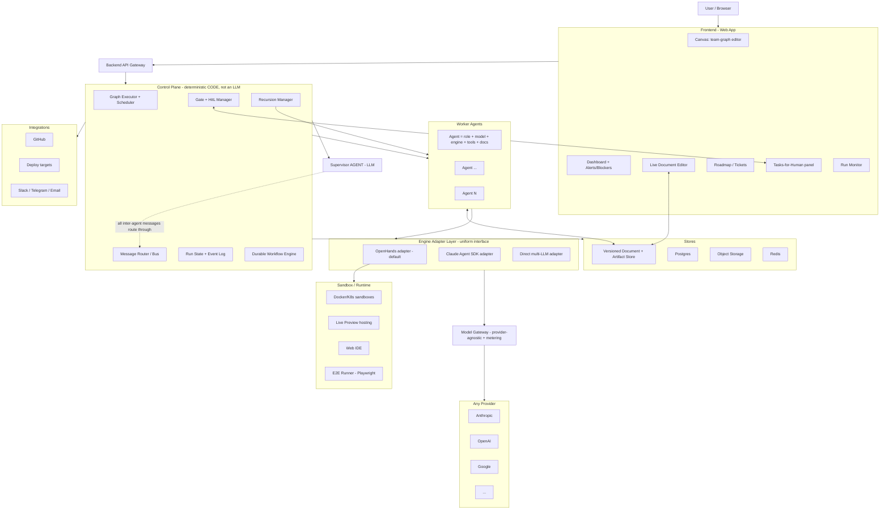
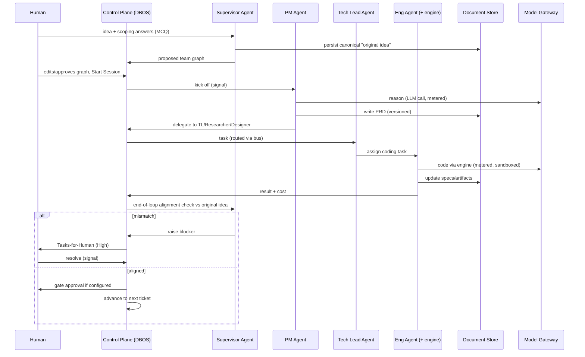
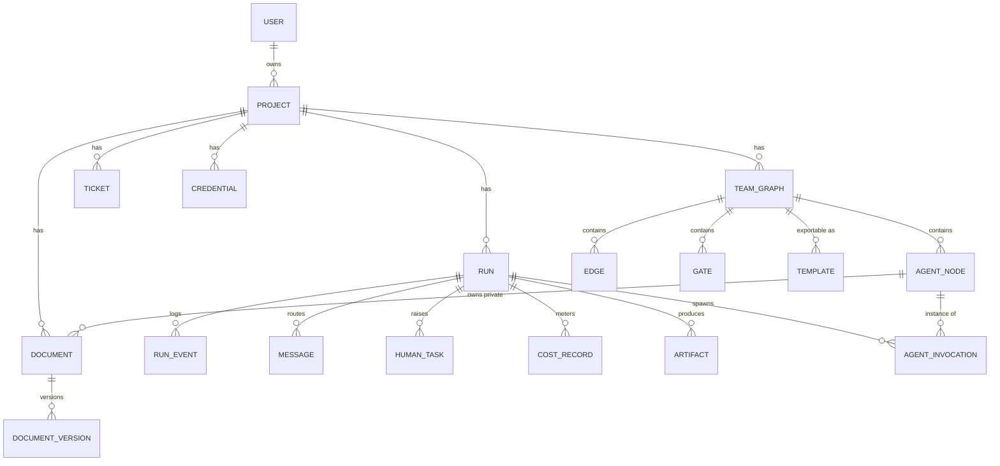

# Tvashtr — Project Plan

> **Living document.** The single source of truth for scope, architecture, decisions, and build sequence.
> Maintained by the architect/planner chat (Tvashtr-N) via direct filesystem access. Updated at the end of each step and before every handover.
>
> **Last updated:** 2026-06-27 — **Tvashtr-33.** Option A Milestone 2 (the authoring-panel per-node "Last run" brief + the `cloned_from_node_id` linkage) SHIPPED + FF-merged to `main` @ `5f65904` (alembic head `0014`). **STRATEGIC PIVOT DECIDED (this session — no code yet):** the next strategic bet is **local execution → brownfield** — Tvashtr runs locally and ships a *reviewed* feature into the user's **real existing repo** (not just greenfield throwaway apps) — built as the **cheapest version on the current stack** (run the stack locally + mount the user's folder as the agent workspace), **NOT** a native-desktop re-platform and **NOT** local-LLMs-as-a-pillar. Operator stance is **build-first:** no demand validation is sought until a real *feature-shipping* Tvashtr exists (a half-working brownfield probe would fail on the hard case and yield a false "no"). Full rationale + the competitive research are in the **2026-06-26 §17 entry** and **§13 S3/S4**. **M-brownfield Slice 1 (the backend "work on a real local folder" run mode) SHIPPED + FF-merged to `main` @ `6530ddb` (alembic head `0015`)** — isolated `git worktree` mount + branch-only ship (`tvashtr/<run_id>`) + git-aware host↔container sync + invisible repo-grounding, all gated on `runs.repo_path` so greenfield is byte-intact (260 backend tests). **M-brownfield Slice 2 (the launch-panel UI) SHIPPED + FF-merged to `main` @ `8f22592`** (144 vitest, +18) — clicking "Run this team" opens a launch panel with an idea box + a "work on a local repo" toggle (typed path + base-branch dropdown via `POST /api/repo/inspect`) + a dismissible large-repo worker-model hint; the run banner reports the brownfield branch; greenfield byte-intact. **M-brownfield Slice 3 (the brownfield review-loop = the EXIT-BAR proof) SHIPPED + FF-merged to `main` @ `758e9b5` (262 backend / 144 vitest)** — the §15 worker-gating split (the D6 grounding is now orientation-for-all + a worker-only `WORKER_PROTOCOL`, so a Reviewer gates rather than implements) + a live `make brownfield-loop-check` proving a composed PM→Engineer⇄Reviewer team ships a *correct, reviewer-approved* change into a real-shaped repo with the user's tree untouched. **The M-brownfield exit bar is CLEARED for rung 1.** NEXT (Tvashtr-34): the harder-rung real-repo ladder (rung 2 = a real OSS repo, operator-run, where D4's model-choice reality bites) + the registered review-loop reliability fix (rework rounds can drop a landed edit — likely machinery, not just model).
>
> **Project root:** `/Users/adimac/Desktop/Tvashtr` — where Claude Code runs. The architect chat maintains the living docs here **directly** via the Filesystem MCP.

---

## 0. How to use this document

- This file is the **contract** between planning chats and implementation (Claude Code). Anything not written here is not yet decided.
- **Division of labor (non-negotiable).** The planning chat (Claude) is **architect/planner ONLY**: it designs, decomposes, **writes the Claude Code prompt**, reviews Claude Code's report, **verifies by reading the changed files/logs against the acceptance criteria**, and maintains this file + `HANDOVER.md`. **Claude Code does ALL implementation** — product code, **throwaway/diagnostic/acceptance scripts, AND build/`Makefile`/config changes alike**. The architect does **not** write implementation directly; when tempted to, it **writes a prompt instead**. The *only* edits the architect makes directly are the two living docs and trivial doc/comment/typo fixes. **There is NO "diagnostics / acceptance tooling are architect-direct" exception** — that earlier carve-out (the Tvashtr-8 note in §17, propagated into HANDOVER) is overturned; see the **2026-06-16 (Tvashtr-9)** §17 entry.
- **Decisions** are recorded in §17 (Decision Log) with rationale. When we change our minds, we *amend the log*, we don't silently rewrite history.
- **Status conventions** used throughout: `DECIDED` (committed), `CANDIDATE` (leading choice, pending verification), `DEFERRED` (intentionally postponed, designed-for but not built), `OPEN` (unresolved question).
- Tool/vendor *brand names* are mostly `CANDIDATE` and get locked in the **Phase 0** research step before any build prompt depends on them. The architectural *patterns* are `DECIDED`.

---

## 1. Overview & Vision

### One line
**Tvashtr is a canvas for composing and running your own teams of AI agents that take a product idea — or a feature request against an existing codebase — to working, reviewed software.** It's a place to *build* the AI team, not just *use* one.

### What it is
Instead of running a fixed pipeline, the user **authors the team**: which roles exist (research, PM, design, engineering, testing, or anything they define), how work and reviews flow between them, where the review/human gates sit, and which model each node runs on. Every node is a **blank, prompt-driven agent** whose entire identity is its editable `prompt` (the Tvashtr-25 pivot — there is **no** privileged "Supervisor" runtime node; the deterministic Control Plane runs the authored graph, routing on the topology the user drew). The work products — PRDs, designs, specs — are **real, live-editable documents**, not state hidden inside agent memory, so the user steers continuously rather than only at kickoff. The loop ships features iteratively, each one **reviewed against the original idea** before the next is added.

### The strategic direction (2026-06-26 — Tvashtr-31)
The active near-term bet is **local execution → brownfield**: Tvashtr runs locally and operates on the user's **real existing repository** — the agent edits real files, the Reviewer gates the real diff, the ship step commits to a real branch — rather than only generating greenfield throwaway apps. This is the demand-aligned north star (§14, §15). It is pursued as the **cheapest version on the current stack** (run the existing web stack locally + mount the user's chosen folder as the agent workspace), **not** a native-desktop re-platform (rejected — §17) and **not** local-LLMs-as-a-pillar (supported via LiteLLM, but commoditized and hardware-gated — §17). **The operator's stance is build-first:** no demand validation is sought until a real *feature-shipping* Tvashtr exists, because a half-working brownfield probe would fail on the hard case (existing-repo agentic coding) and yield a false negative. The bar that replaces the probe: a composed, human-steered team produces a **correct, reviewed, shippable** change to a real repo — *that* is simultaneously the differentiator and the thing finally worth validating.

### The problem (the gap we fill)
Two capable worlds exist; the useful combination sits in the gap between them:
- **Composability without autonomy.** Code frameworks (LangGraph, CrewAI, AutoGen) let developers build custom multi-agent systems — but you hand-write the orchestration, message passing, retries, and state, which gates them to engineers. Visual no-code builders (n8n, Dify, Langflow) target **business automation**, not shipping an actual application.
- **Autonomy without composability.** Autonomous coding agents (Devin, OpenHands, Cursor/Claude Code) ship software, but the **team and process are largely automatic/opaque**: you give a task, code comes out, and you don't author who's on the team or steer the intermediate documents as first-class.

**Tvashtr's claim is the *combination*:** author-your-own-team **+** live-steerable documents **+** legibility of what the team did, applied to **real code**.

### Positioning vs. neighbors (honest — researched 2026-06-26, → §17)
The competitive reality is hard. The local agentic-coding arena is the most crowded, best-funded, fastest-churning space in software, and **most of Tvashtr's would-be differentiators are already commoditized**: orchestrator/subagent modes (Kilo, Roo, Goose, Cline), hybrid local/frontier routing (Continue, Roo profiles), spec-driven + audit trail (Kiro), human-in-the-loop approval and checkpoints — all ship in incumbents. The desktop + multi-agent + local form shipped from funded teams in June 2026 (Cognition's **Devin Desktop**, Google's **Antigravity**), and **Tvashtr's own engine, OpenHands, is itself a complete competing platform**. The field has also converged on **bounded, automatic** orchestration (orchestrator + ephemeral subagents returning summaries) and explicitly *away* from user-authored peer teams, which multiplies the design-time failure surface (§13 S2/S3). **The one corner nobody fully occupies** is Tvashtr's actual intersection: coding-vertical × **user-composable** visual team × **live-steerable documents** × **per-node legibility** of what the team did — addressing exactly the "how a framework models time, memory, and failure" gap incumbents are weakest on. That wedge is **unvalidated and counter-trend**, which is precisely why proving it on real code matters before any further bet.

### The thesis (and the honest framing)
Composability — *"the team is mine"* — is the **differentiator** (a vitamin for power users), layered on a **painkiller** (an idea/feature actually becomes working software). The painkiller must work *first*; there is nothing worth composing a team around if the team can't ship — and on a *real existing repo* "can it ship" is the hard, unproven bar (multi-agent systems fail 41–87% of the time; existing-repo work is the hardest case — §13).

### What success looks like
- **Near-term (the new bar):** a **real, feature-shipping Tvashtr** — a composed, human-steered team produces a correct, reviewed, shippable change into a *real existing repo*, run locally, with per-node legibility and live document steering. Either it clears that bar (→ differentiated *and* worth validating) or it can't at solo scale (→ the single most important thing to learn about this project). Both outcomes are real progress, learned by building rather than guessing.
- **A year out (either is a win):** a small base of power users **authoring and sharing** teams with a **template ecosystem** forming — *or* a **portfolio-grade artifact** demonstrating serious AI-systems-plus-product capability. *(Caution from §13 S1: a "portfolio win" must not become an excuse to never test the market once a feature-shipping build exists.)*

### Commercial posture
All four matter; priority order **(b) → (a) → (d) → (c)**: **(b)** a **power-user product** others use, eventually authoring/sharing teams *(primary north star)*; **(a)** a **personal tool** to build real things; **(d)** a **portfolio artifact**; **(c)** **open source**. **Center of gravity:** single-operator-usable immediately, architected so multi-user + sharing later is not a rewrite.

---

## 2. Goals & Non-Goals

### Goals (the product we are building toward)
1. Author an arbitrary agent **team graph**: any roles, any work/review wiring, gates anywhere.
2. **Per-agent** choice of **model** (any provider) **and** execution **engine**.
3. **Arbitrary-depth** sub-agent recursion, owned by Tvashtr (not capped by a vendor runtime).
4. **Live, versioned, human-editable** work documents (PRDs/specs/designs) as the system's spine.
5. Blank, **prompt-driven** team nodes (identity/behavior follows an editable `prompt`, not a hardcoded role); an **optional** generator that *drafts a starting team* by seeding editable node templates — the team is **run by the deterministic Control Plane**, and per-loop review/alignment is itself a prompt-driven node, not a privileged Supervisor. *(Tvashtr-25 pivot — see §17; supersedes the original “a Supervisor that scopes, drafts, runs, and checks” framing across §4/§6.)*
6. **Idea → working software**, shipped feature-by-feature, with **human-in-the-loop** gates and blockers.
7. **Greenfield and brownfield** (import an existing repo and add features).
8. Multiple **output surfaces**: live preview, web IDE sandbox, PR against a repo, clone/ZIP export.
9. **Reliable, resumable, observable** runs with **first-class cost/runaway control**.

### Non-Goals for v1 (`DEFERRED` — designed-for, not built)
- **Auth, accounts, multi-tenancy** hardening.
- **Billing / subscriptions.**
- **Team-template sharing / marketplace** (the data is designed portable from day one; the *sharing infrastructure* is later).
- **Mobile / desktop / CLI** clients (web first).
- **Native cross-provider sub-agent parity as a vendor feature** — we provide recursion ourselves instead (see §7 D3).
- **OSS-publishability driving the stack** — (c) is last; we use whatever is pragmatic, proprietary APIs included.
- **Real-time Google-Docs-grade simultaneous co-editing** of the same document section in v1 (see §13 Risk 2).

---

## 3. Users & Personas

### Primary — "The product-literate solo builder"
A **technical founder, "product engineer," or AI PM** who has *opinions about process* and wants to **orchestrate an agent team without coding the orchestration**. Comfortable with the conceptual weight of roles, wiring, gates, and editing a PRD mid-run. Artifact-centric thinking (editable PRDs/designs) is native to them.

**Jobs-to-be-done:**
- "Turn my idea into shipped software without becoming the human glue between five chat windows."
- "Design the *process* — who reviews what, where I get to approve — not just the prompt."
- "Steer the work continuously by editing the actual documents, not by re-prompting."
- "Reshape the team when reality demands it, and *see* that it helped."

### Secondary — "The team / org" (`DEFERRED`)
Multiple collaborators on shared projects and shared team templates. Drives the eventual auth/multi-tenancy/marketplace work. Out of scope for v1 but the architecture must not preclude it.

---

## 4. Key User Journeys

### J1 — Idea → shipped feature (the core loop)
> *(Tvashtr-25 pivot note — read this journey through the prompt-driven lens: the “Supervisor” below is an **optional generator** that drafts a starting team by seeding **editable prompt-driven node templates** (blank-canvas authoring is equally first-class); the hardcoded role names (PM / Tech Lead / Frontend …) are **template examples**, not fixed-function nodes — every node's behavior follows its `prompt`; the team is **run by the deterministic Control Plane executor**, and the per-loop alignment/review is an ordinary prompt-driven node, not a privileged Supervisor. See §17.)*
1. **Onboard / open dashboard** → see active projects, alerts/blockers, global settings (LLM keys, provider prefs).
2. **Create project** → a chat opens with the **Supervisor Agent**. Optionally set the Supervisor's model, connect a GitHub repo (greenfield or brownfield), supply a design system.
3. **Guided scoping** → Supervisor asks pointed questions about strategy, audience, design, architecture, data — presented as **MCQs** plus *"Decide for me"* and a free-text box (low-friction intake). The **original idea** is captured as a canonical, persisted artifact.
4. **Team drafted** → Supervisor proposes a customized **team graph** (e.g., Researcher, PM, Designer, Frontend, Backend, Tech Lead, Content). The canvas opens.
5. **Start session** → each agent generates its standardized **role/context document**; the run begins. PM writes the PRD and delegates; Tech Lead assigns coding to Frontend/Backend; Researcher analyzes; documents fill in live.
6. **Per-loop alignment** → after each loop the Supervisor checks the build against the **original idea**; mismatches raise a **blocker** and realign sub-agents.
7. **Human gates** → at user-defined stopping points (and on blockers), the run pauses for approval; "Tasks-for-Human" populates.
8. **Ship** → on passing tests (human or automated E2E), code is committed/merged; the feature is reviewed against the idea; the Supervisor advances to the next roadmap ticket per the user's automation settings.

### J2 — Compose / reshape the team (the differentiator)
The user edits the graph: add/remove nodes, rewire work/review edges, place or move gates, set each node's model + engine + tools + instructions. Changes apply **mid-session** or **deferred to end-of-loop** per preference; **pending changes render semi-transparent/disabled** until applied. The effect of a change is **instrumented and attributable** (see §14).

### J3 — Steer mid-run via live documents
While a run is in progress, the user opens a live document (PRD/spec/design), edits it, and the change propagates to the relevant agents on their next read. The document — not agent memory — is the source of truth.

### J4 — Handle a blocker (human-in-the-loop)
The **Tasks-for-Human** panel separates **High/blockers** (essential config/data the agents need — API keys, manual SQL, a decision) from **Low/nudges** (verification that doesn't halt background progress — e.g., a visual smoke check). Blockers pause the dependent branch; the run resumes on resolution.

### J5 — Ship / export
The user chooses any of: **live preview URL**, **web IDE sandbox**, **PR** against a connected repo, or **clone/ZIP** export.

---

## 5. Guiding Architectural Principle

> **Tvashtr owns the orchestration; execution engines are pluggable commodities behind a uniform adapter.**

Every flexibility axis the operator requires — any roles, any wiring, any model per agent, any engine per agent, arbitrary recursion, live docs, gates anywhere — lives in **our** layer, where we control it and never inherit a vendor's ceiling. The one thing we *wrap* rather than rebuild is the unglamorous **coding engine** (the observe→edit→run→test loop plus its sandbox), because that is a genuine multi-year problem others have already solved well — and we wrap a **model-agnostic, self-hostable, forkable** one so even that choice caps nothing.

**Analogy:** we are not buying one car. We build the **chassis, dashboard, and steering** — the part you actually drive — and fit a **swappable engine bay** that accepts any engine block we bolt in.

---

## 6. System Architecture

> **⚠️ Tvashtr-25 pivot supersession (2026-06-24 — see the §17 Tvashtr-25 entry).** This section was written under the original **fixed-function-role + privileged-Supervisor** model; the architecture has since pivoted to a **fully prompt-driven node model**: every agent node is a *blank* AI agent whose entire identity/behavior follows its editable `prompt` (the executor no longer branches on `role_name`/`config.agent_kind`), routing is the **authored graph topology** (a generic outcome-label any node emits, matched by `Edge.conditions`), the pre-built PM/Engineer/Reviewer builders are an **editable TEMPLATE library** (not runtime dispatch), and the **“Supervisor” is demoted to an OPTIONAL generator** that *drafts a starting team* (seeding those templates) — never a standing runtime node, and never the thing that “runs” the team or “checks each loop” (the deterministic Control Plane runs the team; review/alignment is itself a prompt-driven node). **Read the 6.1 component diagram and the 6.3 run-loop sequence below as illustrative of the *historical* fixed-role model** — the privileged `Supervisor AGENT` box, the “all inter-agent messages route through Supervisor” arc, and the hardcoded `PM/Tech Lead/Eng` lanes are superseded by the prompt-driven model above. The Control-Plane-is-code spine (D2's robustness core), gates + terminals as control primitives, documents-as-spine (D5), the engine-adapter seam (D1), and recursion (D3) are **unchanged**.

### 6.1 Component diagram

### 6.2 The nine layers
1. **Frontend / Canvas** — node-graph team editor; dashboard; live document editor; agile roadmap/tickets; "Tasks-for-Human" panel; run monitor. Responsive web.
2. **Control Plane (deterministic — code, not an LLM).** The orchestration brain: graph executor + scheduler, the message router that *is* the comms bus, durable run state + event log, gate/HitL manager, recursion manager — all on a **durable workflow engine** so long, human-interruptible, *cyclic* runs are resumable, observable, and crash-safe.
3. **Optional Supervisor / generator (LLM)** *(Tvashtr-25 pivot — demoted).* An **optional** team-drafting generator: it scopes an idea and *proposes a starting team graph* by seeding **editable prompt-driven node templates**. It is **not** a standing runtime layer, does **not** “run” the team (the deterministic Control Plane executor does), and does **not** perform a privileged per-loop alignment check (review/alignment is an ordinary prompt-driven node a user can place). Blank-canvas authoring + the template library are the primary path; the generator is a convenience that assembles templates (see §7 D2 + the §17 Tvashtr-25 entry).
4. **Agent nodes (prompt-driven).** Each is a **blank** AI agent whose identity/behavior follows an editable **`prompt`** — the pivot's core. A node = `prompt (identity/behavior) + capability (“thinker”=`completion` / “worker”=`agent`, the existing `kind`) + model` (+ engine, MCP tools, documents). There are **no hardcoded roles**; `role_name` survives only as a display/legacy label. Fully user-defined; the pre-built PM/Engineer/Reviewer nodes are now drop-and-edit **templates**, not runtime dispatch.
5. **Engine Adapter Layer.** Uniform interface over execution backends. **OpenHands = default** (model-agnostic, sandbox included, MIT/forkable); **Claude Agent SDK** and a **direct multi-LLM** adapter are secondary; new engines slot in without touching anything above.
6. **Model Gateway.** Provider-agnostic routing so any node uses any model from any provider; the single chokepoint for API keys, **cost metering**, and rate limits.
7. **Sandbox / Runtime.** Where code executes (Docker/K8s), plus live-preview hosting, a web IDE, and the Playwright E2E runner.
8. **Stores.** Versioned document/artifact store (the live-editable spine), Postgres, object storage, Redis.
9. **Integrations.** GitHub (import/PR/clone), deploy targets, Slack/Telegram/Email.

### 6.3 Core run-loop data flow

### 6.4 Horizontal team vs. vertical recursion (the mental model)
- **Horizontal team (always Tvashtr's job).** The canvas nodes delegating *across* to each other — an **org chart** with arbitrary depth (e.g. a coordinator node → worker nodes). Authored by the user on the canvas (optionally seeded from templates or the optional generator) and **run by the Control Plane**. *(Tvashtr-25 — the “Supervisor provides the team” framing is superseded: the team is authored/templated, the Control Plane runs it.)*
- **Vertical recursion (inside one node).** A node parallelizing its *own* work via transient children — **temp contractors** for a rush who report back and vanish. Where a backend offers native parallel subagents we use them opportunistically; the **general arbitrary-depth capability is ours** (Recursion Manager), because native runtime recursion is capped at one level.

---

## 7. Key Technical Decisions (with rationale)

| # | Decision | Status | Rationale |
|---|----------|--------|-----------|
| **D1** | **Engine-adapter pattern; OpenHands as the default engine.** Per-node engine choice, not just per-node model. | `DECIDED` | Standardizing on one vendor runtime caps models + recursion depth; building the coding loop from scratch wastes years on the one solved problem. OpenHands is the only runtime that is itself **model-agnostic, self-hostable, forkable**, and **ships its own Docker/K8s sandbox** — so it constrains nothing. Claude Agent SDK + direct-LLM adapters give breadth. |
| **D2** | **Deterministic Control Plane (code), distinct from any LLM agent.** *(Originally “split the Supervisor into a Control Plane + a Supervisor Agent”; the Control-Plane half stands, the Supervisor-Agent half was demoted by the Tvashtr-25 pivot.)* | `DECIDED` (Control Plane); Supervisor-Agent **demoted** Tvashtr-25 | An LLM can't be both the reasoning brain *and* a reliable, lossless message router / budget enforcer — so routing, scheduling, state, gates, recursion, and caps are **code** (the robustness core, **unchanged**). The pivot's refinement: there is **no privileged “Supervisor Agent” runtime node** — every agent is a blank prompt-driven node the Control Plane runs, and the old Supervisor survives only as an *optional generator* that drafts prompt-driven templates. See the §17 Tvashtr-25 entry. |
| **D3** | **Recursion is Tvashtr's primitive — arbitrary depth.** | `DECIDED` | The operator wants "maybe even more" than native spawning, and native runtime subagents are capped at one level. The Recursion Manager instantiates children of any depth as real (possibly ephemeral) graph nodes; native parallel subagents are used opportunistically for cheap fan-out. |
| **D4** | **The team is a *cyclic* graph (with enforced termination), not a DAG.** | `DECIDED` | Review loops (work→review→rework) are cycles. The executor supports loops with explicit termination (gate conditions + loop caps) or runs never end — a key reason a real workflow engine is required. |
| **D5** | **Documents are first-class, versioned entities — never hidden agent memory.** | `DECIDED` | Simultaneously the differentiator *and* the LLM-agnosticism mechanism: agents read/write shared + private markdown, the human edits live, and swapping a node's model preserves context via the document. |
| **D6** | **Per-agent capabilities via MCP tool servers.** | `DECIDED` | "What an agent can *do*" becomes as composable as its role/model/engine. |
| **D7** | **Python backend, React/TypeScript frontend.** | `DECIDED` (stack family) | The execution engines and agent SDKs (OpenHands, Claude Agent SDK) are **Python-native**; the AI ecosystem (LiteLLM, MCP, Playwright bindings) is Python-first. React + a node-graph library is the standard for canvas UIs. |
| **D8** | **A durable workflow engine underpins the Control Plane.** Engine: **DBOS Transact** (Python, MIT); Temporal is the named fallback if we hit a scale/tooling wall. | `DECIDED` (pattern + engine, 2026-06-10) | Long-running, partially-autonomous, human-interruptible cyclic runs must be resumable, crash-safe, and observable. DBOS chosen over Temporal: in-process library over Postgres (zero extra services in Compose); `recv`/`send`/`set_event` map 1:1 onto gates/HitL/status; checkpoint-resume recovery is far more forgiving than Temporal's strict replay determinism — important when Claude Code writes the workflow code. See §17. |
| **D9** | **A provider-agnostic Model Gateway is the single metering chokepoint.** Tool: **LiteLLM** (MIT). | `DECIDED` (pattern + tool, 2026-06-10) | Enables any-model-any-provider per node and makes cost tracking + rate limiting enforceable in one place. LiteLLM remains the self-hosted standard (100+ providers, virtual keys, per-project budgets); OpenHands itself wraps LiteLLM internally, so model identifiers align across the stack. |
| **D10** | **Walking-skeleton-first build sequence** despite a max-flexibility architecture. | `DECIDED` | Flexibility is designed in from day one, but we always keep something running end-to-end and grow outward. Architecture is not compromised for speed; the *sequence* is disciplined. |

---

## 8. Tech Stack (locked 2026-06-10 — Phase 0 research; ✅ operator signed off 2026-06-10)

> Verified against the mid-2026 state of each tool (web research, Tvashtr-2). Adapter boundaries keep any individual swap cheap.

| Layer | Choice | Status | Rationale / notes |
|-------|-----------|--------|-------------------|
| Frontend framework | React + TypeScript + Tailwind | `DECIDED` | Standard, fast, large ecosystem. |
| Canvas / node graph | React Flow (`@xyflow/react`) | `DECIDED` | MIT, actively maintained (2026), the unchallenged standard for node-graph editing; used by Stripe/Typeform; layouting (Dagre/ELK) + a shadcn-style component kit exist. |
| Document editor | TipTap (ProseMirror) | `DECIDED` | Headless (we own the UI), markdown + JSON in/out, huge extension ecosystem. Chosen specifically because its collaboration story **is Yjs** — the Risk-2 upgrade (locks → CRDT) needs no editor swap. Phase-0 skeleton uses a plain render/textarea; TipTap lands in Phase 1. |
| Real-time transport | WebSockets via FastAPI | `DECIDED` | Live run monitor, doc updates, blocker alerts. |
| Backend | Python + FastAPI | `DECIDED` | Aligns with Python-native engines/SDKs; async-friendly. |
| Durable workflow engine | **DBOS Transact** (Python lib, MIT) | `DECIDED` | In-process durable execution over Postgres — no extra cluster. `DBOS.recv()/send()/set_event()` = our gates/HitL/status primitives; durable sleep for days-long waits; programmatic cancel/resume/fork; queues. Checkpoint-resume (vs Temporal's strict replay determinism) is far more forgiving of LLM-written workflow code. Caveat: the Conductor console is proprietary for production use — acceptable; our run-monitor UI is a planned product feature and DBOS state is queryable in Postgres system tables. **Temporal = named fallback** (gold standard, but a separate cluster; Compose officially dev-only). |
| Model gateway | **LiteLLM** | `DECIDED` | MIT, 100+ providers, OpenAI-compatible, virtual keys, per-project budgets, spend tracking; the 2026 self-hosted standard. Skeleton: SDK in-process with our own CostRecord writes; **proxy container lands in Phase 1** when budget enforcement/virtual keys become MVP-critical. OpenHands uses LiteLLM internally → model identifiers align across the stack. |
| Default engine | **OpenHands via its Software Agent SDK** | `DECIDED` (default per D1) | OpenHands now ships a first-class Python SDK (`openhands.sdk`: `LLM`, `Conversation`, workspaces) + a REST agent server — MIT, model-agnostic, sandbox included. This is the engine we call programmatically. |
| Secondary engines | Claude Agent SDK; direct multi-LLM | `DECIDED` (sequence) | Claude Agent SDK verified (Python, pip-installable, bundles CLI; **Claude-only**; native subagents remain flat lead→child; alpha on PyPI but stable core; note the **June 15, 2026 metering change** — separate Agent SDK credit pool on subscription plans). Built as **adapter #2 in Phase 2** to prove the adapter pattern with a genuinely different engine. |
| Sandbox | OpenHands' built-in Docker workspaces | `DECIDED` | The SDK's Docker-sandboxed workspace / agent server is the v1 sandbox. E2B remains the named alternative (e.g. preview hosting later). |
| E2E testing | Playwright | `DECIDED` | DOM interaction, screenshots, visual/functional verification. (Phase 3.) |
| Relational store | Postgres (JSONB for graph specs) | `DECIDED` | Relational integrity + flexible JSON; **also DBOS's durability substrate** — one database serves both. |
| Cache/queue/pubsub | Redis | `DECIDED` | Ephemeral state, pub/sub for live updates. (Introduce when needed; not in the skeleton.) |
| Object storage | S3 / MinIO | `DECIDED` | Artifacts, code bundles, screenshots. (Introduce when needed; not in the skeleton.) |
| Doc concurrency (v1) | Versioned store + **document-level** advisory soft lock + agent re-read-before-write | `DECIDED` (2026-06-10; refined by Q4, 2026-06-15) | Immutable-append versions make data loss structurally impossible; the lock is advisory (correctness = re-read-before-write). Named upgrade rungs: **section-level soft locks** (operator-flagged) → **Yjs/CRDT** (§15 register). |
| Integrations | GitHub App/API; Slack/Telegram/Email (SMTP/SendGrid) | `CANDIDATE` | Import/PR/clone + notifications. Locked when Phase 1/3 reaches them. |
| Local deploy | Docker Compose (v1); K8s later | `DECIDED` | Self-host-first posture. Compose stack is small: backend (FastAPI+DBOS in-process), frontend, Postgres — LiteLLM proxy joins in Phase 1. |

---

## 9. Data Model / Schema

> Relational core in Postgres; graph specs and agent configs stored as JSONB where flexibility matters; documents versioned. This is the **initial** model — expect refinement in Phase 0/1.

### 9.1 Entity-relationship overview

### 9.2 Key entities (initial fields)
- **User** — `id, type(individual|org), settings(jsonb), created_at`. *(Auth deferred; entity exists.)*
- **Project** — `id, user_id, name, description, original_idea(text, canonical), status, design_system_ref, repo_ref, engine_defaults(jsonb), model_defaults(jsonb), budget_caps(jsonb), automation_settings(jsonb), created_at`.
- **TeamGraph** — `id, project_id, version, status(draft|active|archived), layout(jsonb), created_at`. **Serializable/exportable** as a portable spec (foundation for templates/sharing).
- **AgentNode** — `id, team_graph_id, kind(agent|completion|gate|terminal), prompt(text — the node's identity/behavior; THE pivot's core, P1.8a migration 0012), model_config(jsonb), engine_config(jsonb: adapter,opts), tool_config(jsonb: MCP servers), config(jsonb: gate/terminal params), position(x,y), status, created_at`. *(Tvashtr-25 pivot: identity/behavior follows `prompt`, not a hardcoded role; `kind` carries the capability tier [thinker=`completion` / worker=`agent`]; the legacy `role_name`/`system_instructions` survive only as a display label / are subsumed by `prompt`; the executor no longer branches on `role_name`/`config.agent_kind`.)*
- **Edge** — `id, team_graph_id, source_node_id, target_node_id, edge_type(work|review|report), conditions(jsonb)`.
- **Gate** *(model revised 2026-06-18 — Tvashtr-14; **gate-as-NODE**, superseding the original `attached_to(node|edge)` decorator)* — a gate is a **first-class node**, not a separate entity decorating a node/edge: an `AgentNode` row whose `kind` is `gate` (alongside `agent`/`completion`/`terminal`), with its own `position`, an `AgentInvocation` (so the canvas renders its paused/resolved state natively), and a `config(jsonb: gate_kind(prd_approval|review_escalation|...), title, description)`. The executor **pauses at it** (the durable `wait_at_gate` `recv`) and emits `approved`/`rejected` as the node's outcome, which the pure `next_node` routes down the matching edge (`{when:"rejected"}` → a stop terminal; the unconditional/`{when:"approved"}` edge → onward). A loop cap is **not** a gate-decorator but a `loop_limit` on the loop-back `Edge.conditions`, routing to a `review_escalation` gate node when exhausted. *(Rationale: the as-built generic executor + the §1/J2 vision — the user "places/moves gates anywhere" and a gate-reshape must be "legible and attributable" — both require a gate to be a movable, attributable canvas citizen, i.e. a node; edges/invocations/the-canvas all already key on `agent_nodes.id`. P1.5b builds it; see the 2026-06-18 (Tvashtr-14) §17 entry.)*
- **Document** — `id, project_id, type(prd|design|spec|role_file|context_file|other), title, scope(shared|agent_private), owner_node_id(nullable), current_content, lock_state(jsonb), created_at, updated_at`. **[Two-layer model, Tvashtr-28 (P1.8c):** in the prompt-driven team a `scope=shared` spec is the single work product a thinker chain refines (today `Run.pm_document_id`, generalized in P1.8c so ANY thinker appends a version, not only the start PM); a per-node "work-brief" (backward, "last run") generalizes `AgentInvocation.outcome_detail` to every node. Per-node document routing (a node owns/consumes a SPECIFIC document, not only the shared spec) is M2+. See the §17 Tvashtr-28 entry + §15.]**
- **DocumentVersion** — `id, document_id, version, content, author_type(human|agent), author_id, diff, created_at`.
- **Run** *(a.k.a. Session)* — `id, project_id, team_graph_version, workflow_id(durable engine handle), status, idea_snapshot, started_at, ended_at, cost_total`.
- **RunEvent** — `id, run_id, ts, type, source_node_id, payload(jsonb)`. *(The observability/monitor feed.)*
- **Message** — `id, run_id, from_node_id, to_node_id, content, routed_via_supervisor(bool), created_at`. *(The bus record. Tvashtr-25: `routed_via_supervisor` is legacy — there is no privileged Supervisor router; the Control Plane bus routes.)*
- **HumanTask** — `id, run_id, priority(high_blocker|low_nudge), blocking(bool), title, description, status(pending|resolved), resolution, created_at`.
- **Ticket** — `id, project_id, title, description, status(backlog|in_progress|review|done), feature_order, run_id, created_at`.
- **AgentInvocation** — `id, run_id, node_id, parent_invocation_id(nullable), depth, status, cost, started_at, ended_at`. *(Tracks recursion / ephemeral children.)*
- **CostRecord** — `id, run_id, invocation_id, provider, model, tokens_in, tokens_out, cost, ts`. *(Written by the Model Gateway.)*
- **Artifact** — `id, run_id, type(code|build|preview_url|screenshot|report), location, meta(jsonb), created_at`.
- **Credential** — `id, scope(user|project), type(github|llm_provider|supabase|slack|...), encrypted_secret, config(jsonb)`.
- **Template** *(deferred)* — `id, source_team_graph_id, author_id, name, description, visibility, spec(jsonb)`.

---

## 10. External Integrations & APIs
- **LLM providers** (via Model Gateway): Anthropic, OpenAI, Google, others — any-model-any-provider per agent.
- **GitHub**: repo import (brownfield), branch/commit, PR creation, clone/export. Likely a GitHub App for scoped access.
- **Sandbox/runtime**: OpenHands' Docker/K8s sandbox; preview hosting; web IDE; Playwright for E2E.
- **Notifications**: Slack, Telegram, Email — live updates, blocker alerts, loop completions.
- **(Later) Supabase / external services** the *built apps* may need — surfaced as HitL blockers when keys/SQL are required.

---

## 11. Infrastructure, Deployment & Environments
- **Project root:** `/Users/adimac/Desktop/Tvashtr` — the codebase Claude Code builds in; the architect chat has direct **Filesystem-MCP** read/write access here.
- **v1 posture:** **self-hostable**, single-operator, low-concurrency. **Docker Compose** for the full stack (frontend, backend/API, control plane + workflow engine, Postgres, Redis, object storage, sandbox runtime).
- **Environments:** `local/dev` first; a `staging`-like single deploy as needed. Production multi-tenant infra is `DEFERRED`.
- **Scale path:** move sandboxes + workers to **Kubernetes** when concurrency demands it; the adapter + workflow-engine boundaries make this an ops change, not a rearchitecture.

---

## 12. Security, Auth & Compliance
- **Auth:** `DEFERRED` for v1 (single operator). Architecture namespaces everything by **project/user** now so multi-user is additive.
- **Secrets:** all credentials (LLM keys, GitHub tokens, service keys) **encrypted at rest**; injected at run time; never written into documents or logs.
- **Code-execution isolation:** agent-run code executes **only in sandboxes** (the engine's containerized runtime); no host access. This is the primary security surface and is treated as such.
- **Runaway/cost as a safety control:** budget caps, depth/loop limits, and a kill switch are security-relevant, not just financial (see §13 Risk 3).
- **Compliance:** none required at v1 (single operator). Revisit if/when multi-user or hosted offering arrives.

---

## 13. Risks, Mitigations, Open Questions & Assumptions

### Top risks (and committed mitigations)
**Risk 1 — Reliable execution of long-running, human-interruptible, *cyclic* agent graphs.**
*Mitigation (`DECIDED`):* durable workflow engine — deterministic, replayable orchestration with LLM/engine calls isolated as activities; **human gates block indefinitely on a signal** (no polling, no lost state); **cycles are loops with enforced termination** (gate conditions + loop caps); the engine's **event history is the observability/monitor feed**. Crash mid-run → clean resume.

**Risk 2 — Concurrent human + agent document editing.**
*Mitigation (`DECIDED` for v1):* versioned store + a **document-level** advisory soft lock + **agents re-read before write** (optimistic concurrency). Immutable-append versions guarantee no data loss; the advisory lock minimizes collisions.
*Honest caveat:* this is **not** Google-Docs-grade simultaneous *same-section* co-editing. **CRDT (Yjs/Automerge) is the named upgrade** if that case proves common.
*Ladder (partially resolved, Q4 2026-06-15):* v1 = a document-level advisory lock; **section-level soft locks** (operator-flagged important) then **CRDT (Yjs/Automerge)** are the named higher rungs — climbed at build time as real human/agent contention warrants. Tracked in the §15 register so neither is mistaken for dropped.

**Risk 3 — Cost / runaway from arbitrary recursion across premium models.**
*Mitigation (`DECIDED`):* layered caps enforced in the Control Plane with the **Model Gateway as the single dollar-metering chokepoint** — per-call token caps; per-agent turn/iteration limits; **recursion depth + max-children-per-node + a global active-agent ceiling**; **per-run and per-project budget hard-stops with threshold alerts**; and a **human kill switch** (reusing Risk 1's interrupt path). First-class, not afterthoughts.

### Other risks
- **Scope is very large.** *Mitigation:* walking-skeleton-first + strict phase sequencing (§15), even with unlimited time.
- **Fast-moving tooling.** *Mitigation:* lock brand names in Phase 0 with fresh verification; keep adapter boundaries so swaps are cheap.
- **Supervisor as a bottleneck/quality risk** (it scopes, drafts, *and* judges alignment). *Mitigation:* its judgments are persisted as documents/events (auditable, editable), and the human can override at gates. *(Tvashtr-25 — largely RETIRED by the pivot: the Supervisor no longer judges alignment at runtime; it is an optional team-drafting generator only, so this single-point-of-quality risk no longer applies to the runtime. Per-loop review is a user-placed prompt-driven node, auditable like any other.)*

### Strategic / demand-side risks (Tvashtr-17, updated 2026-06-26 — Tvashtr-31; about *whether to build*, not *can we build* — the §13 risks above are execution risks)
> Surfaced by the Tvashtr-17 strategic teardown and sharpened by the Tvashtr-31 competitive research (→ §17, 2026-06-26). No engineering quality addresses these. Tracked so the build cadence doesn't bury them.
- **S1 — The only validated user is the founder; the success metric permits a market-less "win."** Many sessions, zero non-founder users; §1 counts a "portfolio-grade artifact" as a win, so building can "succeed" without anyone wanting it. *Stance (Tvashtr-31):* validation is **deliberately deferred** until a real *feature-shipping* Tvashtr exists (a half-working probe yields a false negative on the hard case) — but once it exists, the market test is non-negotiable; S1 must not become a permanent excuse.
- **S2 — The buyer may sit in a dead zone:** people who can design an agent team don't need the canvas; people who need it can't design the team — the canvas removes *syntax* (a small barrier for the capable) and leaves *judgment* (the real barrier) intact (the n8n/Node-RED visual-programming death valley). **Reinforced by the 2026-06-26 research:** multi-agent systems fail 41–87% of tasks (Cemri et al., NeurIPS 2025), 44% of failures are *specification* failures introduced at design time, and the field's consensus is that most teams lack the discipline to compose them correctly — i.e. the freedom Tvashtr sells is partly the freedom to build the fragile thing. *Mitigation:* drop-and-edit prompt-driven node **templates** (known-good Planner-Worker-Judge shapes) + an **optional generator**; lean on legibility (what the team did) as the value, not unlimited composability.
- **S3 — The gap is closing from both sides faster than a solo founder can ship into it. CONFIRMED and widened (2026-06-26).** The control scaffolding that was Tvashtr's differentiation now ships free inside incumbents: orchestrator/subagent modes (Kilo, Roo, Goose, Cline), hybrid local/frontier routing, spec-driven + audit (Kiro), HITL + checkpoints — and **Devin Desktop** (Cognition, Jun 2) + **Antigravity** (Google) shipped the exact desktop-multi-agent-local product, while **OpenHands (Tvashtr's own engine) is a complete competing platform**. AI-coding economics are brutal (~17% gross margins; the industry moved to usage-based metering Jun 2026). *Mitigation:* compete only on the un-commoditized corner — user-composable + live-steerable documents + per-node legibility on **real code** (§1) — and prove it cheaply before betting; do **not** re-enter the arena as "a better local coding agent." *Trigger:* re-check the incumbent delta every phase.
- **S4 — Build-first risks substituting visible technical progress for the scary market question (added Tvashtr-31).** Re-platforming/feature-building *feels* like progress while dodging "does anyone want this." *Mitigation (the discipline that makes build-first rational):* keep the build **bounded** — the next milestone is the *smallest* feature-shipping version on the *current stack* (local-run + repo-mount), measured in weeks, not a native-app re-platform. "Build before validating" is recoverable only while the bet stays small.

### Assumptions
- Operator manages **time and scope**; the plan sequences by **dependency, not deadline**.
- **Greenfield** Tvashtr codebase, built **via Claude Code**; no inherited repos/designs/accounts.
- **Web-first**; single-operator v1; auth/billing/sharing deferred.
- True **multi-provider** is required (not Claude-only) — this is *why* the engine-adapter + model-gateway design exists.

### Open questions (resolved 2026-06-10 — Tvashtr-2; ✅ operator signed off 2026-06-10)
1. Document concurrency ladder depth (Risk 2). **`RESOLVED`** — v1 locks at versioned store + soft section locks + agent re-read-before-write; **no CRDT in v1**. Yjs remains the named upgrade, made native by the TipTap choice (see §8).
2. Document editor choice. **`RESOLVED`** — **TipTap (ProseMirror)**; skeleton uses a plain render, TipTap lands Phase 1 (see §8).
3. First walking-skeleton engine. **`RESOLVED`** — **OpenHands via its Software Agent SDK.** The original case for Claude Agent SDK ("lighter to call") evaporated: OpenHands now ships an equally light Python SDK, and it is model-agnostic with the sandbox included — so the skeleton exercises the *real* default engine from day one. Claude Agent SDK (Claude-only, alpha on PyPI) becomes adapter #2 in Phase 2.
4. Durable-engine / model-gateway brand locks. **`RESOLVED`** — **DBOS Transact** + **LiteLLM** (rationale in §8 / D8 / D9; Temporal named fallback).

---

## 14. Feature Breakdown (prioritized)

### MVP-critical (painkiller + the spine) — ✅ largely SHIPPED through Phase 1
- Deterministic Control Plane on a durable workflow engine (state, scheduling, bus, gates, recursion). ✅
- One Engine Adapter + Model Gateway producing real code in a Docker sandbox. ✅
- Blank **prompt-driven nodes + an editable template library** (the Tvashtr-25 intake; the old fixed "Supervisor" is only an optional generator). ✅
- Versioned, live-editable document layer (PRD/specs); live mid-run steering (P1.7). ✅
- Cyclic work/review loop with a per-loop alignment check + blockers; **agent-backed Reviewer judging real code** (P1.5c). ✅
- Human gates + **Tasks-for-Human**; cost caps + kill switch. ✅
- GitHub greenfield + commit; one output surface. *(P1.9 — local-workspace ship today; real-repo PR pending.)*

### Differentiator (the vitamin) — composability + legibility
- Full canvas editing: add/remove/rewire nodes, place gates, graph-validity gating (P1.8d). ✅
- Per-node **prompt + capability (thinker/worker) + model** selection. ✅
- **Composability legibility** — a team/gate change is **visible and attributable** (the product expression of the §1 success metric): the team **A/B "which config ships better"** instrument (§14.1–14.3, Tvashtr-19–21) ✅, plus the **per-node "what I did last run" work-brief** in the run view (M1, Tvashtr-30) ✅ and the authoring panel via `cloned_from_node_id` (M2, Tvashtr-31) ✅.
- Team graph serializable/exportable; per-node MCP tools; arbitrary-depth recursion. *(DEFERRED — vitamins on vitamins; §15.)*

### The active near-term bet (promoted 2026-06-26 — Tvashtr-31)
- **Brownfield — local execution on the user's real repo** *(was under "Depth & autonomy"; now THE next milestone)*: run the stack locally + mount a real folder as the agent workspace, so the composed team ships a *reviewed* feature into an existing codebase. This is the demand-aligned north star and the "real feature-shipping Tvashtr" bar (§1, §15). The hard part is **correctness on existing code** (not the mounting) — the 41–87% multi-agent failure zone, on the hardest case.

### Depth & autonomy (later)
- Automated E2E testing agent (Playwright) + smoke automation; user-defined stopping points; all four output surfaces; notifications; ticket-roadmap UI.

### Deferred (designed-for, not built in v1)
- Auth/accounts/multi-tenancy; team-template sharing/marketplace; billing; CRDT real-time co-editing (Risk 2 upgrade); **native-desktop packaging** *(rejected as a near-term bet — §17; the proven local form factors are CLI / editor-extension / local-web, not a heavy bundled-server app)*.

---

## 15. Phased Roadmap / Build Sequence

> Architecture is fully flexible from day one; phases govern *what we turn on*, not how flexible the foundation is. Each phase keeps something running end-to-end. *(Per-slice as-built detail lives in git history + §17; this section is the compressed roadmap.)*

### Phase 0 — Foundations & Walking Skeleton ✅ COMPLETE (2026-06-15)
**Goal:** prove the orchestration spine + execution end-to-end on the smallest slice. **Exit (met):** idea → 2-agent run → one PRD doc → trivial feature committed, resumable across a deliberate `kill -9`.
**Shipped (P0.1–P0.5):** monorepo + durable spine (DBOS crash-resume); minimal Model Gateway (LiteLLM, provider-agnostic) + versioned Document layer; the `EngineAdapter` contract + OpenHands adapter; the 2-node run (PM→Engineer) with idempotent ship (`ship-{run_id}` tag) + the crash-resume proof (`make skeleton-crash`); the React Flow canvas with live per-node status + the inspect-the-work side panel. **Stack LOCKED 2026-06-10:** DBOS Transact · LiteLLM · React Flow · OpenHands SDK (engine + sandbox) · TipTap (Phase-1 editor) · concurrency = soft locks (no CRDT in v1).

### Phase 1 — The Painkiller (idea → shipped feature) ✅ COMPLETE (P1.1–P1.8d shipped; P1.9 real-repo PR pending)
**Goal:** Tvashtr actually builds real things with an authored team, on the real substrate. **Exit (M1, met):** a non-trivial feature shipped from an idea with a human gate, a resolved blocker, and an agent-backed Reviewer judging real code.
**Durable sequencing principle (Tvashtr-5):** *loop-first* + safety/cost/control enablers front-loaded — kill switch, caps, sandbox, and the agent-spend chokepoint land **before** the loop runs real code, each validatable against the existing spine. The cyclic loop is **graph-driven** (a generic executor runs whatever team-graph rows it's given).
**Strategic re-aim (Tvashtr-17):** live-editable documents (P1.7) + composability *attributability* (the A/B instrument) elevated as the moats incumbents commoditize least; **brownfield registered as the demand-aligned north star**; recursion / all-four-output-surfaces / template-marketplace / canvas-polish frozen (elaboration that doesn't make the product more *wanted*).
**Shipped:** P1.1 HitL gates + Tasks-for-Human + kill switch · P1.2 per-run dollar cap (breach-as-blocker, $5 safety-default) · P1.3 Docker sandbox (forced-escape containment proven; default flipped local→docker) · P1.4 LiteLLM proxy + per-run virtual-key mid-loop spend cutoff · P1.5 cyclic work/review executor + gates/terminals as graph nodes + Tasks-for-Human drawer + the **P1.5c capstone** (real multi-file feature + the LIVE agent-Reviewer = M1) · §14.1–14.3 the team **A/B instrument** + verdict-reasons persistence · P1.7 live-editable PRD steering (backend re-source + TipTap editor) · FE-infra sweep (ESLint + Prettier + RTL + `scripts`→ruff).
**The Tvashtr-25 PIVOT (P1.8, load-bearing):** fixed-function role nodes RETIRED for a **prompt-driven node model** — node = `prompt` (its whole identity) + `capability` (thinker=`completion`/worker=`agent`, maps onto `kind`) + `model`; the executor runs `node.prompt` **generically** and routes on the **user-authored topology** via generic outcome labels matched by `Edge.conditions {when}`; gates/terminals stay deterministic; `teams.py` builders become an editable **template library**; the Supervisor survives only as an **optional generator**. **Shipped:** P1.8a backend core (migration `0012` `prompt`) · P1.8b editable prompt-driven team + clone-on-launch + team library (migration `0013` `is_library`) · P1.8c generic thinker node + capability authoring + `thinker_chain` template · P1.8d canvas topology editing (node/edge CRUD + graph-validity gating — the J2 "author your own wiring" marquee) · the per-node work-brief **M1** (run view, no migration) + **M2** (authoring view, `cloned_from_node_id`, migration `0014`). *(Remaining: P1.9 — swap the local-workspace ship for a real-repo PR.)*

### Phase 1.5 — Brownfield / local execution (PROMOTED 2026-06-26 — Tvashtr-31; the active bet)
**Goal:** a **real, feature-shipping Tvashtr** — the composed team ships a *reviewed* feature into the user's **real existing repo**, run locally. **Exit (M-brownfield):** a non-trivial feature request against a real existing codebase produces a correct, reviewed, shippable change, with per-node legibility + live document steering intact.
**Scope (cheapest version on the current stack — NOT a native app):** run the existing stack locally in one command; a **"work on a real local folder" run mode** that mounts the user's chosen repo as the agent workspace (instead of an ephemeral clone) — Engineer edits real files, Reviewer gates the real diff, ship commits to a real branch; optionally surface a per-node "Ollama (local)" model option (LiteLLM already does the work — zero milestone scope). **The hard part is correctness on existing code**, not the mounting (the 41–87% multi-agent-failure zone on the hardest case) — model choice, context handling, and the review gate actually catching breakage are the real work. **Rejected:** native-desktop re-platform; local-LLMs-as-a-pillar (§17, §13 S3).

**Status (Tvashtr-32):** **Slice 1 (backend run mode) SHIPPED + merged** — `runs.repo_path`-discriminated brownfield: `git worktree` mount (D1), branch-only local ship + mig `0015` (D2), git-aware sync (D3), invisible repo-grounding (D6); proven by `make brownfield-check` (a real docker+NIM run lands a correct change on `tvashtr/<run_id>` in a fixture repo, the repo's tests pass, the working tree is untouched). **Slice 2 (launch-panel UI) SHIPPED + merged** (D5 + the D4 hint) — "Run this team" opens a panel (idea box + "work on a local repo" toggle → typed path + branch dropdown via `inspectRepo` + the dismissible large-repo worker-model hint naming the team's `agent`-kind nodes); greenfield byte-intact. **Slice 3 (the brownfield review-loop run) SHIPPED + merged** — the §15 worker-gating split (the D6 grounding split into orientation-for-all + a worker-only protocol, so a Reviewer gates rather than implements) + a live `make brownfield-loop-check`: a real docker+NIM `review_loop` ships a *correct, reviewer-approved* `bulk_discount` change into a rung-1 real-shaped `shop` package, the repo's tests GREEN on the branch, the user's tree untouched. **The M-brownfield exit bar is CLEARED for rung 1.** **Next:** the harder-rung real-repo ladder (rung 2 = a real OSS repo, operator-run) + the registered review-loop reliability fix (rework rounds can drop a landed edit). The six design decisions D1–D6 are the 2026-06-27 (Tvashtr-32) §17 entry; the Slice-3 as-built is the 2026-06-27 (Tvashtr-33) §17 entry.

### Phase 2 — The Vitamin (composability) — largely realized via the Tvashtr-25 pivot
**Goal:** "the team is mine," and reshaping it is **legible.** Full canvas editing, per-node model/capability, composability-legibility instrumentation — mostly shipped (P1.8b–d, the A/B instrument, the work-brief). **Remaining vitamins (deferred):** per-agent engine selection beyond OpenHands, per-agent MCP tools, arbitrary-depth recursion, the serializable export surface.

### Phase 3 — Autonomy & QA depth (later)
Automated E2E agent (Playwright) + smoke automation; user-defined stopping points; all four output surfaces; notifications; ticket roadmap UI. **Exit:** a feature shipped with no manual smoke test.

### Phase 4 — Multi-user & Sharing (`DEFERRED` until justified)
Auth, accounts, multi-tenancy hardening, team-template sharing/marketplace, billing. **Trigger:** only when there is something worth opening to others (posture **b**).

### Cross-cutting (continuous)
Observability & cost dashboards; document-concurrency hardening (locks → CRDT decision); security hardening of secrets + sandbox.

### Deferred refinements & named upgrades (tracked — NOT dropped)
> A scannable register of consciously-deferred engineering refinements, each with a concrete revisit trigger. **The operator has flagged several as important — do not let them silently disappear.** *(Completed items removed — they live in git + §17. The list below is OPEN items only.)*

**Metering / cost**
- **Agent-native resume (Option B)** — on crash, re-attach a `RemoteConversation` to the still-running container by `conversation_id` instead of restarting the agent (eliminates double-spend *and* the "workspace not reset → a re-run can ship a different/empty deliverable" correctness edge). *Trigger:* long/expensive loops (brownfield/P1.5+).
- **Exact spend-accounting across crashes** — make `cost_records` a faithful spend ledger incl. wasted retries (today approximate). *Trigger:* when approximate spend is no longer acceptable.
- **LiteLLM metering-collapse** — route the PM's direct calls through the proxy too + make proxy-reported spend the authoritative `CostRecord` (also fixes the OpenRouter `$0`-pricing gap). *Trigger:* the staged metering-collapse follow-on.
- **Per-project budget cap** *(operator-flagged)* — a ceiling across all of a project's runs, same chokepoint as the per-run cap. *Trigger:* when a Project entity lands.
- **Richer budget-breach resolution** — grant a specific additional increment vs the binary override. *Trigger:* many spend steps where "continue to completion" is too coarse.
- **Short-circuit the proxy budget-429 retry-backoff** — the terminal budget 429 is retried ~5× with backoff (no extra spend, multi-minute finalization delay). *Trigger:* when the latency bites (longer loops / a per-step timeout).

**Documents / locks / memory**
- **Section-level soft document locks** *(operator-flagged)* — the rung between doc-level v1 and CRDT. *Trigger:* same-document/different-section human+agent contention.
- **CRDT real-time co-editing (Yjs)** — Risk-2 upgrade. *Trigger:* same-*section* contention proves common.
- **Agentic memory — Postgres-now → `pgvector`-next → a framework only if the four hard problems bite** (fact extraction, dedup/merge, forgetting/invalidation, query routing) *(operator-requested research, Tvashtr-22)*. Episodic memory already lives in Postgres (DBOS state + `RunEvent` + `AgentInvocation` + versioned `Document`); keep it as source-of-truth; add typed/schema'd rows + timestamps/validity windows + observability-from-day-one. **Distinct from the presentation layers** (the shared spec + the per-node work-brief are human-facing; memory is the node's own cross-run agent-facing recall — three orthogonal layers sharing the recorded-history substrate). *Trigger:* cross-session/long-horizon recall — **almost certainly the brownfield phase** (an agent recalling a repo's conventions across sessions).
- **Per-node document routing** — let a node produce/consume a *specific* named document, not just the single shared spec. *Trigger:* a team needs >1 work product, or output must route to a named doc.

**Sandbox / Docker / observability**
- **Agent workspace lifecycle / GC** — `.tvashtr_workspaces/<run_id>/` accumulates with no cleanup. *Trigger:* disk growth / run volume.
- **WebSocket real-time transport** — replace ~2s polling with FastAPI WebSockets (push). *Trigger:* high-frequency monitor + live doc co-editing + blocker alerts.
- **Per-run container targeting** — reaping is by image (the installed `DockerWorkspace` exposes no per-run name/label hook); correct while runs are serial. *Trigger:* >1 agent run in flight (parallel nodes / multi-project).
- **Per-run sandbox-mode observability** — record which sandbox (`local`/`docker`) a run used. *Trigger:* when sandbox choice varies per run/node.
- **Separate the Agent Server's event stores from the deliverable workspace** — today a directory denylist excludes `bash_events/`+`conversations/`; brittle. *Trigger:* the denylist misses a new store, or before complex multi-file pulls.
- **Pin the agent-server image to a digest** — `…:latest-python` is a moving tag. *Trigger:* before relying on reproducible container runs.
- **Proxy loopback-binding hardening** — the proxy binds `4000` on all interfaces (needed for `host.docker.internal`); protected by the master key. *Trigger:* exposing the proxy beyond a local machine.
- **`run_event_sink` `seq` collision across runs** — each `run()` restarts `seq` at 0; per-iteration rows collide and are silently dropped (observability-only). *Trigger:* when the live event stream matters (WebSocket / richer event log).
- **Cancelled-gate blocked-`recv` thread lingers** until its wait window elapses (sync `recv` isn't preempted by cancel; benign for one operator). *Trigger:* many concurrent gated runs.

**Canvas / authoring / cleanup**
- **`deriveNodeStatus` "never-reached node reads Failed"** *(operator-flagged — do not let disappear)* — on a failed run, the terminal-fold paints "Failed" onto nodes the walk never reached (should read idle/waiting). FE-only fix. *Trigger:* fold into the topology/node-state successor, or take standalone.
- **Semantic graph coherence** — P1.8d ships *structural* validity (root-is-a-thinker, termination, reachability), but does NOT police *semantic* coherence (capability/prompt mismatch; a flipped node whose prompt no longer matches its capability). *Trigger:* when bad-but-runnable authored graphs hurt.
- **"Converse with a node" — explain (Mode A) + command→self-edit (Mode B)** — ASK a node to explain what it did (Mode A, over its recorded history — **its substrate, the authoring work-brief + `cloned_from_node_id`, shipped in M2**) or COMMAND a change where the node rewrites its OWN prompt for the next run (Mode B, propose-then-approve, riding M3's read-latest-prompt). *Trigger:* after M3 mid-run prompt re-read (Mode B) + a per-node chat surface (Mode A is now buildable).
- **Thinker-as-router** — today only workers (verdict harvest) and gates branch; a thinker routes forward-only. Letting a thinker emit a routing label needs a new executor harvest path for completion output. *Trigger:* a team that branches on a thinker's judgment.
- **Gate/terminal post-drop config editing** — a gate's title / a terminal's ship-vs-stop can't be changed post-drop (the panel doesn't open for them). Small + additive.
- **Per-node model is free-text, not a validated registry** — a typo'd slug fails at run time, not edit time (curated `MODEL_PRESETS` quick-pick exists). *Trigger:* when typo-fails-at-runtime hurts / a model-discovery UX is wanted.
- **TeamNodePanel kind-guard** — the panel relies on the canvas's `onNodeClick` filter (the PATCH 409 is the real guard). *Trigger:* a second entry point to the node panel (a node list / search).
- **Rename-a-team** — named at creation; no in-UI rename. *Trigger:* relabel without recreating.
- **No `<App/>` team-library lifecycle test** — covered at the seam (rail handlers + backend + e2e) but no full RTL create→edit→delete→select cycle. *Trigger:* a FE refactor that risks a lifecycle regression.
- **A/B robustness** — `create_ab_runs` isn't atomic (a partial failure can leave a single-run pair), and the A/B `ABCompare` view has no in-UI cancel + its aesthetic eyeball was skipped for velocity. *Trigger:* before an external demo of the A/B view, or when A/B runs get expensive.
- **Cosmetic renames** (the byte-intact discipline kept these) — `config.agent_kind` (now unread) drop; `REVIEW_VERDICT.json`→`OUTCOME.json`; `pm_step`→generic `thinker`/`spec_step` + `pm_document_id`→`spec_document_id` + its stale docstring; the stale `clone_team_graph` `PERSISTENT_TEAM_NAME` comment. *Trigger:* the next legitimate touch of each file.
- **User-authored custom presets** — saving your OWN node as a reusable preset (Phase-4 / marketplace territory).
- **Worker work-brief enrichment** — surface the agent's own natural-language final message instead of the deterministic files-changed line. *Trigger:* when the files-changed line proves too thin.
- **Local-adapter `files_changed` is empty (dev-only)** — the **docker** adapter (the product default) DOES populate `files_changed` (via `_pull_workspace`), confirmed Tvashtr-31; only the LOCAL sandbox's before/after snapshot returns empty, so the live worker brief is hollow on `local`-pinned dev smokes only. Low priority. *Trigger:* if the local dev smokes need a non-empty brief — fix `openhands_adapter.py`'s snapshot scoping (or use the enrichment above).

**Brownfield / real-repo run mode (M-brownfield)**
- **Reviewer should verify spec-met, not only tests-green** *(Tvashtr-33 finding)* — the proven 70b agent-Reviewer approves on tests-green without checking the change actually satisfies the idea/PRD (it rubber-stamps). The brownfield exit-bar driver's *independent* behavioral check is the real correctness gate today, not the Reviewer. *Trigger:* the D4 "recommend a stronger reviewer model" lever for harder rungs; or a stronger reviewer prompt/grounding nudge.
- **Rework rounds can drop a landed edit** *(Tvashtr-33 finding — the most correctness-relevant open item)* — when the Reviewer requests changes, the Engineer's rework iteration sometimes regenerates and LOSES the worker's already-correct edit, so the branch tip ends *without* the feature. This made the rung-1 exit-bar proof **probabilistic** (it passes on rolls where the Reviewer approves round 1 → no rework). Likely at least partly **machinery** (the revision-context / worktree carry-forward across iterations), NOT purely model quality. *Trigger:* before relying on the brownfield review-loop's reliability — investigate the revision flow first; do not assume a stronger model fixes it.
- **Rung 2+ — harder / real OSS repos (the graduated ladder, operator-run)** — the rung-1 exit-bar proof uses a purpose-built hermetic `shop` package; the real correctness-on-existing-code thesis (the 41–87% zone) needs progressively harder, less-controlled repos. The Reviewer-gating-the-real-diff machinery is proven on the worktree mount (Slice 3); what's unproven is whether it holds on a messy real repo. *Trigger:* now (the next step after rung 1) — operator-run + manual, because a real external repo breaks hermeticity/cleanup and is where D4's model-choice reality bites (the proven 70b is unlikely to hold).
- **Selective (git-diff) workspace pull** — the brownfield pull copies all non-`.git` container files each iteration (correct via host-side `git add -A`, but O(working-set)); the standard `git_changes`/diff-only pull (seed a container-side git baseline) is faster and the OpenHands-native mechanism. *Trigger:* when a real (large) repo run gets slow — relevant the moment rung 2 tests beyond a tractable fixture.
- **`repo_path` allow-list** — `POST /api/repo/inspect` + `create_run` accept any local path (fine for a single-operator local tool; the backend is the user's own process). *Trigger:* multi-user / any non-local deployment (Phase 4).
- **Nicer ship-branch name than `tvashtr/<run_id>`** — the branch carries the raw run uuid; a slug from the idea would read better in the user's `git branch`. *Trigger:* when the uuid branch name proves awkward in real use.

---

## 16. Milestones
- **M0 — Spine proven:** ✅ **ACHIEVED 2026-06-15 (Phase 0 CLOSED).** `make skeleton-crash` proves the 2-node run (idea → PRD → committed feature) resumes across a `kill -9` mid-agent-run and ships **exactly once** (P0.4b); P0.5 made the spine **visible** (React Flow canvas, live per-node status) and **inspectable** (PRD + versions, run-event feed). Closeout: `docs/M0-walkthrough.md`.
- **M1 — First real ship:** ✅ **ACHIEVED (P1.5c capstone, Tvashtr-18)** — a non-trivial multi-file feature from an idea, with the **agent-backed Reviewer genuinely judging real code** (a completion-node reviewer makes the loop theatre). M1 proves the *machinery* end-to-end (greenfield).
- **M2 — Composability earns its keep:** ✅ **machinery in place** — the team **A/B "which config ships better"** instrument (§14.1–14.3) + the per-node work-brief (run + authoring views). M2 *demonstrates* composability legibility; whether reshaping the team *measurably* changes the output is the value question, tested by the A/B view.
- **M-brownfield — A real feature-shipping Tvashtr (the active bet, Tvashtr-31):** a composed, human-steered team ships a **correct, reviewed** feature into the user's **real existing repo**, run locally (the cheapest version on the current stack — local-run + repo-mount). This is now the near-term gate that *precedes* demand validation (the operator's build-first stance). Clearing it = differentiated *and* worth validating; not clearing it at solo scale = the most important thing to learn (§1, §13 S4). **Progress (Tvashtr-33):** Slices 1 (backend run mode) + 2 (launch-panel UI) + 3 (the brownfield review-loop) SHIPPED + merged — the worktree mount, branch ship, git-aware sync, repo-grounding, the run-launch UI, AND the exit-bar proof are all in. **The exit bar is CLEARED for rung 1:** `make brownfield-loop-check` proved a composed PM→Engineer⇄Reviewer team ships a correct, reviewer-approved change into a real-shaped repo (the user's tree untouched). **Remaining (Tvashtr-34+):** the harder-rung ladder (rung 2 = a real, non-trivial feature on a real OSS repo, operator-run — where the correctness thesis is genuinely stress-tested) + the registered review-loop reliability fix (rework rounds can drop a landed edit).
- **Mv — Value validated (the real gate, off the phase ladder):** a non-founder user ships something real on their own repo and reaches for "reshape the team" unprompted. **Deliberately gated behind M-brownfield** (no validation until a feature-shipping build exists — §13 S1/S4). The §13 S1–S3 strategic risks live or die here, not in the build.
- **M3 — Hands-off + anywhere:** auto-E2E + all export surfaces (later).
- **M4 — Opened up:** multi-user + sharing (only if/when triggered).

---

## 17. Decision Log

> Append-only record of durable decisions + rationale (we *amend* the log, never silently rewrite history). **Compressed 2026-06-26 (Tvashtr-31):** the granular per-slice as-built narratives (P0.x / P1.x, Tvashtr-1→30) were consolidated into the one-liners below — full detail lives in git history (commit messages + the prior PROJECTPLAN revisions) and in §15. The most recent strategic decision is at the bottom, in full.

### Durable decisions (chronological, compressed)
- **2026-06-09 (T1) — Foundations locked.** Name = *Tvashtr* (Vedic divine artificer, "maker of makers"). Commercial priority **(b)→(a)→(d)→(c)** (power-user product first). *Flexibility is the product* (operator chose maximum flexibility). Architecture committed: **engine-adapter + OpenHands default** + a deterministic **Control Plane** on a **durable workflow engine**. Three top execution risks accepted with named mitigations (§13). v1 defaults: web-first, greenfield Tvashtr built via Claude Code, single-operator. Project root `/Users/adimac/Desktop/Tvashtr` (capital-T). PROJECTPLAN authored + signed off; Filesystem MCP access granted to the architect chat.
- **2026-06-10 (T2) — Stack LOCKED (Phase-0 research, operator signed off).** **DBOS Transact** (durable engine; Temporal = named fallback) · **LiteLLM** (model gateway, provider-agnostic from day one) · **React Flow** (canvas) · **OpenHands SDK** (engine + sandbox) · **TipTap/ProseMirror** (Phase-1 doc editor) · concurrency ladder v1 = versioned store + **soft section locks** + agent re-read-before-write (**no CRDT in v1**; Yjs = named upgrade). Open questions (doc concurrency, editor, first engine, durable/gateway brands) all RESOLVED.
- **2026-06-15 (T3-4) — Walking skeleton + M0.** P0.4 decisions: agent-run crash durability = **restart + idempotent ship** (git tag `ship-{run_id}`); agent-internal LLM metering = OpenHands **post-run telemetry**. P0.1–P0.4 shipped; **M0 crash-resume PROVEN** (`make skeleton-crash`: killed mid-agent-run, DBOS recovered in a fresh process, shipped exactly once). P0.5 minimal UI shipped (React Flow canvas + live per-node status polled ~1.8s; side panel = PRD+versions + run-event feed). **Phase 0 CLOSED.** WebSocket = named Phase-1 transport upgrade.
- **2026-06-15→17 (T5-10) — Phase-1 painkiller, safety-first.** Phase 1 decomposed P1.1–P1.9, **loop-first** sequence locked; the §13 risk mitigations (kill switch, caps, sandbox, agent-spend chokepoint) front-loaded before the loop runs real code. Shipped: **P1.1** HitL gates + Tasks-for-Human + kill switch (DBOS `recv`/`send` + programmatic cancel) · **P1.2** per-run dollar cap (breach pauses as a `budget_approval` blocker; $5 safety-default, opt-out via `null`) · **P1.3** Docker sandbox behind the unchanged `EngineAdapter` (ephemeral host ports; **forced-escape containment PROVEN** on two layers — least-privilege + the `--rm` no-bind-mount boundary; default flipped `local`→`docker`).
- **2026-06-17→19 (T11-16) — Proxy + the cyclic loop.** **P1.4** LiteLLM proxy as the agent-internal spend chokepoint + **per-run virtual key** with a hard mid-loop spend cutoff (429 budget cutoff, server-side, no extra spend). **P1.5a/b** the **generic cyclic edge-following executor** (runs whatever team-graph rows it's given; enforced termination via loop caps + gate conditions) + cyclic canvas + the mid-loop crash proof + **gates/terminals as first-class graph nodes** (uniform walk) + the **Tasks-for-Human drawer** (High/blockers vs Low/nudges; the over-budget blocker + the 80% nudge both fired live).
- **2026-06-19 (T17) — STRATEGIC REVIEW (founder-requested YC/PG teardown).** Added the §13 **S1–S3 strategic/demand-side risks** (founder-only validation; the composability dead-zone; incumbents closing the gap). Roadmap re-aimed: **live-editable documents (P1.7)** + **composability attributability** (the A/B instrument) elevated as the moats incumbents commoditize least; **brownfield registered as the demand-aligned north star**; recursion / all-four-output-surfaces / template-marketplace / canvas-polish FROZEN. The **agent-backed Reviewer** (`completion`→`agent`) PROMOTED into the P1.5c capstone (a completion-node reviewer can't run tests / read a diff → the review loop would be theatre).
- **2026-06-23→24 (T18-24) — Capstone (M1) + the differentiator instrument + steering + FE-infra.** **P1.5c capstone = M1**: the real multi-file feature + the **LIVE agent-Reviewer** genuinely testing a real build in its sandbox. **§14.1–14.3** the team **A/B "which config ships better"** instrument (run the same idea through config-A vs config-B, surface the measurable delta) + verdict-reasons persistence + the comparison view. **P1.7a/b** live-editable PRD steering (recorded live re-source replacing the PM's snapshot + a TipTap markdown editor + the live J3 E2E). **FE-infra sweep**: ESLint (type-checked) + Prettier + a protective RTL suite + `make test-frontend`/`build-frontend` + `scripts`→ruff. **CLI `/goal` + bypass execution model went live & guarded** (the no-push **PreToolUse** hook + the migration-freeze **PreToolUse** hook both survive `--dangerously-skip-permissions`; deny-rules do NOT). Proven agent model: **`nvidia_nim/meta/llama-3.3-70b-instruct`** (~1.4s/call); `DEFAULT_MODEL` (completion) = `openai/gpt-4o-mini` (a reasoning model there silently returns empty content).
- **2026-06-24 (T25) — THE ARCHITECTURAL PIVOT (operator-directed, the load-bearing one).** Fixed-function role nodes **RETIRED** for a fully **prompt-driven node model**: every node = a `prompt` (its entire identity/behavior) + a `capability` (thinker=`completion` / worker=`agent`, mapping onto the existing `kind` — no new column) + a `model`. The executor runs `node.prompt` **generically** and **stops branching on `role_name`/`config.agent_kind`**; routing = the **user-authored graph topology** via **generic outcome labels** any node emits, matched by `Edge.conditions {when}` (the reviewer loop-back becomes a no-`when` catch-all). Gates + terminals stay **deterministic** control primitives. `teams.py`'s PM/Engineer/Reviewer builders become an editable **template library** (drop-and-edit). The Supervisor survives **only** as an optional generator that seeds prompt-driven node templates — never a privileged runtime node. **P1.8a** backend core shipped (migration `0012` `agent_nodes.prompt` + the de-roled executor).
- **2026-06-24→26 (T26-29) — The prompt-driven rebuild shipped.** **P1.8b** editable prompt-driven team + clone-on-launch + the **team library** (multiple persistent teams + a drop-and-edit template library; migration `0013` `is_library`) · **P1.8c** the generic **thinker** node (composable anywhere) + capability (thinker↔worker) authoring + the `thinker_chain` template · **P1.8d** canvas **topology editing** (node/edge CRUD + a pure importable `validate_graph` gating only un-runnable graphs — single thinker root, enforced termination, orphan warnings; the J2 "author your own wiring" marquee).
- **2026-06-26 (T30) — Option A Milestone 1.** The per-node **"what I did last run" work-brief** generalized across node types (deterministic, no-LLM) + surfaced in the **RUN-view** side panel (selects by node-id, switches on `kind`; no migration — `outcome_detail` shipped in `0011`). The Reviewer's verdict view stays byte-identical.
- **2026-06-26 (T31) — Option A Milestone 2.** The authoring-panel per-node work-brief, enabled by a new back-reference `agent_nodes.cloned_from_node_id` (nullable, **no FK** — authored nodes are deletable so a dangling value matches nothing; indexed, plus an index on the previously-unindexed `agent_invocations.node_id`). Read = **per-node latest invocation across all the team's runs** (`DISTINCT ON (cloned_from_node_id) … ORDER BY started_at DESC` — survives a later run that skipped a node), folded into the authoring `GET /api/teams/{id}/graph` only. Shared `LastRun.tsx` extracted (run-view byte-identical). Migration `0014`. **This is the converse-with-a-node Mode-A substrate.** Shipped + FF-merged to `main` @ `5f65904`.

### 2026-06-26 (Tvashtr-31) — STRATEGIC PIVOT: local execution → brownfield, build-first

**Decision.** The next strategic bet is **local execution → brownfield**: Tvashtr runs locally and ships a *reviewed* feature into the user's **real existing repository** (the agent edits real files, the Reviewer gates the real diff, ship commits to a real branch), pursued as the **cheapest version on the current stack** — run the existing web stack locally + mount the user's chosen folder as the agent workspace. **Rejected:** (a) a **native-desktop re-platform** — the server-shaped stack (FastAPI + DBOS + Postgres + Docker + LiteLLM) fights it, the proven local form factors are CLI / editor-extension / local-web (not a heavy bundled-server app), and the niche was just taken; (b) **local-LLMs-as-a-pillar** — commoditized and hardware-gated (the good local coding models need ~40–48 GB; an Air can't run them), kept only as a near-free LiteLLM-backed option with **zero milestone scope**. **The operator's overriding stance is build-first:** *no demand validation is sought until a real feature-shipping Tvashtr exists.* The next milestone = a **"work on a real local folder" run mode** (M-brownfield, §15 Phase 1.5, §16).

**Why build-first here (the architect conceded its own prior "validate-first" push).** This product's hard case is agentic coding on an *existing* repo, and the research below shows multi-agent systems fail 41–87% of tasks even before that difficulty. A half-working brownfield probe would most likely **fail to ship the feature**, and a user would reject it because it *broke*, not because the concept is unwanted — a **false negative** that could bury a good concept. A clean willingness-to-pay signal is only obtainable once it works. The discipline that keeps build-first rational (not avoidant): keep the bet **bounded** — the smallest feature-shipping version on the *current* stack, in weeks, not a re-platform (§13 S4). The genuinely brave work is putting a rough local-repo build in front of one real user and risking a "no" — *not* spending months re-platforming around an unanswered question.

**The competitive research (≈20 searches, mid-2026 sources) — what it found.**
- **The "compose your own team" thesis is counter-trend.** The 2025 single-vs-multi-agent debate (Cognition's "Don't Build Multi-Agents" vs Anthropic's multi-agent research post) has, by 2026, *resolved* toward **bounded, automatic, hierarchical orchestration** (an orchestrator spawning ephemeral subagents that return summary strings — no peer-to-peer, no shared mutable state), explicitly *away* from user-authored peer teams. Even Cognition conceded (Mar 2026 "Devin can now Manage Devins"). The reliability data: multi-agent fails **41–87% of tasks** (Cemri et al., NeurIPS 2025, n=1,642), costs ~**15× tokens**, **44%** of failures are *specification* failures introduced **at design time**; the consensus is most teams lack the discipline to compose correctly. → Tvashtr selling "author any team" is partly selling the freedom to build the fragile thing (§13 S2).
- **The arena is a bloodbath, and most differentiators are commoditized.** The composable-builder space is crowded (n8n ~150k★, Dify ~114k★, Flowise [Workday], CrewAI [60% Fortune 500], LangGraph, Sim Studio) but mostly horizontal/non-coding. The *local coding* arena is worse: OpenCode ~177k★, **OpenHands ~75k★ (Tvashtr's own engine — a free competing platform with LiteLLM/Ollama)**, Cline ~58k★, Goose ~32k★. Orchestrator/subagent modes (Kilo, Roo, Goose, Cline), hybrid local/frontier routing (Continue, Roo profiles, Nous Portal), spec-driven + audit (Kiro), HITL + checkpoints — **all already ship**. **Devin Desktop** (Cognition, Jun 2 2026) + **Antigravity** (Google) shipped the exact desktop-multi-agent-local product. Economics are brutal: **~17% gross margins** vs ~70% SaaS (the token bill eats unit economics), forcing the whole industry to usage-based metering (Jun 2026).
- **The one un-occupied corner** = Tvashtr's actual intersection: **coding-vertical × user-composable visual team × live-steerable documents × per-node legibility, on real code** — addressing the "how a framework models time, memory, and failure" gap incumbents are weakest on. It is **unvalidated and counter-trend**, which makes proving it on real code (M-brownfield) the precondition for any further bet, and makes re-entering the arena as "a better local coding agent" a losing move.

**Verdict on the three pivot claims.** Local-repo access = **necessary** for brownfield (right instinct) but table-stakes, not a differentiator. Local LLMs = more viable than a quarter ago but commoditized + hardware-gated → not a reason to pick Tvashtr. Native packaging = the worst of the three (expensive, anti-pattern for the stack, niche taken). The honest near-term north star is the un-commoditized corner, proven cheaply on a real repo first.

---

### 2026-06-27 (Tvashtr-32) — M-brownfield design (D1–D6) + Slice 1 (backend run mode) shipped

**The six design decisions (all from the vision; each paired with its UX consequence),** grounded by reading the live workspace path on disk first (`create_run` → `run_team` → `load_graph_step` → `run_graph`; the lazy `engineer_setup_step` → `make_local_workspace`; host-side `idempotent_ship`; the copy-based docker adapter):
- **D1 — Mount = isolated `git worktree`, never in-place.** `git worktree add -b tvashtr/<run_id> <ws> <base_ref>` (shared object store → the branch lands in the user's real repo; their working tree is never touched). In-place rejected as the path-of-least-resistance that breaks "*reviewed* before it lands." *UX:* the user points at a repo folder + base branch at launch; the run never disturbs their tree; the result is a branch they review/merge.
- **D2 — Ship = branch-only, fully local (no push/PR — that's P1.9).** Commit onto the worktree's HEAD (= the branch). New durable state: three nullable `Run` cols (mig `0015`) — `repo_path` (the greenfield/brownfield discriminator), `base_ref`, `ship_branch`. *UX:* the run banner reports "Shipped to `tvashtr/<run>` off `<base>` — N files"; the user owns the merge.
- **D3 — Git-aware host↔container sync (brownfield).** Push tracked + untracked-not-ignored files (tracked dotfiles reach the container); pull all non-`.git` files (edited dotfiles come back); host-side `git add -A` honors the repo `.gitignore` (the diff is the source of truth). Bind-mount rejected (the no-bind-mount containment boundary is load-bearing). *UX:* the produced diff respects the repo's real config/conventions, not a config-starved subset.
- **D4 — Correctness = recommend, don't enforce (don't automate away judgment).** Model/template/grounding/ladder are recommendations, never forced. Driven by research (~20 sources): the 41–87% multi-agent-failure zone is a *design/process* problem ("better models won't fix it"; ~44% are specification failures), while frontier models hit ~80% on SWE-bench Verified — the gap *is* the disciplined verified pipeline Tvashtr is. *UX:* contextual hints (e.g. the large-repo "use a stronger worker model" nudge), not blockers.
- **D5 — Launch surface = one unified panel; brownfield is a run-target choice, not a separate mode** (the team graph is identical greenfield/brownfield — `repo_path` lives on the Run, not the team). Adds an idea box (the UI had none — runs used the env default), a "work on a local repo" toggle → typed repo path + branch dropdown, a `POST /api/repo/inspect` endpoint, and the worker-node model hint. (Slice 2.) *UX:* click Run → optionally flip "work on a local repo" → paste path → pick branch → (if big) the model nudge → Run.
- **D6 — Repo-grounding = invisible appended context, not an authored node** (same uniform-append as idea+PRD; a grounding node would fragment the one-team model + force boilerplate). Block = conventions file (priority-picked, truncated) + depth-capped structure summary + a transparency line. Heavy AST/vector indexing stays the §15 pgvector upgrade. *UX:* nothing new on the canvas; the payoff is result quality + a "grounded on `<repo>`; conventions: …" trust line.

**Slice 1 (backend run mode) — as-built, SHIPPED + FF-merged (`main` @ `6530ddb`, mig head `0015`, 260 backend tests).** Mig `0015` (3 nullable `runs` cols); a new openhands-free `control_plane/worktree.py` (`repo_inspect`, idempotent/resume-safe `add_worktree`, `build_repo_grounding`); `team_run.py` brownfield threading (all greenfield call sites byte-intact, gated on `repo_path`/`grounding`); an additive defaulted `AgentTask.workspace_mode` (mirrors `llm_api_key`); `enumerate_push_files_git` + mode-branched docker push/pull (greenfield byte-identical); `POST /api/repo/inspect` + `create_run` `repo_path`/`base_ref` (422-validated); `make brownfield-check` (a real docker+NIM run landing a correct change on a fixture repo, the repo's pytest green, the working tree untouched — a six-way conjunction gate, no weakened assertions); the migration-freeze regex bumped to `0001`–`0015`. **Disk-audited** (architect): git FF-able + unpushed; greenfield byte-intactness diffed against `main`; tests mutation-real; the deviation below scrutinized.

**The one substantive deviation (logged, judged legitimate).** The live gate exposed the brief's thesis — *correctness on existing code is the hard part, not the mount*: the NIM agent kept half-failing (used `create` on an existing file; edited only the test; left a missing import). The fix was to **generalize the D6 grounding** into a repo-agnostic worker-protocol (edit-in-place; land code in the real module; keep files runnable; run-tests-and-fix) — **without weakening any assertion** — after which the gate passed on a clean roll (the same NIM flakiness `loop-run-docker` shows). This expands D6 from orientation-only to orientation + worker-protocol; the architect judged it a sound, vision-aligned generalization (it *is* the correctness lever), with one **carry-forward** (registered §15): that block is appended to all agent nodes incl. reviewers, so it must be gated to worker nodes before the first brownfield review_loop run.

**Slice 2 (launch-panel UI) — as-built, SHIPPED + FF-merged (`main` @ `8f22592`, 144 vitest, +18; zero backend changes).** D5 + the D4 hint, frontend-only: `runTeam(id, opts?)` (idea/repo_path/base_ref added only when set — a no-opts call posts `{team_graph_id}` byte-for-byte, greenfield untouched) + `inspectRepo` + a discriminated `RepoInspect` + `RunRow` brownfield fields + `LARGE_REPO_FILE_THRESHOLD=300`; a new `LaunchPanel.tsx` (a quiet `tv-card` popover off "Run this team": idea textarea + "work on a local repo" toggle → typed path + inspect-on-blur → base-branch `<select>` defaulted to `current_branch` + a dismissible advisory that fires above the file threshold and names the team's `agent`-kind nodes by `role_name`); `RunBanner` shows the brownfield `branch` vs the greenfield ship tag; the App keystone + 6 launch-clicking e2e specs updated for the open-the-panel change. Gates: backend `make test` UNCHANGED (260), `make test-frontend` 144 green, build/lint green, `make launch-panel-e2e` green (panel opens · real inspect round-trip → branch dropdown · greenfield posts `{team_graph_id}`; screenshots captured). **Disk-audited** (architect): git FF-able + unpushed; the greenfield `runTeam` invariant + the hint logic verified; the visible surface confirmed by operator eyeball (the screenshots are outside the architect's readable dirs). **Next: Slice 3** — the brownfield review_loop run + the graduated real-repo ladder (the M-brownfield exit-bar proof), starting with the registered §15 worker-gating carry-forward.

---

### 2026-06-27 (Tvashtr-33) — M-brownfield Slice 3: the worker-gating split + the brownfield review-loop EXIT-BAR proof — SHIPPED + FF-merged (`main` @ `758e9b5`, 262 backend / 144 vitest)

**Outcome: the M-brownfield exit bar is CLEARED for rung 1** — a composed PM→Engineer⇄Reviewer team shipped a **correct, reviewer-approved** change into a real-shaped repo, on an isolated branch, with the user's working tree untouched. Two design decisions (each one-at-a-time, paired with its UX consequence, from the vision), then one bounded `/goal`.

**DQ1 — the §15 worker-gating split (the correctness prerequisite; resolves the Tvashtr-32 D6 carry-forward).** The seam already existed: `agent_run_step` is handed `emits_outcome` (from `node_emits_outcome` — a reviewer-style node has a `{when}` out-edge → True; a worker has only catch-all/escalation → False). The D6 grounding string was split: `build_repo_grounding` now returns **orientation only** (the `--- REPO GROUNDING (<repo>; conventions: …) ---` header + a *neutralized* "working in an existing repository named `<repo>`; its files are ALREADY PRESENT" line — no edit verb — + manifests + structure outline + conventions), appended to **every** brownfield agent node; a new module-level repo-agnostic **`WORKER_PROTOCOL`** constant (edit-in-place / `view`→`str_replace` / don't `create` an existing file / land code in the real MODULE / keep files runnable / run-tests-and-fix / smallest change) is appended in `agent_run_step` **only when `grounding is not None AND not emits_outcome`** — so a reviewer gets orientation only and **gates rather than implements**, a worker gets both (same directives as before, reassembled → `brownfield-check` unchanged), a thinker gets neither. Greenfield is byte-for-byte (grounding falsy → neither append fires). *UX:* invisible (D6 — nothing new on the canvas); the payoff is the authored review topology behaving as drawn on a brownfield run — the Reviewer's work-brief reads as a verdict + reasons, not a files-changed summary; the loop cycles honestly (build → judge → request-changes loops back / approve ships).

**DQ2 — the brownfield review-loop live proof + rung-1 repo.** A new live `make brownfield-loop-check` (the union of Slice-1's `brownfield-check` repo-mount contract ⊕ the greenfield `loop-feature-docker` reviewer-gating capstone) drives a real docker+NIM `review_loop` against a **rung-1, purpose-built, real-*shaped* package** (`shop/`: two interdependent modules `pricing`→`discounts`, `pyproject.toml`, `AGENTS.md`, existing `unittest.TestCase` tests covering the edited module) the driver builds in a temp dir (hermetic + cleanup-safe — load-bearing for the hands-off loop). The scoped feature edits an EXISTING module (`bulk_discount` → `shop/discounts.py`). An external OSS repo is **rung 2** — operator-run, manual — because that breaks hermeticity and is where model-choice + the selective-pull deferral bite. **The one deliberate touch of the proven template (forced by D5 — one team graph both modes):** `REVIEWER_PROMPT`'s test step generalized to prefer `python -m pytest -q`, falling back to the literal `python -B -m unittest` (kept verbatim — the fallback + `test_teams.py` both depend on it); behavior-preserving for greenfield (pytest discovers unittest tests). Leaving it unittest-only would ship a template that **silently false-approves on the common (pytest) real-repo case** — clearing the bar on a contrived fixture, not the product. *UX:* the user runs their authored team against their real repo via the Slice-2 panel and watches the real review loop play out on real code — the Reviewer runs the repo's own tests and gates the real diff; ship → a `tvashtr/<run>` branch they merge; their tree never touched.

**As-built.** `worktree.py` (orientation-only `build_repo_grounding` + `WORKER_PROTOCOL`); `team_run.py` (imports `WORKER_PROTOCOL` — plain string, stays openhands-free at import — and the one gated append nested under `if grounding`); `teams.py` (the `REVIEWER_PROMPT` test-command generalization, literal retained; ENGINEER/PM/builders untouched); `scripts/brownfield_loop_check.py` + the `make brownfield-loop-check` target; offline proofs in `test_worktree.py` (the split boundary asserted **both ways** — action directives NOT in orientation, present in `WORKER_PROTOCOL`) and `test_brownfield_executor.py` (a real `run_team`-over-`review_loop` test: the worker's instruction has `str_replace`, the reviewer's does NOT, the reviewer approves via harvest, the edit lands on the branch, HEAD untouched). **No migration** (head stays `0015`, freeze regex unchanged). Gates (Claude Code ran all to green): `make test` **262** (260 + the 2 offline tests; the `python -B -m unittest` literal + `test_reviewer_agent` intact), `make lint` clean, `make brownfield-check` still PASS (two_node unchanged), **`make brownfield-loop-check` PASS** (run `ce662ff8`: reviewer outcomes `['approved']` not escalation · `bulk_discount` present + behaves correctly · repo tests GREEN on branch (exit 0) · HEAD unchanged on base · Run row repo/base/ship set), `loop-feature-docker` = the §B5 fallback (env SDK-flaky 2× "Remote conversation got stuck"; the prompt change proven behavior-preserving by the offline suite + the literal + a LIVE agent-Reviewer harvesting a verdict with the new prompt).

**The live driver's PASS is an un-weakened 9-way conjunction** — `completed AND branch_exists AND has_feature AND behavior_ok AND pytest_green AND head_unchanged AND on_base_branch AND row_ok AND reviewer_approved`. Critically, **`behavior_ok` is the real correctness backstop** (it independently imports `bulk_discount` from the branch-tip checkout and asserts it *computes* correctly), so correctness does NOT ride on the 70b reviewer's judgment or on the existing tests covering the new function; `reviewer_approved` = the reviewer's FINAL outcome is `approved` (distinguishing a reviewed ship from an escalation auto-approve).

**Disk-audited (architect).** Diffed every changed file against session-start pre-images: the split gating is correctly nested (`if grounding:` → orientation; `if not emits_outcome:` → protocol), so greenfield is byte-intact; both test layers are **mutation-real** (each fails on the pre-fix code — the `"str_replace" not in reviewer_instruction`/`not in grounding` assertions were True before the split); the live driver's conjunction has **no weakened assertion**; `REVIEWER_PROMPT` is the only greenfield-touching change and retains the literal; git is FF-able + unpushed (`main` `fc14d1c` == the branch base). Merged the **code commit `758e9b5`** only (the branch tip + parent were STATE.md-scratch commits, one a since-reversed `NEEDS_HUMAN` — kept off `main`).

**The judgment call (override of a self-written `NEEDS_HUMAN`, scrutinized + concurred).** Claude Code initially wrote `NEEDS_HUMAN` after 3 attempts (mis-reading the failures as a 70b model wall); the Stop hook pushed back; it investigated the logs and found the worker DOES land the edit, but **(a) the 70b reviewer rubber-stamps tests-green** (approves without verifying the spec is met) and **(b) the review-loop's rework rounds can DROP a landed edit** (a changes_requested → rework iteration sometimes regenerates and loses the worker's correct change). It retried per the brief's clean-roll guidance and passed on attempt 5 (the reviewer approved on round 1 → no rework → the edit survived) — **without weakening any assertion and without an unproven model.** The architect read the actual driver + the diffs and concurred: this is the "code-proven, contained, retry-on-clean-roll" path, not the "unproven change → STOP" path, and the driver's independent `behavior_ok` is the un-weakened correctness gate regardless of the reviewer's quality. **Caveat carried forward: the exit-bar proof is therefore *probabilistic*** (it passes on rolls where the loop converges without a feature-dropping rework).

**Two findings registered (§15 Brownfield group).** (1) **The 70b reviewer should verify spec-met, not only tests-green** → the D4 "recommend a stronger reviewer model" lever. (2) **Rework rounds can drop a landed edit** → this is likely at least partly **machinery** (the revision-context / worktree carry-forward across iterations), NOT purely model quality — investigate before assuming a stronger model fixes it; it is the proximate cause of the proof's fragility and the most correctness-relevant open item.

**Next (Tvashtr-34): the harder-rung ladder + the reliability fix.** Rung 2 = a real (small) OSS repo, operator-run — where D4's model-choice reality genuinely bites (the proven 70b is unlikely to hold). And/or take finding (2) first, since rework-drops-edit bears directly on the correctness thesis the whole bet rests on.

---

## 18. Glossary
- **Agent / Node** — a **blank, prompt-driven** team node: `prompt (its identity/behavior) + capability (thinker=`completion` / worker=`agent`) + model` (+ engine, MCP tools, documents), rendered on the canvas. *(Tvashtr-25 pivot: identity follows the `prompt`, not a hardcoded role; the pre-built nodes are editable templates.)*
- **Supervisor / generator** *(Tvashtr-25 — demoted)* — an **optional** LLM generator that *drafts a starting team* by seeding editable prompt-driven node templates. **Not** a standing runtime node, **not** the team's executor (the Control Plane runs the team), and **not** a privileged per-loop alignment checker (review is an ordinary prompt-driven node). The original “Supervisor that scopes, drafts, runs, and checks” is superseded — see §17.
- **Control Plane** — the deterministic (code) orchestration layer: executor, scheduler, bus, state/event log, gates, recursion manager, on a durable workflow engine.
- **Engine / Engine Adapter** — the wrapped coding runtime (coding loop + sandbox) behind a uniform interface; OpenHands is the default.
- **Model Gateway** — provider-agnostic model routing + the single cost-metering chokepoint.
- **Gate** — a point in the graph where the run pauses for human approval, an alignment check, or a loop condition.
- **Team Graph** — the authored, serializable, *cyclic* graph of nodes + edges + gates that defines a team.
- **Document** — a first-class, versioned, human-and-agent-editable work product (PRD, spec, design, role/context file).
- **HitL / Tasks-for-Human** — human-in-the-loop work items, split into High/blockers and Low/nudges.
- **Walking skeleton** — the smallest end-to-end slice that exercises every architectural layer at least trivially.
- **Horizontal team vs. vertical recursion** — named nodes delegating across (Tvashtr) vs. a node parallelizing its own work via transient children (opportunistically native; arbitrary depth is ours).
