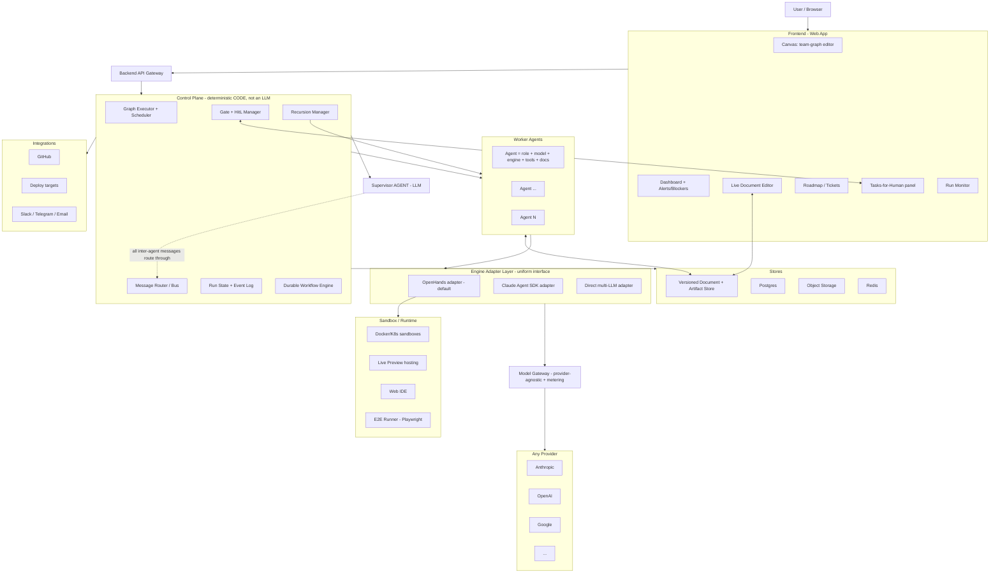
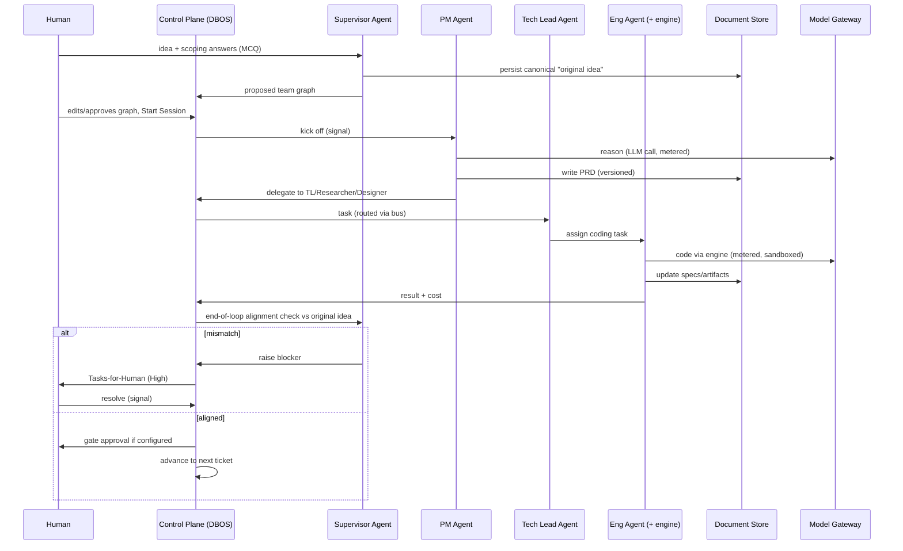
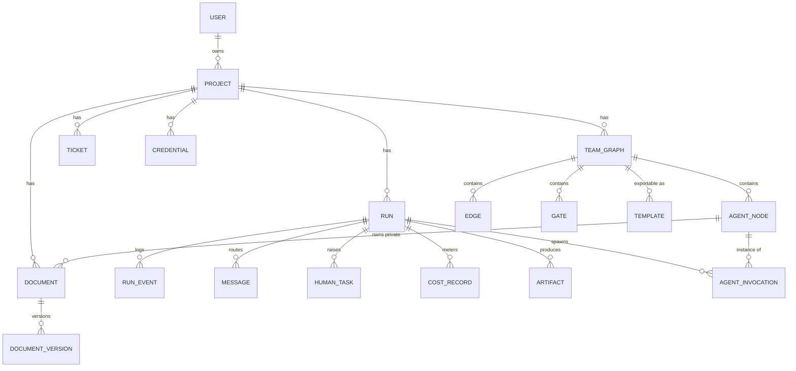

# Tvashtr — Project Plan

> **Living document.** The single source of truth for scope, architecture, decisions, and build sequence.
> Maintained by the architect/planner chat (Tvashtr-N) via direct filesystem access. Updated at the end of each step and before every handover.
>
> **Last updated:** 2026-06-10 by **Tvashtr-2** — *Phase 0 stack locks ✅ signed off by operator; P0.1 prompt issued.*
>
> **Project root:** `/Users/adimac/Desktop/Tvashtr` — where Claude Code runs. The architect chat maintains the living docs here **directly** via the Filesystem MCP.

---

## 0. How to use this document

- This file is the **contract** between planning chats and implementation (Claude Code). Anything not written here is not yet decided.
- **Decisions** are recorded in §17 (Decision Log) with rationale. When we change our minds, we *amend the log*, we don't silently rewrite history.
- **Status conventions** used throughout: `DECIDED` (committed), `CANDIDATE` (leading choice, pending verification), `DEFERRED` (intentionally postponed, designed-for but not built), `OPEN` (unresolved question).
- Tool/vendor *brand names* are mostly `CANDIDATE` and get locked in the **Phase 0** research step before any build prompt depends on them. The architectural *patterns* are `DECIDED`.

---

## 1. Overview & Vision

### One line
**Tvashtr is a canvas for composing and running your own teams of AI agents that take a product idea to working software.** It's a place to *build* the AI team, not just *use* one.

### What it is
Instead of running a fixed pipeline, the user **authors the team**: which roles exist (research, PM, design, engineering, testing, or anything they define), how work and reviews flow between them, where the review/human gates sit, and which model each agent runs on. A **Supervisor** instantiates and runs the team that was drawn. Any agent can spawn sub-agents to **arbitrary depth**. The work products — PRDs, designs, specs — are **real, live-editable documents**, not state hidden inside agent memory, so the user steers continuously rather than only at kickoff. The loop ships features iteratively, each one **reviewed against the original idea** before the next is added.

### The problem (the gap we fill)
Two capable worlds exist, and the useful combination sits in the gap between them:

- **Composability without autonomy.** Code frameworks (LangGraph, AutoGen, CrewAI) let developers build custom multi-agent systems — but you hand-write the orchestration, message passing, retries, and state, which gates them to engineers. Visual no-code builders (n8n, Dify, Langflow) exist, but they target **business automation** (sales/support/ops), not shipping an actual application.
- **Autonomy without composability.** Autonomous coding agents (Devin, OpenHands, Cursor agents) ship software, but the **team and process are a black box**: you give an idea, code comes out, and you can't reshape who's on the team or edit the intermediate PRD as a first-class document.

**Tvashtr's pain removed:** today you can't get *composability-of-the-team* without writing all the orchestration yourself, and you can't get *autonomy-of-output* without surrendering control of the process. Tvashtr delivers both.

### Positioning vs. neighbors
- **MetaGPT** — closest conceptual cousin (a simulated software company: PM/Architect/Engineer/QA running requirements→design→code→tests). But it's a **code framework with largely fixed roles**, not a composable no-code canvas.
- **Relevance AI / Dust / Lindy / n8n / Dify / Langflow** — visual agent/"AI workforce" builders, but pointed at **business automation**, not app-shipping.
- **Emergent** — straddles full-stack building + multi-agent autonomy, but not author-your-own-team.
- **Devin / OpenHands / Cursor agents** — own the idea→shipped-code lane, but as an **opaque, fixed** process.

**The claim is the *combination*, not an empty gap:** author-your-own-team **+** live documents **+** iterative, idea-anchored shipping.

### The thesis (and the honest framing)
Composability — *"the team is mine"* — is the **differentiator**. It is best understood as a **vitamin** (delightful for power users) layered on top of a **painkiller** (idea actually becomes working software). Both must work, but the painkiller must work *first* — there is nothing worth composing a team around if the team can't ship.

### What success looks like
- **Near-term:** Tvashtr builds something *real* that the operator would otherwise have built by hand, **and** composability **earns its keep at least once** — the team or a gate is reshaped mid-project and it **measurably mattered**. (That last clause is the whole thesis: if reshaping never helps, we've built a fixed pipeline with extra knobs. This makes *"a team/gate change must be legible and attributable"* a **product requirement**, not just a metric — see §14.)
- **A year out (either is a win):** a small base of power users **authoring and sharing** teams, with a **template ecosystem** beginning to form — *or* a **portfolio-grade artifact** demonstrating serious AI-systems-plus-product capability.

### Commercial posture
All four matter; priority order **(b) → (a) → (d) → (c)**:
- **(b)** A **power-user product** others use, eventually authoring and sharing teams. *(primary north star)*
- **(a)** A **personal tool** to build real things.
- **(d)** A **portfolio artifact** demonstrating capability.
- **(c)** **Open source** publication.

**Center of gravity:** *single-operator-usable immediately, architected so multi-user + team-sharing later is not a rewrite.*

---

## 2. Goals & Non-Goals

### Goals (the product we are building toward)
1. Author an arbitrary agent **team graph**: any roles, any work/review wiring, gates anywhere.
2. **Per-agent** choice of **model** (any provider) **and** execution **engine**.
3. **Arbitrary-depth** sub-agent recursion, owned by Tvashtr (not capped by a vendor runtime).
4. **Live, versioned, human-editable** work documents (PRDs/specs/designs) as the system's spine.
5. A **Supervisor** that scopes the idea, drafts the team, runs it, and checks each loop against the original idea.
6. **Idea → working software**, shipped feature-by-feature, with **human-in-the-loop** gates and blockers.
7. **Greenfield and brownfield** (import an existing repo and add features).
8. Multiple **output surfaces**: live preview, web IDE sandbox, PR against a repo, clone/ZIP export.
9. **Reliable, resumable, observable** runs with **first-class cost/runaway control**.

### Non-Goals for v1 (`DEFERRED` — designed-for, not built)
- **Auth, accounts, multi-tenancy** hardening.
- **Billing / subscriptions.**
- **Team-template sharing / marketplace** (the data is designed portable from day one; the *sharing infrastructure* is later).
- **Mobile / desktop / CLI** clients (web first).
- **Native cross-provider sub-agent parity as a vendor feature** — we provide recursion ourselves instead (see §7 D3).
- **OSS-publishability driving the stack** — (c) is last; we use whatever is pragmatic, proprietary APIs included.
- **Real-time Google-Docs-grade simultaneous co-editing** of the same document section in v1 (see §13 Risk 2).

---

## 3. Users & Personas

### Primary — "The product-literate solo builder"
A **technical founder, "product engineer," or AI PM** who has *opinions about process* and wants to **orchestrate an agent team without coding the orchestration**. Comfortable with the conceptual weight of roles, wiring, gates, and editing a PRD mid-run. Artifact-centric thinking (editable PRDs/designs) is native to them.

**Jobs-to-be-done:**
- "Turn my idea into shipped software without becoming the human glue between five chat windows."
- "Design the *process* — who reviews what, where I get to approve — not just the prompt."
- "Steer the work continuously by editing the actual documents, not by re-prompting."
- "Reshape the team when reality demands it, and *see* that it helped."

### Secondary — "The team / org" (`DEFERRED`)
Multiple collaborators on shared projects and shared team templates. Drives the eventual auth/multi-tenancy/marketplace work. Out of scope for v1 but the architecture must not preclude it.

---

## 4. Key User Journeys

### J1 — Idea → shipped feature (the core loop)
1. **Onboard / open dashboard** → see active projects, alerts/blockers, global settings (LLM keys, provider prefs).
2. **Create project** → a chat opens with the **Supervisor Agent**. Optionally set the Supervisor's model, connect a GitHub repo (greenfield or brownfield), supply a design system.
3. **Guided scoping** → Supervisor asks pointed questions about strategy, audience, design, architecture, data — presented as **MCQs** plus *"Decide for me"* and a free-text box (low-friction intake). The **original idea** is captured as a canonical, persisted artifact.
4. **Team drafted** → Supervisor proposes a customized **team graph** (e.g., Researcher, PM, Designer, Frontend, Backend, Tech Lead, Content). The canvas opens.
5. **Start session** → each agent generates its standardized **role/context document**; the run begins. PM writes the PRD and delegates; Tech Lead assigns coding to Frontend/Backend; Researcher analyzes; documents fill in live.
6. **Per-loop alignment** → after each loop the Supervisor checks the build against the **original idea**; mismatches raise a **blocker** and realign sub-agents.
7. **Human gates** → at user-defined stopping points (and on blockers), the run pauses for approval; "Tasks-for-Human" populates.
8. **Ship** → on passing tests (human or automated E2E), code is committed/merged; the feature is reviewed against the idea; the Supervisor advances to the next roadmap ticket per the user's automation settings.

### J2 — Compose / reshape the team (the differentiator)
The user edits the graph: add/remove nodes, rewire work/review edges, place or move gates, set each node's model + engine + tools + instructions. Changes apply **mid-session** or **deferred to end-of-loop** per preference; **pending changes render semi-transparent/disabled** until applied. The effect of a change is **instrumented and attributable** (see §14).

### J3 — Steer mid-run via live documents
While a run is in progress, the user opens a live document (PRD/spec/design), edits it, and the change propagates to the relevant agents on their next read. The document — not agent memory — is the source of truth.

### J4 — Handle a blocker (human-in-the-loop)
The **Tasks-for-Human** panel separates **High/blockers** (essential config/data the agents need — API keys, manual SQL, a decision) from **Low/nudges** (verification that doesn't halt background progress — e.g., a visual smoke check). Blockers pause the dependent branch; the run resumes on resolution.

### J5 — Ship / export
The user chooses any of: **live preview URL**, **web IDE sandbox**, **PR** against a connected repo, or **clone/ZIP** export.

---

## 5. Guiding Architectural Principle

> **Tvashtr owns the orchestration; execution engines are pluggable commodities behind a uniform adapter.**

Every flexibility axis the operator requires — any roles, any wiring, any model per agent, any engine per agent, arbitrary recursion, live docs, gates anywhere — lives in **our** layer, where we control it and never inherit a vendor's ceiling. The one thing we *wrap* rather than rebuild is the unglamorous **coding engine** (the observe→edit→run→test loop plus its sandbox), because that is a genuine multi-year problem others have already solved well — and we wrap a **model-agnostic, self-hostable, forkable** one so even that choice caps nothing.

**Analogy:** we are not buying one car. We build the **chassis, dashboard, and steering** — the part you actually drive — and fit a **swappable engine bay** that accepts any engine block we bolt in.

---

## 6. System Architecture

### 6.1 Component diagram

### 6.2 The nine layers
1. **Frontend / Canvas** — node-graph team editor; dashboard; live document editor; agile roadmap/tickets; "Tasks-for-Human" panel; run monitor. Responsive web.
2. **Control Plane (deterministic — code, not an LLM).** The orchestration brain: graph executor + scheduler, the message router that *is* the comms bus, durable run state + event log, gate/HitL manager, recursion manager — all on a **durable workflow engine** so long, human-interruptible, *cyclic* runs are resumable, observable, and crash-safe.
3. **Supervisor Agent (LLM).** Guided scoping, team-graph drafting, and the per-loop alignment check against the original idea. It is **one of the agents the Control Plane runs** — not the plumbing (see §7 D2).
4. **Worker Agents.** Each is a spec: `role + model + engine + tools + documents + instructions`. Fully user-defined.
5. **Engine Adapter Layer.** Uniform interface over execution backends. **OpenHands = default** (model-agnostic, sandbox included, MIT/forkable); **Claude Agent SDK** and a **direct multi-LLM** adapter are secondary; new engines slot in without touching anything above.
6. **Model Gateway.** Provider-agnostic routing so any node uses any model from any provider; the single chokepoint for API keys, **cost metering**, and rate limits.
7. **Sandbox / Runtime.** Where code executes (Docker/K8s), plus live-preview hosting, a web IDE, and the Playwright E2E runner.
8. **Stores.** Versioned document/artifact store (the live-editable spine), Postgres, object storage, Redis.
9. **Integrations.** GitHub (import/PR/clone), deploy targets, Slack/Telegram/Email.

### 6.3 Core run-loop data flow

### 6.4 Horizontal team vs. vertical recursion (the mental model)
- **Horizontal team (always Tvashtr's job).** The named canvas nodes delegating *across* to each other — an **org chart** with arbitrary depth (Tech Lead → Frontend → …). Provided by the Supervisor + mesh + Control Plane.
- **Vertical recursion (inside one node).** A node parallelizing its *own* work via transient children — **temp contractors** for a rush who report back and vanish. Where a backend offers native parallel subagents we use them opportunistically; the **general arbitrary-depth capability is ours** (Recursion Manager), because native runtime recursion is capped at one level.

---

## 7. Key Technical Decisions (with rationale)

| # | Decision | Status | Rationale |
|---|----------|--------|-----------|
| **D1** | **Engine-adapter pattern; OpenHands as the default engine.** Per-node engine choice, not just per-node model. | `DECIDED` | Standardizing on one vendor runtime caps models + recursion depth; building the coding loop from scratch wastes years on the one solved problem. OpenHands is the only runtime that is itself **model-agnostic, self-hostable, forkable**, and **ships its own Docker/K8s sandbox** — so it constrains nothing. Claude Agent SDK + direct-LLM adapters give breadth. |
| **D2** | **Split the Supervisor into a deterministic Control Plane (code) + a Supervisor *Agent* (LLM).** | `DECIDED` | An LLM can't be both the reasoning brain *and* a reliable, lossless message router / budget enforcer. Routing, scheduling, state, gates, recursion, and caps become **code**; the Supervisor Agent only *thinks*. The single most important robustness decision in the design. |
| **D3** | **Recursion is Tvashtr's primitive — arbitrary depth.** | `DECIDED` | The operator wants "maybe even more" than native spawning, and native runtime subagents are capped at one level. The Recursion Manager instantiates children of any depth as real (possibly ephemeral) graph nodes; native parallel subagents are used opportunistically for cheap fan-out. |
| **D4** | **The team is a *cyclic* graph (with enforced termination), not a DAG.** | `DECIDED` | Review loops (work→review→rework) are cycles. The executor supports loops with explicit termination (gate conditions + loop caps) or runs never end — a key reason a real workflow engine is required. |
| **D5** | **Documents are first-class, versioned entities — never hidden agent memory.** | `DECIDED` | Simultaneously the differentiator *and* the LLM-agnosticism mechanism: agents read/write shared + private markdown, the human edits live, and swapping a node's model preserves context via the document. |
| **D6** | **Per-agent capabilities via MCP tool servers.** | `DECIDED` | "What an agent can *do*" becomes as composable as its role/model/engine. |
| **D7** | **Python backend, React/TypeScript frontend.** | `DECIDED` (stack family) | The execution engines and agent SDKs (OpenHands, Claude Agent SDK) are **Python-native**; the AI ecosystem (LiteLLM, MCP, Playwright bindings) is Python-first. React + a node-graph library is the standard for canvas UIs. |
| **D8** | **A durable workflow engine underpins the Control Plane.** Engine: **DBOS Transact** (Python, MIT); Temporal is the named fallback if we hit a scale/tooling wall. | `DECIDED` (pattern + engine, 2026-06-10) | Long-running, partially-autonomous, human-interruptible cyclic runs must be resumable, crash-safe, and observable. DBOS chosen over Temporal: in-process library over Postgres (zero extra services in Compose); `recv`/`send`/`set_event` map 1:1 onto gates/HitL/status; checkpoint-resume recovery is far more forgiving than Temporal's strict replay determinism — important when Claude Code writes the workflow code. See §17. |
| **D9** | **A provider-agnostic Model Gateway is the single metering chokepoint.** Tool: **LiteLLM** (MIT). | `DECIDED` (pattern + tool, 2026-06-10) | Enables any-model-any-provider per node and makes cost tracking + rate limiting enforceable in one place. LiteLLM remains the self-hosted standard (100+ providers, virtual keys, per-project budgets); OpenHands itself wraps LiteLLM internally, so model identifiers align across the stack. |
| **D10** | **Walking-skeleton-first build sequence** despite a max-flexibility architecture. | `DECIDED` | Flexibility is designed in from day one, but we always keep something running end-to-end and grow outward. Architecture is not compromised for speed; the *sequence* is disciplined. |

---

## 8. Tech Stack (locked 2026-06-10 — Phase 0 research; ✅ operator signed off 2026-06-10)

> Verified against the mid-2026 state of each tool (web research, Tvashtr-2). Adapter boundaries keep any individual swap cheap.

| Layer | Choice | Status | Rationale / notes |
|-------|-----------|--------|-------------------|
| Frontend framework | React + TypeScript + Tailwind | `DECIDED` | Standard, fast, large ecosystem. |
| Canvas / node graph | React Flow (`@xyflow/react`) | `DECIDED` | MIT, actively maintained (2026), the unchallenged standard for node-graph editing; used by Stripe/Typeform; layouting (Dagre/ELK) + a shadcn-style component kit exist. |
| Document editor | TipTap (ProseMirror) | `DECIDED` | Headless (we own the UI), markdown + JSON in/out, huge extension ecosystem. Chosen specifically because its collaboration story **is Yjs** — the Risk-2 upgrade (locks → CRDT) needs no editor swap. Phase-0 skeleton uses a plain render/textarea; TipTap lands in Phase 1. |
| Real-time transport | WebSockets via FastAPI | `DECIDED` | Live run monitor, doc updates, blocker alerts. |
| Backend | Python + FastAPI | `DECIDED` | Aligns with Python-native engines/SDKs; async-friendly. |
| Durable workflow engine | **DBOS Transact** (Python lib, MIT) | `DECIDED` | In-process durable execution over Postgres — no extra cluster. `DBOS.recv()/send()/set_event()` = our gates/HitL/status primitives; durable sleep for days-long waits; programmatic cancel/resume/fork; queues. Checkpoint-resume (vs Temporal's strict replay determinism) is far more forgiving of LLM-written workflow code. Caveat: the Conductor console is proprietary for production use — acceptable; our run-monitor UI is a planned product feature and DBOS state is queryable in Postgres system tables. **Temporal = named fallback** (gold standard, but a separate cluster; Compose officially dev-only). |
| Model gateway | **LiteLLM** | `DECIDED` | MIT, 100+ providers, OpenAI-compatible, virtual keys, per-project budgets, spend tracking; the 2026 self-hosted standard. Skeleton: SDK in-process with our own CostRecord writes; **proxy container lands in Phase 1** when budget enforcement/virtual keys become MVP-critical. OpenHands uses LiteLLM internally → model identifiers align across the stack. |
| Default engine | **OpenHands via its Software Agent SDK** | `DECIDED` (default per D1) | OpenHands now ships a first-class Python SDK (`openhands.sdk`: `LLM`, `Conversation`, workspaces) + a REST agent server — MIT, model-agnostic, sandbox included. This is the engine we call programmatically. |
| Secondary engines | Claude Agent SDK; direct multi-LLM | `DECIDED` (sequence) | Claude Agent SDK verified (Python, pip-installable, bundles CLI; **Claude-only**; native subagents remain flat lead→child; alpha on PyPI but stable core; note the **June 15, 2026 metering change** — separate Agent SDK credit pool on subscription plans). Built as **adapter #2 in Phase 2** to prove the adapter pattern with a genuinely different engine. |
| Sandbox | OpenHands' built-in Docker workspaces | `DECIDED` | The SDK's Docker-sandboxed workspace / agent server is the v1 sandbox. E2B remains the named alternative (e.g. preview hosting later). |
| E2E testing | Playwright | `DECIDED` | DOM interaction, screenshots, visual/functional verification. (Phase 3.) |
| Relational store | Postgres (JSONB for graph specs) | `DECIDED` | Relational integrity + flexible JSON; **also DBOS's durability substrate** — one database serves both. |
| Cache/queue/pubsub | Redis | `DECIDED` | Ephemeral state, pub/sub for live updates. (Introduce when needed; not in the skeleton.) |
| Object storage | S3 / MinIO | `DECIDED` | Artifacts, code bundles, screenshots. (Introduce when needed; not in the skeleton.) |
| Doc concurrency (v1) | Versioned store + soft section locks + agent re-read-before-write | `DECIDED` (2026-06-10, resolves Open Q1) | No CRDT in v1. **Yjs is the named upgrade**, made native by the TipTap choice. |
| Integrations | GitHub App/API; Slack/Telegram/Email (SMTP/SendGrid) | `CANDIDATE` | Import/PR/clone + notifications. Locked when Phase 1/3 reaches them. |
| Local deploy | Docker Compose (v1); K8s later | `DECIDED` | Self-host-first posture. Compose stack is small: backend (FastAPI+DBOS in-process), frontend, Postgres — LiteLLM proxy joins in Phase 1. |

---

## 9. Data Model / Schema

> Relational core in Postgres; graph specs and agent configs stored as JSONB where flexibility matters; documents versioned. This is the **initial** model — expect refinement in Phase 0/1.

### 9.1 Entity-relationship overview

### 9.2 Key entities (initial fields)
- **User** — `id, type(individual|org), settings(jsonb), created_at`. *(Auth deferred; entity exists.)*
- **Project** — `id, user_id, name, description, original_idea(text, canonical), status, design_system_ref, repo_ref, engine_defaults(jsonb), model_defaults(jsonb), budget_caps(jsonb), automation_settings(jsonb), created_at`.
- **TeamGraph** — `id, project_id, version, status(draft|active|archived), layout(jsonb), created_at`. **Serializable/exportable** as a portable spec (foundation for templates/sharing).
- **AgentNode** — `id, team_graph_id, role_name, model_config(jsonb: provider,model,params), engine_config(jsonb: adapter,opts), tool_config(jsonb: MCP servers), system_instructions, position(x,y), status, created_at`.
- **Edge** — `id, team_graph_id, source_node_id, target_node_id, edge_type(work|review|report), conditions(jsonb)`.
- **Gate** — `id, team_graph_id, attached_to(node|edge id), gate_type(human_approval|alignment_check|loop_condition), config(jsonb: loop_limit, threshold, ...)`.
- **Document** — `id, project_id, type(prd|design|spec|role_file|context_file|other), title, scope(shared|agent_private), owner_node_id(nullable), current_content, lock_state(jsonb), created_at, updated_at`.
- **DocumentVersion** — `id, document_id, version, content, author_type(human|agent), author_id, diff, created_at`.
- **Run** *(a.k.a. Session)* — `id, project_id, team_graph_version, workflow_id(durable engine handle), status, idea_snapshot, started_at, ended_at, cost_total`.
- **RunEvent** — `id, run_id, ts, type, source_node_id, payload(jsonb)`. *(The observability/monitor feed.)*
- **Message** — `id, run_id, from_node_id, to_node_id, content, routed_via_supervisor(bool), created_at`. *(The bus record.)*
- **HumanTask** — `id, run_id, priority(high_blocker|low_nudge), blocking(bool), title, description, status(pending|resolved), resolution, created_at`.
- **Ticket** — `id, project_id, title, description, status(backlog|in_progress|review|done), feature_order, run_id, created_at`.
- **AgentInvocation** — `id, run_id, node_id, parent_invocation_id(nullable), depth, status, cost, started_at, ended_at`. *(Tracks recursion / ephemeral children.)*
- **CostRecord** — `id, run_id, invocation_id, provider, model, tokens_in, tokens_out, cost, ts`. *(Written by the Model Gateway.)*
- **Artifact** — `id, run_id, type(code|build|preview_url|screenshot|report), location, meta(jsonb), created_at`.
- **Credential** — `id, scope(user|project), type(github|llm_provider|supabase|slack|...), encrypted_secret, config(jsonb)`.
- **Template** *(deferred)* — `id, source_team_graph_id, author_id, name, description, visibility, spec(jsonb)`.

---

## 10. External Integrations & APIs
- **LLM providers** (via Model Gateway): Anthropic, OpenAI, Google, others — any-model-any-provider per agent.
- **GitHub**: repo import (brownfield), branch/commit, PR creation, clone/export. Likely a GitHub App for scoped access.
- **Sandbox/runtime**: OpenHands' Docker/K8s sandbox; preview hosting; web IDE; Playwright for E2E.
- **Notifications**: Slack, Telegram, Email — live updates, blocker alerts, loop completions.
- **(Later) Supabase / external services** the *built apps* may need — surfaced as HitL blockers when keys/SQL are required.

---

## 11. Infrastructure, Deployment & Environments
- **Project root:** `/Users/adimac/Desktop/Tvashtr` — the codebase Claude Code builds in; the architect chat has direct **Filesystem-MCP** read/write access here.
- **v1 posture:** **self-hostable**, single-operator, low-concurrency. **Docker Compose** for the full stack (frontend, backend/API, control plane + workflow engine, Postgres, Redis, object storage, sandbox runtime).
- **Environments:** `local/dev` first; a `staging`-like single deploy as needed. Production multi-tenant infra is `DEFERRED`.
- **Scale path:** move sandboxes + workers to **Kubernetes** when concurrency demands it; the adapter + workflow-engine boundaries make this an ops change, not a rearchitecture.

---

## 12. Security, Auth & Compliance
- **Auth:** `DEFERRED` for v1 (single operator). Architecture namespaces everything by **project/user** now so multi-user is additive.
- **Secrets:** all credentials (LLM keys, GitHub tokens, service keys) **encrypted at rest**; injected at run time; never written into documents or logs.
- **Code-execution isolation:** agent-run code executes **only in sandboxes** (the engine's containerized runtime); no host access. This is the primary security surface and is treated as such.
- **Runaway/cost as a safety control:** budget caps, depth/loop limits, and a kill switch are security-relevant, not just financial (see §13 Risk 3).
- **Compliance:** none required at v1 (single operator). Revisit if/when multi-user or hosted offering arrives.

---

## 13. Risks, Mitigations, Open Questions & Assumptions

### Top risks (and committed mitigations)
**Risk 1 — Reliable execution of long-running, human-interruptible, *cyclic* agent graphs.**
*Mitigation (`DECIDED`):* durable workflow engine — deterministic, replayable orchestration with LLM/engine calls isolated as activities; **human gates block indefinitely on a signal** (no polling, no lost state); **cycles are loops with enforced termination** (gate conditions + loop caps); the engine's **event history is the observability/monitor feed**. Crash mid-run → clean resume.

**Risk 2 — Concurrent human + agent document editing.**
*Mitigation (`DECIDED` for v1):* versioned store + **soft section locks** + **agents re-read before write** (optimistic concurrency). Guarantees no data loss and few collisions.
*Honest caveat:* this is **not** Google-Docs-grade simultaneous *same-section* co-editing. **CRDT (Yjs/Automerge) is the named upgrade** if that case proves common.
*Deferred decision (`OPEN`):* **how far up the ladder we climb (locks → CRDT)** — decided at build time once we can observe real human/agent contention. Tracked here so it isn't mistaken for settled.

**Risk 3 — Cost / runaway from arbitrary recursion across premium models.**
*Mitigation (`DECIDED`):* layered caps enforced in the Control Plane with the **Model Gateway as the single dollar-metering chokepoint** — per-call token caps; per-agent turn/iteration limits; **recursion depth + max-children-per-node + a global active-agent ceiling**; **per-run and per-project budget hard-stops with threshold alerts**; and a **human kill switch** (reusing Risk 1's interrupt path). First-class, not afterthoughts.

### Other risks
- **Scope is very large.** *Mitigation:* walking-skeleton-first + strict phase sequencing (§15), even with unlimited time.
- **Fast-moving tooling.** *Mitigation:* lock brand names in Phase 0 with fresh verification; keep adapter boundaries so swaps are cheap.
- **Supervisor as a bottleneck/quality risk** (it scopes, drafts, *and* judges alignment). *Mitigation:* its judgments are persisted as documents/events (auditable, editable), and the human can override at gates.

### Assumptions
- Operator manages **time and scope**; the plan sequences by **dependency, not deadline**.
- **Greenfield** Tvashtr codebase, built **via Claude Code**; no inherited repos/designs/accounts.
- **Web-first**; single-operator v1; auth/billing/sharing deferred.
- True **multi-provider** is required (not Claude-only) — this is *why* the engine-adapter + model-gateway design exists.

### Open questions (resolved 2026-06-10 — Tvashtr-2; ✅ operator signed off 2026-06-10)
1. Document concurrency ladder depth (Risk 2). **`RESOLVED`** — v1 locks at versioned store + soft section locks + agent re-read-before-write; **no CRDT in v1**. Yjs remains the named upgrade, made native by the TipTap choice (see §8).
2. Document editor choice. **`RESOLVED`** — **TipTap (ProseMirror)**; skeleton uses a plain render, TipTap lands Phase 1 (see §8).
3. First walking-skeleton engine. **`RESOLVED`** — **OpenHands via its Software Agent SDK.** The original case for Claude Agent SDK ("lighter to call") evaporated: OpenHands now ships an equally light Python SDK, and it is model-agnostic with the sandbox included — so the skeleton exercises the *real* default engine from day one. Claude Agent SDK (Claude-only, alpha on PyPI) becomes adapter #2 in Phase 2.
4. Durable-engine / model-gateway brand locks. **`RESOLVED`** — **DBOS Transact** + **LiteLLM** (rationale in §8 / D8 / D9; Temporal named fallback).

---

## 14. Feature Breakdown (prioritized)

### MVP-critical (painkiller + the spine)
- Deterministic Control Plane on a durable workflow engine (state, scheduling, bus, gates, recursion mgr).
- One Engine Adapter + Model Gateway producing real code in a sandbox.
- Supervisor Agent: guided MCQ scoping → canonical original idea → drafted team graph.
- Versioned, live-editable document layer (PRD/specs/role files).
- Autonomous sprint loop with **per-loop alignment check** + blockers.
- Human gates + **Tasks-for-Human** (High/blockers).
- GitHub greenfield + commit; **one** output surface.
- Cost caps + kill switch.

### Differentiator (the vitamin — must follow closely)
- Full canvas editing: add/remove/rewire nodes, place/move gates, pending-changes semi-transparent, mid-run vs end-of-loop application.
- **Per-agent model AND engine** selection (any provider).
- **Arbitrary-depth recursion** (Recursion Manager).
- Per-agent **MCP tools**.
- **Team graph as serializable/exportable spec.**
- Run monitor (event-log-backed).
- **Composability legibility**: a team/gate change is **visible and attributable** — the product expression of the success metric (§1).

### Depth & autonomy
- Automated **E2E testing agent** (Playwright) + smoke-test automation ("tell it and leave it").
- User-defined **stopping points** + automation settings.
- **All four** output surfaces (live preview, web IDE, PR, clone/ZIP).
- **Brownfield** (import existing repo, add features).
- Notifications (Slack/Telegram/Email).
- **Ticket-based roadmap** UI.

### Deferred (designed-for, not built in v1)
- Auth, accounts, multi-tenancy hardening.
- Team-template **sharing / marketplace**.
- Billing.
- CRDT real-time co-editing (Risk 2 upgrade).

---

## 15. Phased Roadmap / Build Sequence

> Architecture is fully flexible from day one; phases govern *what we turn on*, not how flexible the foundation is. Each phase keeps something running end-to-end.

### Phase 0 — Foundations & Walking Skeleton
**Goal:** prove the orchestration spine + execution end-to-end on the smallest possible slice.
**Scope:** repo scaffold; Control Plane + durable workflow engine spike; **one** engine adapter; minimal Model Gateway; a tiny 2-node graph (e.g., PM + Engineer); one versioned document; minimal canvas (render graph) + minimal doc view; ship one *trivial* feature into a repo.
**Locked in this phase (2026-06-10):** DBOS Transact; LiteLLM; React Flow; OpenHands SDK (engine + sandbox); TipTap (Phase-1 editor); concurrency ladder v1 = soft locks. (§8, §13, §17.)
**Exit criteria:** idea → 2-agent run → one PRD doc → trivial feature committed, resumable across a deliberate crash.

**Prompt decomposition (one Claude Code prompt per step — the working loop):**
- **P0.1 — Scaffold + durable spine.** Monorepo scaffold (FastAPI backend with DBOS in-process, Vite/React/TS/Tailwind frontend stub, Docker Compose with Postgres, Alembic baseline, Makefile, .env handling). A `hello_durable` 3-step workflow proving crash-resume: kill the process mid-workflow, restart, watch it complete from the last checkpoint. Tests included.
- **P0.2 — Model Gateway (minimal) + document layer (minimal).** LiteLLM SDK wrapper (`gateway.complete()`), CostRecord writes from response usage; Document + DocumentVersion tables + CRUD/version API; one durable workflow making a real metered LLM call that writes a versioned doc.
- **P0.3 — Engine adapter + OpenHands.** The `EngineAdapter` interface (our uniform contract) + the OpenHands-SDK adapter; a single agent completes a trivial coding task in a (Docker-sandboxed if low-friction, else local-dir, flagged) workspace; engine events land in RunEvent.
- **P0.4 — The 2-node skeleton run.** Minimal TeamGraph/AgentNode/Edge/Run schema; PM node (direct-LLM via gateway) writes a mini-PRD doc → Engineer node (OpenHands adapter) reads it and ships a trivial feature into a local git repo; whole run is one DBOS workflow; **deliberate mid-run crash + resume** is the acceptance test (= M0's core).
- **P0.5 — Minimal UI.** React Flow renders the 2-node graph with live node status (WebSocket); doc view shows the PRD + version history; a bare run-event feed. M0 exit-criteria walkthrough.

### Phase 1 — The Painkiller (idea → shipped feature, sensible default team)
**Goal:** Tvashtr actually builds real things with a default team, on the real substrate.
**Scope:** Supervisor scoping (MCQ) + drafting; full document layer (versioned, live-editable); the autonomous sprint loop (PM→Tech Lead→FE/BE→review); **per-loop alignment check**; human gates + Tasks-for-Human (blockers); GitHub greenfield + commit/PR; **one** output surface; cost caps + kill switch.
**Exit criteria:** a real, non-trivial feature shipped from an idea with at least one human gate and one resolved blocker.

### Phase 2 — The Vitamin (composability — the differentiator)
**Goal:** "the team is mine," and reshaping it is **legible**.
**Scope:** full canvas editing (add/delete/rewire, gates, pending-changes, mid-run/end-of-loop); per-agent model **and** engine selection; **arbitrary-depth recursion**; per-agent **MCP tools**; team graph **serializable/exportable**; run monitor; **composability legibility instrumentation**.
**Exit criteria:** reshape a team/gate mid-project and **see** the attributable effect — the success metric, demonstrated on the operator.

### Phase 3 — Autonomy & QA Depth
**Goal:** "tell it and leave it," and ship anywhere.
**Scope:** automated **E2E agent** (Playwright) + smoke automation; stopping points + automation settings; **all four** output surfaces; **brownfield** import; notifications; ticket roadmap UI.
**Exit criteria:** a feature shipped with **no manual smoke test**, plus a feature added to an **imported** repo.

### Phase 4 — Multi-user & Sharing (`DEFERRED` until justified)
**Goal:** open it up.
**Scope:** auth, accounts, multi-tenancy hardening, **team-template sharing/marketplace**, billing.
**Trigger:** only when there is something worth opening to others (per posture **b**).

### Cross-cutting (continuous)
Observability & cost dashboards; document-concurrency hardening (locks → CRDT decision); security hardening of secrets + sandbox.

---

## 16. Milestones
- **M0 — Spine proven:** end-of-Phase-0 skeleton (resumable, end-to-end).
- **M1 — First real ship:** end-of-Phase-1 non-trivial feature from an idea.
- **M2 — Composability earns its keep:** end-of-Phase-2 attributable mid-run team change.
- **M3 — Hands-off + anywhere:** end-of-Phase-3 (auto-E2E + brownfield + all exports).
- **M4 — Opened up:** end-of-Phase-4 (only if/when triggered).

---

## 17. Decision Log
> Append-only. Amend by adding a new dated entry, not by editing old ones.

- **2026-06-09 (Tvashtr-1)** — **Name locked:** *Tvashtr* (the Vedic divine artificer — "maker of makers").
- **2026-06-09 (Tvashtr-1)** — **Commercial priority:** (b) power-user product → (a) personal → (d) portfolio → (c) OSS. Center of gravity: single-operator now, multi-user-ready architecture.
- **2026-06-09 (Tvashtr-1)** — **Flexibility is the product.** Operator explicitly chose maximum flexibility over time-to-build ("I don't care if it takes 2 team-years… I will manage it"). This overrides any painkiller-first *architectural* compromise; the *build sequence* remains disciplined (D10).
- **2026-06-09 (Tvashtr-1)** — **Architecture committed:** engine-adapter + OpenHands default (D1); Control-Plane/Supervisor-Agent split (D2); recursion as our primitive (D3); cyclic graph + termination (D4); documents first-class + versioned (D5); MCP per-agent tools (D6); Python/React stack family (D7); durable workflow engine (D8); model gateway (D9); walking-skeleton-first (D10).
- **2026-06-09 (Tvashtr-1)** — **Three top risks accepted with named mitigations** (§13). Risk-2 *concurrency ladder depth* explicitly **deferred** to build-time observation (not settled).
- **2026-06-09 (Tvashtr-1)** — **Approved v1 defaults:** web-first; greenfield Tvashtr built via Claude Code; single-operator/low-concurrency/self-hostable; auth/billing/multi-tenancy/marketplace deferred; sequence by dependency not deadline.
- **2026-06-09 (Tvashtr-1)** — **Project root = `/Users/adimac/Desktop/Tvashtr`** (capital-T; where Claude Code runs).
- **2026-06-09 (Tvashtr-1)** — **Planning (Steps 1–3) complete; PROJECTPLAN.md authored and signed off.** Handing to **Tvashtr-2** to begin **Phase 0**: stack-lock research (verify `CANDIDATE` tools, resolve the four `OPEN` items in §13), then the first walking-skeleton Claude Code prompt. Reason for fresh chat: keep planning context clean; Phase 0 research is its own meaty step.
- **2026-06-09 (Tvashtr-1)** — **Filesystem MCP access granted** to the project root. The architect chat now reads/writes the living docs **directly** in `/Users/adimac/Desktop/Tvashtr`; the earlier "author-in-sandbox, operator-saves" workflow is obsolete.
- **2026-06-10 (Tvashtr-2)** — **Phase 0 stack-lock research complete** (fresh web verification of the mid-2026 state of every candidate). **✅ Signed off by operator 2026-06-10 (see closing entry).** Locks:
  - **Durable engine = DBOS Transact** (Python, MIT), *replacing Temporal as the lock*; Temporal stays the named fallback. Why the switch: (1) in-process library over Postgres — zero extra services in our Compose stack (Temporal self-host is a separate cluster; Compose officially dev-only); (2) `DBOS.recv/send/set_event` + durable sleep map 1:1 onto our gates / HitL / status-feed patterns (their "agent inbox" example *is* Tasks-for-Human); (3) checkpoint-resume recovery tolerates imperfect code far better than Temporal's strict replay determinism — a real consideration when **Claude Code writes the workflow code**; (4) programmatic cancel/resume/fork covers the kill-switch path. Known caveat: Conductor console is proprietary for production use — acceptable because the run-monitor UI is already a planned product feature and DBOS state lives in queryable Postgres system tables. Escape hatch: the Control Plane wraps the engine behind our own interfaces, so a later Temporal migration is contained.
  - **Model gateway = LiteLLM** (confirmed 2026 self-hosted standard: MIT, 100+ providers, virtual keys, per-project budgets, spend tracking). Skeleton uses SDK in-process + our own CostRecord writes; the proxy container lands in Phase 1 for budget enforcement. Alignment bonus: OpenHands wraps LiteLLM internally.
  - **Canvas = React Flow (`@xyflow/react`)** — confirmed MIT, actively maintained, the standard.
  - **Default engine + sandbox = OpenHands via its Software Agent SDK** — OpenHands now ships a first-class Python SDK (`Conversation` API, tools, Docker-sandboxed workspaces, REST agent server), MIT, model-agnostic. This *strengthens* D1.
  - **Document editor = TipTap (ProseMirror)** — headless, markdown+JSON, and its collaboration path **is Yjs**, so the Risk-2 CRDT upgrade needs no editor swap. Skeleton: plain render; TipTap in Phase 1.
  - **Open Q1–Q4 resolved** (see §13): concurrency v1 = soft locks + re-read-before-write (no CRDT); editor = TipTap; **skeleton engine = OpenHands SDK** (the "Claude Agent SDK is lighter" argument evaporated — both are pip installs now, and OpenHands is model-agnostic with sandbox included; Claude Agent SDK — verified Claude-only, alpha-on-PyPI, flat native subagents — becomes adapter #2 in Phase 2); engine/gateway locks as above.
  - Noted for later: Claude **Agent SDK metering change June 15, 2026** (separate credit pool on subscription plans) — relevant when adapter #2 is built. **Claude Managed Agents** (hosted, Apr 2026 beta) observed; not adopted (self-host posture).
  - **Phase 0 decomposed into prompts P0.1–P0.5** (§15); first Claude Code prompt = P0.1 after operator confirmation.
- **2026-06-10 (Tvashtr-2)** — **Operator confirmed all Phase 0 stack locks and the P0.1–P0.5 decomposition.** Locks are final: DBOS Transact, LiteLLM, React Flow, OpenHands SDK (engine + sandbox), TipTap, concurrency v1 = soft locks; Open Q1–Q4 closed. **P0.1 prompt (scaffold + durable spine) issued to Claude Code**; a copy is saved at `prompts/P0.1-scaffold-durable-spine.md`.

---

## 18. Glossary
- **Agent / Node** — a user-defined team member: `role + model + engine + tools + documents + instructions`, rendered as a node on the canvas.
- **Supervisor Agent** — the LLM that scopes the idea, drafts the team, and checks each loop against the original idea. *Not* the plumbing.
- **Control Plane** — the deterministic (code) orchestration layer: executor, scheduler, bus, state/event log, gates, recursion manager, on a durable workflow engine.
- **Engine / Engine Adapter** — the wrapped coding runtime (coding loop + sandbox) behind a uniform interface; OpenHands is the default.
- **Model Gateway** — provider-agnostic model routing + the single cost-metering chokepoint.
- **Gate** — a point in the graph where the run pauses for human approval, an alignment check, or a loop condition.
- **Team Graph** — the authored, serializable, *cyclic* graph of nodes + edges + gates that defines a team.
- **Document** — a first-class, versioned, human-and-agent-editable work product (PRD, spec, design, role/context file).
- **HitL / Tasks-for-Human** — human-in-the-loop work items, split into High/blockers and Low/nudges.
- **Walking skeleton** — the smallest end-to-end slice that exercises every architectural layer at least trivially.
- **Horizontal team vs. vertical recursion** — named nodes delegating across (Tvashtr) vs. a node parallelizing its own work via transient children (opportunistically native; arbitrary depth is ours).
